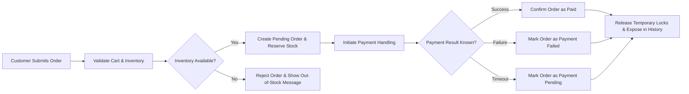

# Non-functional and Compliance Requirements for shoppingMall Platform

## 1. Introduction

THE shoppingMall platform SHALL meet clearly defined non-functional and compliance requirements so that customers, sellers, admins, and guest users can rely on the service as a trustworthy e-commerce marketplace.

THE requirements in this document SHALL define what level of performance, availability, security, privacy, data retention, and regulatory alignment the platform must achieve from a business perspective.

THE development team SHALL remain fully autonomous in deciding how to implement these requirements technically, including architecture, frameworks, infrastructure, databases, and APIs.

## 2. Scope and Relationship to Other Documents

### 2.1 Scope

THE scope of this document SHALL cover cross-cutting non-functional and compliance expectations that apply to:

- User authentication and session handling.
- Product catalog browsing and search.
- Cart and wishlist operations.
- Order creation, payment, shipping, and tracking.
- Reviews and ratings visibility and moderation.
- Seller portal operations.
- Admin operations and governance.

THE document SHALL not redefine functional flows that are already described in other requirement documents. Instead, it SHALL constrain their quality characteristics and legal suitability.

### 2.2 Relationship to Functional Documents

WHEN developers implement the behaviors described in:

- User actors and permissions.
- Authentication and session requirements.
- Product and catalog requirements.
- Cart, wishlist, and order flow requirements.
- Payment, shipping, and tracking requirements.
- Reviews and ratings requirements.
- Seller portal and inventory requirements.
- Admin operations and governance requirements.

THE development team SHALL use this non-functional and compliance document as the reference for how fast, how reliably, and how safely those behaviors must operate.

## 3. Performance and Responsiveness Expectations

### 3.1 General Principles

THE shoppingMall platform SHALL provide response times that feel immediate and predictable to typical users during normal and expected peak load conditions.

WHEN users perform core read operations such as catalog browsing, search, and order history viewing, THE platform SHALL return responses quickly enough that users do not perceive the service as slow.

WHEN users perform state-changing operations such as login, add-to-cart, checkout, and order cancellation, THE platform SHALL return a clear outcome (success or failure) within defined time targets.

### 3.2 Response Time Targets for Customers and Guests

#### 3.2.1 Catalog and Search

- WHEN a guestUser or customer requests a product listing page (for example category listing or home recommendations), THE shoppingMall backend SHALL respond with the list data within 2 seconds for at least 95% of such requests under normal load.
- WHEN a guestUser or customer opens a product detail page, THE shoppingMall backend SHALL respond with product detail data within 2 seconds for at least 95% of such requests under normal load.
- WHEN a guestUser or customer performs a basic search using a single keyword, THE shoppingMall backend SHALL respond with search results within 2 seconds for at least 95% of such requests under normal load.
- WHEN a guestUser or customer performs an advanced search using multiple filters (such as category, price range, and variant attributes), THE shoppingMall backend SHALL respond with search results within 3 seconds for at least 95% of such requests under normal load.

#### 3.2.2 Authentication and Account Flows

- WHEN a user submits valid login credentials, THE shoppingMall backend SHALL respond with either a successful authentication or a clear failure message within 3 seconds for at least 95% of such attempts under normal load.
- WHEN a user initiates password reset, THE shoppingMall backend SHALL accept the request and send a reset initiation response within 5 seconds for at least 95% of such attempts under normal load.

#### 3.2.3 Cart and Wishlist

- WHEN a customer adds an item to the cart, THE shoppingMall backend SHALL respond with updated cart contents and pricing within 1.5 seconds for at least 95% of such actions under normal load.
- WHEN a customer updates item quantities in the cart or removes items, THE shoppingMall backend SHALL respond with the updated cart state within 1.5 seconds for at least 95% of such actions under normal load.
- WHEN a customer adds or removes an item from the wishlist, THE shoppingMall backend SHALL respond with the updated wishlist state within 2 seconds for at least 95% of such actions under normal load.

#### 3.2.4 Checkout and Order Placement

- WHEN a customer opens the checkout page summarizing cart items, shipping address, shipping options, and estimated totals, THE shoppingMall backend SHALL respond with the checkout summary within 3 seconds for at least 95% of such requests under normal load.
- WHEN a customer submits an order for payment authorization, THE shoppingMall backend SHALL respond with a clear outcome (such as payment succeeded, payment failed, or payment pending) within 8 seconds for at least 95% of such attempts under normal load.
- IF payment processing exceeds 15 seconds for any single attempt, THEN THE shoppingMall backend SHALL treat the attempt as timed out from a customer perspective and SHALL show an informative timeout message while ensuring that the final reconciled state of the order is visible later in order history.

#### 3.2.5 Order History and Tracking

- WHEN a customer requests a list of past orders, THE shoppingMall backend SHALL respond with the order list within 3 seconds for at least 95% of such requests under normal load.
- WHEN a customer opens an order detail view including tracking information, THE shoppingMall backend SHALL respond with order and tracking details within 3 seconds for at least 95% of such requests under normal load.

### 3.3 Response Time Targets for Sellers and Admins

- WHEN a seller requests a list of their products or SKUs, THE shoppingMall backend SHALL respond within 3 seconds for at least 95% of such requests under normal load.
- WHEN a seller updates price, stock quantity, or SKU status for a single SKU, THE shoppingMall backend SHALL respond with confirmation of the update within 3 seconds for at least 95% of such requests under normal load.
- WHEN an admin opens an overview dashboard (for example orders summary or refund summary), THE shoppingMall backend SHALL respond with summary metrics within 5 seconds for at least 95% of such requests under normal load.
- WHEN an admin loads detailed views for a specific user, seller, order, or dispute, THE shoppingMall backend SHALL respond within 3 seconds for at least 95% of such requests under normal load.

### 3.4 Bulk, Background, and Degraded Operations

- WHERE sellers or admins trigger bulk actions such as importing many products or updating many SKUs in one request, THE shoppingMall backend SHALL process such operations asynchronously and SHALL provide clear status indicators without blocking normal interactive use.
- WHILE background tasks such as bulk updates or large report generation are running, THE shoppingMall backend SHALL prioritize customer-facing operations (login, search, cart, checkout, order tracking) so that these operations continue to meet their response time targets for at least 95% of requests.
- IF the platform enters a degraded performance state where targets cannot temporarily be met, THEN THE shoppingMall backend SHALL prioritize correctness of order creation, stock handling, and payments over non-critical analytics or reporting, and SHALL provide operational visibility to admins so that mitigation actions can be taken.

## 4. Availability and Reliability Expectations

### 4.1 Uptime Targets

- THE shoppingMall platform SHALL achieve at least 99.5% monthly availability for core customer functions (catalog browsing, product detail viewing, cart, wishlist, checkout, payment, and order tracking), excluding pre-announced maintenance windows.
- THE shoppingMall platform SHALL achieve at least 99% monthly availability for seller portal functions (seller product management, inventory management, and seller order views) and admin dashboards.

WHERE availability is measured, THE platform SHALL define availability as the proportion of time during a calendar month when the relevant endpoints respond successfully within their degradation-tolerant time limits for the majority of users.

### 4.2 Maintenance and Planned Downtime

- WHEN planned maintenance is scheduled that may affect core functions, THE shoppingMall operations team SHALL schedule it during typical low-traffic periods based on the Asia/Seoul timezone.
- WHEN a maintenance window is active and reduces or disables functionality, THE shoppingMall backend SHALL expose a clear operational state so that user-facing channels can inform guestUser, customer, seller, and admin which functions are temporarily unavailable.

### 4.3 Reliability of Critical State Changes

#### 4.3.1 Order Creation Idempotency

- WHEN a customer submits an order request, THE shoppingMall backend SHALL ensure that repeated submissions caused by retries or user refresh do not create duplicate confirmed orders for the same logical payment attempt.
- IF multiple order submissions are received with the same payment reference within a short time window, THEN THE shoppingMall backend SHALL treat them as a single logical attempt and SHALL produce a single final order state (such as confirmed, failed, or pending) visible to the customer.

#### 4.3.2 Inventory Integrity

- WHEN multiple customers attempt to purchase the last remaining stock of a SKU at nearly the same time, THE shoppingMall backend SHALL ensure that the sum of quantities in confirmed orders for that SKU does not exceed the inventory rules defined for that SKU.
- IF inventory is insufficient to satisfy all simultaneous carts, THEN THE shoppingMall backend SHALL deterministically accept some orders and reject or adjust others, and SHALL present clear messages to affected customers that the SKU cannot be purchased in the requested quantity.

#### 4.3.3 Cancellations, Refunds, and Reconciliation

- WHEN a customer submits a cancellation or refund request, THE shoppingMall backend SHALL durably record the request and its timestamp before attempting any external actions such as payment refunds.
- IF a communication with external payment or logistics partners fails during cancellation or refund processing, THEN THE shoppingMall backend SHALL maintain a clear intermediate state (such as refund pending or cancellation pending) and SHALL allow admins to complete or correct the operation later using business tools.

### 4.4 Error Handling and User Communication

- IF a temporary internal error occurs during a critical operation (such as checkout or refund request submission), THEN THE shoppingMall backend SHALL either fully roll back the business operation or complete it in a consistent state and SHALL show a clear message to the user that explains whether the action succeeded or failed.
- IF an external dependency such as a payment processor or shipping tracking service is temporarily unavailable, THEN THE shoppingMall backend SHALL present a message indicating that the external service is unavailable and SHALL instruct the customer to check order history later for the final status, rather than leaving the outcome ambiguous.

### 4.5 Reliability Overview Diagram

This diagram represents business expectations for reliable order and payment handling without prescribing any particular technical design.

## 5. Security and Privacy Requirements

### 5.1 General Security Objectives

THE shoppingMall platform SHALL protect user identities, personal data, payment-related references, and business-sensitive seller and admin information against unauthorized access, misuse, and accidental disclosure from a business perspective.

THE shoppingMall platform SHALL ensure that any access to sensitive business data is governed by actor roles (guestUser, customer, seller, admin) and that every operation is constrained by the permissions defined in the user actors and authentication documents.

### 5.2 Authentication and Session Integrity

- THE shoppingMall backend SHALL require successful authentication for all state-changing operations performed by customer, seller, and admin actors.
- WHEN a guestUser logs in or completes registration and becomes a customer, THE shoppingMall backend SHALL ensure that only the cart and wishlist associated with that guest session are merged into the new customer account and that no data from other users is exposed.
- WHILE a session is active, THE shoppingMall backend SHALL enforce that every protected request includes sufficient information to identify the actor and SHALL check that the actor has permission to perform the requested action.
- IF a session becomes expired or is revoked due to logout, password change, or security events, THEN THE shoppingMall backend SHALL deny further access using that session and SHALL require reauthentication for protected actions.

### 5.3 Role-Based Access Control

- THE shoppingMall backend SHALL ensure that a customer can access only their own profile, addresses, carts, wishlists, orders, and reviews, as defined in the permissions document.
- THE shoppingMall backend SHALL ensure that a seller can access only seller profile data, products, SKUs, inventories, and order segments that are associated with that seller, and cannot directly access other sellers’ data.
- THE shoppingMall backend SHALL ensure that admins can access all customer and seller data only through admin functions designed for governance, monitoring, and support, and not through end-user flows.
- IF any actor attempts to access or modify data that they are not allowed to access according to role rules, THEN THE shoppingMall backend SHALL deny the operation and SHALL record an audit event describing the attempted unauthorized access.

### 5.4 Protection of Payment-Related Data

- THE shoppingMall backend SHALL store only the minimum payment-related information required for business operations, such as masked payment instrument identifiers, provider transaction identifiers, and payment status history.
- THE shoppingMall backend SHALL avoid storing full payment credentials or raw payment tokens in ordinary business records and SHALL ensure that sensitive payment fields are not written to standard logs or sent back to users.

### 5.5 Privacy, Data Minimization, and User Control

- THE shoppingMall backend SHALL collect only the personal data that is necessary to provide marketplace services, including registration, ordering, fulfillment, and support.
- WHEN a customer or seller updates personal data such as name, email, or address, THE shoppingMall backend SHALL apply the changes to future processing while retaining past transactional records that must remain immutable for legal or accounting purposes.
- WHEN a customer or seller requests closure or deletion of their account, THE shoppingMall backend SHALL remove or anonymize direct personal identifiers from ongoing systems while preserving the minimum necessary transactional data in an irreversibly decoupled form wherever legally permissible.

### 5.6 Logging of Security-Relevant Events

- THE shoppingMall backend SHALL log business-level security events including but not limited to: registration, login success, login failure, account lockout, password change, role changes, seller status changes, admin account changes, and critical configuration updates.
- THE shoppingMall backend SHALL ensure that such logs contain enough business context (such as timestamps, actor identifiers, and high-level outcome) to support later investigations without recording sensitive secrets.
- IF a security-relevant event fails to be logged due to technical issues, THEN THE shoppingMall backend SHALL treat this as an operational incident and SHALL surface it in monitoring information for admins.

### 5.7 Fraud and Abuse Detection

- WHEN abnormal behavior patterns are detected, such as unusually high numbers of failed logins, multiple payment failures for high-value orders, or clusters of suspicious refund requests, THE shoppingMall backend SHALL flag the associated accounts or devices for review by admin.
- WHERE fraud detection rules are applied, THE shoppingMall backend SHALL aim to reduce unnecessary friction for legitimate customers while still enabling risk mitigation, for example by applying additional verification only when thresholds are exceeded.

## 6. Data Retention and Audit Requirements

### 6.1 Retention of Transactional Records

- THE shoppingMall backend SHALL retain records of confirmed orders, payments, refunds, and chargebacks for a multi-year period sufficient to support legal, financial, and tax audits, as defined by business policy.
- THE shoppingMall backend SHALL retain shipping information, including shipping addresses and shipping status histories, for at least the period necessary to handle customer support, disputes, and legal obligations.

### 6.2 User Account and Profile Data Lifecycle

- WHILE a customer or seller account is active, THE shoppingMall backend SHALL retain their profile data, contact details, and address book entries for normal operations.
- WHEN a customer or seller requests deletion of their account, THE shoppingMall backend SHALL process the request by:
  - Removing or anonymizing direct personal identifiers from user profile areas that are not bound to legal obligations.
  - Retaining transactional order, payment, and refund records in a form that satisfies legal and accounting requirements while minimizing direct linkability to the former account.
- IF a legal or regulatory requirement prevents full deletion of an account’s data, THEN THE shoppingMall backend SHALL record the reason for the exception and SHALL restrict further use of the retained data strictly to compliance purposes.

### 6.3 Reviews and Ratings Data

- WHILE a review or rating is visible in product pages, THE shoppingMall backend SHALL retain its content, rating score, and associations to product and author for the duration that the product or review remains relevant to other customers.
- WHEN a customer deletes their review, THE shoppingMall backend SHALL remove it from public display and rating aggregation while retaining a hidden copy for audit and abuse prevention for an appropriate period.
- WHEN a customer account is deleted or anonymized, THE shoppingMall backend SHALL either anonymize the author identity shown with past reviews or remove the reviews according to marketplace policy.

### 6.4 Audit Trails for Sensitive Actions

- THE shoppingMall backend SHALL maintain audit trails for security-sensitive and governance-critical actions, including: admin changes to user or seller status, product visibility changes enforced by admin, manual order status overrides, refund and dispute resolution decisions, and policy configuration changes.
- THE shoppingMall backend SHALL store for each audit entry at least: the acting admin or system identity, the time of the action, the high-level type of action, the affected business entity, and the before-and-after state summary.
- THE shoppingMall backend SHALL retain audit trails for at least the same duration as the primary records to which they relate or longer, as defined by compliance policies.

## 7. Regulatory and Compliance Considerations

### 7.1 Privacy and Data Subject Requests

- WHEN a customer or seller requests to access their stored personal data, THE shoppingMall backend SHALL be able to assemble a comprehensive summary of their profile information and high-level transaction history that is associated with their account and SHALL provide it within a business-defined reasonable timeframe.
- WHEN a customer or seller requests correction of inaccurate personal information, THE shoppingMall backend SHALL update the relevant fields while preserving transaction records in a way that maintains historical correctness.
- WHEN a customer or seller requests deletion of their personal data, THE shoppingMall backend SHALL apply the data lifecycle rules described in section 6, and SHALL record that a deletion request was processed, including which parts of the data were deleted, anonymized, or retained.

### 7.2 Consumer Protection and Transparency

- THE shoppingMall backend SHALL maintain a complete state history for orders, including key transitions such as created, payment pending, paid, preparing shipment, shipped, delivered, cancelled, refunded, and disputed.
- WHEN an order state changes, THE shoppingMall backend SHALL record the new state, the time of change, and the actor or process that caused the change (customer, seller, admin, or system automation) in a way that can later be presented in human-readable form.
- WHEN a customer views their order history, THE shoppingMall backend SHALL expose a clear summary of current order state and major past state changes to support transparent communication and reduce disputes.

### 7.3 Financial and Tax Support

- THE shoppingMall backend SHALL maintain accurate records of order totals, taxes (where applicable), fees, commissions, refunds, and payouts so that finance teams can generate legally compliant invoices, settlements, and reports.
- WHEN business stakeholders request transaction reports aggregated by period, seller, or product category, THE shoppingMall backend SHALL provide sufficient underlying data so that such reports can be generated consistently and reconciled against raw transaction histories.

### 7.4 Content and Review Governance

- WHEN a review or product listing is hidden or removed due to policy violations or legal reasons, THE shoppingMall backend SHALL retain a non-public record of the original content, the policy category violated, the time of action, and the responsible admin, for an appropriate retention period.
- WHEN regulations or platform policies require that incentivized reviews or sponsored content be labeled, THE shoppingMall backend SHALL support storing flags that indicate such status so that user-facing channels can display appropriate labels.

### 7.5 Legal Holds and Investigations

- WHEN a legal hold is placed on a set of data such as a customer account, seller account, product, order, or dispute, THE shoppingMall backend SHALL prevent deletion or anonymization of that data until the legal hold is removed.
- WHILE a legal hold is active, THE shoppingMall backend SHALL surface the hold status in relevant admin views so that admins understand why certain deletion or modification actions are not permitted.

### 7.6 Cross-Region Data Handling

- WHERE the platform operates across multiple regions with differing data handling rules, THE shoppingMall backend SHALL support configuration that keeps personal data for customers and sellers in accordance with regional requirements, such as determining whether certain fields may be stored or processed outside specific regions.
- IF data related to a particular account is processed in a region different from the user’s primary region for operational reasons, THEN THE shoppingMall backend SHALL record this fact in a way that allows compliance review and reporting.

## 8. Summary of Key Non-Functional and Compliance Targets

### 8.1 Consolidated EARS Requirements

- THE shoppingMall platform SHALL maintain at least 99.5% monthly availability for core customer functions under normal operating conditions.
- WHEN a customer browses catalogs or views product details, THE shoppingMall backend SHALL respond within 2 seconds for at least 95% of such requests under normal load.
- WHEN a customer submits an order, THE shoppingMall backend SHALL provide a clear outcome within 8 seconds for at least 95% of attempts under normal load.
- WHEN multiple customers compete for the last units of a SKU, THE shoppingMall backend SHALL ensure that confirmed order quantities do not exceed allowed inventory.
- IF a critical operation such as checkout fails due to internal error, THEN THE shoppingMall backend SHALL either complete the operation consistently or not perform any partial change, and SHALL show the customer an understandable error message.
- THE shoppingMall backend SHALL enforce role-based access so that each actor sees only the data and actions allowed by business rules.
- WHEN a user requests deletion of personal data, THE shoppingMall backend SHALL anonymize or remove personal identifiers while retaining the minimum transactional data required for legal and financial obligations.
- THE shoppingMall backend SHALL retain order, payment, and refund records for multi-year periods suitable for legal and tax audits.
- THE shoppingMall backend SHALL maintain audit trails of security-sensitive and governance-critical actions and SHALL prevent ordinary admin operations from altering or deleting these audit entries.
- WHEN disputes or legal holds exist, THE shoppingMall backend SHALL preserve the relevant data and SHALL clearly show that retention is enforced by legal obligations.

THE development and operations teams SHALL use these non-functional and compliance targets as constraints and acceptance criteria when designing, implementing, testing, and operating the shoppingMall backend. All concrete technical solutions remain at their discretion, as long as these business-level requirements are satisfied.