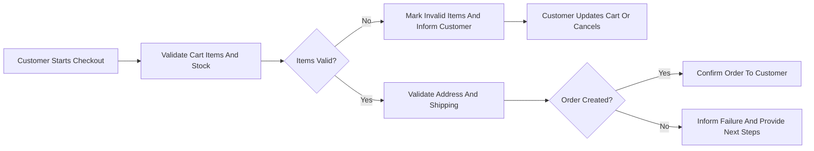

# Exception Handling and User Messaging Requirements for shoppingMall

## 1. Introduction and Purpose

This section defines the business-level requirements for exception handling and user-facing messaging in the **shoppingMall** e-commerce backend. It specifies what error scenarios must be handled, how they must be communicated to users, and which recovery paths must be supported.

The goals are:
- Maintain consistent and predictable behavior across all error scenarios.
- Protect user data and platform integrity while providing clear recovery guidance.
- Enable auditing, monitoring, and continual improvement of platform reliability from a business perspective.

THE shoppingMall platform SHALL treat exception handling as a core part of business behavior, not as an implementation detail.

## 2. Context and Relationships

Exception handling spans multiple domains:
- Authentication and session behavior is described in the authentication and session requirements.
- Cart, wishlist, and order lifecycle behavior is described in the cart, wishlist, and order flow requirements.
- Payment, cancellation, and refund behavior is described in the payment and refund requirements.
- Performance, security, and compliance constraints are described in the nonfunctional and compliance requirements.

THE exception and messaging behavior in this document SHALL remain consistent with those domain-specific documents and SHALL not contradict their business rules.

## 3. General Error Handling Principles

### 3.1 Error Categories

Errors are grouped into the following business categories:

1. Validation errors (invalid or missing inputs).
2. Authentication errors (identity cannot be established).
3. Authorization errors (insufficient permissions).
4. Business rule conflicts (state or policy conflicts).
5. External provider errors (payment or external services).
6. System or unexpected errors (internal or infrastructure failures).

WHEN the platform detects a failure, THE shoppingMall backend SHALL classify the failure into at least one of these categories for logging and analysis.

### 3.2 Cross-Cutting Behavior

- THE shoppingMall backend SHALL present user-facing error messages in clear, non-technical language.
- THE shoppingMall backend SHALL avoid exposing stack traces, internal identifiers, or implementation details in user-facing messages.
- THE shoppingMall backend SHALL ensure each failed business request results in either a successful outcome or a clear error response that includes a recommended next step.
- WHEN an error occurs, THE shoppingMall backend SHALL record internal diagnostic information in logs separate from user-facing messages.
- WHEN an error is classified as severe (for example, data inconsistency or repeated system failure), THE shoppingMall backend SHALL mark the event with elevated severity in logging so that operations teams can take action.

### 3.3 Message Structure Pattern

WHEN the platform provides a user-facing error message, THE shoppingMall backend SHALL support a structured format that contains:
- A short error summary in business terms.
- A brief explanation of what prevented the operation from succeeding.
- Clear guidance on what the user can do next (for example, correct data, retry, or contact support).

WHERE an error is not recoverable by the user (for example, internal system failure), THE shoppingMall backend SHALL indicate that the problem is on the platform side and SHALL advise retrying later or contacting support without suggesting ineffective user actions.

### 3.4 Logging and Monitoring

WHEN an error response is produced, THE shoppingMall backend SHALL log:
- The error category (validation, authentication, authorization, business, external, system).
- The actor type (guestUser, customer, seller, platformAdmin) if known.
- A business-level error code or identifier.
- A timestamp and reference to the affected entity (for example, order or user identifier) where available and allowed by privacy rules.

IF the error is a system or unexpected error, THEN THE shoppingMall backend SHALL mark the log entry so that monitoring systems can raise alerts according to nonfunctional requirements.

### 3.5 Performance of Error Responses

WHILE the platform operates under normal load, THE shoppingMall backend SHALL return error responses within the same response time targets as corresponding successful operations defined in the nonfunctional and compliance requirements.

IF the platform cannot construct a detailed error response within normal response time targets due to internal load, THEN THE shoppingMall backend SHALL return a simplified generic error message rather than timing out without response.

## 4. Authentication and Authorization Errors

This section covers errors for registration, login, password reset, token handling, and access control for guestUser, customer, seller, and platformAdmin.

### 4.1 Registration Errors

WHEN a user attempts to register with missing mandatory fields or invalid formats, THE shoppingMall backend SHALL treat this as a validation error and SHALL identify which fields need correction in business terms.

IF a registration is submitted with an email that is already used by an active account, THEN THE shoppingMall backend SHALL reject the registration and SHALL instruct the user to log in or recover the existing account instead of silently overwriting.

WHEN mandatory policy conditions such as terms acceptance or age confirmation are required and not satisfied, THE shoppingMall backend SHALL block account creation and SHALL instruct the user to complete the required confirmations.

IF a temporary internal error prevents completion of registration after validation succeeds, THEN THE shoppingMall backend SHALL not create a partial account and SHALL inform the user that registration could not be completed, recommending a later retry.

### 4.2 Login and Session Errors

WHEN login credentials are invalid for a given email or identifier, THE shoppingMall backend SHALL reject the login and SHALL provide a generic message that credentials are incorrect without indicating whether the email exists.

WHEN an account is suspended, locked, or deactivated, THE shoppingMall backend SHALL deny login and SHALL state that the account is not available, suggesting contact with support if the user believes the state is incorrect.

WHEN a user attempts to access an authenticated feature with an expired or invalid token, THE shoppingMall backend SHALL require re-authentication and SHALL state that the session has expired for security reasons.

IF a user tries to use a customer or seller account to access platformAdmin-only features, THEN THE shoppingMall backend SHALL block the action and SHALL indicate that the requested operation is not permitted for the current role.

WHEN a user initiates logout, THE shoppingMall backend SHALL invalidate the associated session or tokens and SHALL confirm logout to the user’s client.

IF logout is called with an already invalid session, THEN THE shoppingMall backend SHALL return a success outcome from a user perspective and SHALL treat the user as logged out without raising an error message.

### 4.3 Password Reset and Credential Recovery Errors

WHEN a password reset is requested for an email that does not correspond to any account, THE shoppingMall backend SHALL behave as if the request were accepted but SHALL not reveal whether an account exists for that email.

IF a password reset link or token is used after its validity period or after it has already been used, THEN THE shoppingMall backend SHALL reject the reset attempt and SHALL instruct the user to request a new reset.

WHEN a new password does not meet complexity requirements, THE shoppingMall backend SHALL reject the password change and SHALL provide business-level guidance about password rules.

IF an operation to revoke all active sessions fails internally, THEN THE shoppingMall backend SHALL indicate to the user that the operation may not have completed and SHALL recommend changing the password and contacting support if suspicious activity is observed.

### 4.4 Authorization Errors

WHEN a guestUser attempts an action that requires authentication (for example, placing an order or viewing order history), THE shoppingMall backend SHALL refuse the action and SHALL instruct the user to log in or register.

IF a customer attempts to access or modify resources that belong to another customer (for example, another customer’s order or address), THEN THE shoppingMall backend SHALL deny access and SHALL respond with a generic unauthorized message without confirming the existence of the other user’s data.

IF a seller attempts to manage products, SKUs, or orders that belong to another seller, THEN THE shoppingMall backend SHALL block the operation and SHALL indicate that the resource is not available for that seller account.

WHEN a platformAdmin attempts an admin operation that business policy disallows (for example, irreversible deletion of data that must be retained), THE shoppingMall backend SHALL prevent the operation and SHALL explain the policy restriction in business terms.

## 5. Catalog, Cart, and Order Errors

### 5.1 Catalog and Product Errors

WHEN a user requests a product identifier that does not correspond to any visible product, THE shoppingMall backend SHALL respond as if the product is not available and SHALL not expose whether such an identifier ever existed.

WHEN a product exists but is inactive, removed, or hidden by policy, THE shoppingMall backend SHALL prevent that product from being added to cart or wishlist and SHALL indicate that the product is not currently available for purchase.

WHEN a user requests a category that does not exist or has been deactivated, THE shoppingMall backend SHALL indicate that no such category is available and SHALL not expose internal category identifiers.

IF a user selects a combination of variant options that does not map to an existing SKU, THEN THE shoppingMall backend SHALL indicate that the chosen combination is unavailable and SHALL request selection of a valid variant.

### 5.2 Inventory and Out-of-Stock Errors in Cart

WHEN a user attempts to add a SKU to cart with a quantity greater than the allowed quantity or greater than available-to-sell stock (when backorders are not allowed), THE shoppingMall backend SHALL cap the quantity to the maximum allowed and SHALL notify the user of the cap.

WHEN a SKU previously in the cart becomes out of stock before checkout is completed, THE shoppingMall backend SHALL prevent checkout including that SKU and SHALL require the user to remove or adjust that cart item.

WHEN inventory changes during checkout due to concurrent orders, THE shoppingMall backend SHALL revalidate stock just before order creation and IF any SKU becomes unavailable, THEN THE shoppingMall backend SHALL inform the user which items are affected and SHALL not silently complete the order with missing items.

### 5.3 Cart Data Integrity and Concurrency Errors

IF the shoppingMall backend detects that a cart reference is invalid, corrupted, or inconsistent with catalog data, THEN THE shoppingMall backend SHALL rebuild the cart from the last consistent state if possible or start an empty cart and SHALL inform the user that the cart was refreshed.

WHEN cart contents have changed due to another device or session since the user last viewed the cart, THE shoppingMall backend SHALL ensure the latest state is shown and SHALL allow the user to reconfirm before checkout.

IF guestUser cart data has expired or is no longer available according to retention rules, THEN THE shoppingMall backend SHALL start a new empty cart and SHALL not reference individual lost items in user-facing messages.

### 5.4 Order Creation Errors

WHEN a customer initiates order creation and mandatory data such as shipping address, supported region, or required contact details are missing or invalid, THE shoppingMall backend SHALL block order creation and SHALL identify which information must be corrected.

WHEN cart validation during checkout identifies items that are no longer sellable (for example, product deactivated, SKU removed, or severe policy change), THE shoppingMall backend SHALL either:
- Create orders only for remaining valid items and remove invalid items from cart, or
- Block order creation entirely,
according to the configured business policy, and in either case SHALL clearly identify affected items to the customer.

WHEN prices or promotions change between cart viewing and checkout, THE shoppingMall backend SHALL recalculate totals prior to final confirmation and IF totals increase, THEN THE shoppingMall backend SHALL require explicit confirmation from the customer before proceeding.

IF an internal error occurs after an order identifier is generated but before all order lines or seller segments are saved consistently, THEN THE shoppingMall backend SHALL move the order to a clearly defined inconsistent or pending state that prevents shipment and SHALL flag the order for administrative review while informing the customer that confirmation is delayed or failed.

IF a customer attempts to place an order with a shipping address that cannot be serviced by sellers or carriers for any item, THEN THE shoppingMall backend SHALL block order creation and SHALL indicate that the address is not eligible for one or more items.

### 5.5 Order Access and Status Errors

WHEN a customer attempts to view an order identifier that does not belong to that customer, THE shoppingMall backend SHALL deny access and SHALL not reveal whether the order exists.

WHEN an order identifier has been purged or archived beyond the accessible retention period, THE shoppingMall backend SHALL indicate that the order can no longer be retrieved in detail, while still complying with any legal retention of high-level records.

WHEN a customer requests an action (such as cancellation or modification) that is not allowed for the order’s current state, THE shoppingMall backend SHALL reject the action and SHALL explain that the order is no longer eligible for that action due to its current status.

### 5.6 Cart and Order Error Flow Diagram

## 6. Payment and Refund Errors

### 6.1 Payment Initiation Errors

WHEN a customer selects a payment method that is not enabled or not available for the order’s currency or amount, THE shoppingMall backend SHALL prevent proceeding and SHALL prompt the customer to choose another method.

WHEN required payment-related data (such as billing address where mandatory) is missing or invalid, THE shoppingMall backend SHALL block payment initiation and SHALL identify what data must be supplied.

IF an external payment provider cannot be contacted or returns a technical error during initiation, THEN THE shoppingMall backend SHALL not mark the order as paid and SHALL inform the customer that payment could not be initiated and that they may retry or select another method.

WHEN a customer abandons the payment flow before receiving any success confirmation (for example, closing the payment window), THE shoppingMall backend SHALL treat the order as not paid and SHALL display its status as unpaid or payment pending according to payment rules, allowing retry where supported.

### 6.2 Payment Confirmation Errors

WHEN the payment provider explicitly declines a payment, THE shoppingMall backend SHALL mark the associated payment attempt as failed, SHALL keep the order in a non-fulfillable payment state, and SHALL inform the customer that the payment was declined without exposing provider-specific codes.

WHEN a payment confirmation does not arrive within the configured timeout window, THE shoppingMall backend SHALL place the order in a pending-payment or expired-payment state and SHALL inform the customer that payment status is uncertain and may require retry or later confirmation.

IF the amount confirmed by the payment provider differs from the expected order amount, THEN THE shoppingMall backend SHALL treat this as a mismatch, SHALL avoid treating the order as fully paid, and SHALL initiate internal reconciliation before allowing fulfillment.

WHEN payment attempts for the same order exceed a configured safe threshold, THE shoppingMall backend SHALL block further payment attempts for that order and SHALL instruct the customer that the limit has been reached and that support may be needed.

### 6.3 Refund and Cancellation Errors

WHEN a customer requests cancellation for an order in a state where cancellation is disallowed by business policy (for example, fully shipped and outside any cancellation window), THE shoppingMall backend SHALL deny the cancellation and SHALL explain that the order is no longer cancellable.

WHEN a refund request is submitted for an order or item not eligible under current refund rules (for example, beyond the allowed time window or marked as non-refundable), THE shoppingMall backend SHALL reject the request and SHALL describe the applicable policy category (such as "past refund period").

IF a requested refund amount exceeds the paid amount for the relevant items and fees, THEN THE shoppingMall backend SHALL either adjust the refund to the maximum permissible amount or reject the request, and in both cases SHALL explain the limit.

WHEN a refund attempt fails due to an external payment provider error, THE shoppingMall backend SHALL record the refund as failed or pending resolution, SHALL alert platformAdmin or support processes, and SHALL inform the customer that the refund has not been completed and is under review.

WHEN a chargeback or existing dispute exists for a payment and a new refund request is made for the same items, THE shoppingMall backend SHALL avoid double processing and SHALL indicate to the customer that a dispute or refund is already in progress.

### 6.4 Order History and Payment Visibility Errors

WHEN a customer requests payment or refund details for an order belonging to another customer, THE shoppingMall backend SHALL deny access and SHALL respond with a generic unauthorized message.

WHEN detailed payment or refund details have been removed or anonymized according to retention rules, THE shoppingMall backend SHALL indicate that detailed financial records are no longer available while still showing the minimum necessary order summary permitted by policy.

## 7. User Notifications and Messaging Tone

### 7.1 Tone and Style

THE shoppingMall backend SHALL support user-facing messages that are neutral, professional, and supportive.

WHEN describing errors, THE shoppingMall backend SHALL focus on stating what happened and what the user can do next, and SHALL avoid language that blames the user.

### 7.2 Notification Triggers (Business-Level)

WHEN an order creation fails after the user confirms checkout, THE shoppingMall backend SHALL immediately inform the user within the same interaction that the order was not created and SHALL identify the primary reason category (validation, payment, or system issue).

WHEN a payment attempt definitively fails or is declined, THE shoppingMall backend SHALL notify the user in the checkout context and, where configured as part of business policy, SHALL also trigger an out-of-band notification with a summary of the failure.

WHEN a refund request is accepted and the refund operation is initiated, THE shoppingMall backend SHALL notify the user that the refund is approved and SHALL state that funds will appear according to the general refund timeline defined by business policy.

WHEN a refund request is rejected, THE shoppingMall backend SHALL notify the user and SHALL state the high-level policy reason (for example, outside refund window or product category not refundable).

WHEN an account-sensitive operation fails (for example, password reset token invalid or account locked), THE shoppingMall backend SHALL provide immediate feedback in the current interaction and, where appropriate and allowed by policy, SHALL send an additional notification to the registered contact method.

WHEN an issue arises after order confirmation that affects fulfillment (for example, seller cannot fulfill an item), THE shoppingMall backend SHALL notify the customer of the change in order status, the impact on the order, and available options such as partial cancellation or alternative resolution per business rules.

### 7.3 Localization and Accessibility

WHERE the platform supports multiple languages, THE shoppingMall backend SHALL provide error messages in the language associated with the user’s preference or session configuration, with a defined fallback language.

THE shoppingMall backend SHALL ensure that core meaning is consistent across translations so that equivalent error situations are communicated consistently.

THE shoppingMall backend SHALL avoid relying solely on visual cues such as color to indicate errors and SHALL ensure that message text carries the necessary meaning for accessibility.

### 7.4 Message Content Structure

WHEN generating user-facing error messages, THE shoppingMall backend SHALL include:
- A short summary suitable for display as a headline.
- A short explanation that references business concepts (for example, payment provider, stock availability, or policy rule) without technical jargon.
- Specific guidance on user options, such as retry, correct input, choose another payment method, or contact support.

IF an error requires manual intervention by support or platformAdmin, THEN THE shoppingMall backend SHALL ensure that user-facing messages encourage appropriate contact and that internal references (such as order number or error reference code) exist to correlate the case.

## 8. Consolidated Recovery Path Requirements

### 8.1 Authentication and Account Recovery

WHEN a user experiences a login failure that is not due to account suspension, THE shoppingMall backend SHALL allow additional attempts up to configured limits and SHALL provide access to password reset flows.

IF repeated login attempts exceed configured thresholds, THEN THE shoppingMall backend SHALL apply security measures such as temporary lockout and SHALL inform the user about lockout duration or required next steps.

WHEN a session expires during an ongoing interaction, THE shoppingMall backend SHALL require re-authentication and WHERE safe SHALL preserve non-sensitive context (for example, cart content) so that the user can continue after login.

### 8.2 Catalog, Cart, and Order Recovery

WHEN cart validation fails due to invalid data, THE shoppingMall backend SHALL keep valid cart items and SHALL highlight invalid items or fields so the user can correct them.

WHEN items in the cart become unavailable or disallowed, THE shoppingMall backend SHALL allow the user to remove or replace such items and SHALL not silently drop items from the order without clear indication.

IF an internal error occurs after payment initiation but before order confirmation, THEN THE shoppingMall backend SHALL reconcile payment status with the payment provider and SHALL avoid creating duplicate orders when a user retries; it SHALL instruct the user based on the reconciled outcome.

### 8.3 Payment and Refund Recovery

WHEN a payment attempt is declined by the provider, THE shoppingMall backend SHALL allow the user to choose a different payment method or retry the same method where reasonable, within business-defined limits.

WHEN payment status is uncertain due to timeout or communication issues, THE shoppingMall backend SHALL place the order into a clearly defined pending state and SHALL either:
- Automatically confirm or cancel the order once a definitive provider outcome is received, or
- Require manual intervention,
according to payment policy, and SHALL keep the customer informed that status is being verified.

WHEN a refund attempt fails, THE shoppingMall backend SHALL not discard the request; it SHALL mark the refund as failed or pending and SHALL ensure there is a clear process for follow-up by platformAdmin or support.

### 8.4 Support Escalation

IF a user encounters an error that cannot be resolved through self-service actions described in messages, THEN THE shoppingMall backend SHALL provide a path for the user to contact support or open a support case, including any relevant reference identifiers.

WHEN support-facing identifiers such as error reference codes are generated, THE shoppingMall backend SHALL ensure that these identifiers are included in both the logs and the user-facing message so that support can correlate the case without the user having to describe technical details.

## 9. Non-Functional Aspects of Error Handling

### 9.1 Response Time Expectations

WHILE the platform operates within normal load as defined in the nonfunctional and compliance requirements, THE shoppingMall backend SHALL return error responses within the same performance targets as the equivalent successful operations.

IF system degradation prevents normal detailed error handling, THEN THE shoppingMall backend SHALL still return a simplified error response rather than leaving requests unresolved.

### 9.2 Auditability and Logging

WHEN significant error events occur, THE shoppingMall backend SHALL create audit log entries including actor type, feature area (for example, authentication, checkout, payment), and an error category.

THE shoppingMall backend SHALL support generating aggregated reports that group errors by category, feature area, and actor type to allow detection of systemic issues.

WHERE regulations require retention of error-related records, THE shoppingMall backend SHALL retain the relevant logs for at least the minimum required period while following privacy policies.

### 9.3 Privacy and Security in Error Handling

THE shoppingMall backend SHALL ensure that error messages never reveal personal data about any other user or sensitive internal identifiers.

WHEN handling authentication or account recovery errors, THE shoppingMall backend SHALL avoid confirming whether a specific email or identifier exists, except where explicitly allowed by policy.

WHEN handling payment-related errors, THE shoppingMall backend SHALL never expose full payment instrument details and SHALL describe issues using generic descriptions (for example, "payment provider declined the transaction").

## 10. Summary of Key Error Handling Policies

THE shoppingMall backend SHALL apply consistent error categorization and message patterns across all domains.

THE shoppingMall backend SHALL provide clear, business-focused messages and recovery guidance for users while logging detailed technical information separately for operators and support.

THE shoppingMall backend SHALL ensure that error handling respects performance, security, privacy, and compliance constraints defined in the nonfunctional and compliance requirements and supports reliable operation of the entire shoppingMall platform.