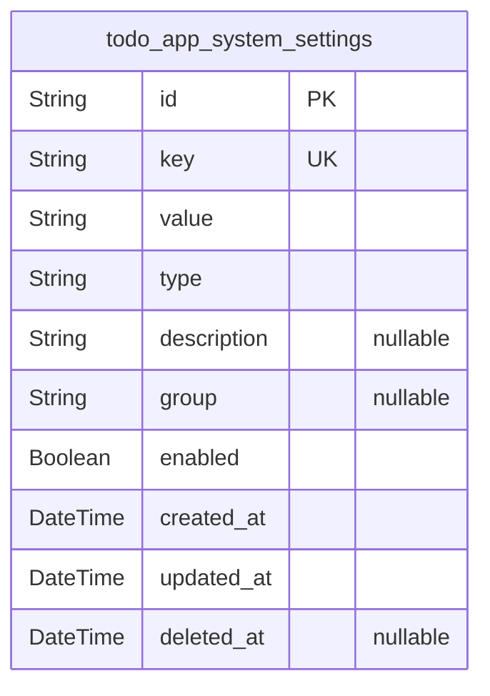
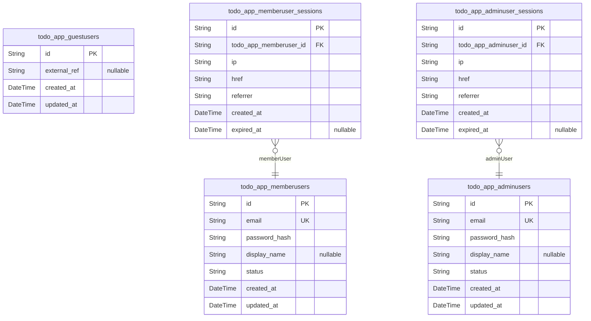
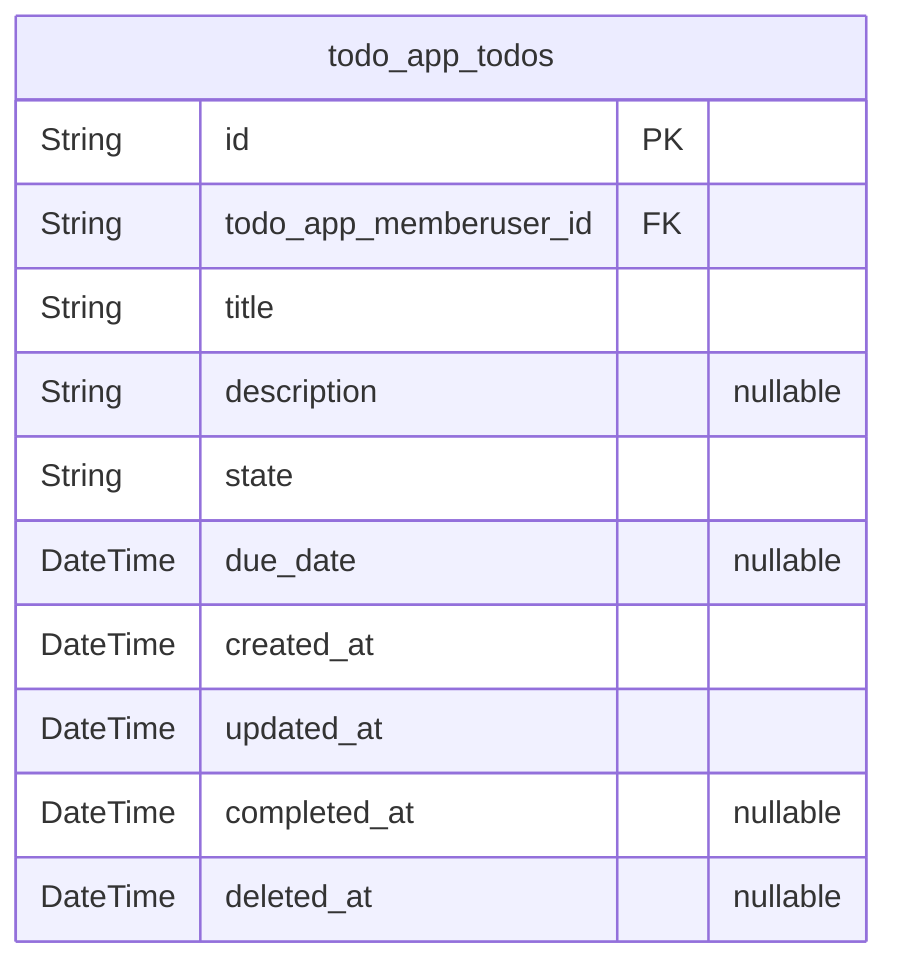

# Prisma Markdown

> Generated by [`prisma-markdown`](https://github.com/samchon/prisma-markdown)

- [Systematic](#systematic)
- [Actors](#actors)
- [Todos](#todos)

## Systematic

### `todo_app_system_settings`

Global configuration and feature flag entries for the todoApp backend.

This table stores system-wide settings such as per-user maximum todo
limits, enabling or disabling optional features, and other cross-cutting
configuration that is not tied to a specific user or todo item. Each row
represents one named setting with a unique key, a typed raw value, and
optional metadata for description and grouping.

Application logic reads these settings to control behavior at runtime,
for example enforcing the maximum number of active todos per member user
or enabling minimal state-based filtering. Operators can manage entries
independently via dedicated administration interfaces without touching
core business entities like users or todos.

Settings are soft deletable to allow safe deprecation while preserving
audit history. No foreign keys are used since settings are global and not
owned by any actor or business entity.

Properties as follows:

- `id`
  > Primary key.
  >
  > Uniquely identifies a system setting record in the todoApp backend.
  > Generated as a UUID for global uniqueness across environments.
- `key`
  > Unique business key for the setting.
  >
  > Used by application code to look up configuration values, such as
  > "max_active_todos_per_user" or "enable_state_filtering". Must be unique
  > across all settings.
- `value`
  > Raw value of the setting stored as a string.
  >
  > Application logic interprets this value according to the associated type
  > field. Examples include numeric limits ("10000"), boolean flags ("true"),
  > or other scalar configuration values.
- `type`
  > Semantic type of the setting value.
  >
  > Indicates how the application should interpret the `value` field, for
  > example "int", "boolean", "string", or "double". This keeps the table
  > normalized while allowing strongly typed handling in business logic.
- `description`
  > Optional human-readable explanation of the setting.
  >
  > Describes the purpose, usage, and impact of the configuration entry so
  > operators understand how it affects todoApp behavior.
- `group`
  > Optional logical group or category for the setting.
  >
  > Helps organize settings into domains such as "limits", "features", or
  > "experimental" for easier management and discovery in administration
  > tools.
- `enabled`
  > Flag indicating whether this setting is currently active.
  >
  > When false, application logic may ignore the setting or fall back to
  > defaults, allowing operators to disable specific configuration entries
  > without deleting them.
- `created_at`
  > Timestamp when the setting record was created.
  >
  > Used for audit purposes and for understanding when a configuration entry
  > was introduced to the system.
- `updated_at`
  > Timestamp when the setting record was last updated.
  >
  > Updated whenever any business field of the setting changes so operators
  > can track recent configuration modifications.
- `deleted_at`
  > Soft deletion timestamp for the setting.
  >
  > When set, the setting is considered logically removed from active use but
  > remains in the database for historical reference or recovery if allowed
  > by policy.

## Actors

### `todo_app_guestusers`

Guest user concept representation for unauthenticated visitors.

Models the conceptual actor type "guestUser" used in authorization logic
and analytics, even though guests do not authenticate or own personal
data directly. This table allows the system to persist optional
identifiers or metadata for guests if needed in the future, while keeping
them separate from authenticated member and admin accounts.

Guest users never own todos and never have sessions; they are treated as
anonymous or transient actors by the business rules.

Properties as follows:

- `id`: Primary key. Unique identifier of the guest user concept record.
- `external_ref`
  > Optional external reference or correlation identifier for this guest
  > concept, such as an anonymous analytics or tracking ID. May be null when
  > no persistent guest identity is needed.
- `created_at`
  > Timestamp indicating when this guest concept record was created. Used for
  > basic auditing and retention decisions.
- `updated_at`
  > Timestamp indicating the last time this guest concept record was updated.
  > Allows tracking of the latest interaction time if metadata is ever
  > extended.

### `todo_app_memberusers`

Authenticated member users who own personal todo items.

Represents the primary end-user actor of the todoApp service. Each member
user has a unique account used for authentication and owns a private
collection of todos in the business domain (referenced via {@link
todo_app_todos}).

Member accounts include basic identity and authentication data (email and
password hash) along with status flags and timestamps for lifecycle
management such as activation and blocking.

Properties as follows:

- `id`: Primary key. Unique identifier of the member user account.
- `email`
  > Member user email address used as the primary login identifier and for
  > communication. Must be unique across all member users.
- `password_hash`
  > Password hash derived from the member user password using a secure
  > one-way hashing algorithm. Plaintext passwords are never stored.
- `display_name`
  > Optional human-friendly name or nickname displayed in user interfaces.
  > May be null for minimal implementations that use only email as
  > identifier.
- `status`
  > Business status of the member account. Typical values include 'active',
  > 'blocked', or 'disabled', and they govern whether todo operations are
  > permitted.
- `created_at`
  > Timestamp indicating when the member user account was created. Used for
  > auditing and ordering.
- `updated_at`
  > Timestamp indicating the last time account data was updated. Reflects
  > profile or status changes.

### `todo_app_adminusers`

Administrative users responsible for monitoring and maintaining the
todoApp service.

Represents internal operators who may access service-level information
and perform exceptional maintenance or policy enforcement actions. Admin
users authenticate separately from members and may have stricter
credential management policies.

Admin accounts do not own member-facing todos but may read or delete them
under explicit policies. This table stores admin identity and
authentication information alongside lifecycle status.

Properties as follows:

- `id`: Primary key. Unique identifier of the admin user account.
- `email`
  > Admin email address used as primary login identifier for administrative
  > access. Must be unique among admin users.
- `password_hash`
  > Password hash for the admin account, created using a secure one-way
  > hashing algorithm. Plaintext passwords are never stored.
- `display_name`
  > Optional human-readable name for the admin, used in logs and dashboards
  > for accountability and identification.
- `status`
  > Operational status of the admin account, such as 'active', 'suspended',
  > or 'disabled'. Controls whether the admin can sign in and perform
  > operations.
- `created_at`: Timestamp indicating when the admin user account was created.
- `updated_at`
  > Timestamp indicating the last time administrative account information was
  > changed.

### `todo_app_memberuser_sessions`

Authentication sessions for member users of the todoApp service.

Implements the standardized per-actor session table pattern for
authenticated members. Each record represents an authenticated session
created when a member logs in. Sessions capture minimal connection
context such as IP address and request URLs, and they track temporal
validity through creation and expiration timestamps.

Sessions are subsidiary to [todo_app_memberusers](#todo_app_memberusers) and are typically
managed by authentication flows, not direct user CRUD. They are used for
tracing actions and enforcing logout or session revocation policies.

Properties as follows:

- `id`: Primary key. Unique identifier of the member user session.
- `todo_app_memberuser_id`
  > Foreign key referencing the owning member user account. {@link
  > todo_app_memberusers.id}. Multiple sessions may exist for a single
  > member.
- `ip`
  > IP address from which this session was established. Used for security
  > analysis and anomaly detection.
- `href`
  > Full URL (href) that was requested when the session was created. Provides
  > contextual information about the entry point.
- `referrer`
  > Referrer URL provided by the client when the session started. Useful for
  > understanding navigation paths and origin.
- `created_at`
  > Timestamp when the session was created, indicating the start time of
  > authenticated access.
- `expired_at`
  > Timestamp when the session expired or was explicitly terminated. Null
  > while the session remains active.

### `todo_app_adminuser_sessions`

Authentication sessions for administrative users of the todoApp service.

Follows the standardized session table pattern for admin actors. Each
record represents an authenticated admin session used to perform
monitoring or maintenance tasks. The table captures connection context
and validity periods for audit and security purposes.

Sessions are subsidiary to [todo_app_adminusers](#todo_app_adminusers) and are managed by
authentication components rather than regular application CRUD flows.

Properties as follows:

- `id`: Primary key. Unique identifier of the admin user session.
- `todo_app_adminuser_id`
  > Foreign key referencing the admin user who owns this session. {@link
  > todo_app_adminusers.id}. One admin may have multiple parallel sessions.
- `ip`
  > IP address used when this administrative session was initiated. Supports
  > security monitoring and incident investigation.
- `href`
  > Full URL that was accessed at the moment the administrative session was
  > created. Captures the entry point context.
- `referrer`
  > Referrer URL reported by the client when the admin session started. Helps
  > identify navigation patterns and origins.
- `created_at`
  > Timestamp of session creation, indicating when admin authentication
  > succeeded.
- `expired_at`
  > Timestamp when the admin session expired or was revoked. Null while the
  > session remains active.

## Todos

### `todo_app_todos`

Personal todo items owned by a single member user.

This table stores the minimal but complete representation of each todo in
the system. Every row represents one actionable task that belongs to
exactly one member user from [todo_app_memberusers](#todo_app_memberusers) and is never
shared between users.

Each todo contains human-readable text (title and optional description),
a simple lifecycle state (such as active, completed, or deleted), and key
timestamps used for ordering and enforcing business rules. Optional
fields like due_date and completed_at support basic productivity
workflows while maintaining a minimal schema.

Application logic uses this table for all core todo operations: creation,
listing, filtering by state, viewing details, updating content, marking
as completed, reopening, and deleting. Soft deletion is modeled via
deleted_at so that deleted todos are excluded from normal lists but may
be retained internally according to retention policies.

Properties as follows:

- `id`
  > Primary key of the todo item. Universally unique identifier for each todo
  > row.
- `todo_app_memberuser_id`
  > Owner of this todo item. References the member user who created and
  > manages the todo. [todo_app_memberusers.id](#todo_app_memberusers).
- `title`
  > Short human-readable title of the todo. Required, non-empty text that
  > summarizes what needs to be done.
- `description`
  > Optional longer free-text description that provides additional details
  > about the todo. May be null or an empty string when no extra detail is
  > provided.
- `state`
  > Business state of the todo item. Expected values are conceptually
  > "active" (or "pending"), "completed", or treated as deleted when
  > deleted_at is set. Used for filtering lists and enforcing lifecycle
  > rules.
- `due_date`
  > Optional target date and time by which the user intends to complete the
  > todo. When null, the todo has no explicit due date.
- `created_at`
  > Timestamp when the todo was first created. Set once at insertion time and
  > used for chronological ordering and audit purposes.
- `updated_at`
  > Timestamp of the most recent modification to this todo, including content
  > edits and state changes. Used for ordering and concurrency-friendly
  > business logic.
- `completed_at`
  > Timestamp when the todo was last transitioned into the completed state.
  > Null when the todo has never been completed or has been reopened without
  > re-completion.
- `deleted_at`
  > Timestamp when the todo was logically deleted. Null while the todo is
  > considered active or completed and visible in normal lists. Non-null
  > values indicate soft deletion and remove the todo from user-facing
  > queries.
