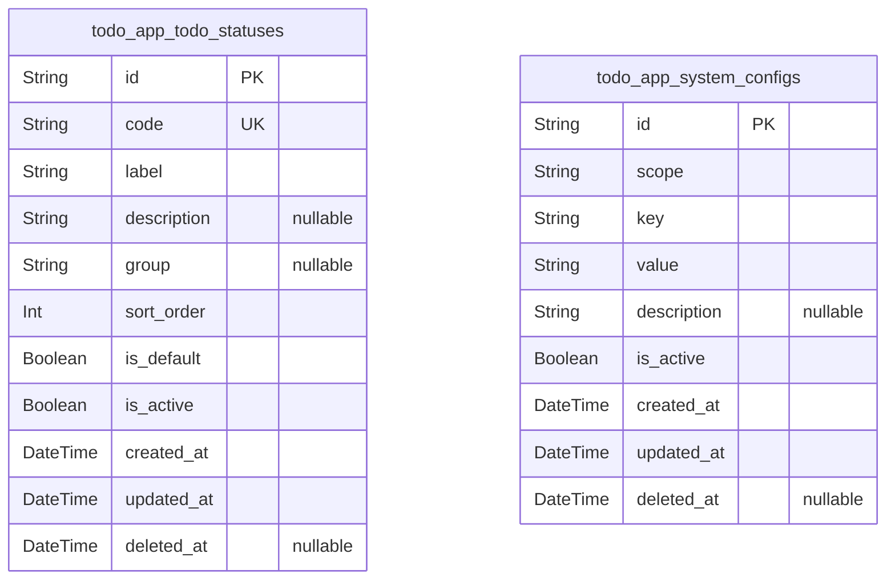
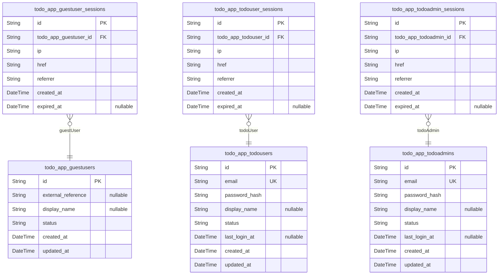
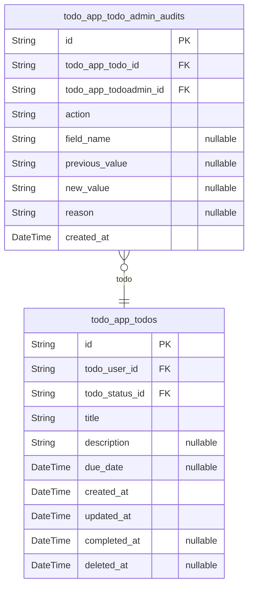

# Prisma Markdown

> Generated by [`prisma-markdown`](https://github.com/samchon/prisma-markdown)

- [Systematic](#systematic)
- [Actors](#actors)
- [Todos](#todos)

## Systematic

### `todo_app_todo_statuses`

Catalogue of allowed Todo status values used across the todoApp service.

This table defines the normalized list of business-level statuses that a
Todo item may take, such as active or completed. Each status has a stable
code, human-readable label, and optional semantic grouping so that other
components can distinguish minimal core states from future extended ones.

Other tables like `todo_app_todos` refer to these records via foreign
keys to enforce that only configured statuses are used. Historical
records continue to reference their original status rows even if a status
is later deprecated, which is why soft deletion is supported instead of
hard removal.

Administrative tools can manage which statuses are currently usable, what
the default status is for new Todos, and the order in which statuses are
presented in user interfaces.

Properties as follows:

- `id`: Primary key. Uniquely identifies each Todo status entry.
- `code`
  > Stable machine-readable status code such as "ACTIVE" or "COMPLETED". Used
  > as business identifier across services and should not change once
  > created.
- `label`
  > Human-readable label for the status shown in user interfaces, such as
  > "Active" or "Completed".
- `description`
  > Optional textual description that explains the meaning and intended usage
  > of this status in business terms.
- `group`
  > Optional semantic group name that can classify statuses, for example
  > "core" for built-in states or a feature-specific group identifier.
- `sort_order`
  > Integer used to control display ordering of statuses in lists. Lower
  > values are typically shown first.
- `is_default`
  > Indicates whether this status is the default for new Todos when no
  > explicit status is provided.
- `is_active`
  > Flag indicating whether this status can currently be assigned to Todos.
  > When false, status is treated as deprecated but historical references
  > remain valid.
- `created_at`: Timestamp when this status entry was created.
- `updated_at`: Timestamp when this status entry was last updated.
- `deleted_at`
  > Soft deletion timestamp. When set, the status is considered logically
  > removed but kept for historical reference.

### `todo_app_system_configs`

Global configuration entries that control system-wide behavior of the
todoApp service.

Each row represents a single configuration item identified by a
combination of scope and key, with an associated value stored as text
plus basic metadata. This design allows the platform to manage settings
such as deletion model, retention periods, feature toggles, or other
system-level options without modifying business tables.

Configuration entries can be grouped by scope (for example, "todo" or
"auth"), can be activated or deprecated over time, and are tracked with
temporal fields for audit. Application services read from this table at
runtime to determine current behavior for cross-cutting concerns.

Properties as follows:

- `id`: Primary key. Uniquely identifies each system configuration entry.
- `scope`
  > Logical namespace for this configuration entry, such as "todo", "auth",
  > or "system". Used to group related keys.
- `key`
  > Configuration key name within its scope, such as "deletion_model" or
  > "soft_delete_retention_days".
- `value`
  > Configuration value stored as text. The consuming service is responsible
  > for parsing it into the appropriate type, such as boolean, integer, or
  > JSON payload.
- `description`
  > Optional human-readable description that explains the purpose and allowed
  > values of this configuration entry.
- `is_active`
  > Flag indicating whether this configuration entry is currently in effect.
  > Inactive entries are retained for audit or rollback but should not
  > influence runtime behavior.
- `created_at`: Timestamp when this configuration entry was created.
- `updated_at`: Timestamp when this configuration entry was last updated.
- `deleted_at`
  > Soft deletion timestamp. When set, the configuration entry is treated as
  > logically removed while its history is kept.

## Actors

### `todo_app_guestusers`

Guest user identity records for conceptual guestUser actors.

Represents minimal identity information for guest users when the system
needs to persist a reference to an unauthenticated visitor, for example
for analytics, trials, or future account upgrade flows. These records are
not used for authentication but allow associating other data with a
stable guest identifier.

Guest users do not own Todos directly in the current business scope, but
the table is defined to satisfy the requirement that each actor type has
a corresponding identity table within the Actors component.

Properties as follows:

- `id`: Primary key. Unique identifier for the guest user identity.
- `external_reference`
  > Optional external reference identifier for this guest user. Can be used
  > to link to cookies, device identifiers, or external systems when needed.
- `display_name`
  > Optional human-readable nickname or label for the guest user. Not used
  > for authentication and may be empty.
- `status`
  > Current lifecycle status of the guest user record. Typical values include
  > "active" for valid references and "archived" for no-longer-used entries.
- `created_at`: Timestamp when this guest user record was created.
- `updated_at`: Timestamp when this guest user record was last updated.

### `todo_app_guestuser_sessions`

Session records for guestUser actors.

Represents authenticated or tracked sessions associated with guest users
according to the standard session table pattern. Each row records
contextual information about when and how a guest interacted with the
system, including IP address and navigation URLs.

These sessions are subsidiary to [todo_app_guestusers](#todo_app_guestusers) identities
and are primarily used for audit, telemetry, or gradual upgrade of guests
to registered users. They are not used for privileged authentication in
the current scope.

Properties as follows:

- `id`: Primary key. Unique identifier for the guest user session.
- `todo_app_guestuser_id`: Guest user that this session belongs to. [todo_app_guestusers.id](#todo_app_guestusers).
- `ip`
  > IP address from which the guest user accessed the service during this
  > session.
- `href`
  > Full URL that the guest user initially accessed when this session was
  > established.
- `referrer`
  > Referrer URL indicating where the guest user navigated from when the
  > session started.
- `created_at`: Timestamp when this guest user session was created.
- `expired_at`
  > Timestamp when this guest user session expired or was invalidated. Null
  > while the session is still considered active.

### `todo_app_todousers`

Registered end-user accounts for todoUser actors.

Represents authenticated users who own and manage personal Todo items.
Each row stores identity and credential data required for login, along
with lifecycle status and basic metadata.

Todo users are the primary owners of business data in {@link
todo_app_todos} and related tables. Administrative actors and
authorization logic use this table to enforce per-user isolation of Todo
data.

Properties as follows:

- `id`: Primary key. Unique identifier for the todo user account.
- `email`
  > Unique email address for this todo user. Used as the primary login
  > identifier and for account-related communication.
- `password_hash`
  > Hashed password for this todo user account. Stores only a secure password
  > hash, never the plain-text password.
- `display_name`
  > Optional human-readable display name for this todo user, shown in user
  > interfaces or administrative views.
- `status`
  > Current account status for this todo user. Typical values include
  > "active", "suspended", or "closed" according to account lifecycle rules.
- `last_login_at`
  > Timestamp when the user last successfully authenticated. Null if the user
  > has never logged in.
- `created_at`: Timestamp when this todo user account was created.
- `updated_at`: Timestamp when this todo user account was last updated.

### `todo_app_todouser_sessions`

Authentication session records for todoUser actors.

Represents login sessions for registered todo users, capturing connection
context and temporal boundaries. Each session is tied to exactly one todo
user and may coexist with other sessions for the same user across
devices.

These records enable auditing of user actions, support security features
such as session invalidation, and help analyze login behavior without
duplicating user identity data from [todo_app_todousers](#todo_app_todousers).

Properties as follows:

- `id`: Primary key. Unique identifier for the todo user session.
- `todo_app_todouser_id`
  > Todo user that this session is associated with. {@link
  > todo_app_todousers.id}.
- `ip`
  > IP address from which the todo user accessed the service during this
  > session.
- `href`: Full URL that the todo user initially accessed when starting this session.
- `referrer`
  > Referrer URL indicating where the todo user navigated from when the
  > session started.
- `created_at`: Timestamp when this todo user session was created.
- `expired_at`
  > Timestamp when this todo user session expired or was invalidated. Null
  > while the session remains active.

### `todo_app_todoadmins`

Administrative user accounts for todoAdmin actors.

Represents internal operators with elevated privileges who can access and
manage Todo and account data for support, troubleshooting, or policy
enforcement. Each admin account stores credentials and lifecycle
information distinct from regular todo users.

Administrative actions performed by these accounts are typically logged
in [todo_app_todo_admin_audits](#todo_app_todo_admin_audits) or related audit tables for
accountability and compliance.

Properties as follows:

- `id`: Primary key. Unique identifier for the todo admin account.
- `email`
  > Unique email address for this administrative account. Used as the primary
  > login identifier for todoAdmin actors.
- `password_hash`
  > Hashed password for this administrative account. Stores only a secure
  > password hash, never the plain-text password.
- `display_name`
  > Optional human-readable display name for this administrator, used in
  > dashboards and audit logs.
- `status`
  > Current lifecycle status of this administrative account. Typical values
  > include "active", "suspended", or "closed".
- `last_login_at`
  > Timestamp when the admin account last successfully authenticated. Null if
  > the admin has never logged in.
- `created_at`: Timestamp when this administrative account was created.
- `updated_at`: Timestamp when this administrative account record was last updated.

### `todo_app_todoadmin_sessions`

Authentication session records for todoAdmin actors.

Represents login sessions for administrative users, allowing the system
to track when and from where administrators access the service. These
sessions are critical for security auditing and for enforcing policies
such as forced logout or session timeout.

Each session links to a single admin account in {@link
todo_app_todoadmins} and records connection metadata without duplicating
admin identity fields.

Properties as follows:

- `id`: Primary key. Unique identifier for the todo admin session.
- `todo_app_todoadmin_id`
  > Administrative user that this session belongs to. {@link
  > todo_app_todoadmins.id}.
- `ip`
  > IP address from which the administrative user accessed the service during
  > this session.
- `href`
  > Full URL that the administrative user initially accessed when starting
  > this session.
- `referrer`
  > Referrer URL indicating where the administrative user navigated from when
  > the session started.
- `created_at`: Timestamp when this administrative session was created.
- `expired_at`
  > Timestamp when this administrative session expired or was invalidated.
  > Null while the session remains active.

## Todos

### `todo_app_todos`

Todo items owned by individual todo users.

Represents the primary business entity for the todoApp domain, storing
each actionable task that a todoUser wants to manage. Each record
captures ownership, status, timing metadata, and optional due date while
enforcing strict per-user data isolation through foreign keys.

The model references the todo user table for ownership and the todo
status lookup for the current state (such as active or completed). It
supports soft deletion via a nullable deleted_at timestamp so that items
can be removed from normal views while remaining available for lifecycle
and retention policies.

Administrative actors interact with these todos indirectly, typically via
audit trails stored in [todo_app_todo_admin_audits](#todo_app_todo_admin_audits), without
becoming owners of the todos themselves.

Properties as follows:

- `id`
  > Primary key. Unique identifier for the todo item, generated as a UUID and
  > immutable for the lifetime of the record.
- `todo_user_id`
  > Owner of this todo item. References the authenticated todo user account
  > that exclusively owns and manages the todo. {@link
  > todo_app_todousers.id}.
- `todo_status_id`
  > Current business status of the todo, such as active or completed. {@link
  > todo_app_todo_statuses.id}.
- `title`
  > Short text title describing the task. Must contain at least one
  > non-whitespace character and obey business maximum length constraints to
  > keep lists scannable.
- `description`
  > Optional longer text providing additional details about the task. May be
  > null or empty, subject to maximum length constraints defined by business
  > rules.
- `due_date`
  > Optional due date for the todo. Represents the target calendar date and
  > time by which the user aims to complete the task. May be null when no due
  > date is specified.
- `created_at`
  > Timestamp when the todo was first created. Set once at creation time and
  > never changed afterward, used for default sorting and audit context.
- `updated_at`
  > Timestamp of the most recent modification to the todo, including content
  > or status changes. Updated on every successful update operation.
- `completed_at`
  > Timestamp when the todo entered a completed state. Set when status
  > transitions from active to completed and cleared when a previously
  > completed todo is reactivated.
- `deleted_at`
  > Soft deletion timestamp. When set, the todo is considered deleted and
  > must be excluded from normal user listings while remaining available for
  > administrative or lifecycle processing.

### `todo_app_todo_admin_audits`

Administrative audit log entries for changes made by todo administrators
to todo items.

Tracks who changed a todo, what was changed, and when the change occurred
for administrative oversight and compliance. Each record links a single
administrative action to the target todo and the acting admin, capturing
high-level action type and optional field-level before and after values.

This table is append-only from a business perspective and is not directly
managed by end users. It supports investigation of support actions, abuse
handling, and policy enforcement without overloading the primary {@link
todo_app_todos} model with audit-specific columns.

Properties as follows:

- `id`
  > Primary key. Unique identifier for the administrative audit record,
  > generated as a UUID.
- `todo_app_todo_id`
  > Target todo item affected by the administrative action. {@link
  > todo_app_todos.id}.
- `todo_app_todoadmin_id`
  > Administrative user who performed the action on the todo. {@link
  > todo_app_todoadmins.id}.
- `action`
  > Short code or label describing the type of administrative action, such as
  > update, delete, restore, or status_change. Used for categorising audit
  > entries.
- `field_name`
  > Optional name of the field that was changed when the action targets a
  > specific attribute, such as title or status. Null for actions that are
  > not field-specific.
- `previous_value`
  > Optional textual representation of the previous value before the
  > administrative change. Used for understanding what state was overwritten.
  > May be null for actions where a prior value is not applicable.
- `new_value`
  > Optional textual representation of the new value after the administrative
  > change. Helps reconstruct the resulting state after an action. May be
  > null for deletions or actions without a new value.
- `reason`
  > Optional free-form explanation entered by the administrator to justify
  > the action, such as policy enforcement, abuse handling, or support
  > correction. Supports later review and auditability.
- `created_at`
  > Timestamp when the administrative action occurred and this audit record
  > was created. Used for chronological review of admin activity and todo
  > history.
