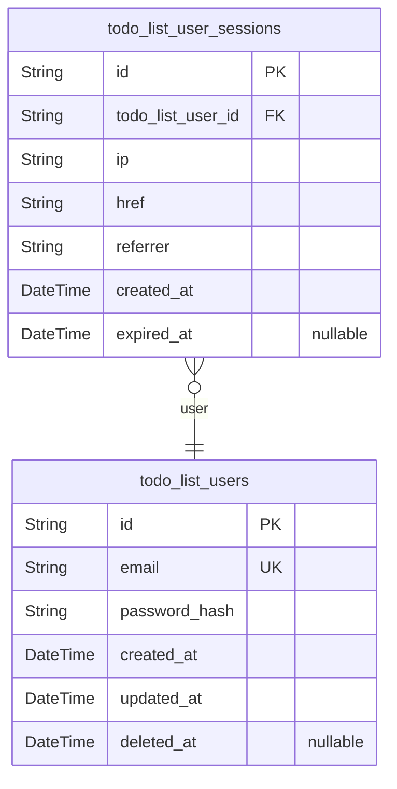
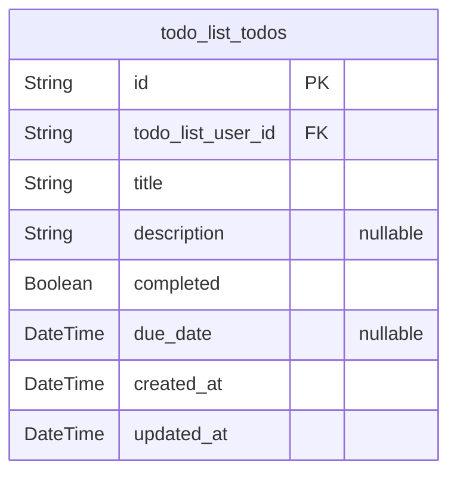

# Prisma Markdown

> Generated by [`prisma-markdown`](https://github.com/samchon/prisma-markdown)

- [Actors](#actors)
- [Tasks](#tasks)

## Actors

### `todo_list_users`

Unique record of every end-user registered within the Todo List service.

Serves as the single actor/identity table for business logic,
authentication, and ownership of todos. Each user has a unique email
address and securely hashed password for authentication. Only
authenticated users may access or manipulate their own todos; system
supports soft deletion and audit of all account events. All user data is
distinct, unshareable, and not visible to others. This entity underpins
all privacy and security guarantees for the application.

Properties as follows:

- `id`: Primary Key. Uniquely identifies each user account.
- `email`
  > Unique email address for login. Enforced as case-insensitive unique
  > index. Required for authentication and account recovery.
- `password_hash`
  > Hashed password string for user authentication. Never plain text.
  > Computed using secure, industry-standard algorithms.
- `created_at`: Timestamp for when the user account was first created.
- `updated_at`: Timestamp of last modification (e.g., password or profile changes).
- `deleted_at`
  > Soft deletion marker. If set, account is marked for removal and excluded
  > from normal access.

### `todo_list_user_sessions`

Login session records supporting secure, auditable user authentication
workflows.

Each session tracks one authenticated connection for a user with
essential forensic information. Required fields include IP, connection
URLs, and start/expiry times. Sessions provide complete audit context for
all sensitive account actions and enable secure concurrent logins.
Managed strictly as subsidiary data for the parent user; direct
independent CRUD is not needed, but indexed for audit and investigation.

Properties as follows:

- `id`: Primary Key. Uniquely identifies each authentication session.
- `todo_list_user_id`
  > Foreign key to owning user. Links session to unique user account. {@link
  > todo_list_users.id}.
- `ip`: IP address used for this session. For audit and security tracing.
- `href`: Full connection URL for originating request.
- `referrer`: Referrer URL captured at session start.
- `created_at`: Session creation timestamp.
- `expired_at`: Session termination or expiration timestamp. Nullable for active sessions.

## Tasks

### `todo_list_todos`

Business tasks (todos) that form the core of the Todo List Application.

Each record represents a user-owned todo, capturing an actionable task
with ownership strictly enforced by foreign key reference to {@link
todo_list_users}. All todos support required titles, optional
descriptions, a boolean completion status, and an optional due date.
Field length and data type constraints support robust validation and
prevent invalid submission.

Audit fields record creation and update times for history and sorting
purposes. Todos cannot be shared, delegated, or accessed by other
users—strict data isolation is enforced through both foreign key and
business logic. Permanent deletion is supported, with no soft-deletion
workflow required by business in the MVP. Efficient filtering by owner,
creation date, and completion status is enabled by indexes. This table
provides the sole persistent record of all business tasks for each
authenticated user.

Properties as follows:

- `id`: Primary Key.
- `todo_list_user_id`: Owner user for this todo task. Foreign key to [todo_list_users.id](#todo_list_users).
- `title`
  > Required short textual title for the todo. Must be present and 1–100
  > characters in length; validated in application layer.
- `description`
  > Optional longer plaintext description of the todo for additional context.
  > May be null or up to 600 characters if present.
- `completed`
  > Boolean indicating whether this todo task is complete. Defaults to false
  > at creation; can be toggled by owner.
- `due_date`
  > Optional ISO8601 date by which the todo is expected to be completed. Null
  > if not set; must be current or future date if present.
- `created_at`
  > Timestamp in UTC when the todo was created. Used for sorting, filtering,
  > and audit history.
- `updated_at`
  > Timestamp when the todo was most recently updated. Updated automatically
  > on change.
