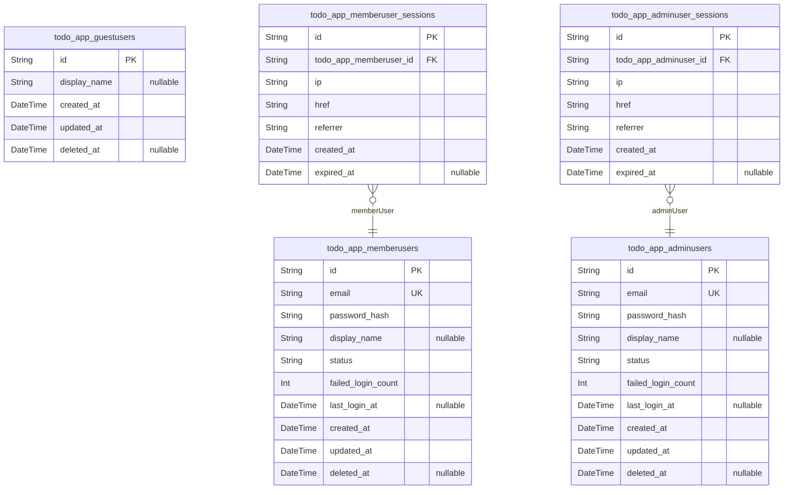
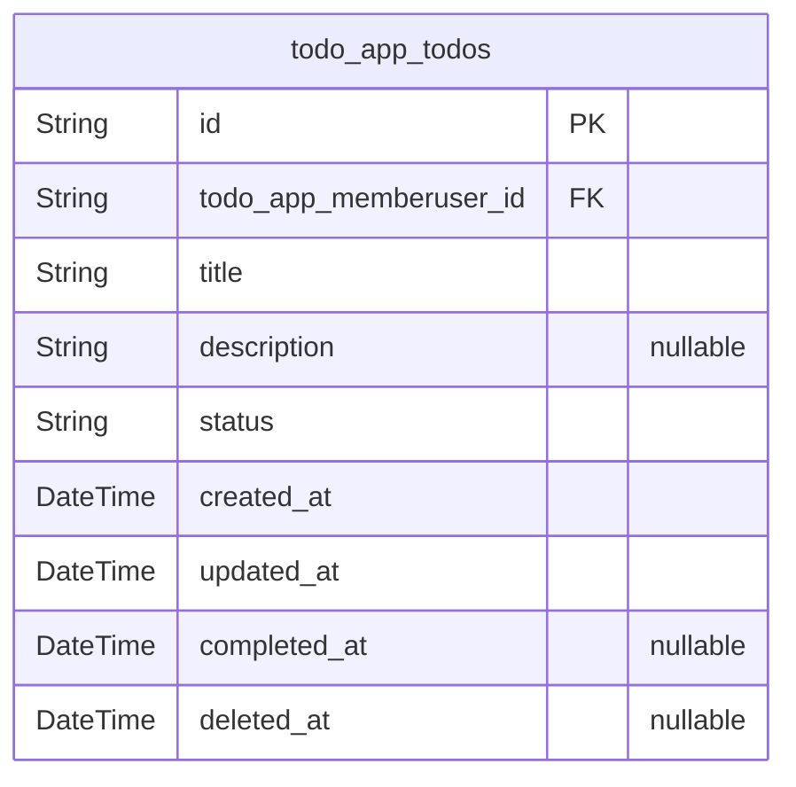
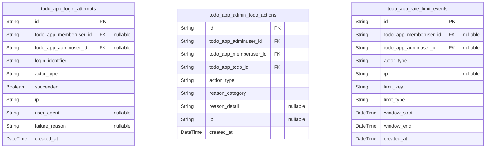

# Prisma Markdown

> Generated by [`prisma-markdown`](https://github.com/samchon/prisma-markdown)

- [Actors](#actors)
- [Todos](#todos)
- [Operations](#operations)

## Actors

### `todo_app_guestusers`

Guest user identities for conceptual tracking of unauthenticated visitors.

This table represents guest users at a conceptual level so that the
system can attach future data (such as preferences or acceptance of
terms) if business requirements expand. In the minimal version, guest
users do not authenticate and do not own todos, but maintaining a
normalized actor representation keeps the identity model symmetrical.

Each row corresponds to one logical guest identity that may be associated
with browser or device context at the application layer. The table stores
minimal profile and lifecycle fields only; all authentication and todo
ownership is handled by member and admin users in other tables.

Properties as follows:

- `id`
  > Primary key of the guest user. Uniquely identifies a conceptual guest
  > identity in the system.
- `display_name`
  > Optional display name or nickname for the guest user. Used only for
  > friendly identification in logs or future features; not used for
  > authentication.
- `created_at`
  > Timestamp when this guest user record was created. Represents the first
  > time this guest identity was recorded by the system.
- `updated_at`
  > Timestamp when this guest user record was last updated. Updated whenever
  > profile-related fields change.
- `deleted_at`
  > Timestamp marking when this guest user was logically deleted. Null when
  > the record is active; non-null when removed from normal use.

### `todo_app_memberusers`

Member user accounts for authenticated end users who own personal todo
lists.

This table stores the primary identity records for regular users of the
todoApp service. Each member user authenticates with a unique login
identifier and password hash, and owns a private set of todos stored in
[todo_app_todos](#todo_app_todos).

The table holds authentication credentials, account status, and lifecycle
timestamps. Session state is modeled separately in {@link
todo_app_memberuser_sessions}, enabling multiple concurrent sessions per
user while keeping the account data normalized and independent from
connection details.

Properties as follows:

- `id`
  > Primary key of the member user. Uniquely identifies an authenticated user
  > within the todoApp service.
- `email`
  > Unique login identifier for the member user, typically an email-style
  > value. Used for authentication and communication; must be unique among
  > member users.
- `password_hash`
  > Hashed representation of the member user password. The original password
  > is never stored; backend logic enforces secure hashing algorithms.
- `display_name`
  > Optional human-friendly display name for the member user. Used in UI or
  > logs but not for authentication.
- `status`
  > Account status for the member user. Typical values include active,
  > inactive, disabled, or deleted; exact semantics are defined at
  > application level.
- `failed_login_count`
  > Counter of recent consecutive failed login attempts for this account.
  > Used by authentication logic to apply temporary lockouts or additional
  > checks.
- `last_login_at`
  > Timestamp of the last successful login for this member user. Null if the
  > user has never logged in successfully.
- `created_at`
  > Timestamp when this member user account was created. Represents
  > registration time.
- `updated_at`
  > Timestamp when this member user account record was last updated. Updated
  > whenever profile or security-related fields change.
- `deleted_at`
  > Timestamp marking when this member user account was logically deleted.
  > Null while the account is considered active or recoverable.

### `todo_app_memberuser_sessions`

Authentication sessions for member users, capturing connection context
and session lifetime.

This table records individual login sessions for {@link
todo_app_memberusers}. Each session row corresponds to one authenticated
context, such as a browser or device login, and is used for audit and
enforcement of session expiry.

The model follows the global session pattern: it stores only the minimal
required fields (IP address, href, referrer, and temporal data) plus a
foreign key to the owning member user. Business logic manages session
tokens externally while this table provides persistence for tracing and
analysis.

Properties as follows:

- `id`
  > Primary key of the member user session. Uniquely identifies an
  > authenticated session instance.
- `todo_app_memberuser_id`
  > Foreign key referencing the owning member user account. {@link
  > todo_app_memberusers.id}.
- `ip`
  > IP address from which the member user established this session. Used for
  > audit and basic security analysis.
- `href`
  > Full URL (including path) that the member user visited when creating this
  > session. Captures entry point context.
- `referrer`
  > Referrer URL reported by the client when the session was established.
  > Helps understand navigation paths into the service.
- `created_at`
  > Timestamp when this session was created. Represents the time of
  > successful authentication.
- `expired_at`
  > Timestamp when this session became invalid, either due to explicit logout
  > or expiration. Null while the session is still active.

### `todo_app_adminusers`

Administrative user accounts with elevated privileges for operating and
supervising the todoApp service.

This table stores identity records for admin users who can perform
oversight on member accounts and todos. Admins authenticate similarly to
member users but have separate credentials and status to support stricter
controls and auditing.

Admin users may review or remove todos across users via other components
such as [todo_app_admin_todo_actions](#todo_app_admin_todo_actions). Sessions for admins are
tracked in [todo_app_adminuser_sessions](#todo_app_adminuser_sessions), allowing separation
between account data and connection history.

Properties as follows:

- `id`
  > Primary key of the admin user. Uniquely identifies an administrative
  > actor within the todoApp service.
- `email`
  > Unique login identifier for the admin user, typically an email-style
  > value distinct from member user addresses. Used for authentication and
  > administrative communication.
- `password_hash`
  > Hashed representation of the admin user password. Must follow strong
  > security practices and never store raw passwords.
- `display_name`
  > Optional human-friendly display name for the admin user. Used in admin
  > consoles and logs for easier recognition.
- `status`
  > Account status of the admin user. Typical values include active,
  > inactive, disabled, or deleted; application-level rules define allowed
  > transitions.
- `failed_login_count`
  > Counter of recent consecutive failed login attempts for this admin
  > account. Supports rate limiting and temporary lockouts for security.
- `last_login_at`
  > Timestamp of the last successful login for this admin user. Null when the
  > admin has never logged in successfully.
- `created_at`
  > Timestamp when this admin user account was created. Represents the time
  > the administrator identity was provisioned.
- `updated_at`
  > Timestamp when this admin account record was last updated. Updated on
  > profile, credential, or status changes.
- `deleted_at`
  > Timestamp marking when this admin user account was logically deleted or
  > deactivated. Null while the account is considered active or recoverable.

### `todo_app_adminuser_sessions`

Authentication sessions for admin users, capturing connection context for
oversight and security auditing.

This table stores session records for [todo_app_adminusers](#todo_app_adminusers). Each
row represents one authenticated admin session, such as an active login
in an operations console.

Following the global session pattern, the table contains only the minimal
fields required to track who connected, from where, and when the session
started and ended. This supports audit trails and detection of suspicious
behavior without storing additional sensitive metadata in the session
itself.

Properties as follows:

- `id`
  > Primary key of the admin user session. Uniquely identifies a single admin
  > authentication session.
- `todo_app_adminuser_id`
  > Foreign key referencing the owning admin user account. {@link
  > todo_app_adminusers.id}.
- `ip`
  > IP address from which the admin user established this session. Used
  > heavily for security monitoring and audit.
- `href`
  > Full URL that the admin user accessed when this session was created.
  > Helps understand which admin interface entry point was used.
- `referrer`
  > Referrer URL reported by the client when the admin session was
  > established. Useful for tracing navigation paths into admin areas.
- `created_at`
  > Timestamp when this admin session was created. Represents the time of
  > successful authentication.
- `expired_at`
  > Timestamp when this admin session was terminated or expired. Null while
  > the session remains active.

## Todos

### `todo_app_todos`

Core todo items owned by member users.

This model stores the minimal but complete representation of a todo in
the todoApp service. Each row represents a single task that belongs to
exactly one member user and can be created, viewed, updated, completed,
reopened, and deleted according to the lifecycle rules.

The table captures required business fields including a short title,
optional longer description, simple status (pending or completed),
timestamps for creation and last update, and an optional completion
timestamp. Logical deletion is modeled via a nullable deleted_at
timestamp so that deleted todos disappear from normal lists while still
being available for short-term retention and background cleanup.

Ownership is enforced by a foreign key to [todo_app_memberusers](#todo_app_memberusers).
Admin users can read and administratively delete todos via higher-level
operations, but they do not change the ownership relationship stored
here.

Properties as follows:

- `id`
  > Primary key of the todo item. Generated as a UUID and uniquely identifies
  > a single todo across the system.
- `todo_app_memberuser_id`
  > Reference to the owning member user. This links the todo to exactly one
  > authenticated user account. [todo_app_memberusers.id](#todo_app_memberusers).
- `title`
  > Short textual title of the todo. Must be non-empty after trimming and is
  > limited to a reasonable maximum length to keep lists readable.
- `description`
  > Optional longer description providing additional details about the task.
  > May be null or an empty string when the user does not provide extra
  > information.
- `status`
  > Current business status of the todo. Expected values are "pending" for
  > active items and "completed" for finished tasks, matching the lifecycle
  > rules.
- `created_at`
  > Timestamp when the todo was first created. Used for ordering and audit
  > purposes.
- `updated_at`
  > Timestamp of the last modification to this todo, including content edits
  > or status changes. Updated on each successful change.
- `completed_at`
  > Timestamp when the todo was marked as completed. Null while the todo is
  > still pending or has been reopened to an active state.
- `deleted_at`
  > Soft deletion timestamp. When null the todo is considered active or
  > completed; when set the todo is treated as deleted and excluded from
  > normal user listings.

## Operations

### `todo_app_login_attempts`

Operational log of authentication attempts for todoApp users.

Stores each login attempt with its login identifier, outcome, and
contextual information such as IP address and user agent. This table is
used to enforce rate limits on failed logins, detect abuse patterns, and
support security investigations.

Records may optionally link to a concrete member or admin account if the
identifier matched an existing account at the time of the attempt.
Successful and failed attempts are tracked with a result flag so
operators can distinguish normal usage from suspicious behavior.

Properties as follows:

- `id`
  > Primary key for the login attempt record. Uniquely identifies each
  > authentication attempt event.
- `todo_app_memberuser_id`
  > Optional reference to the member user account associated with this login
  > attempt. [todo_app_memberusers.id](#todo_app_memberusers). Present when the login
  > identifier matched a member user at the time of the attempt.
- `todo_app_adminuser_id`
  > Optional reference to the admin user account associated with this login
  > attempt. [todo_app_adminusers.id](#todo_app_adminusers). Present when the login
  > identifier matched an admin user at the time of the attempt.
- `login_identifier`
  > Login identifier supplied by the client, such as email or username.
  > Stored exactly as received after normalization rules so that patterns of
  > failed attempts can be analyzed.
- `actor_type`
  > High-level actor type that attempted the login. Typical values are
  > guestUser, memberUser, or adminUser, determined after authentication
  > logic evaluates the identifier.
- `succeeded`
  > Indicates whether this login attempt successfully resulted in an
  > authenticated session. True for valid credentials, false for invalid
  > credentials or blocked accounts.
- `ip`
  > IP address from which the login attempt originated. Used for abuse
  > detection and incident investigation.
- `user_agent`
  > Optional user agent string reported by the client. Helps identify
  > automated scripts and unusual client patterns in security reviews.
- `failure_reason`
  > Optional high-level category describing why the login failed, such as
  > invalid_credentials, account_locked, or rate_limited. Null for successful
  > attempts.
- `created_at`
  > Timestamp when the login attempt was recorded. Used for rate limiting
  > windows, trend analysis, and time-bounded security investigations.

### `todo_app_admin_todo_actions`

Audit log of administrative actions performed on todo items.

Captures when an admin user intervenes on a member user’s todo, such as
deleting it for policy reasons or performing exceptional modifications.
Each record stores the target todo, the acting admin, a high-level action
type, and a reason category so that compliance and support teams can
review historical decisions.

Entries are append-only and provide a durable trail of who changed what
and when, without affecting the core todo lifecycle models.

Properties as follows:

- `id`
  > Primary key for the admin todo action log entry. Uniquely identifies each
  > administrative action event.
- `todo_app_adminuser_id`
  > Reference to the admin user who performed this action. {@link
  > todo_app_adminusers.id}. Identifies the responsible operator for audit
  > purposes.
- `todo_app_memberuser_id`
  > Reference to the member user who owns the affected todo. {@link
  > todo_app_memberusers.id}. Used to analyze impact on a specific account.
- `todo_app_todo_id`
  > Reference to the todo item that the admin acted upon. {@link
  > todo_app_todos.id}. Enables reconstructing which item was removed or
  > modified.
- `action_type`
  > High-level type of administrative action, such as delete_todo, hide_todo,
  > or neutralize_content. Used for categorizing interventions in reports.
- `reason_category`
  > High-level reason code explaining why this action was taken, for example
  > policy_violation, legal_request, abuse_report, or operational_cleanup.
- `reason_detail`
  > Optional free-form description with additional context about the action,
  > written by the admin or system. Should avoid including sensitive personal
  > data beyond what is necessary for audit.
- `ip`
  > Optional IP address from which the admin performed this action. Provides
  > context for admin security reviews.
- `created_at`
  > Timestamp when the administrative action was recorded. Supports
  > chronological audit and correlation with user-facing effects.

### `todo_app_rate_limit_events`

Operational log of rate limit triggers applied to requests in todoApp.

Records when the system enforces rate limiting for a specific actor, IP
address, or logical key. This supports security monitoring, tuning of
rate limits, and debugging of user complaints about temporary blocking.

Each entry includes the limiting key, actor context when known, the type
of limit that was exceeded, and the time window for which the limit
applies.

Properties as follows:

- `id`
  > Primary key for the rate limit event record. Uniquely identifies each
  > enforcement event.
- `todo_app_memberuser_id`
  > Optional reference to the member user associated with this rate limit
  > event. [todo_app_memberusers.id](#todo_app_memberusers). Present when the limit is tied to
  > an authenticated member user.
- `todo_app_adminuser_id`
  > Optional reference to the admin user associated with this rate limit
  > event. [todo_app_adminusers.id](#todo_app_adminusers). Present when the limit is tied to
  > an authenticated admin user.
- `actor_type`
  > Actor type that triggered the rate limit, such as guestUser, memberUser,
  > or adminUser. Used to differentiate protections per role.
- `ip`
  > Optional IP address to which this rate limit event applies. Useful for
  > anonymous or guest-based rate limiting where no user account is present.
- `limit_key`
  > Logical key used by the rate limiting subsystem, such as
  > login_identifier, account_id, ip, or a specific endpoint group
  > identifier. Enables grouping of events by limit dimension.
- `limit_type`
  > Category of rate limit that was exceeded, for example auth_login,
  > todo_write, admin_action, or global_client_limit.
- `window_start`
  > Start timestamp of the rate limit window during which the threshold was
  > exceeded. Combined with window_end to describe the enforced interval.
- `window_end`
  > End timestamp of the rate limit window for this event. Indicates until
  > when the client is expected to experience throttling for this key.
- `created_at`
  > Timestamp when the rate limit event was recorded. Used to order events
  > and correlate with request logs.
