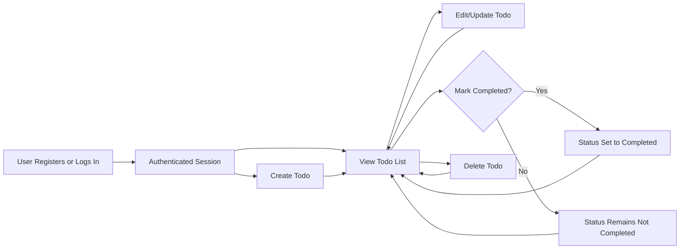

# Business and Functional Requirements – Todo List Application

## Feature List
The essential features for the minimal, production-ready Todo list application are:

- User registration and secure authentication flow
- Creation of individual, user-owned todo items (tasks)
- Display of an authenticated user's personal todo list
- Update of existing user todo items
- Deletion of user's own todo items
- Marking/clearing completion status for todos
- Filtering todos by completion status (completed/not completed)
- Secure, unique ownership isolation for all todo data (no sharing, no public access)

## Core Functional Requirements (EARS Format)

### User Registration and Authentication
- THE system SHALL provide user registration via valid email address and password.
- THE system SHALL require registered users to log in before any access to todos is permitted.
- WHEN a user submits valid credentials, THE system SHALL grant access and associate all subsequent actions with that user’s identity.
- IF a user provides invalid credentials during authentication, THEN THE system SHALL deny access and provide an error message without system details.
- WHEN a user is authenticated, THE system SHALL enable access to the user’s own todos and prohibit access to all others.

### Todo Item Management
- WHEN an authenticated user creates a new todo, THE system SHALL create and store the todo, associating it uniquely with the creating user.
- WHEN an authenticated user requests their todo list, THE system SHALL return only their own todos, sorted in reverse chronological order (most recent first).
- WHEN an authenticated user updates a todo, THE system SHALL permit the update only if the todo belongs to the user.
- IF a user attempts to update a todo they do not own, THEN THE system SHALL deny the action with a forbidden error.
- WHEN an authenticated user deletes a todo, THE system SHALL permanently remove it from the user’s list if it is owned by them.
- IF a user attempts to delete a todo not owned by them, THEN THE system SHALL block the operation and return an error.

### Todo Status and Filtering
- WHEN a user marks a todo as completed, THE system SHALL update the todo status to "completed.”
- WHEN a todo is uncompleted, THE system SHALL reflect the updated status accurately.
- THE system SHALL allow filtering or viewing of todos by completion status, presenting only those in the selected state.
- IF a user tries to change the status of another user’s todo, THEN THE system SHALL prevent the action and provide a clear error.

### Validation and Constraints
- WHEN a user creates or updates a todo, THE system SHALL require a non-empty title field with length between 1 and 255 characters.
- THE system SHALL optionally accept a description field (maximum 1000 characters).
- THE system SHALL reject creation or updates of todos with missing or empty titles, and display a specific error message.
- IF a user attempts to create more than 1000 todos, THEN THE system SHALL deny the request and explain the task limit.
- All todo fields SHALL be validated for length and content on all operations.

### Data Ownership and Security
- THE system SHALL enforce that every todo is strictly linked to the owner's user identity.
- Access to view, update, complete, or delete is limited only to the owner of each todo.
- No sharing, delegation, or administrator access exists in the MVP (single-user model only).
- Anonymous/unauthenticated users SHALL be blocked from all todo system functions.

### Business Process and Error Handling
- All error messages SHALL be clear, actionable, and not leak technical information.
- WHEN a user attempts any forbidden action (access another user’s data, exceed limits, invalid authentication), THE system SHALL supply actionable guidance for next steps (e.g., log in, reduce number of todos, check credentials).
- WHEN no todos exist for a user, THE system SHALL display an empty state rather than an error.
- THE system SHALL handle all operations idempotently (duplicate submits do not create duplicate todos, etc.).

## Business Rules
- Each user is uniquely identified as an actor and may only access or modify their own todos.
- Each todo is uniquely identifiable (global UUID, timestamped at creation, tracked for last modification date, and status).
- Only the required fields (title) are mandatory; descriptions are optional. Titles must be concise and informative to the user.
- No batch or bulk operations (e.g., multi-select delete, complete all, or import/export) are supported in the MVP.
- The system supports a maximum of 1000 todos per user concurrently. Attempts to exceed limit SHALL result in errors.
- There are no collaborative, group, or shared task features in the MVP.
- Ownership isolation is strictly enforced at every system boundary (API, UI, persistence layer).

## Success Criteria
- All requirements above are fully implemented and verifiable via scenario-based testing.
- All error/corner cases described in the requirements, flows, and business rules are handled without ambiguity.
- No unauthenticated or unauthorized data access is possible (all data is protected and isolated).
- Todo data is persistent and secure: no data loss or cross-user exposure under any normal, error, or edge conditions.
- Performance: All responses to list, create, update, delete, and status-change operations return in under 2 seconds (for up to 1000 todos).
- The business process flows are strictly followed; any deviations are handled gracefully, with clear user guidance.

## Example User Workflow (Mermaid)

## Edge Cases and Security Scenarios
- IF a user attempts to log in with an unregistered email, THEN THE system SHALL show a "no account found" error and offer registration.
- IF a user tries to create or update a todo with a title exceeding 255 characters, THEN THE system SHALL reject it and explain the limit.
- IF a user edits or deletes a todo while their session has expired, THEN THE system SHALL require reauthentication.
- IF data corruption or system errors prevent a todo operation, THEN THE system SHALL display a generic failure message and ensure no partial updates or data loss.
- IF repeated failed logins exceed 5 in 10 minutes, THEN THE system SHALL lock the account for 15 minutes.
- WHEN all todos are deleted, THE user’s list SHALL show an empty state, and not an error.

## MVP Scope Limitations
- No team, project, category, tag, file attachment, or calendar features are in scope.
- No recurring, priority, due-date, or notification/reminder functionality in the MVP.
- No API for third parties or public data export is provided.

---

This document provides the complete mandatory business and functional requirements for the minimal Todo List Application. All requirements, flows, and rules must be strictly implemented for a successful backend delivery. No assumptions or feature extensions outside of this document are permitted for the first release.