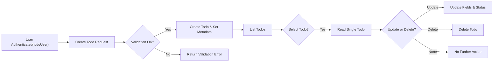
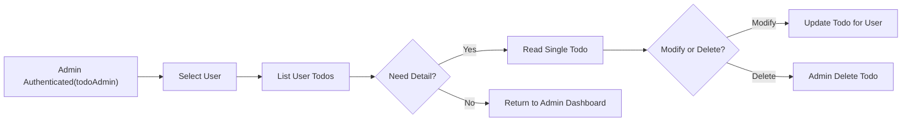

# Functional Requirements for Minimal Todo Service (todoApp)

## 1. Introduction and Scope

### 1.1 Purpose
THE purpose of this document SHALL be to define all functional requirements for the minimal Todo feature set of **todoApp** in a clear, testable, and unambiguous way using EARS (Easy Approach to Requirements Syntax).

THE document SHALL describe **what** the system must do from a business perspective and SHALL avoid prescribing **how** to implement it technically.

### 1.2 System Overview (Business View)
THE todoApp system SHALL provide a simple online service that allows authenticated users to manage personal Todo items, with basic capabilities to create, read, update, delete, and list Todos.

THE service SHALL enforce strict separation of data between different end users while allowing designated administrators to perform oversight and support operations.

### 1.3 In-Scope Functional Areas
THE following functional areas SHALL be in scope for this minimal version:
- Management of individual Todo items (create, read, update, delete).
- Listing and basic filtering of Todos.
- Enforcement of user ownership and data isolation.
- Handling of completion status and basic metadata (creation time, update time, completion time).
- Minimal or no reminder features, limited to what is explicitly defined here.

### 1.4 Out-of-Scope Functionalities for Minimal Version
WHERE functionality is not explicitly defined in this document, THE todoApp system SHALL treat it as out of scope for the initial minimal version.

Out-of-scope examples include (but are not limited to):
- Recurring Todos.
- Shared Todo lists between multiple users.
- Complex tagging systems.
- Push notifications, emails, or calendar integrations.
- Subtasks or hierarchical task structures.
- File attachments.

## 2. Actors and Assumptions (Business-Level Recap)

### 2.1 User Actors Relevant to Todo Functions

- **guestUser**: Unauthenticated visitor who can only access public information such as service description and documentation, and cannot access or modify any Todo data.
- **todoUser**: Authenticated end user who manages their own Todo lists and tasks.
- **todoAdmin**: Administrative operator with authority to access and manage user accounts and Todo data for legitimate operational or support reasons.

### 2.2 High-Level Responsibilities per Actor

THE **guestUser** SHALL have no capabilities to interact with Todo data.

THE **todoUser** SHALL be able to perform all allowed Todo operations solely on their own data.

THE **todoAdmin** SHALL be able to view and manage Todo data associated with any user where this is necessary for maintenance, support, or policy enforcement.

### 2.3 Global Assumptions and Constraints for Functional Behavior

THE system SHALL require authentication before any Todo data is accessed or modified, except where explicitly stated otherwise for guestUser.

THE system SHALL treat each todoUser account as independent from others in terms of Todo ownership.

IF any behavior could expose one user’s Todo data to another unintended user, THEN THE system SHALL treat this as a violation of requirements and SHALL prevent such access.

## 3. Scope of Functional Requirements

### 3.1 Business Definition of a Todo

THE system SHALL treat a Todo as a simple record representing a single actionable item a user wants to remember and complete.

At minimum, each Todo SHALL contain:
- A short text title describing the task.
- An optional longer text description for additional details.
- A completion status (for example, active versus completed).
- Ownership information linking the Todo to exactly one user account.
- Basic timing metadata (creation time and last update time, and completion time when completed).

### 3.2 Minimal Todo Feature Set

THE minimal Todo feature set SHALL include:
- Creating a Todo.
- Viewing an individual Todo.
- Listing multiple Todos belonging to a user.
- Updating the content and status of a Todo.
- Deleting a Todo.
- Filtering listed Todos by completion status.

### 3.3 Relationship to Other Documents

THE functional requirements in this document SHALL align with the service vision and scope described in the service overview, the actor capabilities and constraints described in the user actors and permissions document, and the high-level flows defined in the primary user flows document.

## 4. Todo Item Requirements

### 4.1 Create Todo

#### 4.1.1 Basic Creation Behavior

WHEN a todoUser submits a request to create a new Todo with required and valid data, THE system SHALL create one new Todo item associated with that todoUser.

WHEN a todoAdmin submits a request to create a new Todo on behalf of a specific user with required and valid data, THE system SHALL create one new Todo item associated with the specified user.

IF a guestUser attempts to create a Todo, THEN THE system SHALL reject the operation and SHALL not create any Todo.

#### 4.1.2 Required Fields for Creation

THE system SHALL require a non-empty title value to create a Todo.

THE system SHALL treat the description field as optional during creation.

THE system SHALL allow the completion status to be optionally specified at creation; WHERE no completion status is provided, THE system SHALL default the status to an "active" equivalent state.

THE system SHALL automatically associate the new Todo with the initiating todoUser as owner, unless a todoAdmin explicitly specifies a different valid user as the owner.

#### 4.1.3 Validation Rules on Creation (Business-Level)

WHEN a todoUser submits a Todo creation request, THE system SHALL reject the request IF the title text is blank or contains only whitespace.

WHEN a todoUser submits a Todo creation request, THE system SHALL reject the request IF the title exceeds the maximum allowed length defined in business rules.

WHEN a todoUser submits a Todo creation request with an optional description, THE system SHALL reject the request IF the description exceeds the maximum allowed length defined in business rules.

WHEN a todoUser submits a Todo creation request with an initial completion status, THE system SHALL reject the request IF the provided status value is not one of the allowed Todo states.

#### 4.1.4 Ownership on Creation

WHEN a todoUser creates a Todo, THE system SHALL set the owner of the Todo to that todoUser.

WHEN a todoAdmin creates a Todo on behalf of a specified user, THE system SHALL set the owner of the Todo to the specified user, provided that the user exists and is eligible.

IF a todoAdmin attempts to create a Todo on behalf of a non-existent or inactive user, THEN THE system SHALL reject the creation and SHALL not create the Todo.

#### 4.1.5 Timestamp Behavior on Creation

WHEN a Todo is created successfully, THE system SHALL record the creation time using the current system time.

WHEN a Todo is created successfully, THE system SHALL set the last update time equal to the creation time.

WHEN a Todo is created with a completed status, THE system SHALL set the completion time equal to the creation time.

WHEN a Todo is created with an active status, THE system SHALL ensure that the completion time is unset.

### 4.2 Read Single Todo

#### 4.2.1 Access to Own Todo

WHEN a todoUser requests to read a specific Todo by its identifier, THE system SHALL return the Todo details IF and only IF the Todo is owned by that todoUser.

IF a todoUser attempts to read a Todo that is not owned by them, THEN THE system SHALL reject the request and SHALL not reveal whether the Todo exists.

#### 4.2.2 Admin Access to Any Todo

WHEN a todoAdmin requests to read a specific Todo by its identifier, THE system SHALL return the Todo details regardless of ownership, provided that the Todo exists.

IF a todoAdmin requests a Todo identifier that does not correspond to any existing Todo, THEN THE system SHALL indicate that the Todo was not found.

#### 4.2.3 Guest Access

IF a guestUser attempts to read Todo details, THEN THE system SHALL reject the request and SHALL not return Todo information.

### 4.3 List Multiple Todos

#### 4.3.1 Listing Own Todos

WHEN a todoUser requests a list of their Todos, THE system SHALL return only Todos owned by that todoUser.

WHEN a todoUser requests a list of their Todos without specifying any filter or sort criteria, THE system SHALL return all their Todo items that have not been hard-deleted, ordered by creation time descending.

#### 4.3.2 Listing for Admins

WHEN a todoAdmin requests a list of Todos for a specific user, THE system SHALL return only Todos owned by the specified user that have not been hard-deleted.

WHEN a todoAdmin requests a list of Todos without specifying any user, THE system MAY either reject the request or require explicit selection of a user according to business policy; THIS minimal version recommends requiring explicit user selection for privacy reasons.

WHERE the admin listing behavior is configured to require explicit user selection, THE system SHALL reject listing requests from todoAdmin that do not identify a target user.

#### 4.3.3 Guest Listing

IF a guestUser attempts to list any Todo items, THEN THE system SHALL reject the request and SHALL not return any Todos.

### 4.4 Update Todo

#### 4.4.1 Updating Own Todo

WHEN a todoUser submits an update request for a Todo they own with valid changes, THE system SHALL apply the changes to that Todo.

IF a todoUser attempts to update a Todo that is not owned by them, THEN THE system SHALL reject the update and SHALL not modify the Todo.

WHEN a todoUser updates a Todo, THE system SHALL update the last update time to the current system time.

#### 4.4.2 Admin Update of Any Todo

WHEN a todoAdmin submits an update request for any Todo with valid changes, THE system SHALL apply the changes regardless of ownership, provided that such modifications are allowed by business policy.

WHERE admin updates are subject to audit requirements, THE system SHALL record sufficient metadata to indicate that a todoAdmin performed the change.

#### 4.4.3 Editable Fields

THE system SHALL allow updates to the following fields of a Todo, subject to validation constraints:
- Title.
- Description.
- Completion status.
- Optional due date, IF it is part of the agreed business scope.

WHERE additional fields exist only for internal tracking, THE system SHALL prevent todoUser from modifying such fields directly.

#### 4.4.4 Validation on Update

WHEN a todoUser updates the title of a Todo, THE system SHALL reject the update IF the new title is blank or whitespace-only.

WHEN a todoUser updates the title of a Todo, THE system SHALL reject the update IF the new title exceeds the defined maximum length.

WHEN a todoUser updates the description of a Todo, THE system SHALL reject the update IF the new description exceeds the defined maximum length.

WHEN a todoUser or todoAdmin updates the completion status of a Todo, THE system SHALL reject the update IF the new status is not one of the allowed Todo states.

WHEN a todoUser or todoAdmin updates the optional due date, THE system SHALL reject the update IF the due date is not a valid calendar date.

#### 4.4.5 Status-Specific Timestamp Behavior

WHEN the completion status of a Todo is changed from an active state to a completed state, THE system SHALL set the completion time to the current system time.

WHEN the completion status of a Todo is changed from a completed state back to an active state, THE system SHALL clear the completion time.

WHEN any field of a Todo is updated successfully, THE system SHALL update the last update time to the current system time.

### 4.5 Delete Todo

#### 4.5.1 Deletion by Owner

WHEN a todoUser requests deletion of a Todo they own, THE system SHALL delete that Todo according to the chosen deletion strategy (soft or hard) defined by business rules.

IF a todoUser attempts to delete a Todo that they do not own, THEN THE system SHALL reject the deletion and SHALL not remove the Todo.

#### 4.5.2 Deletion by Admin

WHEN a todoAdmin requests deletion of any Todo, THE system SHALL delete that Todo according to the chosen deletion strategy, regardless of owner, provided that this aligns with policy.

WHERE administrative deletion is performed, THE system SHALL record sufficient metadata to indicate that a todoAdmin initiated the deletion.

#### 4.5.3 Visibility of Deleted Todos

WHERE the business chooses soft deletion, THE system SHALL ensure that soft-deleted Todos do not appear in standard Todo listings for todoUser.

WHERE the business chooses soft deletion, THE system SHALL allow todoAdmin to view and manage soft-deleted Todos for audit and recovery purposes.

IF the business chooses hard deletion, THEN THE system SHALL permanently remove deleted Todos from normal access and SHALL treat references to them as non-existent.

### 4.6 Field-Level Requirements

#### 4.6.1 Title

THE title field SHALL be required for every Todo.

THE title field SHALL be a text field with a reasonable maximum length defined by business rules.

WHEN the title exceeds the maximum length, THE system SHALL reject create or update operations.

#### 4.6.2 Description

THE description field SHALL be optional for every Todo.

WHERE a description is provided, THE system SHALL store it and SHALL apply the maximum length constraint defined by business rules.

WHEN the description exceeds the maximum length, THE system SHALL reject create or update operations.

#### 4.6.3 Completion Status

THE completion status field SHALL indicate whether the Todo is active or completed at minimum.

WHERE more status values are introduced in business rules, THE system SHALL accept only values from the defined set of allowed states.

#### 4.6.4 Ownership

THE ownership field SHALL uniquely link a Todo to exactly one user account.

THE system SHALL prevent any Todo from being associated with multiple owners at the same time.

#### 4.6.5 Timestamps

THE system SHALL maintain at least creation time and last update time for each Todo.

WHERE a Todo is completed, THE system SHALL maintain a completion time.

### 4.7 Operation-Level Validation Requirements

WHEN any operation attempts to create or update a Todo with missing required fields, THE system SHALL reject the operation and SHALL not apply partial changes.

WHEN any operation uses a Todo identifier that does not correspond to an existing Todo, THE system SHALL treat the Todo as not found and SHALL not perform the requested modification.

IF malformed or inconsistent business data is received (for example, both active status and a completion time are provided in a way that contradicts the state model), THEN THE system SHALL either normalize this to a consistent state or reject the request according to configured business policy; THIS minimal version recommends rejecting inconsistent requests.

## 5. Todo List and Filtering Requirements

### 5.1 Basic Listing Behavior

WHEN a todoUser requests a list of their Todos, THE system SHALL return only Todos they own, excluding any Todos that have been permanently deleted.

WHEN a todoUser first accesses their Todo list without specifying any filters, THE system SHALL return a default list ordered by creation time descending, limited to a reasonable number of items per response according to business rules.

WHEN a todoUser requests subsequent pages or ranges of their Todo list, THE system SHALL provide the next set of Todo items according to the configured paging or batching policy.

### 5.2 Sorting Requirements

WHERE the user does not specify a sort preference, THE system SHALL sort Todos by creation time descending.

WHERE the user specifies a sort preference between at least creation time and completion status, THE system SHALL apply the requested sort order IF it is supported by business rules.

IF a user requests an unsupported sort field or order, THEN THE system SHALL reject the request or fall back to the default sorting; THIS minimal version recommends rejecting unsupported sort requests.

### 5.3 Filtering by Completion Status

WHEN a todoUser requests a list of only active Todos, THE system SHALL return only Todos in an active state owned by that user.

WHEN a todoUser requests a list of only completed Todos, THE system SHALL return only Todos in a completed state owned by that user.

WHEN a todoUser requests a list of Todos without specifying a status filter, THE system SHALL return Todos regardless of status.

WHEN a todoAdmin requests a list of Todos for a particular user with a completion status filter, THE system SHALL apply the filter in the same way as for a todoUser but across the selected user’s Todos.

### 5.4 Pagination / Batching Expectations (Business View)

THE system SHALL support returning Todo lists in pages or batches of a reasonable size such that responses remain fast for typical usage volumes.

WHEN a todoUser requests a page size above a maximum limit defined by business rules, THE system SHALL cap the page size to that limit or reject the request; THIS minimal version recommends capping to the maximum.

WHEN a todoUser requests a page beyond the range of available Todos, THE system SHALL return an empty result set for that page.

## 6. User Ownership and Data Isolation

### 6.1 Ownership Model

THE system SHALL associate every Todo with exactly one owning user.

THE system SHALL treat the owning user as the only regular actor allowed to manage that Todo.

### 6.2 Access Control Rules per Actor

WHEN a todoUser performs any Todo operation (create, read, update, delete, list), THE system SHALL verify that the Todo is owned by that user except for creation, where ownership is being established.

WHEN a todoAdmin performs Todo operations, THE system SHALL bypass ownership checks but SHALL still enforce that the actor is a valid todoAdmin and SHALL apply audit requirements.

IF a guestUser attempts any Todo operation, THEN THE system SHALL reject the request and SHALL not perform the operation.

### 6.3 Cross-User Isolation Requirements

THE system SHALL prevent todoUser from observing any reference that reveals existence of other users’ Todos, including identifiers or counts, except where summarized in aggregated metrics that are explicitly approved by business policy and do not expose specific Todo records.

WHEN a todoUser attempts to access a Todo that belongs to another user, THE system SHALL respond in a way that does not disclose whether such a Todo exists, beyond indicating that access is not allowed.

### 6.4 Administrative Access to User Data

WHERE business policy requires administrators to assist users, THE system SHALL allow todoAdmin to read and manage Todos of any user.

WHERE administrator actions can significantly affect user data, THE system SHALL support recording metadata that indicates which administrator performed the action and when.

## 7. Completion Status and Basic Metadata

### 7.1 Allowed Todo States

THE minimal set of allowed Todo states SHALL include at least:
- An active state representing tasks that are not yet done.
- A completed state representing tasks that are finished.

WHERE additional states are introduced in future versions, THE system SHALL maintain backward compatibility with existing active and completed states.

### 7.2 State Transition Rules

WHEN a Todo is created without explicit status, THE system SHALL set its status to active.

WHEN a user or admin marks a Todo as completed, THE system SHALL set the Todo’s status to completed and SHALL set the completion time.

WHEN a user or admin reopens a previously completed Todo, THE system SHALL set the Todo’s status back to active and SHALL clear the completion time.

IF a requested status transition is not allowed by business rules (for example, from a removed state back to active, IF such a removed state exists), THEN THE system SHALL reject the update.

### 7.3 Metadata Fields

THE system SHALL maintain the following metadata for each Todo:
- Creation time.
- Last update time.
- Completion time (only when completed).

WHEN any change is made to a Todo, THE system SHALL update the last update time to the current system time.

### 7.4 Effects of Status on Other Behaviors

WHEN listing Todos without filters, THE system SHALL include both active and completed Todos.

WHEN filtering by status, THE system SHALL include only Todos matching the requested state.

WHERE performance or usability requires limiting default list size, THE system SHALL prioritize returning the most recently created or updated Todos regardless of status.

## 8. Minimal Notifications or Reminders (If Any)

### 8.1 Scope Decision for Minimal Version

THE minimal version of todoApp SHALL NOT send active reminders to users such as emails, push notifications, or SMS messages.

THE minimal version of todoApp SHALL support only passive indication of status and optional due date information within Todo data.

### 8.2 Optional Simple Behaviors

WHERE a due date field is defined in business rules, THE system SHALL treat the due date as optional metadata that does not automatically trigger external notifications in the minimal version.

WHEN a Todo includes a due date, THE system SHALL store and return this value with the Todo record and MAY allow basic filtering or sorting by due date in future extensions; THIS minimal version does not require specific due-date filters beyond basic storage.

## 9. Error Handling Expectations for Functional Flows (Business View)

### 9.1 General Principles

THE system SHALL provide clear, business-meaningful error outcomes for invalid Todo operations such as missing fields, unauthorized access, or invalid state changes.

THE system SHALL avoid exposing internal implementation details in error messages and SHALL instead describe the nature of the problem from a user perspective.

### 9.2 Typical Errors for Todo Operations

IF a user attempts to operate on a Todo without being authenticated, THEN THE system SHALL reject the request as unauthorized.

IF a user attempts to access a Todo that they do not own and they are not an admin, THEN THE system SHALL reject the request as forbidden.

IF a create or update operation violates any field validation rule (such as maximum length or missing required fields), THEN THE system SHALL reject the operation and SHALL not apply any changes.

IF an operation references a Todo that does not exist or has been permanently removed, THEN THE system SHALL indicate that the Todo was not found.

## 10. Performance-Related Functional Expectations

### 10.1 Response Time Targets for Core Operations

WHEN a user performs typical Todo operations (create, read single, update, delete, list first page) under normal load, THE system SHALL respond within a few seconds, with a target of 2 seconds or less for the majority of requests.

WHERE unusually large result sets or complex filters are requested, THE system SHALL still aim to complete the operation within a reasonable time window from a user perspective, primarily ensured by pagination.

### 10.2 Data Volume Assumptions for Minimal Version

THE minimal version SHALL assume that each user manages a modest number of Todos (for example, up to a few thousand) and SHALL be optimized for this typical case.

WHERE user Todo counts exceed the typical range, THE system SHALL continue to function correctly but MAY require users to rely on pagination and filtering to keep response sizes manageable.

## 11. Mermaid Diagrams of Core Flows

### 11.1 Todo CRUD Flow (todoUser)

### 11.2 Admin Oversight Flow (todoAdmin)

## 12. Summary of Key EARS Requirements

### 12.1 Consolidated List by Feature Area

**Creation**
- WHEN a todoUser submits a valid Todo creation request, THE system SHALL create a new Todo owned by that user.
- WHEN a todoAdmin submits a valid Todo creation request for a specific user, THE system SHALL create a new Todo owned by that user.
- IF a guestUser attempts to create a Todo, THEN THE system SHALL reject the request.

**Reading**
- WHEN a todoUser requests a Todo by identifier, THE system SHALL return it only IF the Todo is owned by that user.
- WHEN a todoAdmin requests a Todo by identifier, THE system SHALL return it IF it exists regardless of ownership.
- IF a guestUser attempts to read a Todo, THEN THE system SHALL reject the request.

**Listing and Filtering**
- WHEN a todoUser requests a list of Todos, THE system SHALL return only Todos owned by that user.
- WHEN a todoUser requests only active Todos, THE system SHALL return only active Todos owned by that user.
- WHEN a todoUser requests only completed Todos, THE system SHALL return only completed Todos owned by that user.

**Updating**
- WHEN a todoUser updates their own Todo with valid data, THE system SHALL apply the changes and update metadata.
- IF a todoUser attempts to update a Todo they do not own, THEN THE system SHALL reject the update.
- WHEN a todoAdmin updates any Todo with valid data, THE system SHALL apply the changes and record administrative action WHERE required.

**Deleting**
- WHEN a todoUser deletes their own Todo, THE system SHALL remove the Todo according to the chosen deletion strategy.
- IF a todoUser attempts to delete a Todo they do not own, THEN THE system SHALL reject the deletion.
- WHEN a todoAdmin deletes any Todo, THE system SHALL remove the Todo according to the chosen deletion strategy and record the action.

**Ownership and Isolation**
- THE system SHALL ensure that each Todo is owned by exactly one user.
- WHEN any non-admin user attempts to access a Todo not owned by them, THE system SHALL reject the request without revealing details about the Todo.

**Status and Metadata**
- WHEN a Todo is created without explicit status, THE system SHALL set its status to active.
- WHEN a Todo is marked completed, THE system SHALL set its status to completed and record completion time.
- WHEN a completed Todo is reopened, THE system SHALL set its status to active and clear completion time.

These functional requirements define the minimal, business-level behavior that the todoApp backend must implement for Todo management. All technical implementation decisions, including API design, storage mechanisms, and infrastructure, SHALL be determined autonomously by the development team based on these requirements.