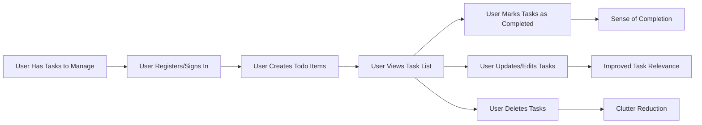

# Todo List Application – Service Overview

## Service Purpose and Vision
The Todo List Application exists to support users in managing their daily tasks with minimal friction and maximum clarity. WHEN users need to remember, prioritize, or complete daily tasks, THE system SHALL allow users to record, view, update, and complete their todos instantly. The vision is to eliminate obstacles to personal productivity, ensuring that adding a todo or marking one completed is never a source of frustration. Simplicity and speed are the guiding principles: there are no unnecessary features, delays, or distractions in the user experience.

## Core User Problem
WHEN individuals are overwhelmed by multiple tasks, fleeting ideas, and contextual shifts throughout the day, THE system SHALL provide a fast, reliable tool for capturing todos before they are forgotten. THE application SHALL solve these specific user problems:
- Users often forget important tasks because they lack an immediate way to record them.
- Complex, cluttered interfaces in other apps inhibit quick entry and viewing.
- Feature bloat in existing solutions leads to confusion and cognitive overload.
- Users need the confidence that tasks won’t be lost, even as priorities change rapidly.
The Todo List Application targets essential task management needs: instant capture, effortless review, and simple status updates. There are no barriers to entry, and task management is always just a tap or click away.

## Value Proposition
The Todo List Application offers value in these measurable ways:
- **Simplicity**: WHEN users interact with the application, THE interface SHALL present only necessary controls for adding, viewing, editing, and completing todos—nothing else.
- **Responsiveness**: WHEN any primary action is performed (add, update, complete, or delete a todo), THE system SHALL respond visually within 1 second to assure users that their action was successful.
- **Privacy and Ownership**: WHEN a todo is created, edited, or deleted, THE data SHALL be accessible only by the authenticated user who owns it. Tasks SHALL NOT be visible to or shared with other users.
- **Data Safety**: WHEN users take actions that change their data (such as delete), THE system SHALL offer a reversible action (e.g., undo for 30 seconds) to recover from mistakes.
- **Universal Access**: WHEN users access the service on any authenticated device, THE application SHALL synchronize task data in real-time and enforce secure access at all times.

## Market Differentiation
WHEN evaluating alternatives, THE Todo List Application SHALL distinguish itself by following these business rules:
- **Feature Minimalism**: ONLY the essential functions—add, view, update, and delete—are present. THERE SHALL BE NO collaboration, social, or sharing features in the MVP.
- **Immediate Onboarding**: WHEN new users sign up, THE system SHALL allow them to begin adding todos with NO setup or onboarding complexity.
- **Strict Privacy Commitment**: WHEN using the application, users SHALL NEVER see ads, experience upselling, or have their data shared or sold.
- **Single-User Focus**: WHEN designing features, THE system SHALL ensure all flows are for individual use, not teams or groups.
- **Reliable Speed**: All core operations SHALL be performed with an average system response time of less than 1 second during normal loads.

## Business Model
WHEN considering business sustainability, THE Todo List Application SHALL adhere to the following model:
- THE base service for todos SHALL BE provided free of charge to all users.
- Potential future revenue SHALL come exclusively from optional premium features (e.g., reminders, calendar integration, analytics), donation models, or “pay what you want”—NEVER from ads or sale of user data.
- Growth SHALL be measured by increased engagement and positive user feedback, not by aggressive monetization.

## Success Metrics
To objectively measure service quality, THE system SHALL use the following business success criteria:
- **Active User Base**: Growth in unique daily/monthly active users.
- **Retention Rate**: Percentage of users returning weekly/monthly.
- **Task Completion Rate**: Ratio of completed to created todos per user.
- **Incident Rate**: Incidents of lost, duplicated, or inaccessible todos SHALL BE ZERO.
- **User Feedback**: Target for positive net promoter score (NPS) greater than 50 and negative feedback below 3% of all user contacts.

## Visual Overview

> These requirements support the minimal, privacy-focused Todo List Application and anchor all downstream technical specifications.