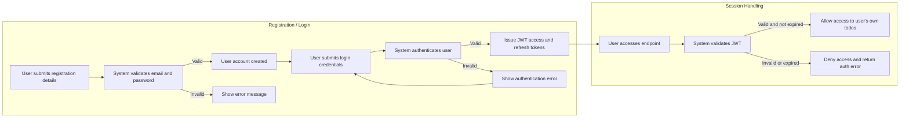

# Todo List Application – User Actors and Permissions

## User Types and Authentication

There is one user actor in the Todo List application: **user** – a registered individual who can create, view, update, and delete their own todo items. Anonymous, unregistered, or unauthenticated users are strictly denied all access. There are no administrative or guest roles in this application.

### Actor Definition
- **user**: A person with a valid, registered account, entitled only to manage their own todo items. Each user's data is strictly separated and cannot be viewed or modified by others.

### Registration and Authentication
- All users shall register with a valid email and password.
- Passwords must be at least 8 characters, with at least one letter and one number.
- An attempt to register with an already-used email shall be rejected.
- All system features shall be inaccessible unless the user is authenticated.
- Each action within the application must be validated against the authenticated user's identity.

## Permissions Matrix

| Action                                | user |
|---------------------------------------|------|
| Register account                      | ✅   |
| Login                                 | ✅   |
| Create todo                           | ✅   |
| View own todos                        | ✅   |
| Update own todo                       | ✅   |
| Delete own todo                       | ✅   |
| View other users' todos               | ❌   |
| Update other users' todos             | ❌   |
| Delete other users' todos             | ❌   |
| Reset password                        | ✅   |
| Logout                                | ✅   |

**Legend:** ✅ = permitted, ❌ = not permitted

## Authentication and Access Flow (Mermaid Diagram)

## Authentication Flow Requirements (EARS format)

### Registration
- WHEN a prospective user provides a unique email and compliant password, THE system SHALL create the user account and deny access until authentication is complete.
- WHEN a registration attempt uses an email already registered, THE system SHALL reject the attempt and provide a distinct error message.

### Login
- WHEN a user provides their registered email and correct password, THE system SHALL authenticate them and issue a JWT access token and refresh token.
- IF a login attempt uses invalid credentials, THEN THE system SHALL deny authentication and present an error message with no sensitive details.

### Password Management
- WHEN a user requests a password reset, THE system SHALL send a password reset link or code to the user's email (valid for a limited time).
- WHEN a valid password reset request is made and the new password meets complexity rules, THE system SHALL update the password.
- IF a password reset token is invalid or expired, THEN THE system SHALL deny the reset and show an error message.

### Session and Token Management
- THE system SHALL issue JWT access tokens with a lifespan no longer than 30 minutes.
- THE system SHALL issue refresh tokens allowing session renewal for a maximum of 30 days.
- WHEN a user logs out, THE system SHALL invalidate their refresh tokens.
- WHEN a request presents an expired or invalid JWT, THE system SHALL deny access and prompt the user to re-authenticate.

### Data Ownership and Access Control
- WHEN an authenticated user attempts to create, view, update, or delete a todo, THE system SHALL confirm that the todo item belongs to that user.
- IF a user attempts any operation on another user's todo, THEN THE system SHALL deny access and return a forbidden error.

## Security Considerations

- THE system SHALL securely store and transmit passwords using proven cryptography.
- THE system SHALL use HTTPS for all client-server communication.
- User sessions SHALL expire after 30 days of inactivity; active tokens expire after 30 minutes.
- IF there are more than 5 failed login attempts within 10 minutes, THEN THE system SHALL temporarily lock the account for 15 minutes.
- The system SHALL never expose emails, tokens, or personal data to other users.
- Only minimal profile data (user id, email) and user todos are persistently stored.
- THE system SHALL comply with data minimization and privacy best practices.

## Summary for Developers

- The application contains only the 'user' actor, with CRUD access limited strictly to their own todos.
- All access control is enforced through strict data ownership: no user may interact with any data not owned by them.
- Access to any endpoint requires full authentication.
- There are no admin or public endpoints; no action can be performed except by an authenticated, registered user.
- All business and security requirements are specified above. Backend implementation must ensure strict adherence, including session, token, and error handling as detailed.