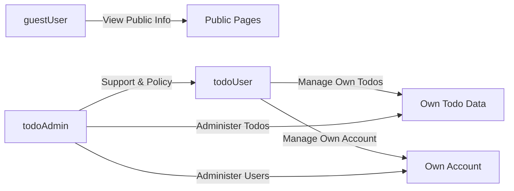

# User Actors and Permissions Requirements for Minimal Todo Service (todoApp)

## 1. Purpose and Scope

The todoApp minimal Todo service supports a very small set of well-defined user types and permissions. The goal is to provide just enough authentication and authorization behavior to keep each user’s Todo items private, while allowing limited administrative oversight.

The requirements in this document:
- Describe **who** can use the service.
- Describe **what** each user type is allowed and not allowed to do.
- Define **how** authentication and sessions behave from a business perspective.
- Define **how** authorization decisions are made in business terms.
- Define **what** security and privacy expectations apply to user and Todo data.

The document does **not** specify:
- Technical protocols (e.g., OAuth versions, token formats, libraries).
- API endpoints, payload formats, or database schemas.

All requirements that describe behavior are written using EARS (Easy Approach to Requirements Syntax) where applicable.

## 2. User Actors

The todoApp recognizes three user actors.

### 2.1 guestUser

A **guestUser** is a person who is not authenticated.

Business characteristics:
- Has not created an account or is not currently logged in.
- Can only view public information about the service.
- Cannot view, create, or change any Todo data.

EARS requirements:
- THE todoApp service SHALL treat any unauthenticated person as guestUser.
- THE todoApp service SHALL allow guestUser to access only non-sensitive public information such as service description or help pages.
- THE todoApp service SHALL prevent guestUser from accessing any Todo item or Todo list.
- THE todoApp service SHALL prevent guestUser from performing any create, update, or delete operation on Todo items or user accounts.

### 2.2 todoUser

A **todoUser** is an authenticated end user who owns and manages personal Todo items.

Business characteristics:
- Has a registered account and has successfully logged in.
- Owns a personal set of Todo items that only this user (and authorized administrators) can see.
- Expects privacy and control over their Todos and basic account details.

Typical goals:
- Capture tasks quickly.
- Review the list of tasks that still need to be done.
- Mark tasks as completed.
- Adjust or delete tasks that are no longer relevant.

EARS requirements:
- THE todoApp service SHALL allow todoUser to create Todo items that are associated only with that todoUser.
- THE todoApp service SHALL allow todoUser to view a list of Todo items that belong only to that todoUser.
- THE todoApp service SHALL allow todoUser to update Todo items that belong only to that todoUser.
- THE todoApp service SHALL allow todoUser to delete Todo items that belong only to that todoUser.
- THE todoApp service SHALL prevent todoUser from accessing Todo items that belong to any other user.

### 2.3 todoAdmin

A **todoAdmin** is an administrative operator with extended privileges for support and policy enforcement.

Business characteristics:
- Uses the service mainly to support users or maintain order (for example, resolving issues, handling abuse).
- May need to view or change user accounts and Todo data in exceptional cases.
- Must be accountable for all actions due to privacy and trust concerns.

EARS requirements:
- THE todoApp service SHALL allow todoAdmin to view user account information and Todo data for any user when necessary for support, security, or policy enforcement.
- THE todoApp service SHALL allow todoAdmin to update or delete Todo items for any user when necessary for support, security, or policy enforcement.
- THE todoApp service SHALL allow todoAdmin to deactivate or lock user accounts when required by business policy.
- THE todoApp service SHALL record administrative actions performed by todoAdmin in a form suitable for later review.

## 3. Authentication and Session Management

Authentication defines how users prove who they are, and sessions define how long that proof stays valid.

### 3.1 Registration

Registration is how a person becomes a todoUser.

EARS requirements:
- WHEN a person submits valid registration information that meets business rules, THE todoApp service SHALL create a new todoUser account.
- WHEN a person completes registration successfully, THE todoApp service SHALL allow that person to authenticate as todoUser using the registered credentials.
- IF a person submits registration information that is missing any required field, THEN THE todoApp service SHALL reject the registration and indicate which required fields are missing.
- IF a person submits registration information that violates business rules (for example, duplicate identity, invalid credentials policy), THEN THE todoApp service SHALL reject the registration and indicate that the registration failed.

### 3.2 Login

Login is how a person becomes an authenticated todoUser or todoAdmin.

EARS requirements:
- WHEN a todoUser or todoAdmin submits correct login credentials, THE todoApp service SHALL authenticate the user and establish an authenticated session bound to that account.
- WHEN a todoUser or todoAdmin submits incorrect login credentials, THE todoApp service SHALL reject the login attempt and SHALL not indicate which specific credential was incorrect.
- WHEN a user with a deactivated or locked account attempts to log in, THE todoApp service SHALL reject the login attempt and SHALL indicate that the account is not currently allowed to sign in.
- IF multiple consecutive failed login attempts occur for the same account within a short period, THEN THE todoApp service SHALL apply protective measures such as temporary blocking according to business policy.

### 3.3 Logout

Logout is how an authenticated user ends their session.

EARS requirements:
- WHEN a todoUser or todoAdmin initiates logout, THE todoApp service SHALL terminate the active authenticated session for that user.
- AFTER logout, THE todoApp service SHALL treat further requests from that user context as guestUser until a new successful login occurs.

### 3.4 Session Duration and Expiration

Sessions represent time-limited authenticated states.

EARS requirements:
- WHILE a session is active and not expired, THE todoApp service SHALL recognize the associated user as todoUser or todoAdmin and allow access to permitted operations without re-authentication.
- WHEN a session exceeds the configured inactivity timeout, THE todoApp service SHALL treat the session as expired and SHALL require re-authentication for further protected operations.
- WHEN a todoUser or todoAdmin explicitly revokes all sessions (for example, "log out of all devices"), THE todoApp service SHALL invalidate all active sessions associated with that account.

### 3.5 Password and Credential Management

EARS requirements:
- THE todoApp service SHALL allow todoUser to change their password after providing valid current authentication information.
- WHEN a todoUser initiates a password reset, THE todoApp service SHALL verify that the requester controls the account’s contact method (for example, email) before allowing the password change.
- IF a password reset attempt fails ownership verification, THEN THE todoApp service SHALL deny the reset and SHALL keep the current password unchanged.

## 4. Authorization Rules

Authorization determines what an authenticated user is allowed to do. The todoApp uses simple role-based and ownership-based rules.

### 4.1 General Principles

EARS requirements:
- THE todoApp service SHALL enforce least-privilege access so that each actor can perform only the actions needed for their role.
- THE todoApp service SHALL base authorization decisions on both the actor’s role (guestUser, todoUser, todoAdmin) and the ownership of the target data.
- THE todoApp service SHALL ensure that data owned by one todoUser is not visible or modifiable by another todoUser.

### 4.2 Access to Public Information

EARS requirements:
- THE todoApp service SHALL allow guestUser, todoUser, and todoAdmin to access public non-sensitive information such as help pages and service description.

### 4.3 Access to Own Todo Items (todoUser)

EARS requirements:
- WHEN a todoUser creates a Todo item, THE todoApp service SHALL associate the Todo item with that todoUser as its owner.
- WHEN a todoUser requests a list of Todo items, THE todoApp service SHALL return only Todo items owned by that todoUser.
- WHEN a todoUser requests details of a specific Todo item, THE todoApp service SHALL allow access only if the Todo item is owned by that todoUser.
- WHEN a todoUser requests to update a Todo item, THE todoApp service SHALL allow the update only if the Todo item is owned by that todoUser.
- WHEN a todoUser requests to delete a Todo item, THE todoApp service SHALL allow the deletion only if the Todo item is owned by that todoUser.

### 4.4 Prevention of Cross-User Access

EARS requirements:
- IF a todoUser attempts to access a Todo item that is not owned by that todoUser, THEN THE todoApp service SHALL deny the request and SHALL avoid revealing whether the Todo item exists.
- IF a guestUser attempts to access any Todo item or Todo list, THEN THE todoApp service SHALL deny the request and SHALL indicate that authentication is required.

### 4.5 Administrative Capabilities (todoAdmin)

EARS requirements:
- WHEN a todoAdmin performs a lookup for support or policy enforcement, THE todoApp service SHALL allow todoAdmin to retrieve Todo items and basic account information for any user.
- WHEN a todoAdmin updates or deletes a Todo item for support or policy reasons, THE todoApp service SHALL allow the change regardless of ownership, provided the action is consistent with business policy.
- WHEN a todoAdmin deactivates or locks a user account, THE todoApp service SHALL prevent further login for that account and SHALL revoke any active sessions.
- THE todoApp service SHALL log sensitive todoAdmin operations such as cross-user data access, account deactivation, and administrative deletions.

## 5. Permission Matrix

The table summarizes what each actor is allowed to do at a business level.

| Business Action                                           | guestUser | todoUser | todoAdmin |
|-----------------------------------------------------------|-----------|----------|-----------|
| View public service information                           | Yes       | Yes      | Yes       |
| Register a new user account                               | Yes       | Yes      | Yes       |
| Log in to an existing user account                        | No        | Yes      | Yes       |
| Log out of current session                                | No        | Yes      | Yes       |
| Create a Todo for self                                    | No        | Yes      | Yes       |
| List own Todos                                            | No        | Yes      | Yes       |
| View own Todo                                             | No        | Yes      | Yes       |
| Update own Todo                                           | No        | Yes      | Yes       |
| Delete own Todo                                           | No        | Yes      | Yes       |
| View Todos of another user                                | No        | No       | Yes       |
| Update or delete Todos of another user                    | No        | No       | Yes       |
| View another user’s account details                       | No        | No       | Yes       |
| Deactivate or lock a user account                         | No        | No       | Yes       |
| Change own password                                       | No        | Yes      | Yes       |
| Initiate password reset for own account                   | No        | Yes      | Yes       |
| Revoke all own sessions (log out from all devices)        | No        | Yes      | Yes       |

Notes:
- todoAdmin can perform operations on their own Todo items as a normal todoUser as well as administrative operations across users.
- guestUser has no access to Todo data or account management beyond starting registration.

## 6. Security and Privacy Expectations

### 6.1 Protection of Credentials and Identity Data

EARS requirements:
- THE todoApp service SHALL protect user credentials so that unauthorized parties cannot read or reuse them in normal operation.
- THE todoApp service SHALL avoid exposing sensitive identity attributes (such as contact details) in responses unless required for business reasons.
- THE todoApp service SHALL avoid logging sensitive credentials such as passwords in any logs.

### 6.2 Data Isolation and Privacy for Todos

EARS requirements:
- THE todoApp service SHALL strictly isolate Todo data belonging to different todoUser accounts so that one todoUser cannot see or infer the Todo items of another todoUser.
- WHEN a todoAdmin accesses user or Todo data for support or policy reasons, THE todoApp service SHALL treat this as a privileged action and SHALL ensure it is logged for later review.

### 6.3 Logging and Auditability

EARS requirements:
- THE todoApp service SHALL log key security-relevant events such as registration, login success, login failure, password reset, account deactivation, and administrative changes to Todo data.
- WHEN a security-relevant event is logged, THE todoApp service SHALL log only information needed to understand what happened and SHALL avoid recording full Todo content or passwords.

### 6.4 Performance Expectations Related to Security

EARS requirements:
- THE todoApp service SHALL process typical authentication operations (registration, login, logout, password change) within a few seconds so that users perceive the system as responsive.
- THE todoApp service SHALL perform authorization checks quickly enough that they do not become the dominant source of delay in Todo operations.

## 7. Error Handling for Authentication and Authorization

Error handling here is described only from the user’s perspective; technical error codes are not specified.

### 7.1 Authentication Errors

EARS unwanted-behavior requirements:
- IF a person attempts to log in with incorrect credentials, THEN THE todoApp service SHALL reject the login and SHALL present a generic message that authentication failed.
- IF a person attempts to log in to an account that is locked or deactivated, THEN THE todoApp service SHALL reject the login and SHALL indicate that the account is not currently available.
- IF a todoUser attempts to use an expired or invalid session, THEN THE todoApp service SHALL treat the user as guestUser and SHALL require re-authentication for protected actions.

### 7.2 Authorization Errors

EARS unwanted-behavior requirements:
- IF a guestUser attempts to access any Todo operation, THEN THE todoApp service SHALL deny the request and SHALL indicate that login is required.
- IF a todoUser attempts to access or modify a Todo item that does not belong to that todoUser, THEN THE todoApp service SHALL deny the request and SHALL not reveal whether the Todo item exists.
- IF a todoUser attempts to invoke an administrative-only capability, THEN THE todoApp service SHALL deny the request and SHALL indicate insufficient permissions.

### 7.3 Rate Limiting and Abuse Protection (Auth Perspective)

EARS unwanted-behavior requirements:
- IF repeated failed authentication attempts for the same account occur within a short time window, THEN THE todoApp service SHALL apply protective measures such as temporary blocking or throttling according to business policy.
- IF unusual patterns of access occur that suggest abuse of authentication or authorization mechanisms, THEN THE todoApp service SHALL make these patterns visible through logs or monitoring so that operators can investigate and respond.

## 8. Mermaid Diagram: Actors and Permissions Overview

The diagram conceptually shows how each actor relates to the Todo data and account information at a business level. It does not include technical details.
