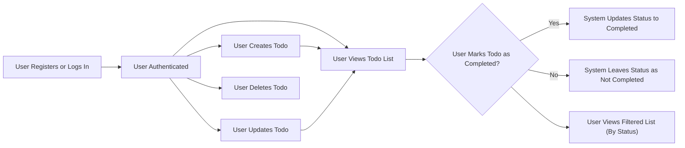

# Business and Functional Requirements for Minimal Todo List Application

## Feature List
The minimal Todo list application will provide only the essential set of core features required to allow individual users to manage their own personal tasks. All features are tightly scoped for a fast, simple, and secure MVP backend system.

- User registration and authentication (email/password)
- Creation of personal todo items
- Retrieval of the user's entire todo list
- Updating individual todo items
- Deletion of todo items
- Marking todo items as completed or uncompleted
- Filtering and viewing todos by status (completed/not completed)
- Strict segregation of user data; each user can access only their own todos

Additional features such as reminder scheduling, sharing, priorities, tags, attachments, or batch actions are not in scope for this MVP.

## Core Functional Requirements (EARS Format)

### User Registration and Authentication
- THE system SHALL allow anyone to create a new account by registering with a valid email and password.
- THE system SHALL enforce unique email addresses for account registration.
- THE system SHALL require users to login with their credentials to access any functionality beyond registration.
- WHEN a user fails to login due to invalid credentials, THE system SHALL deny access, show a clear error, and NOT reveal any account existence details.
- WHEN a user is successfully authenticated, THE system SHALL enable access only to the authenticated user's own resources.
- IF a user's session expires, THEN THE system SHALL require re-authentication before permitting access to todo resources.
- WHEN a user logs out, THE system SHALL terminate the user's session securely.
- THE system SHALL provide only minimal error information for authentication failures to prevent enumeration and security risks.

### Todo Item Management
- WHEN an authenticated user creates a todo, THE system SHALL store the todo with a unique identifier, timestamps, title, optional description, and completion status (default to not completed); the todo is permanently linked to the creating user.
- WHEN a user requests their todo list, THE system SHALL return a list of todos created by that user, sorted by creation time (most recent first).
- WHEN a user updates a todo, THE system SHALL allow update ONLY if the user owns the todo; title, description, and completion status are updatable.
- IF a user attempts to update a todo that does not belong to them, THEN THE system SHALL deny the action and return a clear error message without leaking information about others' data.
- WHEN a user deletes a todo, THE system SHALL allow the deletion ONLY if the user owns the todo and immediately remove it from all further queries.
- IF a user attempts to delete a todo belonging to another user, THEN THE system SHALL deny the action and indicate lack of rights.

### Todo Status Tracking and Filtering
- WHEN a user marks a todo as completed, THE system SHALL update the status to "completed" for that todo only.
- WHEN a user marks a todo as not completed, THE system SHALL update the status to "not completed." 
- THE system SHALL allow the user to filter their list for completed or active (not completed) todos.
- IF a user attempts to change the status of another user's todo, THEN THE system SHALL deny the action and present a permission error.

### Data and Input Validation
- WHEN creating or updating a todo, THE system SHALL require a non-empty title with 1 to 255 characters and enforce this actively in all write operations.
- THE system SHALL accept an optional description up to 1000 characters; if provided, must not exceed this.
- WHEN input is invalid, THE system SHALL return actionable, clear error messages and NOT persist the invalid changes.
- WHEN a user attempts to create a todo with a blank or overlong title or description, THE system SHALL immediately reject the request with a validation error.

### Business Logic, Ownership, and Permissions
- THE system SHALL ensure that only the creator (owner) of a todo can view, update, mark as completed, or delete that todo.
- THE system SHALL NOT allow sharing, transferring, or delegating todos in any way; all ownership is user-specific.
- THE system SHALL enforce a hard limit of up to 1000 concurrent todos per user; upon attempting to exceed this, creation SHALL fail with an error.

### Security and Data Protection
- THE system SHALL never expose any todo or metadata to anyone except its owner; all access control rules are strictly enforced on each operation.
- All error messages relating to access, denial, or authentication SHALL not leak details about other users or system internals.
- All session, credential, and token management SHALL follow security best practices and use only standard secure protocols.
- Application SHALL guard against injection, enumeration, and all common web security risks per OWASP Top 10.

### Performance and Responsiveness
- WHEN a user requests their todo list (up to 1000 todos), THE system SHALL return a response within 2 seconds or less.
- THE system SHALL respond to all error conditions (validation, permission, authentication, not found) within 2 seconds.

## Business Rules

- Each user is defined as a registered, authenticated actor; no other roles exist for this MVP.
- Every todo is uniquely and immutably associated with a single user; a user can only operate on their own todos.
- Each todo includes a unique identifier, creation timestamp, last-modified timestamp, required title, optional description, and a completion status (boolean or enumerated value).
- No batch/bulk actions (such as multi-delete or multi-complete) are available.
- Strict limits: title (1–255 chars), description (0–1000 chars), up to 1000 todos per user enforced in all creation operations.
- System must prevent creation of more than 1000 concurrent todos for any user.
- All user data is private, segregated, and protected from cross-user access at all API layers.

## Success Criteria

- All core features and functional requirements above are implemented in the backend to completion with no omissions, and are testable via automated tests.
- All validation and security rules are enforced on every operation, with clear error handling.
- All responses (including errors) are friendly, clear, and never leak confidential or technical information.
- No data loss under normal operation; all changes are consistent and persistent.
- All access and permission rules are enforced with zero exceptions; no user can perform actions on other users' data.
- System performance under expected load (up to 1000 todos) meets or exceeds response target for both data and error cases.

## User Journey & System Workflow (Mermaid)

---

This requirements document specifies the strict minimal features, rules, and quality criteria that the backend implementation for the Todo list application MUST satisfy. No additional features, user roles, or data sharing mechanisms are permitted unless separately specified by a new requirements document.