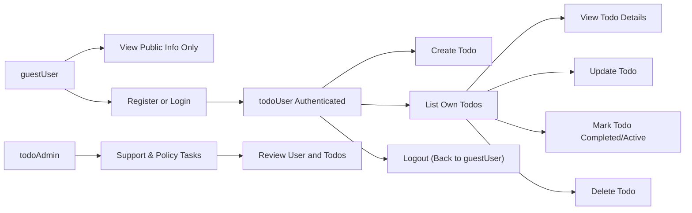

# Requirements Analysis for Minimal Todo Application

## 1. Purpose and Scope

THE purpose of the minimal Todo application SHALL be to provide individual users with a simple way to create, view, update, complete, and delete personal tasks, without unnecessary extra features.

THE scope of this requirements analysis SHALL be limited to business-level behavior for a Todo list backend service, focusing only on the minimal functionality that still delivers clear value to users who want to manage personal tasks.

THE requirements in this analysis SHALL avoid technical details such as APIs, storage technologies, or specific frameworks and SHALL instead describe observable behaviors and business rules.

## 2. Actors and Roles

### 2.1 guestUser

A guestUser is any person who accesses the service without being logged in.

- THE service SHALL treat guestUser as an unauthenticated actor.
- THE service SHALL allow guestUser to see only non-sensitive, public information such as a basic description of the service.
- THE service SHALL prevent guestUser from accessing any Todo items or performing any Todo operations.

### 2.2 todoUser

A todoUser is an authenticated end user with a personal account.

- THE service SHALL treat todoUser as the owner of a private set of Todo items.
- THE service SHALL ensure that each todoUser can see and manage only their own Todos.
- THE service SHALL require todoUser to be authenticated before any Todo operation is allowed.

### 2.3 todoAdmin (minimal)

A todoAdmin is an administrative actor who may need limited oversight capabilities.

- THE service SHALL allow todoAdmin to access Todo and account information only when required for support, abuse handling, or policy enforcement.
- THE service SHALL treat todoAdmin actions as exceptional and SHALL log them in a form suitable for later review.

## 3. Core Business Goals

- THE minimal Todo application SHALL focus on reliability and simplicity over feature richness.
- THE minimal Todo application SHALL allow a todoUser to manage tasks end-to-end: create, view, update, complete, and delete.
- THE minimal Todo application SHALL keep each user’s Todo items private from other users.

Out-of-scope for this minimal version:

- Shared or collaborative Todo lists.
- Complex scheduling, reminders, or integrations with external tools.
- Advanced fields such as subtasks, tags, or attachments.

## 4. Concept of a Todo Item

A Todo item represents a single task the user wants to remember and possibly complete.

At minimum, each Todo item is understood to have:

- A short text title describing the task.
- An optional longer description for details.
- A status that indicates whether it is active or completed.
- Ownership information linking it to exactly one todoUser.
- Basic timestamps (for example, creation time and last updated time; completion time when completed).

- THE service SHALL treat a Todo item as valid only when it satisfies the business rules in this document.

## 5. Functional Requirements by User Goal

### 5.1 Registering and Logging In (precondition for Todos)

Although the minimal Todo application focuses on task management, basic account behavior is required.

- WHEN a person provides valid registration information, THE service SHALL create a todoUser account that can later own Todos.
- WHEN a todoUser provides valid login credentials, THE service SHALL establish an authenticated session for that todoUser.
- IF a person provides invalid or incomplete registration or login information, THEN THE service SHALL reject the attempt and explain that authentication failed without revealing internal details.

### 5.2 Creating a Todo

Main goal: allow todoUser to add a new task quickly.

- WHEN an authenticated todoUser submits a request to create a new Todo with a non-empty title, THE service SHALL create a Todo item owned by that todoUser.
- WHEN todoUser omits a description while creating a Todo, THE service SHALL accept creation and treat the description as empty or absent.
- WHEN todoUser provides a title composed only of whitespace, THE service SHALL reject the creation and indicate that a non-empty title is required.
- WHEN todoUser provides a title that exceeds the allowed maximum length, THE service SHALL reject the creation and indicate that the title is too long.
- WHEN a Todo is created successfully, THE service SHALL set its status to active by default.
- WHEN a Todo is created successfully, THE service SHALL record that it belongs only to the creating todoUser and not to any other user.

### 5.3 Viewing and Listing Todos

Main goal: allow todoUser to see the tasks they have recorded.

- WHEN an authenticated todoUser requests their Todo list, THE service SHALL return only Todos owned by that todoUser.
- WHEN a todoUser with no Todos requests their Todo list, THE service SHALL return an empty list rather than an error.
- WHEN an authenticated todoUser requests details of a specific Todo by its identifier, THE service SHALL show the Todo only if the Todo is owned by that todoUser.
- IF a todoUser requests details of a Todo that does not exist or is not owned by that todoUser, THEN THE service SHALL refuse access and avoid revealing whether the Todo exists.
- WHERE simple filtering by completion status is supported, THE service SHALL allow todoUser to request only active or only completed Todos from their own list.

### 5.4 Updating a Todo

Main goal: allow todoUser to correct or refine task information.

- WHEN an authenticated todoUser submits changes to a Todo they own, THE service SHALL update the Todo if the new values follow all business rules.
- WHEN a todoUser updates the title of a Todo, THE service SHALL reject the update if the new title is empty, whitespace-only, or exceeds the maximum allowed length.
- WHEN a todoUser updates the description of a Todo, THE service SHALL reject the update if the new description exceeds the maximum allowed length.
- WHEN a Todo is updated successfully, THE service SHALL refresh its last updated timestamp.
- IF a todoUser attempts to update a Todo that they do not own, THEN THE service SHALL reject the update and SHALL not change any data.

### 5.5 Marking a Todo as Completed or Active

Main goal: allow todoUser to track which tasks are done.

- WHEN an authenticated todoUser requests to mark an active Todo they own as completed, THE service SHALL set the status of that Todo to completed.
- WHEN a Todo is marked as completed, THE service SHALL keep its original title and description unchanged unless explicitly updated.
- WHERE completion time is tracked, THE service SHALL record the time when the Todo is marked as completed.
- WHEN an authenticated todoUser requests to mark a completed Todo they own as active again, THE service SHALL set the status back to active and adjust any completion-related metadata according to the business rules.
- IF a todoUser attempts to change the status of a Todo that they do not own, THEN THE service SHALL reject the change.

### 5.6 Deleting a Todo

Main goal: allow todoUser to remove tasks that are no longer needed.

- WHEN an authenticated todoUser requests deletion of a Todo they own, THE service SHALL remove that Todo from the todoUser’s normal Todo list views.
- WHERE deletion is soft in the first version, THE service SHALL mark the Todo as deleted while hiding it from standard lists and details for the owning todoUser.
- WHERE deletion is hard in the first version, THE service SHALL permanently remove the Todo so that it can no longer be retrieved.
- IF a todoUser attempts to delete a Todo that they do not own, THEN THE service SHALL reject the deletion and SHALL not remove the Todo.
- IF a todoUser attempts to delete a Todo that does not exist, THEN THE service SHALL indicate that the Todo cannot be found.

### 5.7 Logging Out

Main goal: allow users to end their session safely.

- WHEN an authenticated todoUser or todoAdmin chooses to log out, THE service SHALL end the current session.
- AFTER logout, THE service SHALL treat further Todo operations from that context as if they were from guestUser until authentication occurs again.

## 6. Ownership, Privacy, and Admin Oversight

### 6.1 Ownership and Isolation

- THE service SHALL associate each Todo with exactly one owning todoUser.
- THE service SHALL prevent todoUser from viewing, listing, updating, completing, or deleting any Todo owned by another todoUser.
- WHEN an authenticated todoUser performs any Todo operation, THE service SHALL verify that the target Todo belongs to that todoUser, except when creating new Todos where ownership is being established.

### 6.2 Administrative Access

- WHERE a todoAdmin needs to investigate a support issue or policy violation, THE service SHALL allow todoAdmin to view user accounts and associated Todos as permitted by business policy.
- WHERE todoAdmin performs changes to a user’s Todo items (such as removing inappropriate content), THE service SHALL apply the same validation rules as for normal user updates.
- WHERE todoAdmin performs sensitive changes, THE service SHALL record that an administrative action occurred, including which account and Todo were affected.

## 7. Validation and Business Rules (Summary)

### 7.1 Required Fields

- THE service SHALL require a non-empty title to create or update a Todo.
- THE service SHALL not require a description to create a Todo.

### 7.2 Length Constraints

- THE service SHALL enforce an upper length limit for the Todo title that keeps titles short and scannable (for example, a few hundred characters at most, as defined by business policy).
- THE service SHALL enforce an upper length limit for the description that allows useful detail but prevents excessively long text.

### 7.3 Status Rules

- THE service SHALL support at least two statuses for Todos: active and completed.
- WHEN a Todo is created without an explicit status, THE service SHALL treat it as active.
- WHEN a Todo’s status is changed, THE service SHALL ensure that the new status is one of the allowed values.

### 7.4 Error Handling (Business View)

- IF any Todo operation is attempted with missing required fields, THEN THE service SHALL reject the request and explain which information is missing.
- IF any Todo operation is attempted with invalid data (such as too-long text or invalid status), THEN THE service SHALL reject the request and indicate what must be corrected.
- IF any Todo operation is attempted without authentication, THEN THE service SHALL reject the request and indicate that login is required.

## 8. Non-functional Expectations (Lightweight)

These expectations are included only to the extent that they affect how functional behavior should feel to users.

- THE service SHALL respond to normal Todo operations (create, read, update, delete, list) fast enough that users can interact without noticeable delay under typical usage conditions.
- THE service SHALL behave predictably and consistently, returning similar responses for the same type of success or error condition.
- THE service SHALL protect Todo content so that only the owning todoUser and authorized administrators can access it.

## 9. High-Level Functional Coverage Diagram

## 10. Summary

The minimal Todo application is defined as a private, per-user task list where each authenticated todoUser can create, view, update, complete, and delete only their own Todo items. guestUser can see only public information and cannot interact with Todos. todoAdmin has limited oversight rights for support and policy enforcement.

All requirements are written in business language so that backend developers can design any suitable technical solution that satisfies these behaviors while keeping the overall functionality as small and focused as possible for the first version.