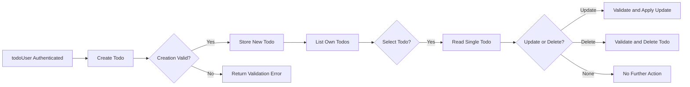
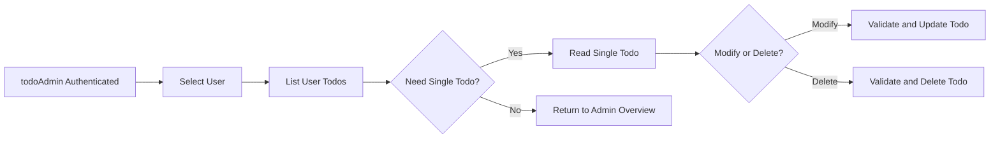

# Functional Requirements for Minimal Todo Service (todoApp)

## 1. Introduction and Scope

### 1.1 Purpose

THE purpose of this document SHALL be to define all functional requirements for the minimal Todo feature set of the service identified by the prefix `todoApp`.

THE functional requirements in this document SHALL describe **what** the system must do from a business and user-behaviour perspective and SHALL avoid prescribing **how** to implement it technically.

### 1.2 System Overview (Business View)

THE todoApp service SHALL allow authenticated users to manage personal Todo items through a small set of well-defined actions: creating Todos, viewing Todos, updating Todos (including marking them as completed), and deleting Todos.

THE todoApp service SHALL ensure that each Todo belongs to exactly one user and that users can only see and manipulate their own Todos, except where administrative roles are explicitly allowed broader access in other business documents.

### 1.3 In-Scope Functional Areas

THE minimal functional scope for todoApp SHALL include:

- Management of individual Todo items (create, read, update, delete).
- Listing and simple filtering of a user’s Todos.
- Enforcement of per-user ownership and isolation of Todo data.
- Handling of basic completion status and minimal metadata (creation time, last update time, optional completion time).

### 1.4 Out-of-Scope Functional Areas

THE following feature areas SHALL be considered out of scope for the first release of todoApp:

- Shared Todo lists across multiple users.
- Collaborative editing of Todos.
- Recurring Todos.
- Complex prioritisation or tagging systems beyond simple fields.
- External calendar or messaging integrations.
- Automated reminders via email, push notification, or similar.
- Subtasks, nested Todos, or project hierarchies.
- File or media attachments.

WHERE a feature is not explicitly listed as in scope in this document, THE todoApp service SHALL treat that feature as out-of-scope for the minimal version.

## 2. Actors and High-Level Assumptions

### 2.1 Actors Relevant to Todo Functions

- **guestUser**: unauthenticated visitor with no access to Todo data.
- **todoUser**: authenticated end user who manages personal Todos.
- **todoAdmin**: administrative actor with special responsibilities defined in other business documents.

### 2.2 Global Behaviour Assumptions

- THE todoApp service SHALL require an authenticated todoUser session before allowing any access to Todo data, except where todoAdmin is acting under administrative rules defined elsewhere.
- THE todoApp service SHALL treat guestUser as having no permissions to create, view, update, delete, or list Todos.

## 3. Scope of Functional Requirements

### 3.1 Business Definition of a Todo

THE todoApp service SHALL treat a Todo as a simple record representing one actionable item a user wants to remember and complete.

EACH Todo item SHALL conceptually include at least:

- A **title** that briefly describes the task.
- An optional **description** with additional details.
- A **status** indicating whether the task is active or completed.
- **Ownership** information linking the Todo to exactly one todoUser.
- **Timestamps** that record creation time and last update time.
- An optional **completion time** recorded when a Todo becomes completed.

### 3.2 Minimal Feature Set Summary

- THE todoApp service SHALL support creating new Todos.
- THE todoApp service SHALL support reading a single Todo.
- THE todoApp service SHALL support listing multiple Todos.
- THE todoApp service SHALL support updating existing Todos.
- THE todoApp service SHALL support deleting Todos.
- THE todoApp service SHALL support simple filtering of Todos by completion status.

## 4. Todo Item Requirements

### 4.1 Creation of Todos

#### 4.1.1 Basic Creation Behaviour

WHEN a todoUser with a valid session submits a request to create a new Todo that satisfies all validation rules, THE todoApp service SHALL create one new Todo item and associate it with that todoUser.

WHEN a todoAdmin submits a request to create a new Todo on behalf of a specific user that satisfies all validation rules, THE todoApp service SHALL create one new Todo item and associate it with the specified user.

IF a guestUser attempts to create a Todo, THEN THE todoApp service SHALL reject the attempt and SHALL not create any Todo.

#### 4.1.2 Required Fields on Creation

WHEN a todoUser creates a Todo, THE todoApp service SHALL require a title that contains at least one non-whitespace character.

WHEN a todoUser creates a Todo, THE todoApp service SHALL treat description as optional.

WHEN a todoUser creates a Todo without explicitly providing a status, THE todoApp service SHALL set the status to an active state.

WHEN a todoUser creates a Todo, THE todoApp service SHALL automatically assign ownership of that Todo to the todoUser.

WHEN a todoAdmin creates a Todo on behalf of another user, THE todoApp service SHALL require an unambiguous reference to the target user and SHALL assign ownership of that Todo to the target user.

IF a todoAdmin attempts to create a Todo for a user that does not exist or is not eligible for new Todos, THEN THE todoApp service SHALL reject the creation request.

#### 4.1.3 Validation on Creation

WHEN a todoUser submits a Todo creation request with a title composed only of whitespace, THE todoApp service SHALL reject the request and SHALL not create a Todo.

WHEN a todoUser submits a Todo creation request where the title exceeds the maximum allowed length defined in business rules, THE todoApp service SHALL reject the request and SHALL not create a Todo.

WHEN a todoUser submits a Todo creation request with a description, THE todoApp service SHALL reject the request if the description exceeds the maximum allowed length defined in business rules.

WHEN a todoUser provides a status value for a new Todo, THE todoApp service SHALL accept the status only if the value is one of the allowed status values.

#### 4.1.4 Timestamps on Creation

WHEN a Todo is created successfully, THE todoApp service SHALL record a creation timestamp.

WHEN a Todo is created successfully, THE todoApp service SHALL set the last update timestamp to the creation timestamp.

WHEN a Todo is created with an active status, THE todoApp service SHALL ensure that no completion time is set.

WHEN a Todo is created with a completed status, THE todoApp service SHALL set the completion time equal to the creation time.

### 4.2 Reading a Single Todo

#### 4.2.1 Access to Own Todo

WHEN a todoUser with a valid session requests a specific Todo by its identifier, THE todoApp service SHALL return the Todo details only if the Todo is owned by that todoUser and is not permanently removed.

IF a todoUser attempts to read a Todo that is not owned by that todoUser, THEN THE todoApp service SHALL deny access and SHALL not reveal whether the Todo exists.

#### 4.2.2 Admin Reading

WHEN a todoAdmin requests a specific Todo by its identifier for a legitimate administrative purpose, THE todoApp service SHALL return the Todo details if the Todo exists, including Todos owned by any user.

IF a todoAdmin requests a Todo that does not exist or has been permanently removed, THEN THE todoApp service SHALL indicate that the Todo cannot be found.

#### 4.2.3 Guest Reading

IF a guestUser attempts to read any Todo, THEN THE todoApp service SHALL reject the request and SHALL not return Todo details.

### 4.3 Listing Multiple Todos

#### 4.3.1 Listing for a todoUser

WHEN a todoUser requests a list of Todos, THE todoApp service SHALL return a list containing only Todos owned by that todoUser that have not been permanently removed.

WHEN a todoUser requests a list of Todos without specifying any filter, THE todoApp service SHALL include both active and completed Todos owned by that todoUser.

WHEN a todoUser requests a list of Todos without specifying any sort order, THE todoApp service SHALL order the Todos by creation time in descending order.

#### 4.3.2 Listing for a todoAdmin

WHEN a todoAdmin requests a list of Todos for a specific user, THE todoApp service SHALL return a list containing only Todos owned by that user that have not been permanently removed.

WHERE business policy requires todoAdmin to specify a user when listing Todos, THE todoApp service SHALL reject any todoAdmin listing request that does not specify a target user.

#### 4.3.3 Listing for a guestUser

IF a guestUser attempts to list Todos, THEN THE todoApp service SHALL reject the request and SHALL not return any Todo data.

### 4.4 Updating Todos

#### 4.4.1 Updating Own Todo

WHEN a todoUser submits an update request for a Todo that is owned by that todoUser and provides data that satisfies all validation rules, THE todoApp service SHALL apply the updates to that Todo.

WHEN a todoUser updates a Todo successfully, THE todoApp service SHALL update the last update timestamp to the current time.

IF a todoUser attempts to update a Todo that is not owned by that todoUser, THEN THE todoApp service SHALL reject the request and SHALL not change that Todo.

IF a todoUser attempts to update a Todo that does not exist or has been permanently removed, THEN THE todoApp service SHALL indicate that the Todo cannot be found.

#### 4.4.2 Updating as todoAdmin

WHEN a todoAdmin submits an update request for an existing Todo and provides data that satisfies all validation rules, THE todoApp service SHALL apply the updates to that Todo regardless of ownership.

WHERE business policy requires recording administrative changes, THE todoApp service SHALL record that a todoAdmin performed the update.

#### 4.4.3 Editable Fields

THE todoApp service SHALL allow updates to the Todo title, description, and status, subject to the validation rules defined in this document.

WHERE internal fields exist that are not intended for user control, THE todoApp service SHALL prevent todoUser from updating those fields directly.

#### 4.4.4 Validation on Update

WHEN a todoUser updates the title of a Todo, THE todoApp service SHALL reject the update if the new title is empty or composed only of whitespace.

WHEN a todoUser updates the title of a Todo, THE todoApp service SHALL reject the update if the new title exceeds the maximum allowed length.

WHEN a todoUser updates the description of a Todo, THE todoApp service SHALL reject the update if the new description exceeds the maximum allowed length.

WHEN a todoUser or todoAdmin updates the status of a Todo, THE todoApp service SHALL reject the update if the new status is not an allowed status value.

#### 4.4.5 Status-Related Timestamps

WHEN the status of a Todo changes from active to completed, THE todoApp service SHALL set the completion time to the current time.

WHEN the status of a Todo changes from completed to active, THE todoApp service SHALL clear the completion time.

WHEN any allowed update is applied to a Todo, THE todoApp service SHALL update the last update timestamp to the current time.

### 4.5 Deleting Todos

#### 4.5.1 Deletion by todoUser

WHEN a todoUser requests deletion of a Todo that is owned by that todoUser, THE todoApp service SHALL delete that Todo according to the selected deletion model (soft deletion or hard deletion).

IF a todoUser attempts to delete a Todo that is not owned by that todoUser, THEN THE todoApp service SHALL reject the deletion and SHALL not change the Todo.

IF a todoUser attempts to delete a Todo that does not exist or has already been permanently removed, THEN THE todoApp service SHALL indicate that the Todo cannot be found.

#### 4.5.2 Deletion by todoAdmin

WHEN a todoAdmin requests deletion of a Todo for a legitimate purpose, THE todoApp service SHALL delete that Todo according to the selected deletion model, regardless of ownership.

WHERE business policy requires tracking of administrative deletions, THE todoApp service SHALL record that a todoAdmin initiated the deletion.

#### 4.5.3 Visibility of Deleted Todos

WHERE the todoApp service uses soft deletion, THE todoApp service SHALL exclude soft-deleted Todos from standard active and completed lists for todoUser.

WHERE the todoApp service uses soft deletion, THE todoApp service SHALL allow todoAdmin to access soft-deleted Todos when required for operational or compliance reasons.

WHERE the todoApp service uses hard deletion, THE todoApp service SHALL remove the Todo so that it cannot be returned in any subsequent read or list operation.

## 5. Todo List and Filtering Requirements

### 5.1 Basic Listing Behaviour

WHEN a todoUser requests a list of Todos, THE todoApp service SHALL return only Todos owned by that todoUser that have not been permanently removed.

WHEN a todoUser requests a list of Todos without specifying pagination or limits, THE todoApp service SHALL return a default number of Todos, ordered by creation time in descending order.

WHEN a todoUser requests further Todos beyond the default number, THE todoApp service SHALL provide additional Todos according to a simple paging or offset mechanism defined by business policy.

### 5.2 Sorting

WHERE a todoUser does not request a specific sort order, THE todoApp service SHALL order Todos by creation time in descending order.

WHERE a todoUser specifies a supported sort field (for example, creation time) and order (for example, ascending or descending), THE todoApp service SHALL apply the requested sort order.

IF a todoUser requests sorting by an unsupported field or unsupported order, THEN THE todoApp service SHALL reject the sort request or fall back to the default sort order according to business policy.

### 5.3 Filtering by Completion Status

WHEN a todoUser requests a list of only active Todos, THE todoApp service SHALL return only Todos that are owned by that todoUser and are in the active status.

WHEN a todoUser requests a list of only completed Todos, THE todoApp service SHALL return only Todos that are owned by that todoUser and are in the completed status.

WHEN a todoUser requests a list of Todos without specifying a status filter, THE todoApp service SHALL return Todos regardless of status, subject to deletion rules.

WHEN a todoAdmin requests a filtered list of Todos for a specific user, THE todoApp service SHALL apply the same status filtering rules to the Todos owned by that user.

### 5.4 Pagination and Result Limits

THE todoApp service SHALL support returning Todo lists in pages or batches so that lists remain manageable and responsive for users.

WHEN a todoUser requests a page size larger than the maximum allowed size defined in business policy, THE todoApp service SHALL cap the page size to the maximum allowed size or SHALL reject the request according to business policy.

WHEN a todoUser requests a page index or range that contains no Todos, THE todoApp service SHALL return an empty result set for that request.

## 6. User Ownership and Data Isolation

### 6.1 Ownership Model

THE todoApp service SHALL associate each Todo with exactly one owning todoUser.

THE todoApp service SHALL treat the owning todoUser as the only end user allowed to manage that Todo, except where todoAdmin is explicitly authorised for administrative actions.

### 6.2 Enforcement of Ownership

WHEN a todoUser performs a Todo operation that targets an existing Todo (read, update, delete, complete), THE todoApp service SHALL verify that the Todo is owned by that todoUser before applying the operation.

WHEN a todoAdmin performs a Todo operation, THE todoApp service SHALL verify that the actor is a valid todoAdmin before allowing operations that disregard ownership boundaries.

IF a guestUser attempts any Todo operation, THEN THE todoApp service SHALL reject the request and SHALL not reveal any Todo data.

### 6.3 Prevention of Cross-User Visibility

THE todoApp service SHALL prevent todoUser from seeing any Todo that is owned by another user.

WHEN a todoUser attempts to access a Todo that is not owned by that todoUser, THE todoApp service SHALL respond with a denial of access and SHALL not indicate whether the Todo exists.

### 6.4 Administrative Oversight

WHERE business policy requires administrative assistance, THE todoApp service SHALL allow todoAdmin to view and manage Todos for any user within those policies.

WHERE administrative actions change user data, THE todoApp service SHALL support recording enough information to identify which todoAdmin performed the action.

## 7. Completion Status and Metadata

### 7.1 Allowed Status Values

THE todoApp service SHALL support at least two status values for each Todo, representing an active state and a completed state.

WHERE additional status values are introduced by business policy in future, THE todoApp service SHALL continue to recognise active and completed as valid states.

### 7.2 Status Changes

WHEN a todoUser sets a Todo status from active to completed, THE todoApp service SHALL change the Todo status to completed and SHALL set the completion time.

WHEN a todoUser sets a Todo status from completed to active, THE todoApp service SHALL change the Todo status to active and SHALL clear the completion time.

IF a todoUser requests a status change that is not allowed by the set of defined state transitions, THEN THE todoApp service SHALL reject the request and SHALL not change the status.

### 7.3 Metadata Fields

THE todoApp service SHALL maintain a creation time and a last update time for each Todo.

WHEN a Todo is created, THE todoApp service SHALL set the creation time to the current time.

WHEN a Todo is updated, THE todoApp service SHALL set the last update time to the current time.

WHEN a Todo becomes completed, THE todoApp service SHALL set the completion time to the current time.

WHEN a Todo becomes active after previously being completed, THE todoApp service SHALL clear the completion time.

## 8. Optional Due Date Metadata (Minimal Behaviour)

### 8.1 Due Date Field (Optional)

WHERE the todoApp service includes a due date field for Todos, THE todoApp service SHALL treat the due date as optional metadata that indicates a target completion date.

WHEN a todoUser provides a due date for a Todo, THE todoApp service SHALL accept the due date only if the value represents a valid calendar date.

WHEN a todoUser omits a due date, THE todoApp service SHALL treat the Todo as having no due date and SHALL not treat the omission as an error.

IF a todoUser provides an invalid due date value, THEN THE todoApp service SHALL reject the create or update request and SHALL not change the Todo.

### 8.2 Behaviour of Due Date in Listing and Status

WHERE due date is present, THE todoApp service MAY allow filtering or sorting by due date in later versions; this minimal version SHALL only require storage and retrieval of the due date value.

## 9. Minimal Notification and Reminder Behaviour

### 9.1 No Active Reminders in First Release

THE minimal version of todoApp SHALL NOT send automated reminders, alerts, or notifications to users based on Todos or due dates.

WHEN users create, update, complete, or delete Todos, THE todoApp service SHALL limit its behaviour to updating Todo data and returning responses to those operations, without triggering external reminder behaviour.

### 9.2 Future Reminder Expansion (Non-binding)

WHERE future versions introduce reminder features, THE todoApp service SHALL treat such features as additional behaviour layered on top of the core Todo operations defined in this document.

## 10. Error Handling Expectations (Functional View)

### 10.1 Validation Errors

WHEN a Todo operation fails validation because of missing required fields or invalid field values, THE todoApp service SHALL reject the operation and SHALL not partially apply changes.

WHEN validation fails, THE todoApp service SHALL indicate which conceptual fields are invalid in terms suitable for user-facing error messages, without exposing internal details.

### 10.2 Not Found Errors

WHEN a todoUser or todoAdmin requests a Todo by identifier that does not correspond to any existing Todo, THE todoApp service SHALL indicate that the Todo cannot be found.

WHEN a todoUser or todoAdmin attempts to update or delete a Todo that cannot be found, THE todoApp service SHALL not perform any change and SHALL indicate that the Todo cannot be found.

### 10.3 Unauthorised and Forbidden Access

WHEN a guestUser attempts any Todo operation, THE todoApp service SHALL treat the request as unauthorised and SHALL not return Todo data.

WHEN a todoUser attempts to access or modify a Todo that is not owned by that todoUser, THE todoApp service SHALL treat the request as forbidden and SHALL not reveal whether the Todo exists.

## 11. Performance Expectations Related to Functional Behaviour

### 11.1 Response Time Targets (Business-Level)

WHEN a todoUser performs typical Todo operations (create, read single, list, update, delete) under normal usage conditions, THE todoApp service SHALL complete each operation within a few seconds, with a target of not more than two seconds for most operations.

### 11.2 Behaviour Under Higher Load (Business-Level)

IF the todoApp service cannot complete a Todo operation within a reasonable time due to temporary load or internal constraints, THEN THE todoApp service SHALL fail the operation in a controlled way and SHALL avoid leaving the Todo data in an inconsistent state.

## 12. Mermaid Diagrams of Core Flows (Business View)

### 12.1 Todo CRUD Flow for todoUser

### 12.2 Admin Oversight Flow for todoAdmin

## 13. Consolidated EARS Requirements Summary

### 13.1 Core Creation Requirements

- WHEN a todoUser submits a valid Todo creation request, THE todoApp service SHALL create a new Todo owned by that todoUser.
- WHEN a todoAdmin submits a valid Todo creation request for a specific user, THE todoApp service SHALL create a new Todo owned by that user.
- IF a guestUser attempts to create a Todo, THEN THE todoApp service SHALL reject the request and SHALL not create a Todo.

### 13.2 Core Reading and Listing Requirements

- WHEN a todoUser requests a list of Todos, THE todoApp service SHALL return only Todos owned by that todoUser.
- WHEN a todoUser requests a specific Todo, THE todoApp service SHALL return the Todo only if it is owned by that todoUser.
- WHEN a todoAdmin requests a specific Todo, THE todoApp service SHALL return the Todo if it exists.
- IF a guestUser attempts to read Todos, THEN THE todoApp service SHALL reject the request and SHALL not return Todo data.

### 13.3 Core Update and Completion Requirements

- WHEN a todoUser updates an owned Todo with valid data, THE todoApp service SHALL apply the updates and update the last update time.
- IF a todoUser attempts to update a Todo not owned by that todoUser, THEN THE todoApp service SHALL reject the update.
- WHEN a todoAdmin updates a Todo with valid data, THE todoApp service SHALL apply the updates regardless of ownership.
- WHEN a todoUser marks a Todo as completed, THE todoApp service SHALL set the status to completed and record completion time.
- WHEN a todoUser reactivates a completed Todo, THE todoApp service SHALL set the status to active and clear completion time.

### 13.4 Core Deletion Requirements

- WHEN a todoUser deletes an owned Todo, THE todoApp service SHALL delete the Todo according to the selected deletion model.
- IF a todoUser attempts to delete a Todo not owned by that todoUser, THEN THE todoApp service SHALL reject the deletion.
- WHEN a todoAdmin deletes a Todo, THE todoApp service SHALL delete the Todo according to the selected deletion model.

### 13.5 Ownership and Isolation Requirements

- THE todoApp service SHALL ensure that each Todo is associated with exactly one owning todoUser.
- WHEN any non-admin user attempts to access a Todo not owned by that user, THE todoApp service SHALL reject the request.

### 13.6 Status and Metadata Requirements

- WHEN a Todo is created without an explicit status, THE todoApp service SHALL set its status to active.
- WHEN a Todo is marked as completed, THE todoApp service SHALL set its status to completed and record completion time.
- WHEN a completed Todo is reactivated, THE todoApp service SHALL set its status to active and clear completion time.

THE requirements above SHALL be used by backend developers and testers as a precise, testable specification of the functional behaviour required for the minimal todoApp Todo service.