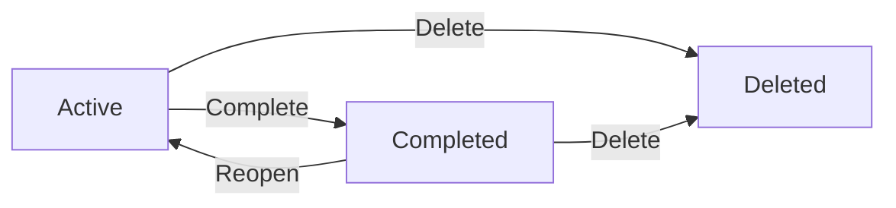
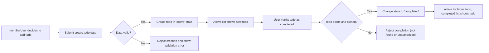
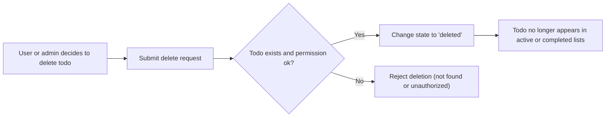

# TodoApp Todo Lifecycle and Workflow Requirements

## 1. Introduction

### 1.1 Purpose
THE purpose of this specification SHALL be to describe, in business terms, how a todo item in the **todoApp** service progresses from creation to completion or deletion. The behaviors defined here SHALL be sufficient to support a minimal but practical Todo list application.

THE lifecycle rules in this document SHALL be precise enough that backend developers can implement correct behavior without needing to make their own assumptions about how todos behave.

### 1.2 Scope
THE scope of this specification SHALL include:
- Conceptual states that a todo can be in.
- Allowed and disallowed transitions between states.
- Standard user workflows from creation through completion and deletion.
- Alternative and edge flows that can occur during normal usage.
- Business expectations for error handling and performance in these workflows.

THE scope of this specification SHALL exclude:
- Any description of APIs, endpoints, database schemas, or storage designs.
- Any frontend presentation details such as page layouts, buttons, or styling.
- Advanced todo features such as subtasks, tags, priorities, reminders, or sharing.

### 1.3 Actors and Assumptions

Descriptive assumptions:
- A **memberUser** is an authenticated user who manages their own personal todo list.
- A **guestUser** is an unauthenticated visitor and does not manage todos.
- An **adminUser** is an operational or support user who may inspect or remove todos when necessary.

Behavioral requirements (EARS):
- THE todoApp SHALL allow only authenticated memberUser actors to create and manage their own todos.
- THE todoApp SHALL prevent guestUser actors from performing any todo lifecycle operations.
- WHERE an adminUser needs to intervene for operational or legal reasons, THE todoApp SHALL allow the adminUser to remove any todo regardless of ownership, subject to separate admin role policies.

### 1.4 Relationship to Other Specifications
- THE lifecycle behaviors in this document SHALL be consistent with the core functional requirements for todo operations.
- THE validation rules applied during lifecycle transitions SHALL align with the general validation and business rule specifications.
- WHEN an error occurs during any lifecycle operation, THE todoApp SHALL follow the general error handling guidelines defined in the error and exception scenarios specification.

## 2. Lifecycle States

### 2.1 State List
THE todoApp SHALL treat each todo as being in exactly one of the following conceptual states at any point in time:
- **"active"** – created and not yet completed.
- **"completed"** – explicitly marked as done.
- **"deleted"** – removed from the user’s working lists.

No additional states such as "archived", "deferred", or "in progress" are included in this minimal version.

### 2.2 State Definitions

**Active**
- WHEN a todo is successfully created, THE todoApp SHALL place the todo in the "active" state.
- WHILE a todo is in the "active" state, THE todoApp SHALL allow its owner memberUser to view, update, complete, or delete it, subject to validation and authorization rules.

**Completed**
- WHEN a memberUser or, in exceptional cases, an adminUser marks a todo as done, THE todoApp SHALL place the todo in the "completed" state.
- WHILE a todo is in the "completed" state, THE todoApp SHALL allow its owner memberUser to view it, and SHALL allow completing actor-defined updates or reopen actions where business rules permit.

**Deleted**
- WHEN a todo is deleted by its owner memberUser or by an adminUser, THE todoApp SHALL treat the todo as being in the "deleted" state from a business perspective.
- WHILE a todo is in the "deleted" state, THE todoApp SHALL exclude the todo from all normal active and completed lists for all end users.

### 2.3 Valid and Invalid Transitions

Valid transitions:
- Active → Completed
- Active → Deleted
- Completed → Active (reopen)
- Completed → Deleted

EARS requirements:
- WHEN a memberUser marks an "active" todo they own as completed, THE todoApp SHALL transition that todo from "active" to "completed".
- WHEN a memberUser deletes an "active" todo they own, THE todoApp SHALL transition that todo from "active" to "deleted".
- WHEN a memberUser reopens a "completed" todo they own, THE todoApp SHALL transition that todo from "completed" to "active".
- WHEN a memberUser deletes a "completed" todo they own, THE todoApp SHALL transition that todo from "completed" to "deleted".

Invalid transitions:
- Deleted → Active
- Deleted → Completed

EARS requirements for invalid transitions:
- IF any operation attempts to change a todo from the "deleted" state to either "active" or "completed", THEN THE todoApp SHALL reject the operation and SHALL keep the todo in the "deleted" state.
- IF an operation attempts to change a todo from "active" to "active" or from "completed" to "completed" using lifecycle actions (complete or reopen) that would not change the state, THEN THE todoApp SHALL treat the operation as idempotent and SHALL not report a business error.

## 3. Standard Todo Flows

### 3.1 Creation Flow

Business narrative:
A memberUser decides to track a new task and creates a todo using at least a title, with optional fields such as description or due date.

Requirements:
- WHEN a memberUser submits valid data to create a todo, THE todoApp SHALL create a new todo owned by that memberUser in the "active" state.
- THE todoApp SHALL require that each new todo has a non-empty title that satisfies length and content validation rules.
- WHEN a todo is successfully created, THE todoApp SHALL make the todo immediately available in the memberUser’s active todo listings.
- IF a memberUser attempts to create a todo with invalid data, THEN THE todoApp SHALL reject creation and SHALL not create any todo.
- IF a guestUser attempts to create a todo, THEN THE todoApp SHALL reject the operation for authentication reasons.

### 3.2 Viewing and Listing Flow

Business narrative:
A memberUser wants to see their tasks, typically separated into active and completed lists.

Requirements:
- WHEN a memberUser requests their active todos, THE todoApp SHALL return only todos in the "active" state that are owned by that memberUser.
- WHEN a memberUser requests their completed todos, THE todoApp SHALL return only todos in the "completed" state that are owned by that memberUser.
- THE todoApp SHALL exclude todos in the "deleted" state from both active and completed listings for all actors.
- WHERE listing results exceed a reasonable count threshold, THE todoApp SHALL provide the list in a predictable segmented form (for example, pages or chunks) so that users can browse long lists.
- IF a memberUser attempts to view a todo by identifier that is not owned by them, THEN THE todoApp SHALL reject the operation for authorization reasons.
- IF a memberUser attempts to view a todo by identifier that is in the "deleted" state, THEN THE todoApp SHALL treat the todo as not accessible from normal end-user flows.

### 3.3 Updating Todo Content

Business narrative:
A memberUser may refine a todo by updating its title, description, or other permitted fields, as long as the todo still exists and belongs to that memberUser.

Requirements:
- WHEN a memberUser submits changes for an existing "active" todo they own, THE todoApp SHALL validate the new data and, if valid, update the todo while keeping it in the "active" state.
- WHERE business rules permit editing of "completed" todos, THE todoApp SHALL allow updates to permitted fields while keeping the todo in the "completed" state.
- IF a memberUser attempts to update a todo that is in the "deleted" state, THEN THE todoApp SHALL reject the operation.
- IF a memberUser attempts to update a todo that they do not own, THEN THE todoApp SHALL reject the operation for authorization reasons.
- IF the updated data fails validation, THEN THE todoApp SHALL reject the update and SHALL keep the previous todo data and state unchanged.

### 3.4 Completing a Todo

Business narrative:
A memberUser finishes a task and marks the corresponding todo as completed so it moves out of the active list.

Requirements:
- WHEN a memberUser marks an "active" todo they own as completed, THE todoApp SHALL change the todo’s state from "active" to "completed".
- WHEN a todo is successfully marked as completed, THE todoApp SHALL ensure that it no longer appears in that memberUser’s active listings and instead appears in completed listings.
- IF a memberUser attempts to mark a todo that is already in the "completed" state as completed again, THEN THE todoApp SHALL treat the operation as idempotent and SHALL leave the todo state as "completed" without error.
- IF a memberUser attempts to complete a todo they do not own, THEN THE todoApp SHALL reject the operation for authorization reasons.
- IF a memberUser attempts to complete a todo in the "deleted" state, THEN THE todoApp SHALL reject the operation.

### 3.5 Reopening a Completed Todo

Business narrative:
A memberUser may realize that a completed task still needs work and wants to move the todo back into the active list.

Requirements:
- WHEN a memberUser reopens a "completed" todo they own, THE todoApp SHALL change the todo’s state from "completed" to "active".
- WHEN a todo is successfully reopened, THE todoApp SHALL ensure that it appears in active listings and no longer appears in completed listings.
- IF a memberUser attempts to reopen a todo that is already in the "active" state, THEN THE todoApp SHALL treat the operation as idempotent and SHALL leave the state as "active" without error.
- IF a memberUser attempts to reopen a todo in the "deleted" state, THEN THE todoApp SHALL reject the operation.
- IF a memberUser attempts to reopen a todo they do not own, THEN THE todoApp SHALL reject the operation for authorization reasons.

## 4. Alternative and Edge Flows

### 4.1 Creation with Minimal Data

Requirements:
- WHEN a memberUser creates a todo with only the required title field, THE todoApp SHALL accept the creation as long as the title meets validation rules.
- WHERE optional fields such as description or due date are omitted, THE todoApp SHALL treat them as absent and SHALL not assign default values that would imply additional unintended behavior.
- IF a memberUser later adds or changes optional fields on an existing todo, THEN THE todoApp SHALL validate those fields using the same validation rules as for creation before applying the updates.

### 4.2 Updating Non-Existent or Unauthorized Todos

Requirements:
- IF a memberUser attempts to update a todo referenced by an identifier that does not correspond to any existing todo, THEN THE todoApp SHALL respond as though the todo is not found and SHALL not create any new todo.
- IF a memberUser attempts to update a todo that exists but is not owned by them, THEN THE todoApp SHALL reject the operation for authorization reasons and SHALL not change the todo.
- IF a guestUser attempts any update operation, THEN THE todoApp SHALL reject the operation for authentication reasons.

### 4.3 Completing or Reopening in Edge States

Requirements:
- WHEN a memberUser attempts to complete a todo that is already in the "completed" state, THE todoApp SHALL treat the operation as idempotent and SHALL keep the state as "completed".
- WHEN a memberUser attempts to reopen a todo that is already in the "active" state, THE todoApp SHALL treat the operation as idempotent and SHALL keep the state as "active".
- WHEN a memberUser attempts to complete or reopen a todo that is in the "deleted" state, THE todoApp SHALL reject the operation and SHALL keep the state as "deleted".

### 4.4 Concurrent Changes and Retries

Requirements:
- WHERE two or more lifecycle operations are applied to the same todo in rapid succession, THE todoApp SHALL ensure that every resulting state is one of the valid states and SHALL follow only the valid transitions defined in this document.
- WHERE a client repeats the same completion operation for the same todo, THE todoApp SHALL treat repeated requests as idempotent and SHALL keep the todo in the "completed" state if it was already completed.
- WHERE a client repeats the same reopen operation for the same todo, THE todoApp SHALL treat repeated requests as idempotent and SHALL keep the todo in the "active" state if it was already active.
- IF concurrent operations would otherwise result in conflicting updates to todo content, THEN THE todoApp SHALL apply a deterministic conflict rule defined in the general business rules so that the todo always ends in a valid state.

## 5. Deletion and Removal Flows

### 5.1 Soft Deletion Concept

Requirements:
- WHEN a memberUser or adminUser deletes a todo, THE todoApp SHALL treat this as a transition of the todo into the "deleted" state rather than as an immediate removal from all internal storage.
- WHILE a todo is in the "deleted" state, THE todoApp SHALL exclude that todo from all normal active and completed listings for all actors.
- WHERE internal retention is required for operational or legal reasons, THE todoApp SHALL ensure that such retention remains invisible to normal memberUser actors.

### 5.2 MemberUser-Initiated Deletion

Requirements:
- WHEN a memberUser deletes an "active" todo that they own, THE todoApp SHALL change the todo’s state from "active" to "deleted".
- WHEN a memberUser deletes a "completed" todo that they own, THE todoApp SHALL change the todo’s state from "completed" to "deleted".
- IF a memberUser attempts to delete a todo that is already in the "deleted" state, THEN THE todoApp SHALL treat the operation as idempotent and SHALL keep the state as "deleted".
- IF a memberUser attempts to delete a todo they do not own, THEN THE todoApp SHALL reject the operation for authorization reasons.

### 5.3 AdminUser-Driven Deletion

Requirements:
- WHERE an adminUser determines that a todo must be removed for operational, abuse-handling, or legal reasons, THE todoApp SHALL allow the adminUser to delete that todo regardless of its owner.
- WHEN an adminUser deletes a todo, THE todoApp SHALL transition the todo to the "deleted" state and SHALL apply the same visibility rules as for memberUser-initiated deletion.
- IF an adminUser attempts to delete a todo that is already in the "deleted" state, THEN THE todoApp SHALL treat the operation as idempotent and SHALL keep the state as "deleted".

### 5.4 Recovery and Final Removal

Requirements:
- THE todoApp SHALL not provide memberUser actors with any standard workflow to restore todos from the "deleted" state.
- WHERE organizational policies permit, THE todoApp MAY allow adminUser actors to perform exceptional recovery of "deleted" todos following additional business rules outside this minimal scope.
- WHERE long-term retention rules require permanent removal, THE todoApp SHALL ensure that todos in the "deleted" state are eventually removed in accordance with data lifecycle and retention policies.

## 6. Error and Exception Behaviors

### 6.1 Validation Failures

Requirements:
- IF a todo creation request fails validation, THEN THE todoApp SHALL not create any todo and SHALL keep the user’s todo list unchanged.
- IF a todo update request fails validation, THEN THE todoApp SHALL not apply any part of the update and SHALL keep the todo’s previous content and state unchanged.
- IF a completion or reopen operation includes invalid input data beyond the todo identifier, THEN THE todoApp SHALL reject the operation and SHALL keep the todo state unchanged.

### 6.2 Authentication and Authorization Errors

Requirements:
- IF a guestUser attempts any todo lifecycle operation (create, read specific, list, update, complete, reopen, or delete), THEN THE todoApp SHALL reject the operation for authentication reasons.
- IF a memberUser attempts any todo lifecycle operation on a todo they do not own, THEN THE todoApp SHALL reject the operation for authorization reasons and SHALL avoid revealing sensitive information about the todo.
- WHERE an adminUser performs lifecycle operations on a todo, THE todoApp SHALL treat the adminUser as having authority consistent with admin role definitions in the broader permissions model.

### 6.3 System and Rate-Limiting Issues

Requirements:
- IF a todo lifecycle operation fails due to transient system problems or rate limiting, THEN THE todoApp SHALL attempt to leave the todo in a consistent state that reflects either full success or full failure of the operation.
- WHERE clients retry operations after such failures, THE todoApp SHALL treat repeated completion, reopen, or deletion requests as idempotent as described in earlier sections.

## 7. Performance and UX Expectations

### 7.1 Response Time

Requirements:
- WHEN a memberUser creates, updates, completes, reopens, or deletes a todo under normal load, THE todoApp SHALL respond within a few seconds so that the operation feels immediate to the user.
- WHEN a memberUser fetches lists of active or completed todos under normal load, THE todoApp SHALL return results within a few seconds for typical list sizes.

### 7.2 Consistency and Ordering

Requirements:
- WHERE a lifecycle operation changes a todo’s state or content, THE todoApp SHALL ensure that subsequent listing operations reflect the change consistently.
- WHERE todos are ordered in listings (for example, by creation time), THE todoApp SHALL apply a consistent ordering rule so that repeated requests show a predictable order for the same underlying data.
- WHERE results are segmented (for example, via pagination), THE todoApp SHALL ensure that segment boundaries remain consistent as long as the underlying data has not changed.

## 8. Lifecycle Diagrams

### 8.1 State Lifecycle Diagram

### 8.2 Creation-to-Completion Flow Diagram

### 8.3 Deletion Flow Diagram

## 9. Summary of Key EARS Requirements

### 9.1 State Requirements
- THE todoApp SHALL support exactly three conceptual states for todos: "active", "completed", and "deleted".
- WHEN a todo is created, THE todoApp SHALL place it in the "active" state.
- WHEN a todo is completed, THE todoApp SHALL place it in the "completed" state.
- WHEN a todo is deleted, THE todoApp SHALL place it in the "deleted" state and SHALL exclude it from normal listings.

### 9.2 Flow Requirements
- WHEN a memberUser creates a valid todo, THE todoApp SHALL make it visible in that user’s active list.
- WHEN a memberUser completes an active todo they own, THE todoApp SHALL move it from the active list to the completed list.
- WHEN a memberUser reopens a completed todo they own, THE todoApp SHALL move it back to the active list.
- WHEN a memberUser deletes an active or completed todo they own, THE todoApp SHALL move it to the "deleted" state.

### 9.3 Edge and Idempotency Requirements
- IF a lifecycle operation is repeated for a todo that is already in the requested target state, THEN THE todoApp SHALL treat the operation as idempotent and SHALL not report an error.
- IF any lifecycle operation targets a todo that does not exist or is not owned by the caller (except adminUser actors with the required authority), THEN THE todoApp SHALL reject the operation.
- WHERE transient failures or retries occur, THE todoApp SHALL ensure that the observable state of each todo always corresponds to one of the valid lifecycle states defined in this specification.