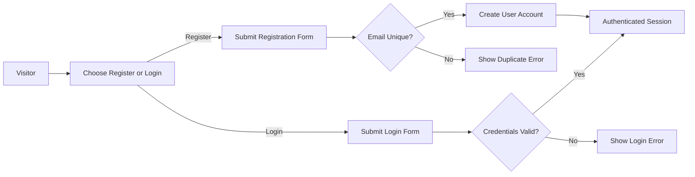
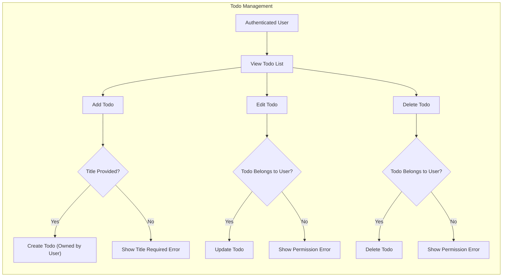
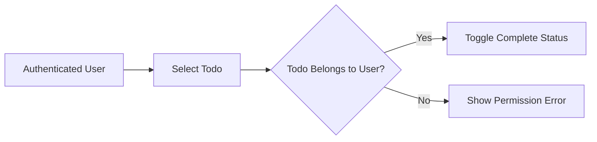
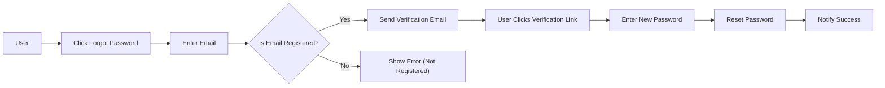

# Todo List Application Business and Functional Requirements

The Todo list application enables individuals to manage personal tasks in a secure, private workspace offering only the essential features required for an effective minimal todo experience. This documentation provides exhaustive, actionable requirements and edge case handling in clear EARS-compliant style for backend implementation.

## Core User Scenarios

### User Registration and Authentication
- WHEN a person wants to use the Todo list, THE system SHALL permit account registration via email and password and require both to be present for successful registration.
- WHEN registration succeeds with unique email, THE system SHALL create a personalized workspace and start an authenticated session.
- IF registration is attempted with an already registered email, THE system SHALL explicitly notify about duplicate account and prevent creation.
- WHEN a user logs in, THE system SHALL require the registered email and password and validate both.
- IF login is successful, THE user SHALL be authenticated and granted access to their todo workspace.
- IF login fails, THE system SHALL show a clear error and deny access.
- WHEN a user logs out, THE system SHALL terminate the session.

### Creating a Todo
- WHEN an authenticated user chooses to add a Todo, THE system SHALL require at least a title and assign ownership of the new Todo to the current user.
- IF a title is missing, THEN creation SHALL be rejected with user notification specifying the title is required.

### Viewing Todos
- WHEN a user requests their list, THE system SHALL show only that user's Todos, sorted most recently first, with optional filters for status (complete/incomplete) and sort options for creation/due date.
- IF no Todos exist, THE system SHALL return an empty list, not an error.

### Editing a Todo
- WHEN a user edits a Todo, THE system SHALL allow updates to title, description, due date, and completion status when the Todo is owned by the user.
- IF a user attempts to edit another user's Todo, THE system SHALL reject and provide a permission error.
- WHEN validation for an updated field fails, THE system SHALL inform the user of the error cause.

### Marking Todos as Complete/Incomplete
- WHEN a user toggles the status of a Todo, THE system SHALL update the completion field only if the user owns the Todo.
- IF the user does not own the Todo, THE request is denied and a clear error provided.

### Deleting a Todo
- WHEN a user deletes a Todo, THE system SHALL allow deletion only if the Todo belongs to the current user; otherwise, provide a permission error and reject.
- WHEN deleted, THE Todo SHALL be removed from the user's list permanently.

### Password Reset (Forgotten Password)
- WHEN a user requests password reset, THE system SHALL allow initiation by email address and send verification instructions only if the email is registered.
- WHEN verification succeeds, THE user SHALL be allowed to set a new password.
- IF verification fails, deny reset with descriptive error.

## Task Flow Diagrams

### User Authentication Flow

### Creating, Listing, Updating, and Deleting Todos

### Marking Todos as Complete/Incomplete

### Password Reset Flow

## Edge Cases and Alternate Flows
- IF a user session expires, THE system SHALL require login before further operation.
- IF a user attempts any Todo operation unauthenticated, THE system SHALL enforce login before proceeding.
- WHEN the Todo list is empty, THE interface SHALL display a zero-state suggestion.
- WHEN business validation fails (e.g., long titles or invalid dates), THE system SHALL reject the action and specify the error to the user.
- WHEN users attempt password reset repeatedly in a short span, THE system SHALL throttle/reset lockout for abuse prevention.
- IF password reset email cannot be delivered, THE system SHALL log the incident and notify the user to try again later.
- WHEN users repeatedly fail login, THE system SHALL apply account lock/rate limit as appropriate.
- IF backend/data error occurs, THE system SHALL present a generic message and advise users to retry or contact support.
- WHEN the last Todo is deleted, update the interface to indicate an empty state.

## Summary Table of Key User Workflows

| Scenario         | Steps Involved                                                                                                      | Success Criteria                        |
|------------------|---------------------------------------------------------------------------------------------------------------------|-----------------------------------------|
| Register         | Input email & password → Submit form → Unique email? → Create account → Session authenticated                      | Account created, user logged in         |
| Login            | Input credentials → Submit form → Valid? → Session started                                                          | User logged in, access granted          |
| Add Todo         | Auth user → Input title → Submit → Created and owned by user                                                        | Todo appears in list                    |
| Edit Todo        | Auth user → Choose Todo → Edit fields → Owner? → Update                                                             | Fields successfully updated             |
| Mark Complete    | Auth user → Choose Todo → Owner? → Toggle completion                                                                | Status toggled                          |
| Delete Todo      | Auth user → Select → Owner? → Delete                                                                                | Todo is permanently deleted             |
| View List        | Auth user → Open app → Fetch only owned Todos → Show                                                                | Only user’s Todos shown                 |
| Password Reset   | User → Click forgot password → Enter email → Registered? → Email sent → Link clicked → Enter new password → Reset   | Password changed, user notified         |

## Ownership, Permissions, and Validation Points
- THE system SHALL ensure only the authenticated user can perform CRUD actions on their own Todos; all others are prevented with explicit error responses.
- WHEN a user tries to manipulate another user’s Todo, permission is denied.
- All Todo creation, update, and deletion operations are validated for proper input (strings, lengths, due dates, required fields).

## Alternate and Exceptional User Journeys
- IF registration uses invalid email, THE system SHALL reject and prompt for valid format.
- WHEN users repeatedly fail logins, THE system SHALL temporary lockout/rate limit for protection.
- IF catastrophic backend or data integrity failure, users receive a generic failure notification, not exposure of technical details.
- WHEN the sole Todo is deleted, THE interface SHALL indicate tasks are now empty (not an error).

## Linkage to Related Documents
- Business and functional requirements: [03-business-and-functional-requirements.md](./03-business-and-functional-requirements.md)
- Error scenarios and handling: [05-error-handling-and-edge-cases.md](./05-error-handling-and-edge-cases.md)
- High-level service overview: [01-service-overview.md](./01-service-overview.md)

## Audience and Intended Use Notes

Sole audience: backend developers and QA engineers implementing ONLY the minimum required functionality for a user-centric Todo application. All requirements are described as business logic in natural (EARS-compliant) language with actionable workflows and validation rules, suitable for direct translation into backend architecture.