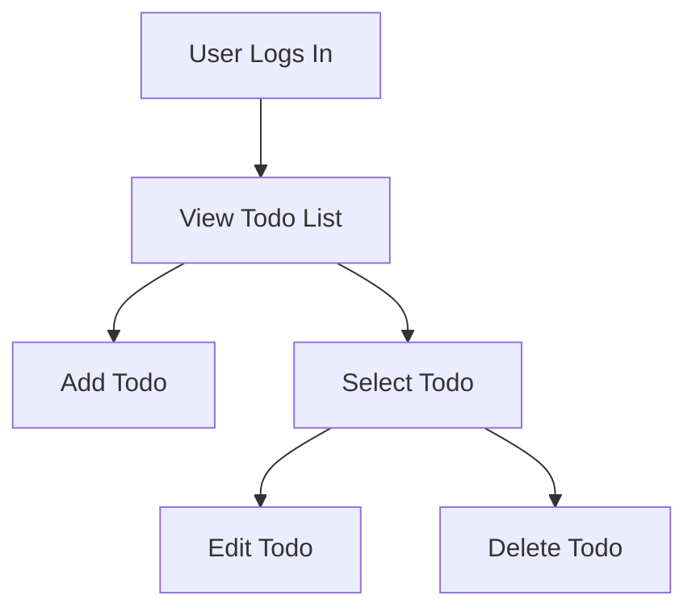

# Todo List Application - Requirements Specification

## 1. Introduction

The Todo List application delivers essential task-tracking functionalities for end-users with a philosophy of minimum viable product (MVP). The system is focused exclusively on enabling users to manage their own todo entries—nothing more—ensuring clarity, focus, and minimal technical and business complexity. The requirements defined herein represent the only business operations and rules to be delivered for the initial release.

## 2. User Actors & Authentication

### Primary Actor
- **User**: A person who manages their own Todo entries via the application.

### Authentication
- WHEN an unauthenticated user attempts to access any endpoint, THE system SHALL require authentication before granting access.
- WHEN a user's authentication token is invalid, expired, or missing, THE system SHALL instruct the user to log in again before further use.

### Authorization
- WHEN a user attempts to access, update, or delete a Todo not owned by them, THE system SHALL deny the request without revealing the existence of the resource.

## 3. Core Business & Functional Requirements

### Adding Todos
- WHEN a user creates a todo WITH all required fields and valid input, THE system SHALL save the todo and make it visible to that user only.
- WHEN a user creates a todo WITHOUT a required field, THE system SHALL reject the request and specify the missing field in the response.
- WHEN a user enters a todo title longer than 255 characters, THE system SHALL reject the request and state the title length limit.
- WHEN a user adds a todo WITH a due date in the past, THE system SHALL reject the operation and inform the user that the due date cannot be earlier than the current date.

### Viewing Todos
- WHEN a user retrieves their todo list, THE system SHALL display only the todos they own, ordered by creation date descending (most recent first).
- WHEN a user has no todos, THE system SHALL show a positive confirmation (e.g., "You have no todos yet").

### Editing & Updating Todos
- WHEN a user updates a todo WITH valid input and they are the owner, THE system SHALL update and persist the changes.
- WHEN a user attempts to update a todo they do not own, THE system SHALL deny the operation without revealing the resource state.
- WHEN the target todo does not exist (e.g. deleted in other session), THE system SHALL return a not found message.
- WHEN the update includes invalid input (missing required field, title too long, invalid due date), THE system SHALL reject and list all reasons.

### Deleting Todos
- WHEN a user deletes their own todo, THE system SHALL remove it from storage and prevent further access to it.
- WHEN a user tries to delete a todo that is already deleted or does not exist, THE system SHALL state that the resource is not found.

### Duplicates and Idempotency
- WHEN a user sends repeated or duplicate requests by mistake (e.g., reload, double-click), THE system SHALL prevent creation of unintended duplicate todos and notify the user if a request was already processed.

## 4. Basic User Flows

### Core Actions

#### Alternate Flows & Error Handling
- WHEN an unauthorized request is made, THE system SHALL block it with a clear message.
- IF any validation, operational, or business rule fails, THEN THE system SHALL highlight the specific error(s) and guide the user to resolve and retry.
- WHEN a backend/system error occurs, THE system SHALL show a message asking to retry later, never exposing internal technical details.

Edge cases and recovery scenarios strictly follow the [loaded error and edge analysis document](05-error-handling-and-edge-cases.md), which details all error conditions, user notifications, idempotency requirements, and edge case business rules for the MVP.

## 5. Error Handling & Edge Cases

All error codes, user messages, and edge conditions are handled as defined in the loaded requirements document for error handling and edge case coverage. This includes:
- Explicit EARS-format requirements for authentication, permission, data not found, validation failures, system errors, rate limits, and idempotency
- Clear user-facing language in all errors, with appropriate suggested actions
- No technical details or stack traces exposed
- Full alignment between business and technical requirements for predictable, user-friendly behaviour

Refer directly to [05-error-handling-and-edge-cases.md](05-error-handling-and-edge-cases.md) for detailed scenarios, mermaid flow diagrams, and complete recovery processes.

## 6. Out of Scope and Constraints

- The MVP SHALL NOT include features beyond add, list, edit, update, and delete for a user's own todos.
- No sharing, assignment, or delegation features
- No labels, tags, categories, priorities, or other metadata
- No reminders, notifications, or scheduling capabilities
- No multi-user collaboration or admin access
- No 3rd party integrations or calendar syncing
- No user profile features beyond authentication
- Environmental constraints: all deployment and runtime environments must support secure authentication, stateless API endpoints, and persistence of user data

## 7. Appendix – EARS Requirements Format Reference

The Easy Approach to Requirements Syntax (EARS) is used to ensure all business requirements are clear, measurable, and actionable. Key EARS keywords:
- WHEN: condition under which the requirement applies
- THE system SHALL: the specific obligation or behavior
- IF, THEN: conditional logic for alternative flows

**Example of EARS Requirement**:
- WHEN a user submits a todo WITH invalid data, THE system SHALL reject the request and enumerate which fields were invalid and why.

---

All requirements listed above and in the referenced error/edge document are to be strictly implemented in the backend codebase. These form the sole and complete specification for production-grade development of the Todo List application's backend MVP.