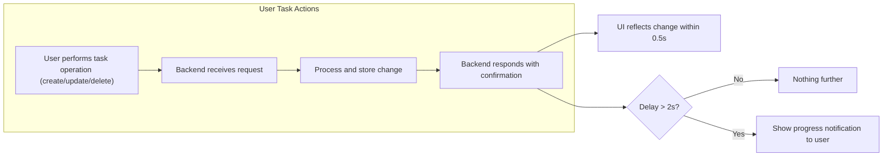
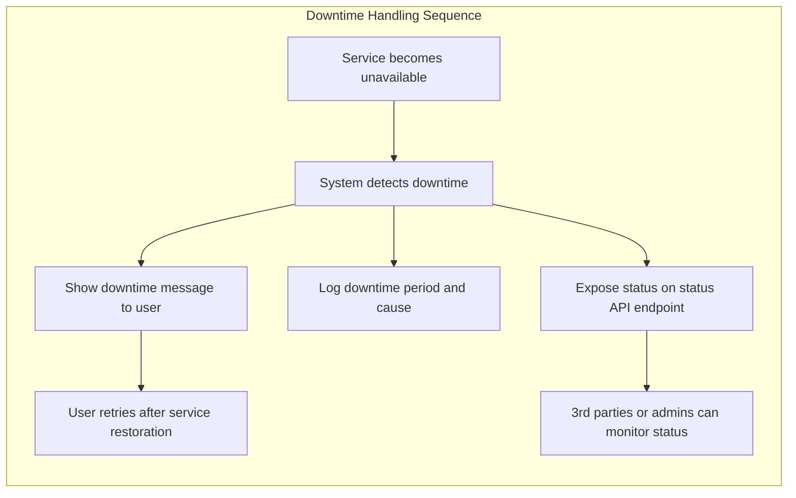

# Performance and Reliability Requirements for Todo List Application

## Performance Expectations

All users require fast, consistent, and predictable responsiveness for basic Todo list functionality. The Todo List service guarantees enterprise-grade user experience through strict performance standards:

- WHEN a user creates, edits, deletes, or views a task under normal operating conditions, THE system SHALL process and respond within 500 milliseconds.
- WHEN at least 1,000 concurrent users are active, THE system SHALL maintain response times under 500 milliseconds for all core task operations.
- WHEN a user creates, updates, or deletes a task, THE system SHALL provide confirmation to the user within 0.5 seconds.
- WHEN a user has over 500 tasks, THE system SHALL return the full todo list within 1,000 milliseconds.
- WHEN a user submits invalid data or fails validation, THE system SHALL respond without delay and include a clear error message.
- WHEN bulk actions are performed (e.g., update/delete up to 100 tasks in a single request), THE system SHALL complete the request and return confirmation within 2,000 milliseconds.
- WHEN the system operates at moderate load (50% of projected peak), THE system SHALL not exhibit visible delays or lag for any user operation.

## System Responsiveness

End-users expect that any action is immediately visible in all subsequent interactions and that feedback is timely:

- WHEN a user creates, edits, or deletes a task, THE system SHALL display the updated list, accurately reflecting the change, in any subsequent API response with no intermediate steps or manual refresh needed.
- WHEN a newly added or modified task exists, THE user's next retrieval request SHALL include latest changes.
- WHEN any operation takes longer than 2 seconds, THE system SHALL notify the user that processing is in progress.
- IF the backend is delayed or experiencing reduced performance, THEN THE system SHALL display a user-facing message explaining the slowdown and recommend that the user retry.
- WHEN any task operation (create, update, delete) completes successfully, THE user interface SHALL reflect the result within 0.5 seconds from completion.

## Reliability Targets

The Todo List service is defined by its reliability and availability. Users and business stakeholders require near-continuous uptime and robust failure recovery:

- THE system SHALL maintain a minimum service uptime of 99.9% per calendar month. Uptime is measured as the period during which the API for all critical Todo endpoints is accessible and operational.
- WHEN maintenance is required, THE system SHALL provide at least 24 hours advance notification unless emergency maintenance is needed.
- WHEN system restarts, crashes, or upgrades occur, THEN THE system SHALL NOT lose or corrupt any user data.
- WHEN software updates or patches are deployed, THE process SHALL not cause data loss and SHALL restrict any unavailability to under 5 minutes per week.
- WHEN a transient error (such as a dropped connection or short network interruption) occurs, THEN THE system SHALL automatically recover without requiring user intervention.

| Reliability Metric               | Target                          |
|----------------------------------|---------------------------------|
| Monthly Uptime                   | >= 99.9%                        |
| Planned Maintenance Notification | >= 24 hours (except critical)    |
| Max Allowed Unplanned Downtime   | <= 40 minutes/month              |
| Max Outage During Deployments    | <= 5 minutes/week                |

## Downtime Handling

Clear and prompt incident communications are essential for business continuity and user trust:

- WHEN the service is unavailable, THE backend SHALL return a clear status code and error message indicating downtime to every user API request.
- IF a failure causes transaction loss (e.g., a task operation fails during downtime), THEN THE user SHALL receive a failure notification and instructions to retry after recovery.
- WHEN scheduled downtime occurs, THE service SHALL make available (via API or status endpoint) a message including the maintenance schedule, affected operations, and status.
- THE backend SHALL record and log the cause, start, and end time of every downtime period for operational review and audit.
- THE system SHALL provide a public status endpoint for users and external services to check current operational availability.

## Success Criteria

- All create, read, update, and delete operations respond within defined timeframes; otherwise, feedback is provided to the user with next steps.
- No user action causes loss or corruption of task data, even during failures or server restarts.
- Users are kept informed during any responsiveness or reliability incident with clear communication and advice.
- All system downtime and recovery events are logged and available for audit, enabling continuous operational improvement.
- All defined requirements are written in EARS format and are actionable by backend developers.

---
**Business requirements are described in natural language. Technical implementation choices, such as architecture, API, or database details, will be documented in later phases. All requirements here are implementation-agnostic and focus strictly on what the system shall achieve, not how.**