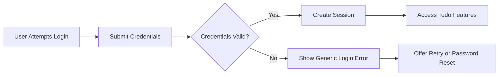
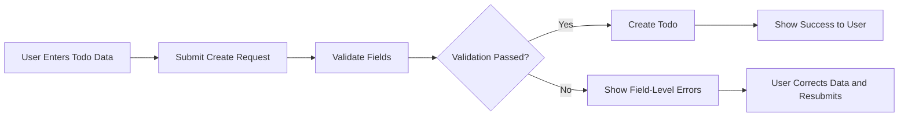
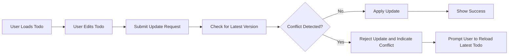

# Error Handling and Edge Case Requirements for Minimal Todo Service

## 1. Overview

Error handling for **todoApp** must be predictable, consistent, and easy to understand from a user perspective while remaining simple enough for the minimal first release. Users should always understand, in broad terms, what went wrong and what they can do next. Backend developers must be able to implement and test these rules without needing additional clarification.

The goals are:
- Prevent data corruption and partial updates.
- Clearly separate user-correctable errors from system-side problems.
- Protect security and privacy when errors occur.
- Provide straightforward recovery guidance.

The scope includes:
- General error handling principles.
- Authentication and authorization errors.
- Validation errors for Todo operations.
- Concurrency and conflict scenarios.
- System failures and degraded modes.
- User guidance and recovery behaviors.

All requirements that can be formalized use EARS (Easy Approach to Requirements Syntax). Actors are:
- **guestUser** – unauthenticated visitor; cannot access Todo data.
- **todoUser** – authenticated end user; can manage only their own Todos.
- **todoAdmin** – administrative operator; can access broader information and perform oversight actions according to policy.

## 2. General Error Handling Principles

### 2.1 Consistency and Predictability

- THE todoApp service SHALL provide consistent error behavior for the same type of problem, regardless of which internal component encounters it.
- THE todoApp service SHALL clearly distinguish between user-correctable errors (for example, invalid input) and non-user-correctable errors (for example, internal failures).
- THE todoApp service SHALL ensure that user-visible error information never exposes internal implementation details such as stack traces, internal identifiers, or raw database errors.

### 2.2 High-Level Error Categories

The todoApp service treats errors in the following business-visible categories:

1. Authentication and authorization errors.
2. Validation errors (input does not satisfy business rules).
3. Conflict and concurrency errors.
4. Resource existence errors (missing or deleted resources).
5. System and dependency failures.

## 3. Actor Context for Errors

- THE todoApp service SHALL treat any attempt by guestUser to access or modify Todo data as an unauthorized operation.
- THE todoApp service SHALL treat any attempt by todoUser to access or modify another users Todos as a forbidden operation.
- THE todoApp service SHALL apply the same validation and concurrency rules to todoAdmin actions as to todoUser actions, even when todoAdmin is allowed to access more data.

## 4. Authentication and Authorization Errors

### 4.1 Missing Authentication (guestUser)

- WHEN guestUser attempts to perform any operation that requires authentication to Todo data, THE todoApp service SHALL reject the request and indicate that login is required.
- WHEN guestUser attempts to create, update, or delete any Todo item, THE todoApp service SHALL deny the action and SHALL NOT create or modify any Todo data.

### 4.2 Invalid Credentials and Login Failures

- WHEN a person submits login credentials that do not correspond to any active account, THE todoApp service SHALL decline authentication and SHALL inform the person that authentication failed without revealing whether the email or password was incorrect.
- WHEN a person submits a login request with missing mandatory fields such as identifier or password, THE todoApp service SHALL treat the issue as a validation error and SHALL NOT attempt authentication.

Unwanted behavior requirements:

- IF login credentials do not match any active or permitted account, THEN THE todoApp service SHALL return a generic authentication failure response without revealing which credential field was incorrect.
- IF mandatory login fields are empty or violate simple format rules, THEN THE todoApp service SHALL reject the login request and SHALL identify which fields must be corrected.

### 4.3 Expired or Invalid Sessions

- WHILE a session token is expired or otherwise no longer valid, THE todoApp service SHALL reject all requests that require authentication and SHALL require the user to log in again.

Unwanted behavior requirements:

- IF a request includes an expired session or access token, THEN THE todoApp service SHALL refuse to process the protected operation and SHALL indicate that the session has expired and re-authentication is required.
- IF a request includes a session or access token that is invalid (for example, malformed, unverifiable, or clearly tampered with), THEN THE todoApp service SHALL refuse to process the protected operation and SHALL require re-authentication for security reasons.

### 4.4 Forbidden Actions for Authenticated Users

- WHERE todoUser attempts to access or modify a Todo item not owned by that todoUser, THE todoApp service SHALL treat the operation as forbidden.
- WHERE todoUser attempts to invoke administrative-only functionality, THE todoApp service SHALL treat the operation as forbidden.

Unwanted behavior requirements:

- IF todoUser requests read, update, or delete operations on a Todo that is not owned by that todoUser, THEN THE todoApp service SHALL deny the operation and SHALL indicate insufficient permissions without exposing details of the target Todo.
- IF todoUser attempts to call a function reserved for todoAdmin, THEN THE todoApp service SHALL deny the operation and SHALL indicate that the requested capability is not allowed for this user.

### 4.5 Admin-Specific Authentication and Misuse

- WHERE todoAdmin attempts to access a user account or Todo that does not exist, THE todoApp service SHALL treat this as a standard resource-not-found condition and SHALL NOT reveal internal identifiers.

Unwanted behavior requirement:

- IF a person attempts to authenticate using a todoAdmin account that has been deactivated or locked, THEN THE todoApp service SHALL refuse authentication and SHALL indicate that access is not currently allowed for that account.

## 5. Validation Errors for Todo Operations

### 5.1 General Validation Behavior

- THE todoApp service SHALL validate all user input for Todo operations against the business rules defined in the business rules and validation document before performing any data change.
- WHEN validation fails, THE todoApp service SHALL NOT create, update, or delete any Todo data related to the failing request.
- WHEN validation fails, THE todoApp service SHALL return structured information indicating which fields are invalid and why, in business terms that can be shown to end users.

Unwanted behavior requirements:

- IF a create or update request omits any required field, THEN THE todoApp service SHALL reject the request and SHALL identify which required fields are missing.
- IF any field value violates length, format, or allowed-value rules, THEN THE todoApp service SHALL reject the request, SHALL identify which fields failed validation, and SHALL NOT apply any partial changes.

### 5.2 Todo Creation Validation

- THE todoApp service SHALL require all mandatory Todo fields (at minimum a non-empty title) to be present and valid for creation.

Unwanted behavior requirements:

- IF a Todo creation request includes a title that is empty or consists only of whitespace, THEN THE todoApp service SHALL reject the creation and SHALL indicate that the title is required.
- IF a Todo creation request includes a title or description that exceeds the maximum allowed length, THEN THE todoApp service SHALL reject the creation and SHALL indicate which field exceeds the allowed length.
- IF a Todo creation request includes any status or other field value that is not part of the allowed set of business-defined values, THEN THE todoApp service SHALL reject the creation and SHALL indicate that the supplied value is not allowed.

### 5.3 Todo Update and Completion Validation

- THE todoApp service SHALL apply the same validation rules to update and completion operations as to creation, unless stricter rules are explicitly defined.

Unwanted behavior requirements:

- IF a Todo update request attempts to change a field that is not recognized by the business rules (for example, a non-existent field name), THEN THE todoApp service SHALL either reject the request or ignore that field and SHALL indicate that the field is not supported.
- IF a Todo update request attempts a status change that has no business meaning (for example, marking an already completed Todo as completed again without other changes), THEN THE todoApp service SHALL leave the status unchanged and MAY inform the client that no meaningful change occurred.
- IF a Todo update request attempts to change the title to an empty or whitespace-only value, THEN THE todoApp service SHALL reject the update and SHALL indicate that the title is invalid.

### 5.4 Todo Deletion Validation

- THE todoApp service SHALL allow deletion only for Todo items that exist and that the actor is permitted to delete.

Unwanted behavior requirements:

- IF todoUser attempts to delete a Todo that does not exist or has already been permanently removed, THEN THE todoApp service SHALL perform no data change and SHALL indicate that the Todo cannot be found.
- IF todoUser attempts to delete a Todo that is not owned by that todoUser, THEN THE todoApp service SHALL perform no data change and SHALL indicate insufficient permissions.
- IF todoAdmin attempts to delete a Todo that is subject to a retention or audit policy that forbids deletion, THEN THE todoApp service SHALL refuse deletion and SHALL indicate that the Todo cannot be deleted due to policy.

## 6. Concurrency and Conflict Scenarios

### 6.1 General Conflict Detection Principles

- THE todoApp service SHALL protect users from unintentionally overwriting changes made by themselves or other actors during overlapping operations.
- THE todoApp service SHALL detect conflicts when two or more operations intend to modify the same Todo in incompatible ways.

### 6.2 Conflicts During Todo Update

Typical example: a todoUser loads a Todo, another actor (the same user from another device or a todoAdmin) updates it, and the first actor attempts to save based on outdated information.

Unwanted behavior requirements:

- IF a Todo update request is based on an outdated version of the Todo and the Todo has been modified since that version, THEN THE todoApp service SHALL treat this as a conflict, SHALL NOT apply the requested update, and SHALL indicate that the Todo has been changed by another action.
- IF two or more concurrent update requests attempt to change the same field of the same Todo to different values, THEN THE todoApp service SHALL ensure that at least one update fails with a conflict indication so that changes are not silently lost.

Recovery expectation:

- WHEN an update conflict occurs, THE todoApp service SHALL instruct the client to reload the latest version of the Todo and to reapply intended changes based on the current state.

### 6.3 Conflicts Involving Completion or State Changes

Unwanted behavior requirements:

- IF one actor changes a Todo to a new state (for example, completed) and another actor attempts a conflicting state change or deletion at nearly the same time, THEN THE todoApp service SHALL apply a clear priority according to business policy (for example, either allow deletion or prefer completion) and SHALL indicate to any failed request why it did not succeed.
- WHERE business policy requires a specific sequence of states (for example, a rule that Todos must be completed before deletion, if such a rule is adopted), IF a delete request is received for a Todo that is not in an allowed state, THEN THE todoApp service SHALL reject the deletion and SHALL indicate which state is required first.

### 6.4 Concurrent Deletion and Access

Unwanted behavior requirements:

- IF todoUser attempts to read, update, or complete a Todo that has already been deleted, THEN THE todoApp service SHALL indicate that the Todo cannot be found and SHALL encourage the client to remove any stale references from the user interface.
- IF a delete request for a Todo is processed at the same time as another request to update or complete that same Todo, THEN THE todoApp service SHALL ensure that operations processed after the deletion fails with a clear indication that the Todo no longer exists.

## 7. System Failures and Degradation

### 7.1 Internal Server Errors

Unwanted behavior requirements:

- IF an internal error, resource exhaustion, or unexpected exception prevents todoApp from completing a Todo-related request, THEN THE todoApp service SHALL return a general failure response that explains in simple language that the operation could not be completed and that the user may try again later.
- IF a batch or compound operation fails partway through, THEN THE todoApp service SHALL leave the data in a consistent state according to defined business rules and SHALL describe, in business terms, which parts of the operation succeeded and which failed where such information is meaningful to the user.

### 7.2 Dependency and Network Failures

The minimal version is expected to have few or no feature-level external dependencies, but infrastructure and optional services may still fail.

Unwanted behavior requirements:

- IF a failure in an essential dependency (for example, storage or authentication) prevents completion of a Todo operation, THEN THE todoApp service SHALL treat the operation as failed, SHALL NOT perform partial business changes, and SHALL instruct the user to try again later.
- IF a failure in a non-essential dependency related to optional features (for example, a future reminder mechanism) occurs while the core Todo change itself can succeed, THEN THE todoApp service SHALL complete the core Todo change, SHALL report that the optional feature could not be completed, and SHALL NOT roll back the Todo change solely due to the optional failure.

### 7.3 Read-Only Degraded Mode (If Used)

- WHERE the system cannot safely perform write operations but can still serve read-only data, THE todoApp service MAY enter a conceptual read-only mode.

Unwanted behavior requirement:

- IF the system is in read-only mode and receives create, update, completion, or delete requests, THEN THE todoApp service SHALL reject those requests and SHALL indicate that temporary read-only mode is in effect and that write operations are not currently allowed.

## 8. User Guidance and Recovery

### 8.1 Error Message Content

- THE todoApp service SHALL ensure that user-visible error messages are written in clear, simple language that identifies the general problem category (for example, authentication, validation, conflict, or internal error).
- THE todoApp service SHALL ensure that user-visible error messages suggest at least one next step where possible (for example, log in again, correct a specific field, reload data, or try again later).

### 8.2 Recovery from Authentication Errors

- WHEN login fails, THE todoApp service SHALL allow the user to attempt login again within the same general flow.
- WHEN a request fails due to session expiration, THE todoApp service SHALL indicate that the session has expired and SHALL direct the client to re-authenticate.

Unwanted behavior requirement:

- IF a user attempts to access protected resources after session expiration, THEN THE todoApp service SHALL deny access, SHALL NOT leak protected data, and SHALL indicate that login is required.

### 8.3 Recovery from Validation Errors

- WHEN validation errors occur during Todo creation or update, THE todoApp service SHALL identify which fields are invalid and SHALL indicate how to correct them at a business level (for example, Title is required or 1Description is too long1).

Unwanted behavior requirement:

- IF a request containing invalid data is repeatedly submitted, THEN THE todoApp service SHALL continue to reject the request and SHALL continue to provide up-to-date validation feedback so that the user can correct the problem.

### 8.4 Recovery from Conflicts

- WHEN a conflict is detected between a requested change and the current state of a Todo, THE todoApp service SHALL indicate that another change has occurred and SHALL instruct the client to reload the Todo before retrying changes.

Unwanted behavior requirement:

- IF a user repeatedly attempts to update a Todo using stale data without reloading, THEN THE todoApp service SHALL continue to detect and report the conflict and SHALL reiterate that the user must reload the latest Todo state before updates can succeed.

### 8.5 Recovery from System Failures

- WHEN a system or dependency failure prevents completion of an operation, THE todoApp service SHALL suggest that the user try again later. Where appropriate, it MAY provide information about how to contact support or administrators.

Unwanted behavior requirement:

- IF the same user experiences repeated system-level failures within a short period, THEN THE todoApp service SHALL record sufficient information for operators to detect the pattern and MAY include additional guidance in responses, such as suggesting that the user contact support.

## 9. Mermaid Diagrams for Key Error and Recovery Flows

### 9.1 Authentication Failure and Recovery Flow

### 9.2 Todo Creation Validation Error Flow

### 9.3 Update Conflict Handling Flow

## 10. Summary of Key Unwanted Behavior Requirements (EARS)

This section summarizes the main unwanted behavior rules defined above:

- IF login credentials do not match any active or permitted account, THEN THE todoApp service SHALL return a generic authentication failure response without revealing which credential field was incorrect.
- IF mandatory login fields are empty or invalid, THEN THE todoApp service SHALL reject the login request and SHALL identify which fields must be corrected.
- IF a request includes an expired session or access token, THEN THE todoApp service SHALL refuse to process the protected operation and SHALL require re-authentication.
- IF a request includes an invalid session or access token, THEN THE todoApp service SHALL refuse to process the protected operation and SHALL require re-authentication for security reasons.
- IF todoUser requests read, update, or delete operations on a Todo not owned by that todoUser, THEN THE todoApp service SHALL deny the operation and SHALL indicate insufficient permissions without exposing details of the target Todo.
- IF todoUser attempts to invoke functionality reserved for todoAdmin, THEN THE todoApp service SHALL deny the operation and SHALL indicate that the capability is not allowed.
- IF a person attempts to authenticate using a deactivated or locked admin account, THEN THE todoApp service SHALL refuse authentication and SHALL indicate that access is not allowed.
- IF a create or update request omits any required field, THEN THE todoApp service SHALL reject the request and SHALL identify which required fields are missing.
- IF any field violates length, format, or allowed-value rules, THEN THE todoApp service SHALL reject the request and SHALL NOT perform partial updates.
- IF a Todo creation request uses an empty or whitespace-only title, THEN THE todoApp service SHALL reject the creation and SHALL indicate that the title is required.
- IF a Todo creation request includes values that are not in the allowed business-defined sets, THEN THE todoApp service SHALL reject the creation and SHALL indicate that the supplied values are not allowed.
- IF a Todo update request uses unsupported field names, THEN THE todoApp service SHALL reject the request or ignore those fields and SHALL indicate that they are not supported.
- IF a Todo update request attempts to set the title to an empty or whitespace-only value, THEN THE todoApp service SHALL reject the update and SHALL indicate that the title is invalid.
- IF todoUser attempts to delete a Todo that does not exist or has been permanently removed, THEN THE todoApp service SHALL perform no data change and SHALL indicate that the Todo cannot be found.
- IF todoUser attempts to delete a Todo they do not own, THEN THE todoApp service SHALL perform no data change and SHALL indicate insufficient permissions.
- IF todoAdmin attempts to delete a Todo that cannot be deleted due to policy, THEN THE todoApp service SHALL refuse deletion and SHALL indicate that policy prevents deletion.
- IF an update request is based on outdated data and the Todo has been modified since, THEN THE todoApp service SHALL treat this as a conflict and SHALL not apply the update.
- IF two or more concurrent updates attempt incompatible changes to the same field, THEN THE todoApp service SHALL fail at least one update with a conflict indication.
- IF a user attempts to perform a state change or delete in an order forbidden by business policy, THEN THE todoApp service SHALL reject the request and SHALL indicate the allowed sequence.
- IF a user attempts to operate on a Todo that has already been deleted, THEN THE todoApp service SHALL indicate that the Todo cannot be found.
- IF an internal error prevents completion of a Todo request, THEN THE todoApp service SHALL return a general failure message and SHALL advise trying again later.
- IF a compound operation fails partway, THEN THE todoApp service SHALL avoid leaving data in a partially updated state and SHALL explain in business terms which parts did not succeed where appropriate.
- IF a dependency failure prevents completion of an essential Todo operation, THEN THE todoApp service SHALL fail the operation and SHALL NOT perform partial business changes.
- IF optional features fail while the core Todo change succeeds, THEN THE todoApp service SHALL keep the core change and SHALL indicate that the optional part failed.
- IF the system operates in read-only mode and receives write requests, THEN THE todoApp service SHALL reject those requests and SHALL indicate that only read operations are currently allowed.
- IF a user attempts to access protected resources after session expiration, THEN THE todoApp service SHALL deny access and SHALL require login.
- IF a user repeatedly submits invalid data, THEN THE todoApp service SHALL continue to reject the requests and SHALL continue to provide validation feedback.
- IF a user repeatedly attempts updates using stale data, THEN THE todoApp service SHALL continue to report conflicts and SHALL reiterate that the user must reload the latest state.
- IF the same user experiences repeated system-level failures in a short period, THEN THE todoApp service SHALL make this pattern observable to operators and MAY include additional guidance suggesting the user contact support.

These requirements describe business-visible error handling and edge case behavior only. All technical details such as specific status codes, transport formats, and logging implementations remain at the discretion of the development team.