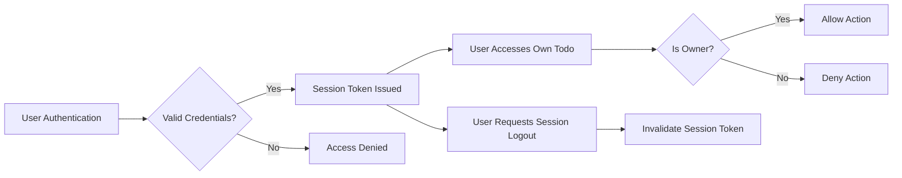

# Security and Privacy Requirements for Todo List Application

## Introduction
Comprehensive security and privacy for the todoList application are mandatory for safeguarding user data, enforcing privacy, and supporting robust backend development. All requirements herein are designed for production readiness and are based solely on business logic, not implementation-level instructions. EARS format is used throughout for clarity and testability.

## Data Protection Requirements

### Data at Rest
- THE todoList system SHALL encrypt or otherwise protect all user data stored persistently, using mechanisms that prevent unauthorized access.
- WHEN data is written to persistent storage, THE system SHALL ensure that only authorized server-side operations may access such data, preventing direct data manipulation by external actors.
- All data at rest protection SHALL comply with regional data security standards (e.g., GPDR, local law where applicable).

### Data in Transit
- WHEN user data (including credentials, tokens, or todo content) is transmitted, THE system SHALL use secure, encrypted transport (e.g., TLS) to prevent interception or tampering.
- IF secure transport cannot be established, THEN THE system SHALL deny requests for sensitive data transmission.

### Data Modification and Deletion
- WHEN a user initiates creation, update, or deletion of any todo item, THE system SHALL confirm the operation relates only to resources owned by the user.
- IF a user attempts to modify or delete a todo not owned by them, THEN THE system SHALL reject the request with an access-denied error, communicating the cause.
- WHEN a todo is deleted, THE backend SHALL ensure all traces are removed except where explicit business/legal retention policies require otherwise (see Data Retention section).

## Access Control Measures

### User Authentication
- All access to personalized or protected features SHALL require legitimate authentication with user credentials (using secure password mechanisms, OAuth, etc.).
- WHEN an unauthenticated user attempts to access any private data, THEN THE system SHALL block access and display an authentication-required message.
- Authentication processes SHALL align with the business-specific actor definitions and permissions matrix.

### Resource Authorization
- WHEN a signed-in user attempts to view, change, or delete a todo, THE system SHALL verify resource ownership prior to granting access or performing operations.
- IF resource ownership does not match the requesting user, THEN access SHALL be denied with a clear message.
- THE permissions matrix below defines all allowed and denied actions for each actor (in business terms):

| Action                       | user |
|------------------------------|------|
| Create a todo                | ✅   |
| View own todos               | ✅   |
| Edit own todos               | ✅   |
| Delete own todos             | ✅   |
| Access others' todos         | ❌   |
| Edit others' todos           | ❌   |
| Delete others' todos         | ❌   |

## Session Management

### Session Creation and Expiration
- WHEN authentication succeeds, THE todoList system SHALL issue a securely signed session token for the user, recording the issued token in a secure store.
- Session tokens SHALL expire after a preconfigured period (e.g., 15–30 minutes), at which time the user SHALL be required to log in again or use a valid refresh token if such a flow is supported.

### Multi-session and Session Revocation
- THE todoList system SHALL support multiple concurrent sessions per user, each trackable and invalidatable independently of others.
- WHEN a user logs out, THE system SHALL immediately invalidate that session's token so it is unusable for further accesses.
- WHEN a user chooses to log out from all devices, THE system SHALL revoke all active tokens owned by that user, enforcing immediate global sign-out.

### Security of Token Handling
- Token storage and transmission SHALL utilize methods that prevent interception, leakage, or reuse by unauthorized parties (i.e., HTTP-only cookies, proper CORS/CSRF countermeasures).
- IF suspicious usage or token compromise is detected, THEN THE system SHALL destroy the token and require re-authentication.

## Data Privacy Practices

### User Data Ownership and Visibility
- Each user's data SHALL be confidential and accessible ONLY by the user; no user SHALL see or access another's todo content under any circumstances.
- Data access endpoints SHALL confirm ownership on every request, regardless of client trust or session status.

### User Consent
- WHEN introducing any new feature using personal or task data for a purpose other than delivering todo management, THE system SHALL present users with a consent prompt and SHALL record explicit opt-in before proceeding.

### Personal Data Minimization
- THE todoList application SHALL store and process only data fields strictly necessary to deliver todo list functionality or user management. Non-essential or sensitive properties (such as detailed user profiles, analytics not core to service, etc.) SHALL NOT be collected.

### Data Retention and Deletion
- WHEN an account deletion is initiated, THE backend SHALL erase all personally identifying information (PII) within 30 days except where legal requirements override this.
- Users MAY at any time request a copy of all their active data; THE system SHALL provide this data in readable plain text or CSV within 7 days.

## Compliance and Success Criteria

### Industry Best Practices
- THE todoList system SHALL align with relevant and current security best practices in backend engineering, including periodic review and auditing of platform access.
- All access and modification attempts on protected data SHALL be logged, with sufficient detail retained for security audits and investigation.

### Success Metrics and Audit
- THE system SHALL be prepared to demonstrate compliance with business-defined privacy requirements, including providing an auditable trail of critical access and data-handling activities.
- Security incidents SHALL be handled according to an action plan, minimizing user impact.

## Security and Access Flow

Every requirement above pertains to business logic and processes, not technical implementation. Backend developers have full discretion in the methods deemed most secure to fulfill all requirements herein. 