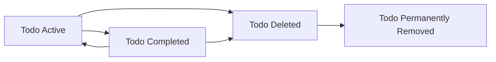
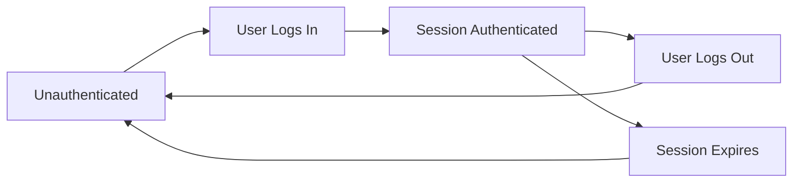

# Data Lifecycle and Retention for Minimal Todo Service (todoApp)

## 1. Purpose and Scope

The minimal Todo service identified by the prefix `todoApp` manages a small set of data types over time. Data lifecycle and retention requirements describe, in business terms, how this data behaves from creation, through active use, and ultimately to deletion or anonymization.

The goals for data lifecycle and retention are:
- Protect user privacy while keeping the service useful for everyday task management.
- Keep rules simple and predictable for users and administrators.
- Avoid unnecessary long-term storage of personal data.
- Enable backend engineers to design technical implementations that satisfy these business expectations without prescribing any specific storage technology.

THE todoApp service SHALL manage data using clearly defined lifecycle stages and SHALL apply consistent retention rules that are understandable to business stakeholders and users.

## 2. Conceptual Data Entities

### 2.1 User Account

A user account represents the identity of a person using todoApp.

Key business characteristics:
- Uniquely identifies a person who owns Todo items.
- Contains minimal profile and authentication-related information required to operate the service.
- Acts as the owner for all Todo items associated with that person.

EARS requirements:
- THE todoApp service SHALL treat each user account as a distinct owner of Todo data.
- THE todoApp service SHALL require a user account to exist before any personal Todo item can be created.

### 2.2 User Session

A user session represents a period during which a user is authenticated and actively interacting with todoApp.

Key business characteristics:
- Associated with exactly one user account.
- Has a start time and an inactivity-based expiration.
- Allows execution of operations that require authentication.

EARS requirements:
- WHEN a user successfully authenticates, THE todoApp service SHALL create a user session associated with that user account.
- WHILE a user session remains active and valid, THE todoApp service SHALL allow the associated user to perform all actions permitted to that actor type.
- WHEN a user logs out or the inactivity time limit is exceeded, THE todoApp service SHALL end the corresponding user session so that new authenticated actions require re-authentication.

### 2.3 Todo Item

A Todo item represents an individual task the user wants to track.

Key business characteristics:
- Contains a brief title and optional additional details that the user defines.
- Has a conceptual status, at minimum "active" or "completed".
- May include optional due date and timing metadata.
- Belongs to exactly one user account.

EARS requirements:
- THE todoApp service SHALL associate each Todo item with exactly one owning user account.
- WHEN a user creates a Todo item, THE todoApp service SHALL treat that Todo item as owned exclusively by that user.
- THE todoApp service SHALL maintain a conceptual status for each Todo item that distinguishes at least between active and completed tasks.

### 2.4 Administrative View Data

Administrative view data represents business-level summaries or views used by administrative actors to understand and support the system.

Key business characteristics:
- Includes summaries of user accounts, counts of Todos, and other aggregate measures.
- Does not alter ownership of underlying user data.
- Is visible only to administrative actors under defined policies.

EARS requirements:
- WHERE an administrative actor performs support, monitoring, or policy enforcement, THE todoApp service SHALL provide administrative views that expose only the minimum information necessary to perform that task.

### 2.5 Activity History (Conceptual)

Activity history represents conceptual records that significant actions occurred, such as creation, update, completion, or deletion of a Todo, or important account events.

Key business characteristics:
- Helps investigate issues, verify policy compliance, and understand high-level usage patterns.
- Does not need to store full Todo content.

EARS requirements:
- WHERE activity history is recorded, THE todoApp service SHALL record which user account or administrative actor performed the action, what type of action occurred, and when it occurred, without storing more Todo content than is necessary for audit or troubleshooting.

## 3. Todo Lifecycle Stages

From a business perspective, each Todo item passes through a sequence of conceptual stages during its life in todoApp.

### 3.1 Stages

The main lifecycle stages for a Todo item are:

1. **Active**: Task exists and is not yet completed.
2. **Completed**: Task has been marked as finished by the user or an authorized administrator.
3. **Deleted (Soft-deleted)**: Task has been removed from normal user views but may still exist for a limited retention period.
4. **Permanently Removed**: Task has been removed from todoApp in a way that is not recoverable from a business perspective.

### 3.2 State Transitions

EARS requirements:
- WHEN a user creates a Todo with valid information, THE todoApp service SHALL create the Todo in the Active stage.
- WHEN a user marks an Active Todo as completed, THE todoApp service SHALL move that Todo from the Active stage to the Completed stage.
- WHEN a user reopens a Completed Todo using a supported action, THE todoApp service SHALL move that Todo from the Completed stage back to the Active stage.
- WHEN a user requests deletion of an Active or Completed Todo, THE todoApp service SHALL move that Todo to the Deleted stage and remove it from normal user views.
- WHEN the configured retention period for a Deleted Todo elapses, THE todoApp service SHALL move that Todo from the Deleted stage to the Permanently Removed stage.

### 3.3 Todo Lifecycle Diagram

The diagram shows that a Todo begins in the Active state, may move between Active and Completed, may then be deleted into Deleted, and is ultimately removed.

## 4. User Account Lifecycle

User accounts also follow a lifecycle that influences how Todos are retained.

### 4.1 Account Stages

Conceptual stages:

1. **Registered**: Account has been created but may not yet be fully usable if additional verification is required.
2. **Active**: Account is allowed to log in and manage Todos.
3. **Suspended**: Account is temporarily blocked from normal use by an administrator for policy or security reasons.
4. **Closed**: Account has been terminated at the user’s request or by policy decision.

EARS requirements:
- WHEN a user completes registration with required information, THE todoApp service SHALL create a user account in the Registered stage.
- WHEN registration and any required verification are completed, THE todoApp service SHALL move the account to the Active stage.
- WHEN an administrator temporarily disables an account for policy or security reasons, THE todoApp service SHALL move the account from the Active stage to the Suspended stage and prevent further Todo operations by that account.
- WHEN a user or administrator closes an account according to business policy, THE todoApp service SHALL move the account to the Closed stage and prevent any further interactive use of that account.

### 4.2 Relationship Between Account and Todo Lifecycles

EARS requirements:
- WHILE a user account is in the Active stage, THE todoApp service SHALL allow that user to create, view, update, complete, and delete their own Todos, subject to other business rules.
- WHILE a user account is in the Suspended stage, THE todoApp service SHALL prevent that user from creating, updating, completing, or deleting Todos and SHALL treat the account as temporarily unable to interact with its data.
- WHEN a user account moves to the Closed stage, THE todoApp service SHALL ensure that Todos owned by that account are no longer accessible in normal user interactions and SHALL treat them according to the data retention and privacy rules defined for closed accounts.

## 5. Session Lifecycle

### 5.1 Session Stages

Conceptual stages for a user session are:

1. **Unauthenticated**: No session exists; only public information is available.
2. **Authenticated**: Session exists and is active; user may perform actions allowed to their role.
3. **Expired or Logged Out**: Session is no longer valid.

EARS requirements:
- WHEN a user logs in successfully, THE todoApp service SHALL create an Authenticated session for that user.
- WHILE a session remains active and within its allowed inactivity window, THE todoApp service SHALL treat the user as authenticated.
- WHEN a user logs out, THE todoApp service SHALL move the session to the Logged Out stage and SHALL refuse further authenticated actions for that session.
- WHEN the allowed inactivity period expires, THE todoApp service SHALL move the session to the Expired stage and SHALL require re-authentication for new authenticated actions.

### 5.2 Session Lifecycle Diagram

## 6. Data Retention Policies

Data retention policies describe how long different kinds of data are expected to be kept and what events trigger their removal.

### 6.1 Todo Data Retention

EARS requirements:
- WHILE a user account remains Active or Suspended and the user has not deleted a Todo, THE todoApp service SHALL retain that Todo and make it available according to its lifecycle stage (Active or Completed).
- WHEN a user deletes a Todo, THE todoApp service SHALL remove that Todo from all standard lists and detail views for that user immediately after the deletion action.
- WHERE the business defines a soft-deletion retention period, THE todoApp service SHALL retain Deleted Todos for no longer than that period for purposes such as recovery, audit, or abuse investigation.
- WHEN the soft-deletion retention period ends for a given Todo, THE todoApp service SHALL permanently remove that Todo so that it cannot be recovered or presented in any view.
- IF a user account is Closed, THEN THE todoApp service SHALL ensure that Todos belonging to that account either move to a Deleted and then Permanently Removed state or become anonymized according to privacy rules.

### 6.2 User Account Data Retention

EARS requirements:
- WHILE a user account is in the Active stage, THE todoApp service SHALL retain the minimal account information necessary to operate authentication, authorization, and user communication.
- WHEN a user account moves to the Closed stage at the user’s request, THE todoApp service SHALL stop using that account for new sessions and SHALL start any configured process to delete or anonymize associated personal data within a reasonable timeframe defined in policy.
- WHERE legal or compliance rules require retention of some account-related data after closure, THE todoApp service SHALL retain only the minimal information necessary to satisfy those obligations and SHALL restrict that data from being used for normal product features.

### 6.3 Session Data Retention

EARS requirements:
- THE todoApp service SHALL retain session data only as long as required to enforce session validity, security protections, and minimal audit requirements.
- WHEN a session is logged out or expired, THE todoApp service SHALL ensure that any remaining session information is retained only for the period necessary to support security monitoring and troubleshooting and SHALL then remove or anonymize it according to policy.

### 6.4 Activity History Retention

EARS requirements:
- THE todoApp service SHALL retain activity history entries related to significant actions (such as account creation, login, Todo creation, update, completion, deletion, and administrative interventions) for at least the minimum period required by business, operational, or compliance needs.
- WHERE activity history references a Todo that has been permanently removed, THE todoApp service SHALL ensure that history entries do not expose the original Todo content and SHALL limit information to non-content attributes such as timestamps, identifiers, and actor roles.

## 7. Privacy and Data Removal Expectations

### 7.1 Ownership and Isolation

EARS requirements:
- THE todoApp service SHALL treat all Todo content and associated metadata as private to the owning user account, except where access by administrative actors is allowed by policy.
- WHEN a user accesses their Todo data, THE todoApp service SHALL provide only Todos owned by that user and SHALL not expose any other user’s Todos.

### 7.2 User-Initiated Todo Deletion

EARS requirements:
- WHEN a user deletes a Todo, THE todoApp service SHALL ensure that this Todo no longer appears in standard Todo views for that user immediately after deletion.
- WHERE soft deletion is in effect, THE todoApp service SHALL ensure that Deleted Todos do not reappear in normal views unless a specific restore action is provided and executed by the user.

### 7.3 User-Initiated Account Closure

EARS requirements:
- WHEN a user requests closure of their account, THE todoApp service SHALL clearly inform the user that they will lose access to their Todos and associated personal data after closure completes.
- WHEN account closure is confirmed, THE todoApp service SHALL prevent new logins for that account and SHALL apply the configured data removal or anonymization process to Todos and account information within a defined timeframe.

### 7.4 Administrative Access and Privacy

EARS requirements:
- WHERE administrative actors access user data, THE todoApp service SHALL provide access only to the minimum information necessary to perform the specific administrative task (such as resolving a support ticket or investigating abuse).
- WHERE administrative actions expose or modify user data, THE todoApp service SHALL record those actions in activity history in a way that can be reviewed by appropriately authorized personnel.

### 7.5 Transparency of Lifecycle Behavior

EARS requirements:
- THE todoApp service SHALL provide user-facing explanations, through documentation or policy pages, that describe how long Todo data and account data are generally kept and what deletion means in practice.
- WHEN the business changes retention durations or deletion behavior in a significant way, THE todoApp service SHALL ensure that updated explanations are made available to users in a timely manner.

## 8. Cross-Entity Consistency Rules

### 8.1 Alignment Between Accounts and Todos

EARS requirements:
- WHEN a Todo is permanently removed, THE todoApp service SHALL ensure that counts or summaries of Todos for the owning account are updated to reflect the removal.
- WHEN a user account is Closed, THE todoApp service SHALL ensure that no views or summaries present that account as Active or able to own new Todos.

### 8.2 Handling Orphaned Data

EARS requirements:
- IF a condition arises in which a Todo appears to exist without a valid owning account, THEN THE todoApp service SHALL treat that Todo as orphaned data and prioritize either removal or anonymization according to privacy and retention policy.

### 8.3 Consistency Between Lifecycle and Retention Rules

EARS requirements:
- THE todoApp service SHALL ensure that lifecycle state changes (such as deletion or account closure) are applied consistently with retention rules so that data is not kept longer than intended nor removed earlier than required.

## 9. Performance and Non-functional Aspects Related to Lifecycle

### 9.1 User-Visible Timeliness of Changes

EARS requirements:
- WHEN a user creates, updates, completes, or deletes a Todo, THE todoApp service SHALL reflect the change in user-visible views within a few seconds under normal operating conditions.
- WHEN a user closes an account, THE todoApp service SHALL confirm the closure promptly and SHALL disable new interactive access to that account within a short, clearly defined timeframe.

### 9.2 Background Cleanup Activities

EARS requirements:
- WHERE background processes remove soft-deleted Todos or expired sessions, THE todoApp service SHALL run these processes in a way that does not noticeably slow down normal Todo operations for users.
- THE todoApp service SHALL design retention enforcement so that clean-up actions do not cause inconsistent user experiences, such as deleted items reappearing or active items disappearing prematurely.

## 10. Summary of Key Principles

The todoApp data lifecycle and retention model is built on the following business principles:

- Each Todo belongs to exactly one user account and moves through clearly defined stages from Active to Permanently Removed.
- User accounts and sessions have simple lifecycles that determine when Todos can be accessed or modified.
- Retention rules favor keeping data only as long as necessary for everyday use, troubleshooting, and compliance, and no longer.
- Deletion and account closure behaviors are predictable, privacy-aware, and communicated clearly to users.
- Administrative access is limited, auditable, and focused on specific operational needs.

These principles and requirements guide backend engineers in designing implementations that satisfy business expectations for data lifecycle and retention in the minimal todoApp service, while preserving freedom to choose the most appropriate technical solutions.