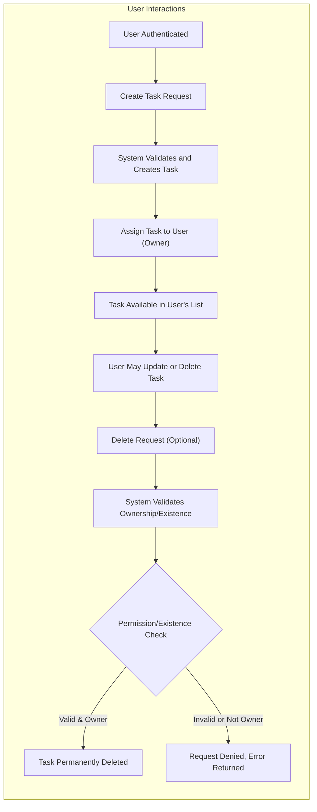

# Task Data Lifecycle and Flow for Todo List Service

## Introduction
Task data for the Todo List service is central to the application's business value, representing every individual todo or task that users create, manage, and delete. The application enforces ownership, privacy, and user-driven lifecycle management so that each user has secure and private control throughout the entire lifecycle of their tasks.

## Task Lifecycle: Business Requirements

### 1. Task Creation
- WHEN an authenticated user submits a valid request to create a new task, THE system SHALL assign a unique identifier to the task and associate it with the user as owner.
- WHEN the creation request lacks required information (such as title), THE system SHALL reject it and return a specific error indicating the missing or invalid fields.
- WHEN a valid creation request is made, THE system SHALL store the new task immediately and include it in the user's task list for retrieval, visibility, and management.
- WHEN a user attempts to create an additional task with the same title as another of their own tasks for the same calendar day, THE system SHALL reject the request and inform the user of the duplication rule.

### 2. Task Deletion
- WHEN a user requests deletion of a task, THE system SHALL verify BOTH ownership and existence of the task before proceeding.
- IF either condition fails (task does not exist or user is not owner), THEN THE system SHALL reject the deletion attempt and return a clear, relevant error to the user.
- WHEN deletion is allowed, THE system SHALL remove the task from the user's task list and from all user-accessible system views immediately.
- WHEN a user's account is deleted (by user action or admin operation), THE system SHALL delete all tasks owned by that user as part of the same atomic operation.

### 3. Access, Ownership, and Modification
- WHEN a task is created, THE system SHALL strictly link it to the requesting user's unique account. This user is defined as the owner.
- WHILE a task exists, ONLY the owner SHALL be permitted to view, update, or delete the task.
- IF a user attempts to view or modify another user's task, THEN THE system SHALL deny the request and notify the user of insufficient permissions.
- WHEN a user's session is expired or invalid, THE system SHALL NOT permit listing, retrieval, creation, updating, or deletion of any tasks for that user until re-authentication is performed.

#### Action Permissions Table
| Action                                | Ownership/Authentication Required | Allowed By |
|----------------------------------------|-----------------------------------|------------|
| Create task                           | Yes (must be authenticated)      | User       |
| View/list own task                    | Yes                              | User       |
| Update own task                       | Yes                              | User       |
| Delete own task                       | Yes                              | User       |
| View/edit/delete ANY other user's task| Prohibited                       | No one     |

## Conceptual Data Flow

## Data Integrity and Retention
- THE system SHALL allow operations that modify or delete tasks only for users who are currently authenticated with valid sessions.
- THE system SHALL persist all tasks under user ownership until deleted by the owner or by the system in response to deletion of the user's account.
- THE system SHALL NOT display, list, or expose any data relating to deleted tasks via any user-accessible mechanism.

## Validation and Business Rules
- WHEN creating or updating any task, THE system SHALL require the presence of a title field (max 120 characters). Description (max 1000 characters) and due date ARE optional but, if provided, SHALL comply with these limits and with permitted formats (e.g., ISO for dates).
- THE system SHALL reject all requests that supply fields outside the permitted length or with invalid types.
- IF a task does not exist (attempts to view, edit, or delete), THEN THE system SHALL inform the user and SHALL NOT perform the requested operation.
- WHEN a user attempts to take action on a task they do not own, THE system SHALL return a clear error message without revealing the presence or details of other users’ tasks.

## Task List & Ordering
- WHEN an authenticated user lists tasks, THE system SHALL display ONLY the tasks owned by that user, ordered by creation date with the newest shown first.
- THE system SHALL at all times prohibit access to, and data leakage about, tasks belonging to any other user.

## Success Criteria & Summary
- All task operations (creation, retrieval, update, deletion) are protected by strict user ownership and session-awareness.
- Every business rule is enforced for data integrity, length limits, and duplicate prevention.
- Users always see immediate, actionable responses, including on validation or permission errors, with detailed error messages as needed.
- Data flows and lifecycles are simple and unambiguous, ensuring a clear, privacy-preserving experience for every user of the Todo List service.