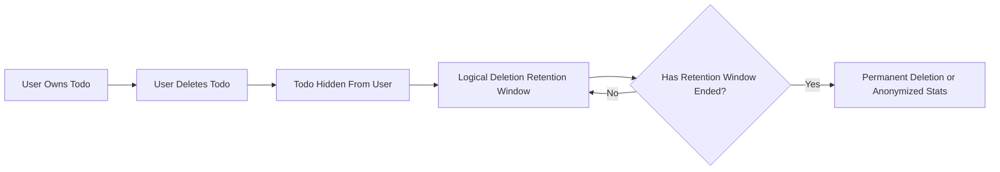
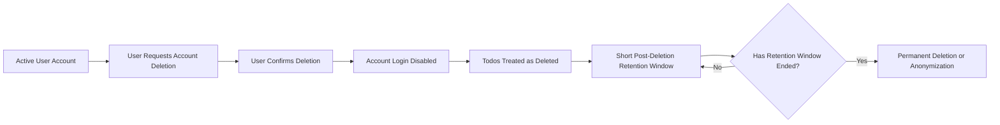
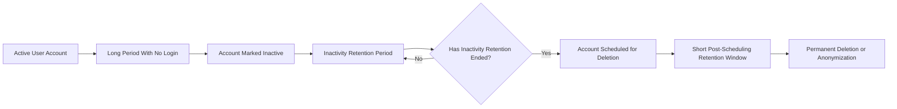

# TodoApp Requirements Analysis – Data Lifecycle and Retention

## 1. Purpose and Scope

This requirements analysis defines how data should be kept, deleted, and optionally anonymized in **todoApp**, a minimal Todo list backend service. It explains what must happen to user accounts and todo items over time, especially when users become inactive or request deletion.

The focus is:
- What kinds of data exist in the system.
- How long each kind of data should be kept.
- What should happen when users delete todos or delete their account.
- When data may be anonymized or used in aggregated form.

The analysis intentionally does **not** decide:
- Which database or storage technology is used.
- How tables, collections, or APIs are designed.
- How background jobs or schedulers are technically implemented.

Developers are free to choose any technical solution as long as it satisfies the behaviors described here.

## 2. Context in TodoApp

Actors relevant for data lifecycle:
- **memberUser** – regular user who owns todos and can manage their own account and todos.
- **adminUser** – privileged user who may disable or delete accounts or todos for operational or legal reasons.
- **guestUser** – user who is not authenticated and does not own long-lived data in the system.

High-level expectations:
- User data should not live forever without purpose.
- Users should have clear control over their own todos and accounts.
- The service may retain limited data for a short time for operational safety (for example, undo accidental deletions) and for high-level, non-identifiable statistics.

## 3. Data Categories

### 3.1 User Account Data

User account data describes a `memberUser` or `adminUser` and is needed to log in and associate todos with the correct owner.

Examples (conceptual only):
- Login identifier (for example, email-like value or username).
- Authentication information (for example, a password-like secret or link to an external identity provider).
- Display name.
- Account status (for example, active, inactive, disabled, deleted).
- Timestamps such as account creation time and last login time.

### 3.2 Todo Content Data

Todo content data is the information a `memberUser` creates and manages.

Examples (conceptual only):
- Title or short text for the todo.
- Optional description or note.
- Status (for example, pending, completed).
- Timestamps (creation time, last update time, completion time).
- Link from the todo to its owning `memberUser`.

### 3.3 System Metadata

System metadata is created by the system to keep data consistent and traceable.

Examples:
- Internal identifiers for users and todos.
- Creation and update timestamps.
- Flags indicating logical deletion or archival state.

### 3.4 Operational and Security Records (Conceptual)

Operational and security records help operate the service safely and detect misuse.

Examples:
- High-level login attempts (time and success/failure).
- High-level records of admin actions such as disabling an account or deleting a todo.

## 4. General Data Lifecycle Principles

The following principles apply to all data categories.

- THE todoApp service SHALL retain personal data only while it is needed for providing the minimal Todo functionality, protecting the service, or fulfilling justified analysis or legal obligations.
- THE todoApp service SHALL allow `memberUser` accounts to delete todos and request account deletion, and SHALL apply clear, predictable rules to these actions.
- THE todoApp service SHALL ensure that data removed from user-facing views is no longer accessible to the user, even if it is internally retained for a short operational period.
- THE todoApp service SHALL prefer deletion or anonymization of data over indefinite retention, once data is no longer needed.

## 5. Retention Policies by Data Category

All requirements in this section are written so they can be tested by observing system behavior over time.

### 5.1 User Account Data Retention

**Active accounts**

- WHILE a user account is active, THE todoApp service SHALL retain account data and SHALL allow the `memberUser` or `adminUser` to log in according to authentication rules.

**Inactive accounts due to no login**

For a minimal definition of inactivity, a long period without login is used.

- WHEN a `memberUser` or `adminUser` does not log in for a long period (for example, at least 12 consecutive months), THE todoApp service SHALL mark that account as inactive.
- WHEN an account is marked as inactive, THE todoApp service SHALL continue to retain the account data and associated todos for an additional inactivity retention period (for example, 12 more months) so that the user can return and continue using the service.

**Automatic deletion after long inactivity**

- WHEN the inactivity retention period elapses for an inactive account, THE todoApp service SHALL schedule the account for deletion.
- WHEN an account is scheduled for deletion because of inactivity, THE todoApp service SHALL handle the account and its todos using the same lifecycle behavior defined for user-initiated account deletion (for example, short retention window and then permanent deletion or anonymization).

### 5.2 Todo Content Data Retention

**Todos for active accounts**

- WHILE a `memberUser` account is active, THE todoApp service SHALL retain all todos belonging to that user unless they are explicitly deleted by the `memberUser` or an `adminUser`.

**Completed todos**

- WHEN a todo is marked as completed by a `memberUser`, THE todoApp service SHALL keep that todo available to the `memberUser` in the same way as pending todos, unless the todo is explicitly deleted.
- THE todoApp service SHALL NOT automatically delete a todo only because it is completed.

**Todos for inactive accounts**

- WHEN a `memberUser` account becomes inactive, THE todoApp service SHALL retain todos for the same inactivity retention period that applies to the account.
- WHEN an inactive account reaches the end of the inactivity retention period and is scheduled for deletion, THE todoApp service SHALL schedule all todos belonging to that account for deletion according to the same rules as user-initiated account deletion.

### 5.3 System Metadata Retention

- WHILE an account or todo exists in the system (that is, not yet logically or permanently deleted), THE todoApp service SHALL retain essential system metadata such as identifiers and timestamps.
- WHEN an account or todo is logically deleted (for example, after a user or admin deletes it but before permanent deletion), THE todoApp service SHALL retain essential metadata for a short operational retention window (for example, up to 30 days) to support internal checks, potential recovery from operational errors, and audit.
- WHEN the operational retention window ends for a logically deleted item, THE todoApp service SHALL permanently delete or anonymize any remaining metadata that could identify the user.

### 5.4 Operational and Security Records Retention

- THE todoApp service SHALL retain conceptual operational and security records only for the period necessary to detect misuse, diagnose issues, and protect the service (for example, several months, but not indefinitely).
- WHERE operational or security records contain direct identifiers, THE todoApp service SHALL either shorten their retention or transform them into anonymized or aggregated records after the defined period.

## 6. User-Initiated Deletion Requirements

This section describes what must happen when users or admins delete data.

### 6.1 Deletion of Individual Todos by memberUser

**User-facing deletion behavior**

- WHEN a `memberUser` deletes one of their todos, THE todoApp service SHALL immediately remove that todo from all lists and detail views visible to that `memberUser`.
- WHEN a `memberUser` deletes a todo, THE todoApp service SHALL prevent that `memberUser` from making further changes to the deleted todo, including updates, status changes, or recovery through normal todo operations.

**Short internal retention after todo deletion**

- WHEN a `memberUser` deletes a todo, THE todoApp service SHALL keep the deleted todo’s data and metadata for a short retention window (for example, up to 30 days) for operational reasons such as recovery from internal errors or investigation of abuse.
- IF the retention window for a deleted todo elapses, THEN THE todoApp service SHALL permanently delete or irreversibly anonymize the todo data so that it can no longer be connected to a specific `memberUser`.

### 6.2 Deletion of Todos by adminUser

- WHEN an `adminUser` deletes or removes a todo for operational, policy, or legal reasons, THE todoApp service SHALL immediately remove the todo from all lists and detail views for the associated `memberUser`.
- WHEN an `adminUser` deletes or removes a todo, THE todoApp service SHALL record a high-level administrative action description (for example, reason category such as inappropriate content or legal request) for a limited retention period.
- IF a todo is deleted by an `adminUser`, THEN THE todoApp service SHALL retain only the minimum necessary metadata (including a reason category) and SHALL avoid retaining full todo content beyond what is required for accountability and audit.

### 6.3 User Account Deletion by memberUser

**Confirmation and access control**

- WHEN a `memberUser` initiates an account deletion request, THE todoApp service SHALL require an appropriate confirmation step (for example, re-authentication or explicit confirmation) before finalizing deletion.
- WHEN an account deletion request is confirmed by a `memberUser`, THE todoApp service SHALL immediately block further logins with that account.

**Handling of todos and account data after deletion request**

- WHEN a `memberUser` confirms account deletion, THE todoApp service SHALL mark the account as scheduled for deletion and SHALL treat all associated todos as deleted in user-facing views.
- WHEN a `memberUser` confirms account deletion, THE todoApp service SHALL retain account data and associated todos only for a short post-deletion retention window (for example, up to 30 days) for operational rollback or legal reasons.
- IF the post-deletion retention window elapses for a deleted account, THEN THE todoApp service SHALL permanently delete or irreversibly anonymize the account data and all associated todos so that they are no longer linked to an identifiable person.

### 6.4 Administrative Account Deletion or Disablement

- WHEN an `adminUser` disables an account (without immediate deletion), THE todoApp service SHALL prevent new logins for that account while keeping account data and todos intact until a deletion decision is made.
- WHEN an `adminUser` initiates deletion of an account, THE todoApp service SHALL follow the same todo and account deletion behavior as for user-initiated deletion, while also recording a high-level administrative reason category for a limited retention period.
- IF an account deletion is initiated by an `adminUser`, THEN THE todoApp service SHALL ensure that the affected user cannot access the service from that moment, even if underlying data is still present during the short retention window.

## 7. Anonymization and Aggregation Rules

Anonymization and aggregation allow the service to keep useful statistics without keeping identifiable personal data.

### 7.1 General Principles

- THE todoApp service SHALL consider anonymization or aggregation only when basic usage statistics are needed, such as the number of todos or accounts over time.
- THE todoApp service SHALL ensure that anonymized or aggregated data does not reasonably allow identification of an individual `memberUser` or `adminUser`.

### 7.2 Anonymization of Todo Data

- WHEN a deleted todo reaches the end of its retention window, THE todoApp service MAY keep anonymized counts or similar statistics (for example, total number of todos created, completed, or deleted) without retaining any text or content of that todo.
- WHERE anonymized todo statistics are retained, THE todoApp service SHALL ensure that no individual todo text or content is stored in a form that can be linked back to a user.

### 7.3 Anonymization of Account Data

- WHEN an account is permanently deleted, THE todoApp service MAY retain anonymized statistics such as total number of accounts created and deleted.
- WHERE anonymized account statistics are retained, THE todoApp service SHALL avoid storing stable identifiers or combinations of attributes that could be used to re-identify a deleted user.

### 7.4 Aggregation for Analytics

- WHERE analytics are enabled, THE todoApp service SHALL limit analytics to high-level measures such as counts of active accounts, total todos, and completed todos, and SHALL avoid storing full event-by-event histories longer than necessary.
- WHERE analytics events are recorded, THE todoApp service SHALL either discard or anonymize detailed event data after a limited period, keeping only aggregated metrics that do not reveal individual behavior.

## 8. Data Lifecycle Workflows

This section gives conceptual workflows to clarify how the lifecycle works for todos and accounts. These workflows describe behavior and do not prescribe any particular implementation.

### 8.1 Todo Deletion Lifecycle (memberUser)

Narrative:
- A `memberUser` decides to delete a todo.
- The todo disappears from all the user’s todo lists and detail screens.
- The system internally keeps the todo for a short time as logically deleted.
- After the short retention window, the system either permanently deletes the todo or keeps only anonymized statistics.

Mermaid diagram:

### 8.2 Account Deletion Lifecycle (memberUser)

Narrative:
- A `memberUser` requests to delete their account.
- The service asks for confirmation (for example, by re-authentication or explicit consent).
- After confirmation, the account cannot be used to log in.
- All todos belonging to the user are treated as deleted in user-facing views.
- Account data and todos are retained only for a short post-deletion retention window.
- After that window, the system permanently deletes or anonymizes the data.

Mermaid diagram:

### 8.3 Inactivity-Based Account Deletion Lifecycle

Narrative:
- A `memberUser` stops using the app and does not log in for a long period.
- The account becomes inactive after the inactivity period.
- After a further inactivity retention period, the account is scheduled for deletion.
- Once scheduled, the same deletion and retention rules as user-initiated account deletion apply.

Mermaid diagram:

## 9. Legal, Compliance, and Privacy Considerations (Conceptual)

The minimal service should still respect basic privacy expectations and possible legal obligations, without implementing jurisdiction-specific features.

- THE todoApp service SHALL allow `memberUser` accounts to request deletion of their personal data (account and todos) and SHALL process such requests within a reasonable operational time frame.
- THE todoApp service SHALL minimize personal data collection and retention to the data strictly needed for providing the Todo service and protecting it against misuse.
- IF a legal request or obligation requires longer retention of specific data than the normal retention policy, THEN THE todoApp service SHALL allow that data to be retained for as long as required while limiting access and exposure.
- IF a legal request requires deletion of data earlier than normal retention, THEN THE todoApp service SHALL delete or anonymize that data as soon as reasonably possible.

## 10. Non-Functional Expectations Related to Lifecycle

### 10.1 Timeliness of Logical Deletion

- WHEN a `memberUser` deletes a todo, THE todoApp service SHALL remove it from user-facing views effectively immediately so that the user does not see it on the next list refresh.
- WHEN a `memberUser` confirms account deletion, THE todoApp service SHALL block new logins and access with that account effectively immediately.

### 10.2 Background Cleanup Behavior

Permanent deletion and anonymization can happen in background processes, as long as user-facing expectations remain satisfied.

- WHERE permanent deletion or anonymization is performed by background jobs, THE todoApp service SHALL ensure these jobs do not noticeably slow down normal user operations.
- WHILE background cleanup is pending, THE todoApp service SHALL still keep deleted todos and deleted accounts inaccessible through user-facing features.

### 10.3 Reliability and Idempotency

- THE todoApp service SHALL make deletion and anonymization operations effectively idempotent, so that repeated processing of the same item does not create inconsistent states.
- IF a delete or anonymize operation fails internally, THEN THE todoApp service SHALL retry or reschedule the operation while keeping the item hidden from user-facing views.

## 11. Simplifications and Out-of-Scope Items

To keep todoApp minimal while still robust, some common features are intentionally omitted in this version.

- THE todoApp service SHALL NOT provide user-facing data export tools (for example, full history export) in this version.
- THE todoApp service SHALL NOT include complex archival systems such as cold storage tiers or legal discovery tooling.
- THE todoApp service SHALL NOT support cross-application or cross-tenant data sharing.
- THE todoApp service SHALL use a single retention configuration for deleted todos and accounts, the same for all `memberUser` accounts, rather than user-specific retention settings.

These simplifications ensure that developers can implement a straightforward, predictable lifecycle while still meeting privacy and control expectations for a minimal Todo list service.