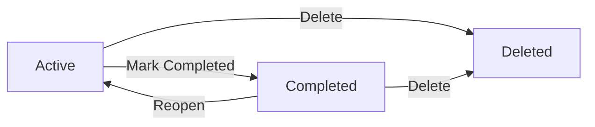

# Minimal Todo Application – Requirements Analysis

## 1. Purpose and Scope

The Todo application helps an individual keep track of simple tasks. The focus is on the **minimum set of features** that make a Todo list actually useful on a daily basis, without complex extras.

Scope:
- A single user can create personal todo items.
- The user can see their own todo items.
- The user can update, complete, and delete their own todo items.
- Only very simple sign-up / sign-in is expected.

Anything more advanced (sharing with other people, teams, tags, reminders, calendars, etc.) is **out of scope** for this first version.

## 2. Target Users and Goals

### 2.1 Target User

- A regular person who wants a simple list of tasks.
- This person is **not** a power user and does not need complex organization tools.

### 2.2 Main Goals

- Capture tasks quickly so they are not forgotten.
- See what still needs to be done versus what is already completed.
- Edit tasks when plans change.
- Remove tasks that are no longer relevant.

In EARS format:
- WHEN a person wants to remember a task, THE Todo application SHALL allow them to add a new todo quickly with short text.
- WHEN a person wants to see what they need to do today, THE Todo application SHALL show a clear list of their active todos.
- WHEN a task changes, THE Todo application SHALL allow the user to edit the todo text easily.
- WHEN a task is finished, THE Todo application SHALL allow the user to mark the todo as completed.
- WHEN a task is no longer needed, THE Todo application SHALL allow the user to delete the todo.

## 3. Core Concepts

### 3.1 User Account

A **user account** represents one person using the app.

Business characteristics (high level):
- The user has a way to identify themselves (for example, an email and password).
- The user can sign in and sign out.
- The user has their own private space of todos.

Requirements (EARS):
- WHEN a new person signs up, THE system SHALL create a user account that owns that person’s todos.
- WHILE a user account is active, THE system SHALL allow that user to sign in and manage only their own todos.

### 3.2 Todo Item

A **todo item** is a short text that describes something the user wants to do.

Business characteristics:
- It belongs to exactly one user.
- It has human‑readable text (for example: "Buy milk").
- It has a simple status: active (not done) or completed (done).
- It has a time when it was created and a time when it was last changed.

Requirements (EARS):
- WHEN a signed‑in user creates a todo, THE system SHALL store the todo and link it to that user.
- THE system SHALL keep for each todo a creation time and a last update time so that recent changes can be understood.
- WHILE a todo is active, THE system SHALL allow the user to modify its text.
- WHILE a todo is completed, THE system SHALL allow the user to reopen it back to active, if needed.

## 4. Minimal Functional Requirements

This section describes what the user must be able to do with todos. All operations apply to **the signed‑in user’s own todos only**.

### 4.1 Creating Todos

- WHEN a signed‑in user wants to add a task, THE system SHALL allow them to create a new todo with at least a short text field.
- WHEN a todo is created, THE system SHALL set the todo state to active by default.

### 4.2 Viewing Todos

- WHEN a signed‑in user opens their Todo list, THE system SHALL show a list of their active todos.
- WHEN a signed‑in user wants to check finished work, THE system SHALL provide a way to see their completed todos (for example, a separate list or a filter).
- THE system SHALL ensure that one user cannot see another user’s todos.

### 4.3 Updating Todos

- WHEN a signed‑in user decides to change the text of an existing todo, THE system SHALL allow editing the todo text.
- WHEN a todo is edited, THE system SHALL update the last‑updated time for that todo.

### 4.4 Completing and Reopening Todos

- WHEN a signed‑in user marks an active todo as completed, THE system SHALL move the todo from active state to completed state.
- WHEN a signed‑in user reopens a completed todo, THE system SHALL move the todo from completed state back to active state.

### 4.5 Deleting Todos

- WHEN a signed‑in user deletes a todo, THE system SHALL remove the todo from the normal active and completed lists.
- WHERE the business wants a simple approach, THE system MAY treat deletion as permanent from the user’s point of view (no recovery screen in this minimal version).

## 5. Todo Lifecycle (Simplified)

Conceptually, each todo passes through simple states:
- **Active** – a todo that still needs attention.
- **Completed** – a todo that is done but still visible for review.
- **Deleted** – a todo that the user removed.

In business terms:
- WHEN a todo is first created, THE system SHALL set it to Active.
- WHEN the user marks it as done, THE system SHALL set it to Completed.
- WHEN the user reopens it, THE system SHALL set it back to Active.
- WHEN the user deletes it, THE system SHALL move it to Deleted so it no longer appears in the usual lists.

A simple conceptual diagram:

## 6. Data and Retention Expectations (High Level)

The system works with two main kinds of data: user accounts and todo items.

### 6.1 Todos

- WHILE a todo is active and the user account is active, THE system SHALL keep the todo until the user completes or deletes it.
- WHILE a todo is completed and the user account is active, THE system SHALL keep the todo for at least a reasonable period so the user can still see what they have done (exact time can be decided by the business later).
- WHEN a todo is deleted by the user, THE system SHALL ensure that it does not appear in normal todo lists anymore.

### 6.2 User Accounts

- WHILE a user account is active, THE system SHALL keep the user’s account data and all of their todos.
- WHEN a user account is deleted, THE system SHALL stop allowing that person to sign in and manage todos.
- WHERE privacy or legal rules require it, THE system SHALL either remove or anonymize personal data after account deletion. (Exact rules can be decided later.)

## 7. Authentication and Access Rules

Authentication is intentionally simple for this minimal app.

### 7.1 Sign Up and Sign In

- WHEN a new user wants to use the Todo app, THE system SHALL allow them to create an account with minimal information (for example, email and password).
- WHEN a registered user provides correct credentials, THE system SHALL sign them in and give access to their own todos.
- IF a user provides wrong credentials, THEN THE system SHALL reject the login and give a clear error message without revealing sensitive details.

### 7.2 Access Control

- THE system SHALL ensure that each user can only access their own todos.
- THE system SHALL prevent one user from reading, changing, completing, or deleting another user’s todos.

## 8. Out‑of‑Scope Features (To Keep the App Minimal)

The first version of the Todo app **does not** need to support the following:
- Sharing todos with other users.
- Teams, projects, tags, or complex categories.
- Reminders, notifications, or calendar integration.
- Attachments, comments, or file uploads.
- Advanced search, sorting, or analytics.
- Administrative dashboards beyond what is needed to operate the service.

EARS statement:
- WHERE a feature is not essential to basic personal todo tracking, THE minimal Todo application SHALL exclude it from the initial scope.

## 9. Summary

In summary, the minimal Todo application focuses on a single user managing their own simple list of todos. The required capabilities are:
- User sign‑up and sign‑in.
- Creating, viewing, editing, completing, reopening, and deleting personal todos.
- Keeping todo states and basic timestamps.
- Protecting each user’s data from other users.

All requirements are intentionally simple so that a backend can be implemented and used reliably, even when the reader is not familiar with programming details.