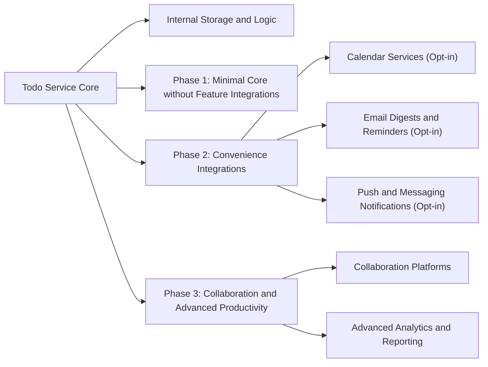
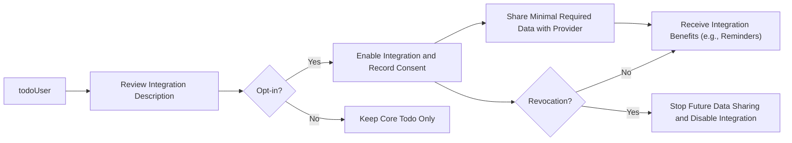

# External Dependencies and Future Extensions for Minimal Todo Service

## 1. Context and Purpose

The minimal Todo service identified by the prefix `todoApp` focuses on core personal task management for individual users. Three actors are relevant when considering external dependencies:

- `guestUser`: unauthenticated visitor with no access to private Todo data.
- `todoUser`: authenticated end user who manages personal Todo items.
- `todoAdmin`: administrative operator who may view and act on user and Todo data for support and policy enforcement in controlled circumstances.

External dependencies and future extensions must preserve the simple, reliable nature of the minimal service while protecting user privacy and ownership of Todo data. Integrations with external systems are treated as optional capabilities that may be introduced in later phases after the minimal core is stable.

## 2. Principles for External Dependencies

### 2.1 Minimal First Release

- THE minimal Todo service backend SHALL deliver all defined Todo features for `todoUser` without requiring any external productivity, calendar, or messaging platforms in the first release.
- THE minimal Todo service backend SHALL rely only on the smallest set of external services necessary to host and operate the backend itself, keeping feature-level behavior independent of third-party integrations.
- THE minimal Todo service backend SHALL treat all external feature integrations as out of scope for the first release unless they are explicitly listed as included.

### 2.2 Privacy, Consent, and Data Minimization

- THE minimal Todo service backend SHALL treat all Todo titles, descriptions, due dates, completion state, and related metadata as personal data belonging to the owning `todoUser`.
- THE minimal Todo service backend SHALL share Todo-related personal data with external parties only where a concrete feature requires it and where the `todoUser` has explicitly opted in.
- THE minimal Todo service backend SHALL apply data minimization to any external sharing so that only the smallest set of fields required to deliver the chosen feature is transmitted.
- WHEN a feature requires sharing Todo data with an external party, THE minimal Todo service backend SHALL present a clear explanation to the `todoUser` of what data is shared, for which purpose, and with which category of partner before the user opts in.

### 2.3 Optionality of Integrations

- THE minimal Todo service backend SHALL ensure that all core Todo features remain usable for `todoUser` even when the `todoUser` has not enabled any external integrations.
- THE minimal Todo service backend SHALL ensure that disabling or revoking an external integration never prevents `todoUser` from performing fundamental Todo actions (create, read, update, complete, delete) inside the service.

## 3. Current Version Assumptions (Phase 1)

### 3.1 No Feature-Level External Productivity Integrations

- THE Phase 1 minimal Todo service backend SHALL complete Todo creation, reading, updating, completion, and deletion purely within its own boundary, without synchronizing Todo data to calendar, note-taking, or task-management platforms.
- THE Phase 1 minimal Todo service backend SHALL avoid collecting data fields whose only purpose is to support external productivity integrations that are not in scope for the first release.

### 3.2 Account Lifecycle Email Only (If Used)

- WHERE email is used in Phase 1, THE minimal Todo service backend SHALL restrict email usage to account lifecycle scenarios such as registration confirmation, password reset, and critical account-status notifications.
- THE minimal Todo service backend SHALL avoid using email in Phase 1 to send Todo reminders, task digests, or promotional content about Todos.

### 3.3 Exclusion of First-Release Feature Integrations

- THE Phase 1 minimal Todo service backend SHALL NOT implement automatic synchronization of Todo items or due dates to any external calendar platform.
- THE Phase 1 minimal Todo service backend SHALL NOT implement push notifications, SMS messages, or chat messages that describe or expose Todo content to external messaging channels.
- THE Phase 1 minimal Todo service backend SHALL NOT implement feature-level integrations with external identity providers, collaboration tools, or analytics platforms beyond what is strictly needed for operating the service and complying with basic operational monitoring.

### 3.4 Risk Control by Avoiding Dependencies

- WHERE an external dependency is not essential to deliver the agreed minimal Todo feature set, THE product initiative SHALL exclude that dependency from the first release to reduce operational and privacy risk.
- IF an external dependency would require sharing Todo content or user identity data in ways not covered by the minimal scope, THEN THE product initiative SHALL treat that integration as a future extension rather than part of Phase 1.

## 4. Potential Future Integrations

Future phases may expand the Todo service with convenience, productivity, or collaboration integrations. These extensions are optional and must be clearly separated from the minimal core.

### 4.1 Calendar Integrations

Calendar integration would allow `todoUser` to see Todo deadlines within their external calendar.

- WHERE a `todoUser` opts in to calendar integration, THE Todo service backend SHALL allow the `todoUser` to choose which Todo due dates are exposed as calendar events.
- WHEN a `todoUser` with calendar integration enabled creates or updates a Todo with a due date, THE Todo service backend SHALL prepare summary information about that Todo for synchronization with the selected calendar in a way that does not reveal more data than necessary.
- IF a `todoUser` does not enable calendar integration, THEN THE Todo service backend SHALL keep Todo due dates and content entirely within the internal Todo context and SHALL not share them with any calendar provider.
- WHEN a `todoUser` revokes calendar integration, THE Todo service backend SHALL stop creating or updating calendar-linked representations for any of that user’s Todos.

### 4.2 Email-Based Todo Digests and Reminders

Email features may later notify `todoUser` of upcoming or overdue Todos.

- WHERE a `todoUser` enables email digests, THE Todo service backend SHALL periodically generate summary information about that user’s upcoming or overdue Todos and assemble it into digest-style content.
- WHEN a `todoUser` enables reminders for specific Todos, THE Todo service backend SHALL include only Todo information that is necessary for the `todoUser` to recognize the task in the reminder (such as title and due date) and SHALL avoid including sensitive details that are not needed.
- IF a `todoUser` disables email digests or reminders, THEN THE Todo service backend SHALL stop preparing new digest or reminder content for that `todoUser`.
- WHEN email-based features depend on external email delivery providers, THE Todo service backend SHALL treat such providers as processors of personal data and SHALL require that contracts and policies reflect this role.

### 4.3 Push Notifications and Messaging Platforms

In later phases, notifications may appear in device-native channels or third-party messaging applications.

- WHERE push notifications are enabled by a `todoUser`, THE Todo service backend SHALL generate notification content that is sufficient for the `todoUser` to understand the event while minimizing exposure of full Todo details.
- WHEN a `todoUser` chooses to receive notifications through a messaging platform, THE Todo service backend SHALL send only the minimal information required to identify the Todo or event, such as a short label and due time, and SHALL avoid including entire descriptions unless explicitly permitted.
- IF a `todoUser` disables notifications or disconnects a messaging platform, THEN THE Todo service backend SHALL stop sending Todo-related notifications to that channel.

### 4.4 External Identity and Single Sign-On Providers

Integration with external identity providers may ease authentication while keeping Todo ownership internal.

- WHERE an external identity provider option is enabled, THE Todo service backend SHALL allow a `todoUser` to link an account in the Todo service to an identity managed by that provider.
- WHEN a `todoUser` signs in using an external identity provider, THE Todo service backend SHALL use the external identity only to confirm who the user is and to connect the session to the correct `todoUser` account.
- IF an external identity provider is temporarily unavailable, THEN THE Todo service backend SHALL allow users with configured alternative authentication methods (such as a local credential, where business policy permits) to access their account, subject to security rules.

### 4.5 Analytics and Product Insight Services

Analytics services may later help understand usage without revealing detailed Todo content.

- WHERE analytics tracking is enabled, THE Todo service backend SHALL share only aggregated or pseudonymized information about Todo usage patterns and SHALL avoid including full Todo titles or descriptions in analytics events by default.
- WHEN analytics events need to reference Todo activity, THE Todo service backend SHALL favor non-identifying indicators such as counts, state changes, or duration metrics instead of full textual content.
- IF a `todoUser` exercises a legal right or preference to limit analytics tracking, THEN THE Todo service backend SHALL cease sending non-essential analytics data tied to that `todoUser`.

## 5. User Data Sharing Implications

### 5.1 Categories of Shared Data

- THE Todo service backend SHALL treat account identity data (such as email and display name), Todo metadata (such as title, due date, completion state), and preference data (such as notification or integration settings) as distinct categories of personal data that require careful handling.
- WHERE an integration requires data from more than one category, THE Todo service backend SHALL justify each category’s inclusion in terms of the user-visible benefit of that integration.

### 5.2 Consent and Revocation

- WHEN a new external integration is offered, THE Todo service backend SHALL present clear information about what will be shared, how often, and for what purpose before the `todoUser` enables it.
- WHEN a `todoUser` enables an external integration, THE Todo service backend SHALL treat this decision as consent for the specific data flows described at the time of opt-in.
- WHEN a `todoUser` revokes consent for an integration, THE Todo service backend SHALL stop future data flows to that integration and SHALL flag the integration as inactive for that user so that core features continue without it.

### 5.3 Data Minimization and Protection

- THE Todo service backend SHALL prefer sharing derived or summarized data (for example, counts or status flags) rather than full Todo descriptions when the derivative information is sufficient to deliver the integration feature.
- IF an external provider does not need a specific data field to implement its function, THEN THE Todo service backend SHALL exclude that field from data shared with the provider.
- WHERE sensitive fields exist within Todo content or user profile, THE Todo service backend SHALL avoid including such fields in any externally shared payload unless there is an explicit, documented business requirement that the `todoUser` has opted into.

### 5.4 Jurisdiction and Retention Considerations

- WHERE external providers store user-related data, THE Todo service backend SHALL consider the jurisdictions in which the data may be stored and SHALL align sharing behavior with the service’s published privacy commitments.
- WHEN a `todoUser` account is deleted according to the data lifecycle policy, THE Todo service backend SHALL, where contractually feasible, request deletion or anonymization of related personal data by external providers that previously received such data.

## 6. Roadmap Phases and Integration Priorities

### 6.1 Phase 1: Minimal Service Without Integrations

- THE roadmap for Phase 1 SHALL focus on delivering stable, reliable Todo management without any feature-level external integrations.
- THE roadmap for Phase 1 SHALL consider any use of external services solely as operational infrastructure (such as basic email for account lifecycle) and not as user-facing Todo extensions.

### 6.2 Phase 2: Convenience Integrations

- WHERE Phase 2 introduces convenience features such as email digests, simple reminders, or basic calendar links, THE roadmap SHALL treat these features as opt-in enhancements that do not change the minimal core behavior for users who do not enable them.
- WHEN a Phase 2 feature depends on an external service, THE roadmap SHALL require clear consent, data minimization rules, and user control over enabling and disabling the integration.

### 6.3 Phase 3: Collaboration and Advanced Productivity

- WHERE Phase 3 introduces team-based features, shared Todo lists, or deep integrations with collaboration tools, THE roadmap SHALL ensure that organization-level policies controlled by `todoAdmin` can govern which integrations are available to which users.
- WHEN advanced integrations involve sharing Todo content across organizational boundaries, THE roadmap SHALL require explicit policy, governance, and consent mechanisms before such features are made generally available.

### 6.4 Sequencing and Prerequisites

- THE roadmap planning process SHALL introduce privacy and consent controls before enabling any integration that shares Todo content or identity data outside the Todo service.
- IF an integration proposal assumes complex bidirectional synchronization of Todo data without existing governance and consent mechanisms, THEN the roadmap planning process SHALL postpone that integration until those mechanisms exist and have been validated.

## 7. Conceptual Integration Diagrams

### 7.1 Integration Landscape Across Phases

### 7.2 Consent and Data Flow

These business-level requirements for external dependencies and future extensions ensure that the minimal Todo service keeps its first release simple and private while providing a clear path for optional growth into calendar, notification, identity, and analytics integrations that respect user consent, data minimization, and actor roles.