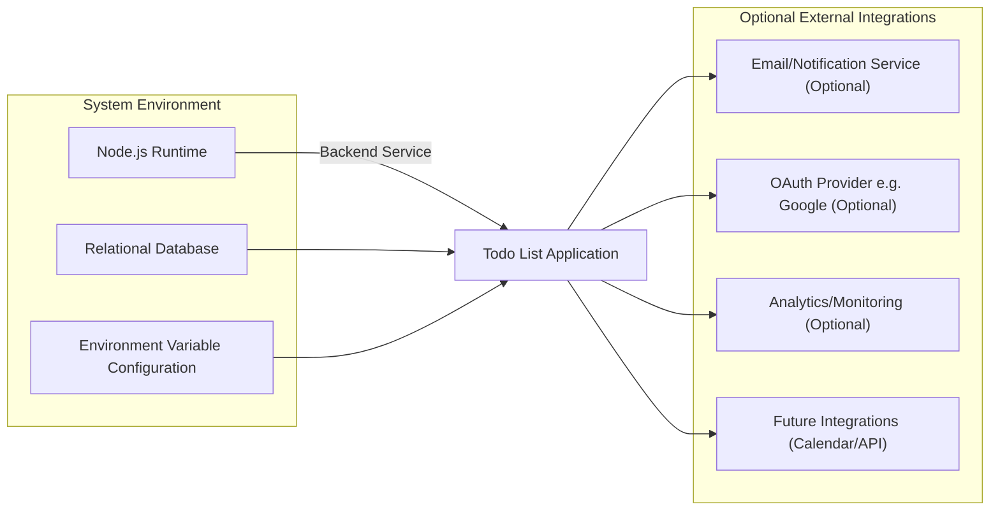

# Environmental Dependencies and Integration Requirements for the Todo List Application

## System Dependencies

- WHEN deploying the Todo list backend service, THE system SHALL operate successfully on any modern Linux distribution (Ubuntu, Debian, CentOS, Amazon Linux), macOS, or compatible Windows Server with Node.js LTS installed.
- WHEN the backend is initialized, THE system SHALL require Node.js (version 18.x or newer) as the runtime engine for all backend processes.
- WHEN persistent data storage is needed, THE system SHALL require a relational database (PostgreSQL, MySQL, or equivalent) for todos and user records in all staging and production environments; WHERE local-only use is sufficient, SQLite MAY be used for development.
- WHEN environment-specific configuration is required, THE system SHALL support definition of all sensitive and system-dependent values through external configuration channels (e.g., .env file, secret manager) with documented key/value pairs and default fallback behavior.
- WHEN running in production, THE system SHALL support and encourage standard logging mechanisms, with output to both console and optionally to remote log management systems configured by environment variable.
- WHERE operational monitoring is required, THE system SHALL provide hooks for sending logs, error events, or performance metrics to external monitoring/analytics tools, subject to configuration.

## Platform and Host Requirements

- WHEN operating on cloud infrastructure or on-premise servers, THE system SHALL be platform-agnostic and must not depend on cloud vendor specific features.
- WHERE any OS- or platform-specific dependencies must exist, THE requirement SHALL be clearly stated with rationale and guidance for cross-platform configuration.
- WHERE Docker or container orchestration is used, THE application SHALL provide sample Dockerfile and .env configuration suited to minimal production setup.

## Backend and Infrastructure Services

- WHEN the service is deployed, THE backend SHALL require access to durable storage for user-generated data, with minimum ACID compliance guarantees where relational DB is used.
- IF log forwarding is required for organizational compliance, THEN THE backend SHALL support redirecting logs via standard Node.js logging frameworks or environment-specific plugins.

## External Services (Optional Integrations)

- WHERE minimum feature set is desired, THE default deployment SHALL exclude external integrations except for the relational database and environment configuration.
- WHERE email or push notifications are required (e.g., for Todo reminders), THE system SHALL support optional integration with third-party notification providers (SendGrid, Mailgun, Amazon SES, Firebase) via pluggable modules enabled by environment configuration.
- WHEN optional notification provider credentials (e.g., API keys, sender address) are provided as environment variables, THE system SHALL enable those integrations; IF credentials are absent, THE system SHALL run without external notifications.
- WHERE OAuth or third-party login is required, THE system SHALL provide optional integration with industry-standard OAuth providers (Google, GitHub, etc.) through secure credential configuration; IF values are not present in .env or secret storage, native email + password registration SHALL be the only authentication type permitted.
- WHEN monitoring or analytics is enabled, THE backend SHALL accept API keys or endpoints (e.g., Sentry DSN, Prometheus URL) via environment variables and forward errors and metrics only if these are properly configured.
- WHERE future extension of integrations (calendar sync, task sync, API clients) is planned, THE core backend SHALL provide a configuration-driven plugin architecture for enabling/disabling optional services, specified entirely through configuration.

## Integration Requirements

### Required Configuration Values

- WHEN starting up, THE system SHALL require the following minimum environment variables to be specified: database connection URI (host, port, user, password, database), and cryptographically secure JWT secret for authentication.
- WHERE optional integrations are used, THE system SHALL require the respective provider credentials to be set in environment configuration (API keys, OAuth secrets, analytics endpoints) and SHALL not execute that integration if absent.
- WHEN secrets/credentials/API keys are loaded, THE backend SHALL enforce that no hardcoded secrets are present in source code; all sensitive values must be injected by CI/CD, secret manager, or external configuration file.

### Secret Management & Security

- WHEN application secrets are present, THE backend SHALL use industry standards for secret storage: .env files outside source control, or production-grade secret manager with strict access controls.
- WHERE platform support exists, THE deployment pipeline SHALL provide secure injection of environment variables and block all hardcoded secret exposure.
- WHEN credentials for third-party integrations are required, THE system SHALL support dynamic reloading or rotation via environment reload or configuration change, without redeployment.

### Protocols and Communications

- WHEN connecting to any external service, THE system SHALL default to using secure protocols (HTTPS, TLS); unencrypted channels must be explicitly marked as unsupported, or permitted only with clear warnings.
- WHERE webhooks, callbacks, or push endpoints are used, THE backend SHALL require configuration of externally available URLs and support authentication/signature validation on inbound requests.

## Mermaid Diagram: Environmental & Integration Overview

## Configuration and Success Checklist

| Dependency Area        | Mandatory | Optional | Configuration Channel              |
|-----------------------|-----------|----------|------------------------------------|
| Node.js Runtime       | ✅        |          | Install on server/machine          |
| Relational DB         | ✅        |          | Environment variables / .env files |
| Environment Config    | ✅        |          | .env or secret manager             |
| Email Notification    |           | ✅       | Environment variables              |
| OAuth Provider        |           | ✅       | Environment variables              |
| Analytics/Monitoring  |           | ✅       | Environment variables              |
| Calendar/API Ext.     |           | ✅       | Environment variables              |

## Success Criteria

- THE system SHALL be deployable and operational with Node.js LTS and relational database as minimum dependencies.
- THE service SHALL be extensible to use notification, OAuth, analytics/monitoring, and custom integrations by simply enabling configuration via environment variables.
- THE backend SHALL remain secure, with no credentials or API secrets ever committed to code or version control.
- THE operational and integration requirements specified here SHALL be sufficient for backend and DevOps teams to fully configure, deploy, maintain, and extend the Todo list application into production environments.