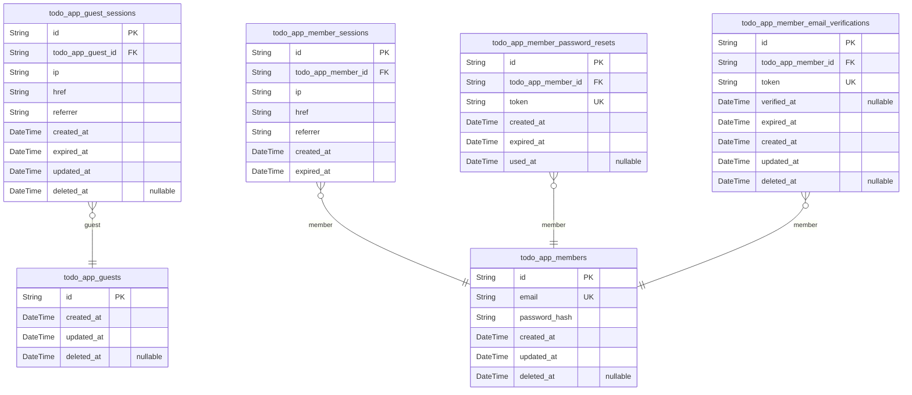
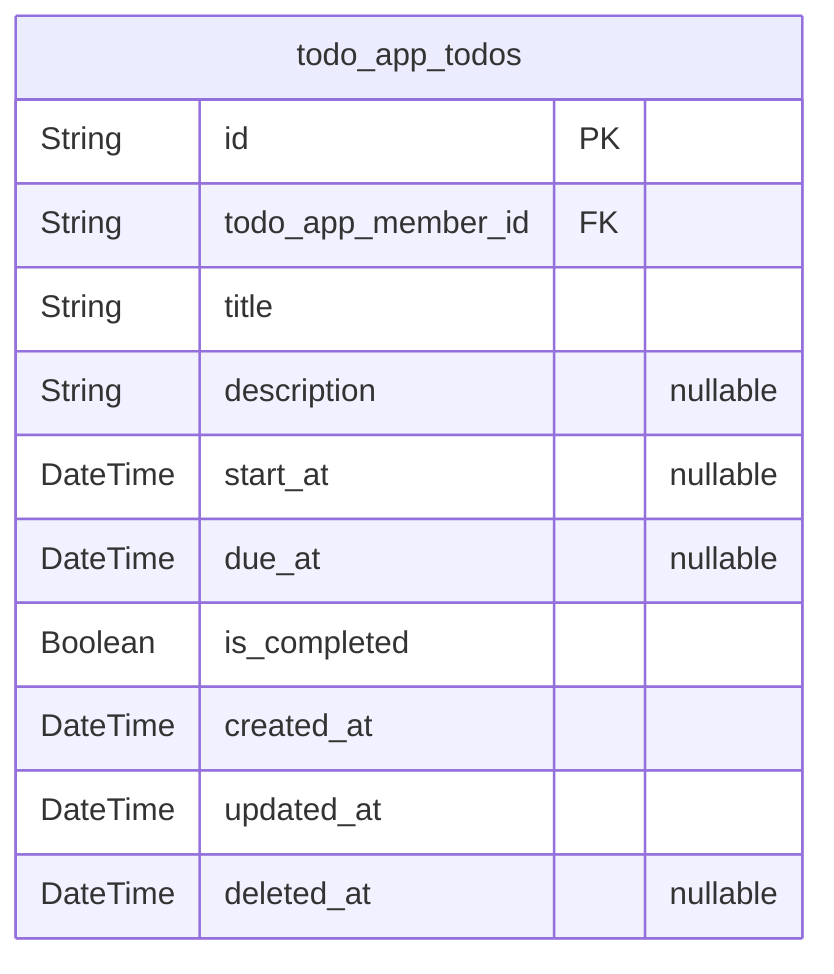
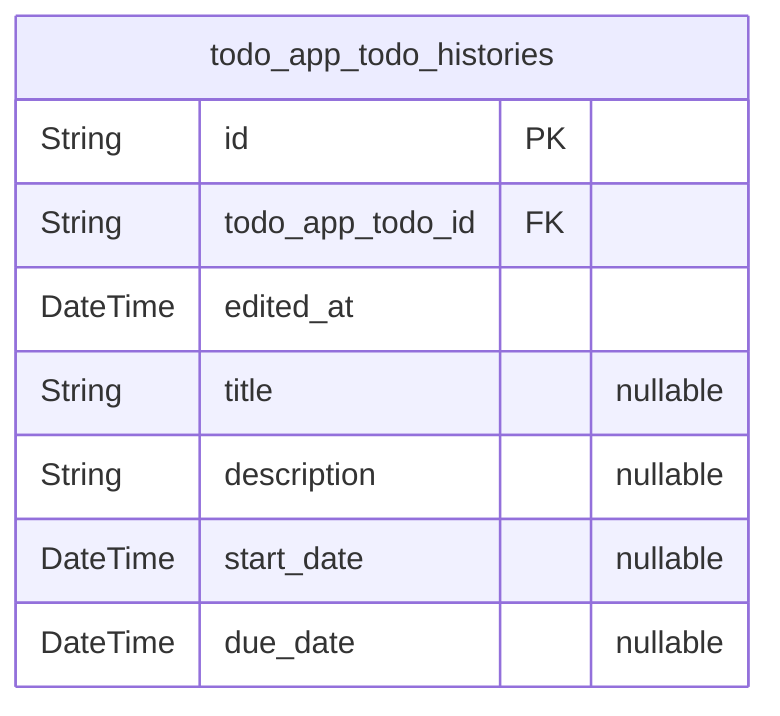
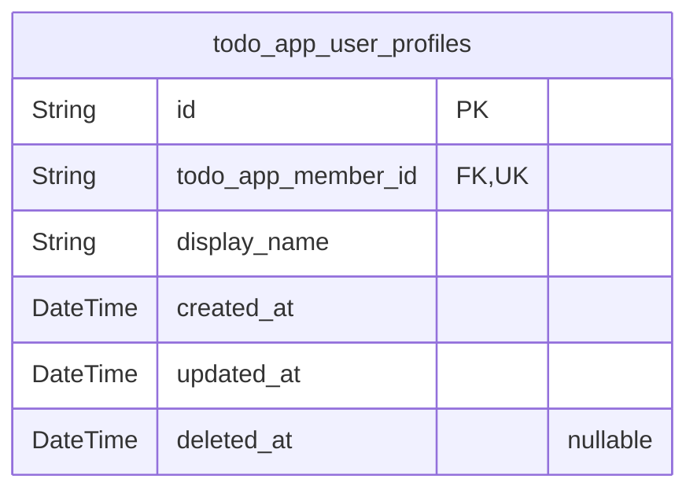

# Prisma Markdown

> Generated by [`prisma-markdown`](https://github.com/samchon/prisma-markdown)

- [Actors](#actors)
- [Todos](#todos)
- [TodoHistory](#todohistory)
- [UserProfile](#userprofile)

## Actors

### `todo_app_guests`

Temporary guest identities used for anonymous access and device-based
tracking without permanent credentials.

Each record represents one anonymous visitor identity that can own
short-lived guest sessions without becoming a registered member account.
The table is the root identity record for guest-specific activity and
must remain separate from authenticated member data and from guest
session records in [todo_app_guest_sessions](#todo_app_guest_sessions).

Properties as follows:

- `id`: Primary Key.
- `created_at`: Time when the guest identity was created.
- `updated_at`: Time when the guest identity was last updated.
- `deleted_at`: Time when the guest identity was soft deleted, if applicable.

### `todo_app_guest_sessions`

Temporary session records for anonymous guest access. Each row belongs to
exactly one [todo_app_guests](#todo_app_guests) record and stores the connection
context needed to manage short-lived guest state, track access timing,
and support logout or expiration handling.

This table is a pure session entity: it does not store business content,
only the guest owner reference and security/audit metadata for the
session lifecycle.

Properties as follows:

- `id`: Primary Key.
- `todo_app_guest_id`: Owning guest's [todo_app_guests.id](#todo_app_guests).
- `ip`: IP address observed when the guest session was created.
- `href`: Current or last visited URL associated with the guest session.
- `referrer`: Referrer URL associated with the guest session request.
- `created_at`: Timestamp when the guest session was created.
- `expired_at`: Timestamp when the guest session expires.
- `updated_at`: Timestamp when the guest session record was last updated.
- `deleted_at`: Timestamp when the guest session was soft deleted, if applicable.

### `todo_app_members`

Registered member accounts for authenticated access to the private todo
application.

This table stores the canonical identity record for a signed-in member,
including the email address and password hash used for authentication. It
is the root actor entity for all member-owned data such as {@link
todo_app_todos} and [todo_app_user_profiles](#todo_app_user_profiles), while session and
recovery workflows are handled in separate child tables.

Properties as follows:

- `id`: Primary Key.
- `email`
  > Member login email address used for authentication and account
  > identification.
- `password_hash`: Hashed password used for member authentication.
- `created_at`: Timestamp when the member account was created.
- `updated_at`: Timestamp when the member account was last updated.
- `deleted_at`: Timestamp when the member account was soft deleted, if applicable.

### `todo_app_member_sessions`

JWT session records for [todo_app_members](#todo_app_members) used to manage member
login, refresh, and logout behavior.

Each record stores one authenticated session instance together with
connection metadata and expiration time for security auditing. The table
is append-only in practice and exists only as a child of the member actor
table.

Properties as follows:

- `id`: Primary Key.
- `todo_app_member_id`: Belonged member's [todo_app_members.id](#todo_app_members).
- `ip`: IP address used when the session was created.
- `href`: Request URL or client location associated with the session creation event.
- `referrer`: Referrer URL recorded at the time the session was created.
- `created_at`: Timestamp when the session was created.
- `expired_at`: Timestamp when the session becomes invalid and can no longer be used.

### `todo_app_member_password_resets`

Password reset tokens for [todo_app_members](#todo_app_members) account recovery and
password change workflows.

Each record represents a single reset request issued for one member
account. The table stores the secure token, the account it belongs to,
and the timestamps needed to validate whether the reset link is still
usable. It is a supporting authentication table and is not intended for
direct user browsing or general business operations.

Properties as follows:

- `id`: Primary Key.
- `todo_app_member_id`: Member account that owns this reset token. [todo_app_members.id](#todo_app_members).
- `token`: Secure one-time reset token used to verify password recovery requests.
- `created_at`: When this password reset request was created.
- `expired_at`: When this password reset token becomes invalid.
- `used_at`: When this password reset token was redeemed, if it has been used.

### `todo_app_member_email_verifications`

Stores email verification tokens issued to member accounts during
registration or email change confirmation flows.

Each record belongs to exactly one member account and represents a single
verification lifecycle, including the token used, the time it was issued,
and when it was confirmed or expired. This table exists only to support
account activation and trust validation for [todo_app_members](#todo_app_members) and
is not meant to be used as a standalone business entity.

Properties as follows:

- `id`: Primary Key.
- `todo_app_member_id`
  > Member account that owns this email verification token. {@link
  > todo_app_members.id}.
- `token`
  > Opaque verification token sent to the member for confirming the email
  > address.
- `verified_at`
  > Timestamp when the verification token was successfully consumed and the
  > email address was confirmed.
- `expired_at`: Timestamp after which the verification token must no longer be accepted.
- `created_at`: Record creation timestamp.
- `updated_at`: Record last update timestamp.
- `deleted_at`
  > Soft delete timestamp for administrative removal or cleanup of obsolete
  > records.

## Todos

### `todo_app_todos`

Stores each member's private todo item, including ownership, title,
optional description, optional start and due dates, completion state, and
soft-delete status.

This table is the current-state record for a todo. It supports private
list browsing, detail viewing, completion toggling, editing, trash
management, restore, and permanent deletion workflows. Edit history is
preserved in the separate [todo_app_todo_histories](#todo_app_todo_histories) table, so this
model only contains the latest todo state.

Properties as follows:

- `id`: Primary Key.
- `todo_app_member_id`: Owning member account's [todo_app_members.id](#todo_app_members).
- `title`: Todo title shown in todo lists and detail views.
- `description`: Optional todo description shown in the detail view.
- `start_at`: Optional start date for the todo.
- `due_at`: Optional due date for the todo.
- `is_completed`: Whether the todo is currently completed.
- `created_at`: When this todo record was created.
- `updated_at`: When this todo record was last updated.
- `deleted_at`: When this todo was soft deleted; null means it is active.

## TodoHistory

### `todo_app_todo_histories`

Stores one immutable edit-history entry for a todo item. Each row records
when an edit occurred and the resulting title, description, start date,
and due date values for the changed fields so the full change trail can
be viewed in chronological order.

This table is a historical snapshot trail for [todo_app_todos](#todo_app_todos) and
is only meaningful in the context of its parent todo. It is append-only
by design and supports the private todo app’s requirement to preserve the
edit history of each user-owned todo until the parent todo is permanently
removed.

Properties as follows:

- `id`: Primary Key.
- `todo_app_todo_id`: Parent todo for this history entry. References [todo_app_todos.id](#todo_app_todos).
- `edited_at`: Timestamp when this history entry was recorded for the todo edit.
- `title`
  > Todo title after the edit, if the title was changed as part of this
  > history entry.
- `description`
  > Todo description after the edit, if the description was changed as part
  > of this history entry.
- `start_date`
  > Todo start date after the edit, if the start date was changed as part of
  > this history entry.
- `due_date`
  > Todo due date after the edit, if the due date was changed as part of this
  > history entry.

## UserProfile

### `todo_app_user_profiles`

Stores the private profile for one member account, including the account
holder's display name used for in-app identification.

This record is strictly owner-scoped and is not publicly browsable. It
exists separately from authentication credentials so profile data can be
managed without exposing login information, and it is linked one-to-one
with [todo_app_members](#todo_app_members) through a unique ownership relationship.

Properties as follows:

- `id`: Primary Key.
- `todo_app_member_id`
  > Owning member account for this private profile. References {@link
  > todo_app_members.id}.
- `display_name`: Private display name shown within the application for the owning member.
- `created_at`: When this profile record was created.
- `updated_at`: When this profile record was last updated.
- `deleted_at`: When this profile record was soft deleted. Null when active.
