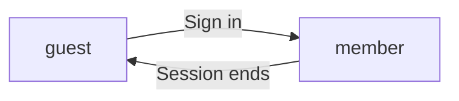
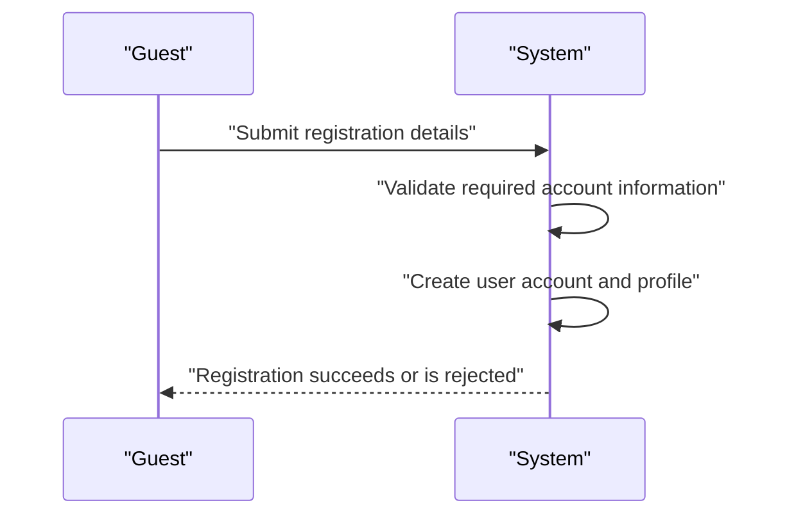
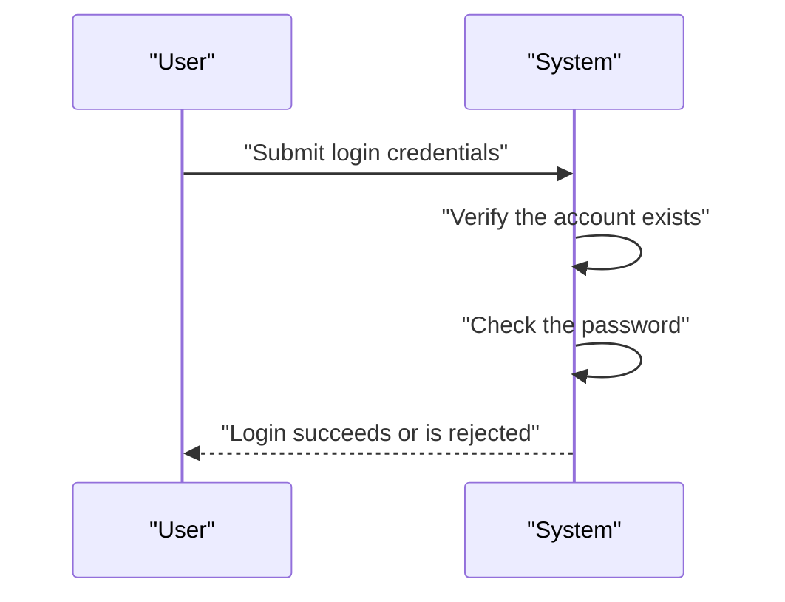
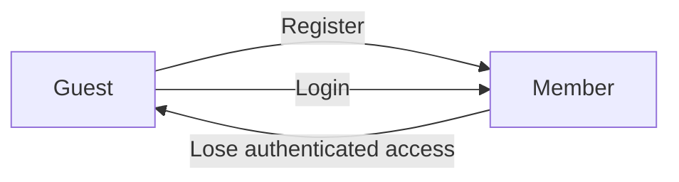
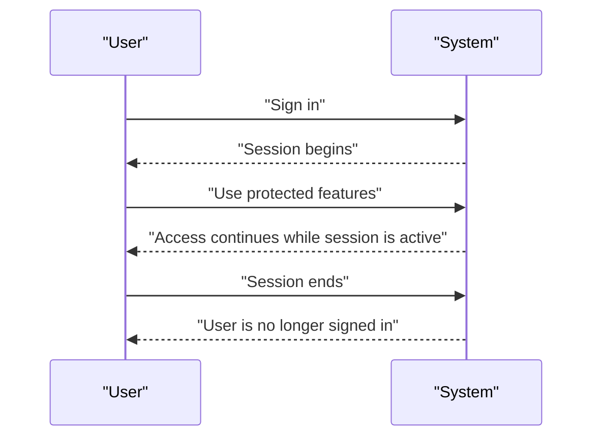
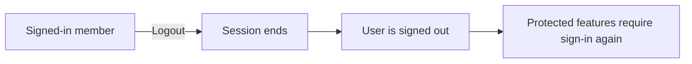
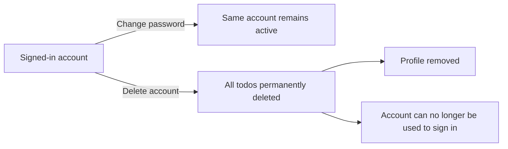
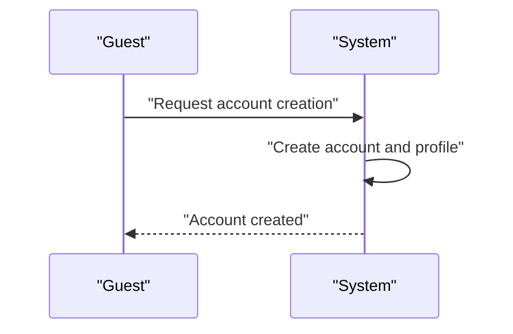
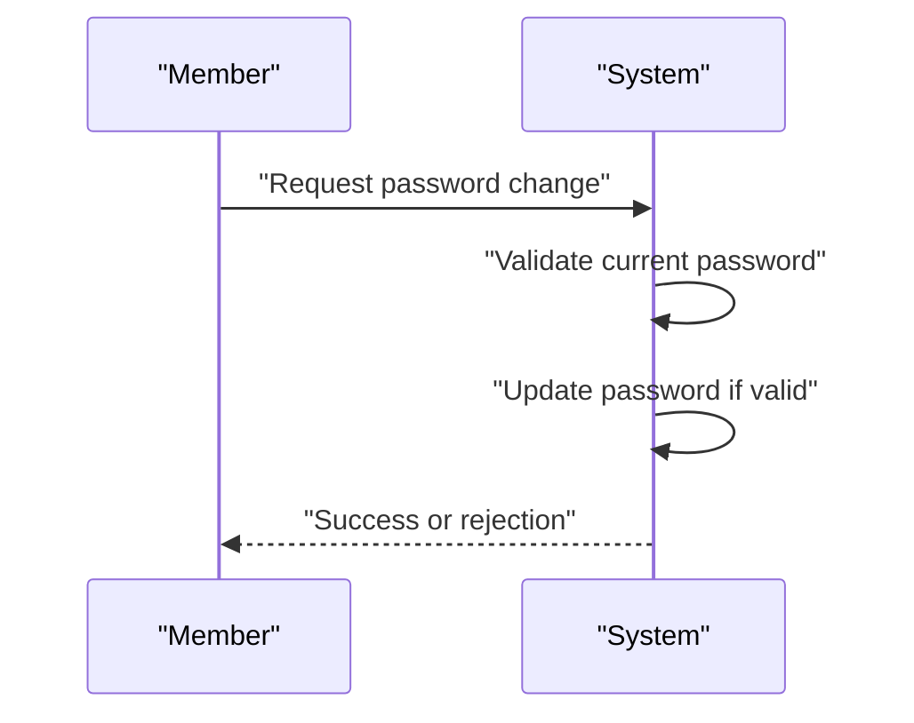
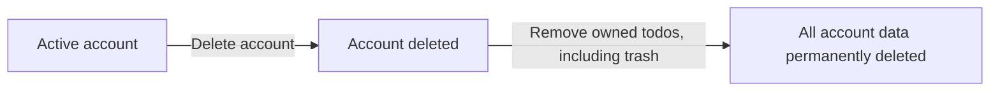

**todoApp — Actor definitions, permission matrix, authentication, session, account lifecycle**

Actor definitions, permission matrix, authentication, session, account lifecycle

# Actor Definitions

Define all user actor types with their identity, permissions, and access boundaries.

## guest Actor

A guest is a person who has not signed in to the application. This actor has only the most limited access and cannot use member-only functions. A guest can reach the sign-up and log-in entry points needed to begin using the application. A guest does not have permission to act on any saved todo information because no account session is active. Guest access ends once the person signs in as a member. If a guest tries to reach protected areas, the application must prevent access. The guest role exists only as an unauthenticated state and does not carry ownership of any user data. Guests should be treated separately from signed-in members at all times.

### Guest Actor

A guest is an unauthenticated visitor who has not signed in to the application.
A guest exists only in a pre-authentication state and has no active account session.
A guest has limited access and may reach only the sign-up entry point and the log-in entry point.
A guest is outside the non-member access boundary for saved user content and cannot act on any todo information.
If a guest attempts to access a protected area, the application denies access.
Guest access ends when the person becomes a signed-in member.

## member Actor

A member is a signed-in user with an active account in the application. This actor represents the normal authenticated user experience. Members have permission to use the application areas reserved for logged-in users. Their access is broader than a guest's access, but it is still limited to what the app allows for the account holder. A member is identified as the current user within the private app experience. Member access should remain tied to the authenticated account state. If the session is no longer valid, the member no longer has member-level access and is treated as a guest. The member role is the primary actor for all protected user interactions in the application.

### Member Actor

A member is a signed-in account holder with an active session state in the application. The member represents the authenticated user experience and is the current user within the private app context.

A member has member-only access to the areas of the application reserved for logged-in users. This access boundary applies only while the account remains signed in and the session remains active.

A member is the primary actor for protected user experience areas. When the authenticated state is no longer valid, the same person is no longer treated as a member and falls back to guest access.

Member access is limited to the account holder permissions assigned to the current signed-in account holder. A member cannot act as another user within the application.

### Authenticated User

The authenticated user is the account holder whose identity is currently recognized by the application.

The authenticated user is the only person who can use member-level access for that account. The application treats the authenticated user as the current user for all protected user experience areas.

If the account is not signed in, there is no authenticated user and member-level access is not available.

The authenticated user definition is used only to describe the access state of the signed-in account holder and does not introduce any additional permissions beyond those already assigned to the member actor.

### Signed-In Account Holder

A signed-in account holder is the person whose account is currently active in the application.

This status identifies the user who is allowed to operate within the protected user experience reserved for logged-in access.

The signed-in account holder remains the current user only while the active session state is valid. If the session is no longer valid, the signed-in account holder is no longer treated as a member.

This section defines identity and access status only; the actions available to the account holder are defined in the permission sections of this file.

### Member-Only Access

Member-only access means access that is available only to an authenticated user with an active session state.

The application shall treat member-only access as the logged-in access boundary for the private user experience.

When a user is not signed in, member-only access is not available.

When a member’s session becomes invalid, access to member-only areas ends and the user is treated as a guest.

Member-only access is exclusive to the current user and does not extend to other users or shared access within the application.

### Protected User Experience

The protected user experience is the part of the application that is reserved for member actors.

Only the current user with an active session state can use the protected user experience.

The protected user experience is private by design, meaning the authenticated user can only operate within their own logged-in access boundary.

If the account holder is not signed in, the protected user experience is not available to that person.

### Current User

The current user is the authenticated user whose session is active at the time they are using the application.

The current user is the only account holder recognized for member-level access during that session.

The current user concept is used to identify who the application should treat as the active member actor.

When the active session state ends, there is no current user for member-level access until a new sign-in occurs.

### Active Session State

Active session state means the account holder is currently signed in and recognized as a member.

While the active session state exists, the application treats the person as the current user with member-only access.

When the active session state ends, member access ends as well.

This section defines the relationship between sign-in state and member status only; session lifecycle details are handled in the session section of this file.

### Account Holder Permissions

Account holder permissions define what the signed-in account holder may do within the member actor boundary.

These permissions apply only to the current user and only while the active session state remains valid.

The authenticated user does not inherit permissions belonging to any other user.

The account holder permissions are restricted to the private, protected user experience and do not create any shared or public access.

Any permissions not granted to the member actor are outside the logged-in access boundary.

### Logged-In Access Boundary

The logged-in access boundary is the limit of what a member actor can reach in the application.

Within this boundary, the authenticated user is treated as the current user and may use member-only access.

Outside this boundary, access is not available to the signed-in account holder as a member actor.

The logged-in access boundary is private and account-specific, so it does not allow one user to enter another user’s experience.

# Authentication Flows

Registration, login, logout, and session management from a user perspective.

## Registration and Login

Define user registration and login flows including validation and error handling.

### Registration

Guests can create a user account by signing up with an email address and password.
A successful registration creates a new member account and establishes the user as a member actor.
A registered account is associated with one user profile that includes a display name.
The registration flow must support the creation of a display name for the new profile.
If the email address is already associated with an existing account, the registration request is rejected.
If the email address or password is missing, the registration request is rejected.
If the registration attempt does not create a valid account, the user remains a guest.

### Login

Guests and returning users can log in with email and password.
A successful login grants access as a member and allows the user to use member-only features.
The login flow only accepts credentials that match an existing user account.
If the email address does not match an existing account, the login request is rejected.
If the password does not match the selected account, the login request is rejected.
If the login attempt fails, the user remains a guest.
A user who is already signed in remains a member while using member-only features.

### Authentication

Authentication distinguishes guests from members.
A guest has limited access and can only use the public entry points needed to sign up or log in.
A member is an authenticated user who can access the protected todo experience.
The system must treat the signed-in account holder as the current member for account-bound actions.
If a user is not authenticated, the system rejects member-only access.
If a user is authenticated, the system permits access to member-only actions defined for the member actor.
Authentication state controls whether the user is handled as a guest or a member.

## Session and Logout

Define session behavior and logout from a user perspective.

### Session

Members remain signed in until they explicitly log out or their session ends.
A member who is signed in can continue using protected features without signing in again during that session.
A signed-in session belongs to one member account and must not be usable by another user.
If a session is no longer active, the system treats the user as not signed in.

### Logout

A signed-in member can log out from their account.
When a member logs out, the current session ends.
After logout, the user must sign in again before accessing protected member features.
Logging out does not delete the user's account, profile, or todos.
Logging out does not delete any todo history.
If a user is not signed in, the system does not offer logout as an account action.

### Account Security

A user can change their password while signed in.
After a password change, the user's account remains the same account and the user stays responsible for the same todos and profile.
A user can delete their account while signed in.
When an account is deleted, all of the user's todos are permanently deleted, including todos in trash.
When an account is deleted, the user's profile is also removed with the account.
After account deletion, the account can no longer be used to sign in.
The system treats account deletion as final for that account.
If an account has been deleted, the system rejects any attempt to use it as an active member account.

# Account Lifecycle

Account creation, deletion, and password management.

## Account Management

Define how users create accounts, delete accounts, and change passwords.

### Account Creation

Users can create an account using an email address and a password.
Account creation results in a new user account with a private profile.
The account is associated with a display name profile from the start.
A newly created account is available for the owner to use after creation.

### Password Change

A signed-in user can change the password for their own account.
The system accepts the current password and a new password for a password change request.
If the current password is valid, the system updates the account password.
If the current password is not valid, the password change request is rejected.
A successful password change keeps the account owned by the same user.

### Account Deletion

A signed-in user can delete their own account.
Deleting an account permanently deletes all todos owned by that account, including todos in trash.
Deleting an account permanently removes the associated account profile as part of the account lifecycle.
After account deletion, the account can no longer be used to access the application.

