**todoApp — Business concepts, relationships, and states from user perspective**

Business concepts, relationships, and states from user perspective

# Domain Concepts

Describe what each concept means in the business domain and its key attributes.

## UserAccount Concept

A UserAccount represents the private account a person uses to participate in the todo application. It identifies the owner of todos and separates one user's data from another user's data. The account is tied to authentication credentials used for access to the application. It also reflects the user's account status within the system. In this domain, the account is the basis for ownership of personal todos and profile information. Because the app is private, a UserAccount is associated only with that user's own content. Account data is distinct from the user's profile details, which are represented separately. The account concept also supports the idea that all content belongs to one specific user. When an account is removed, the user's associated todo content is no longer retained in the application domain.

### UserAccount Concept

A UserAccount is the private business record that represents one person’s access to the todo application. It is the account-level concept that distinguishes one user from another and provides the basis for personal application access. A UserAccount is not a shared account and does not represent a group or organization.

The UserAccount concept means that each person has one private account identity within the application. This identity is used to keep that person’s content separate from other users’ content. Because the application is private, a UserAccount belongs to only one person and is not visible as a general public profile.

A UserAccount includes authentication credentials for email and password sign-in. These credentials are part of the account concept and are used to recognize the person’s access to the application. The account also has an account status that reflects whether the account is active within the system.

### Account Ownership and Personal Data Separation

A UserAccount represents the owner of that user’s todos and profile information. All todos created under the account belong to that account owner, and the account is the business boundary that separates one user’s data from another user’s data.

The application keeps each user’s personal content isolated at the account level. A UserAccount does not provide access to another user’s todos, and it does not expose another user’s private account identity. This separation is part of the meaning of a private todo application.

When business concepts refer to content belonging to a user, the UserAccount is the concept that establishes that ownership. The account is therefore the point of reference for personal data, personal todo ownership, and private access within the application.

### Authentication Credentials

A UserAccount is tied to authentication credentials made up of an email address and a password. These credentials identify the account for sign-in and support access to the application from the user’s perspective.

The credentials belong to the UserAccount rather than to the profile. This keeps account access separate from profile details such as display name, which are represented as a different business concept.

The email and password account concept means that access is based on the user’s account credentials, and not on a shared or public identity. The UserAccount remains the business concept that holds those credentials and defines access to the private application.

### Account Status

A UserAccount has an account status that reflects its condition within the application domain. This status is part of the account concept and helps describe whether the account is usable as a private access record.

The account status belongs to the UserAccount itself and is separate from the user’s profile or todo content. It describes the account as a business object, not the todos stored under it.

When the account changes in the system, the account status remains the business concept used to describe that account’s current state.

## UserProfile Concept

A UserProfile represents the personal display information associated with a user account. In this application, the profile is limited to a display name. The profile gives a human-readable way to identify the user within their own private experience. It is separate from authentication details and separate from todo content. The profile belongs to the same person who owns the account and the todos. Because the application is private, profile information is not used to expose one user to other users. The display name is the only profile attribute named in the requirements. This concept helps distinguish what a user is called in the interface from how the user signs in. It is part of the user's identity in the business domain without adding broader social profile features.

### UserProfile

A UserProfile represents the personal profile information associated with a user account. Its purpose is to give the account holder a human-readable identity within the private todo application. The profile is not used for sign-in and is separate from authentication details.

The only profile attribute defined for this concept is the display name. The display name is the user identification label shown for the person in their own experience of the application. It is the business-facing name by which the user is recognized in the profile context, rather than the name used to access the account.

The UserProfile belongs to one UserAccount and represents personal profile information for that account holder. Because the application is private, the profile is not intended to expose one user to other users, and it does not create any shared or public profile meaning.

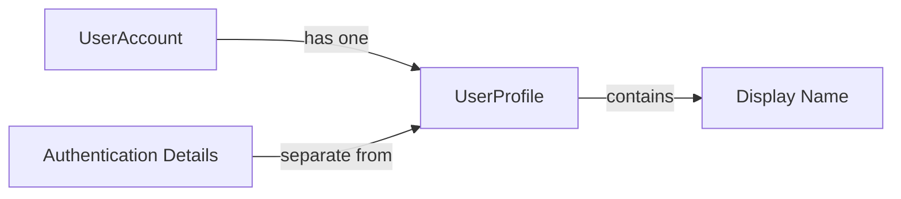

### Display Name

The display name is the only profile domain attribute defined for a UserProfile. It is the personal profile information that gives the account holder a readable label inside the application.

The display name supports user identification within the private profile context. It is part of how the person is recognized as an account holder, but it is not the same thing as account credentials and does not define how the user logs in.

A UserProfile is defined around this attribute and does not introduce any broader profile fields beyond the display name.

### Private Profile Meaning

In this application, a UserProfile has private profile meaning. It exists to represent the account holder’s personal identity information for their own use in the todo application, not as a public social profile.

The private profile meaning means the profile belongs to the same person who owns the account and is not intended to make that person visible to other users. This keeps the profile distinct from any shared or discoverable user presentation.

The private nature of the profile is part of the UserProfile concept itself and does not add extra profile features beyond the display name.

### Profile Relationship to Account

A UserProfile belongs to one UserAccount. This relationship means the profile is part of the account holder’s personal domain representation and is not an independent business object.

The profile exists as the personal profile information for the account and remains tied to that account for identification purposes. The UserProfile concept therefore depends on the account concept for its ownership and identity context.

This relationship does not change the fact that the profile is separate from authentication details.

### Profile Separation from Authentication

A UserProfile is separate from authentication details. The profile describes who the person is in the business sense through the display name, while authentication details describe how the person signs in to the application.

This separation means the UserProfile concept does not serve as login information and does not replace account credentials. The profile identity is used for personal identification inside the private todo application, not for access control or sign-in behavior.

The separation between profile identity and authentication is a defining characteristic of the UserProfile concept.

## Todo Concept

A Todo represents a single task item owned by one user. It stores the task title, which is required and serves as the main label for the item. It may also include a description for additional detail. A Todo can optionally carry a start date and a due date to express scheduling expectations. Each todo has a completion status that shows whether it is complete or incomplete. Newly created todos begin in the incomplete state, so the todo always has a defined status. The todo also carries its creation date as part of its business meaning. In the private app, a todo belongs only to the account that created it and is not shared with others. The concept covers both the visible task content and the status needed to organize personal work. It is the central business item that users manage in their own todo lists.

### Todo Concept

A todo is a single task item that represents one piece of work owned by one user. It is the main business item in the application and serves as the thing a user organizes, tracks, and completes in a private personal list.

The title is a required part of a todo. It is the primary label used to identify the task item in lists and detail views. A todo may also include a description for additional detail, but the description is optional and may be left empty.

A todo may also include a start date and a due date. These dates are optional and are used to describe when the task is planned to begin and when it is expected to be completed. A todo can exist without either date.

Every todo has a completion status. The completion status shows whether the todo is complete or incomplete. Newly created todos are incomplete by default, so every todo begins in a defined state.

Every todo has a creation date. The creation date identifies when the todo was first added and is part of its business meaning as a personal record.

A todo is private and belongs only to the user who owns it. It is not shared with other users and is visible only within that user’s own todo list. This private ownership is part of the todo’s meaning in the application.

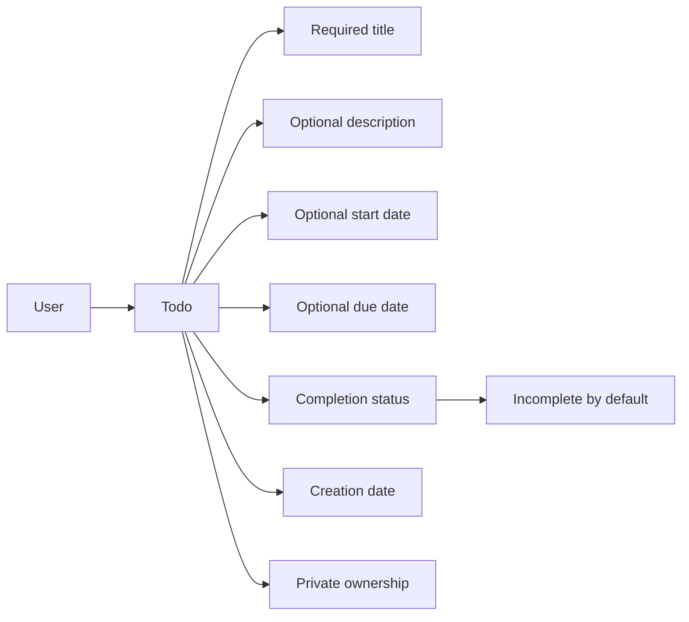

## TodoHistory Concept

A TodoHistory entry represents a recorded snapshot of a change made to a todo. It preserves when the edit happened so the sequence of changes can be understood over time. Each history entry may record the updated title if the title changed. It may also record the updated description if the description changed. The same idea applies to the start date and due date when those values are changed. A todo can have multiple history entries, reflecting repeated edits to the same item. The history belongs to the todo that was changed and helps explain how the item evolved. In the business domain, this concept captures the audit-like record of user edits without exposing implementation details. The history is part of the todo's record and is separate from the current todo state. It supports understanding the latest state alongside what was changed previously.

### TodoHistory Concept

A TodoHistory entry is the business record of a change made to a todo. It represents one history entry in the todo change timeline and shows how the todo evolved over time.

A TodoHistory entry includes the edit timestamp, which identifies when the change record was made. This timestamp is part of the edit history domain meaning because it establishes the order in which changes occurred.

A TodoHistory entry may record the title changed to value when the title was changed. It may also record the description changed to value when the description was changed. The same applies to the start date changed to value and the due date changed to value when those details were changed.

A TodoHistory entry belongs to one todo and helps preserve the todo change timeline as a sequence of recorded edits. Multiple TodoHistory entries can exist for the same todo, with each entry representing a separate change record. Together, these entries show the history of edits without replacing the current todo state.

The todohistory concept is the business notion of preserving edit history for a todo. It exists so the application can show what changed, when it changed, and how the todo developed across repeated edits.

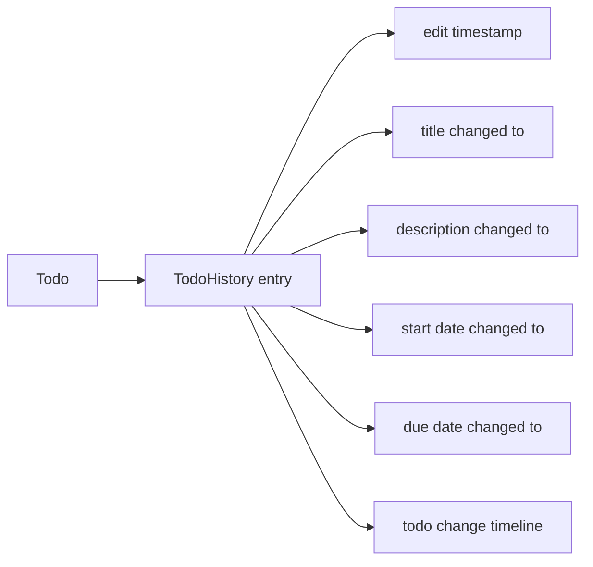

# Domain Relationships

Describe how concepts relate to each other from a business perspective.

## Conceptual Relationships

Describe how concepts relate to each other in business terms.

### UserAccount and UserProfile Relationship

A UserAccount and a UserProfile are in a one-to-one relationship.
A UserProfile belongs to one UserAccount, and each UserAccount has one UserProfile.
The UserProfile represents the personal display name information for the account, while the UserAccount represents the private account identity for the user.
This relationship is private and is not visible to other users.

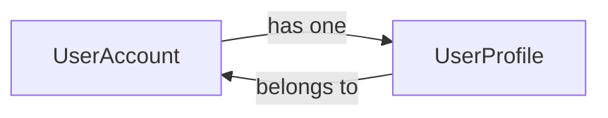

### UserAccount and Todo Ownership

A UserAccount owns many Todo items.
Each Todo belongs to one UserAccount.
This ownership relationship means every Todo is associated with exactly one account and is part of that account's private todo collection.
Users can only see Todo items that belong to their own UserAccount.

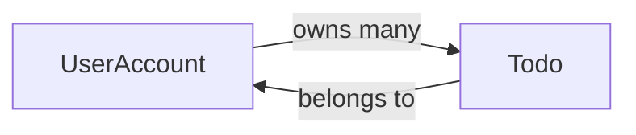

### Todo and TodoHistory Association

A Todo has many TodoHistory entries.
Each TodoHistory belongs to one Todo.
The association exists so that every edit record is kept with the Todo it describes.
TodoHistory is a dependent business concept and does not exist independently of its Todo.

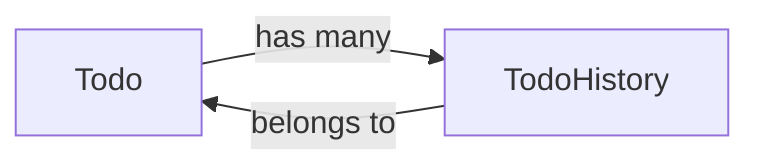

### Private Ownership Boundaries

All domain ownership in the application is private to a single user account.
A UserAccount is the ownership boundary for both the UserProfile and the Todo items it contains.
A TodoHistory entry is also private because it belongs to a Todo that is owned by one UserAccount.
There is no shared ownership between user accounts, and no domain concept is jointly owned by multiple users.

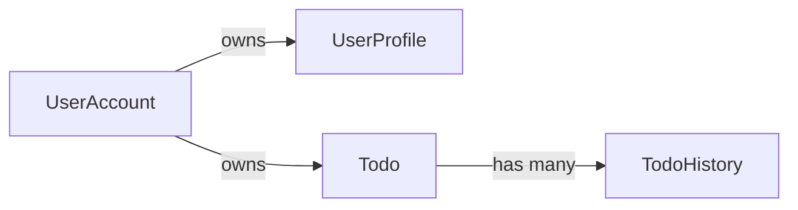

## Lifecycle and Retention

Describe concept lifecycle states and transitions only. Detailed retention/recovery policies belong in 05-non-functional. Operation details belong in 03-functional-requirements.

### Lifecycle

The todo lifecycle consists of the business states a todo can pass through during its lifetime in the application.

A todo begins in an active state when it is created and is incomplete by default. From that point, its completion status can move between incomplete and complete as the user changes it.

A todo can later move out of the normal active listing when it is deleted by the user. Deletion changes the todo into a deleted state rather than removing it immediately from the application’s stored history of that todo.

A deleted todo can return to the active state if it is restored from trash. If it is permanently deleted from trash, its lifecycle ends and the todo is no longer available in the application.

Todo history entries have their own lifecycle tied to the todo. A history entry is created when a todo is edited, remains associated with that todo while the todo exists, and is removed when the todo is permanently deleted.

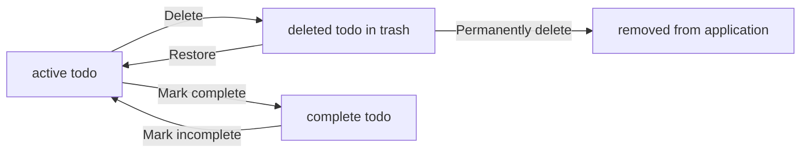

### Retention

Retention describes how long a deleted todo and its edit history remain available in the application.

A deleted todo is retained in trash instead of being removed immediately. While it is retained there, it remains available for restoration or permanent deletion.

A todo’s edit history is retained as part of the todo for as long as the todo exists in the application. If the todo is permanently deleted, its history is no longer retained.

When a user deletes their account, all of that user’s todos are permanently deleted, including todos that are in trash. In that case, retained deleted todos and their histories do not remain available.

Retention applies only to the user’s own data. A user’s todo data, including deleted items in trash, remains private to that user and is not available to other users.

### Archival

In this application, archival refers to the deleted state of a todo after it has been removed from the normal todo list.

A deleted todo is archived in the trash list rather than being erased immediately. This archived state allows the user to review deleted todos separately from active todos.

Archived todos remain associated with the user who owns them and can be restored or permanently deleted from trash.

Archival does not change the todo’s ownership, and it does not make the todo visible to other users.

### Deletion Policy

The deletion policy defines how todo removal behaves in the application.

When a user deletes a todo, the todo is moved out of the normal todo list and kept in trash instead of being removed permanently.

When a user permanently deletes a todo from trash, the todo is removed completely from the application and its edit history is also removed.

When a user deletes their account, all of their todos are permanently deleted, including todos that are currently in trash.

Deletion applies only to the user’s own todos. A user cannot delete another user’s todos because todos are private to their owner.

### Recovery

Recovery describes how a deleted todo can return to the normal todo list.

A deleted todo can be restored from trash and return to the active todo list.

After recovery, the todo is treated as one of the user’s normal todos again and is no longer listed as deleted.

Recovery is available only for todos that are still in trash. Once a todo has been permanently deleted, it cannot be recovered because it no longer exists in the application.

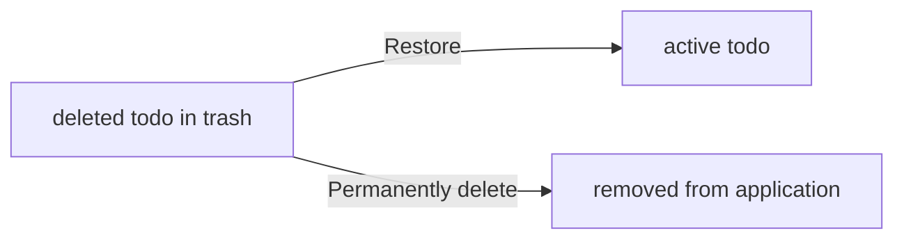

# Business Categories and State Flows

Business category classifications and state flow definitions.

## Business Category Definitions

Define all business category classifications with their allowed values and descriptions.

### Business Category

A business category is a top-level way to group the core concepts of the todo app for shared understanding.

The business category classification for this file is limited to the domain concepts that the user directly interacts with or that describe the user-owned data in the app.

The allowed values for the business category classification are:
- User account
- User profile
- Todo
- Todo history

Each allowed value represents one distinct business concept in the app. A concept must be treated as its own category and must not be merged with another category.

The business category classification is used to keep the concepts separate and clear, especially where the same user owns more than one kind of business object.

### Classification of Core Concepts

The core concepts are classified by purpose rather than by technical structure.

- User account is the category for account ownership and authentication credentials.
- User profile is the category for display name information.
- Todo is the category for task items created and managed by a user.
- Todo history is the category for recorded changes made to a todo.

Each concept belongs to exactly one primary classification. The classification explains what the concept represents in the business meaning of the app and helps distinguish it from the other concepts.

The allowed values for this classification are fixed to the four core concepts above. No additional business concept is part of this file scope.

### Status Type

Status type is the business classification used to describe whether a todo is finished or not finished.

The allowed values for status type are:
- Complete
- Incomplete

A todo starts in the incomplete status type when it is created.

A todo can move between the two allowed values as the user marks it complete or marks it incomplete.

Status type applies only to a todo and does not describe the user account, user profile, or todo history.

## State Transitions

Define valid state transition paths for stateful concepts.

### Todo Completion State Transitions

A todo has a completion status that supports two states: complete and incomplete.

A newly created todo starts in the incomplete state.

A user can change a todo from incomplete to complete.

A user can change a todo from complete to incomplete.

The completion workflow is a simple toggle between these two states, and no other completion states are used.

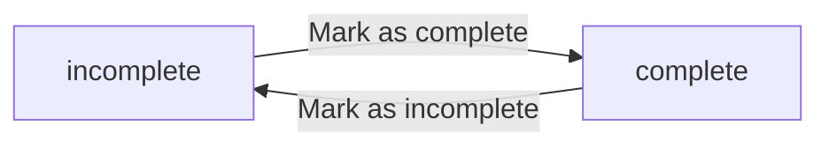

### Todo Deletion and Recovery State Transitions

A todo can move from active status to deleted status when the user deletes it.

When a todo is deleted, it is removed from the normal todo list but is not permanently removed.

A deleted todo can move from deleted status back to active status when the user restores it from the trash.

A deleted todo can also move from deleted status to permanently deleted status when the user deletes it from the trash.

A permanently deleted todo no longer exists in the application, and its edit history is also deleted.

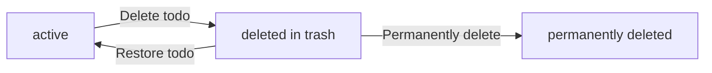

### Account Deletion State Transition Effects

A user account can move to a deleted account state when the user deletes their account.

When the account is deleted, all of the user's todos are permanently deleted.

This includes todos that are currently active and todos that are already in the trash.

After account deletion, none of the user's todos remain available for viewing, restoration, or further editing.

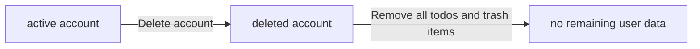