**todoApp — What operations users can perform, use cases, business workflows**

What operations users can perform, use cases, business workflows

# Core Business Operations

What the system must do for each business concept.

## UserAccount Operations

Users can create an account by signing up with an email and password. Once registered, a user can log in using the same email and password to access their private todo space. Users can change their password while keeping the same account identity. A user can delete their account at any time. When an account is deleted, all todos owned by that user are permanently removed, including items that were already in trash. Other users do not gain any access to the deleted account or its data. Account operations are limited to the signed-in owner, and no one can manage another person's account. The application treats account ownership as the basis for all todo access and privacy.

### Account Signup and Login

Users can create a new account by signing up with an email address and password. After the account is created, the same email address and password can be used to log in and access the user's private todo space.

When a user signs up successfully, the system creates a new user account and establishes that account as the owner of the user's future todo data. When a user logs in successfully, the system grants access only to that user's own account space.

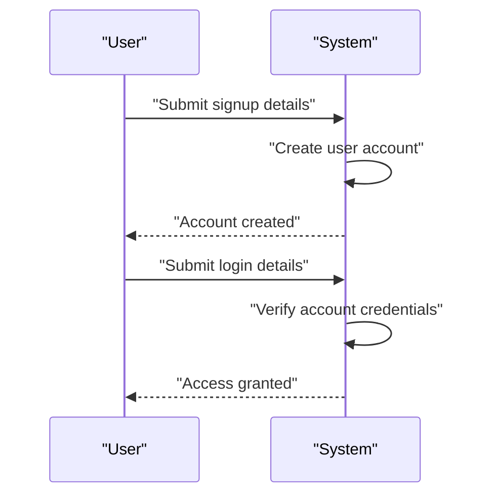

### Password Change

A signed-in user can change the password for their own account while keeping the same account identity. The password change operation applies only to the account the user is currently authorized to manage.

The system treats a successful password change as an account update rather than a new account creation. After the password is changed, future access to the account uses the updated password.

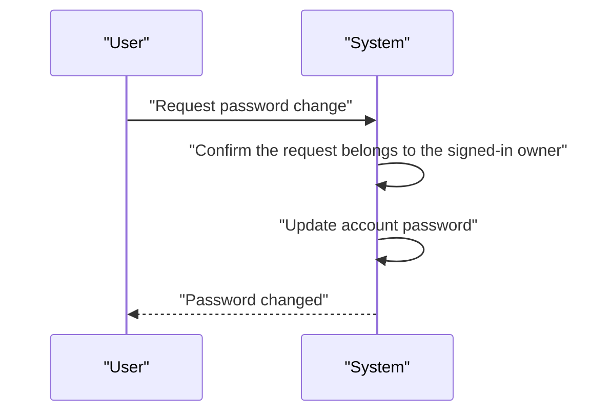

### Account Deletion

A signed-in user can delete their own account at any time. Account deletion is permanent for the account itself and removes the user's access to that account.

When an account is deleted, all todos owned by that user are permanently deleted. This includes todos that are currently in trash.

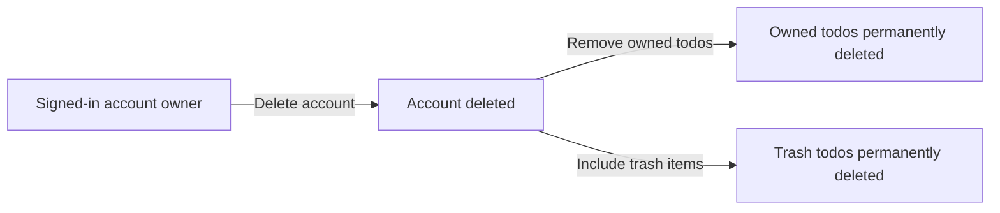

### Private Account Ownership and Access Control

The application is private, so each account owner can access only their own account space. A signed-in owner can manage only the account that belongs to them.

No user can view, access, or manage another user's account. Authentication-based access is required for account operations, and access is limited to the signed-in owner of the account.

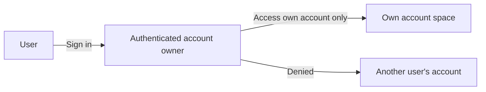

### User Account Lifecycle

A user account follows a simple lifecycle: it is created through signup, used through login and account management, updated through password change, and removed through account deletion.

The account remains owned by the same user throughout its active life. Deleting the account ends that lifecycle and permanently removes the account owner's todo data as part of the deletion process.

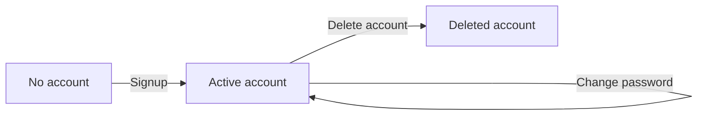

## UserProfile Operations

Each user has a private profile that includes a display name. A newly created account has an associated profile that the owner can use during normal app usage. Users can edit their own display name whenever they want. Profile information is not public, and other users cannot view it. There is no user directory or profile browsing experience because the app is private. Profile actions are limited to the account owner and do not affect todo ownership or todo content. If a user account is deleted, the associated profile is no longer available as part of that account. Profile management is intentionally simple and focused on identifying the signed-in user within the private app.

### Display Name Profile

A user profile contains the display name associated with the account owner.
The display name is the only profile detail described in this section and is used to identify the signed-in user within the private todo app.
A newly created user account includes an associated profile by default.
The profile exists as part of the account and is not a separate public identity.
When the account exists, the profile remains available to the account owner for normal use of the app.
The profile information does not change todo ownership or todo content.

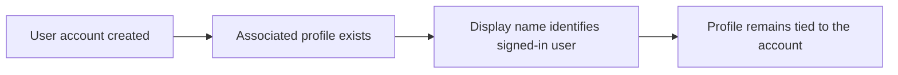

### Edit Display Name

The account owner can edit the display name in their own profile.
The edited display name becomes the current display name for that profile.
Profile editing affects only the profile information and does not affect the user's todos.
A profile update is limited to the account owner.
If the account is deleted, the profile is no longer available because it belongs to that account.

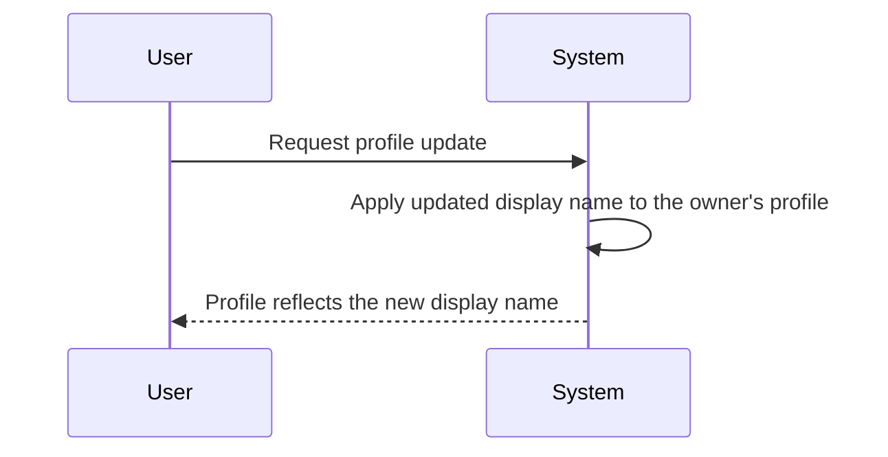

### Private Profile Visibility

The app treats profile information as private.
A user can view their own profile information during normal app use.
A user cannot view another user's profile information.
There is no public profile listing or directory.
There is no profile browsing experience for other users because the app is private.
Profile visibility rules apply consistently to all users.

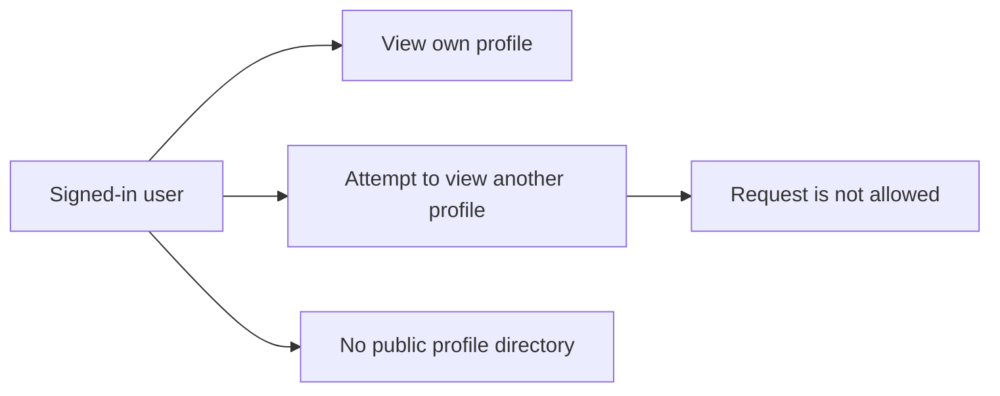

### Owner-Only Profile Access

Only the account owner can access and change the associated profile.
Profile access is restricted to the account that owns the profile.
Other users do not have access to that profile information.
This access rule applies even though the application supports multiple users.
Profile actions do not grant access to the owner's todos or to another user's todos.

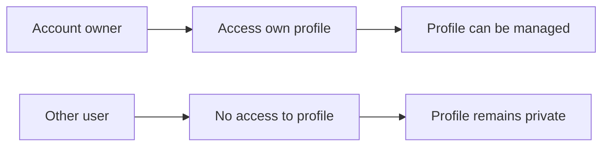

### No Public Profile Browsing

The system does not provide a way to browse user profiles publicly.
The system does not provide a way to search for profiles as a public directory.
Users cannot access other users' profiles through browsing or discovery.
This restriction supports the private todo app identity.
Profile information is intentionally limited to the account owner and is not presented as a shared community feature.

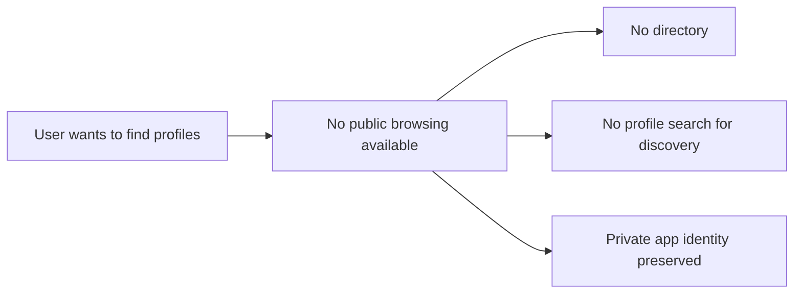

## Todo Operations

Users can create todos with a required title and optional description, start date, and due date. A newly created todo starts as incomplete. Users can view a paginated list of only their own todos, and each item in the list shows the title, completion status, start date when present, due date when present, and creation date. Users can also open a single todo to see all of its details, including the full description. Users can mark a todo complete or mark it incomplete again, and this action works as a simple toggle between the two states. Users can edit their own todos by changing the title, description, start date, and due date. Users can delete their own todos without permanently removing them, which moves the todo out of the normal list. Deleted todos remain private and are only available to the owner through trash. Todo visibility is restricted so that users can never see another user's todos.

### Todo Creation

Users can create a todo for their own account.
The created todo includes a required title and may include an optional description, an optional start date, and an optional due date.
A newly created todo is incomplete by default.
The new todo is private to the creator and is added to that user's todo list.

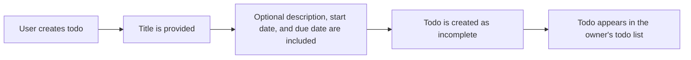

### Viewing Todo Lists

Users can view a paginated list of their own todos.
The list shows each todo's title, completion status, start date when one is set, due date when one is set, and creation date.
Only the user's own todos appear in this list.
Deleted todos do not appear in the normal todo list.

When multiple todos are available, the user can move through the list page by page.
The list can be filtered by completion status to show all todos, only complete todos, or only incomplete todos.
The list can also be sorted by creation date, start date, or due date using the order options defined for todo browsing.

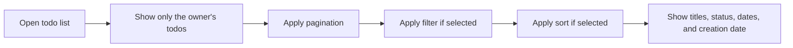

### Viewing Todo Details

Users can open one of their own todos to view its full details.
The detail view shows everything available for that todo, including the full description.
The detail view is available only for the owner's own todos.
If a todo is not part of the user's account, it cannot be viewed in detail.

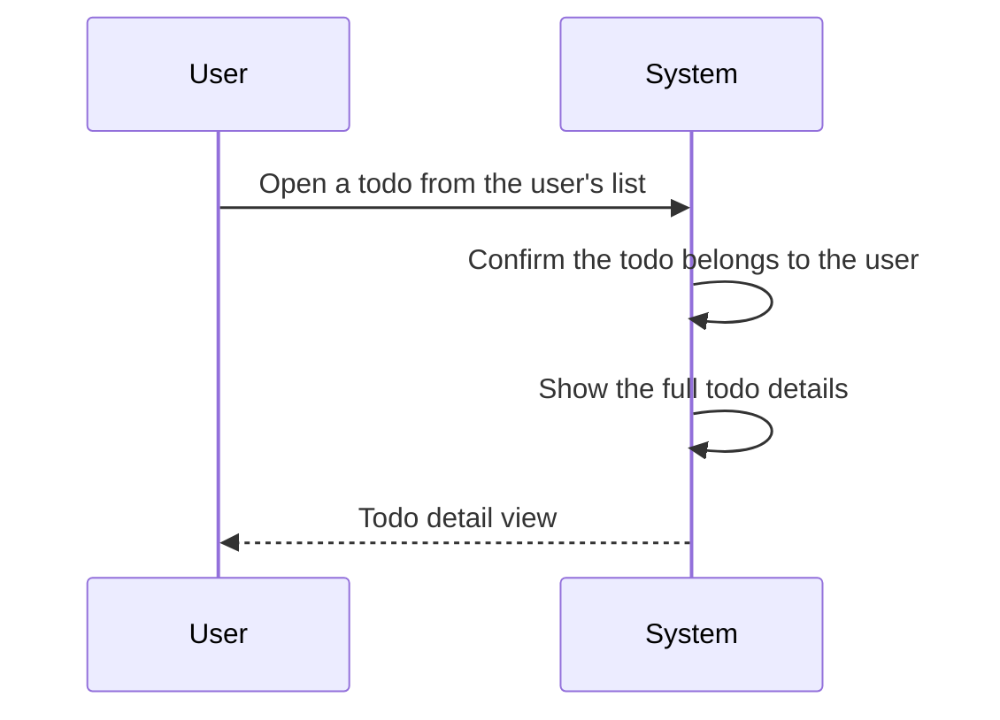

### Completing and Reopening Todos

Users can change a todo's completion status between complete and incomplete.
This is a simple toggle between the two states.
A todo that is marked complete can be marked incomplete again, and a todo that is marked incomplete can be marked complete again.
The change applies only to the user's own todo.

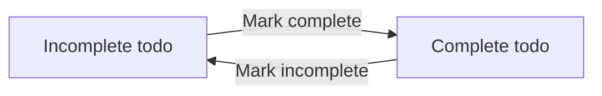

### Editing Todo Fields

Users can edit their own todos by changing the title, description, start date, and due date.
An edit may change one or more of these fields in a single action.
The todo remains the user's own todo after the edit.
Each edit is treated as a normal todo update and keeps the todo in the user's private list.

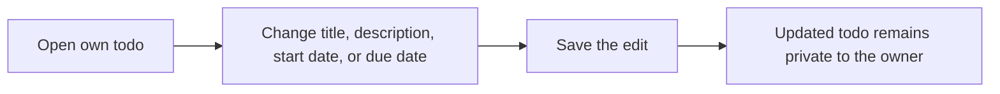

### Deleting Todos

Users can delete their own todos.
Deleting a todo does not remove it permanently right away.
Instead, the todo is moved out of the normal todo list and becomes available in the user's trash.
Deleted todos remain private and can be seen only by the owner.

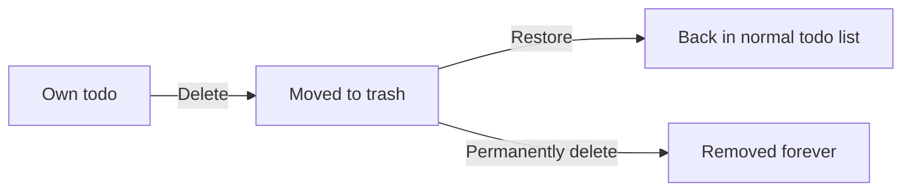

### Trash Visibility and Recovery

Users can view a paginated list of their deleted todos in trash.
The trash contains only the user's own deleted todos.
From trash, a user can restore a deleted todo so that it returns to the normal todo list.
From trash, a user can also permanently delete a todo.
When a todo is permanently deleted from trash, its edit history is also permanently deleted.

The trash is the only place where deleted todos can be accessed before they are permanently deleted.

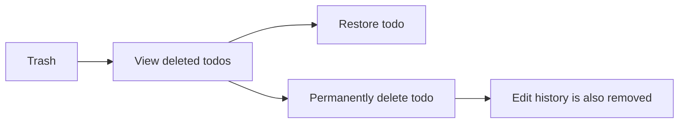

### Private Owned Todos

Todos are completely private to the user who owns them.
A user can only see, open, edit, delete, restore, and permanently delete their own todos.
There is no way to view or access another user's todos.
Shared access to todos is not supported.

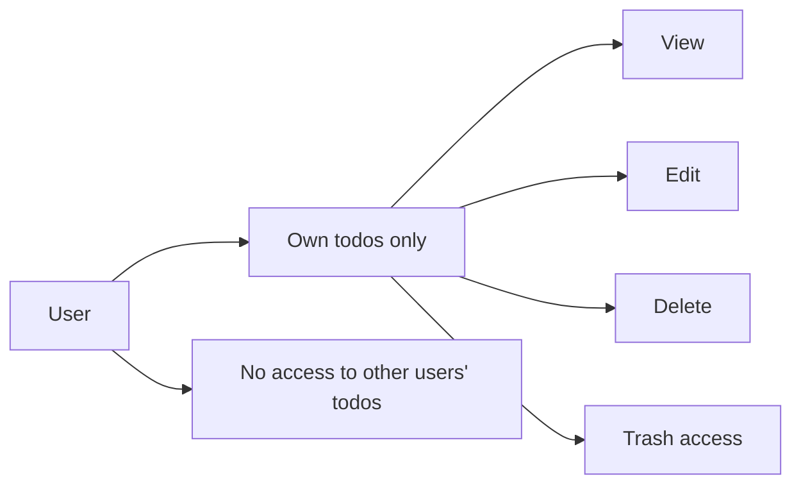

## TodoHistory Operations

Every time a todo is edited, a history entry is created. The history records when the edit happened and which values were changed. Users can review the full edit history for any of their own todos. History entries are shown from the most recent change to the oldest change. The history focuses on changes to the title, description, start date, and due date when those values are actually updated. If a todo is permanently deleted from trash, its edit history is deleted as well. History is private and follows the same ownership rules as the todo itself. Users cannot view history for other users' todos because they cannot access those todos in the first place.

### Edit History Entry

Every edit to a todo creates one history entry for that todo.
The history entry represents the fact that the todo was changed and is associated with the owned todo that was edited.
A history entry is created only when one or more todo values are actually updated.
If a todo is edited more than once, each edit produces its own separate history entry.

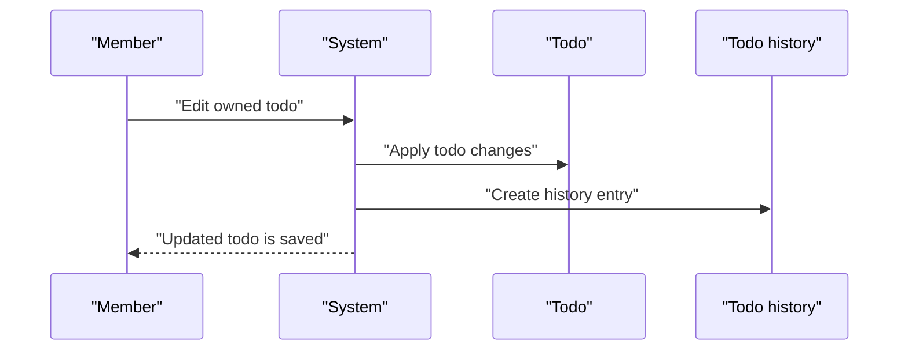

### Recorded Edit Details

Each history entry records when the edit was made.
Each history entry records the title change when the title was changed.
Each history entry records the description change when the description was changed.
Each history entry records the start date change when the start date was changed.
Each history entry records the due date change when the due date was changed.
If a particular value was not changed in that edit, the history entry does not record a new value for that field.
The recorded change information reflects the values resulting from that edit, not unrelated todo data.

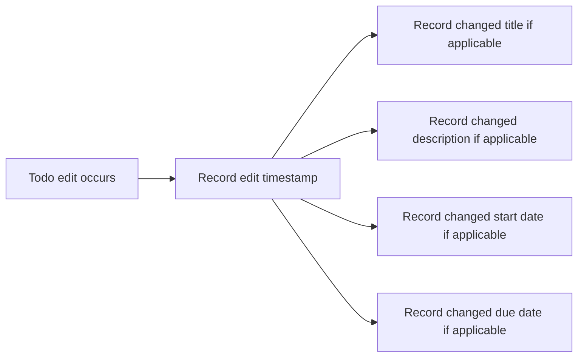

### Full Todo History View

Users can view the full edit history of any of their own todos.
The full history view includes every history entry created for that todo.
The full history view shows the recorded edit timestamp for each entry.
The full history view shows the recorded title, description, start date, and due date changes when those values were changed.
The full history view is ordered from the most recent history entry to the oldest history entry.
The full history view belongs to the same todo that the history was created for.

```mermaid
flowchart LR
    A["Owned todo"] --> B["Full history view"]
    B --> C["Most recent entry first"]
    C --> D["Older entries follow"]
```

### History Ownership and Privacy

Todo history is tied to the todo that owns it.
A user can access history only for todos they own.
A user cannot view history for another user's todo.
History remains private in the same way the todo itself is private.
If a todo is permanently deleted from trash, its edit history is permanently deleted as well.
After permanent deletion, the history is no longer available in any view.

```mermaid
flowchart LR
    A["Owned todo"] --> B["Private todo history"]
    B --> C["Visible to owner only"]
    B --> D["Permanent todo deletion"]
    D --> E["History permanently deleted"]
```

# Error Scenarios and Edge Cases

Business-level error scenarios, edge case coverage, and expected system behaviors for exceptional conditions.

## UserAccount Error Scenarios

Users must not be able to sign up or log in without providing both email and password. If the same email is used for account creation again, the system should treat it as a conflict and prevent a duplicate account. If a user enters an incorrect password during login, access should be denied and the account should remain unchanged. When a user changes their password, the system should require the current account to be active and owned by the person making the request. If the password change cannot be completed, the existing password must continue to work. When a user deletes their account, all of their todos, including todos in trash, must be permanently removed as part of the same business outcome. After account deletion, the user should no longer be able to access any of their private todo data. Because the app is private, no user should ever be able to access another user's account information through normal product behavior. If an account no longer exists, account-related operations should fail in a safe way without exposing private information.

### Signup with Email and Password

Users can create a new account by providing both an email address and a password.
If either the email address or the password is missing, the signup request is rejected.
If the same email address is used to create another account, the system rejects the request and does not create a duplicate account.
The account remains unchanged when signup is rejected for a missing value or duplicate email address.

```mermaid
sequenceDiagram
    participant U as "User"
    participant S as "System"
    U->>S: "Submit signup details"
    S->>S: "Check required values and existing email address"
    alt "Missing email or password"
        S-->>U: "Reject signup"
    else "Email already in use"
        S-->>U: "Reject signup"
    else "Valid new account"
        S-->>U: "Create account"
    end
```

### Login with Email and Password

Users can log in by providing both an email address and a password.
If either the email address or the password is missing, the login request is rejected.
If the password does not match the account associated with the email address, access is denied and the account remains unchanged.
If the account cannot be found for the provided email address, the login request fails without exposing private account information.

```mermaid
sequenceDiagram
    participant U as "User"
    participant S as "System"
    U->>S: "Submit login details"
    S->>S: "Check required values and account match"
    alt "Missing email or password"
        S-->>U: "Reject login"
    else "Incorrect password"
        S-->>U: "Deny access"
    else "Account not found"
        S-->>U: "Fail safely"
    else "Valid credentials"
        S-->>U: "Allow access"
    end
```

### Change Password for an Active Account

A user can change the password for an active account that belongs to that user.
If the account is not active, the password change request is rejected.
If the account does not exist, the password change request fails safely.
If the password change cannot be completed, the existing password continues to work.
The system does not change any other account details as part of a password change.

```mermaid
sequenceDiagram
    participant U as "User"
    participant S as "System"
    U->>S: "Request password change"
    S->>S: "Check account status and ownership"
    alt "Account inactive"
        S-->>U: "Reject password change"
    else "Account missing"
        S-->>U: "Fail safely"
    else "Eligible account"
        S-->>U: "Update password"
    end
```

### Account Deletion Removes All Todos

A user can delete their own account.
When an account is deleted, all todos owned by that account are permanently deleted as part of the same business outcome.
The deletion includes todos that are already in trash.
After account deletion, the user can no longer access any todo data that belonged to the deleted account.
If account deletion cannot be completed, the account and its owned todos remain unchanged.

```mermaid
flowchart LR
    A["Active account"] -->|"Delete account"| B["Remove account and owned todos"]
    B --> C["Todos permanently deleted"]
    B --> D["Trash items permanently deleted"]
```

### Private Account Access Denied

The account area is private.
A user can access only their own account information.
If a user attempts to access another user's account information, the request is denied.
No normal product behavior allows one user to view or access another user's account information.
If access is denied, the system does not reveal whether the other account exists.

```mermaid
flowchart LR
    A["User"] -->|"Request account access"| B["System"]
    B -->|"Own account"| C["Allow access"]
    B -->|"Another user's account"| D["Deny access"]
    D --> E["Do not reveal account details"]
```

### Missing Account Operation Handling

If an account-related operation targets an account that does not exist, the system fails safely.
The system does not expose private account information when the requested account is missing.
The system does not create a new account as a side effect of a missing-account operation.
The system leaves any unrelated account data unchanged when the targeted account is missing.

```mermaid
sequenceDiagram
    participant U as "User"
    participant S as "System"
    U->>S: "Request account operation"
    S->>S: "Check whether the account exists"
    alt "Account missing"
        S-->>U: "Fail safely"
    else "Account exists"
        S-->>U: "Continue operation"
    end
```

## UserProfile Error Scenarios

A user profile is private and should only be visible to the account owner. If a user tries to view another person's profile, access must be denied. When a user edits their display name, the system should apply the change only to their own profile. If the display name is missing or otherwise not acceptable for the profile update, the profile should remain unchanged. If the profile cannot be updated, the user should continue to see the previous display name. The system should not expose profile details for accounts that do not belong to the requesting user. Because the app does not support shared profiles, there is no business flow for browsing or searching other users' profile information. Profile actions should behave consistently even when performed close to account deletion, with the deleted account no longer available for profile access. Any failed profile action should be handled without affecting the user's todos or account ownership.

### Private Profile Visibility

A user profile remains private and visible only to its account owner.
If a user attempts to view a profile that belongs to another account, access is denied.
If a user attempts to browse profiles without owning the target profile, the system does not reveal any profile details.
If a profile belongs to the requesting user, the system allows the profile to be viewed.
If a profile does not belong to the requesting user, the system does not present it as available for viewing.

```mermaid
flowchart LR
    A["Request profile view"] --> B["Does profile belong to requesting user?"]
    B -->|"Yes"| C["Allow profile view"]
    B -->|"No"| D["Deny access"]
```

### Display Name Edit Rejection

If a user attempts to edit their display name and the submitted value is not acceptable for the profile update, the request is rejected.
If a display name edit is rejected, the user's profile remains unchanged.
If a display name edit fails, the previous display name continues to be shown on the user's own profile.
If the display name update cannot be applied, no partial profile update occurs.
If the user submits a valid display name edit, the change applies only to the user's own profile. (defined in UserProfile Operations)

```mermaid
sequenceDiagram
    participant U as User
    participant S as System
    U->>S: Submit display name edit
    S->>S: Validate display name change
    alt Acceptable
        S-->>U: Profile updated
    else Rejected
        S-->>U: Request rejected and profile unchanged
    end
```

### Owner-Only Profile Access Boundary

A user can view only the profile that belongs to their own account.
The system does not support shared profile browsing.
The system does not support searching for other users' profile information.
The system does not expose profile details for accounts that do not belong to the requesting user.
If a user tries to access a profile outside their ownership boundary, the access attempt is denied.
This ownership boundary applies to all profile access attempts, including direct attempts to view profile details.

```mermaid
flowchart LR
    A["Profile access attempt"] --> B["Is the profile owned by the requester?"]
    B -->|"Yes"| C["Allow access"]
    B -->|"No"| D["Deny access"]
```

### Profile Access After Account Deletion

If an account has been deleted, its profile is no longer available for access.
If a user attempts to view a profile after the owning account has been deleted, access is denied.
If a profile access attempt occurs after account deletion, the system does not expose the deleted account's display name.
A deleted account no longer participates in profile viewing behavior.
If profile access fails because the account was deleted, the profile remains unavailable.

```mermaid
flowchart LR
    A["Profile access attempt"] --> B["Has the owning account been deleted?"]
    B -->|"Yes"| C["Deny access"]
    B -->|"No"| D["Continue profile access check"]
```

### Display Name Ownership Rule

A user's display name belongs to that user's own profile.
If a user edits a display name, the change applies only to the profile owned by that user.
If a user attempts to change another user's display name, the request is rejected.
If a display name update cannot be applied to the owner's profile, the owner's profile remains unchanged.
The system does not allow one user to overwrite another user's display name.
The display name ownership rule applies even when a profile is being accessed through any profile-viewing flow. (defined in UserProfile Operations)

```mermaid
flowchart LR
    A["Display name change attempt"] --> B["Does the requester own the profile?"]
    B -->|"Yes"| C["Apply change to own profile"]
    B -->|"No"| D["Reject request"]
```

## Todo Error Scenarios

A todo cannot be created without a title, and an empty title should be rejected. Description, start date, and due date are optional, so users should be able to leave them empty when creating or editing a todo. Newly created todos must start in the incomplete state. A user should only be able to view, edit, complete, delete, restore, or permanently remove their own todos. If a user tries to act on someone else's todo, the request should be denied. Deleted todos must disappear from the normal todo list and appear only in trash. Restoring a deleted todo should move it back to the normal list, while permanently deleting it should remove it entirely. If a todo is already deleted, normal edit, completion, or list actions should not treat it as an active item. Filtering should only separate todos into all, complete, or incomplete views, and invalid status choices should not change the list. Sorting should respect the selected date order, and todos without a start date or due date should always appear at the end for those sorts. The todo list is paginated, so users should be able to work through their own items in pages without seeing another user's data.

### Required Todo Title and Optional Fields

A todo creation request shall be rejected when the title is missing or empty.
A user shall be able to create a todo with an optional description, and leaving the description empty shall be allowed.
A user shall be able to create a todo with an optional start date, and leaving the start date empty shall be allowed.
A user shall be able to create a todo with an optional due date, and leaving the due date empty shall be allowed.
When a user edits a todo, the user shall be able to leave the description empty, leave the start date empty, or leave the due date empty, subject to the same optional behavior used at creation.
When a todo is created successfully, the todo shall start in the incomplete state.
If a user submits a todo with an empty title during creation or editing, the system shall reject the request.
If a user submits a todo with only optional fields and no title, the system shall reject the request.

```mermaid
flowchart LR
    A["Create or edit todo"] --> B["Check title"]
    B -->|"Title missing or empty"| C["Reject request"]
    B -->|"Title present"| D["Accept optional fields"]
    D --> E["Set or keep todo as incomplete when newly created"]
```

### Own Todo Access Only and Private Todo Visibility

A user shall be able to view only their own todos.
A user shall be able to edit only their own todos.
A user shall be able to mark only their own todos as complete or incomplete.
A user shall be able to delete only their own todos.
A user shall be able to restore only their own deleted todos.
A user shall be able to permanently delete only their own deleted todos.
If a user tries to access another user's todo in any of these actions, the system shall deny the request.
The todo application shall keep todos private so that no user can view, access, or share another user's todos.
A todo that belongs to one user shall not appear as an accessible item for another user in any todo workflow.

```mermaid
flowchart LR
    A["User requests todo action"] --> B["Check ownership"]
    B -->|"Own todo"| C["Allow action"]
    B -->|"Another user's todo"| D["Deny request"]
```

### Delete Todo to Trash

A user shall be able to delete their own todo.
When a todo is deleted, it shall move to trash instead of being permanently removed.
When a todo is deleted, it shall no longer appear in the normal todo list.
If a todo is already in trash, the system shall not treat it as an active todo in normal todo workflows.
If a user tries to delete a todo that does not belong to them, the system shall deny the request.

```mermaid
flowchart LR
    A["Active todo"] -->|"Delete"| B["Trash"]
    B -->|"Hide from normal list"| C["Not shown in active todos"]
```

### Restore Deleted Todo

A user shall be able to restore a todo from trash.
When a deleted todo is restored, it shall return to the normal todo list.
When a deleted todo is restored, it shall stop appearing in trash.
If a user tries to restore a todo that does not belong to them, the system shall deny the request.
If a user tries to restore a todo that is not deleted, the system shall reject the request.

```mermaid
flowchart LR
    A["Todo in trash"] -->|"Restore"| B["Active todo list"]
    B -->|"Visible again"| C["Normal todo workflows"]
```

### Permanently Delete Todo

A user shall be able to permanently delete a todo from trash.
When a todo is permanently deleted, it shall be removed entirely and shall no longer be restorable.
When a todo is permanently deleted, its edit history shall also be deleted.
If a user tries to permanently delete a todo that does not belong to them, the system shall deny the request.
If a user tries to permanently delete a todo that is not in trash, the system shall reject the request.

```mermaid
flowchart LR
    A["Todo in trash"] -->|"Permanently delete"| B["Removed entirely"]
    B -->|"Delete edit history"| C["No history remains"]
```

### Completion Status Filter, Sorting, and Pagination

A user shall be able to filter their todo list by all todos, only complete todos, or only incomplete todos.
If a user selects an invalid completion status filter, the system shall not change the todo list based on that invalid choice.
A user shall be able to sort their todo list by creation date with newest first or oldest first.
A user shall be able to sort their todo list by start date with earliest first or latest first.
A user shall be able to sort their todo list by due date with earliest first or latest first.
When sorting by start date, todos without a start date shall appear at the end.
When sorting by due date, todos without a due date shall appear at the end.
The user’s todo list shall be paginated.
The trash list shall also be paginated.
Pagination shall let a user work through their own items in pages without exposing another user's data.

```mermaid
flowchart LR
    A["Todo list view"] --> B["Apply filter"]
    B --> C["Apply sort"]
    C --> D["Show one page of results"]
    D --> E["Next or previous page"]
```

## TodoHistory Error Scenarios

A history entry should only be created when a todo is actually edited. If an edit does not change any tracked detail, the system should not invent changes that were not made. Each history entry must reflect the time of the edit and only the fields that changed, such as title, description, start date, or due date. Users should only be able to view the edit history for their own todos. If a user tries to view history for someone else's todo, access must be denied. History entries should appear from most recent to oldest so users can review changes in reverse chronological order. If a todo is permanently deleted from trash, its edit history must also be removed. Once history is removed through permanent deletion, it should no longer be available for that todo. If a todo has no edits, the history view should simply be empty rather than showing invented records. History behavior should remain tied to the lifecycle of the user's own todo and should not reveal information about private items belonging to other users.

### Edit Creates History Entry

When a user edits one of their todos, the system shall create a new edit history entry for that todo.
When a todo edit is saved, the system shall record the edit as part of the todo's history.
If a todo is edited without changing any tracked detail, the system shall not create a history entry that invents changes.
If a todo has not been edited, the system shall not show any edit history entries for that todo.
If an edit is rejected, the system shall not create a history entry for that rejected edit.
```mermaid
flowchart LR
    A["Todo is edited"] --> B["System checks whether tracked details changed"]
    B -->|"Yes"| C["Create history entry"]
    B -->|"No"| D["Do not create history entry"]
    C --> E["History becomes available for viewing"]
```

### History Entry Content

Each edit history entry shall record the time the edit was made.
When the title changes, the history entry shall record the new title value.
When the description changes, the history entry shall record the new description value.
When the start date changes, the history entry shall record the new start date value.
When the due date changes, the history entry shall record the new due date value.
When only some tracked details change, the history entry shall include only the fields that changed.
If a tracked field does not change during an edit, the history entry shall not invent a value for that field.
If no tracked field changes during an edit, the history entry shall be empty of change details rather than containing fabricated updates.

### History Ordering

Users shall see a todo's edit history in reverse chronological order.
The most recent history entry shall appear before older entries.
Older history entries shall appear after newer entries.
The ordering of history entries shall remain consistent when a user reviews the full history of their todo.
```mermaid
flowchart LR
    A["Most recent edit"] --> B["Next most recent edit"] --> C["Older edit"]
```

### View Own Todo History Only

A user shall be able to view the edit history only for their own todos.
The system shall allow a user to open the history of a todo that belongs to them.
The system shall deny access when a user tries to view the history of another user's todo.
The system shall keep todo history within the privacy boundary of the owning user.
A history view request for a todo that does not belong to the requesting user shall not reveal edit details, timestamps, or changed fields.
If the requesting user is not the owner of the todo, the history shall remain inaccessible.

### Empty History View

If a todo has never been edited, the history view shall be empty.
An unedited todo shall not display invented history entries.
When a todo has no history entries, the system shall show an empty history view rather than an error state.
An empty history view shall mean that there are no recorded edits for that todo.
If a todo is edited later, the history view shall begin to show entries for that todo from that point onward.

### Permanent Delete Removes History

When a todo is permanently deleted from trash, the system shall remove its edit history at the same time.
After permanent deletion, the todo's history shall no longer be available for viewing.
If a todo is permanently deleted, its history shall not remain accessible through any history view.
The permanent deletion of a todo shall clear all edit history associated with that todo.
Once removed through permanent deletion, the history shall not be restored separately from the todo.
```mermaid
flowchart LR
    A["Todo in trash"] --> B["Permanent delete"]
    B --> C["Todo removed"]
    B --> D["Edit history removed"]
    D --> E["History no longer available"]
```

# End-to-End User Scenarios

Cross-domain user scenarios that span multiple concepts, describing complete user journeys.

## Cross-Domain User Scenarios

Define end-to-end user scenarios that span multiple concepts, describing complete user journeys from start to finish.

### First-Time Account Setup and Personal Todo Creation

A new user can complete an end-to-end journey from account creation to adding a first todo.

The scenario begins when the user signs up with email and password. After the account is created, the user can set a display name for the profile and begin using the private todo space associated with that account.

The user can then create a todo with a required title and optional description, start date, and due date. The newly created todo is incomplete by default.

```mermaid
sequenceDiagram
    participant U as "User"
    participant S as "System"
    U->>S: "Sign up with email and password"
    S-->>U: "Account created"
    U->>S: "Set display name"
    S-->>U: "Profile updated"
    U->>S: "Create todo"
    S-->>U: "Todo created as incomplete"
```

### Managing a Todo Through Viewing, Editing, and Completion Changes

A member can complete a multi-step user journey for a single todo by viewing it, updating it, and changing its completion state.

The user can open one of their own todos to review its full details, including the full description. The user can then edit the todo’s title, description, start date, and due date.

Every edit creates a history entry, so the user can later review how the todo changed over time. The user can also toggle the todo between complete and incomplete as part of the same ongoing workflow.

```mermaid
sequenceDiagram
    participant U as "User"
    participant S as "System"
    U->>S: "View a todo"
    S-->>U: "Show full todo details"
    U->>S: "Edit the todo"
    S-->>U: "Save changes and record history"
    U->>S: "Mark the todo complete or incomplete"
    S-->>U: "Update completion status"
    U->>S: "View edit history"
    S-->>U: "Show history entries"
```

### Temporary Deletion, Recovery, and Permanent Removal of Todos

A user can follow an end-to-end todo removal journey that includes soft deletion, trash browsing, restoration, and permanent deletion.

The user can delete one of their own todos, after which it no longer appears in the normal todo list. The deleted todo becomes available in trash, where the user can review deleted items using the paginated trash list.

From trash, the user can restore the todo so that it returns to the normal todo list. The user can also permanently delete the todo from trash, and that action also removes the todo’s edit history.

```mermaid
flowchart LR
    A["Active todo"] -->|"Delete"| B["Trash"]
    B -->|"Restore"| A
    B -->|"Permanently delete"| C["Removed with edit history deleted"]
```

### Working with Lists, Filters, and Sorting Across the Todo Journey

A user can navigate the todo list as a multi-step browsing journey that combines pagination, filtering, and sorting.

The user can view a paginated list of their own todos, and each item in the list shows the todo details required for browsing. The user can switch the list to show all todos, only complete todos, or only incomplete todos.

The user can also sort the list by creation date, start date, or due date in the supported directions. When a todo does not have a start date or due date, it appears at the end of the corresponding sorted list.

```mermaid
flowchart LR
    A["Todo list"] -->|"Apply filter"| B["All todos"]
    A -->|"Apply filter"| C["Complete todos"]
    A -->|"Apply filter"| D["Incomplete todos"]
    A -->|"Apply sort"| E["Creation date"]
    A -->|"Apply sort"| F["Start date"]
    A -->|"Apply sort"| G["Due date"]
```

### Private Personal Workspace for Own Account Only

A user’s todo journey is always limited to that user’s own private workspace.

The user can view only their own todos and their own profile. The user cannot browse, view, or access another user’s profile or todo items at any stage of the journey.

This privacy rule applies across the full end-to-end experience, including account use, todo browsing, editing, trash recovery, and history review.

```mermaid
flowchart LR
    A["Member account"] -->|"Access own profile"| B["Own private workspace"]
    A -->|"Access own todos"| C["Own todo list"]
    A -->|"Access own trash"| D["Own trash"]
    A -->|"Attempt other user access"| E["Denied"]
```