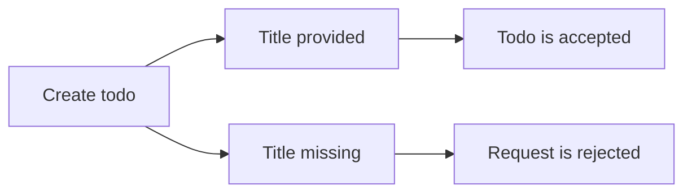
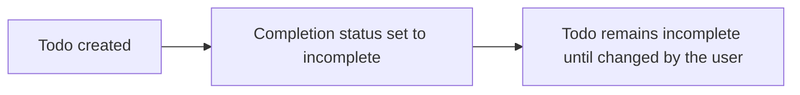
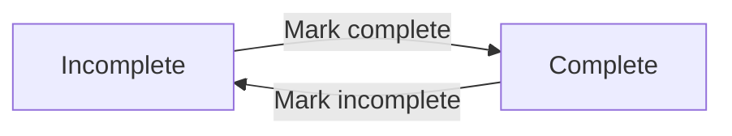
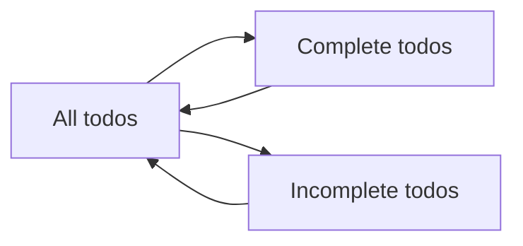
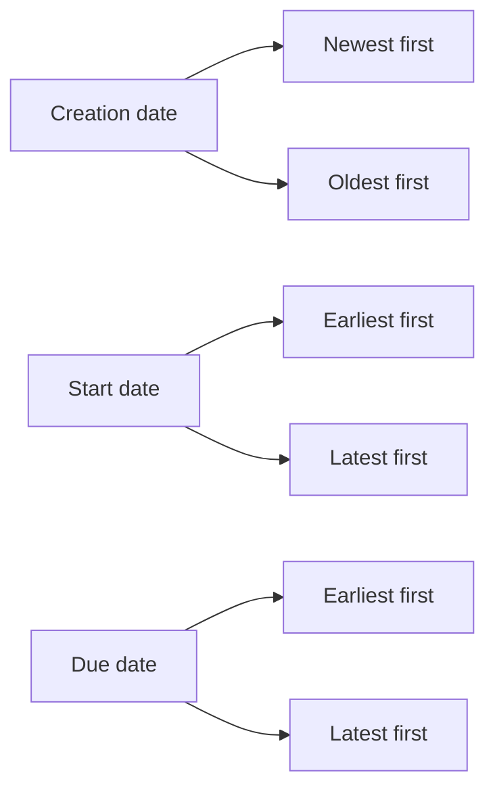
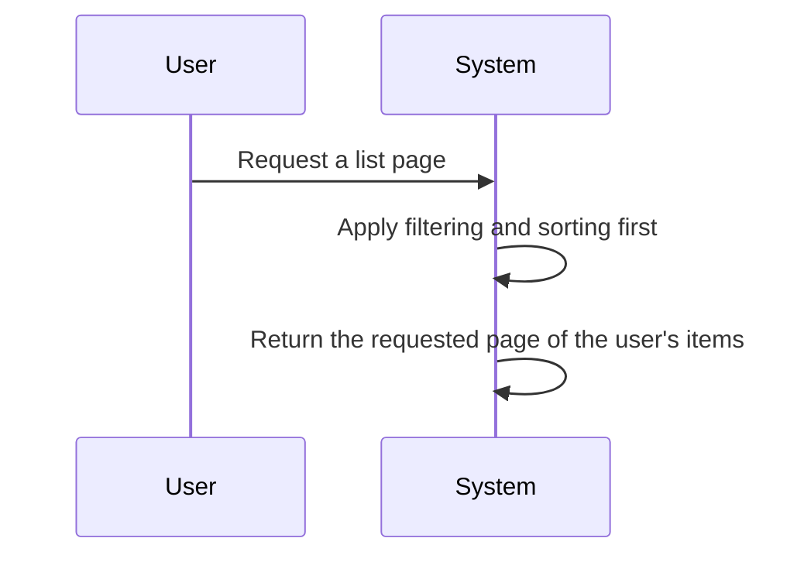
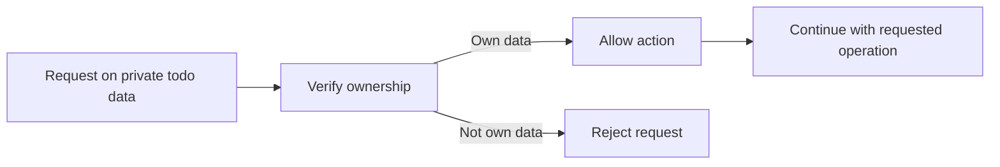

**todoApp — Business rules, validation constraints, data browsing expectations, error scenarios**

Business rules, validation constraints, data browsing expectations, error scenarios

# Domain Business Rules

Per-concept business rules, validation logic, and domain constraints.

## UserAccount Rules

A user account must be created with an email address and password. The email must be suitable for a login identity and must uniquely identify the account. The password is required and must meet whatever account security rule is applied by the application. A user account supports changing the password after creation, and the new password must replace the prior one as the active credential. Account deletion is allowed only for the account owner, and once deleted, the account's todos are permanently removed as part of the account removal rule. This means a deleted account cannot keep any todo content in the system, including items that were already moved to trash. The application treats the account as the owner of the user's private todo space, so account ownership remains a core constraint on account-related actions. Invalid or missing login credentials must prevent account use. If the email or password is not provided during account-related actions that require them, the operation should be rejected.

### User Account Sign-Up and Login

A user account is created with an email address and a password.
The email address is required at sign-up and is used as the account's login identity.
The password is required at sign-up and is used for password-based login.
The same email address cannot be used for more than one user account.
If the email address is missing, sign-up is rejected.
If the password is missing, sign-up is rejected.
If the email address is already in use, sign-up is rejected.
If login credentials are missing, account access is rejected.
If login credentials do not match an existing account, account access is rejected.

### Password Change Rule

A user account owner can change the password for their own account.
When the password is changed, the new password becomes the active login credential for the account.
After a password change, the prior password is no longer accepted for login.
If the account owner does not provide the required password change information, the change is rejected.

### Account Owner Constraint

Account-related actions that change or remove a user account are allowed only for the account owner.
A user cannot perform account deletion for another user's account.
A user cannot change another user's account password.
If an account-related action is attempted by a non-owner, the action is rejected.

### Account Deletion and Todo Removal

A user account owner can delete their own account.
When an account is deleted, all todos owned by that account are permanently removed.
This permanent removal includes todos that were previously moved to trash.
After account deletion, no todo content from that account remains available in the system.

### Credential Rejection Rules

If provided account credentials are invalid, the system rejects the request.
If the email address does not identify an existing account, the request is rejected.
If the password does not match the account's active password, the request is rejected.
If an account-related request requires credentials and they are not provided, the request is rejected.

## UserProfile Rules

Each user account has one profile that contains a display name. The display name is editable and represents how the user wants to be identified within the private todo app. A profile must always belong to the same account that owns it. The application should accept profile updates only for the current user’s own profile. Display name changes should be saved as profile updates without affecting the user's todos or account credentials. If a display name is omitted during profile editing, the system should not treat that as a valid replacement value. The profile information is intentionally limited, so only the supported profile detail should be exposed or maintained. Because the app is private, profile information must not be used to reveal other users. Profile data should remain simple and consistent, centered on the user-chosen display name.

### Display Name Profile Field

The user profile shall include a display name as its supported profile detail.
The display name shall represent how the user wants to be identified within the private todo app.
The display name shall belong to exactly one user profile and shall not be shared across multiple profiles as a single profile field.
The system shall expose only the display name as the profile detail for this unit.
The system shall keep the profile centered on the display name and shall not require any additional profile details for this unit.

### Editable User Display Name

The user shall be able to edit the display name associated with their own profile.
When the display name is edited, the system shall save the change as a profile update.
The system shall preserve the user’s todos and account credentials when the display name changes.
The system shall treat a display name change as a profile change only and shall not treat it as a change to account ownership or account identity.
The system shall keep the updated display name consistent for the same user profile after it is saved.

### Single Profile Per Account

Each user account shall have one and only one profile.
A user profile shall belong to the same account that owns it.
The system shall not allow a profile to be reassigned to a different account.
The system shall keep the one-profile-per-account relationship stable for the lifetime of the account.
If a profile is requested for an account, the system shall use that account’s single associated profile.

### Current User Profile Update

The system shall accept profile updates only for the current user’s own profile.
The system shall reject attempts to update a profile that does not belong to the current user.
The system shall not allow one user to edit another user’s display name through profile update behavior.
The system shall apply profile updates to the active user account only.
The system shall keep profile editing limited to the profile owned by the user who is performing the update.

### Profile Update Without Account Change

A profile update shall change only profile information and shall not change the user’s account.
Updating the display name shall not change the user’s account credentials.
Updating the display name shall not change account ownership.
Updating the display name shall not affect the user’s todos.
The system shall preserve the account as the same account before and after the profile update.

### Missing Display Name Rejection

If a display name is omitted during profile editing, the system shall reject the update as invalid.
If the user attempts to replace the display name with no value, the system shall not accept that replacement.
The system shall require a valid display name to complete a profile edit.
The system shall not treat an omitted display name as an instruction to clear the profile field.
The system shall leave the existing display name unchanged when the update is rejected for a missing display name.

### Private Profile Information

The user profile information shall remain private within the app.
The system shall not allow users to view other users’ profiles.
The system shall not use profile information to reveal other users.
The system shall keep profile information available only to the owning user account.
The system shall treat profile visibility as restricted to the profile owner in this private todo app.

### Limited Profile Details

The profile shall remain intentionally limited to the supported profile detail.
The system shall expose only the profile information that is explicitly supported for this unit.
The system shall not maintain extra profile details beyond the display name for this unit.
The system shall not require users to provide additional profile information to keep their profile usable.
The system shall keep profile data simple and consistent by avoiding unsupported profile details.

## Todo Rules

A todo must have a title, and the title is the only required content field for creation. Description, start date, and due date are optional and may be left empty. A newly created todo must begin as incomplete. Users may update the title, description, start date, and due date of their own todos, and those changes must remain within the supported todo fields. The todo supports two completion states only: complete and incomplete. The completion state is a simple toggle, so the todo should never move into any third state. Start date and due date are independent optional values, and a todo may have either one, both, or neither. When a user leaves optional fields empty, the todo should remain valid. Todo content must stay readable as business information, so it should be limited to the supported user-entered details and completion status.

### Required Todo Title

THE system SHALL require a title when a user creates a todo.
WHEN a todo is created without a title, THE system SHALL reject the request.
THE system SHALL treat the title as the only required content field for a todo.
THE system SHALL accept a created todo when the title is provided and the optional content fields are left empty.

### Optional Description Field

THE system SHALL allow a todo description to be left empty when a todo is created.
THE system SHALL allow a user to edit a todo description.
THE system SHALL treat the description as optional content, not as a required value for validity.
THE system SHALL keep a todo valid when the description is empty.
THE system SHALL preserve the description as user-entered business information when it is provided.

### Optional Start Date

THE system SHALL allow a todo start date to be left empty when a todo is created.
THE system SHALL allow a user to edit a todo start date.
THE system SHALL treat the start date as optional content, not as a required value for validity.
THE system SHALL keep a todo valid when the start date is empty.
THE system SHALL allow a todo to have a start date by itself, independently of a due date.

### Optional Due Date

THE system SHALL allow a todo due date to be left empty when a todo is created.
THE system SHALL allow a user to edit a todo due date.
THE system SHALL treat the due date as optional content, not as a required value for validity.
THE system SHALL keep a todo valid when the due date is empty.
THE system SHALL allow a todo to have a due date by itself, independently of a start date.

### New Todo Starts Incomplete

WHEN a todo is created, THE system SHALL set the completion status to incomplete by default.
THE system SHALL not create a new todo in a complete state.
THE system SHALL show the initial completion status of every newly created todo as incomplete.

### Complete and Incomplete Toggle

THE system SHALL support only two completion states for a todo: complete and incomplete.
WHEN a user marks a todo as complete, THE system SHALL set the completion status to complete.
WHEN a user marks a todo as incomplete, THE system SHALL set the completion status to incomplete.
THE system SHALL treat completion status as a simple toggle between the two supported states.
THE system SHALL not allow any third completion state.

### Editable Todo Details

THE system SHALL allow a user to edit the title of their todo.
THE system SHALL allow a user to edit the description of their todo.
THE system SHALL allow a user to edit the start date of their todo.
THE system SHALL allow a user to edit the due date of their todo.
THE system SHALL keep todo edits within the supported todo details only.
THE system SHALL record an edit as a change to one or more supported todo details.
THE system SHALL continue to treat a todo as valid after any supported detail is edited.

### Empty Optional Fields Allowed

THE system SHALL accept a todo when the description, start date, and due date are all empty.
THE system SHALL accept a todo when any one of the optional fields is empty.
THE system SHALL accept a todo when any combination of the optional fields is empty.
THE system SHALL treat empty optional fields as valid input rather than as missing required content.
THE system SHALL allow optional fields to remain empty after a todo is edited.

### Todo Completion Status

THE system SHALL store the completion status as part of the todo's business information.
THE system SHALL present completion status as either complete or incomplete.
THE system SHALL keep completion status consistent with the user's toggle action.
THE system SHALL use completion status when a todo is evaluated for its current state.
THE system SHALL not change completion status automatically for reasons other than the user's complete or incomplete toggle action.

## TodoHistory Rules

Every edit to a todo creates a history entry. A history entry records when the edit was made, so the edit time is a required part of the record. Each entry also captures the title change, description change, start date change, and due date change when those values were actually modified. If a particular field was not changed, the history entry should not claim a change for that field. History entries belong to the todo they describe and must reflect the order of edits over time. When users review history, the entries should be understandable as a timeline of how the todo evolved. The history should preserve the fact that edits happened even when the change was limited to one field. If a todo is permanently deleted from trash, its history is deleted as well, so history only remains while the todo itself remains available. The ordering rule for history is most recent entry first, then older entries after it.

### Edit Timestamp and Entry Creation

Every edit to a todo creates exactly one history entry.

Each history entry must record when the edit was made, and the edit timestamp is a required part of the entry.

A history entry exists to preserve the fact that an edit occurred, even when the edit changes only one field.

The edit timestamp is the basis for understanding the todo edit timeline, so each entry must be understandable as part of a chronological record of how the todo changed over time.

### Changed Fields Captured in History

A history entry records the new value for the title when the title was changed.

A history entry records the new value for the description when the description was changed.

A history entry records the new value for the start date when the start date was changed.

A history entry records the new value for the due date when the due date was changed.

A history entry only claims a change for a field when that field was actually modified in the edit.

### Unchanged Fields Are Not Recorded

If a field was not changed in an edit, the corresponding history entry must not record a change for that field.

A history entry must not imply that the title changed when only another field changed.

A history entry must not imply that the description changed when only another field changed.

A history entry must not imply that the start date changed when only another field changed.

A history entry must not imply that the due date changed when only another field changed.

### History Timeline and Ordering

The edit history for a todo must read as a timeline of how that todo evolved.

History entries are ordered from most recent to oldest.

When users review the history, the newest edit must appear first and earlier edits must follow after it.

The ordering must consistently reflect the sequence of edits over time so that the change history is understandable as a chronological record.

### History Removal on Permanent Todo Deletion

If a todo is permanently deleted from trash, its edit history is deleted as well.

After permanent deletion, the history must no longer remain available for that todo.

History is retained only while the todo itself remains available.

Permanent deletion removes both the todo and its recorded history together.

# Data Browsing Expectations

Business expectations for how users browse, find, and navigate through lists of data.

## List Browsing Expectations

Define business expectations for how users find, filter, and browse lists.

### Filtering Todo Lists

Users can filter their own todo list by completion status.

When no filter is selected, the list shows all of the user's todos.
When the complete filter is selected, the list shows only todos whose completion status is complete.
When the incomplete filter is selected, the list shows only todos whose completion status is incomplete.

The selected filter applies only to the user's own todos and does not expose todos that belong to other users.

If a filter selection does not match one of the supported completion-status options, the request is rejected.

### Sorting Todo Lists

Users can sort their own todo list by creation date, start date, or due date.

When sorting by creation date, the list can be ordered from newest first or oldest first.
When sorting by start date, the list can be ordered from earliest first or latest first.
When sorting by due date, the list can be ordered from earliest first or latest first.

Todos without a start date appear at the end of the list when sorting by start date.
Todos without a due date appear at the end of the list when sorting by due date.

Sorting applies only to the user's own todos and does not reveal todos that belong to other users.

If a sorting choice does not match one of the supported sort fields or sort directions, the request is rejected.

### Pagination of Todo and Trash Lists

The user's todo list and trash list are paginated.

Each paginated view shows only one page of results at a time.
Users can move through the available pages to browse all items in the list.

Pagination applies only to the user's own todos and trash items and does not expose items that belong to other users.

If a requested page does not exist, the request is rejected.

If a pagination request is made for a list that has no items, the result is an empty list.

# Error Conditions

Business error scenarios and how the system should respond.

## Error Scenarios

Describe error conditions and expected system responses in natural language.

### Error Scenarios

If a guest attempts to create, edit, delete, restore, or permanently delete a todo, the request shall be rejected because those actions are available only to a member.

If a user attempts to access a todo that does not belong to their own account, the request shall be rejected.

If a user attempts to view another user's profile, the request shall be rejected because profiles are private.

If a user attempts to view, edit, delete, restore, or permanently delete a todo that they do not own, the request shall be rejected.

If a user attempts to view the normal todo list and there are no matching todos after the current filter is applied, the system shall return an empty list rather than an error.

If a user attempts to view the trash and there are no deleted todos, the system shall return an empty trash list rather than an error.

If a user attempts to restore a todo that is not in the trash, the request shall be rejected.

If a user attempts to permanently delete a todo that is not in the trash, the request shall be rejected.

If a user attempts to edit a todo that has been permanently deleted, the request shall be rejected.

If a user attempts to view the edit history of a todo that has been permanently deleted, the request shall be rejected because permanently deleted todos no longer have history available.

If a user attempts to change a todo using values that are not allowed by the defined todo fields, the request shall be rejected.

If a user attempts to submit a todo without a title, the request shall be rejected.

If a user attempts to access another user's todos in any form, the request shall be rejected because all todos are private.

If a user attempts to delete their account, all of their todos, including todos in the trash, shall be permanently deleted as part of the account deletion outcome.

If an account is deleted, any later attempt to access that account's todos or history shall be rejected because the data no longer exists.

