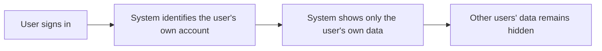
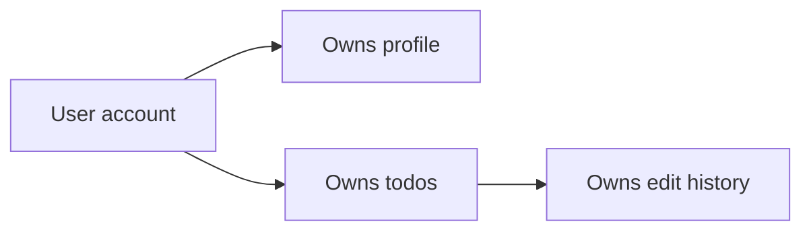
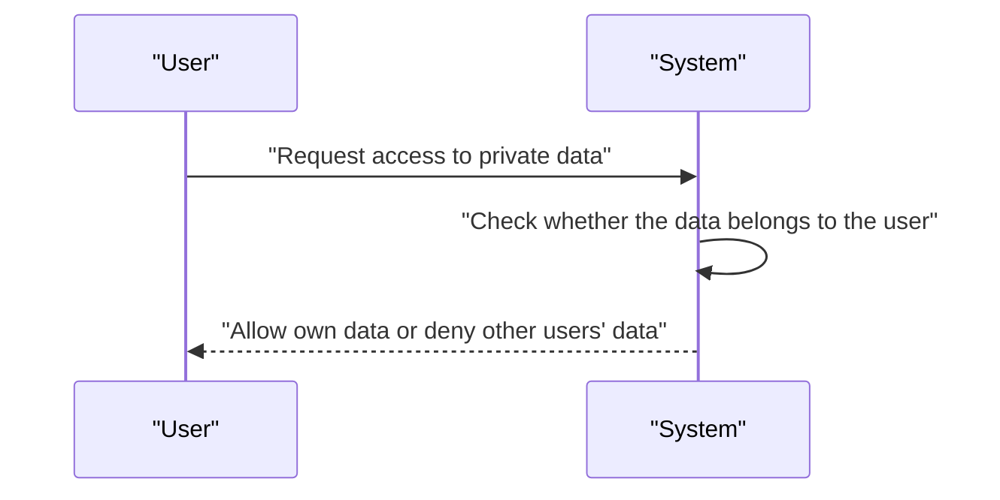
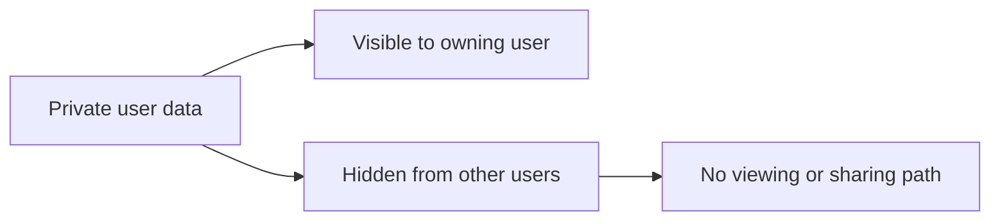

**todoApp — Data ownership, privacy, retention, and recovery policies**

Data ownership, privacy, retention, and recovery policies

# Data Policies

Data ownership, privacy, retention, and recovery policies from a business perspective.

## Data Ownership and Privacy

Define who owns what data, who can access it, and privacy boundaries between users.

### Data Isolation

The system shall keep each user's account, profile, todos, and todo history isolated from other users.
The system shall ensure that a user can access only the data that belongs to that user's own account.
The system shall prevent a user from viewing another user's todos in any todo list, todo detail view, or edit history view.
The system shall prevent a user from viewing another user's profile.
The system shall treat private user data as separate by ownership so that one user's actions do not expose another user's data.

### Ownership

The system shall treat each account as the owner of that account's profile data.
The system shall treat each todo as owned by the user account that created it.
The system shall treat each todo history entry as belonging to the todo it was created from.
The system shall keep ownership attached to the data when a todo is edited, completed, marked incomplete, deleted, or restored.
The system shall not allow ownership of a todo to be transferred to another user.
The system shall not allow one user to act on another user's owned data.

### Access Control

A guest shall not be able to view user-specific data.
A member shall be able to access only the member's own profile and own todos.
A member shall be able to view, edit, complete, mark incomplete, delete, restore, and permanently delete only the member's own todos.
A member shall be able to view the edit history of only the member's own todos.
If a user attempts to access another user's profile, todo, trash item, or edit history, the system shall deny access.
If a user attempts to access a todo that does not belong to that user, the system shall treat the data as inaccessible.

### Privacy

The system shall keep all todos private to their owning user.
The system shall not provide any way to view, access, or share another user's todos.
The system shall not provide any way to view another user's profile.
The system shall keep the visibility of deleted todos limited to the owning user.
The system shall keep the visibility of todo edit history limited to the owning user.
The system shall maintain privacy boundaries consistently across normal lists, trash, single-todo views, and history views.

## Data Retention and Recovery

Define what happens to deleted data, how long it is retained, and how users can recover it.

### Soft-Delete Policy

Deleted todos are retained in a recoverable state rather than being removed immediately. When a user deletes a todo, it must leave the normal todo list and be treated as deleted while still remaining available in the trash. The deleted todo must keep its user-visible identity and remain associated with its owner until it is either restored or permanently deleted. Soft-deleted todos are private to the owning user and are only available within that user's trash view.

### Retention in Trash

Deleted todos remain in trash until the user chooses to restore them or permanently delete them. The system must preserve deleted todos for recovery during this trash-retention period. Trash retention applies to the deleted todo and its edit history as separate retained data: the todo remains recoverable in trash, while the edit history remains available only until the todo is permanently deleted. This retention policy ensures that a deleted todo is not lost at the moment of deletion.

### Recovery from Trash

A user can recover a deleted todo by restoring it from trash. Restored todos return to the user's normal todo list and no longer appear as deleted. Recovery applies only to todos that are currently in trash. If a todo has already been permanently deleted, it is no longer eligible for recovery. Restoring a todo does not remove or alter the todo's prior edit history.

### Permanent Deletion

A user can permanently delete a todo from trash. Permanent deletion removes the todo from trash and makes it unavailable for restoration. When a todo is permanently deleted, its edit history is also deleted. Permanent deletion is final and applies only to deleted todos that are currently in trash. After permanent deletion, neither the todo nor its history is retained for later recovery.