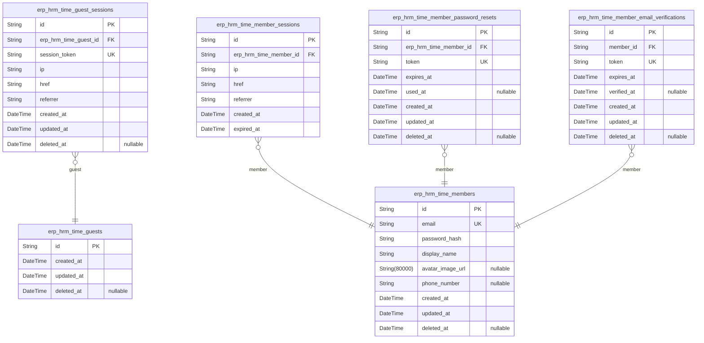
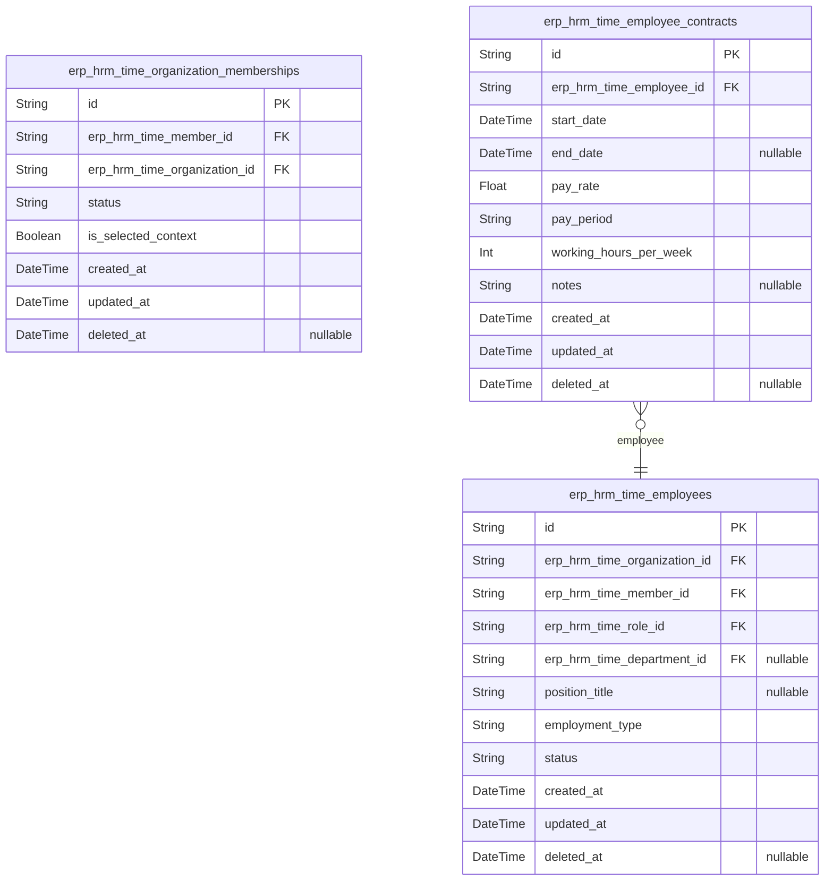
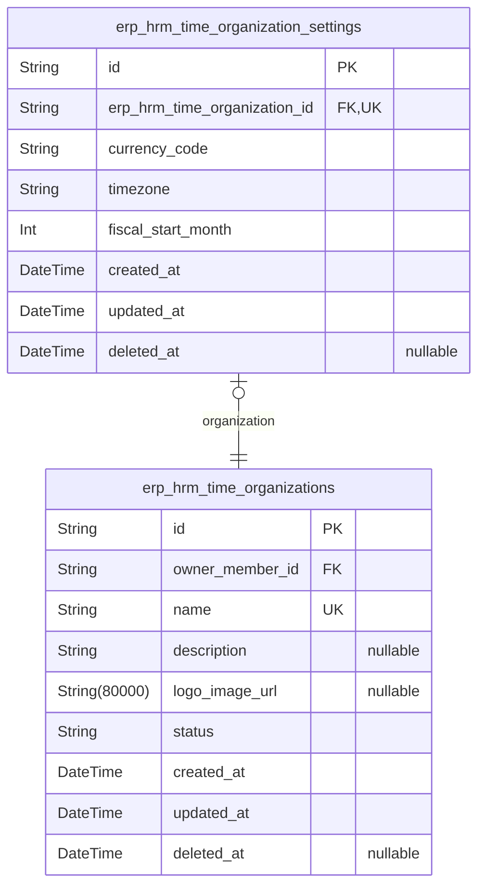
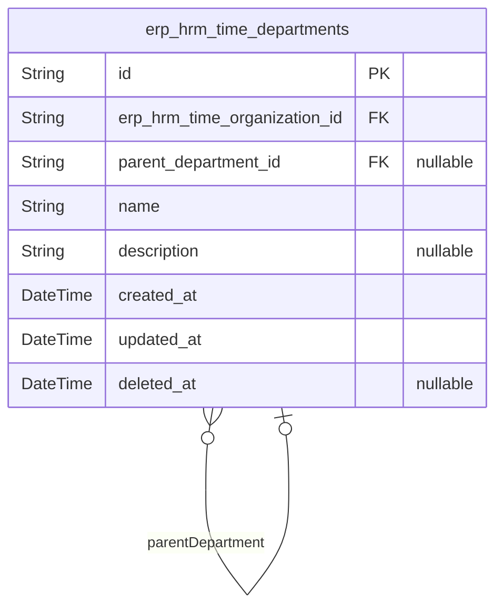
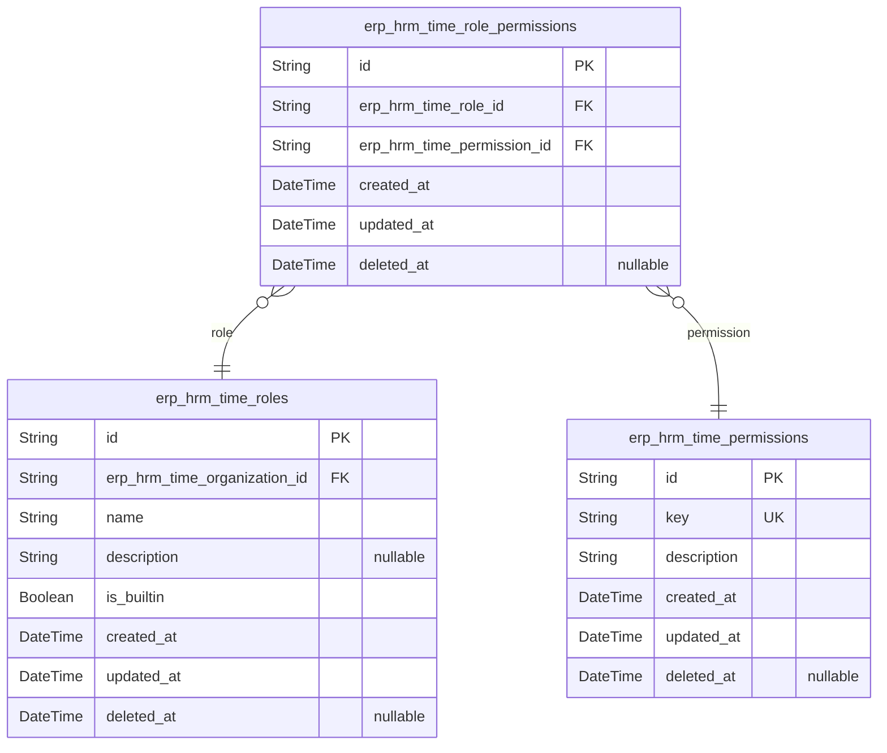
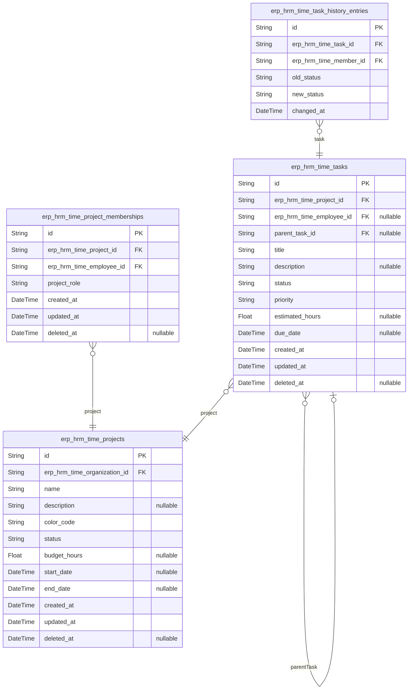
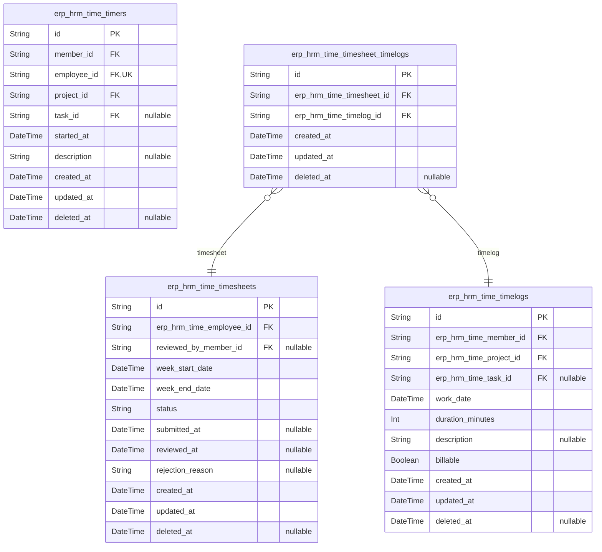
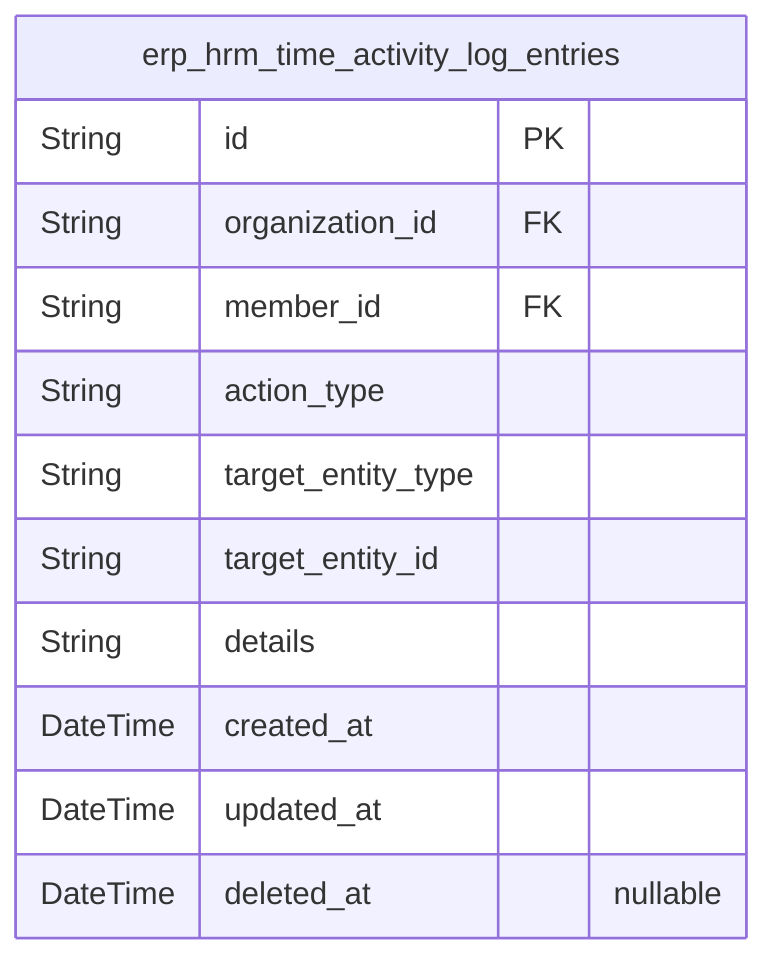
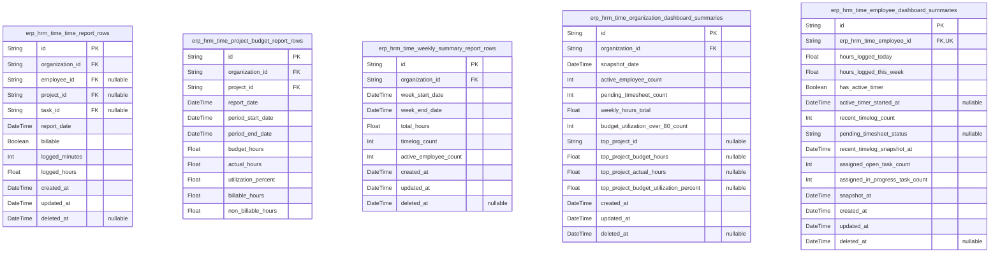

# Prisma Markdown

> Generated by [`prisma-markdown`](https://github.com/samchon/prisma-markdown)

- [authorization](#authorization)
- [OrganizationHr](#organizationhr)
- [Organizations](#organizations)
- [Departments](#departments)
- [Roles](#roles)
- [Projects](#projects)
- [TimeTracking](#timetracking)
- [ActivityLog](#activitylog)
- [default](#default)

## authorization

### `erp_hrm_time_guests`

Temporary guest identities for unauthenticated visitors who need limited
access before signing up or logging in. This table represents a
lightweight pre-account identity used before a visitor becomes a
registered member. It is intentionally isolated from authenticated
account data and does not store credentials. Related guest session
records are modeled separately in [erp_hrm_time_guest_sessions](#erp_hrm_time_guest_sessions).

Properties as follows:

- `id`: Primary key for the guest identity record.
- `created_at`: Record creation timestamp.
- `updated_at`: Record last update timestamp.
- `deleted_at`
  > Soft delete timestamp used to retire temporary guest identities without
  > hard deletion.

### `erp_hrm_time_guest_sessions`

Temporary session records for unauthenticated guest visitors. This table
stores the session identity and access context for a guest while they
remain outside the authenticated member flow, and it links each session
to exactly one [erp_hrm_time_guests](#erp_hrm_time_guests) record.

The table is intentionally narrow because guest access is temporary and
should not duplicate account or member profile data. Session ownership
and lifecycle are tracked here only, while any guest identity details
remain in the parent guest table.

Properties as follows:

- `id`: Primary key for the guest session record.
- `erp_hrm_time_guest_id`: Parent guest's [erp_hrm_time_guests.id](#erp_hrm_time_guests).
- `session_token`
  > Opaque token or identifier used to recognize the guest session during
  > unauthenticated access.
- `ip`: IP address captured when the guest session is created or refreshed.
- `href`: Current request URL associated with the guest session context.
- `referrer`: Referrer URL recorded for the guest session context.
- `created_at`: Timestamp when the guest session was created.
- `updated_at`: Timestamp when the guest session was last updated.
- `deleted_at`: Timestamp when the guest session was soft-deleted, if applicable.

### `erp_hrm_time_members`

Registered member accounts with email/password credentials and global
profile linkage for authenticated users.

This table is the authentication root for signed-in users. It stores the
login identity and shared profile data that applies across every
organization the user belongs to. Organization-specific access, sessions,
recovery tokens, and email verification records are handled in separate
tables owned by other components, so this table remains focused on
durable account identity and account lifecycle.

Properties as follows:

- `id`: Primary key for the member account.
- `email`: Unique login email used to authenticate the member account.
- `password_hash`: Hashed password credential used for authentication.
- `display_name`: Global profile display name shared across organizations.
- `avatar_image_url`: Optional global profile avatar image URL.
- `phone_number`: Optional global profile phone number.
- `created_at`: Timestamp when the member account was created.
- `updated_at`: Timestamp when the member account was last updated.
- `deleted_at`: Timestamp when the member account was soft deleted, if applicable.

### `erp_hrm_time_member_sessions`

Stores authenticated member session records for login tracking and
security auditing. Each row represents one issued session for a member
account and records the client context, creation time, and expiration
time for session management and revocation.

This table belongs to the authorization boundary and references {@link
erp_hrm_time_members} only in the child-to-parent direction. It supports
member authentication flows, session listing, and security enforcement
without storing derived account profile data or any non-session business
state.

Properties as follows:

- `id`: Primary key for the member session record.
- `erp_hrm_time_member_id`: Owning member's [erp_hrm_time_members.id](#erp_hrm_time_members).
- `ip`: IP address recorded when the session was created or last refreshed.
- `href`: Current request URL or entry URL associated with the session context.
- `referrer`: Referrer URL captured for the session context.
- `created_at`: Timestamp when the session was issued.
- `expired_at`: Timestamp when the session becomes invalid.

### `erp_hrm_time_member_password_resets`

Stores password reset tokens for [erp_hrm_time_members](#erp_hrm_time_members) and tracks
when each token was issued, expires, and is consumed.

Each record represents one password-reset request for a member account.
The table is intentionally separate from the member identity record so
reset credentials remain ephemeral, auditable, and easy to revoke without
affecting the authenticated account itself.

Properties as follows:

- `id`: Primary Key.
- `erp_hrm_time_member_id`: Target's [erp_hrm_time_members.id](#erp_hrm_time_members).
- `token`: Random password reset token used to verify the reset request.
- `expires_at`: Time when this reset token becomes invalid.
- `used_at`: Time when this reset token was successfully consumed, if it has been used.
- `created_at`: Creation timestamp for the reset request.
- `updated_at`: Last update timestamp for the reset request.
- `deleted_at`: Soft delete timestamp for revoked or removed reset requests.

### `erp_hrm_time_member_email_verifications`

Stores email verification tokens used to confirm ownership of a member
email address during registration or account activation.

Each row represents one verification token issuance for a specific member
account. The table supports token expiration, one-time verification, and
audit-friendly lifecycle tracking without duplicating profile or
credential data. Verification is always linked to {@link
erp_hrm_time_members} and must remain scoped to that authenticated
account.

Properties as follows:

- `id`: Primary Key.
- `member_id`: Member's [erp_hrm_time_members.id](#erp_hrm_time_members).
- `token`: Secret verification token used to validate ownership of the email address.
- `expires_at`: Timestamp when this verification token becomes invalid.
- `verified_at`
  > Timestamp when the token was successfully consumed and the email was
  > verified.
- `created_at`: Record creation timestamp.
- `updated_at`: Record update timestamp.
- `deleted_at`: Soft delete timestamp for revoking unused verification records.

## OrganizationHr

### `erp_hrm_time_organization_memberships`

Stores the association between a member account and an organization,
including the membership status and whether this membership is the
currently selected organization context for the member.

This table is the organization-scoped access link used to scope all
subsequent tenant data access. It does not store role assignments,
invitation metadata, or profile data; those concerns belong to the
authorization and role components. The relationship is always maintained
from the membership record to [erp_hrm_time_members](#erp_hrm_time_members) and {@link
erp_hrm_time_organizations}, ensuring a single source of truth for
organization membership.

Properties as follows:

- `id`: Primary key.
- `erp_hrm_time_member_id`: Member account reference. [erp_hrm_time_members.id](#erp_hrm_time_members).
- `erp_hrm_time_organization_id`: Organization reference. [erp_hrm_time_organizations.id](#erp_hrm_time_organizations).
- `status`: Membership status within the organization, such as active or pending.
- `is_selected_context`
  > Indicates whether this membership is the member's currently selected
  > organization context.
- `created_at`: Record creation timestamp.
- `updated_at`: Record last update timestamp.
- `deleted_at`: Soft delete timestamp for logically removed memberships.

### `erp_hrm_time_employees`

Stores organization-scoped employee records for the ERP HRM and time
tracking platform. Each record links a user account to one organization,
assigns exactly one role within that organization, and captures the
employee's department, position, employment type, and active or
deactivated status.

This table is the authoritative employee identity within a tenant. It is
used to scope access, manage organization membership-driven employment
records, and support HR and time-tracking workflows without duplicating
contract history or dashboard data in this entity.

Properties as follows:

- `id`: Primary key for the employee record.
- `erp_hrm_time_organization_id`: Organization's [erp_hrm_time_organizations.id](#erp_hrm_time_organizations).
- `erp_hrm_time_member_id`: Member account's [erp_hrm_time_members.id](#erp_hrm_time_members).
- `erp_hrm_time_role_id`: Role's [erp_hrm_time_roles.id](#erp_hrm_time_roles).
- `erp_hrm_time_department_id`: Department's [erp_hrm_time_departments.id](#erp_hrm_time_departments).
- `position_title`: Optional job title or position name for display and HR management.
- `employment_type`
  > Employment classification for the employee, such as full-time, part-time,
  > contractor, or intern.
- `status`: Current employment state, such as active or deactivated.
- `created_at`: Timestamp when the employee record was created.
- `updated_at`: Timestamp when the employee record was last updated.
- `deleted_at`: Timestamp when the employee record was soft deleted, if applicable.

### `erp_hrm_time_employee_contracts`

Stores historical employment contracts for employees within an
organization. Each record captures one contract period, compensation
terms, and working-time expectations for a specific employee.

This table is append-oriented and preserves past contract history as
immutable records after activation. The current active contract for an
employee is determined by its date range, while the application layer
enforces the rule that only one active contract may exist at a time and
that a new contract closes the previous one the day before the new start
date. Related employee identity is referenced through {@link
erp_hrm_time_employees}.

Properties as follows:

- `id`: Primary key for the employee contract record.
- `erp_hrm_time_employee_id`: Employee's [erp_hrm_time_employees.id](#erp_hrm_time_employees).
- `start_date`: The date on which this employment contract becomes effective.
- `end_date`
  > The date on which this contract ends. A null value indicates the contract
  > is ongoing.
- `pay_rate`: The compensation amount defined by this contract.
- `pay_period`
  > The unit used to interpret the pay rate, such as hourly, daily, weekly,
  > or monthly.
- `working_hours_per_week`: The expected number of working hours per week for this contract.
- `notes`: Optional free-text notes describing contract-specific terms or context.
- `created_at`: Timestamp when the contract record was created.
- `updated_at`: Timestamp when the contract record was last updated.
- `deleted_at`: Timestamp when the contract record was soft deleted, if applicable.

## Organizations

### `erp_hrm_time_organizations`

Stores the core tenant record for each organization, including its
identity, profile, ownership reference, and lifecycle state.

This table represents the root tenant entity for the platform. It keeps
organization identity and lifecycle data in a normalized form, while
editable configuration such as currency, timezone, and fiscal settings is
stored in the separate organization settings table. The organization
record is the anchor for tenant isolation and ownership management across
the system.

Properties as follows:

- `id`: Primary key for the organization tenant record.
- `owner_member_id`: Owner's [erp_hrm_time_members.id](#erp_hrm_time_members).
- `name`: Organization display name used throughout the tenant UI.
- `description`: Optional organization summary or profile text.
- `logo_image_url`: Optional organization logo image URL for branding.
- `status`: Organization lifecycle state such as active or deleted.
- `created_at`: Timestamp when the organization record was created.
- `updated_at`: Timestamp when the organization record was last updated.
- `deleted_at`: Timestamp when the organization was soft-deleted, if applicable.

### `erp_hrm_time_organization_settings`

Stores organization-level configuration and editable tenant preferences
for [erp_hrm_time_organizations](#erp_hrm_time_organizations). It contains the operational
settings that govern fiscal and localization behavior for a single
organization, while keeping identity and ownership in the parent
organization record.

This table is designed as a dependent 1:1 extension of the organization
root, so each organization has at most one settings row. The model is
kept normalized and only includes atomic configuration fields that are
directly editable at the tenant level.

Properties as follows:

- `id`: Primary key for the organization settings record.
- `erp_hrm_time_organization_id`: Organization's [erp_hrm_time_organizations.id](#erp_hrm_time_organizations).
- `currency_code`
  > ISO currency code used for organization-wide monetary display and
  > pay-related configuration.
- `timezone`
  > IANA timezone identifier used for organization-wide date and time
  > interpretation.
- `fiscal_start_month`
  > Month number that defines the first month of the organization's fiscal
  > year, using a 1-based calendar month value.
- `created_at`: Timestamp when this settings record was created.
- `updated_at`: Timestamp when this settings record was last updated.
- `deleted_at`: Timestamp when this settings record was soft deleted, if applicable.

## Departments

### `erp_hrm_time_departments`

Organization-scoped department records used to group employees and
describe the internal internal structure of an organization. Supports an
optional single parent department for one-level nesting.

Each department belongs to exactly one organization and may optionally
reference a parent department within the same organization to represent a
shallow hierarchy. The table stores only department identity and
descriptive attributes; employee assignment and department-nullification
behavior are handled by related tables outside this component.

Properties as follows:

- `id`: Primary Key.
- `erp_hrm_time_organization_id`: Organization's [erp_hrm_time_organizations.id](#erp_hrm_time_organizations).
- `parent_department_id`: Parent department's [erp_hrm_time_departments.id](#erp_hrm_time_departments).
- `name`: Department name within the organization.
- `description`: Optional department description for organizational context.
- `created_at`: Record creation timestamp.
- `updated_at`: Record last update timestamp.
- `deleted_at`: Soft delete timestamp for retained department records.

## Roles

### `erp_hrm_time_roles`

Organization-scoped role definitions used to control employee access
within a tenant. Built-in roles and custom roles are stored together,
while the assigned permission set is managed through {@link
erp_hrm_time_role_permissions}.

Each role belongs to exactly one organization and is uniquely identified
by its name within that organization. Built-in roles such as Owner,
Manager, and Employee are represented in this table and must be protected
from deletion by application rules. Custom roles may be edited or removed
when no employees are assigned to them, with employee-role assignment
enforced through the employee domain.

Properties as follows:

- `id`: Primary key for the role record.
- `erp_hrm_time_organization_id`: Organization's [erp_hrm_time_organizations.id](#erp_hrm_time_organizations).
- `name`
  > Role name unique within the organization, such as Owner, Manager,
  > Employee, or a custom role name.
- `description`
  > Human-readable explanation of the role's purpose and intended access
  > level.
- `is_builtin`
  > Indicates whether the role is a protected built-in role managed by the
  > system.
- `created_at`: Timestamp when the role was created.
- `updated_at`: Timestamp when the role was last updated.
- `deleted_at`: Timestamp when the role was soft-deleted, if applicable.

### `erp_hrm_time_permissions`

Approved permission catalog used to compose organization role permission
sets.

This table stores the canonical list of permission keys recognized by the
platform and their descriptions. It is referenced by {@link
erp_hrm_time_role_permissions} so roles can be assigned a validated
permission set without duplicating the permission vocabulary in
application code.

Properties as follows:

- `id`: Primary key.
- `key`
  > Stable permission key used by the authorization layer, such as org:manage
  > or project:view.
- `description`: Human-readable explanation of what the permission allows.
- `created_at`: Record creation timestamp.
- `updated_at`: Record update timestamp.
- `deleted_at`: Soft delete timestamp for inactive permissions, if ever retired.

### `erp_hrm_time_role_permissions`

Stores the assignment of approved permissions to organization-scoped roles.

Each row represents one permission granted to one role, forming the
many-to-many bridge between [erp_hrm_time_roles](#erp_hrm_time_roles) and {@link
erp_hrm_time_permissions}. The table contains only relational keys and
standard temporal fields so permission sets remain normalized and can be
audited over time.

Properties as follows:

- `id`: Primary key.
- `erp_hrm_time_role_id`: Role's [erp_hrm_time_roles.id](#erp_hrm_time_roles).
- `erp_hrm_time_permission_id`: Permission's [erp_hrm_time_permissions.id](#erp_hrm_time_permissions).
- `created_at`: Record creation timestamp.
- `updated_at`: Record last update timestamp.
- `deleted_at`: Soft delete timestamp.

## Projects

### `erp_hrm_time_projects`

Stores project records for a single organization, including the project
identity, lifecycle status, schedule, budget, and display metadata.

Each project belongs to exactly one [erp_hrm_time_organizations](#erp_hrm_time_organizations)
record and is managed within that tenant boundary. The table keeps only
atomic project attributes and lifecycle timestamps; project membership,
task assignment, and time-entry relationships are modeled in separate
tables to preserve normalization.

Properties as follows:

- `id`: Primary key for the project record.
- `erp_hrm_time_organization_id`: Owning organization's [erp_hrm_time_organizations.id](#erp_hrm_time_organizations).
- `name`: Human-readable project name used in lists, search, and project details.
- `description`: Optional project description for context and planning notes.
- `color_code`: Required UI display color code for the project.
- `status`: Current lifecycle status of the project: active, archived, or completed.
- `budget_hours`: Optional estimated budgeted hours for the project.
- `start_date`: Optional project start date.
- `end_date`: Optional project end date.
- `created_at`: Timestamp when the project was created.
- `updated_at`: Timestamp when the project was last updated.
- `deleted_at`: Timestamp when the project was soft deleted, if applicable.

### `erp_hrm_time_project_memberships`

Links employees to projects and stores the employee's role within each
project assignment.

Each row represents one employee's membership in one project and carries
only the assignment-specific role for that project. The table supports
project staffing, lead assignment, and membership checks without
duplicating employee, project, or organization data. Referenced entities
remain in their owning tables: [erp_hrm_time_projects](#erp_hrm_time_projects) and {@link
erp_hrm_time_employees}.

Properties as follows:

- `id`: Primary key for the project membership record.
- `erp_hrm_time_project_id`: Project's [erp_hrm_time_projects.id](#erp_hrm_time_projects).
- `erp_hrm_time_employee_id`: Employee's [erp_hrm_time_employees.id](#erp_hrm_time_employees).
- `project_role`
  > Role of the employee within this project assignment, such as member or
  > project lead.
- `created_at`: Timestamp when the project membership was created.
- `updated_at`: Timestamp when the project membership was last updated.
- `deleted_at`: Timestamp when the project membership was soft deleted, if applicable.

### `erp_hrm_time_tasks`

Work items within a project used to plan, track, and complete project
delivery tasks.

Each task belongs to exactly one project and may optionally be assigned
to one employee who is a member of that project. Tasks can have one level
of subtasks through an optional self-referencing parent task
relationship. Status changes are recorded in the separate task history
table, while this table stores the current task state, priority,
scheduling fields, and assignment metadata.

Properties as follows:

- `id`: Primary Key.
- `erp_hrm_time_project_id`: Project's [erp_hrm_time_projects.id](#erp_hrm_time_projects).
- `erp_hrm_time_employee_id`: Assigned employee's [erp_hrm_time_employees.id](#erp_hrm_time_employees).
- `parent_task_id`
  > Parent task's [erp_hrm_time_tasks.id](#erp_hrm_time_tasks) for one-level subtask
  > hierarchies.
- `title`: Task title shown in project work lists and task details.
- `description`
  > Optional task description containing work context and implementation
  > notes.
- `status`: Current task workflow state.
- `priority`: Task priority level used for planning and ordering.
- `estimated_hours`: Optional estimate of the effort required to complete the task.
- `due_date`: Optional target completion date for the task.
- `created_at`: Record creation timestamp.
- `updated_at`: Record last update timestamp.
- `deleted_at`: Soft delete timestamp for archived task records.

### `erp_hrm_time_task_history_entries`

Immutable status-change history for tasks within a project. Each row
records one transition from an old task status to a new task status, the
exact time the change occurred, and the member who performed the update.
This table supports audit trails and task timeline views while keeping
task state itself in [erp_hrm_time_tasks](#erp_hrm_time_tasks).

Properties as follows:

- `id`: Primary key for the task history entry.
- `erp_hrm_time_task_id`: The task's [erp_hrm_time_tasks.id](#erp_hrm_time_tasks).
- `erp_hrm_time_member_id`
  > The actor member's [erp_hrm_time_members.id](#erp_hrm_time_members) who changed the task
  > status.
- `old_status`: The task status before the change.
- `new_status`: The task status after the change.
- `changed_at`: The exact timestamp when the task status changed.

## TimeTracking

### `erp_hrm_time_timelogs`

Persistent time entry records captured by employees for specific work
dates. Each row stores the logged duration, the employee who created the
entry, the project it belongs to, and an optional task reference.

This table is the durable source of truth for time tracking. It supports
weekly timesheets, timer-to-timelog conversion, and reporting workflows
while remaining normalized so that organization scope, project ownership,
and task validity are resolved through related parent entities rather
than duplicated here.

Properties as follows:

- `id`: Primary key of the timelog record.
- `erp_hrm_time_member_id`: Employee [erp_hrm_time_members.id](#erp_hrm_time_members) who owns and created the timelog.
- `erp_hrm_time_project_id`: Project [erp_hrm_time_projects.id](#erp_hrm_time_projects) that the logged time belongs to.
- `erp_hrm_time_task_id`
  > Optional task [erp_hrm_time_tasks.id](#erp_hrm_time_tasks) associated with the logged
  > time.
- `work_date`: Calendar date of the work that was logged.
- `duration_minutes`: Logged duration in minutes.
- `description`: Free-text description of the work performed.
- `billable`: Indicates whether the logged time is billable.
- `created_at`: Timestamp when the timelog was created.
- `updated_at`: Timestamp when the timelog was last updated.
- `deleted_at`: Timestamp when the timelog was soft deleted, if applicable.

### `erp_hrm_time_timers`

Stores the currently running work session for an employee in the
time-tracking workflow. The record captures the live timer context,
including when it started and which project and optional task it is
attached to, until the timer is stopped or discarded. This table is
lifecycle-bound to the timer flow and supports the rule that an employee
can have at most one active timer at a time.

Properties as follows:

- `id`: Primary key for the live timer session.
- `member_id`: The authenticated member account's [erp_hrm_time_members.id](#erp_hrm_time_members).
- `employee_id`: The organization-scoped employee's [erp_hrm_time_employees.id](#erp_hrm_time_employees).
- `project_id`: The selected project's [erp_hrm_time_projects.id](#erp_hrm_time_projects).
- `task_id`
  > The optional task's [erp_hrm_time_tasks.id](#erp_hrm_time_tasks) when the timer is
  > started or edited.
- `started_at`: Timestamp when the timer started running.
- `description`
  > Optional free-text note describing the work being performed while the
  > timer runs.
- `created_at`: Timestamp when this timer record was created.
- `updated_at`: Timestamp when this timer record was last updated.
- `deleted_at`
  > Timestamp when this timer record was soft deleted or discarded, if
  > applicable.

### `erp_hrm_time_timesheets`

Weekly employee timesheets that collect timelogs and store submission and
review status.

Each record represents one employee's timesheet for a single
Monday-to-Sunday week. The table stores the sheet lifecycle, submission
metadata, review metadata, and rejection details while the actual
included timelogs are maintained through the separate
timesheet-to-timelog join table to preserve normalization.

The timesheet belongs to exactly one employee and may optionally be
reviewed by a member who approved or rejected it. A given employee can
have only one timesheet per week.

Properties as follows:

- `id`: Primary Key.
- `erp_hrm_time_employee_id`: Employee owner's [erp_hrm_time_employees.id](#erp_hrm_time_employees).
- `reviewed_by_member_id`: Reviewer member's [erp_hrm_time_members.id](#erp_hrm_time_members).
- `week_start_date`: Start date of the timesheet week. Must be a Monday.
- `week_end_date`: End date of the timesheet week. Must be a Sunday.
- `status`: Timesheet lifecycle state: draft, submitted, approved, or rejected.
- `submitted_at`: Timestamp when the timesheet was submitted for approval.
- `reviewed_at`: Timestamp when the timesheet was approved or rejected.
- `rejection_reason`: Reason provided when a submitted timesheet is rejected.
- `created_at`: Record creation timestamp.
- `updated_at`: Record update timestamp.
- `deleted_at`: Soft delete timestamp.

### `erp_hrm_time_timesheet_timelogs`

Links weekly timesheets to the timelogs included in each submission so
the system can compose, lock, and review weekly time entries without
duplicating time-entry data.

Each row represents exactly one association between a timesheet and a
timelog. The table exists to support draft composition, submission
locking, approval workflows, and traceable removal or re-inclusion of
timelogs in a weekly timesheet while preserving normalized timelog
storage in [erp_hrm_time_timelogs](#erp_hrm_time_timelogs) and weekly ownership in {@link
erp_hrm_time_timesheets}.

Properties as follows:

- `id`: Primary key.
- `erp_hrm_time_timesheet_id`: Parent timesheet's [erp_hrm_time_timesheets.id](#erp_hrm_time_timesheets).
- `erp_hrm_time_timelog_id`: Parent timelog's [erp_hrm_time_timelogs.id](#erp_hrm_time_timelogs).
- `created_at`: Timestamp when this timesheet-timelog association was created.
- `updated_at`: Timestamp when this association was last updated.
- `deleted_at`
  > Soft delete timestamp for removing the association while preserving
  > historical traceability.

## ActivityLog

### `erp_hrm_time_activity_log_entries`

Append-only audit trail entries for significant actions performed within
an organization. Each record stores the organization scope, the acting
member, the action type, the affected target entity, the event timestamp,
and a human-readable details field for traceability.

This table is designed for immutable activity history and operational
auditing. It supports administrative review, security analysis, and
business event inspection without duplicating domain state from {@link
Organization}, [Member](#Member), or other business entities.

Properties as follows:

- `id`: Primary Key.
- `organization_id`: Organization's [erp_hrm_time_organizations.id](#erp_hrm_time_organizations).
- `member_id`: Acting member's [erp_hrm_time_members.id](#erp_hrm_time_members).
- `action_type`
  > Canonical activity type such as employee invitation, contract change,
  > project lifecycle action, task status change, timesheet review, or role
  > assignment.
- `target_entity_type`
  > Domain entity type affected by the action, stored as a normalized textual
  > discriminator.
- `target_entity_id`: Identifier of the affected target entity within the organization.
- `details`
  > Human-readable audit details describing what changed or why the event was
  > recorded.
- `created_at`: Timestamp when the activity event occurred.
- `updated_at`: Record update timestamp.
- `deleted_at`: Soft delete timestamp for retention workflows, if ever required.

## default

### `erp_hrm_time_time_report_rows`

Precomputed organization time-report rows used to serve time reporting
queries efficiently. Each row represents an aggregated slice of logged
time for an organization within a reporting date range, broken down by
employee, project, task, and billable status as needed for filtering and
report presentation. This table is read-only from the application
perspective and is maintained by reporting jobs rather than user actions.
It references [erp_hrm_time_organizations](#erp_hrm_time_organizations), {@link
erp_hrm_time_employees}, [erp_hrm_time_projects](#erp_hrm_time_projects), and {@link
erp_hrm_time_tasks} through dimension keys when the slice is scoped to
those entities.

Properties as follows:

- `id`: Primary key for the precomputed report row.
- `organization_id`: Organization's [erp_hrm_time_organizations.id](#erp_hrm_time_organizations).
- `employee_id`: Employee's [erp_hrm_time_employees.id](#erp_hrm_time_employees).
- `project_id`: Project's [erp_hrm_time_projects.id](#erp_hrm_time_projects).
- `task_id`: Task's [erp_hrm_time_tasks.id](#erp_hrm_time_tasks).
- `report_date`: The calendar date represented by this aggregated report row.
- `billable`: Whether the aggregated time in this row is billable.
- `logged_minutes`: Total logged minutes included in this report row.
- `logged_hours`
  > Total logged hours included in this report row for convenient
  > presentation.
- `created_at`: Timestamp when this precomputed row was generated.
- `updated_at`: Timestamp when this precomputed row was last refreshed.
- `deleted_at`: Soft delete timestamp for obsolete report rows.

### `erp_hrm_time_project_budget_report_rows`

Precomputed project budget reporting rows for an organization. Each row
stores the budgeted hours, actual logged hours, and utilization metrics
for a project with a defined budget so reports and dashboards can query
aggregates efficiently.

This table is a derived reporting projection and is not edited directly
by business users. It is designed for tenant-scoped analytics,
period-based refreshes, and fast filtering by organization and project.

Properties as follows:

- `id`: Primary key for the precomputed report row.
- `organization_id`: Organization's [erp_hrm_time_organizations.id](#erp_hrm_time_organizations).
- `project_id`: Project's [erp_hrm_time_projects.id](#erp_hrm_time_projects).
- `report_date`
  > Date or refresh timestamp representing when this reporting row was
  > generated.
- `period_start_date`: Start of the reporting window used to compute the metrics.
- `period_end_date`: End of the reporting window used to compute the metrics.
- `budget_hours`: Planned budgeted hours for the project within the report context.
- `actual_hours`: Actual hours logged against the project within the report context.
- `utilization_percent`
  > Percentage of budget consumed by actual logged hours for the report
  > context.
- `billable_hours`: Total billable hours logged against the project within the report context.
- `non_billable_hours`
  > Total non-billable hours logged against the project within the report
  > context.

### `erp_hrm_time_weekly_summary_report_rows`

Precomputed weekly summary rows for organization-level time reporting and
dashboard analytics. Each row represents one organization and one ISO
week, storing aggregate metrics for total hours, timelog volume, and
active employees who logged time during that period.

This table is a derived reporting projection rather than a source of
truth. It exists to speed up date-range filtering and weekly aggregation
queries without duplicating transactional time-tracking records.

Properties as follows:

- `id`: Primary Key.
- `organization_id`: Organization's [erp_hrm_time_organizations.id](#erp_hrm_time_organizations).
- `week_start_date`
  > Start date of the summarized ISO week (Monday in organization-local
  > reporting context).
- `week_end_date`
  > End date of the summarized ISO week (Sunday in organization-local
  > reporting context).
- `total_hours`: Total hours logged by all employees in the organization during the week.
- `timelog_count`: Total number of timelog records included in the weekly aggregation.
- `active_employee_count`
  > Number of unique employees who logged at least one timelog during the
  > week.
- `created_at`: Record creation timestamp.
- `updated_at`: Record update timestamp.
- `deleted_at`: Soft delete timestamp, if this report row is retired.

### `erp_hrm_time_organization_dashboard_summaries`

Materialized organization dashboard snapshot that stores precomputed
aggregate metrics for an organization's operational overview.

This projection supports fast dashboard rendering for report users by
caching organization-level counts and summary values such as active
employee totals, pending timesheets, weekly hours, and budget-risk
project indicators. It belongs to the Reports component as derived data
and references the owning organization as its tenant scope.

Properties as follows:

- `id`: Primary key.
- `organization_id`: Owning organization's [erp_hrm_time_organizations.id](#erp_hrm_time_organizations).
- `snapshot_date`: The date and time when this summary snapshot was generated.
- `active_employee_count`: Precomputed number of active employees in the organization.
- `pending_timesheet_count`: Precomputed number of timesheets awaiting approval.
- `weekly_hours_total`: Precomputed total hours logged in the current reporting week.
- `budget_utilization_over_80_count`
  > Precomputed count of projects whose budget utilization exceeds the
  > dashboard threshold.
- `top_project_id`
  > The [erp_hrm_time_projects.id](#erp_hrm_time_projects) of the highest-priority budget-risk
  > project featured on the dashboard, when applicable.
- `top_project_budget_hours`: Cached budget hours for the featured budget-risk project, when applicable.
- `top_project_actual_hours`
  > Cached actual logged hours for the featured budget-risk project, when
  > applicable.
- `top_project_budget_utilization_percent`
  > Cached budget utilization percentage for the featured budget-risk
  > project, when applicable.
- `created_at`: Timestamp when the snapshot row was created.
- `updated_at`: Timestamp when the snapshot row was last updated.
- `deleted_at`: Soft delete timestamp for snapshot invalidation.

### `erp_hrm_time_employee_dashboard_summaries`

Stores a derived dashboard snapshot for each employee, summarizing
personal time-tracking and workload metrics used by the employee
dashboard.

The record is a reporting projection rather than a source-of-truth
transactional table. It is keyed by employee and captures current-state
or precomputed metrics such as hours logged today, hours logged this
week, whether an active timer exists, the most recent timelog references,
pending timesheet status for the current week, and counts or identifiers
for assigned in-progress tasks. Detailed underlying facts remain in
[erp_hrm_time_timelogs](#erp_hrm_time_timelogs), [erp_hrm_time_timers](#erp_hrm_time_timers), {@link
erp_hrm_time_timesheets}, and [erp_hrm_time_tasks](#erp_hrm_time_tasks).

Properties as follows:

- `id`: Primary Key.
- `erp_hrm_time_employee_id`: Employee's [erp_hrm_time_employees.id](#erp_hrm_time_employees).
- `hours_logged_today`: Precomputed total hours logged by the employee for the current day.
- `hours_logged_this_week`: Precomputed total hours logged by the employee for the current week.
- `has_active_timer`: Indicates whether the employee currently has a running timer.
- `active_timer_started_at`: Timestamp when the current active timer started, if one is running.
- `recent_timelog_count`: Number of recent timelogs represented in the dashboard snapshot.
- `pending_timesheet_status`
  > Current status of the employee's timesheet for the active week, such as
  > draft, submitted, approved, or rejected.
- `recent_timelog_snapshot_at`
  > Timestamp when the recent timelog portion of the dashboard snapshot was
  > last refreshed.
- `assigned_open_task_count`: Count of assigned tasks in open or in-progress status for the employee.
- `assigned_in_progress_task_count`: Count of assigned tasks currently in progress for the employee.
- `snapshot_at`: Timestamp when this dashboard snapshot was generated.
- `created_at`: Record creation timestamp.
- `updated_at`: Record update timestamp.
- `deleted_at`: Soft delete timestamp for snapshot invalidation.
