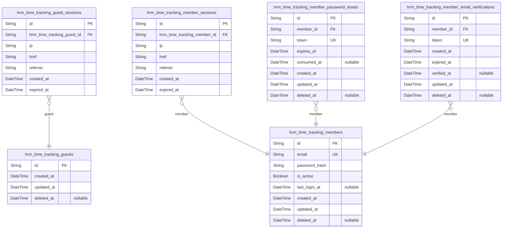
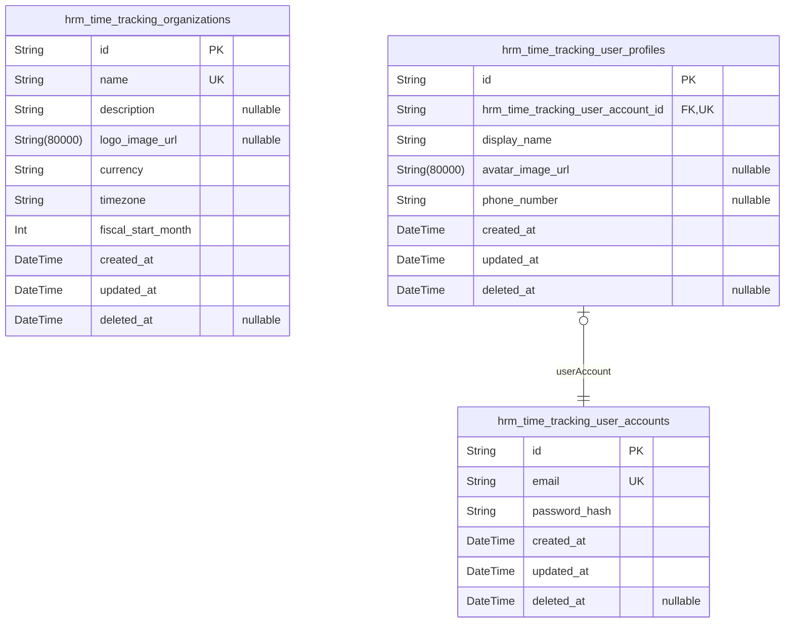
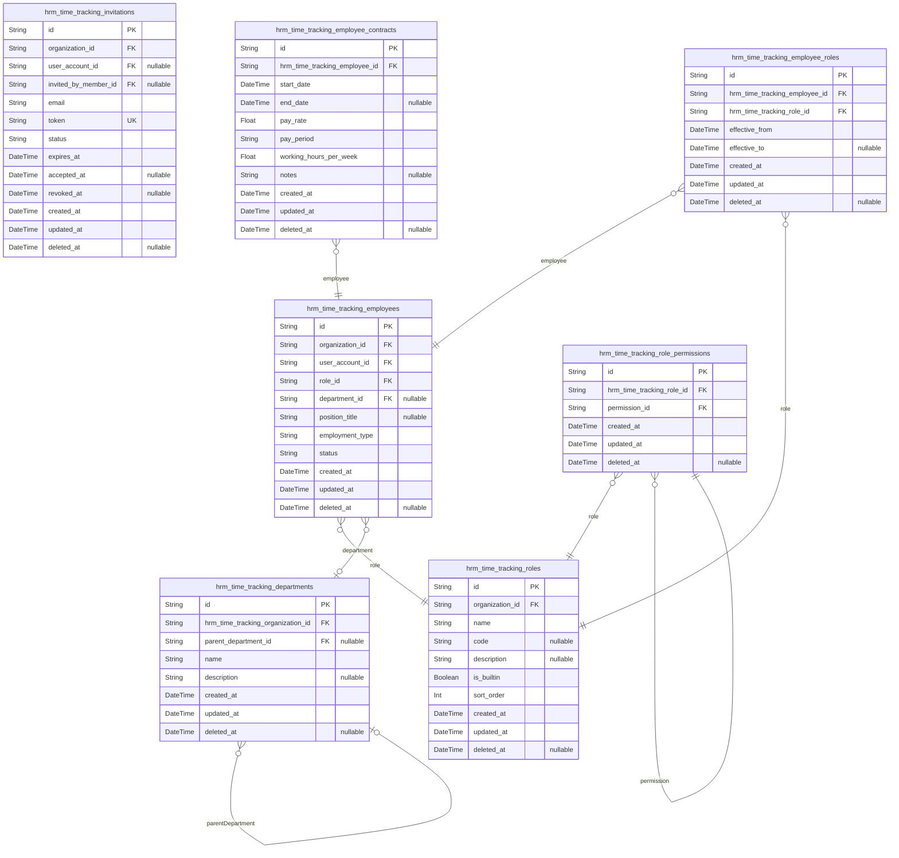
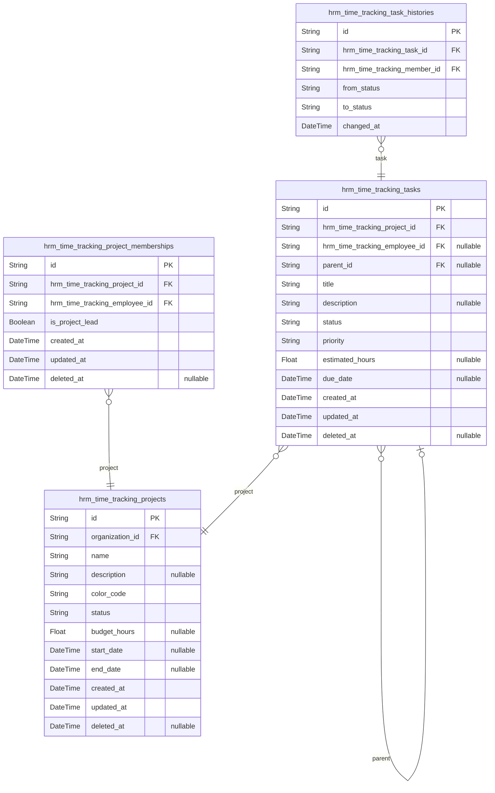
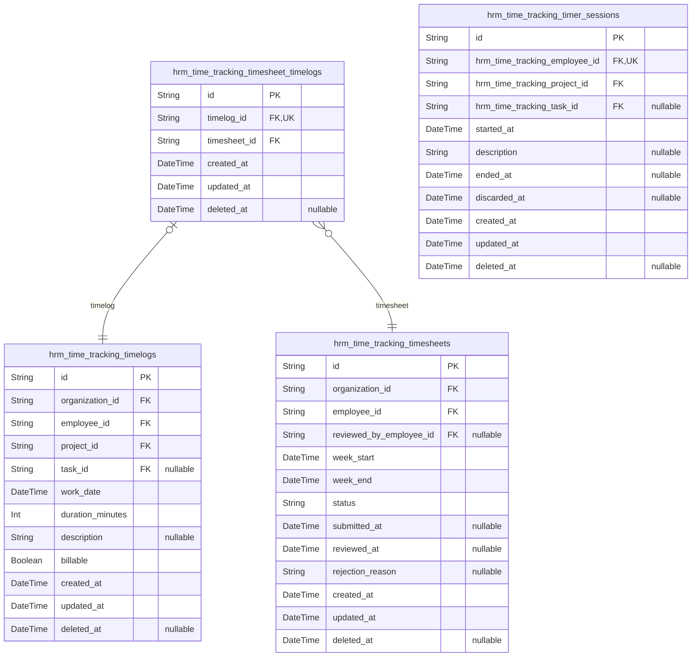
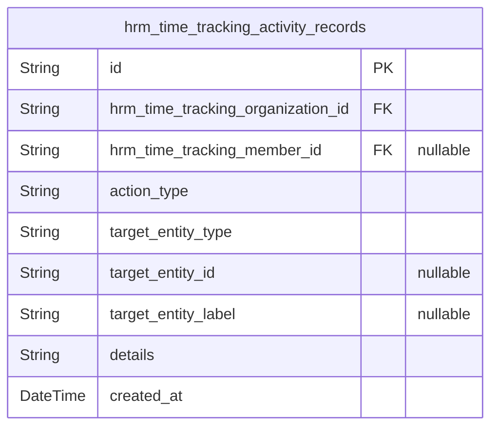

# Prisma Markdown

> Generated by [`prisma-markdown`](https://github.com/samchon/prisma-markdown)

- [Actors](#actors)
- [Systematic](#systematic)
- [HumanResources](#humanresources)
- [Projects](#projects)
- [TimeTracking](#timetracking)
- [Governance](#governance)

## Actors

### `hrm_time_tracking_guests`

Temporary guest identities used for anonymous access before registration
or login. This table stores the minimal identity anchor for
unauthenticated visitors and acts as the parent record for {@link
hrm_time_tracking_guest_sessions} without containing session data itself.

Properties as follows:

- `id`: Primary Key.
- `created_at`: When the guest identity was created.
- `updated_at`: When the guest identity was last updated.
- `deleted_at`: When the guest identity was soft deleted, if applicable.

### `hrm_time_tracking_guest_sessions`

Temporary access sessions for anonymous guests.

This table stores session records that track guest connection context,
creation time, and expiration time while the visitor uses the platform
before registration or login. Each session belongs to exactly one {@link
hrm_time_tracking_guests} record and is used for auditing, session
management, and security lifecycle handling.

Properties as follows:

- `id`: Primary Key.
- `hrm_time_tracking_guest_id`: Owning guest's [hrm_time_tracking_guests.id](#hrm_time_tracking_guests).
- `ip`: IP address observed when the guest session was created.
- `href`: Current page or request URL associated with the guest session.
- `referrer`: Referrer URL associated with the guest session.
- `created_at`: Timestamp when the guest session was created.
- `expired_at`: Timestamp when the guest session expires.

### `hrm_time_tracking_members`

Registered member accounts that provide the global authenticated identity
for the platform.

This table stores the email/password credential anchor for a person who
may belong to multiple organizations. Organization membership, sessions,
password recovery, and email verification are managed in separate related
tables so the account remains normalized and reusable across the tenant
structure.

Properties as follows:

- `id`: Primary Key.
- `email`: Unique email address used for login and account identity.
- `password_hash`: Hashed password used for authentication and account security.
- `is_active`: Whether the member account is enabled for login and authenticated access.
- `last_login_at`: Most recent successful login timestamp for account activity tracking.
- `created_at`: Record creation timestamp.
- `updated_at`: Record update timestamp.
- `deleted_at`
  > Soft deletion timestamp used when the member account is deactivated or
  > removed.

### `hrm_time_tracking_member_sessions`

Stores authenticated member sessions for access token and refresh token
lifecycle management.

Each row represents one login session created for a specific member
account, together with the connection context needed for auditing and
security review. The table is append-oriented and supports session
expiration, logout handling, and per-member session history through the
[hrm_time_tracking_members](#hrm_time_tracking_members) relationship.

Properties as follows:

- `id`: Primary Key.
- `hrm_time_tracking_member_id`
  > Member account that owns this session. References {@link
  > hrm_time_tracking_members.id}.
- `ip`: IP address recorded when the session was created or refreshed.
- `href`: Current session entry point or requested URL used during authentication.
- `referrer`: Referrer information captured for session context and auditing.
- `created_at`: Timestamp when the session record was created.
- `expired_at`: Timestamp when the session expires and is no longer valid.

### `hrm_time_tracking_member_password_resets`

Stores password reset tokens issued for member account recovery.

Each record belongs to exactly one [hrm_time_tracking_members.id](#hrm_time_tracking_members)
and represents a single recovery token lifecycle, including when it
expires and whether it has already been consumed. This table is part of
the authentication recovery flow and must be handled securely and
auditably.

Properties as follows:

- `id`: Primary Key.
- `member_id`
  > Owning member's [hrm_time_tracking_members.id](#hrm_time_tracking_members) for this password
  > reset request.
- `token`: Secure password reset token used to verify the recovery request.
- `expires_at`: Timestamp when this reset token becomes invalid.
- `consumed_at`
  > Timestamp when the reset token was successfully used, if it has already
  > been consumed.
- `created_at`: Timestamp when this reset token record was created.
- `updated_at`: Timestamp when this reset token record was last updated.
- `deleted_at`: Soft delete timestamp for revoked or removed reset records.

### `hrm_time_tracking_member_email_verifications`

Stores one-time email verification tokens issued to confirm newly
registered member accounts.

Each record belongs to a single [hrm_time_tracking_members](#hrm_time_tracking_members) account
and tracks the verification token, its lifecycle, and expiration so the
platform can validate newly created accounts securely. The table is
append-friendly for repeated verification attempts and preserves history
of issued verification records without duplicating member identity data.

Properties as follows:

- `id`: Primary Key.
- `member_id`: Belonged member account's [hrm_time_tracking_members.id](#hrm_time_tracking_members).
- `token`
  > Secret verification token used to confirm ownership of the member email
  > address.
- `created_at`: When the verification token was issued.
- `expired_at`: When the verification token becomes invalid and can no longer be used.
- `verified_at`
  > When the member email was successfully verified, if verification has
  > completed.
- `updated_at`: When this verification record was last updated.
- `deleted_at`: When this verification record was soft-deleted, if applicable.

## Systematic

### `hrm_time_tracking_organizations`

Stores each organization's tenant boundary and organization-level
identity, including the core profile and operating context used by all
organization-scoped data.

This table is the root record for multi-tenant isolation in the
hrm_time_tracking system. It represents a business organization as an
independent boundary for employees, projects, time tracking, and
governance records. All organization-scoped entities reference this model
to preserve data separation and ensure that each tenant's operational
data remains isolated.

Properties as follows:

- `id`: Primary Key.
- `name`
  > Organization display name used for tenant identification and user-facing
  > navigation.
- `description`
  > Optional organization profile text describing the business context or
  > internal purpose.
- `logo_image_url`: Optional logo image URL used for branding in the application UI.
- `currency`
  > Default financial currency code used for organization-level monetary
  > values and reporting.
- `timezone`
  > Default timezone used for organization schedules, dates, and time-based
  > reporting.
- `fiscal_start_month`
  > First month of the organization's fiscal year, stored as a numeric month
  > value from 1 to 12.
- `created_at`: Timestamp when the organization record was created.
- `updated_at`: Timestamp when the organization record was last updated.
- `deleted_at`: Timestamp when the organization record was soft deleted, if applicable.

### `hrm_time_tracking_user_accounts`

Stores the global authenticated user identity for the platform. A single
account can belong to multiple organizations and acts as the shared login
anchor across tenant contexts.

This table contains only account-level identity and credential data,
keeping personal profile details in {@link
hrm_time_tracking_user_profiles} and organization-specific membership
data in separate tables. The account may remain active even when
organization memberships are added, removed, or when an organization is
deleted.

Properties as follows:

- `id`: Primary Key.
- `email`
  > Email address used for login and account identity. Must be unique across
  > all user accounts.
- `password_hash`: Hashed password used for authentication. The raw password is never stored.
- `created_at`: Timestamp when the account was created.
- `updated_at`: Timestamp when the account was last updated.
- `deleted_at`: Timestamp when the account was soft deleted, if applicable.

### `hrm_time_tracking_user_profiles`

Stores the shared personal profile for a user account across the platform.

This table keeps global identity and contact information separate from
organization-scoped membership, employee, and permission data. A profile
belongs to exactly one user account and is reused wherever that account
participates in one or more organizations.

Properties as follows:

- `id`: Primary Key.
- `hrm_time_tracking_user_account_id`
  > Owning user account's [hrm_time_tracking_user_accounts.id](#hrm_time_tracking_user_accounts). This
  > creates the global 1:1 profile anchor shared across all organizations.
- `display_name`: Person's display name shown across the platform.
- `avatar_image_url`: Profile image URL used for the user's global identity representation.
- `phone_number`: Person's contact phone number used for profile contact details.
- `created_at`: Record creation timestamp.
- `updated_at`: Record last update timestamp.
- `deleted_at`: Soft delete timestamp for profile retention handling.

## HumanResources

### `hrm_time_tracking_invitations`

Stores workforce invitations sent to an email address for a specific
organization.

An invitation represents a pending or accepted onboarding record that
allows an organization to invite a person before or after a user account
exists. The record preserves invitation state, supports deferred
membership, and can later be linked to the resulting {@link
hrm_time_tracking_user_accounts.id} when the invited email signs up.

This table is organization-scoped and acts as an administrative
onboarding trail rather than a standalone business entity. It keeps the
invitation lifecycle auditable while avoiding duplication of organization
or user profile data.

Properties as follows:

- `id`: Primary Key.
- `organization_id`
  > Organization that issued the invitation. {@link
  > hrm_time_tracking_organizations.id}.
- `user_account_id`
  > User account created from or matched to this invitation when the invited
  > email becomes a registered member. {@link
  > hrm_time_tracking_user_accounts.id}.
- `invited_by_member_id`
  > Member account that created the invitation, when the inviter can be
  > traced to an authenticated organization member. {@link
  > hrm_time_tracking_members.id}.
- `email`
  > Email address that was invited to join the organization. This value is
  > used to match a later signup and should be stored in normalized,
  > case-consistent form.
- `token`
  > Secure invitation token used to validate acceptance requests and link the
  > invitation to an onboarding flow.
- `status`
  > Invitation lifecycle state such as pending, accepted, expired, revoked,
  > or cancelled.
- `expires_at`: Timestamp after which the invitation is no longer valid for acceptance.
- `accepted_at`
  > Timestamp when the invitation was accepted and converted into
  > organization membership, if it has been accepted.
- `revoked_at`
  > Timestamp when the invitation was explicitly revoked by an organization
  > administrator, if applicable.
- `created_at`: Timestamp when the invitation record was created.
- `updated_at`: Timestamp when the invitation record was last updated.
- `deleted_at`
  > Timestamp for soft deletion of invitation records, when an invitation is
  > removed from active administration but retained for audit history.

### `hrm_time_tracking_departments`

Stores organization departments used to organize employees within a
tenant boundary. Departments may optionally reference one parent
department to support a simple one-level hierarchy, and they are designed
so that employee assignments can be cleared if a department is removed
without losing employee records.

Properties as follows:

- `id`: Primary Key.
- `hrm_time_tracking_organization_id`
  > Owning organization's [hrm_time_tracking_organizations.id](#hrm_time_tracking_organizations). This
  > enforces tenant isolation for all department records.
- `parent_department_id`
  > Optional parent department's [hrm_time_tracking_departments.id](#hrm_time_tracking_departments) for
  > one-level nesting within the same organization.
- `name`
  > Department name within the organization. The name should be unique per
  > organization for clear browsing and assignment.
- `description`: Additional department notes or purpose text for organization members.
- `created_at`: Creation timestamp.
- `updated_at`: Last update timestamp.
- `deleted_at`
  > Soft deletion timestamp used to preserve historical organization
  > structure while allowing department removal.

### `hrm_time_tracking_employees`

Stores the organization-specific employee membership record linking a
user account to an organization, a role, and an optional department. This
is the core workforce record used for staffing, access assignment, and
organization-scoped employee lifecycle management.

Each record represents one employee membership within a single
organization and anchors all employee-centric workflows such as role
assignment, department placement, contract history, and time-tracking
ownership. The table intentionally stores only the current employee
state; historical changes such as contracts and role history are handled
in separate tables to preserve normalization and auditability.

This table must always remain isolated by organization and must not
contain any cross-tenant data. {@link
hrm_time_tracking_organizations.id}, {@link
hrm_time_tracking_user_accounts.id}, [hrm_time_tracking_roles.id](#hrm_time_tracking_roles),
and [hrm_time_tracking_departments.id](#hrm_time_tracking_departments) define the core
relationships for membership, authorization, and placement.

Properties as follows:

- `id`: Primary Key.
- `organization_id`
  > Organization that owns this employee membership record. {@link
  > hrm_time_tracking_organizations.id}.
- `user_account_id`
  > Global user account linked to this employee membership. {@link
  > hrm_time_tracking_user_accounts.id}.
- `role_id`
  > Current organization-scoped role assigned to this employee. {@link
  > hrm_time_tracking_roles.id}.
- `department_id`
  > Optional department placement for this employee within the organization.
  > [hrm_time_tracking_departments.id](#hrm_time_tracking_departments).
- `position_title`
  > Optional job title or position label used for organization-specific
  > staffing display.
- `employment_type`
  > Employment classification for the employee membership, such as full-time,
  > part-time, contractor, or intern.
- `status`
  > Current employment state within the organization, such as active or
  > deactivated.
- `created_at`: Timestamp when this employee membership was created.
- `updated_at`: Timestamp when this employee membership was last updated.
- `deleted_at`: Timestamp when this employee membership was soft deleted, if applicable.

### `hrm_time_tracking_employee_contracts`

Stores immutable employment contracts for {@link
hrm_time_tracking_employees} within an organization.

Each record captures one employment term with its effective period, pay
terms, working hours, and optional notes. Contracts are preserved as
historical business records, and when a new contract is created for an
employee, the previous active contract is closed the day before the new
contract begins. This table supports auditability, active-contract
lookup, and long-term workforce history.

Properties as follows:

- `id`: Primary Key.
- `hrm_time_tracking_employee_id`: Belonged employee's [hrm_time_tracking_employees.id](#hrm_time_tracking_employees).
- `start_date`: Date and time when this contract becomes effective.
- `end_date`
  > Date and time when this contract stops being effective. Null while the
  > contract is active.
- `pay_rate`: Contract pay rate amount for the selected pay period.
- `pay_period`
  > Pay period unit for the contract compensation, such as hourly, daily,
  > weekly, or monthly.
- `working_hours_per_week`: Expected working hours per week under this contract.
- `notes`: Optional free-form notes about the employment contract.
- `created_at`: Record creation timestamp.
- `updated_at`: Record last update timestamp.
- `deleted_at`
  > Soft delete timestamp used only if historical preservation requires
  > logical deletion.

### `hrm_time_tracking_roles`

Organization-scoped access roles used to assign permissions to employees
within a tenant. This table stores built-in roles such as Owner, Manager,
and Employee as well as custom roles created by organization owners.

Each role belongs to exactly one [hrm_time_tracking_organizations](#hrm_time_tracking_organizations)
record and is referenced by employee assignment records. Role
capabilities are normalized into {@link
hrm_time_tracking_role_permissions}, while employee-to-role assignment is
handled separately so role history and permission mapping remain
independently maintainable.

Properties as follows:

- `id`: Primary Key.
- `organization_id`
  > Organization that owns this role. {@link
  > hrm_time_tracking_organizations.id}.
- `name`
  > Role name shown inside the organization, such as Owner, Manager,
  > Employee, or a custom role name.
- `code`
  > Stable internal role code used to identify built-in roles and support
  > system behavior.
- `description`
  > Optional human-readable explanation of the role's purpose and
  > responsibilities.
- `is_builtin`
  > Whether this role is a system-defined built-in role that cannot be
  > deleted like a custom role.
- `sort_order`: Display order for organization role lists and default role presentation.
- `created_at`: Time when the role record was created.
- `updated_at`: Time when the role record was last updated.
- `deleted_at`: Time when the role record was soft deleted, if applicable.

### `hrm_time_tracking_role_permissions`

Stores the permission capabilities granted to an organization role.

Each row links one role to one permission so access control can be
evaluated from the role assignment layer without duplicating permission
definitions. This table is managed indirectly through role administration
and serves as the normalized junction between {@link
hrm_time_tracking_roles} and the shared permission catalog used by the
authorization domain.

Properties as follows:

- `id`: Primary Key.
- `hrm_time_tracking_role_id`
  > Role that receives this permission grant. {@link
  > hrm_time_tracking_roles.id}.
- `permission_id`: Granted permission capability. [hrm_time_tracking_permissions.id](#hrm_time_tracking_permissions).
- `created_at`: Timestamp when the permission grant row was created.
- `updated_at`: Timestamp when the permission grant row was last updated.
- `deleted_at`: Timestamp when the permission grant row was soft deleted, if ever.

### `hrm_time_tracking_employee_roles`

Stores role assignment records for employees within an organization,
including the effective period of each assignment. This table preserves
historical role changes so the system can determine both the current role
and the full assignment history for [hrm_time_tracking_employees](#hrm_time_tracking_employees)
and [hrm_time_tracking_roles](#hrm_time_tracking_roles).

Each row represents one assignment period rather than a mutable role
field on the employee record. That structure supports role changes over
time, preserves administrative history, and keeps the employee-to-role
relationship normalized.

Properties as follows:

- `id`: Primary Key.
- `hrm_time_tracking_employee_id`
  > Employee receiving the role assignment. References {@link
  > hrm_time_tracking_employees.id}.
- `hrm_time_tracking_role_id`
  > Role assigned to the employee. References {@link
  > hrm_time_tracking_roles.id}.
- `effective_from`: Timestamp when this role assignment becomes effective.
- `effective_to`
  > Timestamp when this role assignment ends. Null means the assignment is
  > currently active.
- `created_at`: Record creation timestamp.
- `updated_at`: Record last update timestamp.
- `deleted_at`
  > Soft delete timestamp for assignment records that should no longer be
  > active while preserving history.

## Projects

### `hrm_time_tracking_projects`

Projects owned by an organization, including status, schedule, budget,
and display metadata used for browsing and lifecycle management.

A project is the core work container for delivery planning inside one
organization. It stores the project identity, visual presentation,
lifecycle state, and schedule/budget metadata while keeping employee
assignment in the separate [hrm_time_tracking_project_memberships](#hrm_time_tracking_project_memberships)
table.

The table enforces tenant isolation through the organization reference
and supports project browsing, filtering, and lifecycle operations such
as active, archived, and completed states. Deletion is soft by default
through deleted_at, while hard deletion rules are enforced by application
logic when related time entries still exist.

Properties as follows:

- `id`: Primary Key.
- `organization_id`
  > Organization that owns this project. References {@link
  > hrm_time_tracking_organizations.id}.
- `name`: Human-readable project name shown in lists and detail views.
- `description`: Optional project summary or scope notes.
- `color_code`
  > Required display color used to visually identify the project in UI lists,
  > calendars, and dashboards.
- `status`
  > Current lifecycle state of the project. Expected values are active,
  > archived, and completed.
- `budget_hours`: Optional planned budget in hours used for progress and capacity reporting.
- `start_date`: Optional project start date used for scheduling and timeline views.
- `end_date`: Optional project end date used for scheduling and completion tracking.
- `created_at`: Timestamp when the project was created.
- `updated_at`: Timestamp when the project was last updated.
- `deleted_at`: Timestamp when the project was soft deleted. Null while active.

### `hrm_time_tracking_project_memberships`

Employee-to-project assignment records that connect one employee to one
project and indicate whether the member is a regular participant or a
project lead.

This table is the normalized junction between {@link
hrm_time_tracking_employees} and [hrm_time_tracking_projects](#hrm_time_tracking_projects). It
supports assigning an employee to multiple projects while preserving a
single membership row per project-employee pair. The membership role is
stored here because it depends on the specific project relationship, not
on the employee or project alone.

Properties as follows:

- `id`: Primary Key.
- `hrm_time_tracking_project_id`
  > Project that this membership belongs to. References {@link
  > hrm_time_tracking_projects.id}.
- `hrm_time_tracking_employee_id`
  > Employee assigned to the project. References {@link
  > hrm_time_tracking_employees.id}.
- `is_project_lead`
  > Whether this employee has project-lead authority within the project
  > membership.
- `created_at`: Timestamp when the membership record was created.
- `updated_at`: Timestamp when the membership record was last updated.
- `deleted_at`: Timestamp when the membership was soft-deleted, if it has been removed.

### `hrm_time_tracking_tasks`

Work items that belong to a project and track delivery progress within
the project execution workflow.

This table stores the current state of each task, including its project
ownership, optional assignee, one-level parent hierarchy, status,
priority, estimate, and due date. Task status transitions are audited in
[hrm_time_tracking_task_histories](#hrm_time_tracking_task_histories), while this table remains the
authoritative source for the task's present state.

Properties as follows:

- `id`: Primary Key.
- `hrm_time_tracking_project_id`
  > Owning project's [hrm_time_tracking_projects.id](#hrm_time_tracking_projects). Every task
  > belongs to exactly one project and inherits organization isolation
  > through that project.
- `hrm_time_tracking_employee_id`
  > Assigned employee's [hrm_time_tracking_employees.id](#hrm_time_tracking_employees). The assignee
  > must be a member of the same project, and this assignment is optional.
- `parent_id`
  > Parent task's [hrm_time_tracking_tasks.id](#hrm_time_tracking_tasks). Used for one-level task
  > nesting only; deeper recursive hierarchies are not permitted.
- `title`: Task title used for identification in project lists and task boards.
- `description`: Detailed task description and execution notes.
- `status`
  > Current task workflow state such as open, in-progress, completed, or
  > closed.
- `priority`: Task urgency level used for scheduling and prioritization.
- `estimated_hours`: Estimated effort in hours for planning and workload forecasting.
- `due_date`: Planned deadline for completing the task.
- `created_at`: Timestamp when the task record was created.
- `updated_at`: Timestamp when the task record was last updated.
- `deleted_at`
  > Soft delete timestamp. A value indicates the task has been
  > archived/deleted without physically removing history.

### `hrm_time_tracking_task_histories`

Immutable audit records that capture each change in a task's status.

Each row stores the task that changed, the previous status, the new
status, the moment the change occurred, and the member who performed the
change. This table preserves task state history for traceability,
reporting, and audit review and is intended to be append-only.

Properties as follows:

- `id`: Primary Key.
- `hrm_time_tracking_task_id`: The task whose status changed. [hrm_time_tracking_tasks.id](#hrm_time_tracking_tasks).
- `hrm_time_tracking_member_id`
  > The member who performed the status change. {@link
  > hrm_time_tracking_members.id}.
- `from_status`: The task status before the change was applied.
- `to_status`: The task status after the change was applied.
- `changed_at`: The exact timestamp when the status transition occurred.

## TimeTracking

### `hrm_time_tracking_timelogs`

Finalized employee time entries recorded within an organization.

This table stores the raw work log facts needed for manual time entry,
timer conversion, weekly reporting, and timesheet approval workflows.
Each record belongs to one organization and one employee, references the
project worked on, may optionally reference a task in that project, and
keeps only atomic business data so the same time entry can be reused in
reporting, approval, and audit processes. Inclusion in a timesheet is
tracked through [hrm_time_tracking_timesheet_timelogs](#hrm_time_tracking_timesheet_timelogs) rather than
by duplicating timesheet state here.

Properties as follows:

- `id`: Primary Key.
- `organization_id`: Belonged organization's [hrm_time_tracking_organizations.id](#hrm_time_tracking_organizations).
- `employee_id`: Owning employee's [hrm_time_tracking_employees.id](#hrm_time_tracking_employees).
- `project_id`: Worked project's [hrm_time_tracking_projects.id](#hrm_time_tracking_projects).
- `task_id`
  > Optional task's [hrm_time_tracking_tasks.id](#hrm_time_tracking_tasks) when the time entry is
  > tied to a specific task.
- `work_date`
  > Date and time context for when the work was performed, used for daily and
  > weekly reporting.
- `duration_minutes`: Measured work duration in minutes for the time entry.
- `description`: Optional human-readable note describing the work performed.
- `billable`: Whether the time entry should be treated as billable time.
- `created_at`: Timestamp when the timelog was created.
- `updated_at`: Timestamp when the timelog was last updated.
- `deleted_at`
  > Soft delete timestamp for removing a timelog while preserving
  > auditability when allowed by business rules.

### `hrm_time_tracking_timesheets`

Weekly timesheet records for one employee within one organization. Each
record represents a Monday-through-Sunday time collection that can be
drafted, submitted, approved, or rejected, and stores the workflow
metadata needed for review and auditability.

The actual timelog membership is stored in the separate {@link
hrm_time_tracking_timesheet_timelogs} junction table, so this table
remains normalized and focused on the timesheet header, state, and review
information. Approved and rejected outcomes are preserved through
timestamps, reviewer reference, and rejection reason while the included
work entries remain independently managed in {@link
hrm_time_tracking_timelogs}.

Properties as follows:

- `id`: Primary Key.
- `organization_id`
  > Owning organization's [hrm_time_tracking_organizations.id](#hrm_time_tracking_organizations). Ensures
  > tenant isolation for the timesheet record.
- `employee_id`
  > Owning employee's [hrm_time_tracking_employees.id](#hrm_time_tracking_employees). Identifies
  > whose weekly time collection this record belongs to.
- `reviewed_by_employee_id`
  > Reviewer employee's [hrm_time_tracking_employees.id](#hrm_time_tracking_employees). Stores who
  > approved or rejected the timesheet when a review decision exists.
- `week_start`: The Monday date that starts the week covered by this timesheet.
- `week_end`: The Sunday date that ends the week covered by this timesheet.
- `status`
  > Current workflow state of the timesheet. Expected values are draft,
  > submitted, approved, or rejected.
- `submitted_at`: Timestamp when the employee submitted the timesheet for review.
- `reviewed_at`
  > Timestamp when the timesheet was reviewed and an approval or rejection
  > decision was made.
- `rejection_reason`
  > Reason provided when the timesheet is rejected. Required for rejected
  > state and otherwise nullable.
- `created_at`: Record creation timestamp.
- `updated_at`: Record last update timestamp.
- `deleted_at`
  > Soft delete timestamp used to retain historical timesheet records when
  > logically removed.

### `hrm_time_tracking_timesheet_timelogs`

Join records that associate one finalized timelog with one timesheet so
the system can track weekly inclusion, locking, and review history
without duplicating time-entry data.

This table exists only to preserve the relationship between {@link
hrm_time_tracking_timelogs} and [hrm_time_tracking_timesheets](#hrm_time_tracking_timesheets). It
supports the rule that a timelog can be included in at most one timesheet
at a time, while also keeping the inclusion record auditable through
creation and soft-deletion timestamps.

Properties as follows:

- `id`: Primary Key.
- `timelog_id`
  > Included timelog's [hrm_time_tracking_timelogs.id](#hrm_time_tracking_timelogs). Each row points
  > to exactly one time entry that is being grouped into a timesheet.
- `timesheet_id`
  > Parent timesheet's [hrm_time_tracking_timesheets.id](#hrm_time_tracking_timesheets). This
  > identifies the weekly submission that includes the linked timelog.
- `created_at`: Timestamp when the timelog was linked to the timesheet.
- `updated_at`: Timestamp when the inclusion record was last updated.
- `deleted_at`
  > Timestamp when the inclusion record was soft-deleted, preserving
  > historical inclusion history.

### `hrm_time_tracking_timer_sessions`

Running live timer sessions for in-progress work within an organization.

This table stores the current timer state for a single employee,
including the selected project, an optional task within that project, the
start timestamp, and an editable description while the timer is running.
When the timer stops, the operational workflow may convert the running
session into a finalized timelog, but that historical entry is stored
elsewhere.

A given employee may have at most one active timer session at a time. The
record is intentionally lightweight and supports direct user interaction
for starting, editing, stopping, or discarding the live session.

Properties as follows:

- `id`: Primary Key.
- `hrm_time_tracking_employee_id`
  > Owning employee's [hrm_time_tracking_employees.id](#hrm_time_tracking_employees) for whom this
  > timer session is running.
- `hrm_time_tracking_project_id`
  > Selected project's [hrm_time_tracking_projects.id](#hrm_time_tracking_projects) for the work
  > currently tracked by this timer session.
- `hrm_time_tracking_task_id`
  > Optional task's [hrm_time_tracking_tasks.id](#hrm_time_tracking_tasks) when the running work
  > is assigned to a specific task within the selected project.
- `started_at`: Timestamp when the live timer session started.
- `description`: Editable work description entered while the timer is running.
- `ended_at`
  > Timestamp when the timer session stopped and was finalized or otherwise
  > closed.
- `discarded_at`: Timestamp when the timer session was discarded without creating a timelog.
- `created_at`: Record creation timestamp.
- `updated_at`: Record update timestamp.
- `deleted_at`: Soft delete timestamp for administrative or recovery purposes.

## Governance

### `hrm_time_tracking_activity_records`

Append-only organization activity log entries capturing significant
business actions, the acting user, target entity metadata, and structured
details for auditing and visibility.

Each record belongs to exactly one organization and may optionally record
the member who performed the action. The table stores only atomic values
so that important events can be queried by organization, actor, target
entity, and time without denormalized or JSON-based storage.

Properties as follows:

- `id`: Primary Key.
- `hrm_time_tracking_organization_id`
  > Organization that owns this activity record. References {@link
  > hrm_time_tracking_organizations.id}.
- `hrm_time_tracking_member_id`
  > Member who performed the recorded action, when the actor is a signed-in
  > member. References [hrm_time_tracking_members.id](#hrm_time_tracking_members).
- `action_type`
  > Type of business action that occurred, such as employee invited, contract
  > created, project archived, task status changed, or timesheet approved.
- `target_entity_type`
  > Logical type of the affected entity, such as employee, contract, project,
  > task, timesheet, or role assignment.
- `target_entity_id`
  > Identifier of the affected target entity when the action concerns a
  > specific record. Stored as a UUID for atomic lookup and correlation.
- `target_entity_label`
  > Human-readable label or code for the affected entity at the time of the
  > action, when useful for audit readability.
- `details`
  > Structured activity payload stored as a compact textual summary of the
  > business event and its important attributes, suitable for audit review
  > without requiring additional state reconstruction.
- `created_at`: Timestamp when the activity record was created.
