**hrmTimeTracking — Actor definitions, permission matrix, authentication, session, account lifecycle**

Actor definitions, permission matrix, authentication, session, account lifecycle

# Actor Definitions

Define all user actor types with their identity, permissions, and access boundaries.

## guest Actor

A guest is an unauthenticated person who has not yet entered the platform as a signed-in user. This actor has no access to organization-specific work areas or employee-facing features until an account is created and a sign-in is completed. Guests are limited to the public entry points needed to begin using the platform, such as account creation and access to the sign-in experience. They do not have an organization context because they are not yet associated with any organization through an active session. A guest cannot act on behalf of an organization, manage any team member, or view protected business records. The guest state ends once the person authenticates and becomes a member actor. If a guest tries to reach protected areas without signing in, access is denied. The system treats guest access as separate from all authenticated user access, so no privileged permissions are available in this state.

### Guest Actor

A guest is the unauthenticated actor state for a person who has not yet signed in to the platform. In this state, the person has no organization context and is treated as a non-member state until authentication is completed.

A guest has no role within an organization because role assignment applies only after a signed-in user enters an organization context. No organization permissions are available to a guest.

A guest can access only the public entry point for account creation and the sign-in experience. These entry points are the only permitted paths for beginning authenticated use of the platform.

If a guest attempts to access any protected area, access is denied.

A guest cannot act on behalf of an organization, cannot access member-only business records, and cannot perform organization-scoped actions before authentication.

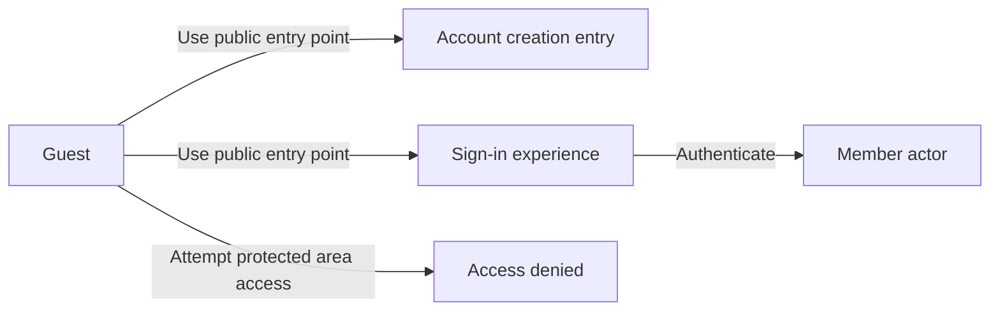

## member Actor

A member is an authenticated user who belongs to one or more organizations and works within a selected organization context. This actor represents the signed-in identity that can carry permissions assigned through an organization role. A member may have different access levels in different organizations because roles are managed separately within each organization. The member actor can be linked to a shared global profile that stays consistent across organizations. Members may also be associated with employee records inside organizations where they participate. The access boundary for a member is defined by the active organization context and the permissions attached to that role. Some members have full control as owners, while others are limited to manager or employee capabilities. A member can remain signed in while switching between organizations, but the active context must be clear before any scoped access is allowed. If a member loses organization membership or assigned access, the available actions are reduced accordingly. Member access is therefore authenticated, role-based, and organization-aware.

### Member Actor Identity

A member is an authenticated user who belongs to one or more organizations.
A member acts within a selected organization context when accessing organization-scoped information.
A member’s access is role-based and depends on the role assigned within the selected organization.
A member may have different access boundaries in different organizations because roles are managed separately in each organization.
A member remains the same authenticated user when switching between organizations, but the active organization context changes.
A member’s global profile is shared across all organizations the member belongs to.
A member may be associated with employee records in organizations where the member participates.

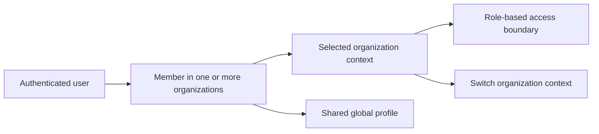

### Organization Membership and Context

A member has organization membership in each organization where the member participates.
A member can belong to multiple organizations at the same time.
A member can work in only one selected organization context at a time.
A member must have a selected organization context before organization-scoped access is allowed.
A member can switch organization context without signing out.
When the member switches organization context, the system applies the permissions and access boundary of the newly selected organization.
If the member loses membership in an organization, that organization is no longer available as a selected context.

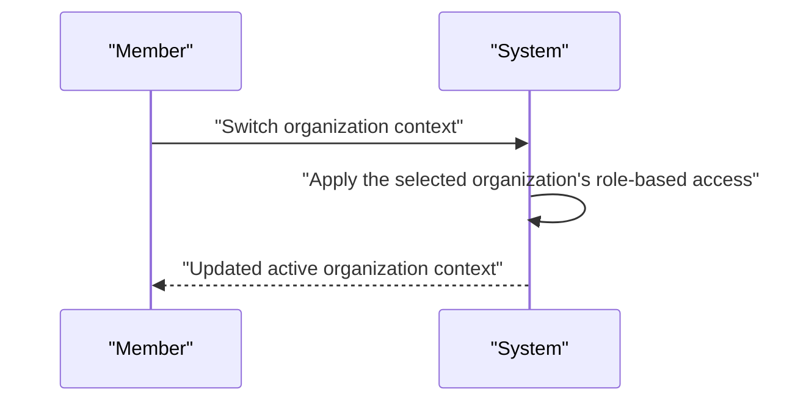

### Role-Based Access Levels

A member’s role defines the member’s access boundary within the selected organization.
Owner access provides full access to all organization features and includes management of roles and members.
Manager access allows access to manager-level capabilities within the organization.
Employee access allows access to employee-level capabilities within the organization.
A member may have owner access in one organization and a different access level in another organization.
A member’s available actions are reduced when the member’s organization membership or role assignment changes.
A member cannot use organization-scoped features outside the selected organization context.

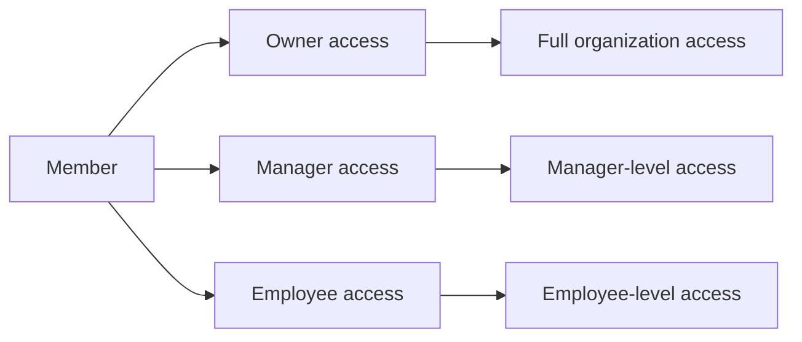

# Authentication Flows

Registration, login, logout, and session management from a user perspective.

## Registration and Login

Define user registration and login flows including validation and error handling.

### Registration

Users can register with an email address and password.
When a user registers, the system creates a user account and an initial organization context as part of the sign-up flow.
When the email address already belongs to an existing user account, the registration request is rejected.
When the email address has a pending invitation to one or more organizations, the user becomes associated with those organizations after registration.
A user can belong to multiple organizations through registration and invitation-based membership.
Each registered user has a shared profile that can be used across every organization they belong to.
Registration is available to guests only; a member who already has an account does not register again for the same account.

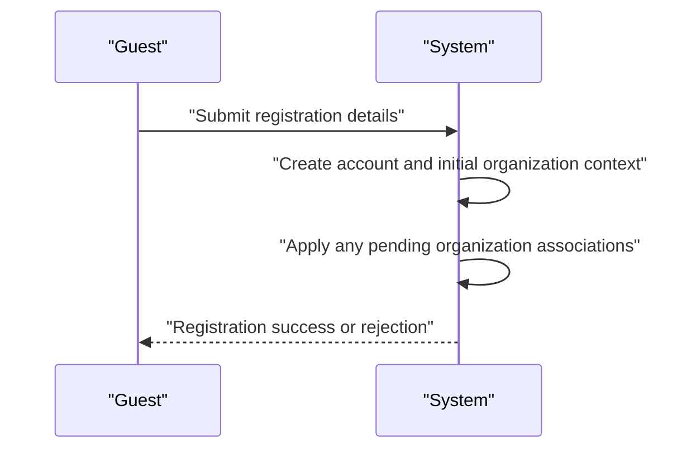

### Login

Users can log in with an email address and password.
When login succeeds, the user selects one organization to work in.
After an organization is selected, the user performs subsequent actions within that organization context.
A user who belongs to multiple organizations can switch between organizations without logging out.
A user who belongs to one organization can still log in and continue working in that single organization context.
When the email address or password is not valid, the login request is rejected.
When the user account exists but the user does not have access to the selected organization, the login flow does not establish that organization context.

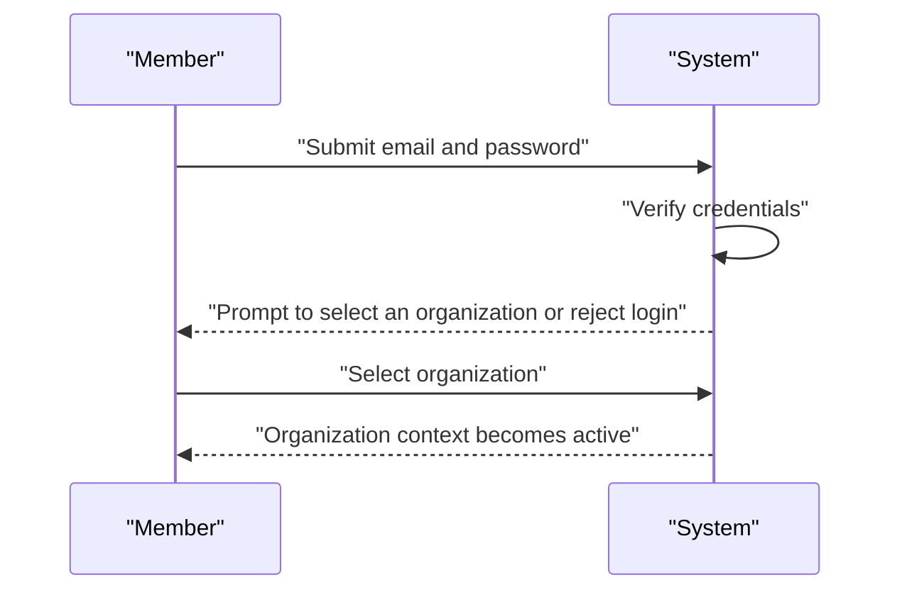

### Authentication

Authentication is based on a user proving control of the registered email address through the matching password.
The system recognizes the user account after successful authentication and uses that account for access to the selected organization.
All authenticated actions are scoped to the currently selected organization.
A user who is authenticated in one organization remains the same person when switching to another organization they belong to.
If authentication fails, the system does not grant access to organization-scoped actions.
If the user is not authenticated, the system treats the person as a guest.
Authentication rules apply consistently across registration and login so that the same user account is used for future access.

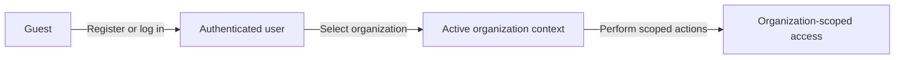

## Session and Logout

Define session behavior and logout from a user perspective.

### Session

Users maintain a signed-in session after authentication and can continue working within the selected organization context until they end the session or it expires through normal sign-out behavior. A user who belongs to more than one organization can switch between organizations without signing out, and all actions remain limited to the currently selected organization.

When a user is signed in, the system keeps the session tied to that user account and to the selected organization context. If the user changes organization, the session remains active and subsequent actions apply only to the newly selected organization. If the user is not signed in, the system does not allow access to organization-scoped actions.

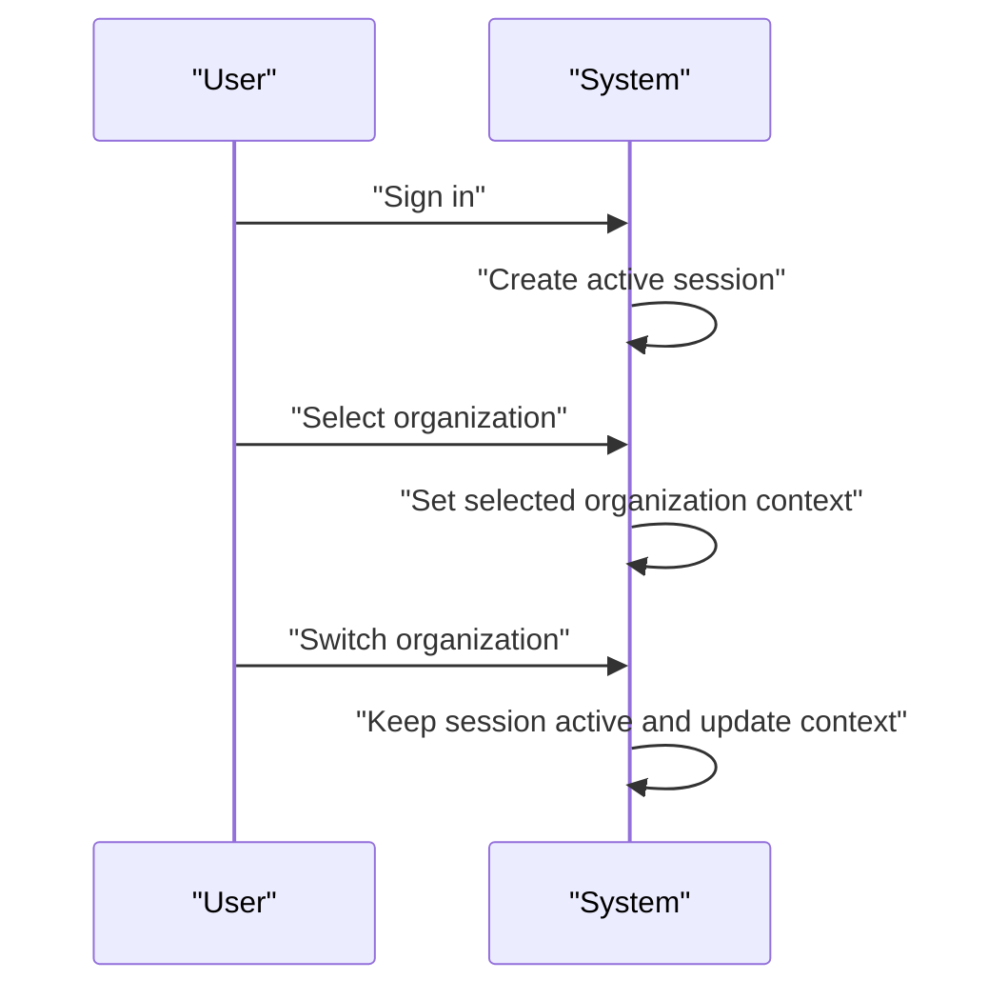

### Logout

When a signed-in user chooses to log out, the system ends the current session and removes access to the selected organization context. After logout, the user must sign in again before performing any organization-scoped action.

If a user is signed in to one organization context and logs out, the logout applies to that active session. Logging out does not change the user’s account, profile, or membership records.

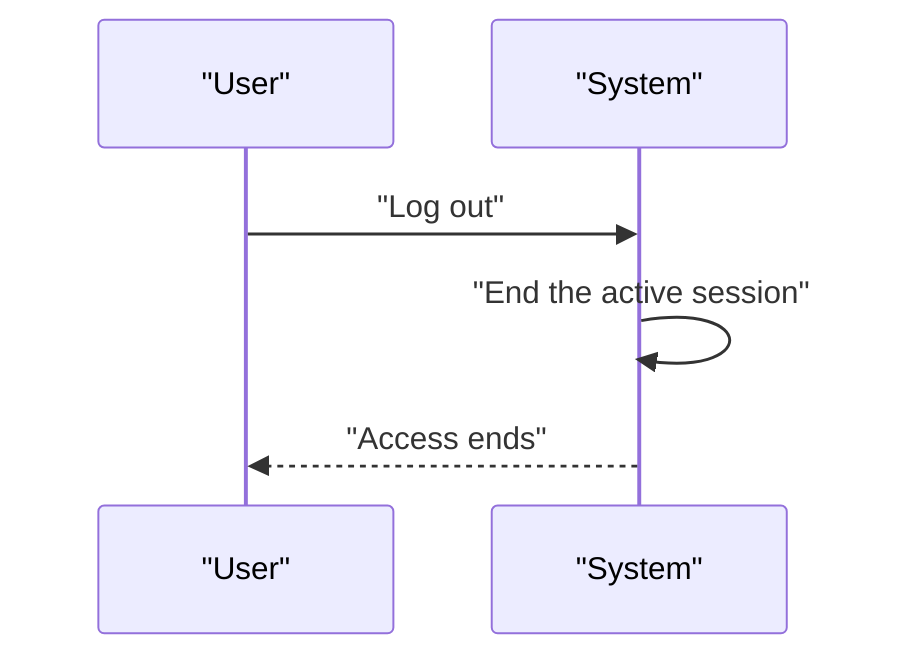

### Account Security

The system requires users to sign in with their email and password before they can access organization-scoped features. A user can change their password while signed in, and the updated password is used for future sign-in attempts.

The system treats the user account as separate from organization membership. If a user loses access to one organization, their user account remains available unless the account itself is deleted through the account lifecycle rules defined elsewhere.

If a user account is deleted, the system preserves the user’s account-level history only as allowed by the account lifecycle rules, and the user can no longer use that account to sign in. If the deleted user had employee records in other organizations, those records are marked as deactivated as defined in the account lifecycle rules.

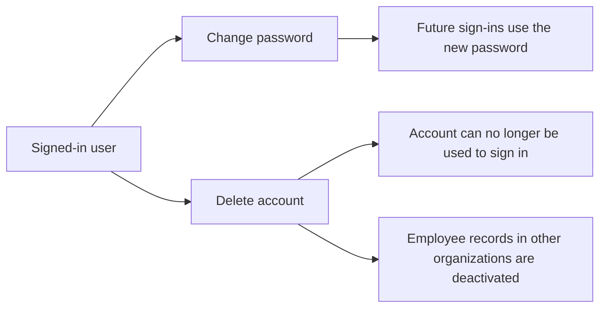

# Account Lifecycle

Account creation, deletion, and password management.

## Account Management

Define how users create accounts, delete accounts, and change passwords.

### Account Creation

Users can create an account using an email address and password.
An account creation request also creates an organization during initial sign-up.
The organization created during sign-up becomes the user’s first organization context.
The account can later belong to multiple organizations.
If the email address already exists as a user account, the system does not create a duplicate account.
If the email address matches a pending invitation, the user is added to the invited organization when the account is created.
The user’s global profile is available from the new account and is shared across every organization the user joins.

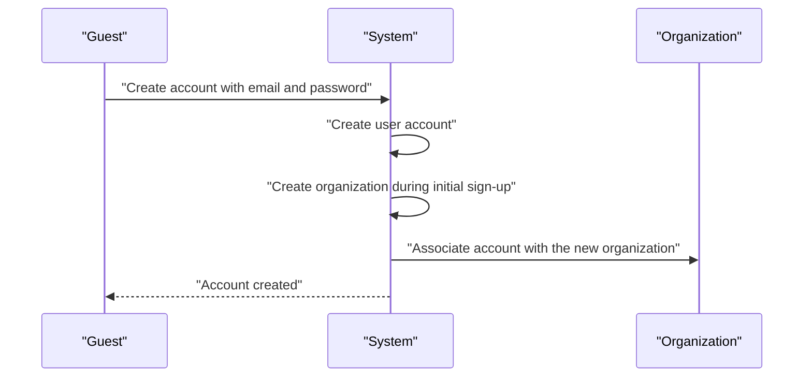

### Account Deletion

A user can delete their account.
If the user is the sole owner of an organization, the user must transfer ownership or delete the organization before account deletion can proceed.
When an account is deleted, the user’s employee records in other organizations are marked as deactivated.
When an organization is deleted as part of this lifecycle, the owner’s account remains but is no longer associated with any organization.
When an organization is deleted, all organization-scoped operational data is permanently removed.
Account deletion does not remove the user’s shared profile from organizations that still reference the account unless those organization memberships are also removed by the organization lifecycle.

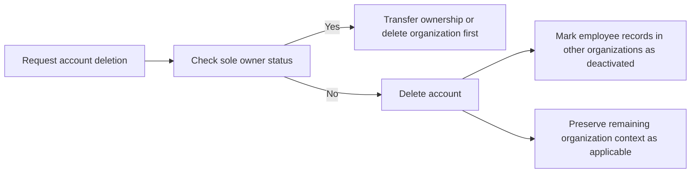

### Password Change

A user can change their password after signing in.
The password change action applies to the user’s account and does not create a new account.
After a password change, the user continues to use the same account and organization memberships.
A password change is part of account lifecycle management and is independent of organization-specific data.

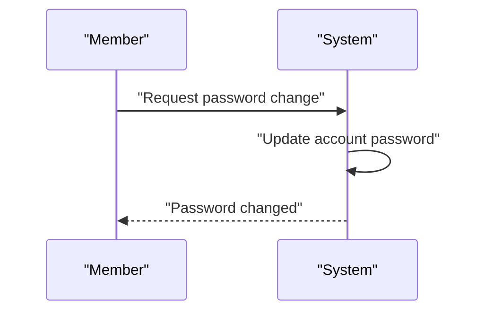