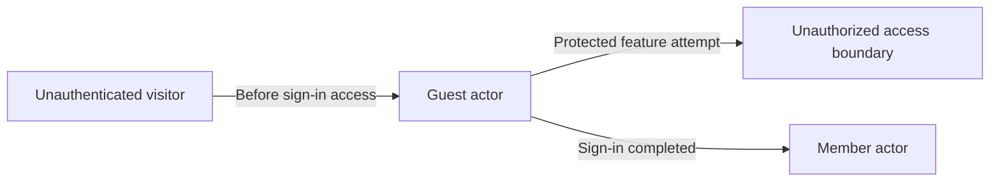
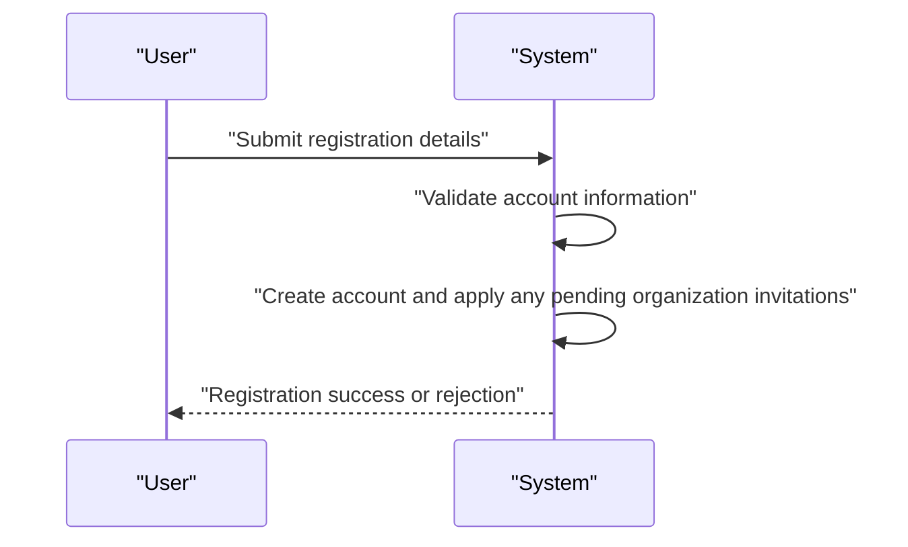
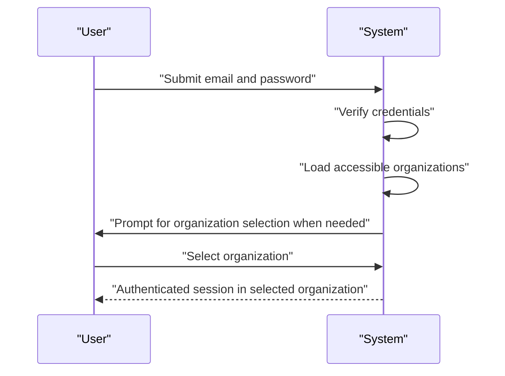
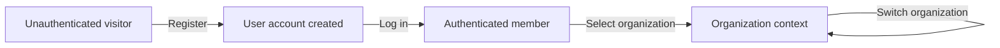
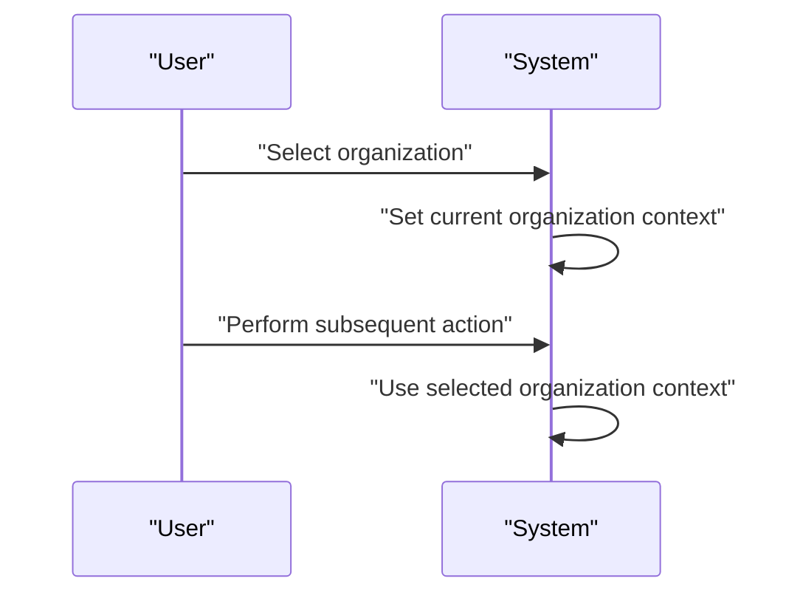
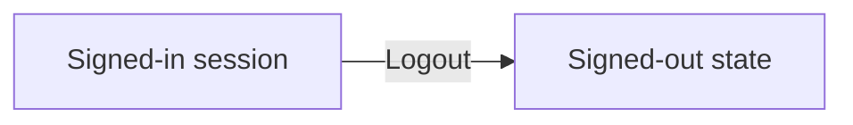
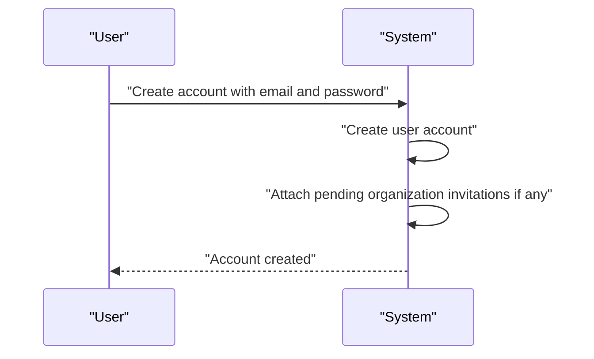
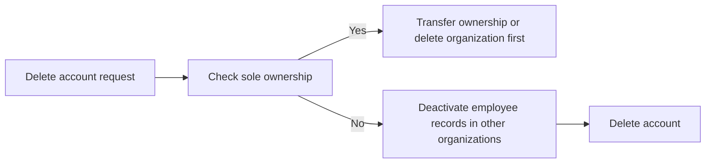
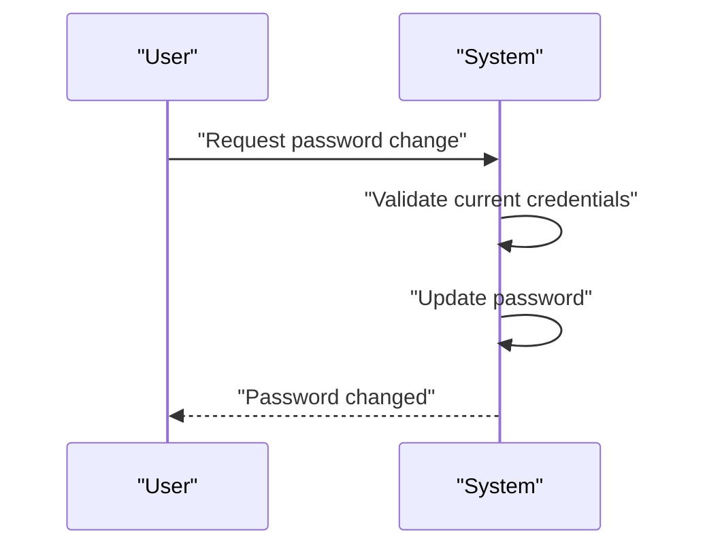

**erpHrmTime — Actor definitions, permission matrix, authentication, session, account lifecycle**

Actor definitions, permission matrix, authentication, session, account lifecycle

# Actor Definitions

Define all user actor types with their identity, permissions, and access boundaries.

## guest Actor

A guest is an unauthenticated person who has not signed in to the platform. Guests do not have access to organization-scoped work areas or member-only information. They are outside the normal permission model used for employees and organization owners. A guest can reach only the parts of the experience that are available before account access is established. They cannot act on behalf of an organization because no organization context is selected for them. They also cannot exercise any role-based permissions because role assignment applies only after membership exists. If a guest tries to use protected features, the platform must treat the request as unauthorized. Guests become a member actor only after they complete the account and organization entry flow.

### Guest Actor

A guest is an unauthenticated visitor whose account access has not been established. Guests exist before sign-in and therefore have no selected organization context. They are outside the membership model used for signed-in users and organization members.

Guests do not have role-based permissions because roles apply only after a user becomes a member of an organization. Guests cannot operate on behalf of any organization.

Protected features are blocked for guests. If a guest attempts to access a protected feature, the system treats the attempt as unauthorized.

Guests can only reach parts of the platform that are available before sign-in. They do not have access to organization-scoped work areas or member-only information until they complete the account access flow and become a member actor.

## member Actor

A member is a signed-in user who has access to one or more organizations through membership. Members act within the organization context they have currently selected. Their access is controlled by the role assigned in that organization, and the same person can have different roles in different organizations. Some members are organization owners with full access, while others may have manager or employee-level access, or a custom role with selected permissions. Members can only use features that match their assigned permissions in the active organization. If a member switches to another organization, the available access changes with that organization’s membership and role. A member may also belong to multiple organizations and move between them without logging out. When membership is removed or deactivated, that person no longer has the same access boundaries in that organization.

### Member Actor

A member is a signed-in user who accesses the system through one or more organization memberships.

Members operate within exactly one selected organization context at a time. Their visible access and available actions are determined by the organization membership and the role assigned in that organization.

The same person may belong to multiple organizations. When a member changes the selected organization, the access available to that member changes to match the selected organization membership.

A member may have different roles in different organizations. Role-based access is evaluated separately for each organization membership, not globally across all organizations.

A member's access is limited to the permissions assigned through the role for the selected organization.

If a member's organization membership is inactive, their access in that organization is no longer available while the inactive membership remains associated with the account.

### Organization Membership

An organization membership links a signed-in user to a specific organization and establishes that user's access scope in that organization.

Each membership has a membership status that determines whether the member currently has access in that organization.

A member can have memberships in multiple organizations at the same time.

The member's active access is always evaluated against the selected organization membership, not against other memberships the same user may hold.

When a member belongs to more than one organization, each membership is independent and does not grant access to data or actions in other organizations.

### Role-Based Access

Each organization defines access through roles assigned to its members.

The built-in roles are Owner, Manager, and Employee.

The Owner role has full access to all features and can manage roles and members.

The Manager role can manage employees and projects, approve timesheets, and view reports.

The Employee role can track time, submit timesheets, and view their own data.

Organization owners can create custom roles for their organization.

A custom role has a name and a set of permissions assigned to it.

A member can use only the features allowed by the permissions attached to the role assigned in the selected organization.

### Assigned Permissions

The available permissions are organization management, employee management, employee viewing, project management, project viewing, time management, time approval, viewing all time records, and report viewing.

Permissions granted to a member apply only within the organization where the role is assigned.

A member with organization management permission can edit organization settings.

A member with employee management permission can add, edit, and deactivate employees.

A member with employee viewing permission can view the employee list and details.

A member with project management permission can create, edit, and delete projects and tasks.

A member with project viewing permission can view projects and tasks.

A member with time management permission can edit or delete any employee's timelogs.

A member with time approval permission can approve or reject timesheets.

A member with permission to view all time records can view all employees' timelogs and timesheets.

A member with report viewing permission can view organization reports.

### Switching Organization Context

A member who belongs to multiple organizations can switch between those organizations without logging out.

After switching, the member continues as the same signed-in user, but the active access context changes to the newly selected organization.

A member can only act within the organization that is currently selected.

When the selected organization changes, the member's effective role and permissions also change to those assigned in the newly selected organization.

### Membership Status

Membership status indicates whether a member's access in an organization is currently active.

A member with an inactive membership does not have the same access boundaries as an active member in that organization.

If a membership is removed or deactivated, the member can no longer use the access that depended on that membership in that organization.

Membership status is evaluated per organization, so one inactive membership does not affect the member's access in other organizations where they remain active.

# Authentication Flows

Registration, login, logout, and session management from a user perspective.

## Registration and Login

Define user registration and login flows including validation and error handling.

### Registration

Users can register with an email address and password.
During registration, a user creates a new account and the account can be associated with an organization as part of the initial sign-up flow.
If the email address is already in use, registration is rejected.
If required registration information is missing, registration is rejected.
A user who signs up with an email address that matches a pending organization invitation is automatically added to the pending organization memberships defined in the invitation.
A user account created through registration supports a shared profile across all organizations the user later joins.

### Login

Users can log in with email and password.
When login succeeds, the user becomes authenticated as a member and can continue working in an organization context.
If the email address or password is invalid, login is rejected.
If a user belongs to multiple organizations, the login flow requires the user to select which organization to work in before subsequent actions are scoped.
All actions performed after login are scoped to the selected organization until the user switches organization.
A user can switch organization context without logging out.

### Authentication

Authentication is based on a user proving identity with email and password.
A successful authentication establishes the user as a signed-in member with access governed by the selected organization context.
A user remains associated with the organizations they belong to, and access is limited to the currently selected organization.
If authentication is attempted with unrecognized credentials, the request is rejected.
If a user has access to more than one organization, the system does not treat the login as complete until an organization is selected for the current work context.
Authentication supports users who belong to multiple organizations without requiring separate accounts for each organization.

## Session and Logout

Define session behavior and logout from a user perspective.

### Session

A signed-in user works within a selected organization context for all subsequent actions.

The selected organization context applies to all actions until the user changes it or ends the session.

A user who belongs to multiple organizations can switch between organizations without signing out.

When the user switches organizations, the system uses the newly selected organization context for subsequent actions.

The session must always reflect the user's current organization context, so the user only sees data for the selected organization.

### Logout

A signed-in user can end the current session by logging out.

After logout, the user is no longer signed in and no longer has an active organization context.

After logout, the user must sign in again before performing any signed-in action.

Logging out does not change the user's account profile or membership records.

### Account Security

Users can change their password.

The system keeps the user's shared profile separate from organization-specific membership data.

When a user deletes their account, the system applies the account deletion rules defined in the account lifecycle requirements.

If the user is the sole owner of an organization, the user must transfer ownership or delete the organization before the account can be deleted.

When a user deletes their account, the user's employee records in other organizations are marked as deactivated.

A user account may belong to multiple organizations, and account changes apply to the shared account rather than to a single organization membership.

The user's profile is shared across all organizations the user belongs to, so profile changes are visible in every organization.

If the user has pending invitations associated with the email address, signing up with that email automatically adds the user to the pending organizations.

# Account Lifecycle

Account creation, deletion, and password management.

## Account Management

Define how users create accounts, delete accounts, and change passwords.

### Account Creation

Users can create an account using an email address and password.

When a new account is created, the user may also create an organization during the initial sign-up process.

If the email address was previously invited to one or more organizations, the newly created account is automatically associated with those pending organizations.

An account may belong to multiple organizations over time.

### Account Deletion

Users can delete their own account.

If a user is the sole owner of an organization, the user must transfer ownership or delete the organization before deleting the account.

When an account is deleted, the user's employee records in other organizations are marked as deactivated.

A deleted account no longer remains associated with organizations that are not preserved through the deactivation behavior described above.

If the user still has sole ownership of an organization, account deletion is rejected until the ownership constraint is resolved.

### Password Change

Users can change their password after signing in.

Password changes apply to the user's account and affect future sign-in attempts.

If the user does not provide the required current account credentials for password change, the request is rejected.

