**erpHrmTime — Business concepts, relationships, and states from user perspective**

Business concepts, relationships, and states from user perspective

# Domain Concepts

Describe what each concept means in the business domain and its key attributes.

## Organization Concept

An organization is the main business boundary in the platform and represents one independent company or team environment. Each organization keeps its own employees, projects, tasks, timelogs, and timesheets separate from other organizations. It is identified by a business-facing profile that includes a name, description, logo image, currency, timezone, and fiscal start month. The organization is the context that defines which data a user is currently working with. Ownership of an organization is significant because owners carry the highest level of control within that organization. The organization concept also helps explain why the same user can belong to multiple organizations without mixing their records. When an organization no longer exists, its related operational data is treated as part of that organization’s complete business history rather than a shared global pool.

### Organization Concept

An organization is the primary business boundary in the platform. It represents one independent company or team environment and defines which data belongs together under a single business context. The same user may belong to multiple organizations, but each organization keeps its own records separate from the others.

The organization concept is the foundation of the platform’s multi-tenancy boundary. Data created within one organization is not mixed with data from another organization, and each organization is treated as an independent business space.

The organization is described by the following business attributes, which define its identity and operating context:
- Organization name: the business name used to identify the organization.
- Organization description: a short explanation of what the organization represents.
- Logo image: a visual identifier for the organization.
- Currency: the monetary unit used for organization-related financial values.
- Timezone: the local time setting used for the organization’s business context.
- Fiscal start month: the month that defines the start of the organization’s fiscal year.

These attributes belong to the organization itself and are part of its business profile. They help distinguish one organization from another and give each organization its own operational identity.

Organization context means the selected organization a user is currently working in. All work performed by a user is interpreted within that selected organization, which ensures that the user sees and acts on the correct organization’s data.

An organization’s data is independent from other organizations’ data. This independence applies to the organization’s business records and to the user’s experience when working within a selected organization.

## UserAccount Concept

A user account represents the global identity used to access the platform. It belongs to a person who signs in with an email and password and may participate in more than one organization. The account carries profile information that is shared across organizations, including display name, avatar image, and phone number. This concept is separate from organization-specific employee records, so one person can have a single account while appearing in several organizations in different roles. The account is also the anchor for personal access decisions, such as switching between organization contexts. Because the profile is global, the same identity can be recognized consistently wherever the user works. The user account is therefore the personal layer above all organization-specific business data.

### User Account Concept

A user account is the platform-wide identity for a person who uses the ERP system. It is the business concept that connects the person’s access, identity, and shared profile across all organizations they belong to.

The user account is identified by email identity and protected by a password credential. These are the account-level access attributes used for sign-in and account access.

The user account includes a global profile that is shared across organizations. The profile contains the display name, avatar image, and phone number. Because the profile is global, the same personal identity is visible consistently in every organization context the user joins.

A user account may belong to multiple organizations at the same time. The account therefore exists above organization-specific membership and role assignments, while the organization-specific details remain separate from the shared profile.

The organization context selection is part of how the user account is used within the platform. When a person belongs to more than one organization, the account supports choosing which organization context is currently active so that work is performed within the selected organization.

In business terms, the user account is the stable personal identity layer that persists across organizations, while organization-specific access and work data are handled elsewhere in the domain model.

### Email Identity

Email identity is the account-level identifier associated with a user account. It is the business means by which the system recognizes the person for access and account association.

The email identity is shared across the user account’s participation in multiple organizations because the same account can be connected to more than one organization.

The email identity belongs to the user account concept and is not an organization-specific attribute.

### Password Credential

The password credential is the secret associated with a user account for access to the platform.

It is part of the user account concept and supports sign-in for the person behind the account.

The password credential belongs to the account itself rather than to any one organization, so it remains the same shared access credential across the user’s organization memberships.

### Global Profile

The global profile is the shared personal profile attached to the user account.

It contains the display name, avatar image, and phone number. These profile attributes are shared across all organizations the user belongs to, so updates to the profile apply consistently everywhere the account appears.

The global profile exists independently of organization-specific employee records and membership details.

### Multiple Organization Membership

A single user account can belong to multiple organizations.

This means the same personal identity can participate in more than one organization while keeping one shared global profile.

The account remains the common identity across those organizations, while each organization maintains its own separate business data and access context.

### Organization Context Selection

When a user account belongs to more than one organization, the account supports choosing which organization context is currently active.

The selected organization context determines which organization the person is acting within at that moment.

The context belongs to the user account’s usage within the platform and reflects that the same person can work in different organizations without creating a separate account for each one.

## OrganizationMembership Concept

An organization membership is the business record that links a user account to a specific organization. It defines that user’s place inside that organization without affecting their access in other organizations. The membership includes the currently selected organization context and the role the person holds within that organization. It also reflects the membership status, which indicates whether the person is actively part of the organization or not. This concept is important because permissions and visibility are evaluated within the boundaries of the selected organization. A single user can have multiple memberships, each one standing for a different organizational relationship. The membership record is the bridge between a global account and organization-scoped work.

### Organization Membership

An organization membership is the business record that connects a user account to a specific organization. It represents the person’s standing inside that organization and defines their organization-scoped access without changing their relationship to any other organization. The same user account can have multiple organization memberships, with each membership representing a separate organization-specific relationship.

The organization membership includes the selected organization context, which identifies the organization currently in use for that membership. It also includes the organization-specific role assigned within that organization and the membership status that indicates whether the membership is active or not active.

The membership record is the business representation of the user-to-organization link. It exists to show that a user belongs to an organization and to distinguish that relationship from the user’s global account profile. In this platform, access is evaluated within the boundaries of the selected organization context, so the membership is the point where global identity meets organization-scoped access.

Mermaid diagram:
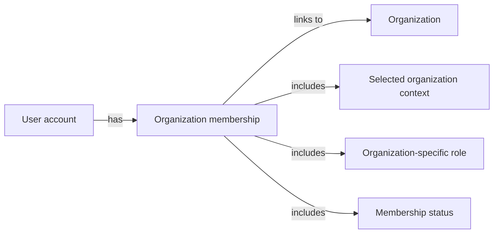

Key attributes:

| Attribute | Meaning |
|---|---|
| Selected organization context | The organization that is currently active for the membership |
| Organization-specific role | The role held by the user within that organization |
| Membership status | Whether the membership is active or not active |

Important business meanings:
- A membership is always tied to one organization.
- A user may have multiple memberships across multiple organizations.
- Active membership indicates that the user is currently part of the organization.
- Organization-scoped access applies only within the selected organization context.
- The membership record is separate from the user’s shared profile and other memberships.

## Role Concept

A role describes the level of responsibility a person has inside an organization. Roles are organization-specific, so the same role name or permission set does not automatically apply across different organizations. The platform includes built-in roles for Owner, Manager, and Employee, and these built-in roles form the default business model for access and responsibility. In addition, organizations can define custom roles to match their internal structure. A role is identified by its name and the permissions attached to it. Permissions express what someone can manage, view, approve, or update within the organization. This concept captures how access is organized without describing the detailed workflows behind each permission.

### Role Concept

A role is the business concept that describes the level of responsibility a person has within an organization. It defines how access and responsibility are organized in an organization-specific way, so the same role name or permission set does not automatically apply across different organizations.

A role belongs to exactly one organization and is used only within that organization. Each employee in an organization is assigned exactly one role, which makes the role the primary way the organization expresses access responsibility for that employee.

A role is identified by its role name and its permission set. The role name is the business label used to recognize the role, and the permission set is the collection of permissions attached to that role. Together, these attributes define what the role means in business terms.

The platform includes built-in roles and custom roles. Built-in roles are part of the standard business model and represent the default access responsibility structure used by the platform. Custom roles are organization-specific roles created by an organization to match its own internal structure and responsibility model.

The built-in roles are Owner, Manager, and Employee. These built-in roles are defined as follows:
- Owner: the highest responsibility role in an organization, with full access to the organization’s features and the ability to manage roles and members.
- Manager: a role for managing employees and projects, approving timesheets, and viewing reports.
- Employee: a role for tracking time, submitting timesheets, and viewing own data.

A custom role has the same business identity pattern as a built-in role, but its name and permission set are defined by the organization. Custom roles allow an organization to express additional or adjusted access responsibility without changing the built-in role model.

A role’s permission set is the business description of what that role can manage, view, approve, or update within the organization. The role concept does not describe how those actions are performed; it only defines the responsibility structure that other parts of the system use.

## Employee Concept

An employee is the organization-specific representation of a user account within a particular organization. It shows how that person participates in work such as projects, time tracking, and internal reporting. The employee concept includes department, position or title, employment type, and status. Employment type can distinguish full-time, part-time, contractor, and intern workers. Status captures whether the person is active or deactivated in that organization. Because the employee record is scoped to one organization, the same user may have separate employee identities in different organizations. This concept is central to understanding workforce structure inside each organization.

### Employee Concept

An employee is the organization-specific worker record that represents how a user account participates in work within a particular organization. It is the business concept used to describe that person’s standing in the organization, including their department, position or title, employment type, and status.

An employee belongs to one organization and is separate from the shared user account profile (defined in UserAccount Concept). This means the same person can have different employee records in different organizations, with different roles, departments, positions, or employment statuses.

The employee concept is defined by the following business attributes:
- Department: the organizational unit the employee is associated with, if any.
- Position or title: the person’s job title or role description within the organization.
- Employment type: the category used to describe the working arrangement.
- Status: the current condition of the employee record within the organization.

The employment type attribute can take one of four business values:
- Full-time
- Part-time
- Contractor
- Intern

The status attribute can take one of two business values:
- Active status
- Deactivated status

An active employee is a current worker record in the organization. A deactivated employee is still part of the organization’s historical record but is no longer treated as active for day-to-day participation in work. The distinction between active status and deactivated status is part of the employee concept itself and is used to describe whether the employee record is currently active in the organization.

Mermaid summary of the concept:
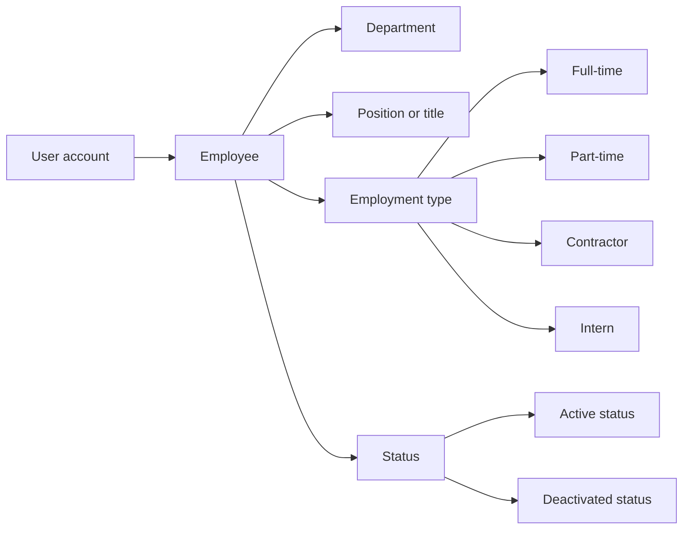

## EmployeeContract Concept

An employee contract represents a historical employment arrangement between an employee and an organization. It captures the period during which a particular pay arrangement applies and preserves the employment record over time. The contract includes a start date, an optional end date, a pay rate, a pay period, weekly working hours, and optional notes. Because contracts are historical, they help show how employment terms changed across time. Only one contract can be active for an employee at any given moment, which makes the contract history meaningful for payroll and workforce understanding. A contract is tied to the employee rather than to the global user account. This concept describes compensation and working-time expectations in business terms.

### EmployeeContract Concept

An employee contract is the business record that defines the employment arrangement between an employee and the organization over time. It represents the employee’s historical employment record and shows how compensation and working-time expectations change across the employee’s tenure.

The contract includes the start date, which marks when the arrangement begins, and an optional end date, which marks when it stops. A missing end date means the contract is ongoing. This allows the organization to preserve a complete contract history instead of replacing old arrangements.

The contract also includes the pay rate, the pay period, the working hours per week, and optional notes. These attributes describe how the employee is compensated and how much work is expected during the contract period.

Only one contract can be active for an employee at any given time. The active contract is the one currently defining the employee’s employment terms, while earlier contracts remain part of the contract history as historical records.

The contract belongs to the employee rather than to the global user account, so the same person may have different contract histories in different organizations. The concept is used to preserve past and current employment terms in a way that supports historical understanding of the employee’s work arrangement.

## Department Concept

A department is an internal organizational grouping used to structure employees within one organization. It provides a way to organize people by business area, team, or function. Each department has a name and description, and it may also belong under a parent department. The parent relationship is limited to one level of nesting, which keeps the structure simple and readable. Departments do not define access by themselves, but they help describe how the workforce is arranged. Employees may be associated with a department, while some employees may not belong to one. This concept is useful for understanding organizational hierarchy and workforce segmentation.

### Department Concept

A department is an internal organizational grouping used to structure employees within one organization. It represents a way to classify the workforce by business area, team, or function so the organization can describe how people are arranged.

The department concept belongs to the business domain of organizational structure. Its purpose is to support employee grouping and help explain the internal workforce structure of the organization from a business perspective.

A department has the following business attributes:
- Department name: the identifying name of the department.
- Department description: a textual description of what the department represents.
- Parent department: an optional higher-level department used to place the department within a simple hierarchy.

The parent department relationship is limited to one level of nesting. This means a department may be placed under one parent department, but deeper hierarchies are not part of the model.

Departments are used to organize employees into meaningful groups, such as business areas or teams, and they provide a readable classification of the organization’s workforce. Some employees may belong to a department, while others may remain unassigned to any department.

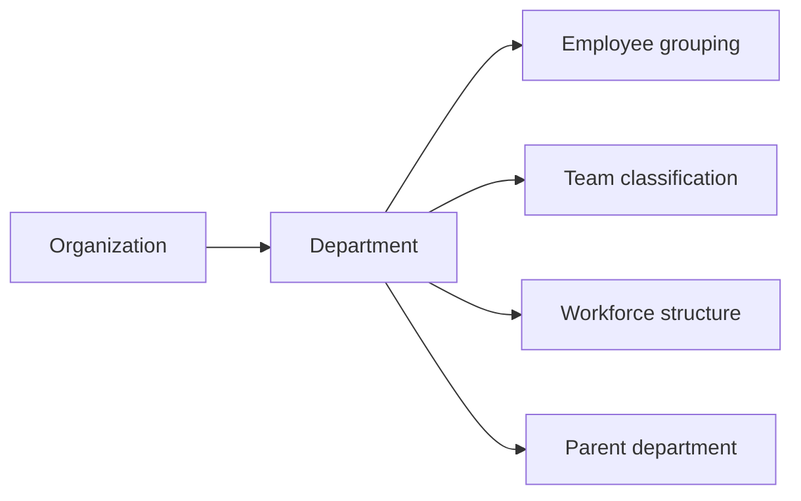

## Project Concept

A project is a work container used to organize time, tasks, and assigned employees within an organization. It helps separate one business initiative from another and provides a clear place to track effort. Each project has a name, description, and color code for easy recognition. It also carries a status that shows whether the project is active, archived, or completed. Additional planning details may include budget hours, a start date, and an end date. Projects are scoped to a single organization, so they never mix with work from another organization. This concept is the foundation for linking people, tasks, and logged time to a shared business goal.

### Project Concept

A project is a business concept that represents a work container within an organization. It groups related work so the organization can separate one initiative from another and track effort against a shared business goal.

The project concept defines the following attributes in business terms:

- Project name: the human-readable name used to identify the project.
- Project description: a free-form explanation of what the project is for.
- Color code: a visual identifier used to distinguish the project in displays.
- Status: the current state of the project, which can be active, archived, or completed.
- Budget hours: the planned total amount of effort for the project when budgeting is used.
- Start date: the date the project is intended to begin.
- End date: the date the project is intended to finish.

A project belongs to a single organization and represents work only within that organization. It is the central place for organizing assigned employees, tasks, and logged time around one business initiative.

Mermaid diagram:
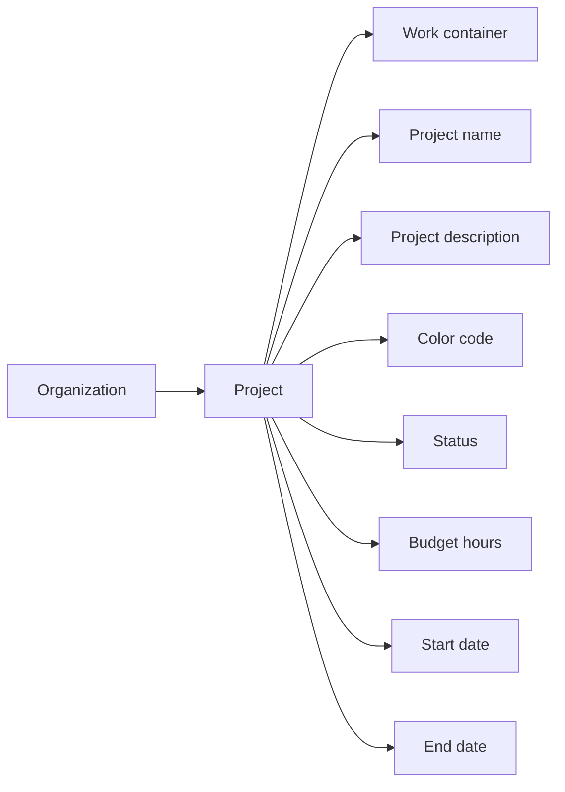

The project status is used to express where the project is in its business lifecycle:

- Active status means the project is currently in use for ongoing work.
- Archived status means the project is set aside from active use.
- Completed status means the project has finished its intended work.

Mermaid diagram:
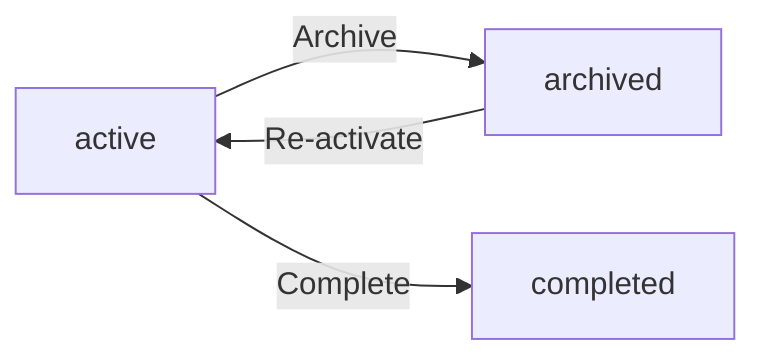

The project concept is also the parent business container for project-related work items. Tasks belong to a project, and time logged by employees is associated with a project so the organization can see effort in the context of that work container.

## ProjectMembership Concept

A project membership represents the connection between an employee and a project. It shows that the employee is assigned to participate in that project’s work. The membership includes the employee, the project, and the assigned role within that project. The assigned role can distinguish a regular member from a project lead. This concept explains how teams are formed around individual projects without changing the employee’s broader organization role. A single employee can belong to multiple projects, and each project can include multiple employees. Project membership is therefore the project-level counterpart to organization membership.

### Project Membership

A project membership represents the business relationship between an employee and a project. It means the employee has been assigned to participate in that project’s work and is part of that project’s team for the scope of that project.

This concept is project-level rather than organization-level. A project membership does not change the employee’s broader organization role; it only defines the employee’s participation within a specific project.

The project membership includes the employee, the project, and the assigned role within that project. The assigned role identifies whether the employee participates as a regular member or as a project lead.

A single employee can have multiple project memberships at the same time, allowing participation in more than one project. A single project can also have multiple project memberships, allowing several employees to be assigned to the same project team.

Project membership is the business concept used for project staffing. It shows who is assigned to which project and in what capacity, without describing how assignments are created or managed.

## Task Concept

A task is a unit of work inside a project that helps break project delivery into manageable pieces. It carries a title and may also include a description to clarify the work. The task concept includes status, priority, estimated hours, due date, and an optional assigned employee. Tasks can also have a parent task, which creates a simple one-level subtask structure. Because tasks belong to projects, they stay within the business context of a specific project rather than the whole organization. The task concept helps teams describe what needs to be done and how urgent it is. It is the main work item used to connect project effort with time tracking and team responsibility.

### Task Concept

A task is a project work item used to describe a unit of work inside a project. It represents what needs to be done within the project context, rather than across the whole organization.

The task concept includes the task title, task description, status, priority, estimated hours, due date, assigned employee, and parent task. The task title identifies the work item. The task description provides additional context about the work. Status shows the current progress state of the task. Priority indicates how urgent or important the task is. Estimated hours describe the expected effort for the task. Due date identifies when the task is expected to be completed. Assigned employee identifies the employee responsible for the task. Parent task links the task to another task when the task is a subtask.

A subtask is a task that belongs under another task to break work into smaller parts. The parent task relationship supports a simple one-level nesting structure, so a task may have a parent task, but it does not create deeper task hierarchies.

Because tasks belong to projects, they remain scoped to the project they support and are used to organize and track project work in a structured way.

## TaskHistoryEntry Concept

A task history entry records a meaningful change in a task’s status over time. It preserves the status transition as part of the task’s business history. Each entry includes a timestamp, the previous status, the new status, and the person who made the change. This concept gives teams a traceable view of how work moved through its lifecycle. It is distinct from the task itself because it captures events rather than the current task state. By keeping these entries, the organization can understand when and by whom a task advanced or changed direction. The history entry is therefore an audit-style concept focused on task progress.

### Task History Entry Concept

A task history entry is a domain concept that represents a recorded change in a task’s status over time. It exists to preserve the business history of how work moved through its lifecycle and to provide an audit-style trace of task progress.

A task history entry is not the task itself. The task remains the current business item, while the history entry captures a past status change as a separate record of what happened.

A task history entry supports the organization’s need to understand when a task changed, what it changed from, what it changed to, and who made the change. This makes the record a meaningful part of the task’s lifecycle history and a reliable task progress record.

#### Business Meaning
A task history entry documents a significant status change in a task’s business lifecycle.
It provides traceability for task progress by preserving the previous status, the new status, the time of the change, and the person responsible.
It is used as an audit-style trace so the organization can review how task status evolved over time.

#### Attributes
A task history entry includes the following business attributes:

| Attribute | Meaning |
|---|---|
| Timestamp | The moment when the task status change was recorded. |
| Old status | The task status before the change. |
| New status | The task status after the change. |
| Who made the change | The person who performed the status change. |

These attributes define the entry as a historical record rather than a mutable current-state object.

#### Task Lifecycle History
A task may have multiple history entries over time, with each entry representing one status change in the task’s lifecycle.
Taken together, these entries form the task lifecycle history.
The history is ordered by the time each change was recorded, allowing the organization to reconstruct the sequence of task progress events.

#### Audit-Style Trace
The task history entry functions as an audit-style trace for task status changes.
It preserves the business facts of a change without replacing the task’s current status.
Because it records the previous status, the new status, the time of change, and the responsible person, it provides a clear historical trail of task progress.

## Timelog Concept

A timelog is a recorded entry of work time spent by an employee on a project. It is the basic unit used to represent how long someone worked on a specific day. The timelog includes a date, duration in minutes, a project, and optional task association. It may also contain a description of what was done and a billable flag to indicate whether the time is billable work. Timelogs belong to one employee and one organization, so they are part of that employee’s work history within that organization. They also provide the raw material for timesheets and reports. This concept is the business record of time spent, independent of how the time was captured.

### Timelog Concept

A timelog is a work time record that captures time spent by an employee on a project within the organization. It represents the business record of employee time entry and serves as the source material for timesheets and reports.

A timelog includes the date of the work, the duration in minutes, the project reference, and an optional task reference. It may also include a description of the work performed and a billable flag to indicate whether the time is billable.

The date identifies when the work was performed. The duration in minutes identifies how much time was spent. The project reference identifies the project the time belongs to. The task reference is optional and, when present, identifies the task the work was tied to. The description of work provides a short explanation of what was done. The billable flag marks the entry as billable or non-billable.

A timelog is an employee time entry that records time spent as a business fact, independent of how the time was captured.

## Timesheet Concept

A timesheet is a weekly collection of timelogs for one employee. It groups time entries into a business review period from Monday through Sunday. The timesheet concept includes the week start date, week end date, status, total hours, submitted time, review time, reviewer, and an optional rejection reason. It represents a structured summary of an employee’s recorded time rather than individual log entries. Timesheets are important because they show when work time is being prepared, reviewed, approved, or rejected. They also preserve the relationship between the employee’s own time records and the organization’s review process. This concept helps explain how weekly time capture becomes an accountable business record.

### Timesheet Concept

A timesheet is a business concept that represents a weekly collection of timelogs for one employee. It groups recorded time into a review period that runs from Monday through Sunday and serves as a structured employee summary of that week’s work time.

The timesheet concept includes the week start date, week end date, status, total hours, submitted time, review time, reviewer, and rejection reason. These attributes describe the timesheet as a weekly time collection and as a record of how that employee’s time was prepared and reviewed.

The week start date identifies the Monday that begins the timesheet’s week. The week end date identifies the Sunday that ends the same week. Together, these dates define the weekly boundary of the timesheet.

The status shows where the timesheet is in its review process. The total hours represent the combined hours from the timelogs included in the timesheet. The submitted time records when the timesheet was submitted for review. The review time records when the timesheet was approved or rejected. The reviewer identifies who completed that review. The rejection reason captures the explanation recorded when a timesheet is rejected.

A timesheet belongs to one employee and summarizes that employee’s time for a specific week. It is a distinct business record from the individual timelogs it collects, and it preserves the employee’s weekly time history as a reviewable summary rather than a line-by-line log entry.

## Timer Concept

A timer represents a running time-tracking session for an employee. It captures work time in real time before that time is turned into a timelog. The timer includes a start timestamp, a project, an optional task, and a description. It is tied to one employee and reflects the currently active piece of work being tracked. The timer concept is useful for understanding ongoing work before it becomes a saved time entry. Because it is a live working state, it stands apart from historical timelogs and timesheets. This concept describes the temporary business state of time being tracked right now.

### Timer Concept

A timer is the business concept that represents a live time-tracking session for an employee. It captures work time in real time before that time becomes a timelog, so it exists as a temporary work state rather than a historical record.

The timer reflects the currently active piece of work being tracked by the employee. It is associated with one employee and is used to represent work that is ongoing right now.

The key attributes of a timer are:
- Start timestamp: the point in time when the live session began.
- Project: the project the running session is associated with.
- Task: the task associated with the running session when one is present.
- Description: a short business description of what is being worked on.

A timer is distinct from a timelog because it describes work that is still in progress. Its business meaning is tied to real-time tracking and the employee’s active timer state while work is ongoing.

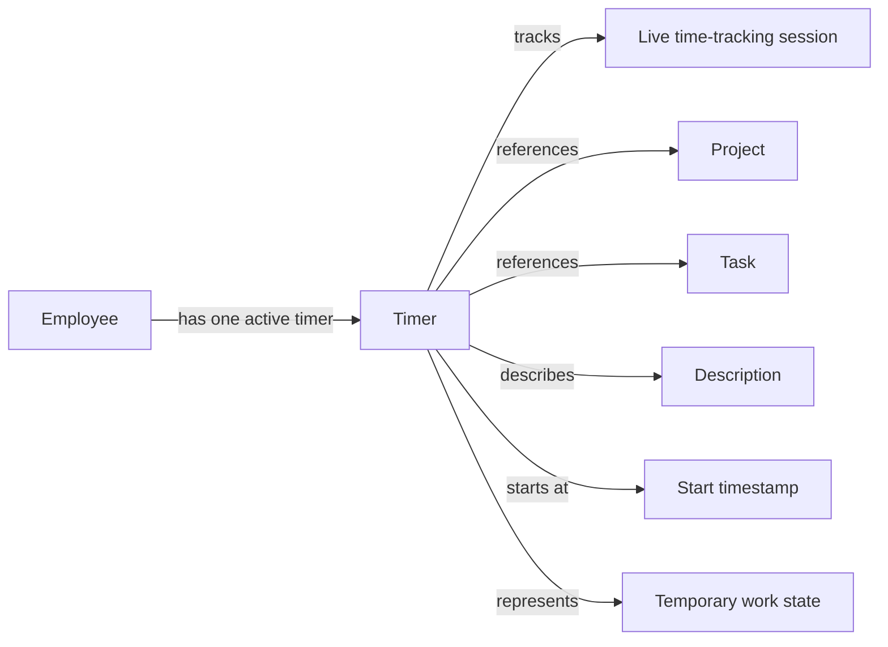

## ActivityLogEntry Concept

An activity log entry is a business record of a significant action performed in the organization. It provides a traceable history of important events so the organization can understand what changed and who changed it. Each entry includes a timestamp, the user who performed the action, the action type, the target entity, and supporting details. This concept is broader than a single object because it can describe changes to employees, contracts, projects, tasks, timesheets, or roles. Activity log entries help preserve accountability across major business actions. They are part of the organization’s operational memory and are useful for reviewing past decisions and changes. The entry concept focuses on the record of the event itself rather than the workflow that caused it.

### Activity Log Entry

An activity log entry is a business record of a significant action performed within an organization. It serves as the organization’s audit trail, preserving a historical record of important changes so the business can review what happened, when it happened, and who performed the action. It is also an accountability record because it ties each recorded action to a specific user and a specific target entity.

The concept focuses on the record of the event itself rather than the workflow that produced it. It is used to capture important organizational history across major business activities such as changes to employees, contracts, projects, tasks, timesheets, and roles.

Key attributes of an activity log entry:
- Timestamp: identifies when the significant action was recorded.
- User who performed the action: identifies the user responsible for the action.
- Action type: identifies the kind of business action that occurred.
- Target entity: identifies the business object affected by the action.
- Details: provides supporting information about the recorded action.

An activity log entry belongs to the organization’s historical record and supports traceability across the business domain. It is intended for reviewing past actions and understanding how the organization changed over time.

# Domain Relationships

Describe how concepts relate to each other from a business perspective.

## Conceptual Relationships

Describe how concepts relate to each other in business terms.

### Organization Relationships

The organization is the top-level business boundary for organization-scoped data. Each organization owns its employees, projects, departments, roles, timelogs, timesheets, tasks, and activity log entries. A user account may own one or more organizations, and an organization belongs to the user account that created it.

An organization has many users through organization membership. Organization membership links a user account to a specific organization and establishes that user’s access within that organization context. A user account can have memberships in multiple organizations, but each membership belongs to only one organization.

An organization has many departments, roles, employees, projects, timelogs, timesheets, and activity log entries. These records belong to exactly one organization and are not shared across organizations.

An organization also has many relationships to its other concepts through ownership and association. The organization owns its organization-scoped data, while the user account owns the global profile that is shared across all organizations.

### Employee Relationships

An employee belongs to one user account and one organization. The employee record represents that user account’s participation in a specific organization, rather than the user account globally.

An employee has exactly one role within the organization. That role belongs to the same organization as the employee, and the assignment is specific to that employee in that organization.

An employee belongs to an optional department. A department can have many employees, but each employee belongs to at most one department.

An employee can have many contracts over time. Each contract belongs to one employee, and those contracts form a historical record for that employee.

An employee can be assigned to many projects through project membership. A project can have many employees assigned to it, and the membership links the employee to the project with an assigned project role.

An employee can have many timelogs and many timesheets. Each timelog and timesheet belongs to one employee. These records stay associated with the employee even when the employee is deactivated.

An employee can also have one currently running timer. The timer belongs to one employee and represents a live work session for that employee.

### Project, Task, and Time Relationships

A project belongs to one organization and can have many employees assigned through project membership. A project also has many tasks and many timelogs.

A task belongs to one project. A project can have many tasks, and a task cannot exist outside its project.

A task may belong to one parent task, which allows a single level of subtasks. A parent task can have many child tasks, but each child task belongs to only one parent task.

A task may be assigned to one project member. That assigned employee must belong to the project through project membership.

A task has many task history entries. Each task history entry belongs to one task and records one status change for that task.

A timelog belongs to one employee and one project. A timelog may also belong to one task. A project can have many timelogs, and an employee can have many timelogs. If a timelog is linked to a task, the task must belong to the same project.

A timesheet belongs to one employee and contains many timelogs for one specific week. A timelog may be included in a timesheet, and a timelog can only be associated with the timesheet structure described for that employee’s week.

A timer belongs to one employee and may be associated with one project and one task while it is running. When stopped, it produces a timelog for that employee.

### Roles, Departments, and Activity Relationships

A role belongs to one organization. An organization has many roles, and each employee in that organization is assigned exactly one role.

A role may be built-in or custom. Built-in roles belong to the organization as fixed role types, while custom roles are created within the organization and assigned to employees there.

A department belongs to one organization. A department may have one parent department and may have many child departments, with the nesting limited to one level.

A department can have many employees. When a department is deleted, employees remain and their department association is removed.

An activity log entry belongs to one organization and is associated with the user account who performed the action. The activity log records significant actions that occur within the organization and keeps them tied to that organization’s business history.

## Lifecycle and Retention

Describe concept lifecycle states and transitions only. Detailed retention/recovery policies belong in 05-non-functional. Operation details belong in 03-functional-requirements.

### Lifecycle

The organization lifecycle begins when a user creates an organization during initial sign-up. The organization remains active until it is deleted by an organization owner.

An employee lifecycle is tied to the employee status within an organization. An active employee can participate in the organization according to their assigned role. A deactivated employee remains part of the historical record but cannot log time or submit timesheets. A deactivated employee can be reactivated.

An employee contract lifecycle is historical. An employee can have multiple contracts over time, but only one contract can be active at a time. When a new contract is created, the previous active contract ends the day before the new contract starts. Past contracts remain as immutable history.

A project lifecycle includes active, archived, and completed states. An active project can continue to receive work. An archived or completed project remains available for historical reference, but it cannot receive new timelogs.

A task lifecycle includes open, in-progress, completed, and closed states. Task status changes are recorded in task history as part of the task’s historical record.

A timesheet lifecycle includes draft, submitted, approved, and rejected states. A draft timesheet can be modified before submission. A submitted timesheet awaits review. An approved timesheet becomes locked. A rejected timesheet returns to draft so the employee can modify and resubmit it.

A timer lifecycle begins when an employee starts tracking work and ends when the employee stops or discards it. A running timer continues until the employee stops it or discards it. Stopping a timer creates a timelog.

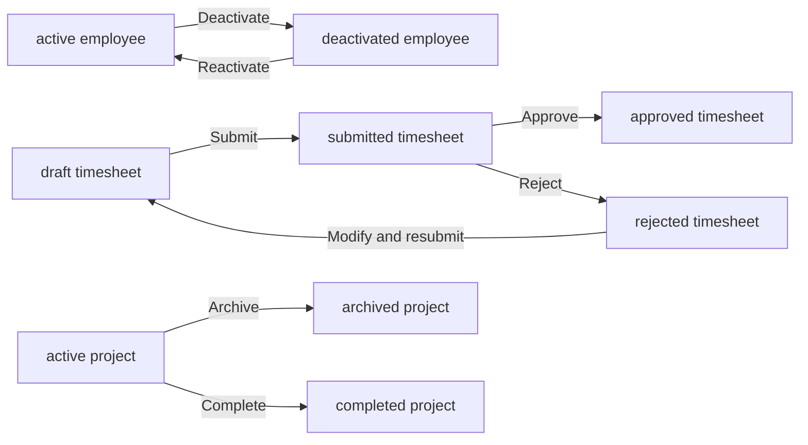

### Retention

Historical employee data is retained when an employee is deactivated. Their timelogs and timesheets remain preserved, and their employee record is not removed from historical use.

Historical contract records are retained as immutable records. Past contracts cannot be edited after they are no longer active.

Historical task changes are retained through task history entries. Each status change remains available with the time of change, the previous status, the new status, and the person who made the change.

Historical timelogs are retained even when related projects are archived or completed. Historical timesheets are retained after approval or rejection.

Historical activity log entries are retained as organizational records of significant actions.

When a department is deleted, employees assigned to it are retained and their department is cleared.

When a project is deleted, the project is removed only when no timelogs are associated with it. Timelog history is not removed by archiving or completing a project.

When an organization is deleted, its employees, projects, tasks, timelogs, and timesheets are permanently deleted, while the owner’s account remains.

### Archival

Archival applies to projects and approved timesheets through their business lifecycle.

An archived project remains part of the organization’s historical record. It cannot receive new timelogs, but existing timelogs remain preserved.

An approved timesheet is archived in the sense that it becomes locked. Its included timelogs cannot be edited or deleted while the timesheet remains approved.

Archival does not remove historical visibility for data that already exists. The archived state is a preservation state rather than a removal state.

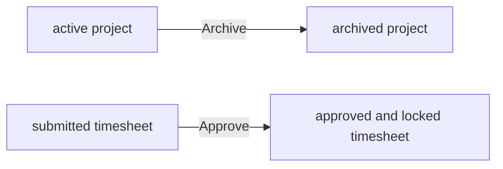

### Deletion Policy

An organization owner can delete the organization only when all pending timesheets have been resolved and there are no active employee contracts.

When an organization is deleted, all employees, projects, tasks, timelogs, and timesheets belonging to that organization are permanently deleted. The owner’s account remains, but it is no longer associated with any organization.

A project can be deleted only when it has no timelogs associated with it.

A custom role can be deleted only when no employees are assigned to it.

A department can be deleted, and deletion clears the department from employees without deleting the employees themselves.

A user can delete their account only if they are not the sole owner of an organization, unless they transfer ownership or delete the organization first. When the account is deleted, the user’s employee records in other organizations are marked as deactivated.

### Recovery

A deactivated employee can be reactivated, restoring their ability to log time and submit timesheets within the organization.

A rejected timesheet can be modified and resubmitted by the employee who owns it.

A running timer can be stopped to convert the current work session into a timelog, or discarded so that no timelog is created.

A deleted organization is not recoverable through the domain lifecycle described here. Its employees, projects, tasks, timelogs, and timesheets are permanently deleted when the deletion policy is satisfied.

Historical records that are preserved, such as past contracts, task history, timelogs, timesheets, and activity log entries, remain available as retained records rather than being recreated through recovery.

# Business Categories and State Flows

Business category classifications and state flow definitions.

## Business Category Definitions

Define all business category classifications with their allowed values and descriptions.

### Business Category Definitions

The platform uses business categories as a shared way to classify domain concepts and their allowed values. A business category defines the permitted set of values for a specific kind of classification so that the same concept is interpreted consistently across the organization.

#### Classification
A classification groups related business values under one named category. Each classification exists to describe one business meaning, such as a status, type, role, or similar controlled choice set.

A classification is defined once and then reused wherever the same business meaning is needed. This prevents different parts of the system from using different words for the same category.

Mermaid diagram:
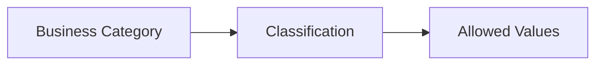

#### Allowed Values
Each business category has a fixed set of allowed values. Users and the system can only select values that belong to the relevant category.

The allowed values for a category represent the complete business-approved set for that classification. If a value is not part of the category, it is not valid for use in that context.

The categories in this file do not define technical storage rules or implementation details. They define business-approved choices only.

#### Status Type
A status type is a classification used to describe the current condition of a business concept. Status types are used when a concept must be represented by one of several allowed states.

A status type must follow the allowed values defined for that category. The status value shown for a concept must always come from its approved business category, not from an unrelated label or free-form text.

Mermaid diagram:
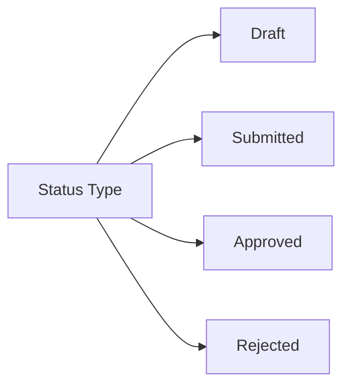

#### Business Category Usage
Business categories are used to keep classification consistent across the platform. They help ensure that a concept, its status, and its permitted values are understood the same way wherever they appear.

Where a concept depends on a classification, the concept must use the approved category values rather than inventing additional ones.

Business categories are descriptive domain definitions only. They do not define permissions, workflows, data retention, or error handling.

## State Transitions

Define valid state transition paths for stateful concepts.

### Organization Lifecycle

An organization begins when a user creates it during initial sign-up.

An organization owner can update the organization’s settings while the organization is active.

An organization can be deleted only when all pending timesheets have been resolved and there are no active employee contracts.

When an organization is deleted, all employees, projects, tasks, timelogs, and timesheets in that organization are permanently deleted.

When an organization is deleted, the owner’s account remains available, but it is no longer associated with any organization.

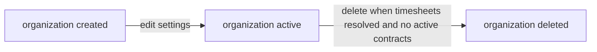

### Employee Lifecycle

An employee starts as active when added to an organization.

An employee can be deactivated.

A deactivated employee cannot log time or submit timesheets.

A deactivated employee can be reactivated.

Deactivation does not remove the employee’s historical timelogs or timesheets.

If a user deletes their account, their employee records in other organizations are marked as deactivated.

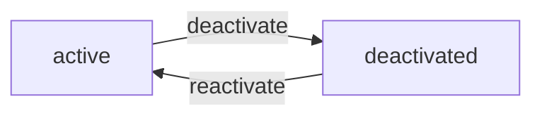

### Employee Contract Lifecycle

An employee can have multiple contracts over time, but only one contract can be active at a time.

A new contract starts a new contract period for the employee.

When a new contract is created, the previous active contract ends the day before the new contract starts.

The current active contract can be edited.

Past contracts remain as historical records and cannot be edited.

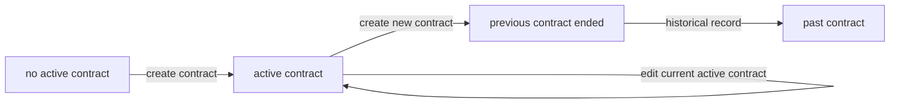

### Project Lifecycle

A project starts as active when created.

A project can be archived.

A project can be completed.

Archived and completed projects cannot receive new timelogs.

Existing timelogs on archived or completed projects are preserved.

A project can be deleted only when it has no timelogs associated with it.

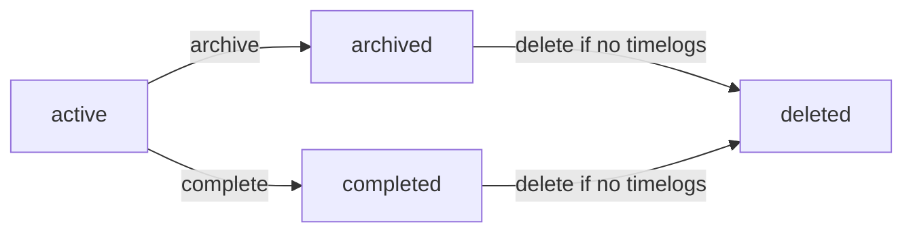

### Task Status Lifecycle

A task can move through the statuses open, in-progress, completed, and closed.

Task status changes are recorded in task history.

Each task history entry records when the change happened, the previous status, the new status, and who made the change.

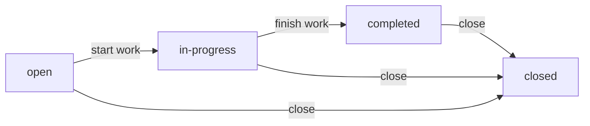

### Timelog Lifecycle

A timelog is created when an employee logs time or when a running timer is stopped.

A timelog can be edited by its owner only while it is not part of an approved timesheet.

A timelog can be deleted by its owner only while it is not part of any submitted or approved timesheet.

A timelog can also be edited or deleted by a user with time management permission.

Timelogs included in an approved timesheet are locked from editing and deletion.

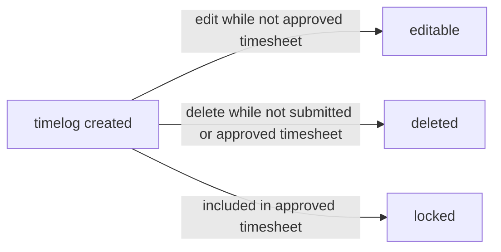

### Timesheet Lifecycle

A timesheet starts as a draft for a specific week.

Creating a draft timesheet automatically includes all timelogs for that employee in that week.

Timelogs can be added to or removed from a draft timesheet.

A draft timesheet can be submitted for approval only when it contains timelogs and no other timesheet for the same week is already submitted or approved.

A submitted timesheet can be approved or rejected.

When a timesheet is approved, all included timelogs are locked.

When a timesheet is rejected, it returns to draft status and the employee can modify and resubmit it.

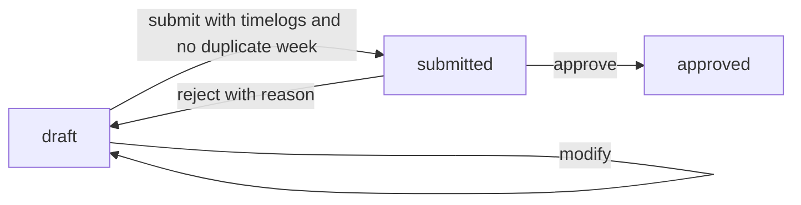

### Timer Lifecycle

An employee can start a timer to begin tracking a work session in real time.

Each employee can have at most one active timer at a time.

A running timer can be edited for its description and project or task selection.

A running timer can be stopped, which creates a timelog with the calculated duration.

The duration from stopping a timer is rounded to the nearest minute.

A running timer can be discarded without creating a timelog.

If a timer is not stopped, it continues running indefinitely.

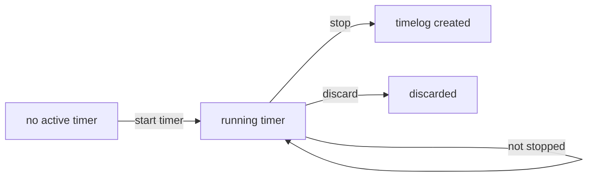

### Organization Membership Context

A user can belong to multiple organizations.

When a user logs in, they select the organization they want to work in.

All subsequent actions use the selected organization context.

A user can switch organizations without logging out.

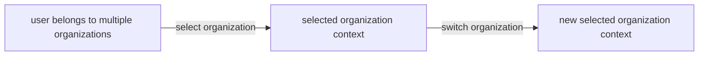