**hrmTimeTracking — Business concepts, relationships, and states from user perspective**

Business concepts, relationships, and states from user perspective

# Domain Concepts

Describe what each concept means in the business domain and its key attributes.

## Organization Concept

An organization represents a separate business space inside the platform. It is the top-level container for employees, projects, tasks, timelogs, timesheets, and related work records. Each organization has its own identity and operates independently from other organizations. The organization is identified by a name and can also include a description for business context. It may use a logo image to support branding across the workspace. The organization also carries a currency for financial values and a timezone for time-based business activity. A fiscal start month is part of the organization’s business profile and helps define its accounting calendar. This concept is central to data isolation because business records are understood within the scope of a single organization. The organization also represents the ownership boundary for roles, departments, and reporting visibility. 

### Organization as a Business Space

An organization is the top-level business space in the platform. It represents a single company, team, or internal business unit that uses the system to manage people and work records. The organization concept defines the business boundary for everything that belongs to that workspace.

An organization is the identity anchor for its own data. People, work records, and organizational settings are understood within the context of one organization rather than across the entire platform. This makes the organization the primary unit of separation for business use.

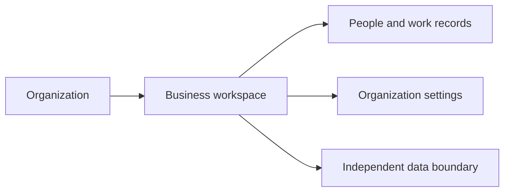

### Multi-Tenant Organization Model

The platform supports multiple organizations at the same time. Each organization operates as an independent tenant with its own business space and its own data context.

Independent organizations do not share their operational records with one another. Each organization is treated as a separate workspace, so business activity in one organization remains within that organization’s boundary.

This multi-tenant structure allows different organizations to use the platform side by side while keeping their data separated by business context.

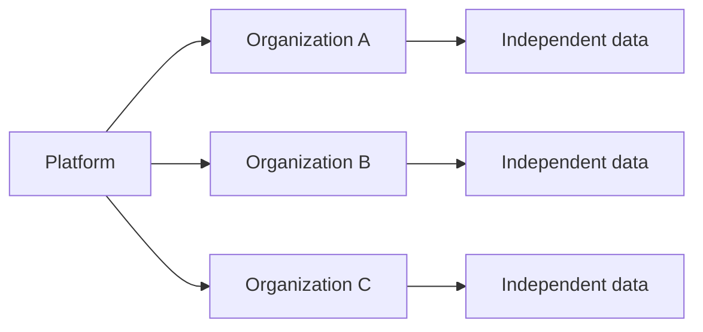

### Organization Identity and Profile

Each organization has a business identity made up of its name, description, and logo image. These values help distinguish one organization from another and provide context for the workspace.

The organization name is the primary identity label used to recognize the business space.

The organization description gives additional business context about the organization.

The logo image supports the organization’s visual identity within the platform.

These identity details belong to the organization itself and describe the workspace as a business entity rather than a user account or employee record.

### Organization Financial and Time Settings

Each organization carries a currency setting and a timezone setting as part of its business profile.

The currency setting defines the organization’s preferred monetary context for business values.

The timezone setting defines the organization’s local time context for time-based business activity.

Each organization also has a fiscal start month that defines the start of its fiscal calendar. This setting helps establish the organization’s accounting and reporting cycle as part of its business identity.

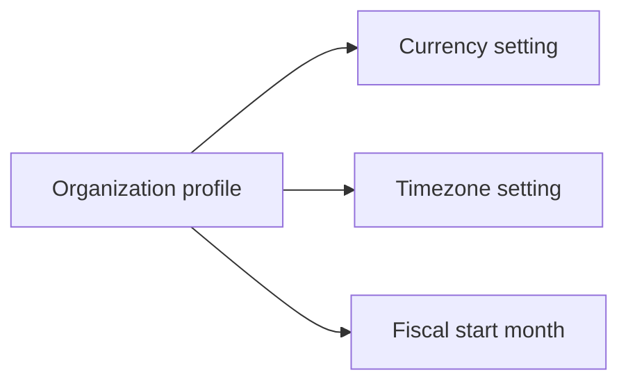

### Independent Organization Data Boundary

An organization’s data is independent from the data of every other organization. The organization is the business boundary that determines which records belong together.

Data inside one organization is understood only within that organization’s workspace. This includes the organization’s own identity information and the business records that exist under its scope.

The boundary of the organization is what makes the platform multi-tenant: each organization has its own isolated business space, and that separation is part of the organization concept itself.

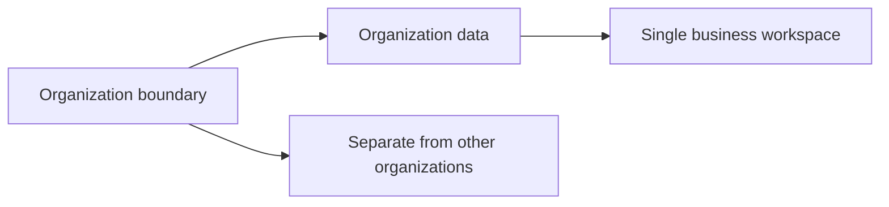

## UserAccount Concept

A user account represents an individual person’s authenticated presence in the platform. It is the global account that can belong to one or more organizations. The account is identified by an email address and protected by a password. Password change state is part of the account’s business meaning because it reflects the account’s security status over time. A user account is separate from organization-specific employee records, which allows one person to participate in multiple organizations. The account serves as the stable identity behind the person’s shared profile. It is also the anchor for access across different organizational contexts. Because the same account can move across organizations, the account is broader than any single employee assignment. This concept helps distinguish personal identity from organization membership. 

### User Account as a Global Identity

A user account represents the person’s global identity in the platform. It is the stable account that follows the person across all organizations they belong to. The same account can be associated with more than one organization, while still remaining a single identity. This concept separates the person’s global presence from any one organization-specific employee record. The account is the basis for recognizing the same person wherever they use the platform.

The user account is also the person’s authenticated presence in the platform. It is the business concept that confirms the person has an account identity that can be used to access the system. Because the account exists outside any single organization, it supports participation in multiple organizations without creating separate identities for each one.

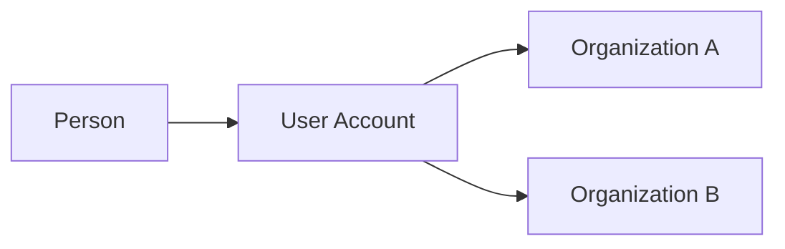

### Email Login Identity and Password-Based Account

A user account is identified for sign-in by an email address. The email address is the login identity that ties the person to their account. The account is also password-based, meaning access is associated with a password as part of the account’s core identity. Together, the email address and password distinguish the account from other people in the platform.

The password change state is part of the account’s business meaning. It reflects the account’s current password condition over time and is part of how the account is understood as a living identity record. This state belongs to the account itself rather than to any organization-specific membership.

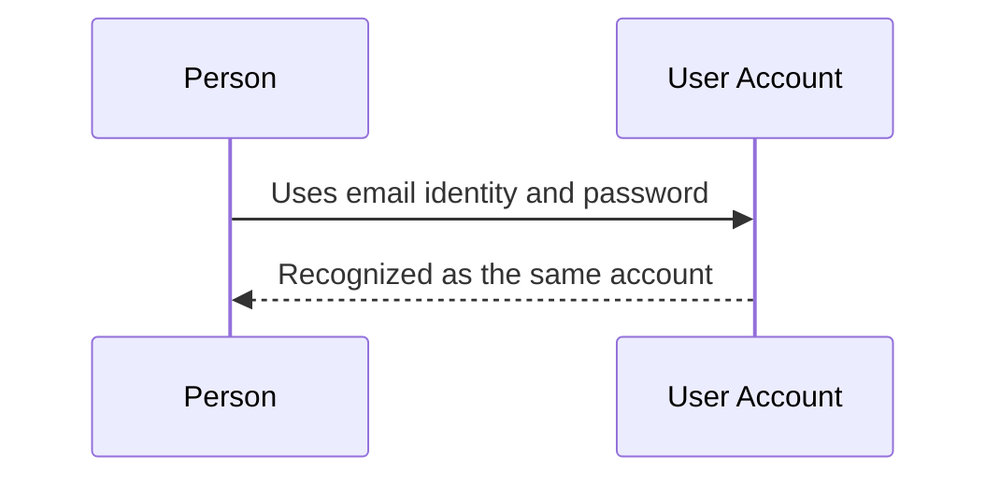

### Multi-Organization Membership

A user account can belong to multiple organizations. Membership in one organization does not replace or remove membership in another organization. The same account can therefore participate in more than one organizational context while remaining a single global identity.

Organization membership is contextual, not duplicative. The account stays shared across all organizations, while the person’s organization-specific presence is interpreted separately within each organization. This allows one person to hold multiple organizational memberships without changing the underlying account identity.

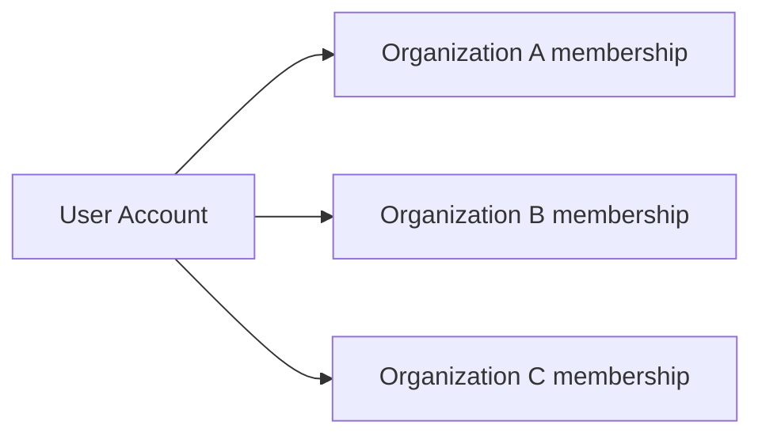

### Account Profile Anchor

The user account acts as the anchor for the person’s shared profile. The profile belongs to the account rather than to a single organization, so the person’s core identity details remain consistent across all organizations they join. The account provides the stable reference point that connects the person to that shared profile.

Because the profile is anchored to the account, the person’s identity can remain continuous even when they participate in different organizations. This makes the account the central business concept that holds the person’s cross-organization identity together.

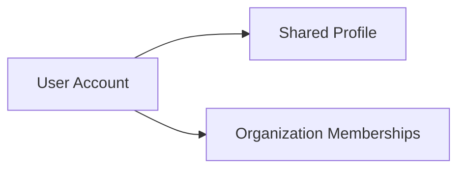

### Personal Identity Outside Organization Context

A user account represents the person’s personal identity outside any single organization. It is broader than employee membership, project participation, or any other organization-specific role. The account remains meaningful even when viewed independently from organizational context.

This separation allows the same person to exist as one account across the platform while taking part in different organizations as needed. The personal identity is therefore not tied to one organization’s boundaries, even though access and participation are later interpreted within a selected organization context.

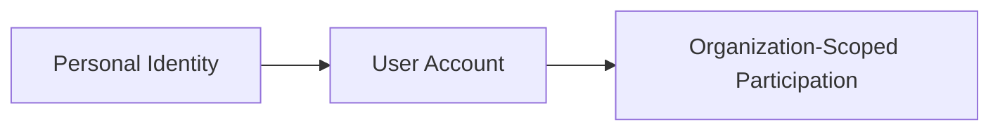

## UserProfile Concept

A user profile represents the shared personal details attached to a user account. It is global across the platform and is not limited to one organization. The profile carries the visible name used to identify the person in business contexts. It may also include an avatar image that helps represent the person visually. A phone number can be part of the profile for contact purposes. The profile is separate from role assignments and employee records, so it remains consistent even when the person belongs to multiple organizations. This concept captures the personal-facing information associated with the account. It supports recognition of the person across different business spaces. The profile is the user’s common identity layer rather than a work-specific record. 

### UserProfile as a Global Identity Layer

A user profile represents the shared personal details attached to a user account. It is the person’s global profile across the platform and is not limited to one organization.

The profile captures the visible identity used to recognize the person in business contexts. Its core profile information includes a display name, an avatar image, and a phone number.

The display name is the primary visible identity shown for the person across the platform. The avatar image provides a visual representation of the person. The phone number is part of the profile information and serves as contact detail.

The profile is account-adjacent identity rather than a work-specific record. It stays separate from organization membership, role assignment, and employee records, so the same personal details are shared across every organization the person belongs to.

The profile concept supports consistent recognition of the same individual across multiple organizations while keeping personal details in one shared place.

## Role Concept

A role represents a business classification that defines what an employee can do inside an organization. Each organization has its own role structure, so role meaning is local to that organization. Roles can be built-in or custom depending on how the organization organizes access. The built-in roles are Owner, Manager, and Employee. Custom roles add organization-specific flexibility when the built-in roles are not enough. A role is identified by name and by whether it is built-in or custom. The role concept is tied to a set of permissions that describe allowed business capabilities. Every employee belongs to exactly one role in a given organization, which makes the role a key part of access and responsibility. Role definitions are important for understanding authority boundaries and work expectations. 

### Role Concept

A role is an organization-specific access profile that defines how an employee is classified within a single organization. The role concept exists to describe responsibility and authority boundaries in that organization’s own context.

A role is identified by its role name and by its role classification. The role classification distinguishes whether the role is built-in or custom.

Built-in roles are part of the standard organization structure and cannot be deleted. The built-in roles are Owner, Manager, and Employee. These role names are fixed and represent the standard role classification used across organizations.

Custom roles are organization-defined roles that add flexibility when the built-in roles do not fully express how the organization wants to organize access and responsibility. A custom role belongs only to the organization that created it.

Every employee has single role assignment within an organization, meaning one employee belongs to exactly one role in that organization at a time. This makes the role concept central to how membership is organized inside the organization.

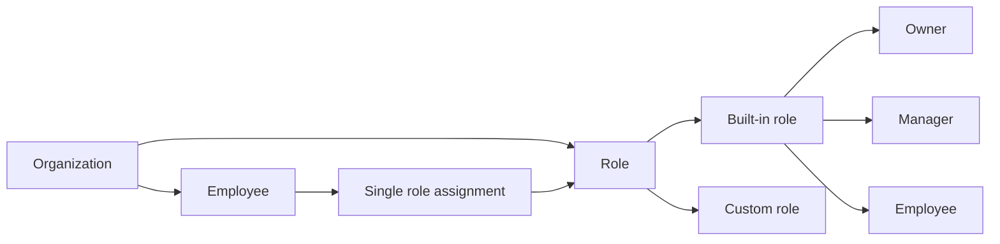

## Permission Concept

A permission represents one specific business capability available inside an organization. Permissions are the building blocks used to define what a role can do. Each permission has a code that identifies the capability and a business meaning that explains its scope. The available permissions cover organization management, employee management, employee viewing, project management, project viewing, time management, time approval, viewing all time records, and reporting. Permissions are not user-facing records by themselves; they are entitlement concepts attached to roles. They help distinguish narrow capabilities from broader role names. In practice, permissions define the boundaries of access to organizational data and actions. This concept is important because custom roles are formed by combining selected permissions. Permissions therefore describe authority in a precise and reusable way. 

### Permission Concept

A permission is a business entitlement that represents one specific capability inside an organization. It is not a user-facing record on its own; instead, it is a building block used to define what a role allows a person to do.

A permission has a permission code and a business capability meaning. The permission code is the short identifier used to distinguish one capability from another, while the business capability describes the real-world authority that the permission represents.

Permissions are always understood within the context of a single organization. The same permission concept can exist in different organizations, but each organization uses its own role configuration to determine access.

Permissions are the smallest reusable unit of access entitlement in the system. They provide a precise way to express authority without relying only on broad role names.

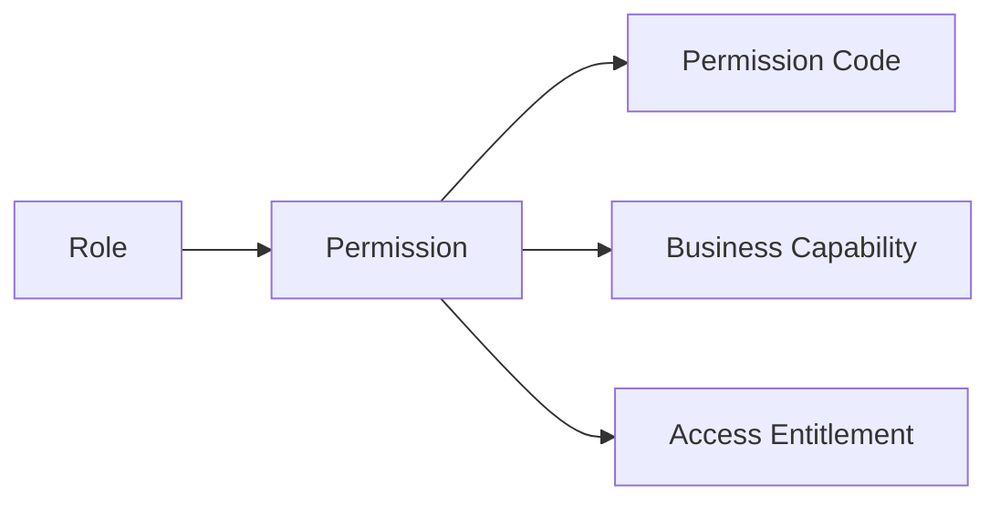


### Business Capability

A business capability is the practical meaning of a permission. It describes what kind of organizational action or visibility the permission represents in business terms.

Each business capability belongs to exactly one permission concept and explains the scope of that entitlement. The capability is what makes the permission understandable to organization owners when they assemble roles.

The available business capabilities in this system cover organization management, employee management, employee viewing, project management, project viewing, time management, time approval, viewing all time records, and reporting.

A business capability does not describe how a feature is implemented. It describes the boundary of authority that a role may grant to a person.

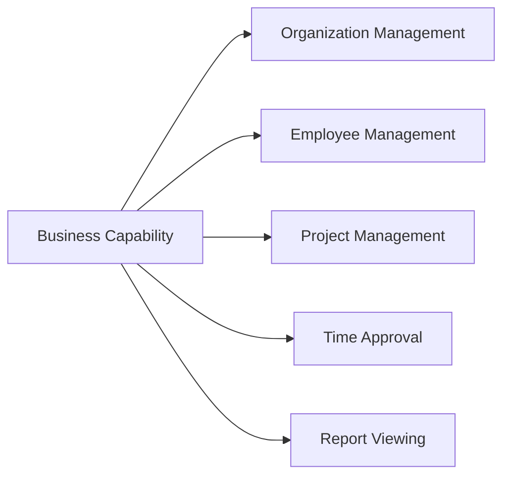


### Permission Code

A permission code is the identifying code for a permission. It is the concise value that names the business capability in a way that can be reused consistently across role definitions.

Each permission code maps to one business capability only. This keeps permissions precise and avoids ambiguity between similar forms of access.

The permission codes in this system include organization management permission, employee management permission, project management permission, time approval permission, time view all permission, and report viewing permission, along with the other capabilities listed in the business capability definition.

A permission code belongs to the permission concept and is part of the access entitlement attached to roles.

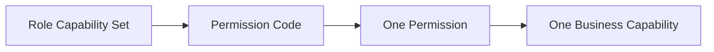


### Organization Management Permission

The organization management permission represents the capability to manage organization settings within the current organization context.

This permission is one of the available business capabilities that can be included in a role capability set. It is used when a role needs authority over organization-level configuration rather than project or time-related access.

Organization management permission is part of the access entitlement model that distinguishes broad organizational control from narrower operational permissions.

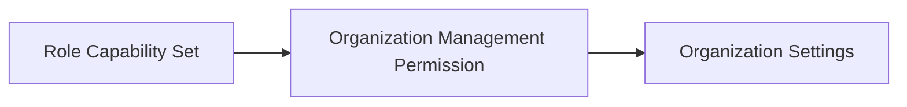


### Employee Management Permission

The employee management permission represents the capability to manage employees within an organization.

This permission belongs to the set of business capabilities that can be combined into a role capability set. It expresses authority over employee-related management rather than general organizational access.

Employee management permission is a specific access entitlement that can be assigned through a role when an organization needs someone to handle employee administration.

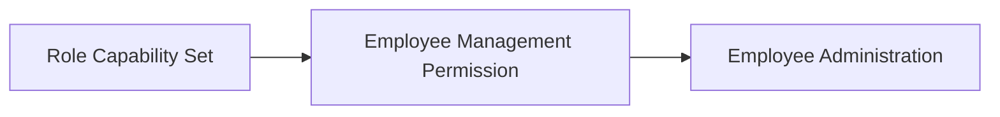


### Project Management Permission

The project management permission represents the capability to manage projects and tasks within an organization.

It is one of the business capabilities available for inclusion in a role capability set. This permission is distinct from project viewing, because it represents management authority rather than read-only access.

Project management permission is part of the access entitlement structure used to define whether a role can control project work within the organization.

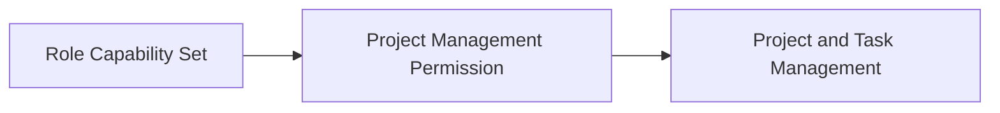


### Time Approval Permission

The time approval permission represents the capability to approve or reject timesheets within an organization.

It is a business capability that can be included in a role capability set when a role needs authority over timesheet review outcomes.

Time approval permission is a distinct access entitlement from time viewing permissions, because it governs approval responsibility rather than visibility alone.

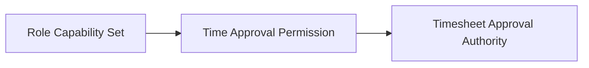


### Time View All Permission

The time view all permission represents the capability to view all employees' timelogs and timesheets within an organization.

This permission is a broad visibility entitlement. It differs from self-only time visibility because it extends access across employees in the same organization context.

Time view all permission may be part of a role capability set when a role needs organization-wide visibility into time records.

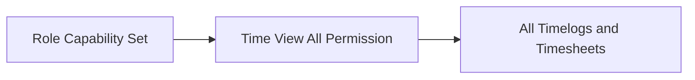


### Report Viewing Permission

The report viewing permission represents the capability to view organization reports.

It is a business capability that can be included in a role capability set when a role needs access to reporting information for the organization.

Report viewing permission is an access entitlement that supports visibility into summarized organizational information rather than direct management of records.

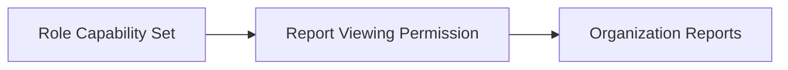


### Role Capability Set

A role capability set is the collection of permissions assigned to a role.

It defines the access entitlement granted by that role inside one organization. A role capability set may combine several permissions so that the role expresses a broader business responsibility.

The role capability set is what links the permission concept to practical organizational access. Built-in roles and custom roles both rely on this set of permissions to define their authority.

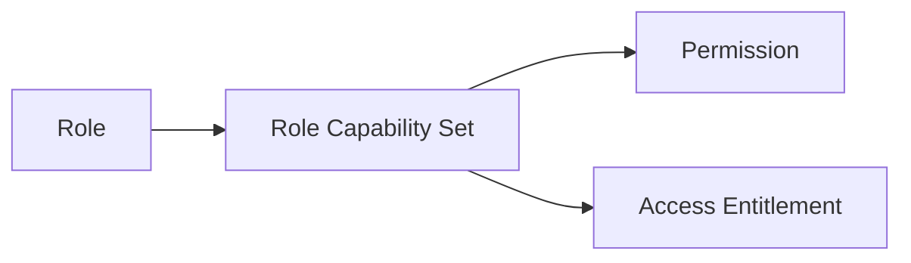


### Access Entitlement

An access entitlement is the authority granted to a role by its permission set. It defines what the role allows within the organization context.

Access entitlement is not a separate user-facing business object. It is the business meaning of the permissions attached to a role and the reason permissions matter in the domain model.

Access entitlements help separate narrow capabilities from broad role labels, making it possible to describe authority in a precise and reusable way.

```mermaid
flowchart LR
    A["Permission"] --> B["Access Entitlement"]
    C["Role Capability Set"] --> B
    B --> D["Organization Context"]
```


## Employee Concept

An employee represents a person’s membership and working identity within a specific organization. The employee record links the global user account to an organization-specific role. It may also include a department and a position or title to describe where the person fits in the organization. Employment type is part of the concept and distinguishes full-time, part-time, contractor, and intern arrangements. Employee status captures whether the employee is active or deactivated. This record is distinct from the global user account because the same person can appear in multiple organizations with different roles or status. Employee information is the basis for time tracking, project assignment, and reporting within the organization. The concept also supports historical continuity because the employee record remains meaningful even when the person changes state. It is the core people entity used for day-to-day business operations. 

### Employee as an Organization-Specific Record

An employee is the organization-specific record that represents a person’s working identity within one organization. The same user account may appear as different employee records in multiple organizations, and each record is independent within its own organization context.

The employee record connects a user to a single organization membership for day-to-day business activity. It is the record used to describe the person’s participation in that organization, while the underlying user account remains global and shared across organizations.

The employee record is the business basis for the person’s role, department assignment, position or title, employment type, and status within the organization.

### Organization Membership and Role Assignment

An employee belongs to exactly one organization at a time through the organization-specific employee record. This membership makes the employee part of that organization’s working population and distinguishes them from users who do not belong to that organization.

Each employee is assigned exactly one role within the organization. The role assignment is part of the employee record and defines the employee’s standing in that organization.

Role assignment is an attribute of the employee concept and is separate from the user account and from the organization itself. The same person can therefore have different role assignments in different organizations.

### Department Assignment and Position Title

An employee may be assigned to one department within the organization. Department assignment is optional, so an employee may also have no department.

An employee may also have a position or title. The position or title is optional and is used to describe the employee’s place or function in the organization.

Department assignment and position or title belong to the employee record and describe how the employee is organized within the business structure of the organization.

### Employment Type

Each employee has an employment type that identifies the nature of the person’s working arrangement within the organization.

The allowed employment types are full-time, part-time, contractor, and intern. These values are part of the employee concept and distinguish the employee’s arrangement in the organization.

Employment type is stored on the employee record so that the organization can distinguish different kinds of working relationships without changing the underlying user account.

### Active and Deactivated Status

Each employee has a status that indicates whether the employee is active or deactivated within the organization.

An active employee is currently participating in the organization as a working member. A deactivated employee remains part of the organization’s historical record but is marked as not currently active.

Status is part of the employee record and is specific to the organization in which the employee exists. The same user may be active in one organization and deactivated in another.

## Invitation Concept

An invitation represents a pending invitation for a person to join an organization. It is identified by the invited email address, which is the contact point used to recognize the future member. The invitation concept also carries an invitation status that shows whether the invitation is still pending or has been resolved. It may be associated with one or more organizations that are waiting for the person to join. Invitation records exist so the organization can represent a future employee before the person fully joins the system. This makes the concept different from an employee record, which represents an active organization member. An invitation is also different from a user account because the invited person may not yet have an account. The concept helps describe a temporary business state between being invited and becoming an organization participant. 

### Invitation Record

An invitation record represents a temporary business record created for a person who is expected to join one or more organizations. It exists to capture the invitation before the person becomes an active employee in the organization.

The invitation record is identified by the invited email address, which is the contact point used to recognize the person when they later join the system. The record also carries an invitation status that shows whether the invitation is still pending or has already been resolved.

An invitation record is a pre-account invitation when the invited person does not yet have a user account. In that case, the record preserves the organization join invite until the person signs up and becomes linked to the organization.

An invitation record is distinct from an employee record because it represents a future organization member rather than an active organization member. It is also distinct from a user account because the invited person may not yet have an account when the record is created.

### Pending Invitation and Pending Organization Association

A pending invitation is an invitation record that has not yet been resolved because the invited person has not yet joined the organization.

A pending organization association means the invitation is waiting to connect the invited email address to an organization membership in the future. This association represents the organization that expects the person to join once the invitation is accepted implicitly through account creation or existing account recognition.

A pending invitation remains associated with the organization until it is resolved. While pending, it continues to represent a future organization member and does not become an employee record on its own.

### Invited Email Address and Invite by Email

The invited email address is the business identifier used by an invitation record. It is the address through which the system recognizes the intended recipient of the organization join invite.

Invite by email means the invitation is addressed to a specific email address rather than to an existing employee record. This supports inviting a future organization member before the person is fully present in the organization.

The invited email address is the primary value used to connect the invitation record, the pending invitation, and the eventual user account when the invited person later joins the system.

### Invitation Status

Invitation status describes the current business state of an invitation record.

A pending invitation has a status that indicates the invitation is still waiting for the invited person to join. A resolved invitation has a status that indicates the invitation no longer represents an unresolved join request.

Invitation status exists so the organization can distinguish between a still-open organization join invite and one that has already been completed or otherwise resolved.

### Future Organization Member

A future organization member is the person represented by an invitation record before they become an employee in the organization.

This concept captures the business meaning of an invited person who is expected to join later but is not yet an active organization participant. It is useful because the invitation record can exist before the person has a user account, making the invitation a pre-account invitation.

The future organization member is represented by the pending invitation until the person becomes associated with the organization through a user account.

## Department Concept

A department represents an internal business grouping within an organization. It is used to organize employees by functional area, team, or division. Each department has a name that identifies it in the organization. A description can provide more detail about its purpose or scope. Departments can also have a parent department, which allows one level of nesting for simple hierarchy. This concept is organization-specific and does not cross into other organizations. It helps describe how people are grouped for management and reporting purposes. A department is not the same as a role, because it describes organizational structure rather than access rights. It is also not the same as a project, because it belongs to the people structure of the organization. 

### Department Concept

A department is an internal business unit within an organization that is used to organize employees by team grouping, functional area, division, or similar organizational structure.

A department belongs to exactly one organization and does not cross organization boundaries. It represents the organization-specific way people are grouped for management and reporting purposes.

A department has a name, which identifies it within the organization. The name is the primary business label for the department.

A department may also have a description. The description provides additional context about the department’s purpose, scope, or place in the organization.

A department may have a parent department. This creates a simple hierarchy with one level of nesting only. A parent department allows one department to sit under another department as part of the organization’s internal structure.

A department is distinct from a role because it describes how people are grouped, not what access they have. It is also distinct from a project because it represents an ongoing part of the organization’s internal structure rather than a temporary body of work.

A department may be used to describe employee grouping within the organization. Employees can be associated with a department as part of that organization’s structure, allowing the department to represent a team, unit, or division at the business level.

```mermaid
flowchart LR
    O["Organization"] --> D["Department"]
    D --> N["Name"]
    D --> S["Description"]
    D --> P["Parent Department"]
    P --> D2["One Level Nesting"]
    D --> G["Employee Grouping"]
    D --> T["Team Grouping"]
    D --> I["Internal Business Unit"]
```

## Contract Concept

A contract represents a historical employment agreement for an employee within an organization. An employee can have multiple contracts over time, which makes the contract a time-based business record. Each contract has a start date that marks when the agreement begins. It may also have an end date when the agreement is no longer ongoing. Pay rate is a core contract attribute because it expresses the compensation basis. Pay period describes whether compensation is hourly, daily, weekly, or monthly. Working hours per week is part of the contract’s business meaning because it reflects expected workload. Notes may be included to capture additional context about the agreement. The contract concept is important for keeping a clear record of changing employment terms over time. 

### Contract Concept

A contract represents the employment terms recorded for an employee within one organization. It is a historical contract record, meaning it preserves the terms that applied during a specific period even after a newer contract becomes active. An employee can have multiple contracts over time, but only one contract can be active at a time.

A contract begins on its start date, which marks when the agreement takes effect. An end date may be present when the contract is no longer ongoing. When no end date is present, the contract is ongoing. The end date therefore distinguishes a completed contract from one that is still in force.

Pay rate is a core part of the contract because it expresses the compensation amount agreed for the employee. Pay period defines how that pay rate is understood. The supported pay periods include hourly, daily, weekly, and monthly, and hourly pay period means the contract uses an hourly basis for compensation.

Working hours per week is part of the contract because it captures the expected weekly workload associated with the agreement. Contract notes may also be included to record additional context about the employment arrangement. Together, these attributes make the contract a complete business record of how the employee was engaged during a given period.

```mermaid
flowchart LR
    A["Employee"] --> B["Contract"]
    B --> C["Start Date"]
    B --> D["End Date"]
    B --> E["Pay Rate"]
    B --> F["Pay Period"]
    B --> G["Working Hours Per Week"]
    B --> H["Contract Notes"]
    D --> I["Ongoing Contract"]
```

## Project Concept

A project represents a unit of work that the organization tracks over time. It is one of the main business objects used for time tracking and task planning. Each project has a name that identifies it to employees. A description can provide additional context about the project’s purpose. A color code is part of the project concept because it supports visual recognition in the interface. The project also has a status that reflects whether it is active, archived, or completed. Budget hours can be attached to a project to show estimated effort, and start and end dates can define the project timeline. The project belongs to a single organization and is separate from department structure or employee identity. It serves as the main container for tasks, memberships, and logged time. 

### Project Concept

A project is a work unit that represents a unit of organized effort tracked by the organization over time. It is one of the primary business objects used to coordinate work, track time, and relate tasks and membership within the organization.

A project belongs to a single organization and is separate from employee identity or department structure. It serves as the business container for work that is planned, tracked, and reported within that organization.

The project name identifies the work unit and is the main label employees use to recognize it. The project description provides additional context about the purpose or scope of the work unit. Both values belong to the project concept and help distinguish one work unit from another.

### Project Identity and Visual Recognition

Each project has a color code that supports visual recognition in the business domain. The color code is part of the project concept and helps distinguish projects from one another when they are referenced in organization-wide work tracking.

The color code belongs to the project itself and is not a separate business object. It exists as an identifying attribute of the work unit alongside the project name and description.

### Project Status

A project has a status that reflects its current state in the organization’s work tracking lifecycle.

An active project is one that remains open for ongoing work tracking.
An archived project is one that has been set aside from active work while remaining part of the organization’s historical record.
A completed project is one that has reached its finished state in the organization’s tracking of work.

The project status is an inherent part of the project concept and defines whether the work unit is currently active, archived, or completed.

### Project Timeline

A project may have a project timeline that defines the period during which the work unit is expected to run. The timeline is described by a start date and an end date.

The start date marks when the project timeline begins. The end date marks when the project timeline ends. Together, these dates define the project timeline for the work unit.

The timeline is optional as a business concept, but when it is present it belongs to the project and provides time boundaries for the work being tracked.

### Budget Hours

A project may include budget hours, which represent the estimated amount of effort planned for the work unit.

Budget hours belong to the project and provide a business-level estimate used to describe the expected scale of the project. They are distinct from time logged by employees and from the project timeline.

## ProjectMembership Concept

A project membership represents the connection between an employee and a project. It shows that the employee is part of that project’s working group. The membership is specific to one project and one employee, so it captures a single assignment relationship. Each membership has a project role that describes the person’s function on that project. The available project roles are member and project-lead. This concept is important because an employee can belong to multiple projects at the same time. It helps define who is involved in a project and how they are positioned within the project team. Project membership is separate from the employee’s organization role because project responsibility can differ from organizational authority. It is a core concept for project collaboration and task ownership. 

### Project Membership Concept

A project membership is the business concept that connects one employee to one project. It represents a single employee-to-project link and shows that the employee is part of that project’s team. This concept exists to identify who participates in a project and to distinguish project participation from organization membership.

A project membership belongs to exactly one employee and exactly one project. Because the relationship is specific to one employee and one project, it captures one project assignment at a time for that pair. An employee can have multiple project assignments across different projects, so a single employee may appear in several project memberships at the same time.

A project membership is the unit that expresses project team membership. It tells the organization which employees are involved in a project and supports the structure of project responsibility within that project’s working group.

### Project Role

Each project membership includes a project role that describes the employee’s function inside the project team. The available project roles are member and project-lead.

The project role is specific to the project membership, not to the employee as a whole. This means an employee may have one project role in one project and a different project role in another project. The role therefore reflects project-specific participation rather than organization-wide authority.

The project role is the part of the project membership that identifies how the employee contributes to the project and how responsibility is organized within the project team.

### Member Role and Project-Lead Role

The member role identifies a standard project participant. It indicates that the employee is part of the project team as a contributing member.

The project-lead role identifies an employee who carries a higher level of project responsibility within that project. It distinguishes the employee as the lead participant for the project team while still remaining a project member.

These two project roles describe different forms of project participation. They allow the project membership concept to represent both general team participation and lead responsibility without changing the employee’s organization role.

## Task Concept

A task represents a piece of work inside a project. It is the finer-grained work item used to organize delivery and track progress. Each task has a title that identifies the work clearly. A description can add detail about the expected outcome or context. Task status shows where the task stands in its life cycle, and priority indicates how urgently the work should be handled. Estimated hours can be attached to describe expected effort. A due date may also be present to express timing expectations. A task can have an assigned employee, which ties the work to a person in the project. A parent task may exist for subtasks, allowing one level of nested task structure. 

### Task Concept

A task is a work item inside a project. It represents a discrete piece of work that helps organize delivery and track progress within the project context.

A task belongs to one project and exists as part of that project's work structure. It may be used to represent either a standalone task or a smaller subtask within a larger piece of work.

A task title identifies the work clearly and is the main label used to distinguish the task from other work items. A task description can provide additional context about the expected outcome, background, or details needed to understand the work.

A task status shows where the task stands in its life cycle. A task priority indicates how urgently the task should be handled. Estimated hours may be attached to describe the expected effort for the task.

A due date may be present to express when the task is expected to be completed. An assigned employee may be linked to the task to indicate who is responsible for the work.

A task may have a parent task. When a parent task exists, the task is treated as a subtask of that parent task. Subtasks provide one level of nested task structure and are used to break larger work into smaller related work items.

```mermaid
flowchart LR
    A["Project"] --> B["Task"]
    B --> C["Subtask"]
    B --> D["Assigned Employee"]
    B --> E["Status"]
    B --> F["Priority"]
    B --> G["Estimated Hours"]
    B --> H["Due Date"]
    B --> I["Task Description"]
```


## TaskHistory Concept

Task history represents the record of how a task’s status changed over time. It preserves the timeline of task progression as a business record. Each history entry includes a timestamp so the change can be understood in sequence. It also captures the previous status and the new status, which makes the transition visible. The person who made the change is part of the history so accountability is preserved. Task history is separate from the current task state because it exists to show what happened earlier. This concept gives the organization a clear view of task movement through its life cycle. It is useful for understanding progress and responsibility without altering the current task itself. The record is an immutable business trace of status changes. 

### TaskHistory Concept

Task history is the historical record of how a task’s status changes over time. It exists to preserve a clear task progression trail so the organization can understand how the task moved through its lifecycle.

Task history captures each status change as a timestamped task change. Every history entry records when the change happened, what the old status was, what the new status became, and who made the change. This makes the record a status transition audit rather than a description of the task’s current state.

The task history record is separate from the task itself. The task represents the current work item, while task history provides the historical task record that explains how that work item reached its present state. This distinction allows the organization to review the task lifecycle trace without altering the task’s current status.

Task history is intended to preserve accountability and continuity. By keeping each status change record in sequence, it provides an immutable business trace of the task’s progression and supports later review of how and when task status changes occurred.

```mermaid
flowchart LR
    A["Task status change"] --> B["Timestamped history entry"]
    B --> C["Old status recorded"]
    B --> D["New status recorded"]
    B --> E["Person who made the change recorded"]
    C --> F["Task progression trail"]
    D --> F
    E --> F
    F --> G["Historical task record"]
```


## Timelog Concept

A timelog represents a recorded amount of work time for an employee. It is one of the core time tracking business records in the platform. Each timelog has a date and a duration measured in minutes. It is associated with a project so the organization knows where the time was spent. A timelog can also be linked to a task when the work belongs to a specific task. A description can be included to summarize what was done during the logged time. The billable flag indicates whether the logged time should be treated as billable or non-billable. A timelog belongs to a specific employee and is part of the organization’s historical time record. It is a foundational concept for timesheets, reporting, and budget awareness. 

### Timelog as a Time Entry

A timelog is the platform’s business record for a single time entry. It represents a measurable amount of work time captured for one employee within one organization. A timelog belongs to one employee and is part of that employee’s time record in the organization.

A timelog is used to preserve historical time tracking information. It shows that work was performed on a particular date for a particular duration and provides a lasting record of that work for later review and reporting. Because it is a historical record, the timelog remains part of the employee’s organization-specific time history after it has been created.

### Date and Duration

Each timelog includes a date and a duration measured in minutes. The date identifies when the work was recorded, and the duration identifies how much time was spent.

The duration in minutes is the standard measure used for a timelog so that time can be recorded consistently across the organization. This makes the timelog suitable for totals, summaries, and comparisons across different work records.

### Project-Linked Time

A timelog is linked to one project. This project association identifies where the employee’s time was spent and places the time entry within the organization’s project history.

Project-linked time is a core part of the timelog concept because it connects the employee’s recorded work to the project being supported. A timelog belongs to one project only, which keeps each time entry focused on a single project context.

### Task-Linked Time

A timelog may also be linked to one task when the recorded work belongs to a specific task within the selected project. This task association narrows the time entry to a more precise unit of work.

Task-linked time is optional, so a timelog can represent work at the project level or at the task level. When a task is associated with a timelog, it remains within the same project context as the timelog.

### Work Description and Billable Time

A timelog may include a work description to summarize what was done during the recorded time. The description gives context to the time entry and helps explain the nature of the work in business terms.

A timelog also includes a billable flag that distinguishes billable time from non-billable time. Billable time is time that is treated as billable, while non-billable time is time that is not treated as billable. This distinction is part of the timelog’s business meaning and supports how the organization classifies recorded work.

### Employee Time Record and Historical Time Tracking

A timelog is an employee time record that belongs to one employee and contributes to that employee’s historical time tracking within the organization. It serves as a durable record of work performed over time.

The timelog is part of the organization’s historical time tracking because it preserves past work activity in a form that can be reviewed later. As a historical record, it supports ongoing understanding of how employee time was spent across projects and tasks.

## Timesheet Concept

A timesheet represents a weekly collection of an employee’s timelogs. It is the business record used to organize time for a specific week from Monday to Sunday. Each timesheet belongs to one employee and covers one week range. The timesheet status shows whether it is in draft, submitted, approved, or rejected state. Total hours is part of the concept because it summarizes the time included in the timesheet. Submitted at captures when the timesheet was sent for review. Reviewed at and reviewed by identify the review moment and the person responsible for the decision. Rejection reason is part of the concept because rejected timesheets need an explanation. The timesheet is a central approval record that groups time entries into a weekly package. 

### Timesheet Concept

A timesheet is the business record for a weekly collection of an employee’s timelogs. It represents one employee’s time for one specific week and serves as the weekly time collection container within the organization. The timesheet concept is defined around a Monday to Sunday week so that every timesheet covers a consistent weekly range.

A timesheet belongs to exactly one employee and represents only that employee’s time for the week it covers. The timesheet is identified in the business domain by its week range, its owner, and its status. The status shows which stage the timesheet is in: draft, submitted, approved, or rejected.

A timesheet includes the following key business attributes:
- Week start date, which marks the Monday of the covered week
- Week end date, which marks the Sunday of the covered week
- Status, which shows the current timesheet state
- Total hours, which summarizes the time included in the timesheet
- Submitted at, which records when the timesheet was sent for review
- Reviewed at, which records when a review decision was made
- Reviewed by, which identifies who made the review decision
- Rejection reason, which explains why a timesheet was rejected

```mermaid
flowchart LR
    A["employee"] --> B["timesheet"]
    B --> C["week start date"]
    B --> D["week end date"]
    B --> E["status"]
    B --> F["total hours"]
    B --> G["submitted at"]
    B --> H["reviewed at"]
    B --> I["reviewed by"]
    B --> J["rejection reason"]
```

### Weekly Time Collection

A timesheet is the weekly time collection that groups an employee’s timelogs into a single business record for one week. The collection exists to summarize the employee’s logged time for the covered Monday to Sunday period.

The weekly collection is defined by the employee who owns it and the week it represents. A timesheet does not describe time outside its own week range. Its purpose is to hold the time entries that belong to that specific weekly period and to present them as one organized record.

The total hours value belongs to this weekly collection and summarizes the amount of time included in the timesheet. The weekly collection is therefore both a container for the week’s timelogs and a summary of the employee’s time for that week.

```mermaid
flowchart LR
    A["employee timelogs"] --> B["weekly time collection"]
    B --> C["Monday to Sunday week"]
    B --> D["total hours"]
```

### Timesheet Status and Review States

The timesheet status describes the business state of the timesheet. A timesheet may be in one of four states: draft, submitted, approved, or rejected.

A draft timesheet is a timesheet that has been prepared but not yet sent for review. A submitted timesheet is a timesheet that has been sent for review. An approved timesheet is a submitted timesheet that has been accepted. A rejected timesheet is a submitted timesheet that has not been accepted and has returned to the rejected state.

These states are part of the timesheet concept and define how the record is understood in the business domain. The status is central to whether the timesheet is still being prepared, is awaiting review, has been accepted, or has been rejected.

```mermaid
flowchart LR
    A["draft"] --> B["submitted"]
    B --> C["approved"]
    B --> D["rejected"]
```

### Timesheet Review Metadata

A timesheet carries review metadata that identifies when it was submitted and how it was reviewed. Submitted at records the moment the timesheet was sent for review.

Reviewed at records the moment when the review decision was made. Reviewed by identifies the person who made that review decision. These values belong to the timesheet concept because they describe the record’s review history and the accountability of the review outcome.

The rejection reason is part of the timesheet concept because a rejected timesheet needs an explanation for the rejection outcome. When present, it provides the business reason associated with the rejected state.

```mermaid
flowchart LR
    A["submitted at"] --> B["reviewed at"]
    B --> C["reviewed by"]
    C --> D["rejection reason"]
```

## TimerSession Concept

A timer session represents a live time tracking record that is currently running or has been run. It captures the start timestamp when the timed work begins. The session is associated with a project so the running time can be categorized correctly. A task may also be attached if the time is tied to specific work. Description is part of the timer session because it explains what the person is working on. This concept is distinct from a timelog because it represents the active tracking state before or during conversion into a logged record. Timer session is tied to an employee and reflects real-time work tracking activity. It helps describe ongoing work without yet turning it into a finalized time entry. The concept is useful for understanding immediate work context and active tracking state. 

### Timer Session Concept

A timer session represents the active tracking session used for live time tracking while work is ongoing. It describes a running timer before that work becomes a finalized timelog.

A timer session is tied to one employee and reflects real-time work tracking activity for that person. It exists to capture ongoing work state while the person is still timing their work.

The timer session includes the start timestamp, which marks when the timed work begins. It also includes the selected project so the active tracking session is categorized in the correct business context.

A task may be attached to the timer session when the live tracking work is connected to a specific task. The task is part of the timer session only when the work needs that additional level of detail.

The description is part of the timer session because it explains what the person is working on during the active tracking session. It provides context for the running timer while the work is still in progress.

A timer session is distinct from a timelog because it represents the ongoing work state rather than a finalized time entry. It supports understanding current work activity without turning that activity into a completed record yet.

```mermaid
flowchart LR
    A["Ongoing work state"] --> B["Active tracking session"]
    B --> C["Running timer"]
    C --> D["Start timestamp"]
    C --> E["Timer project"]
    C --> F["Timer task"]
    C --> G["Timer description"]
    C --> H["Timelog after completion"]
```

## ActivityRecord Concept

An activity record represents a significant business action captured for organizational visibility. It preserves a timestamp so the action can be placed in time. The record identifies the user who performed the action. It also includes an action type that describes what kind of business event occurred. A target entity is part of the record so the action can be linked to the relevant object, such as an employee, project, task, or timesheet. Additional details can be stored to provide context about the action. Activity records form the organization’s historical activity trail. They are useful for understanding who did what and when across major business events. This concept helps create an auditable view of important changes without describing the implementation of logging itself. 

### Activity Record as a Business Action Log

An activity record is the organization’s business action log for significant events. It captures important business events in a form that can be reviewed later to understand what happened within the organization. The record exists to preserve a visible history of meaningful changes, rather than routine background activity.

An activity record is part of the organization’s activity trail. Each record contributes to the broader history of significant actions that occurred in the organization over time.

Mermaid diagram:
```mermaid
flowchart LR
    A["Significant business event"] --> B["Activity record"]
    B --> C["Organizational activity trail"]
```

### Timestamped Activity and Performed By User

Each activity record contains a timestamped activity so the business event can be placed in time. The timestamp identifies when the significant action occurred and supports chronological review of the organization’s history.

Each activity record also identifies the user who performed the action. This makes it possible to understand who carried out the business event and to connect the record to the person responsible for it.

A single activity record therefore combines when the event happened and who performed it, which makes the record useful as part of an auditable business event history.

### Action Type, Target Entity, and Activity Details

Each activity record includes an action type that describes the kind of business event that occurred. The action type distinguishes one category of significant action from another, such as changes involving employees, projects, tasks, timesheets, contracts, or role assignments.

Each activity record also includes a target entity. The target entity is the business object the action relates to, so the record can be linked to the relevant employee, project, task, timesheet, contract, or role.

Each activity record may include activity details to provide additional context about the event. The details explain the meaningful parts of the action so the record is more informative when reviewed later.

### Significant Action History and Organizational Visibility

Activity records together form a significant action history for the organization. This history provides an auditable view of important business events across the organization’s operational life.

The activity trail is organization-specific, so the records reflect events within one organization’s context rather than a shared cross-organization history. This makes the activity record concept part of the organization’s own historical memory.

In business terms, the activity record exists to preserve what happened, when it happened, who performed it, what kind of action it was, and which business object it affected.

Mermaid diagram:
```mermaid
flowchart LR
    A["User action"] --> B["Action type"]
    B --> C["Target entity"]
    C --> D["Activity details"]
    D --> E["Activity record"]
    E --> F["Auditable business event history"]
```

# Domain Relationships

Describe how concepts relate to each other from a business perspective.

## Conceptual Relationships

Describe how concepts relate to each other in business terms.

### Organization Relationships

An organization is the top-level business boundary for all operational data in the platform.

An organization belongs to the overall platform context and has many members, employees, departments, projects, tasks, timelogs, timesheets, roles, contracts, and activity records within its own boundary.

An organization is owned by one or more members. Ownership gives those members control over organization-level administration and the ability to manage the organization according to the rules defined elsewhere in the specification.

A user account may belong to multiple organizations, but each organization membership is independent of the others.

All employees, projects, tasks, timelogs, timesheets, roles, contracts, and activity records belong to exactly one organization. They do not share data across organizations.

```mermaid
flowchart LR
    A["Organization"] --> B["Members"]
    A --> C["Employees"]
    A --> D["Departments"]
    A --> E["Projects"]
    A --> F["Tasks"]
    A --> G["Timelogs"]
    A --> H["Timesheets"]
    A --> I["Roles"]
    A --> J["Contracts"]
    A --> K["Activity Records"]
    L["User Account"] --> M["Multiple Organizations"]
    M --> A
```

### User Account and Profile Relationships

A user account is the global identity used to access one or more organizations.

A user account belongs to a shared user profile. The profile contains personal information that is reused across every organization the user belongs to.

The user profile is not duplicated per organization. Changes to the shared profile are visible wherever that user account is used.

A user account may be linked to multiple employee records, one in each organization where the user participates.

An employee record belongs to exactly one organization and references exactly one user account. This creates the association between the global account and the organization-specific membership.

```mermaid
flowchart LR
    A["User Account"] --> B["User Profile"]
    A --> C["Employee Record in Organization A"]
    A --> D["Employee Record in Organization B"]
    C --> E["Organization A"]
    D --> F["Organization B"]
    B --> G["Shared Across Organizations"]
```

### Role and Permission Relationships

A role belongs to exactly one organization.

An organization has many roles, but each employee in that organization is assigned exactly one role at a time.

Built-in roles are part of the organization’s role set and cannot be deleted. Custom roles also belong to the organization and are created and maintained by organization owners.

A role has many permissions, and each permission represents one business capability within the organization.

Role assignment is the association that connects an employee to the permissions they can use in that organization.

```mermaid
flowchart LR
    A["Organization"] --> B["Roles"]
    B --> C["Permissions"]
    D["Employee"] --> E["One Role"]
    E --> B
    C --> F["Business Capabilities"]
```

### Employee Associations

An employee belongs to exactly one organization and is linked to exactly one user account.

An employee has one role in that organization and may belong to one department.

An employee may be assigned to many projects over time, and each project may have many employees assigned to it.

An employee owns personal timelogs and timesheets within the organization.

An employee may have many contracts over time, but only one contract can be active at a time.

An employee’s association with an organization can change over time through deactivation and reactivation, while the historical records linked to that employee remain part of the organization’s history.

```mermaid
flowchart LR
    A["Employee"] --> B["Organization"]
    A --> C["User Account"]
    A --> D["One Role"]
    A --> E["One Department"]
    A --> F["Many Projects"]
    A --> G["Timelogs"]
    A --> H["Timesheets"]
    A --> I["Contracts"]
```

### Department Hierarchy and Membership

A department belongs to one organization.

An organization has many departments.

A department may have one parent department, which creates a one-level hierarchy within the same organization.

Employees may belong to a department, but the department does not own the employee. The relationship is an assignment within the organization.

When a department is removed, the employees assigned to it are no longer associated with that department.

```mermaid
flowchart LR
    A["Organization"] --> B["Department"]
    B --> C["Parent Department"]
    B --> D["Employees Assigned"]
    D --> E["Organization Employees"]
```

### Project, Task, and Work Assignment Relationships

A project belongs to one organization.

An organization has many projects.

A project has many tasks and may have many employees assigned to it through project membership.

A task belongs to one project and may have one parent task, creating one-level subtask association within the same project.

A task may be assigned to one employee, but that employee must already be a member of the project.

Project membership is the association that connects an employee to a project and identifies whether that employee is a regular member or a project lead.

A project lead has a stronger relationship to the project than a regular member because that association allows task management within the project.

```mermaid
flowchart LR
    A["Organization"] --> B["Project"]
    B --> C["Tasks"]
    B --> D["Project Members"]
    D --> E["Employee"]
    C --> F["Parent Task"]
    C --> G["Assigned Employee"]
    G --> E
```

### Time Tracking Relationships

A timelog belongs to exactly one employee, one organization, and one project.

A timelog may also belong to one task, but only when that task belongs to the same project.

The timelog is the basic time-entry record that connects an employee’s work to a project and, optionally, to a task.

A timesheet belongs to exactly one employee and contains many timelogs for one week.

A timelog may be included in at most one timesheet at a time.

An approved timesheet creates a locked relationship over its included timelogs, which preserves the historical record of the submitted work.

A timer session belongs to exactly one employee and one organization while it is running.

A running timer session can be turned into a timelog when stopped, or discarded without creating a timelog.

```mermaid
flowchart LR
    A["Employee"] --> B["Timelog"]
    B --> C["Project"]
    B --> D["Task"]
    E["Timesheet"] --> F["Many Timelogs"]
    A --> E
    G["Timer Session"] --> A
    G --> H["Create Timelog on Stop"]
```

### Contract and Historical Record Relationships

A contract belongs to one employee.

An employee may have many contracts over time, but only one contract may be active at a time.

A new contract is associated with the employee’s current employment period and closes the previous active relationship so that historical contract records remain complete.

Past contracts remain part of the employee’s history and are not replaced by later contracts.

This creates a clear ownership chain: the employee owns the employment history, and each contract is one dated record within that history.

```mermaid
flowchart LR
    A["Employee"] --> B["Current Active Contract"]
    A --> C["Past Contract 1"]
    A --> D["Past Contract 2"]
    B --> E["Historical Employment Record"]
```

### Activity Record Relationships

An activity record belongs to one organization.

An organization has many activity records.

Each activity record is associated with one action type, one target entity, and the user who performed the action.

Activity records provide the organization with a historical relationship trail for significant business events such as employee changes, contract changes, project changes, task status changes, timesheet actions, and role assignment changes.

```mermaid
flowchart LR
    A["Organization"] --> B["Activity Records"]
    B --> C["Performed By"]
    B --> D["Target Entity"]
    B --> E["Action Type"]
```

## Lifecycle and Retention

Describe concept lifecycle states and transitions only. Detailed retention/recovery policies belong in 05-non-functional. Operation details belong in 03-functional-requirements.

### Lifecycle States Across Core Business Records

Business records in the platform move through recognizable lifecycle states that describe whether they are active, inactive, historical, archived, or removed from the organization context.

The organization remains the primary lifecycle boundary for organization-scoped records. When an organization ends, its operational records no longer remain available as active business data within that organization.

Employee records can move between active and deactivated states within an organization. A deactivated employee remains part of the organization’s historical record, but no longer participates as an active worker in that organization.

Projects can move between active, archived, and completed states. Archived and completed projects remain part of the organization’s record but no longer behave as active work containers for new time entries.

Tasks can move through their own work states independently of the broader project lifecycle. Task state changes remain part of the task’s history so the record reflects how work progressed over time.

Timesheets move through draft, submitted, approved, and rejected states. These states represent whether the time collection is still editable, awaiting review, accepted, or returned for revision.

Timer sessions exist only while time is actively being tracked. A running timer is a temporary business state rather than a permanent work record until it is stopped and becomes a timelog.

Activity records are historical by nature. They preserve the fact that significant business events occurred, even when the related operational record later changes state or is no longer active.

```mermaid
flowchart LR
    A["Active organization data"] --> B["Historical retained records"]
    B --> C["Archived or deactivated records"]
    C --> D["Deleted organizational context"]
```

### Retention of Historical Business Data

Historical business data remains part of the organization’s record even after the related active state changes.

Deactivated employees retain their past timelogs, timesheets, contracts, and other historical employee-related records within the organization.

Approved timesheets preserve the time entries included in them as locked historical records. Rejected timesheets remain available as part of the employee’s time history and can be returned to draft for continued use.

Past contracts remain part of the employment history and cannot be treated as current employment terms once a newer active contract exists.

Archived or completed projects retain their existing timelogs and related work history, even though they no longer accept new time entries.

Task history preserves each recorded status change so that the business can review how task work evolved over time.

Activity records are retained as the organization’s audit-style business history for significant events such as employee changes, contract changes, project changes, task status changes, timesheet decisions, and role changes.

```mermaid
flowchart LR
    A["Active record"] --> B["Historical record retained"]
    B --> C["State no longer current"]
    C --> D["Record remains visible as history"]
```

### Archival and Historical Preservation

Archival is a business state used to preserve records that are no longer active while keeping their historical value intact.

An archived project remains part of the organization’s project history and still preserves its associated timelogs.

A completed project is also preserved as a finished business record rather than being treated as an active working project.

Approved timesheets effectively archive their included time entries into an approved historical state, because those entries are no longer freely editable or removable as ordinary work records.

Historical contracts are preserved as immutable records once they are no longer active, which ensures the employment timeline can still be reviewed later.

Task history preserves archived work progress by keeping previous task states and status changes available for reference.

Archival does not erase the business meaning of a record. It marks the record as no longer active while keeping the history attached to it.

```mermaid
flowchart LR
    A["Active project"] --> B["Archived project"]
    A --> C["Completed project"]
    B --> D["Preserved timelogs"]
    C --> D
```

### Deletion Policy and Organization Removal

Deletion is used only when the business rules for removing an organization or a business record are satisfied.

An organization can be deleted only when all pending timesheets have been resolved and no active employee contracts remain.

When an organization is deleted, all organization-scoped operational records are permanently removed from that organization’s business context, including employees, projects, tasks, timelogs, and timesheets.

The owner’s account remains after organization deletion, but the account is no longer associated with that organization.

Projects can be deleted only when they have no associated timelogs, which preserves the integrity of historical time records.

Custom roles can be deleted only when no employees are assigned to them, so that active role assignments are not broken.

Deleting a department does not remove employees; instead, it clears the department reference from employees who were assigned to it.

Deleting a user account has organization-level consequences for that person’s employee records in other organizations, which are marked as deactivated rather than erased.

```mermaid
flowchart LR
    A["Deletion requested"] --> B["Deletion conditions checked"]
    B --> C["Allowed"]
    B --> D["Not allowed"]
    C --> E["Organization context removed"]
    E --> F["Operational records permanently deleted"]
    E --> G["Owner account remains"]
```

### Recovery and Reinstatement Paths

Recovery describes the business ability to return certain records from an inactive state to an active state when the record still exists in the organization’s history.

A deactivated employee can be reactivated and return to active participation in the organization.

A rejected timesheet returns to draft status, which allows the employee to modify it and submit it again.

A running timer can be discarded without becoming a timelog, or stopped so that its tracked time is preserved as a timelog.

A project that is archived or completed remains recoverable as a historical record, but recovery here means returning to active business use only if the organization later changes the project’s state back to active.

Recovery does not apply to records that were permanently deleted. Once an organization or record has been permanently removed, it is no longer part of the organization’s recoverable business history.

Historical records such as past contracts, approved timesheets, task history, and activity records are preserved for reference rather than restored to an active working state.

```mermaid
flowchart LR
    A["Inactive or returned record"] --> B["Reactivated or revised"]
    A --> C["Historical record only"]
    D["Permanently deleted"] --> E["No recovery path"]
```

# Business Categories and State Flows

Business category classifications and state flow definitions.

## Business Category Definitions

Define all business category classifications with their allowed values and descriptions.

### Business Category Classification

Business categories are the top-level ways the domain groups its concepts for the purpose of describing the platform. Each category represents a major business area in the system and is used to organize the domain model into clear, understandable classifications.

The allowed business categories are:
- Organization concepts
- User identity concepts
- Role and permission concepts
- Employee management concepts
- Department concepts
- Contract concepts
- Project concepts
- Task concepts
- Time tracking concepts
- Reporting concepts
- Activity tracking concepts

Each business concept belongs to one primary category so the domain model remains consistent and easy to interpret. A concept may be related to other concepts, but its business-category classification identifies its main purpose in the business domain.

```mermaid
flowchart LR
    A["Business Domain"] --> B["Business Category"]
    B --> C["Organization concepts"]
    B --> D["User identity concepts"]
    B --> E["Role and permission concepts"]
    B --> F["Employee management concepts"]
    B --> G["Department concepts"]
    B --> H["Contract concepts"]
    B --> I["Project concepts"]
    B --> J["Task concepts"]
    B --> K["Time tracking concepts"]
    B --> L["Reporting concepts"]
    B --> M["Activity tracking concepts"]
```

### Allowed Values for Business Classifications

Allowed-values define the approved set of classification values that may be used when describing a business concept. These values keep the domain model consistent and prevent overlapping or ambiguous category assignments.

The allowed-values for business classifications are the predefined business categories listed in the Business Category Classification section. No additional category values are introduced in this specification.

A business concept must use one of the allowed-values when it is classified. If a concept does not clearly fit more than one category, the classification must follow the concept’s primary business purpose.

```mermaid
flowchart LR
    A["Business Concept"] --> B["Choose Classification"]
    B --> C["Use Allowed Value"]
    C --> D["Assigned Business Category"]
```

### Status Type Classification

Status-type is the classification used for concepts whose business meaning depends on a state or progress value. A status-type does not define the action itself; it defines the set of allowed states that the concept may occupy.

Status-type values are used to describe business states such as whether something is active, pending, draft, submitted, approved, rejected, archived, completed, open, in-progress, closed, or deactivated, when those states are part of the domain model.

The allowed-values for a status-type classification are limited to the status values that belong to the specific concept being described. A status-type must always be interpreted in the context of its owning business concept, because the same wording can have different business meaning depending on the concept.

```mermaid
flowchart LR
    A["Business Concept"] --> B["Status-Type Classification"]
    B --> C["Allowed Status Value"]
    C --> D["Current Business State"]
```

## State Transitions

Define valid state transition paths for stateful concepts.

### Organization Lifecycle

Organizations have a defined relationship to ownership and operational readiness. An organization is associated with one or more owners among its members. An organization is associated with unresolved pending timesheets and active employee contracts as part of its operational state. When an organization is deleted, its operational data is removed, while the owner’s user account remains and is no longer associated with any organization.

```mermaid
flowchart LR
    A["organization"] -->|"owned by"| B["owner member"]
    A -->|"has operational state related to"| C["pending timesheets"]
    A -->|"has operational state related to"| D["active employee contracts"]
    A -->|"deletion affects"| E["organization-scoped operational data"]
    B -->|"user account remains"| F["user account"]
```

### Employee and Role Assignment Status

An employee belongs to one organization and has one role within that organization at a time. An employee is linked to one user account. An employee may belong to one department. A role belongs to one organization and is assigned to exactly one employee in that organization at a time. A role is either built-in or custom.

```mermaid
flowchart LR
    A["employee"] -->|"belongs to"| B["organization"]
    A -->|"linked to"| C["user account"]
    A -->|"may belong to"| D["department"]
    A -->|"has one"| E["role"]
    E -->|"belongs to"| B
    E -->|"is either"| F["built-in role"]
    E -->|"is either"| G["custom role"]
```

### Contract Progression

Each contract belongs to one employee. An employee may have multiple contracts over time. A contract has a relationship to a previous active contract for the same employee and to the employee’s historical contract record.

```mermaid
flowchart LR
    A["employee"] -->|"has"| B["active contract"]
    B -->|"can be followed by"| C["next contract"]
    B -->|"becomes part of"| D["historical contracts"]
```

### Department State Changes

A department belongs to one organization and may have one parent department for one-level nesting. A department may have employees assigned to it. Employees can also exist without a department assignment.

```mermaid
flowchart LR
    A["department"] -->|"belongs to"| B["organization"]
    A -->|"may have parent"| C["parent department"]
    A -->|"may have assigned"| D["employees"]
    D -->|"may also have no"| E["department"]
```

### Project Status Flow

A project belongs to one organization. A project can have multiple assigned employees and can contain tasks. A project can collect timelogs.

```mermaid
flowchart LR
    A["project"] -->|"belongs to"| B["organization"]
    A -->|"can have"| C["assigned employees"]
    A -->|"can contain"| D["tasks"]
    A -->|"can collect"| E["timelogs"]
```

### Task Status and History

A task belongs to one project and may have one parent task for one-level subtasks. A task may be assigned to one project member. A task is referenced by timelogs and task history. Task history belongs to one task and records task status changes.

```mermaid
flowchart LR
    A["task"] -->|"belongs to"| B["project"]
    A -->|"may have parent"| C["parent task"]
    A -->|"may be assigned to"| D["project member"]
    A -->|"is referenced by"| E["timelogs"]
    A -->|"has"| F["task history"]
```

### Timelog Locking and Timesheet Inclusion

A timelog belongs to one employee and one project, and may optionally reference one task in that project. A timelog may be included in one timesheet. A timesheet belongs to one employee and contains multiple timelogs for one week. A timelog can be linked to a timer session when it is created from a running timer.

```mermaid
flowchart LR
    A["timelog"] -->|"belongs to"| B["employee"]
    A -->|"belongs to"| C["project"]
    A -->|"may reference"| D["task"]
    A -->|"may be included in"| E["timesheet"]
    E -->|"belongs to"| B
    A -->|"may be created from"| F["timer session"]
```

### Timer Session Flow

Each timer session belongs to one employee and tracks one active timer at a time per employee. A timer session is associated with a project, and may be associated with an optional task and description.

```mermaid
flowchart LR
    A["employee"] -->|"has at most one"| B["timer session"]
    B -->|"is associated with"| C["project"]
    B -->|"may be associated with"| D["task"]
    B -->|"may include"| E["description"]
```

### Activity Recording

An activity record belongs to one organization and records significant business actions. The recorded actions include employee changes, contracts, projects, tasks, timesheets, and role assignments. An activity record is visible to users with organization management permission.

```mermaid
flowchart LR
    A["organization"] -->|"has"| B["activity record"]
    B -->|"records"| C["business actions"]
    C -->|"includes"| D["employee changes"]
    C -->|"includes"| E["contracts"]
    C -->|"includes"| F["projects"]
    C -->|"includes"| G["tasks"]
    C -->|"includes"| H["timesheets"]
    C -->|"includes"| I["role assignments"]
```