**erpHrmTime — What operations users can perform, use cases, business workflows**

What operations users can perform, use cases, business workflows

# Core Business Operations

What the system must do for each business concept.

## Organization Operations

Users can create an organization during sign-up and begin work in that organization context. An organization carries its own name, description, logo image, currency, timezone, and fiscal start month, and these settings shape how the platform is presented to members. Organization owners can update these settings when business needs change. Each organization operates independently, so employees, projects, tasks, timelogs, timesheets, and reports are visible only within that organization. Owners can remove an organization only after all pending timesheets have been resolved and there are no active employee contracts. When an organization is deleted, all of its operational records are permanently removed, while the owner's account remains available without any organization association. The system must preserve strict separation between organizations at every point in the user flow. Users who belong to multiple organizations can move between them, but each view and action must remain scoped to the selected organization.

### Organization Creation During Sign-Up

Users can create an organization as part of the initial sign-up flow. The organization created at sign-up becomes the first organization context available to the new user. The organization is created as a separate business boundary so its data is independent from other organizations from the start.

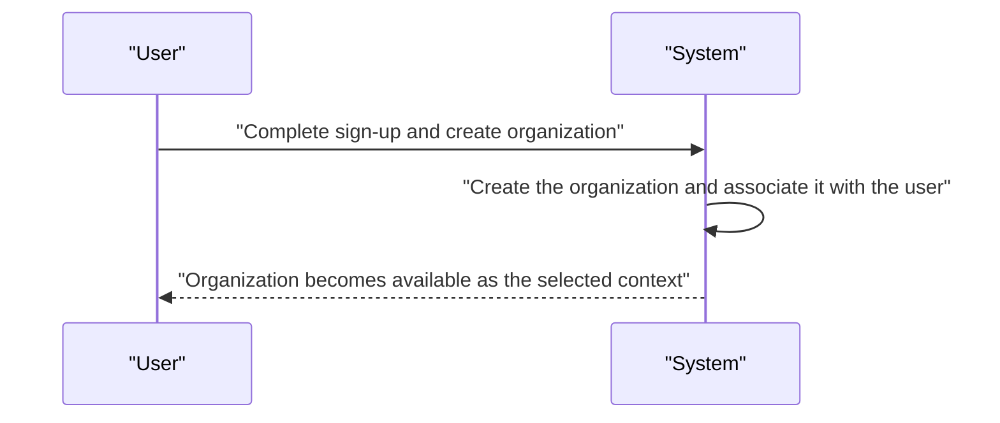

### Organization Settings

An organization has a name, description, logo image, currency, timezone, and fiscal start month. These values define the organization’s business identity and operating context. Organization owners can update these settings when business needs change.

Organization settings are managed within the selected organization context. Changes apply only to the organization being edited and do not affect other organizations the user may belong to.

The organization name identifies the organization in the platform. The description provides additional business information. The logo image represents the organization visually. The currency and timezone define how the organization is represented for business operations. The fiscal start month defines when the organization’s fiscal year begins.

### Independent Organization Data

Each organization operates independently with its own employees, projects, tasks, timelogs, timesheets, and related business records. Data belonging to one organization is not visible in another organization.

When a user belongs to multiple organizations, they see only the data for the organization they have currently selected. All actions on organization data remain scoped to the selected organization.

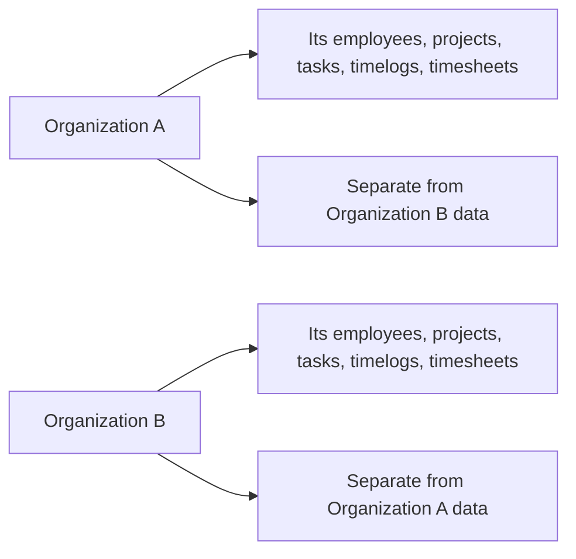

### Organization Deletion

An organization owner can delete the organization only after all pending timesheets have been resolved and there are no active employee contracts. This protects unresolved work records and active employment arrangements from being removed too early.

When an organization is deleted, all employees, projects, tasks, timelogs, and timesheets in that organization are permanently deleted. The owner’s account remains available, but it is no longer associated with any organization.

Organization deletion applies only to the organization in the current context and does not affect other organizations the owner may belong to.

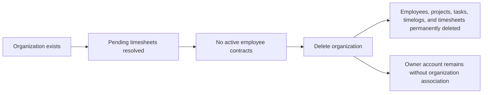

### Organization Context Switching

Users who belong to multiple organizations can switch between organizations without logging out. Switching organization changes the selected organization context and determines which organization’s data and operations are available.

All subsequent actions use the currently selected organization context. Users must remain within one organization context at a time when performing organization-scoped work.

## UserAccount Operations

Users create an account with an email and password and later log in with the same credentials. After logging in, they choose which organization to work in, and all following actions stay inside that organization context. A single user account can belong to multiple organizations, so the account must support moving between organizations without signing out. Users can change their password when they need to update access credentials. Each account also carries a shared global profile that is visible across all organizations the user belongs to. Users can edit their display name, avatar image, and phone number, and the updated profile should appear consistently wherever that user is shown. A user can delete their account, but if they are the sole owner of an organization they must transfer ownership or remove the organization first. When an account is deleted, any employee records tied to that user in other organizations are marked as deactivated rather than removed.

### Email and Password Sign-Up

Users can create a new account using an email address and password. The account becomes the user's global identity in the platform and can later be associated with one or more organizations. If the provided email is already in use, the sign-up request is rejected. When a new user signs up, the system supports placing that user into any pending organization invitations tied to the same email address.

### Email and Password Login

Users can log in using their email address and password. Successful login establishes access to the account and allows the user to continue into an organization context. If the email and password do not match an existing account, the login request is rejected.

### Selected Organization Context

After logging in, users select which organization they want to work in. The selected organization becomes the active context for subsequent actions, and all organization-scoped actions remain within that context until the user changes it. Users can switch between organizations without logging out, and switching changes only the active organization context rather than ending the session.

### Multiple Organization Membership

A single user account can belong to multiple organizations. The account preserves separate membership associations for each organization while keeping one shared global profile. A user can move between their organizations and continue working in the selected organization context without creating a new account.

### Password Change

Users can change their password after signing in. The account keeps the same email address while the password is updated. After the password is changed, the user continues to use the updated password for later logins.

### Shared Global Profile

Each user has one global profile that is shared across all organizations the user belongs to. The profile includes display name, avatar image, and phone number. Changes to the global profile are reflected consistently wherever the user appears in the platform, regardless of organization.

### Display Name Editing

Users can edit their display name as part of their shared global profile. The updated display name applies across all organizations where the user is visible.

### Avatar Image Update

Users can update their avatar image as part of their shared global profile. The updated avatar image applies across all organizations where the user is visible.

### Phone Number Update

Users can update their phone number as part of their shared global profile. The updated phone number applies across all organizations where the user is visible.

### Account Deletion Rules

Users can delete their account. Account deletion is allowed only when the user has handled any organization ownership constraints that would prevent deletion. If the user is the sole owner of an organization, the user must transfer ownership or delete the organization first. When an account is deleted, the account remains removed from the platform while other affected organization data follows the account deletion rules defined for those organizations.

### Sole Owner Must Transfer Ownership First

If a user is the sole owner of an organization, the account cannot be deleted until ownership is transferred to another user or the organization is deleted. This rule protects organizations from becoming ownerless before account removal.

### Employee Records Deactivated in Other Organizations

When a user deletes their account, their employee records in organizations other than the one being removed are marked as deactivated instead of being deleted. Historical information tied to those employee records remains preserved.

## OrganizationMembership Operations

Organization membership connects a user account to a specific organization and defines that person's working context there. When a user joins an organization, they receive one role within that organization and can only act according to that role's permissions. Membership creation happens through sign-up, invitation acceptance, or direct assignment when an invited email already belongs to an existing account. Users with the right employee management permission can change role assignment for a membership. Each employee in an organization must have exactly one role, so role changes replace the previous role rather than adding a second one. Membership access is always scoped to the selected organization, which prevents cross-organization actions from leaking into another context. If a user deletes their account or an organization is removed, the membership relationship ends as part of that lifecycle. Users who belong to multiple organizations can keep separate memberships for each one and switch between them as needed.

### Organization Membership Context

Organization membership links a user account to exactly one organization context at a time. A membership determines which organization the user is currently working in and scopes subsequent actions to that organization. A user can hold multiple memberships, one for each organization they belong to. Switching between memberships changes the active organization context without removing any other membership. Membership access is organization-specific, so actions taken in one organization do not affect memberships in another organization.

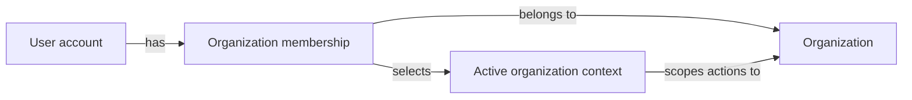

### One Role Per Organization Membership

Each organization membership carries exactly one role within that organization. The role defines what the user can do in that organization. When a role assignment changes, the previous role is replaced rather than added alongside the new role. A membership cannot be valid without a role assigned to it. Because roles are organization-specific, the same user may have different roles in different organizations.

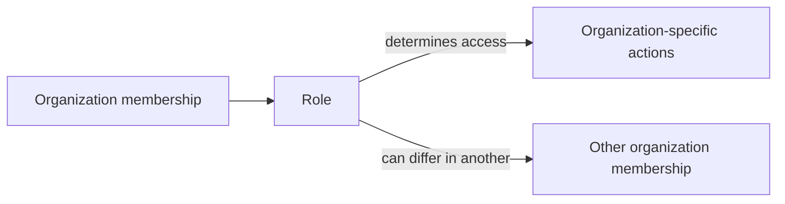

### Invitation Acceptance Into an Organization

An invited user can become a member of an organization by accepting the invitation through the normal account-joining flow. If the invited email already belongs to an existing account, that account is added to the organization immediately. If the email does not yet belong to an account, the invitation remains pending until the person signs up with that email. When the person later signs up, the pending invitation becomes an active membership and the user is automatically attached to the organization.

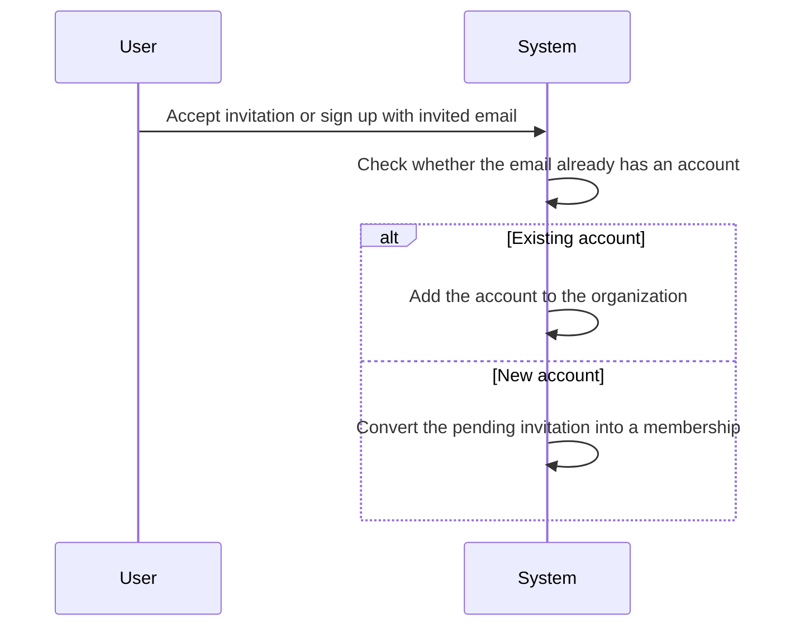

### Existing Account Added to Organization

When an invitation is sent to an email address that already belongs to an existing account, the system adds that account to the organization without creating a second account. The new membership uses the organization’s role assignment rules and becomes part of the user’s list of memberships. This allows a person who already has an account to join another organization while keeping the same shared account profile.

The same account may be added to multiple organizations independently, with one separate membership per organization.

### Pending Invitation Becomes Membership

If an invitation is issued to an email address that does not yet belong to an account, the invitation remains pending until sign-up occurs with that email. When sign-up happens, the system converts the pending invitation into an organization membership automatically. The user then becomes part of the organization without needing a separate manual add step. Pending invitations are therefore a temporary state that resolves into an active membership once the matching account is created.

### Role Assignment Within Membership

Role assignment belongs to the membership, not to the user globally. A user with employee management permission can assign a role to a membership and later change that role. Changing the role updates the membership’s organization access immediately for that organization only. Because the organization keeps its own roles, role assignment must always be evaluated within the selected organization context.

### Role Change for a Member

A member’s role can be changed after they have already joined the organization. The new role replaces the previous role for that organization membership. The change does not affect any memberships the same user has in other organizations. A role change is therefore an organization-scoped update to how the member participates in that specific organization.

### Selected Organization Scope

A user who belongs to multiple organizations must work within one selected organization at a time. All membership-related actions apply only to the currently selected organization. The selected organization determines which membership, role, and access scope are active. Changing the selected organization changes the context for membership actions without altering the underlying memberships themselves.

### Multiple Memberships Per User

A single user account can have multiple organization memberships. Each membership is independent and belongs to one organization only. The user may keep separate roles and access scopes across organizations. This allows the same person to participate in multiple organizations without merging their organizational identities into one shared membership.

### Organization-Specific Access

Access granted through a membership applies only within that membership’s organization. A member can act only in the organization selected for the current context. Permissions from one organization do not grant access in another organization. This ensures that membership-based access remains isolated per organization even when the same user belongs to multiple organizations.

### Membership Lifecycle on Account Deletion

When a user deletes their account, their memberships end as part of that lifecycle. If the user is the sole owner of an organization, they must transfer ownership or delete the organization first before the account can be removed. After account deletion, the user no longer retains membership access to organizations tied to that account. If the user still has employee records in other organizations, those records are marked as deactivated as described in the employee lifecycle requirements.

### Membership Lifecycle on Organization Deletion

When an organization is deleted, all memberships associated with that organization end. The organization’s members are no longer associated with it after deletion. Deleting the organization also removes all organization-scoped data, and the owner’s account remains but is no longer associated with any organization. This means the membership lifecycle ends together with the organization lifecycle rather than remaining independently active.

## Role Operations

Each organization has its own set of roles, and role definitions do not cross organizational boundaries. The system provides three built-in roles: Owner, Manager, and Employee, and these cannot be deleted. Owner has full access, including role and member management, while Manager and Employee support progressively narrower operational duties. Organization owners can create custom roles when the built-in roles do not fit the business structure. A custom role consists of a name and a set of permissions chosen from the available permission set. Owners can edit custom roles as responsibilities change. A custom role can be deleted only when no employees are assigned to it, which prevents breaking existing membership assignments. Role assignment can be changed by users who have employee management permission, so role maintenance is part of everyday organization administration.

### Organization-Specific Roles

Each organization maintains its own role definitions, and role definitions do not cross organizational boundaries.

The system provides three built-in roles within every organization: Owner, Manager, and Employee.

The Owner role has full access to all features and can manage roles and members.

The Manager role can manage employees, projects, approve timesheets, and view reports.

The Employee role can track time, submit timesheets, and view own data.

Built-in roles are permanent and cannot be deleted.

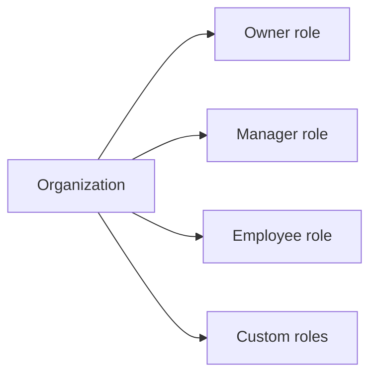

### Custom Role Creation and Editing

Organization owners can create custom roles when the built-in roles do not fit the organization’s structure.

A custom role consists of a name and a set of permissions chosen from the available permission set.

Organization owners can edit custom roles as responsibilities change.

Custom role definitions remain within the organization where they were created.

Custom roles are defined by permissions from the approved organization permission set only.

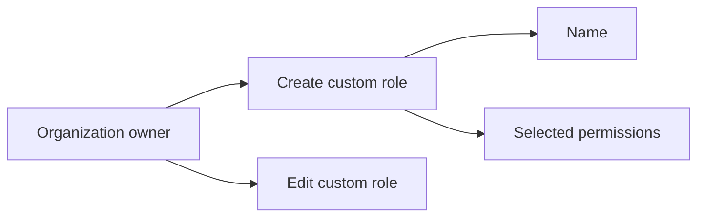

### Custom Role Deletion and Assignment Constraints

Organization owners can delete custom roles only if no employees are assigned to them.

This restriction prevents removal of a role that is still in use by employee assignments.

Each employee in an organization is assigned exactly one role.

Role assignment can be changed by users with employee management permission.

Users with member management permission can manage role assignment changes for employees within the organization.

If a role assignment changes, the employee must remain assigned to exactly one role in that organization.

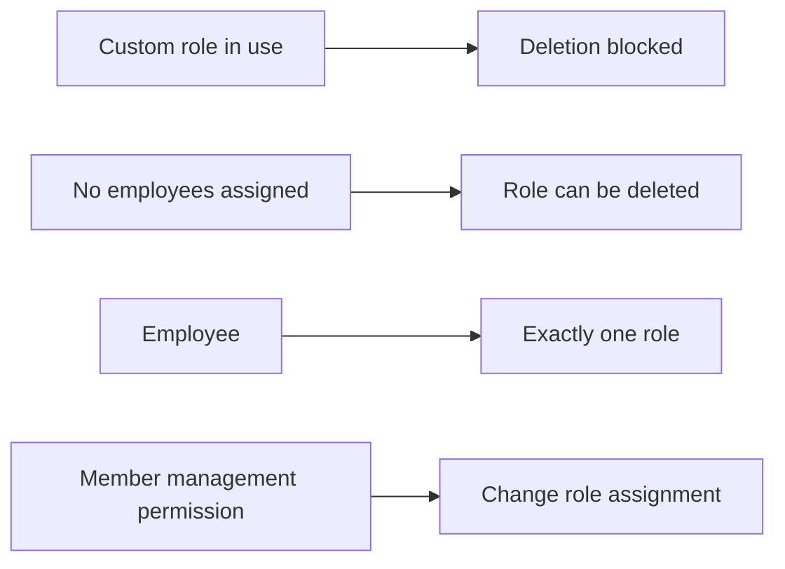

## Employee Operations

Employees are created when a user is invited to an organization or when an invited email later signs up and is automatically linked to pending organizations. Each employee record belongs to one organization and includes a role, optional department, optional position or title, employment type, and status. Users with employee management permission can edit department, position, and employment type to keep staff records current. They can also deactivate employees when access should stop, and deactivated employees can no longer log time or submit timesheets. Historical timelogs and timesheets remain available after deactivation so past work is preserved. Deactivated employees can later be reactivated when they return to active work. Users with employee view permission can browse the employee list, search by name, and filter by department, employment type, or status. The employee list is paginated so large organizations can still review staff efficiently.

### Employee Invitation by Email

Users with employee management permission can invite a new employee to an organization by email.
If the invited email already belongs to a user account, the system adds that account as an employee in the organization.
If the invited email does not yet belong to a user account, the system creates a pending invitation for that organization.
When a person later signs up with an email that has a pending invitation, the system automatically adds them to the pending organization membership and creates the employee record for that organization.
Invitation-based employee creation always belongs to one organization and does not affect the person’s other organization memberships.

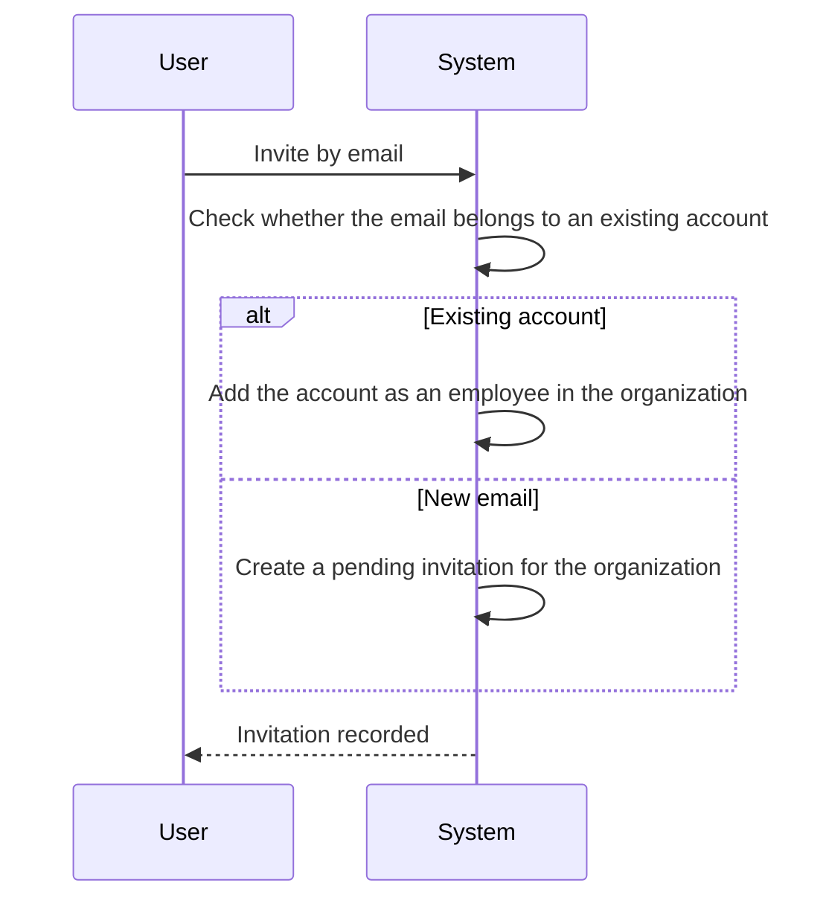

### Employee Record Per Organization

Each employee record belongs to exactly one organization.
The same user account may have separate employee records in different organizations.
An employee record stores the organization-specific role, optional department, optional position or title, employment type, and status.
Users with employee management permission can edit the department, position or title, and employment type for an employee record.
The employee record is the organization-specific representation of that person and is kept separate from the shared user profile.

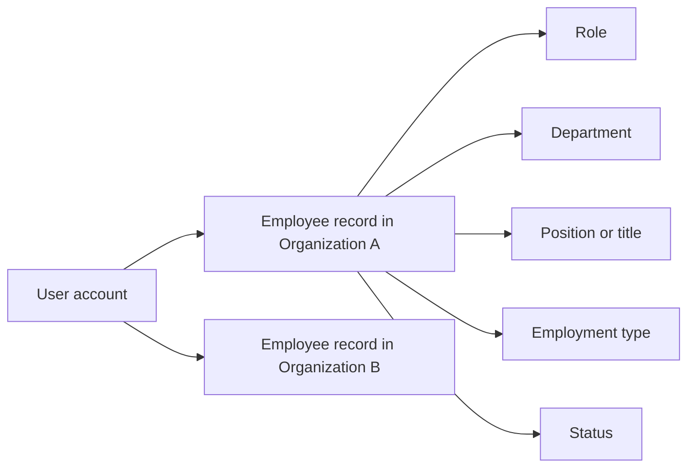

### Employment Details

Users with employee management permission can assign or change an employee’s department.
Users with employee management permission can set or update an employee’s position or title.
Users with employee management permission can set or update an employee’s employment type.
Employment type is selected from full-time, part-time, contractor, or intern.
The department, position or title, and employment type values are maintained as part of the employee record for that organization.


### Employee Status

An employee record can be active or deactivated.
Users with employee management permission can deactivate an employee when access should stop.
Users with employee management permission can reactivate a deactivated employee.
A deactivated employee remains in the organization history with preserved timelogs and timesheets.
A reactivated employee returns to active participation in the organization.

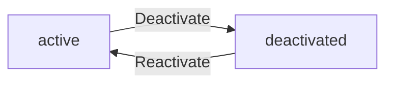

### Time Access Restrictions for Deactivated Employees

While an employee is deactivated, the system does not allow that employee to log time.
While an employee is deactivated, the system does not allow that employee to submit timesheets.
Historical timelogs and timesheets for a deactivated employee remain available and are not removed by deactivation.


### Employee List Browsing

Users with employee view permission can browse the employee list for the selected organization.
The employee list can be searched by name.
The employee list can be filtered by department, employment type, and status.
The employee list is paginated.
Search, filtering, and pagination apply only to the current organization context.
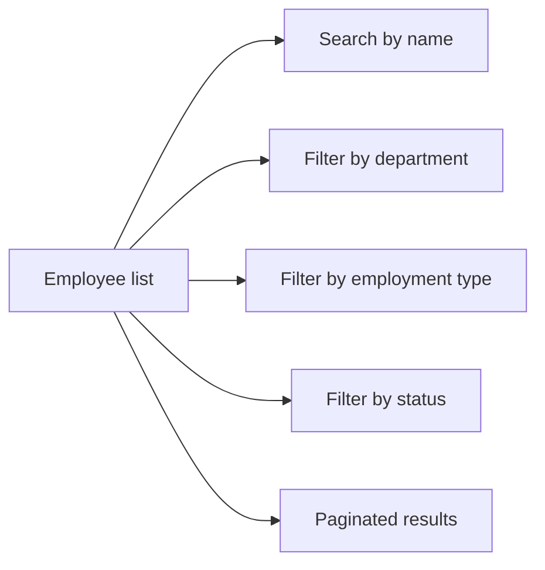

## EmployeeContract Operations

Each employee can have multiple contracts over time, but only one contract can be active at any moment. A contract captures the start date, optional end date, pay rate, pay period, working hours per week, and notes. Users with employee management permission can create a new contract for an employee when employment terms change. Creating a new contract automatically closes the previous active contract by ending it the day before the new one begins. Current active contracts can be edited when compensation or schedule terms change, but past contracts stay immutable as historical records. Employees can view their own contract history, and users with employee view permission can view contracts for any employee in the organization. This supports long-term tracking of employment terms without losing earlier records. The contract history should always reflect the employee's sequence of active and past arrangements.

### Employee Contract History

Each employee can have multiple contracts over time, and the system must preserve them as a historical record of employment terms. The contract history must show the sequence of contracts for an employee in the order they were used. Employees can view their own contract history, and users with employee view permission can view the contract history of any employee in the organization. The contract history is the authoritative view for reviewing how an employee’s pay and working arrangement changed over time.

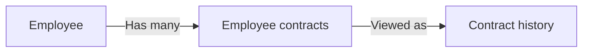

### Single Active Contract

At any moment, an employee can have only one active contract. A new contract becomes the current active contract when it starts, and any earlier contract for the same employee must no longer be active. This rule ensures that the employee’s current pay and working arrangement are unambiguous.

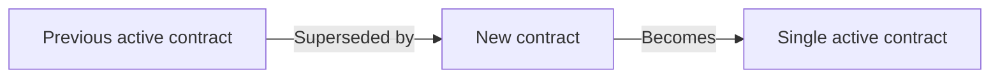

### Contract Details

A contract must include a start date. A contract may include an end date, and when no end date is provided the contract is treated as ongoing. A contract must also include a pay rate, a pay period, and working hours per week. A contract may include notes for additional employment terms or context. These details define the employee’s compensation and working arrangement for that contract period.

### Creating a New Contract

Users with employee manage permission can create a new contract for an employee when employment terms change. When a new contract is created, the system automatically ends the employee’s previous active contract by setting its end date to the day before the new contract starts. This keeps the contract history continuous and prevents overlapping active contracts.

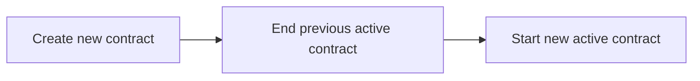

### Editing the Active Contract

Users with employee manage permission can edit the current active contract when compensation or schedule terms change. The active contract is the only contract that can be edited. Changes apply to the employee’s current employment terms while preserving past contracts as historical records.

### Immutable Past Contracts

Past contracts cannot be edited. Once a contract is no longer the active contract, it remains unchanged as part of the employee’s history. This preserves the accuracy of the historical record for previous pay and working arrangements.

## Department Operations

Organizations can organize employees into departments to reflect their internal structure. A department has a name, description, and optional parent department, allowing one level of nesting for simple hierarchy. Users with organization management permission can create, edit, and delete departments as the organization changes. Employees can view the department list to understand how the organization is structured. When a department is deleted, employees are not deleted with it; instead, their department assignment is cleared. This protects employee records while removing an obsolete structural grouping. Department management must therefore balance flexible organization design with the need to preserve staff data. The department model remains limited to one parent level so the structure stays easy to understand and maintain.

### Department Creation and Editing

Organizations can create departments to organize employees into a clear internal structure. Each department has a name and description, and both are defined here as the primary identifying and explanatory details for the department. Users with organization management permission can create departments and update these details as the organization changes.

Departments support a parent department so organizations can model a simple hierarchy. The parent department is defined here as the department directly above another department in the organization structure. This hierarchy is limited to one level of nesting, so a department may have one parent, and that parent does not create deeper chains of sub-departments.

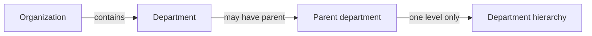

### Department Deletion and Employee Assignment

Users with organization management permission can delete departments when the organization no longer needs them. Deleting a department removes the department as an organizational grouping, but it does not delete employees.

When a department is deleted, any employees assigned to that department have their department cleared. This preserves employee records while removing the obsolete department structure.

If a department is used as a parent department, deleting it removes that grouping from the organization structure as well. The department hierarchy remains limited to one level of nesting, so deletion only affects the department being removed and any employees linked to it.

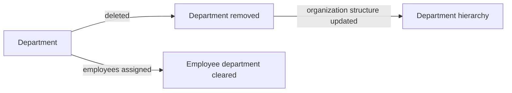

### Department Visibility and Staff Grouping

Employees can view the list of departments to understand how the organization is structured. This visibility supports staff grouping by department so employees can see the organizational grouping used within their organization.

Department visibility is read-only for employees. Editing department details, including the department name, description, and parent department, remains restricted to users with organization management permission.

Departments are organization-scoped and are used only within the organization that created them. This keeps the department structure aligned with the organization’s own internal setup.

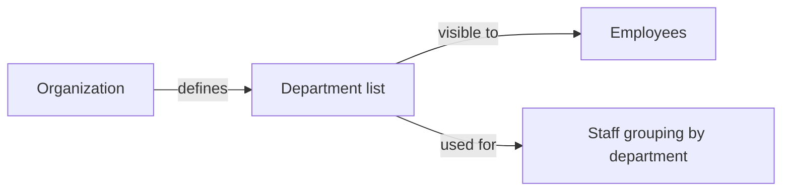

## Project Operations

Users with project management permission can create projects for the organization and keep them updated throughout their lifecycle. A project includes a name, description, color code for display, status, optional budget hours, optional start date, and optional end date. Projects can be edited as scope or planning changes occur. Project managers can archive or complete projects when work ends or when a project should no longer accept new time entries. Archived and completed projects remain visible, and existing timelogs tied to them are preserved. However, those projects cannot receive new timelogs after they are no longer active. A project can be deleted only if no timelogs are associated with it, which prevents removing work history accidentally. Users with project view permission can browse the project list, which is paginated and filterable by status.

### Project Creation and Editing

Users with project management permission can create projects for their organization and update them as planning changes occur.
A project is defined by its name, description, color code, status, optional budget hours, optional start date, and optional end date.
The project name identifies the project within the organization.
The description provides additional business context for the project.
The color code is used for display purposes.
The status shows whether the project is active, archived, or completed.
The budget hours represent the planned total hours for the project when budgeted work is needed.
The start date and end date may be used to describe the project timeframe.
Users with project management permission can edit a project after it has been created, including its descriptive details and lifecycle-related fields.

### Project Status Lifecycle

A project begins in an active state unless it is created in another allowed status.
Users with project management permission can archive a project when work is no longer active.
Users with project management permission can complete a project when the work has finished.
Archived and completed projects remain available for viewing.
Archived and completed projects preserve existing timelogs that were already linked to them.
Archived and completed projects cannot receive new timelogs after they are no longer active.

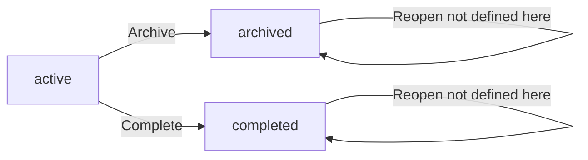

### Project Deletion

Users with project management permission can delete a project only when no timelogs are associated with it.
If any timelog is associated with the project, deletion is not allowed.
This rule prevents removing a project that still has recorded work history.

### Project List Browsing

Users with project view permission can browse the project list.
The project list is paginated.
Users can filter the project list by status.
The available status filter values are active, archived, and completed.
Projects remain visible in the list according to the selected filter and pagination settings.

## ProjectMembership Operations

Project membership assigns an employee to a project so the person can participate in the work. A single employee can belong to multiple projects, which allows flexible staffing across the organization. Each project membership includes the employee, the project, and an assigned role of either member or project-lead. Users with project management permission can add employees to projects and remove them when staffing changes. Project leads gain the ability to manage tasks within their own project, which makes project membership an important operational control. Employees can view the projects they are assigned to so they understand where they are expected to contribute. Membership changes should keep project participation aligned with current team structure. The assigned role also determines whether the employee can directly manage project tasks or simply participate as a member.

### Employee Assignment to Project

Employees can be assigned to a project so they can participate in the work for that project.
A single employee can belong to multiple projects at the same time, allowing staffing to be shared across the organization.
Each assignment links one employee to one project and records the employee’s assigned role within that project.
Project assignment is an organization-level staffing action and must keep participation aligned with the current team structure.

```mermaid
flowchart LR
    A["Employee"] -->|"Assigned to"| B["Project"]
    B -->|"Contains"| C["Project Membership"]
    C -->|"Carries"| D["Assigned Role"]
```

### Project Member and Project Lead Roles

A project membership uses one of two assigned roles: member or project-lead.
The member role allows the employee to participate in the project as an assigned team member.
The project-lead role identifies the employee as a lead for that project.
The assigned role determines whether the employee can directly manage tasks within the project.
Project leads are limited to task management within the project where they hold that role; the role does not grant control over other projects.


### Add Employees to Projects

Users with project management permission can add employees to a project.
When an employee is added to a project, the system creates a project membership for that employee and project.
The employee is then able to participate in the project according to the assigned role.
An employee may be added to more than one project, and each project membership is tracked separately.
If a project membership already exists for the employee and project combination, the system does not create a duplicate membership.

### Remove Employees from Projects

Users with project management permission can remove employees from a project.
When an employee is removed from a project, the project membership ends and the employee is no longer assigned to that project.
Removing an employee from a project changes who can participate in that project and supports staffing changes when the team structure changes.
If the removed employee was a project lead, the employee no longer has project-lead task management ability in that project after removal.
Removing an employee from one project does not affect the employee’s memberships in other projects.

### Project Lead Task Management

Project leads can manage tasks within their own project.
This task management right comes from the project-lead role on the project membership.
Users with project management permission can also manage tasks in the project.
If an employee is not assigned as a project lead in a project, the employee cannot rely on project membership alone to manage tasks in that project.

```mermaid
flowchart LR
    A["Project Membership"] -->|"Role is project-lead"| B["Task management rights in project"]
    A -->|"Role is member"| C["Project participation only"]
```

### Employee View of Assigned Projects

Employees can view the projects they are assigned to.
The project list shown to an employee reflects only the projects where the employee has a project membership.
This view helps employees understand where they are expected to contribute and which projects currently include them.
An employee’s assigned projects are determined by the employee’s project memberships, including memberships in multiple projects.

### Staffing Changes and Project Participation Control

Project membership is used as the control point for project participation.
Adding an employee to a project increases the set of projects the employee can participate in.
Removing an employee from a project decreases that set and immediately changes the employee’s participation in that project.
Project membership changes are how staffing changes are reflected in the system.
The system uses the assigned role to distinguish between general project participation and project lead responsibility.
Membership changes must keep the employee’s project access aligned with the current staffing arrangement.

## Task Operations

Tasks belong to projects and help teams break work into trackable items. Project leads can create tasks within their project, and users with project management permission can create and edit any task. Each task includes a title, description, status, priority, estimated hours, due date, an optional assigned employee, and an optional parent task for one level of subtasks. An assigned employee must already be a project member, which keeps task ownership within the project team. Project leads can edit tasks in their own project, while project management permission provides broader control across all tasks. Task status supports open, in-progress, completed, and closed states to reflect progress. Employees can view tasks in projects they are assigned to, and the task list can be filtered by status, priority, and assigned employee. Tasks can also be sorted by due date, priority, or creation date so users can focus on the most urgent work.

### Task Creation Within a Project

Users with project management permission or project leads can create tasks within a project they are allowed to manage.

A task belongs to exactly one project and is created as part of that project’s work.

A task includes a title and may include a description, priority, estimated hours, due date, an assigned employee, and a parent task.

The task is created in the open status by default.

A task can only be created when it is associated with a valid project context.

### Task Details

A task has a title that identifies the work item.

A task may include a description to provide additional context about the work.

A task may include estimated hours to express the expected effort for the task.

A task may include a due date to indicate when the work is expected to be completed.

These task details are available for viewing and editing according to the user's task access rights.

### Task Status

A task can have one of four statuses: open, in-progress, completed, or closed.

The task status represents the current progress of the work.

Users who can manage tasks may change a task’s status within the allowed task workflow.

Task status changes are reflected in the task’s current state and remain available as part of the task record.

### Task Priority

A task can be marked with a priority to show how urgently it should be handled.

Task priority is one of the supported task attributes and can be set when the task is created or edited by users with task management access.

Tasks can be organized and reviewed according to their priority level.

### Assigned Employee

A task may be assigned to an employee.

The assigned employee must already be a member of the same project as the task.

A task can remain unassigned if no employee is selected.

When an employee is assigned to a task, the assignment stays within the project team.

### Parent Task and Subtasks

A task may have a parent task to represent a subtask relationship.

Subtasks are allowed only as one level of nesting.

A task can have either no parent task or one parent task, and a subtask cannot introduce another nested level beneath it.

Subtask relationships remain within the same project.

### Task Management by Project Leads

Project leads can manage tasks within their project.

Task management includes creating tasks and editing tasks in the project they lead.

Project management permission provides broader task control across tasks in the organization, while project leads manage tasks within their own project.

Task management access is limited to the scope granted by the user’s role or permission set.

### Task Filtering

Users can filter the task list by status.

Users can filter the task list by priority.

Users can filter the task list by assigned employee.

Filtering helps users focus on tasks that match specific work criteria within the project context.

### Task Sorting

Users can sort the task list by due date.

Users can sort the task list by priority.

Users can sort the task list by creation date.

Sorting helps users review tasks in the order most useful for planning and execution.

## TaskHistoryEntry Operations

Whenever a task changes status, the system records a history entry so teams can see how the task progressed over time. Each history entry captures the moment of change, the previous status, the new status, and the person who made the update. This creates a clear trail of responsibility for task movement across the workflow. Users can review history to understand how a task moved from open to completed or closed. The history is append-only from a business perspective, so past changes remain available for review. Because the history supports accountability, it should reflect the actual sequence of task status changes without overwriting earlier entries. This makes task history useful for both collaboration and operational review. The history view belongs with the task record and helps explain why the task currently sits in its present state.

### Task Status History

The system records a task status history for each task so users can review how the task progressed over time.

The task status history belongs with the task record and shows the sequence of status changes in the order they occurred.

The task status history supports task progress review by making prior status changes available for later inspection.

```mermaid
flowchart LR
    A["Task"] -->|"Status change"| B["Task status history"]
    B -->|"Shows sequence"| C["Progress review"]
```

### Recorded Status Change Details

Each history entry records the status change made to a task.

A history entry captures the timestamp of the change, the old status, the new status, and who made the change.

These recorded details provide a historical task record that explains what changed and who was responsible for the change.

The recorded entry remains associated with the task that changed so the change can be reviewed in the context of that task.

### Append-Only Historical Record

The task history is append-only from a business perspective.

Once a history entry has been recorded, it is preserved as part of the task's historical record.

Past task status changes are not overwritten by later changes, so the system keeps the full sequence of status changes intact.

This preserves the task workflow trail and allows users to review how the task moved through its lifecycle over time.

### Task Accountability and Review

The task history provides accountability by showing who made each status change.

Users reviewing a task can see the moment of change, the previous status, the resulting status, and the person responsible for the update.

This record supports operational review by making it possible to trace task movement from one status to another without losing earlier entries.

The history view is read as a trail of task progress rather than a mutable summary of the current state.

## Timelog Operations

Employees can create timelogs to record the work they performed on a specific day. Each timelog includes a date, duration in minutes, project, optional task, optional description, and a billable indicator. The selected project must be one the employee is assigned to, and any selected task must belong to that same project. Employees can only create timelogs for themselves, which keeps time reporting tied to the correct worker. They can edit their own timelogs only when the entries are not already included in an approved timesheet. They can delete their own timelogs only when the entries are not part of any submitted or approved timesheet. Users with time management permission can edit or delete any employee's timelogs. Users with time view-all permission can view all employees' timelogs, while ordinary employees can view only their own. The timelog list is paginated and can be filtered by date range, project, task, and billable status.

### Daily Timelog Entry

Employees can create a timelog to record work performed on a specific day. Each timelog is tied to one date and captures a single work entry for that day. The system uses timelogs as the basic unit of time tracking for employees.

### Duration in Minutes

Each timelog records the amount of time worked as a duration measured in minutes. The duration is required when a timelog is created. The recorded duration is used in time reporting and timesheet totals.

### Project Required for Timelog

A project is required for every timelog. The selected project must be one that the employee is assigned to. A timelog cannot be saved if no project is selected or if the selected project is not available to that employee.

### Task Must Belong to Selected Project

A timelog may include a task. When a task is selected, it must belong to the same project chosen for the timelog. A task from a different project cannot be used with the timelog.

### Description of Work Done

A timelog may include a description of the work done. The description is optional and is used to capture additional detail about the recorded work.

### Billable Status

A timelog includes a billable indicator. The billable status is optional at entry time and defaults to billable when no value is provided. The billable status is used when viewing and filtering timelogs.

### Self-Created Timelog Only

Employees can create timelogs only for themselves. A user cannot create a timelog on behalf of another employee. Timelog ownership always remains with the employee who logged the time.

### Own Timelog Editing Rules

Employees can edit only their own timelogs. A timelog can be edited by its owner only when it is not included in an approved timesheet. Once a timelog is part of an approved timesheet, the owner can no longer change it.

### Own Timelog Deletion Rules

Employees can delete only their own timelogs. A timelog can be deleted by its owner only when it is not part of any submitted or approved timesheet. Once a timelog has been submitted in a timesheet, or included in an approved timesheet, the owner can no longer delete it.

### Approved Timesheet Locks Timelogs

When a timesheet is approved, all timelogs included in that timesheet become locked. Locked timelogs cannot be edited or deleted. The lock preserves the approved time record.

### Submitted Timesheet Protects Timelogs

When a timelog is included in a submitted timesheet, it is protected from deletion by its owner. Submitted timesheet protection continues until the timesheet is no longer submitted. This protection applies in addition to the stronger lock that applies after approval.

### Time Management Permission

Users with time management permission can edit or delete any employee's timelogs. This permission allows time management users to act beyond the normal self-service restriction that applies to employees.

### View All Employees Timelogs

Users with permission to view all employees' timelogs can view timelogs across the organization. Ordinary employees can view only their own timelogs. Timelog visibility follows the user's current organization context.

### Timelog Pagination

The timelog list is paginated. Users view timelogs in pages rather than as one unbroken list. Pagination applies to timelog browsing for both personal and organization-wide access.

### Timelog Filters by Date Range Project Task Billable

The timelog list can be filtered by date range, project, task, and billable status. Users can combine these filters to narrow the timelogs they are reviewing. Filtering applies only to timelogs within the user's current organization context.

## Timesheet Operations

Employees use timesheets to group timelogs for a specific week from Monday through Sunday. A timesheet belongs to one employee and moves through draft, submitted, approved, and rejected states. Creating a draft timesheet automatically gathers that employee's timelogs for the week so the weekly record starts complete. Employees can add or remove timelogs from a draft timesheet before submission. A timesheet cannot be submitted if it has no timelogs, which prevents empty weekly submissions. A timesheet also cannot be submitted if another timesheet for the same week is already submitted or approved. Users with time approval permission can view submitted timesheets, approve them, or reject them with a reason. Approved timesheets lock the included timelogs, while rejected timesheets return to draft so the employee can revise and resubmit them. Employees can view their own timesheets, and the list is paginated and filterable by status and date range.

### Weekly Timesheet Period

A timesheet represents one employee's work for a single calendar week from Monday through Sunday.

The timesheet period is defined by the week start date on Monday and the week end date on Sunday.

```mermaid
flowchart LR
    A["Monday"] --> B["Timesheet Week"] --> C["Sunday"]
```

The timesheet belongs to one employee and covers only the timelogs that fall within that week.

### Draft Timesheet

An employee can create a draft timesheet for a specific week.

Creating a draft timesheet automatically includes all timelogs for that employee in the selected week.

A draft timesheet is the editable state of the weekly record, and the employee can review it before submission.

```mermaid
flowchart LR
    A["No timesheet"] -->|"Create draft"| B["Draft timesheet"]
    B -->|"Submit"| C["Submitted timesheet"]
    B -->|"Modify"| B
```

### Draft Timelog Changes

An employee can add timelogs to a draft timesheet.

An employee can remove timelogs from a draft timesheet.

These changes are allowed only while the timesheet remains in draft status.

### Submit Timesheet for Approval

An employee can submit a draft timesheet for approval.

Submitting a timesheet changes its state from draft to submitted.

```mermaid
flowchart LR
    A["Draft timesheet"] -->|"Submit for approval"| B["Submitted timesheet"]
```

### Submission Restrictions

A timesheet cannot be submitted if it has no timelogs.

A timesheet cannot be submitted if another timesheet for the same week is already submitted or approved.

### Submitted Timesheet

A submitted timesheet is ready for review by users with approval permission.

A submitted timesheet remains associated with the employee and the weekly period until it is approved or rejected.

### Approved Timesheet

A user with approval permission can approve a submitted timesheet.

When a timesheet is approved, all timelogs included in that timesheet become locked and cannot be edited or deleted.

```mermaid
flowchart LR
    A["Submitted timesheet"] -->|"Approve"| B["Approved timesheet"]
    B -->|"Locks included timelogs"| C["Locked timelogs"]
```

### Rejected Timesheet

A user with approval permission can reject a submitted timesheet.

A rejection reason is required when rejecting a timesheet.

When a timesheet is rejected, it returns to draft status so the employee can revise it and submit it again.

```mermaid
flowchart LR
    A["Submitted timesheet"] -->|"Reject with reason"| B["Rejected timesheet"]
    B -->|"Return to draft"| C["Draft timesheet"]
```

### Timesheet Approval Permission

Only users with approval permission can view all submitted timesheets, approve submitted timesheets, and reject submitted timesheets.

Employees can view their own timesheets.

### Timesheet List and Filters

The timesheet list is paginated.

The timesheet list can be filtered by status and by date range.

Employees can use the list to find their timesheets for specific weeks or statuses.

## Timer Operations

Employees can start a live timer to capture time as they work in real time. Each employee may have only one active timer at a time, which keeps live tracking simple and avoids overlapping sessions. Starting a timer requires choosing a project, and a task may be attached if needed. The running timer keeps track of the start timestamp, selected project, selected task, and description. Employees can view the timer that is currently running so they know time is still being tracked. They can edit the description and the project or task while the timer is running if the work context changes. When they stop the timer, the system turns the live session into a timelog with the calculated duration rounded to the nearest minute. They can also discard the timer, which ends the session without creating a timelog. If the timer is never stopped, it continues running until the employee acts on it.

### Live Time Tracking

Employees can track work in real time by starting a live timer while they are working. The timer represents an active work session and captures time as it passes until the employee stops it or discards it. This supports real-time work capture without requiring the employee to wait until the end of the day to record time.

```mermaid
sequenceDiagram
    participant E as "Employee"
    participant S as "System"
    E->>S: "Start timer"
    S->>S: "Begin live work session"
    E->>S: "Stop or discard timer"
    S->>S: "End the session"
```

The system supports viewing the currently running timer so the employee can confirm that live time capture is still in progress.

The system allows the employee to edit the running timer context while it is active when the work focus changes.

### One Active Timer Per Employee

Each employee may have only one active timer at a time. Starting a new timer is only possible when the employee does not already have a running timer.

If an employee already has an active timer, the system must not allow a second active timer to exist for that employee at the same time.

### Start Timer With Project

To start a timer, the employee must choose a project. The timer is started in the context of that selected project.

The system records the running timer with the selected project so the live work session is tied to the correct project from the beginning.

### Optional Task On Timer

When starting a timer, the employee may attach a task or leave the timer without a task. If a task is selected, it is part of the running timer context.

A task can be associated with a running timer only when the employee wants to capture work at the task level.

### Running Timer Description

A running timer can include a description of the work being performed. The description is part of the timer context and helps explain what the employee is doing during the live session.

Employees can update the description while the timer is still running if the work being captured changes.

### View Currently Running Timer

Employees can view the timer that is currently running for them. The running timer view shows the active live session so the employee knows that time is still being captured.

If no timer is running, there is no currently running timer to view.

### Edit Running Timer Context

Employees can edit the project, task, and description of a running timer while it is active. This lets them correct the work context when the live session shifts to a different project or task.

The system keeps the timer active while the context is being updated.

### Stop Timer Creates Timelog

When an employee stops a running timer, the system converts the live work session into a timelog. The timelog captures the recorded work as a completed time entry.

```mermaid
flowchart LR
    A["Running timer"] -->|"Stop"| B["Timelog"]
```

Stopping the timer ends the live session and creates the timelog from the tracked work.

### Duration Rounded To Nearest Minute

When a timer is stopped, the resulting timelog duration is calculated from the live session and rounded to the nearest minute. The rounded duration is the duration stored for the created timelog.

This rounding applies when converting the running timer into a timelog.

### Discard Timer

Employees can discard a running timer instead of stopping it. Discarding ends the live session without creating a timelog.

A discarded timer does not produce a time entry for later reporting or approval.

### Timer Continues Until Stopped

If an employee does not stop a running timer, the timer continues running indefinitely. The system does not automatically stop the timer on its own.

The timer remains active until the employee stops it or discards it.

### Real-Time Work Capture

The timer is intended for real-time work capture while the employee is actively working. The system preserves the live session state so the employee can record work as it happens rather than reconstructing it later.

This workflow supports immediate capture, later review through the running timer, and final conversion into a timelog when the session ends.

## ActivityLogEntry Operations

The system records important organization actions as activity log entries so administrators can review meaningful changes after they happen. Each entry captures when the action occurred, who performed it, what type of action it was, which target was affected, and supporting details. Logged actions include employee invitations, deactivation, reactivation, contract creation and editing, project creation, archiving, completion, and deletion, task status changes, timesheet submission, approval, and rejection, and role assignment or change. Users with organization management permission can view the full activity log. The activity log is paginated so large organizations can review it over time. It can also be filtered by action type, user, and date range to narrow the audit trail. The log supports operational oversight and helps explain how key records changed across the organization. Because it reflects significant business events, it should show a trustworthy sequence of actions rather than a summary of current state.

### Activity Log Entry

An activity log entry records a significant organization event after it happens. Each entry captures the time of the action, the user who performed it, the action type, the target entity affected, and details of the change. The log exists to provide a trustworthy business record of important changes within the organization rather than a summary of current state.

The system stores activity log entries only for the significant actions explicitly supported for this organization, including employee invitations, employee deactivations, employee reactivations, contract creation or editing, project creation, archiving, completion, and deletion, task status changes, timesheet submission, timesheet approval, timesheet rejection, and role assignment or role change.

Mermaid diagram:
```mermaid
flowchart LR
    A["Significant business action"] --> B["Activity log entry"]
    B --> C["Timestamp of action"]
    B --> D["User who performed action"]
    B --> E["Action type"]
    B --> F["Target entity"]
    B --> G["Details of change"]
```


### Timestamp of Action

Every activity log entry includes the time at which the action occurred. This allows the organization to review events in the order they happened and understand when each significant change took place.

The timestamp belongs to the activity log entry and identifies when the recorded action was performed.

Mermaid diagram:
```mermaid
flowchart LR
    A["Activity log entry"] --> B["Timestamp of action"]
```


### User Who Performed Action

Every activity log entry identifies the user who performed the action. This makes it possible to review who caused each recorded organization event.

The user who performed the action is stored as part of the activity log entry and is shown alongside the recorded event.

Mermaid diagram:
```mermaid
flowchart LR
    A["User"] --> B["Activity log entry"]
    B --> C["User who performed action"]
```


### Action Type

Every activity log entry includes an action type that describes the kind of business event that occurred. The action type is used to distinguish between supported events such as employee invitations, contract changes, project lifecycle events, task status changes, timesheet decisions, and role assignment changes.

The action type reflects what happened, not the current state of the target entity.

Mermaid diagram:
```mermaid
flowchart LR
    A["Activity log entry"] --> B["Action type"]
    B --> C["Employee invited"]
    B --> D["Employee deactivated"]
    B --> E["Employee reactivated"]
    B --> F["Contract created or edited"]
    B --> G["Project lifecycle event"]
    B --> H["Task status changed"]
    B --> I["Timesheet submitted, approved, or rejected"]
    B --> J["Role assigned or changed"]
```


### Target Entity

Every activity log entry identifies the target entity affected by the action. The target entity is the organization object that the event was about, such as an employee, contract, project, task, timesheet, or role.

This allows users with organization management permission to understand which record was changed without relying only on the action type.

Mermaid diagram:
```mermaid
flowchart LR
    A["Activity log entry"] --> B["Target entity"]
    B --> C["Employee"]
    B --> D["Employee contract"]
    B --> E["Project"]
    B --> F["Task"]
    B --> G["Timesheet"]
    B --> H["Role"]
```


### Details of Change

Every activity log entry includes details of the change that help explain what happened. These details provide supporting business context for the recorded action so that the log can be reviewed as a meaningful audit trail.

The system records the details of change together with the action type, the target entity, and the user who performed the action.

Mermaid diagram:
```mermaid
flowchart LR
    A["Activity log entry"] --> B["Details of change"]
```


### Employee Invited Log

When an employee is invited to the organization, the system records an activity log entry for that invitation. The entry shows when the invitation action occurred, who initiated it, the action type for employee invitation, the target employee or invitation context, and the related details.

This gives the organization a record of when a person was brought into the organization workflow.

Mermaid diagram:
```mermaid
sequenceDiagram
    participant U as User
    participant S as System
    U->>S: Invite employee by email
    S->>S: Record activity log entry
    S-->>U: Invitation logged
```


### Employee Deactivated Log

When an employee is deactivated, the system records an activity log entry for the deactivation. The entry captures the time of the action, the user who performed it, the deactivation action type, the affected employee, and the change details.

This provides a clear business record that the employee was removed from active participation in the organization.

Mermaid diagram:
```mermaid
sequenceDiagram
    participant U as User
    participant S as System
    U->>S: Deactivate employee
    S->>S: Record activity log entry
    S-->>U: Deactivation logged
```


### Employee Reactivated Log

When an employee is reactivated, the system records an activity log entry for the reactivation. The entry includes the time of the action, the user who performed it, the reactivation action type, the affected employee, and the related details.

This provides a business history of when an inactive employee returned to active status.

Mermaid diagram:
```mermaid
sequenceDiagram
    participant U as User
    participant S as System
    U->>S: Reactivate employee
    S->>S: Record activity log entry
    S-->>U: Reactivation logged
```


### Contract Created or Edited Log

When an employee contract is created or edited, the system records an activity log entry for that contract change. The entry shows when the change happened, who made it, the contract action type, the affected contract, and the details of the change.

This preserves a business record of how the employee’s contract history changed over time.

Mermaid diagram:
```mermaid
sequenceDiagram
    participant U as User
    participant S as System
    U->>S: Create or edit contract
    S->>S: Record activity log entry
    S-->>U: Contract change logged
```


### Project Lifecycle Log

When a project is created, archived, completed, or deleted, the system records an activity log entry for that project lifecycle event. The entry identifies the time of the action, the user who performed it, the project lifecycle action type, the project as the target entity, and the details of the change.

This lets the organization review the history of major project lifecycle decisions.

Mermaid diagram:
```mermaid
flowchart LR
    A["Project created"] --> B["Activity log entry"]
    C["Project archived"] --> B
    D["Project completed"] --> B
    E["Project deleted"] --> B
```


### Task Status Changed Log

When a task status changes, the system records an activity log entry for that status change. The entry includes the time of the action, the user who performed the change, the task status change action type, the task as the target entity, and the details of the change.

This gives the organization a business record of how work moved through task states.

Mermaid diagram:
```mermaid
sequenceDiagram
    participant U as User
    participant S as System
    U->>S: Change task status
    S->>S: Record activity log entry
    S-->>U: Status change logged
```


### Timesheet Submitted Approved Rejected Log

When a timesheet is submitted, approved, or rejected, the system records an activity log entry for that timesheet decision. The entry shows when the event occurred, who performed the action, the relevant action type, the timesheet as the target entity, and the decision details.

This creates a business trail for the review and approval process of employee time reporting.

Mermaid diagram:
```mermaid
flowchart LR
    A["Timesheet submitted"] --> D["Activity log entry"]
    B["Timesheet approved"] --> D
    C["Timesheet rejected"] --> D
```


### Role Assigned or Changed Log

When a role is assigned or changed, the system records an activity log entry for that role change. The entry includes the time of the action, the user who performed it, the role assignment action type, the role or employee assignment as the target entity, and the details of the change.

This provides a business record of how access responsibilities were adjusted within the organization.

Mermaid diagram:
```mermaid
sequenceDiagram
    participant U as User
    participant S as System
    U->>S: Assign or change role
    S->>S: Record activity log entry
    S-->>U: Role change logged
```


### Organization Management Permission

Only users with organization management permission can view the full activity log. This permission gates access to the organization’s complete audit trail so that only authorized users can review the recorded business events.

Activity log viewing is an organization-level capability and applies to the currently selected organization.

Mermaid diagram:
```mermaid
flowchart LR
    A["Organization management permission"] --> B["View full activity log"]
```


### Activity Log Pagination

The activity log is paginated so that large organizations can review entries over time. Pagination applies to the list of activity log entries and supports browsing the log in manageable segments.

The log remains ordered as a business history of events while allowing users to move through the entries page by page.

Mermaid diagram:
```mermaid
flowchart LR
    A["Activity log entries"] --> B["Paginated list"]
    B --> C["Page 1"]
    B --> D["Page 2"]
```


### Activity Log Filters by Action User Date Range

The activity log can be filtered by action type, by user, and by date range. These filters help users with organization management permission narrow the audit trail to the events they need to review.

Filtering applies to the activity log list and does not change the underlying recorded history.

Mermaid diagram:
```mermaid
flowchart LR
    A["Activity log entries"] --> B["Filter by action type"]
    A --> C["Filter by user"]
    A --> D["Filter by date range"]
```


# Error Scenarios and Edge Cases

Business-level error scenarios, edge case coverage, and expected system behaviors for exceptional conditions.

## Organization Error Scenarios

Organization setup can fail when required details are missing or when a user does not have the right to create or edit the organization. If an owner tries to delete an organization while there are pending timesheets or active employee contracts, the system must block the deletion and explain what still needs to be resolved. When an organization is deleted, all related operational data is removed permanently, so the system should treat this as an irreversible action. If a user no longer belongs to an organization after deletion, their account remains available but they must not keep access to that organization’s data. Users who belong to multiple organizations must never see settings or records from the wrong organization. Organization settings changes should apply only to the selected organization context. If a user tries to work without a selected organization, the system should not allow organization-scoped actions. Invalid organization details such as an unsupported currency, timezone, or missing required name should be rejected. A deleted organization should not be editable or reused for new work. Any attempt to manage organization data without ownership or the proper permission should fail cleanly.

### Organization Deletion Guards

An organization owner can delete an organization only when all pending timesheets have been resolved and there are no active employee contracts.
If pending timesheets still exist, the organization deletion request is rejected.
If any active employee contract still exists, the organization deletion request is rejected.
A deletion request must fail when either of these conditions is still true, even if all other organization data is otherwise valid.
When deletion is blocked, the system must indicate that the organization still has unresolved timesheets or active contracts that must be addressed first.
When an organization is deleted, all employees, projects, tasks, timelogs, and timesheets in that organization are permanently removed.
The owner’s account remains after organization deletion, but it is no longer associated with any organization.
After deletion, the removed organization must not be available for further organization-scoped work or editing.

```mermaid
flowchart LR
    A["Delete organization requested"] --> B{"Pending timesheets exist?"}
    B -->|"Yes"| C["Reject deletion"]
    B -->|"No"| D{"Active employee contracts exist?"}
    D -->|"Yes"| C
    D -->|"No"| E["Delete organization and all related organization data"]
    E --> F["Owner account remains without organization association"]
```

### Organization Settings Access and Context Isolation

Only the owner of an organization can edit that organization’s settings.
Organization settings edits must apply only to the currently selected organization.
Users who belong to multiple organizations must not see or change data from an organization other than the one they selected.
If no organization is selected, organization-scoped actions are rejected.
A user can switch between organizations without logging out, and the selected organization determines the scope of the next action.
Any attempt to manage an organization without ownership is rejected.
Any attempt to use data from the wrong organization context is rejected.
Users must remain isolated to the selected organization while performing organization-scoped actions.

```mermaid
flowchart LR
    A["User selects organization"] --> B["Selected organization becomes active context"]
    B --> C["Organization-scoped action"]
    C --> D{"Context selected?"}
    D -->|"No"| E["Reject action"]
    D -->|"Yes"| F{"Matches selected organization?"}
    F -->|"No"| E
    F -->|"Yes"| G["Allow action within selected organization"]
```

### Organization Detail Validation

Organization details are rejected when required information is missing.
Organization details are rejected when the organization name is missing.
Organization details are rejected when the currency is unsupported.
Organization details are rejected when the timezone is unsupported.
Organization details are rejected when the information provided is otherwise invalid for organization setup or editing.
Invalid organization details must not be saved.
A deleted organization must not be editable.
A deleted organization must not be reused for new work.
Any organization settings change must be rejected if the provided details do not match the allowed organization information.

## UserAccount Error Scenarios

Account sign-up must fail when the email or password is missing or invalid. Login must fail when the credentials do not match an existing account. When a user belongs to multiple organizations, the system must require them to choose the organization context before performing organization-scoped actions. Users should be able to switch organizations without logging out, but the selected context must always control what data they can access. Changing a password should fail if the current password is incorrect. When a user deletes their account, the system must prevent deletion if they are the sole owner of an organization until ownership is transferred or the organization is removed. If account deletion succeeds, employee records in other organizations must be marked as deactivated instead of being erased. A newly signed-up user with a previously invited email should automatically join pending organizations rather than creating duplicate memberships. Profile updates should be limited to the shared global profile and must not create separate profiles per organization. Any attempt to use a deleted account should be blocked.

### Account Sign-Up and Login Validation

Account sign-up must be rejected when the email address is missing or invalid.
Account sign-up must be rejected when the password is missing or invalid.
Login must be rejected when the email address and password do not match an existing account.
Login must be rejected when the account has been deleted.

### Password Change Validation

A password change must be rejected when the current password is incorrect.
A password change must be rejected when the user does not provide both the current password and the new password.

### Organization Context Selection

When a user belongs to more than one organization, the system must require the user to choose an organization context before allowing any organization-scoped action.
If a user switches to another organization, the system must update the selected organization context without ending the session.
Any organization-scoped action performed after switching organizations must use only the newly selected organization context.

### Account Deletion Restrictions

Account deletion must be rejected when the user is the sole owner of an organization and has not transferred ownership or removed the organization first.
If account deletion is allowed, the user account must be removed from its organizations as required by the account deletion rules.
Any attempt to use a deleted account must be rejected.

### Invitation Recovery After Sign-Up

When a user signs up with an email address that already has a pending invitation, the system must automatically add the user to the pending organizations linked to that invitation.
The system must not create duplicate organization memberships when the same invited email later becomes a registered account.

### Shared Global Profile Constraints

A user's profile must remain a single global profile shared across all organizations.
Profile updates must apply to the shared global profile only and must not create separate profiles for individual organizations.
An attempt to treat profile details as organization-specific must be rejected.

### Employee Records After Account Deletion

When an account is deleted, the user's employee records in other organizations must be marked as deactivated rather than erased.
Historical employee data in those organizations must remain available after the account is deleted.

## OrganizationMembership Error Scenarios

Membership changes must always respect the selected organization context, because the same user can belong to more than one organization. When an invited email already belongs to an account, the user should be added directly; when it does not, the system should keep the invitation pending until the person signs up. If a user signs up with an email that has pending invitations, they must be attached to those organizations automatically. Membership operations should reject attempts that target the wrong organization or a user outside the current organization. If a user loses their membership in an organization, they must no longer be able to act inside that organization. The system must not create duplicate memberships for the same person in the same organization. Any action that depends on employee management or ownership should fail when the membership role does not allow it. A user switching organizations should not carry over membership data from another organization. Membership status changes must preserve the association history needed for ongoing business operations.

### Organization Context and Scoped Membership

Membership actions and membership-derived access apply only within the currently selected organization. A user who belongs to multiple organizations must not carry membership data from one organization into another selected organization. Any membership-related action that targets an organization other than the selected one is rejected. A user who no longer has membership in an organization must not be able to act within that organization. Membership status changes preserve the association history needed for ongoing business operations.

Mermaid:
```mermaid
flowchart LR
    A["User selects organization"] --> B["Scoped membership actions"]
    B --> C["Correct organization"]
    B --> D["Wrong organization"]
    D --> E["Action rejected"]
    B --> F["Membership lost"]
    F --> G["No organization access"]
```

### Invitation Outcomes for Existing Accounts and Pending Sign-Ups

When an invited email already belongs to an existing account, the person is added directly to the organization. When the invited email does not yet belong to an account, the system keeps the invitation pending until sign-up. If a user signs up with an email that has pending invitations, the system automatically attaches the new account to those pending organizations. The same person must not receive duplicate memberships in the same organization through repeated invitations or sign-up handling. Invitation processing must keep the organization association aligned with the invited email address.

Mermaid:
```mermaid
sequenceDiagram
    participant U as User
    participant S as System
    U->>S: Invite email to organization
    S->>S: Check whether account exists
    alt Existing account
        S->>S: Add user directly to organization
    else No account yet
        S->>S: Keep invitation pending
        U->>S: Sign up with invited email
        S->>S: Attach account to pending organizations
    end
```

### Duplicate Membership Prevention and Wrong-Organization Rejection

The system must prevent creating more than one membership for the same person in the same organization. Membership actions are rejected when they target a user who is already associated with that organization in the relevant membership context. Membership actions are also rejected when they are attempted against the wrong organization context. These rules apply whether the action originates from an invitation, a sign-up flow, or a membership change.

Mermaid:
```mermaid
flowchart LR
    A["Membership action requested"] --> B["Check selected organization"]
    B --> C["Check existing membership"]
    C --> D["No duplicate"]
    C --> E["Duplicate detected"]
    E --> F["Action rejected"]
    B --> G["Wrong organization"]
    G --> F
```

### Role-Based Membership Action Limits

Membership actions must respect the role assigned within the current organization. Actions that depend on employee management or ownership must fail when the membership role does not allow them. A membership change that requires elevated access is rejected unless the user has the appropriate authority in the selected organization. If a membership status change or role-related action would remove the user's ability to act in the organization, the system must enforce that loss of access immediately within that organization context.

Mermaid:
```mermaid
flowchart LR
    A["Request membership action"] --> B["Check selected organization role"]
    B --> C["Role allows action"]
    C --> D["Proceed"]
    B --> E["Role does not allow action"]
    E --> F["Action rejected"]
```

### Association History Preservation Across Membership Status Changes

Changing membership status must preserve the association history needed for business continuity. A membership status change must not erase the record that the user belonged to the organization. If a user loses membership and later regains access, the prior association history remains available to support ongoing operations. The system must preserve membership change history even when the user can no longer act in the organization after the status change.

Mermaid:
```mermaid
flowchart LR
    A["Membership active"] --> B["Status changes"]
    B --> C["Membership inactive"]
    B --> D["Membership restored later"]
    C --> E["History preserved"]
    D --> E
```

## Role Error Scenarios

Built-in roles must never be deleted, even by organization owners. Custom role creation should fail if the role name is missing or if the permission set is not valid for the organization. When editing a custom role, the system must preserve the built-in roles unchanged. A custom role cannot be deleted while any employee is still assigned to it. Role assignment changes must fail for users without employee management permission. If a user’s role changes, their access should update immediately for future actions within that organization. The system must not allow duplicate role names that would confuse member management. Attempts to assign permissions outside the approved permission list should be rejected. Role changes should remain organization-specific and must not affect the same user in other organizations. Built-in owner, manager, and employee roles should remain available as baseline options in every organization.

### Built-In Roles Cannot Be Deleted

Built-in roles remain permanently available in every organization.
An organization owner cannot delete the built-in Owner, Manager, or Employee roles.
The system preserves built-in roles unchanged even when custom roles are created, edited, or deleted.
If a deletion request targets a built-in role, the request is rejected.

```mermaid
flowchart LR
    A["Built-in role"] -->|"Delete requested"| B["Rejected"]
    C["Custom role"] -->|"Delete requested"| D["Deletion rules apply"]
```

### Custom Role Creation Validation

A custom role can be created only when a role name is provided.
A custom role can be created only when the requested permissions are valid for the organization.
The system rejects creation when the role name is missing.
The system rejects creation when the permission set is not valid for the organization.
The system keeps custom role creation separate from built-in roles.


### Custom Role Deletion Blocked by Assigned Employees

An organization owner can delete a custom role only when no employees are assigned to it.
If any employee is still assigned to the custom role, the deletion request is rejected.
Once the role is no longer assigned to any employee, it becomes eligible for deletion.
Employees assigned to a custom role must be reassigned before the role can be removed.


### Role Assignment Change Requires Employee Management Permission

Only users with employee management permission can change an employee’s role within an organization.
If a user without employee management permission attempts to change a role assignment, the request is rejected.
Role assignment changes affect only the selected organization.
A role assignment change does not alter the user’s roles in other organizations.


### Permission Set Limited to Approved List

A custom role may include only permissions from the organization’s approved permission list.
The system rejects any permission that is outside the approved list.
The approved permissions available for custom roles are limited to organization management, employee management, employee viewing, project management, project viewing, time management, time approval, viewing all timelogs and timesheets, and report viewing.
The system does not allow arbitrary permissions to be added to a role.


### Duplicate Role Name Rejected

Role names must be unique within the organization.
If a new role name duplicates an existing role name in the same organization, the request is rejected.
This uniqueness rule applies to custom roles and built-in role names alike.
The system uses the organization as the scope for duplicate-name checking.


### Organization-Specific Role Management

Roles are managed separately for each organization.
A role created in one organization is not shared with other organizations.
Changing a role in one organization does not change the same-named role in another organization.
Role deletion, editing, and assignment follow the organization context selected by the user.
Users can only manage roles within the currently selected organization.


### Built-In Owner, Manager, and Employee Roles

Every organization includes the built-in Owner, Manager, and Employee roles.
These built-in roles serve as the baseline role options for member assignment in that organization.
Built-in roles remain available even when no custom roles exist.
The system preserves the built-in role set as part of organization-specific role management.


### Role Access Updates Immediately After Change

When an employee’s role is changed, the employee’s access updates immediately for future actions in that organization.
The new role determines what the employee can do after the change takes effect.
The role change does not need the employee to log out and log back in before the new access applies.
Role changes do not retroactively change actions already completed under the previous role.


## Employee Error Scenarios

Employee invitations should fail if the email is invalid or if the inviter lacks employee management permission. If an invited email already has an account, the person should be added to the organization instead of receiving a separate pending invitation. Employee edits must be limited to allowed business details such as department, position, employment type, and role assignment when permitted. The system should reject attempts to assign more than one role to the same employee in the same organization. Deactivated employees must not be allowed to log time or submit timesheets, but their past records must remain visible and preserved. Reactivation should restore participation in current work without deleting history. Employee list access should fail for users without employee view permission. Filtering and searching should return only employees from the selected organization and should not mix data across organizations. If an employee record is removed by organization deletion, the user account itself should not be destroyed unless account deletion is separately performed. Any attempt to update an employee outside the current organization should be blocked.

### Employee Invitation and Account Attachment

Employee invitations are sent by email and are available only to users with employee management permission.

If the invited email already belongs to an existing account, that account is added to the organization instead of creating a separate pending invitation.

If the invited email does not yet belong to an existing account, the system creates a pending invitation for that email.

When a person signs up with an email that has a pending invitation, the system automatically adds that account to the pending organizations.

If an invitation is attempted without employee management permission, the request is rejected.

If an invitation is attempted with an email that cannot be used for invitation matching, the request is rejected.

### Employee Editing and Role Assignment Limits

Employee edits are limited to business details that the organization allows users with employee management permission to manage.

The system rejects attempts to edit an employee outside the current organization.

The system rejects attempts to assign more than one role to the same employee within the same organization.

Role assignment changes are allowed only for users with employee management permission.

If a user without employee management permission attempts to change an employee’s role, the request is rejected.

### Employee Deactivation and Reactivation

When an employee is deactivated, the employee can no longer log time.

When an employee is deactivated, the employee can no longer submit timesheets.

A deactivated employee’s historical records remain preserved.

A deactivated employee can be reactivated.

When an employee is reactivated, the employee’s preserved history remains available and is not deleted.

If a deactivated employee attempts to log time or submit a timesheet, the request is rejected.

### Employee List Access, Search, and Filters

Employee list access requires employee view permission.

If a user without employee view permission attempts to view the employee list, the request is rejected.

Employee search and filters apply only to employees in the currently selected organization.

The employee list can be filtered by department, employment type, and status.

The employee list can be searched by name.

Search and filter results must not mix employees from other organizations into the selected organization’s results.

If the selected organization is not available for the current action, the request is rejected.

## EmployeeContract Error Scenarios

A contract cannot be created without a start date, pay rate, or working hours per week. If a new contract is created for an employee, the previous active contract must end the day before the new one starts, and the system should prevent overlapping active contracts. Past contracts must remain immutable, so edits should be rejected once a contract is no longer active. Only the current active contract can be edited. If users try to create a contract with an end date earlier than its start date, the system should reject it. Users without employee management permission must not be able to create or edit contracts. Employees should be able to view their own contracts, but access to another employee’s contracts requires employee view permission. Contract records must stay within the employee’s organization and not bleed across organizations. A contract creation attempt for a deactivated or unknown employee should fail. Historical contract data should remain available even after later contract changes.

### Contract Required Fields

A contract cannot be created unless it includes a start date, a pay rate, and working hours per week.

The start date defines when the contract begins and is required for every contract.
The pay rate defines the compensation amount for the contract and is required for every contract.
The working hours per week define the employee’s expected weekly working time and are required for every contract.

If any of these required values are missing, the system rejects the contract creation attempt.

### Active Contract Overlap Prevention

An employee can have only one active contract at a time.

When a new contract is created for an employee, the system must prevent it from overlapping with an existing active contract.
If the new contract would overlap with the current active contract, the system rejects the creation attempt.
This rule preserves a single active employment arrangement for the employee at any point in time.

### Ending the Previous Contract Before the New One Starts

When a new contract is created for an employee, the previous active contract is automatically ended before the new contract begins.

The end date of the previous active contract is set to the day before the new contract’s start date.
This ensures the employee’s contract history remains continuous without overlapping active periods.

### Immutable Past Contracts

Past contracts are immutable historical records.

Once a contract is no longer active, it cannot be edited.
Any attempt to change a past contract is rejected.
Only the current active contract remains eligible for editing.

### Editing the Current Active Contract Only

Only the current active contract can be edited.

If a user attempts to edit any contract that is no longer active, the system rejects the request.
If a user attempts to edit a contract that is not the employee’s current active contract, the system rejects the request.
This rule ensures that only the ongoing contract can be maintained.

### Contract View Permission

Viewing another employee’s contracts requires employee view permission.

An employee may view their own contracts.
A user may view another employee’s contracts only when they have the employee view permission in the organization.
If the user does not have that permission, the system rejects access to the contract records.

### Organization-Scoped Contract Access

A contract must stay within the organization where it belongs.

Contract creation, viewing, and editing are limited to the employee’s organization.
A contract cannot be created for an employee outside the current organization context.
A contract cannot be viewed or edited from a different organization context.
This keeps contract records isolated to the correct organization.

## Department Error Scenarios

Department creation, editing, and deletion should fail when the user does not have organization management permission. A department must have a valid name, and attempts to save incomplete department details should be rejected. If a department is deleted, employees assigned to it should not be deleted; instead, their department assignment should be cleared. The system should handle parent departments carefully so that only one level of nesting is allowed. Attempts to create deeper department hierarchies should be blocked. Deleting a parent department should not remove its employees or break their records. Employees should still be able to view the department list even if they cannot manage departments. Department actions must remain within the selected organization and must not affect departments in another organization. If a user tries to assign a department that no longer exists, the system should reject the change. Duplicate or confusing department structures should be avoided within the same organization.

### Department Management Access

Department creation, editing, and deletion are available only to users with organization management permission. If a user does not have that permission, the system rejects the request. Employees without organization management permission can still view the department list, but they cannot change department data.

### Department Name Validation

A department must have a name before it can be saved. If the name is missing or incomplete, the system rejects the department change. Department details cannot be saved unless the department information is complete enough to identify it within the organization.

### One Level of Nesting Only

A department can have at most one parent department. The system blocks any attempt to create a deeper department hierarchy. If a department is assigned a parent that would create more than one nesting level, the change is rejected.

### Delete Department Behavior

When a department is deleted, any employees assigned to that department remain in the organization. Their department assignment is cleared instead of deleting the employee record. Deleting a parent department does not remove the employees associated with it or break their records.

### Employee Visibility After Department Deletion

Employees remain available after their department is deleted, and their historical employee information is preserved. Department deletion changes only the department assignment and does not delete the employee or any other employee data.

### Department List Visibility

Employees can view the department list even when they do not have permission to manage departments. Department viewing remains within the selected organization and does not expose departments from another organization.

### Selected Organization Department Scope

All department actions are limited to the currently selected organization. A department change in one organization must not affect departments in another organization. If a user attempts to act on a department outside the selected organization, the system rejects the request.

### Missing Department Assignment Rejected

If a user tries to save an employee assignment to a department that no longer exists, the system rejects the change. The employee must not be linked to a missing department, and the failed assignment must not alter the employee record.

### Avoid Duplicate Department Structures

The system should avoid duplicate or confusing department structures within the same organization. If a department change would create a duplicate structure that makes departments unclear within the organization, the system rejects the change.

## Project Error Scenarios

Project creation and editing must fail when the user does not have project management permission. A project requires a name and a color code, so incomplete project details should be rejected. Users should not be able to create tasks or new time entries against archived or completed projects. Existing timelogs on archived or completed projects must stay preserved and readable. A project can only be deleted when no timelogs are associated with it, so the system should block deletion when usage history exists. Filtering by project status should only return projects in the selected organization. Project budget reporting should exclude projects without budget hours rather than treating them as zero-budget projects. If a user attempts to work on a project that belongs to another organization, the system must reject the action. Project status changes should be handled consistently so active, archived, and completed states do not conflict. Project list access should remain limited to users with project view permission.

### Project Creation and Editing Validation

Project creation and editing require the user to have project management permission. The system shall reject any attempt to create or edit a project when that permission is missing.

A project must have a name and a color code. The system shall reject incomplete project details when either value is missing.

These validation rules apply only within the currently selected organization, and project data from other organizations must not be accepted in the current context.

```mermaid
flowchart LR
    A["Create or edit project"] --> B["Check project management permission"]
    B -->|"Missing"| C["Reject action"]
    B -->|"Present"| D["Check name and color code"]
    D -->|"Incomplete"| C
    D -->|"Complete"| E["Allow action"]
```

### Project Status Restrictions

Archived and completed projects do not accept new timelogs. The system shall reject any attempt to create a new timelog for a project in either of these states.

Project status must remain internally consistent across project operations so that active, archived, and completed states do not conflict.

Existing timelogs on archived or completed projects remain preserved and readable, and this preserved history must not be removed by the status change itself.

```mermaid
flowchart LR
    A["Project status"] --> B["Active"]
    A --> C["Archived"]
    A --> D["Completed"]
    C -->|"New timelog"| E["Reject action"]
    D -->|"New timelog"| E
```

### Project Deletion Constraints

A project can be deleted only when it has no timelogs associated with it. The system shall block deletion when usage history exists for the project.

If timelogs are present, the delete request must fail even when the user otherwise has permission to manage projects.

```mermaid
flowchart LR
    A["Delete project request"] --> B["Check associated timelogs"]
    B -->|"None"| C["Allow deletion"]
    B -->|"Exists"| D["Block deletion"]
```

### Project Browsing and Filtering Scope

Users with project view permission can view projects in the currently selected organization. The system shall reject project list access when that permission is missing.

Project filtering by status must remain within the current organization. The system shall return only projects from the selected organization when a status filter is applied.

Filtering must not expose projects from any other organization, even when their status matches the requested filter.

```mermaid
flowchart LR
    A["View projects"] --> B["Check project view permission"]
    B -->|"Missing"| C["Reject access"]
    B -->|"Present"| D["Apply status filter within selected organization"]
    D --> E["Return matching projects only"]
```

### Project Budget Report Coverage

Projects without budget hours are excluded from the project budget report. The system shall not include those projects in the report results.

The report must compare budgeted hours against actual hours only for projects that have budget hours defined.

Projects without budget hours are omitted rather than treated as zero-budget projects.

```mermaid
flowchart LR
    A["Generate project budget report"] --> B["Check project budget hours"]
    B -->|"Defined"| C["Include project in report"]
    B -->|"Not defined"| D["Exclude project"]
```

## ProjectMembership Error Scenarios

Project assignment changes should fail when the user does not have project management permission. An employee can belong to multiple projects, but each project membership must clearly identify whether the employee is a regular member or a project lead. The system should reject assignments that reference an employee who is not part of the current organization. Removing an employee from a project should stop them from being treated as a project member immediately. If a project lead is removed, the system must also stop them from performing lead-level task management in that project. Duplicate assignments of the same employee to the same project should be prevented. Project membership changes should not affect the employee’s assignments in other projects. Employees should only see the projects they are actually assigned to. Any attempt to assign a role outside the allowed project membership roles should be rejected. Membership actions must stay within the selected organization.

### Project Assignment Permission and Organization Scope

Project assignment changes require the appropriate project management permission. The system shall reject any attempt to assign an employee to a project when the actor does not have permission to manage projects.

The system shall reject any attempt to assign an employee to a project when the employee does not belong to the current organization.

Membership actions must remain within the selected organization. The system shall reject any project membership change that targets a project outside the selected organization.

Employees can belong to multiple projects at the same time. The system shall preserve an employee’s memberships in other projects when a new membership is created, changed, or removed.

Any attempt to assign a project membership role outside the allowed project membership roles shall be rejected.

Any attempt to assign the same employee to the same project more than once shall be rejected.

```mermaid
flowchart LR
    A["Project assignment request"] --> B["Check permission"]
    B -->|"Not allowed"| C["Reject"]
    B -->|"Allowed"| D["Check organization membership"]
    D -->|"Outside current organization"| C
    D -->|"Inside current organization"| E["Check existing project membership"]
    E -->|"Duplicate assignment"| C
    E -->|"Unique assignment"| F["Check allowed project membership role"]
    F -->|"Invalid role"| C
    F -->|"Valid role"| G["Accept"]
```

### Removing Employees from Projects

Users with the appropriate project management permission can remove employees from projects. If the actor does not have that permission, the system shall reject the removal.

When an employee is removed from a project, the system shall stop treating that employee as a member of that project immediately.

If the removed employee was a project lead in that project, the system shall stop that employee from performing lead-level task management in that project immediately.

Removing an employee from one project shall not affect the employee’s memberships in any other projects.

Employees shall only see the projects they are actually assigned to. Once removed from a project, that project shall no longer appear in the employee’s assigned project list.

```mermaid
flowchart LR
    A["Remove employee from project"] --> B["Check permission"]
    B -->|"Not allowed"| C["Reject"]
    B -->|"Allowed"| D["Remove project membership"]
    D --> E["Employee no longer assigned to project"]
    E --> F["If project lead, revoke lead-level task management in that project"]
```

### Project Membership Role Limits

Each project membership shall use only one of the allowed project membership roles: member or project lead.

The system shall reject any membership change that uses a role outside those allowed project membership roles.

A project lead role applies only to the project in which it is assigned. The system shall not allow a project lead assignment to grant access to other projects.

A regular member assignment shall not grant lead-level task management in the project.

The system shall keep project membership role changes limited to the selected organization and the selected project.

```mermaid
flowchart LR
    A["Project membership role change"] --> B["Check role value"]
    B -->|"Member"| C["Accept"]
    B -->|"Project lead"| C
    B -->|"Any other role"| D["Reject"]
```

## Task Error Scenarios

Task creation should fail if the project lead does not have access to the project or if the user lacks project management permission when required. A task must have a title, and tasks without one should not be accepted. If a task is assigned to an employee, that employee must already be a member of the same project. Parent tasks must stay within one level of nesting, so deeper subtask chains should be blocked. Task editing should respect the difference between project leads and users with full project management permission. Task status changes should be recorded, and the system should reject changes that do not match the allowed task statuses. Filters for status, priority, and assigned employee should only apply within the current organization and project context. Sorting by due date, priority, or creation date should remain stable even when some tasks do not have due dates. Employees should only see tasks in projects they are assigned to. Any attempt to manage a task in another organization must be blocked.

### Task Error Scenarios

A task creation request is rejected if the task title is missing.

A task creation request is rejected if the task is assigned to an employee who is not already a member of the same project.

A task creation request is rejected if the parent task would create more than one level of subtask nesting.

A task management request by a project lead is rejected when the lead does not have access to the project.

A task management request that relies on project management privileges is rejected when the user does not have the required project-level access.

A task status change is rejected if the requested status is not one of the allowed task statuses.

A task filter by status, priority, or assigned employee applies only within the current organization and project context.

A task sorting request by due date, priority, or creation date remains valid even when some tasks do not have a due date.

An employee can view tasks only in projects they are assigned to.

Any attempt to view or manage a task from another organization is rejected.

```mermaid
flowchart LR
    A["Task request"] --> B["Validate organization context"]
    B --> C["Validate project access"]
    C --> D["Validate task fields"]
    D --> E["Accept task action"]
    B --> F["Reject cross-organization access"]
    C --> G["Reject unauthorized project access"]
    D --> H["Reject invalid task data"]
```

## TaskHistoryEntry Error Scenarios

Task history entries should be created only when a task status actually changes. If the same status is selected again, the system should not generate a misleading history record. Each history entry must stay tied to the correct task and organization so records do not mix across projects. History should preserve the timestamp, previous status, new status, and the person who made the change. Users should not be able to edit or delete history entries because they are part of the audit trail for task changes. If a task is moved between allowed states multiple times, each change should create a separate history entry in order. Missing information about who made a status change should prevent a valid history record from being stored. Employees should only see task history for tasks they are allowed to view in their assigned projects. History records must remain available even if the task is later closed or otherwise managed. Invalid task references should not produce history entries.

### Task Status Change History

A task status change shall create a task history entry only when the status actually changes.
If the selected status is the same as the current status, the system shall not create a new history entry.
Each history entry shall remain tied to the correct task and organization so that task history never mixes across projects or organizations.
Each history entry shall preserve the timestamp of the change, the previous status, the new status, and the person who made the change.
Users shall not be able to edit or delete task history entries because they are part of the audit trail for task changes.
When a task changes status multiple times, the system shall create a separate history entry for each change in the order the changes occurred.
If the person who made the status change cannot be identified, the system shall not create a valid history entry.
Employees shall only see task history for tasks they are allowed to view in their assigned projects.
Task history entries shall remain available even if the task is later closed.

### Task History Integrity

The system shall reject any attempt to create a history entry for an invalid task reference.
The system shall not create history entries for status changes that do not belong to a real task.
The system shall preserve the original history record even when the associated task changes later.
The system shall keep history entries associated with the same task that triggered them, even when several tasks exist in the same project.
The system shall not allow history records to be reassigned to a different task.
The system shall not allow history records to be moved to a different organization.
The system shall keep the recorded actor unchanged after the entry is created.
The system shall keep the recorded timestamps unchanged after the entry is created.

## Timelog Error Scenarios

A timelog must be rejected if the employee does not own it or if the action is outside the selected organization. Timelog creation should fail when the date, duration, or project is missing. The selected project must belong to a project the employee is assigned to, and the selected task must belong to that same project when a task is used. Employees can edit their own timelogs only before those timelogs become part of an approved timesheet. Employees can delete their own timelogs only before the timelog is included in any submitted or approved timesheet. Users with time management permission may edit or delete any employee’s timelogs, but they still must respect organization boundaries. Archived or completed projects must not accept new timelogs. If a timelog is part of approved work, the system should protect it from direct modification. Filtering and pagination should never expose timelogs from another organization. Billable and non-billable entries should remain distinguishable in the employee’s records and reports.

### Timelog Ownership Restriction

A timelog belongs to the employee who created it, and only that employee may make self-service changes to it.

If a user attempts to edit or delete a timelog that belongs to another employee, the system rejects the request.

If a user attempts to create a timelog for another employee, the system rejects the request.

Users with time management permission may act on another employee’s timelogs, but only within the current organization context.

### Timelog Requires Date, Duration, and Project

A timelog cannot be created unless the date, duration, and project are provided.

If any of those three values is missing, the system rejects the request.

If the project is not selected, the timelog cannot be created.

If the duration is not provided, the timelog cannot be created.

If the date is not provided, the timelog cannot be created.

### Task Must Belong to the Selected Project

When a timelog uses a task, that task must belong to the same project selected for the timelog.

If the task belongs to a different project, the system rejects the request.

If a task is selected for a timelog and the task does not match the selected project, the timelog cannot be saved.

### Self-Edit Blocked After Approved Timesheet

An employee may edit their own timelog only while that timelog is not part of an approved timesheet.

Once a timelog is included in an approved timesheet, the employee can no longer edit it.

If the employee tries to change a timelog that is part of an approved timesheet, the system rejects the request.

### Self-Delete Blocked After Submitted Timesheet

An employee may delete their own timelog only while that timelog is not part of any submitted or approved timesheet.

If a timelog is included in a submitted timesheet, the employee cannot delete it.

If a timelog is included in an approved timesheet, the employee cannot delete it.

If the employee tries to delete such a timelog, the system rejects the request.

### Time Management Permission for Any Timelog

Users with time management permission may edit or delete any employee’s timelogs.

This permission applies even when the timelog does not belong to the acting user.

If a user does not have time management permission and is not the timelog owner, the system rejects the edit or delete request.

### Archived Project Blocks New Timelogs

Archived projects do not accept new timelogs.

Completed projects do not accept new timelogs.

If an employee tries to create a timelog for an archived or completed project, the system rejects the request.

Existing timelogs on archived or completed projects remain preserved.

### Organization-Scoped Timelog Filtering

Timelog lists must remain limited to the currently selected organization.

Employees must not see timelogs that belong to another organization.

Filtering and pagination must never expose timelogs outside the selected organization.

Users who belong to multiple organizations see only the timelogs for the organization they have currently selected.

### Billable and Non-Billable Timelog Distinction

The system must keep billable and non-billable timelogs distinguishable in employee records and reports.

A timelog marked as billable must remain identifiable as billable.

A timelog marked as non-billable must remain identifiable as non-billable.

Reports and employee records must preserve this distinction when timelogs are viewed or summarized.

## Timesheet Error Scenarios

A timesheet should not be created or submitted for a week that is outside the employee’s normal work context or outside the selected organization. When a draft timesheet is created, it should collect the employee’s weekly timelogs, but the system must reject submission if there are no timelogs to submit. The system must also block submission when another timesheet for the same employee and week is already submitted or approved. If a submitted timesheet is approved, the included timelogs become locked and must not be edited or deleted afterward. If a submitted timesheet is rejected, it should return to draft status with a required rejection reason. Employees should only modify draft or rejected timesheets that belong to them. Approvers should only process submitted timesheets, not drafts or already resolved entries. Timesheet access should be limited to the employee’s own records unless approval permission is granted. Pagination and filtering should never cross organization boundaries. A timesheet with missing ownership or week boundaries should be treated as invalid.

### Draft Timesheet Collection and Submission Gatekeeping

A draft timesheet collects all timelogs for the employee’s selected week when the draft is created. The system includes the employee’s weekly timelogs in the draft so that the employee can review them before submission.

WHEN a draft timesheet is created, THE system SHALL include the employee’s timelogs for that week in the draft timesheet.
WHEN a timesheet submission is attempted, THE system SHALL reject the submission if the timesheet has no timelogs.
WHEN a timesheet submission is attempted, THE system SHALL reject the submission if another timesheet for the same employee and week is already submitted or approved.
IF a timesheet is missing ownership or week boundaries, THEN THE system SHALL treat it as invalid and SHALL NOT allow submission.
WHILE a timesheet remains in draft status, THE system SHALL allow the employee to continue modifying it.

```mermaid
flowchart LR
    A["Draft timesheet created"] --> B["Weekly timelogs included"]
    B --> C["Employee reviews draft"]
    C --> D["Submit requested"]
    D --> E{"Timelogs present?"}
    E -->|"No"| F["Reject submission"]
    E -->|"Yes"| G{"Same week already submitted or approved?"}
    G -->|"Yes"| F
    G -->|"No"| H["Accept submission"]
```

### Approved and Rejected Timesheet State Handling

Approved timesheets lock the included timelogs so they can no longer be edited or deleted. Rejected timesheets return to draft status and require a rejection reason.

WHEN a timesheet is approved, THE system SHALL lock all timelogs included in that timesheet.
WHILE a timelog is included in an approved timesheet, THE system SHALL prevent editing of that timelog.
WHILE a timelog is included in an approved timesheet, THE system SHALL prevent deletion of that timelog.
WHEN a timesheet is rejected, THE system SHALL require a rejection reason.
WHEN a submitted timesheet is rejected, THE system SHALL return it to draft status.
WHILE a timesheet is in draft status after rejection, THE system SHALL allow the employee to modify and resubmit it.

```mermaid
flowchart LR
    A["Submitted timesheet"] -->|"Approve"| B["Approved"]
    A -->|"Reject with reason"| C["Rejected"]
    C -->|"Return to draft"| D["Draft"]
    B -->|"Lock included timelogs"| E["Timelogs not editable or deletable"]
```

### Employee Self-Service on Own Draft or Rejected Timesheets

Employees can modify only their own draft or rejected timesheets. Employees cannot modify timesheets that belong to another employee. Employees can use this self-service only within the organization they are currently working in.

WHILE a timesheet belongs to the employee and is in draft status, THE system SHALL allow the employee to add or remove timelogs.
WHILE a timesheet belongs to the employee and is in rejected status, THE system SHALL allow the employee to add or remove timelogs.
IF a timesheet belongs to another employee, THEN THE system SHALL prevent the employee from modifying it.
IF a timesheet is not in draft or rejected status, THEN THE system SHALL prevent the employee from modifying it.
WHILE the employee is working in a selected organization, THE system SHALL limit timesheet access to timesheets in that organization only.

```mermaid
flowchart LR
    A["Employee opens timesheet"] --> B{"Own timesheet?"}
    B -->|"No"| C["Deny modification"]
    B -->|"Yes"| D{"Status draft or rejected?"}
    D -->|"No"| C
    D -->|"Yes"| E["Allow modification"]
```

### Approver Access Limited to Submitted Timesheets

Approvers handle submitted timesheets only. They do not process draft timesheets or timesheets that have already been approved or rejected.

WHILE a timesheet is in submitted status, THE system SHALL allow an approver to review it.
IF a timesheet is in draft status, THEN THE system SHALL prevent approver processing of that timesheet.
IF a timesheet is already approved or rejected, THEN THE system SHALL prevent approver processing of that timesheet.
WHILE a user does not have approval permission, THE system SHALL prevent access to submitted timesheet review actions.
WHILE approval review is available, THE system SHALL keep the timesheet’s organization context unchanged.

```mermaid
flowchart LR
    A["Timesheet status"] --> B{"Submitted?"}
    B -->|"Yes"| C["Approver can review"]
    B -->|"No"| D["No approver processing"]
    C --> E{"Approved or rejected already?"}
    E -->|"Yes"| D
    E -->|"No"| F["Approve or reject"]
```

### Organization-Scoped Timesheet Access

Timesheet access is limited to the selected organization. Pagination and filtering must remain within the same organization and must not return timesheets from any other organization.

WHILE a user is working in a selected organization, THE system SHALL show only timesheets that belong to that organization.
IF a timesheet belongs to a different organization, THEN THE system SHALL prevent access to it.
WHILE timesheets are paginated, THE system SHALL keep each page limited to the selected organization.
WHILE timesheets are filtered, THE system SHALL apply the filter only within the selected organization.
WHILE a user switches organization context, THE system SHALL update the accessible timesheets to match the newly selected organization.

```mermaid
flowchart LR
    A["Selected organization"] --> B["Timesheet access"]
    B --> C["Paginated results"]
    B --> D["Filtered results"]
    C --> E["Same organization only"]
    D --> E
    E --> F["No cross-organization access"]
```

## Timer Error Scenarios

An employee can have only one active timer at a time, so starting a second timer should be blocked until the current one is stopped or discarded. Starting a timer must include a project, and the project must be one the employee is assigned to. If a task is selected for the timer, it must belong to the same project. Employees should be able to edit the description and project or task of a running timer, but not after the timer has been stopped or discarded. Stopping a timer should create a timelog with rounded duration, and if the timer is not stopped it must continue running without automatic cutoff. Discarding a timer should remove the running entry without creating a timelog. The current timer should only be visible to the employee who started it and within the selected organization. Timer operations must fail when the employee is deactivated. If a user loses access to the assigned project while the timer is running, the system should block further changes that would violate project membership rules. Cross-organization timer actions must not be allowed.

### One Active Timer per Employee

An employee can have only one active timer at a time.
If an employee tries to start a new timer while another timer is already running, the system shall block the request.
The employee must stop or discard the existing timer before starting another one.

```mermaid
flowchart LR
    A["No active timer"] -->|"Start timer"| B["Active timer running"]
    B -->|"Stop timer"| C["No active timer"]
    B -->|"Discard timer"| C
    B -->|"Start another timer"| D["Blocked"]
```

### Timer Requires Assigned Project

Starting a timer requires selecting a project.
If no project is selected when the employee starts a timer, the system shall block the request.
The timer must belong to a project that is available in the employee's current organization context.

### Timer Task Must Belong to Project

If an employee selects a task for a timer, that task must belong to the same project selected for the timer.
If the task belongs to a different project, the system shall block the request.
A timer may be started without a task, but it may not reference a task from another project.

### Running Timer Can Be Edited

While a timer is running, the employee can edit the timer's description.
While a timer is running, the employee can also change the selected project or task.
Once the timer has been stopped or discarded, it can no longer be edited.
If an edit would violate the project or task rules, the system shall block the change.

### Stopped Timer Creates Rounded Timelog

Stopping a timer shall create a timelog from the recorded work session.
The timelog duration shall be rounded to the nearest minute.
The created timelog shall keep the timer's project, optional task, and description at the time the timer is stopped.
After the timelog is created, the timer is no longer running.

### Discard Timer Without Timelog

Discarding a running timer removes the timer entry without creating a timelog.
A discarded timer cannot be resumed.
Once discarded, the timer is no longer available for editing or stopping.

### Timer Continues Until Stopped

If an employee does not stop a running timer, the timer continues running.
The system shall not stop the timer automatically.
The current timer remains active until the employee stops or discards it.

### Deactivated Employee Cannot Use Timer

A deactivated employee cannot start a timer.
A deactivated employee cannot edit a running timer.
A deactivated employee cannot stop or discard a timer.
If an employee becomes deactivated while a timer is running, timer actions for that employee shall be blocked.

### Cross-Organization Timer Blocked

Timer actions are scoped to the employee's currently selected organization.
An employee cannot start, view, edit, stop, or discard a timer from another organization.
If a timer action targets data outside the selected organization, the system shall block the request.

```mermaid
flowchart LR
    A["Selected organization"] --> B["Timer action"]
    C["Other organization"] --> D["Blocked"]
    B --> E["Allowed only within selected organization"]
```

## ActivityLogEntry Error Scenarios

Activity log access should fail for users who do not have organization management permission. The activity log must only show actions that happened inside the selected organization. If an action is not one of the supported significant events, it should not appear as an activity entry. Missing user, timestamp, action type, or target information should prevent a valid entry from being displayed. Entries should remain read-only because they represent the history of significant organizational actions. Filtering by action type, user, or date range should not return results from another organization. Pagination should continue through the organization’s history without mixing in unrelated records. The log must capture major events such as employee invitation, contract changes, project lifecycle changes, task status changes, timesheet decisions, and role changes. If a tracked action is reversed later, the original activity entry should still remain as part of the record. Users without permission should not be able to infer hidden records through the activity log.

### Organization-Scoped Activity History

The activity log is only available within the currently selected organization, and every entry shown must belong to that organization.

If a user is not working in an organization context, access to the activity log is rejected.

Filtering and pagination must never mix records from different organizations.

Activity log entries remain part of the organization’s historical record even when related business data later changes or is removed.

```mermaid
flowchart LR
    A["Selected organization"] -->|"View activity log"| B["Organization activity history"]
    B -->|"Filter or paginate"| C["Same organization only"]
    C -->|"Show entries"| D["Read-only history"]
```

### Supported Significant Events Only

Only supported significant organizational actions can appear as activity log entries.

If an action is not one of the supported significant events, it must not appear in the activity log.

If the system cannot identify the user who performed the action, the time the action occurred, the action type, or the target entity, the entry is not valid for display.

The supported significant events include employee invitation, contract creation or editing, project creation, project archiving, project completion, project deletion, task status change, timesheet submission, timesheet approval, timesheet rejection, and role assignment or role change.

If a tracked action is later reversed, the original activity log entry remains visible as part of the history.

### Read-Only Activity Entries

Activity log entries are read-only records.

Users can view activity entries when they have permission to access the full activity log, but they cannot edit, delete, or otherwise modify the entries.

If a user attempts to change an activity entry, the request is rejected because activity log entries represent historical records of significant organizational actions.

The entry content must continue to reflect the original action even if the related organization data changes later.

### Activity Log Filtering and Pagination

The activity log can be filtered by action type, by user, and by date range.

If a filter value does not match any activity entry in the selected organization, the result set is empty.

Pagination must continue through the organization’s own activity history without skipping entries or introducing records from outside the organization.

Filter combinations must be applied within the selected organization only.

Users must not be able to infer activity entries from another organization through filtering or paging behavior.

### Key Activity Types That Must Be Preserved

Employee invitation actions must appear in the activity log when they are supported significant events.

Project lifecycle actions must appear in the activity log when they are supported significant events, including project creation, archiving, completion, and deletion.

Timesheet approval actions must appear in the activity log when they are supported significant events, including submission, approval, and rejection.

Role change actions must appear in the activity log when they are supported significant events.

If any of these actions occur in the organization, their original activity entries remain part of the organization’s history even after later changes to the related employee, project, timesheet, or role.

# End-to-End User Scenarios

Cross-domain user scenarios that span multiple concepts, describing complete user journeys.

## Cross-Domain User Scenarios

Define end-to-end user scenarios that span multiple concepts, describing complete user journeys from start to finish.

### Organization Onboarding and Context Selection

A user signs up with email and password, creates an organization during sign-up, and begins working in that organization context.

The system supports a multi-step onboarding journey in which the user establishes the organization first and then uses that organization as the scope for subsequent work.

Users who belong to more than one organization can switch the selected organization without logging out.

All actions in this journey occur within the currently selected organization.

```mermaid
sequenceDiagram
    participant U as "User"
    participant S as "System"
    U->>S: "Sign up and create organization"
    S->>S: "Create user account and organization"
    S-->>U: "Organization context becomes available"
    U->>S: "Select organization"
    S-->>U: "Work continues in selected organization"
    U->>S: "Switch organization"
    S-->>U: "Selected organization changes without logout"
```

### Employee Invitation and Role Assignment Journey

A user with employee management permission invites a person by email, and the system resolves the invitation differently depending on whether that email already has an account.

If the email already belongs to an existing account, the person is added to the organization immediately.

If the email does not yet belong to an account, the system keeps the invitation pending until the person signs up with that email.

After the person becomes an employee, the organization assigns exactly one role to that employee.

Users with employee management permission can later change the employee’s role within the organization.

```mermaid
sequenceDiagram
    participant M as "Manager"
    participant S as "System"
    participant U as "User"
    M->>S: "Invite person by email"
    alt "Email already has an account"
        S-->>M: "Add person to organization"
    else "Email has no account"
        S-->>M: "Keep invitation pending"
        U->>S: "Sign up with invited email"
        S-->>U: "Add user to pending organization"
    end
    M->>S: "Assign organization role"
    S-->>M: "Employee now has one role in the organization"
```

### Project and Task Work Allocation

A user with project management permission creates a project, assigns employees to it, and then creates tasks for the project.

Project leads can manage tasks only within their assigned project.

A task may be assigned to a project member, and the assignment must remain within the project context.

This journey links project setup, membership assignment, and task creation into one continuous workflow.

```mermaid
sequenceDiagram
    participant P as "Project Manager"
    participant S as "System"
    P->>S: "Create project"
    S-->>P: "Project becomes available"
    P->>S: "Assign employee to project"
    S-->>P: "Employee becomes a project member"
    P->>S: "Create task in project"
    S-->>P: "Task belongs to the project"
    P->>S: "Assign task to project member"
    S-->>P: "Task assignment is completed"
```

### Time Logging and Timesheet Approval Flow

An employee logs time against an assigned project, uses those timelogs to build a weekly timesheet, and submits the timesheet for approval.

The system supports a multi-step workflow in which draft timelogs become part of a draft timesheet, and the timesheet then moves to submission.

When a timesheet is approved, the included timelogs become locked from further edit or deletion.

When a timesheet is rejected, the employee can return to the draft and resubmit after making changes.

```mermaid
flowchart LR
    A["Employee logs time"] --> B["Timelog exists"]
    B --> C["Draft timesheet for the week"]
    C --> D["Submit for approval"]
    D --> E["Approved"]
    D --> F["Rejected"]
    F --> C
```

### Reporting and Operational Review Journey

A user with report viewing permission reviews organization data through reports and dashboard summaries.

This end-to-end journey combines time reporting, project budget review, and weekly summary review so the user can assess activity across the organization.

The reporting experience is scoped to the selected organization and reflects the users, projects, timelogs, and timesheets in that organization only.

```mermaid
sequenceDiagram
    participant R as "Report Viewer"
    participant S as "System"
    R->>S: "Open organization reporting"
    S-->>R: "Show organization dashboard"
    R->>S: "Review time report"
    S-->>R: "Show hours by employee, project, or task"
    R->>S: "Review project budget report"
    S-->>R: "Show budget versus actual hours"
    R->>S: "Review weekly summary report"
    S-->>R: "Show week-by-week activity summary"
```

### Organization Deletion and Account Detachment

An organization owner can delete the organization only after all pending timesheets are resolved and there are no active employee contracts.

When the organization is deleted, all employees, projects, tasks, timelogs, and timesheets in that organization are permanently deleted.

The owner’s account remains, but it is no longer associated with any organization.

This is a final multi-step administrative journey because the organization must first satisfy the deletion conditions before removal can proceed.

```mermaid
flowchart LR
    A["Pending timesheets resolved"] --> B["No active employee contracts"]
    B --> C["Delete organization"]
    C --> D["Organization data permanently deleted"]
    C --> E["Owner account remains detached"]
```