**hrmTimeTracking — What operations users can perform, use cases, business workflows**

What operations users can perform, use cases, business workflows

# Core Business Operations

What the system must do for each business concept.

## Organization Operations

Users create an organization during initial sign-up, and that organization becomes the first working context for their account. Each organization maintains its own name, description, logo image, currency, timezone, and fiscal start month so business settings remain independent. Organization owners can update these settings as the company changes. The platform must treat each organization as isolated, with employees, projects, tasks, timelogs, and timesheets belonging only to that organization. Owners can delete an organization only after all pending timesheets are resolved and no active employee contracts remain. When an organization is deleted, all organization data is permanently removed, while the owner’s account remains available without an organization association. Users who belong to multiple organizations must be able to move between them without affecting data in other organizations. Organization-wide visibility and management actions should always reflect the selected organization context.

### Organization Creation During Sign-Up

Users can create an organization as part of initial sign-up.
The newly created organization becomes the user’s first working organization context after account creation.
The system treats the organization created during sign-up as the starting point for that user’s scoped business activity.

### Organization Settings Management

Organization owners can manage the organization’s settings after the organization has been created.
The organization’s name, description, logo image, currency, timezone, and fiscal start month are part of the organization settings that can be maintained by owners.
Changes to organization settings apply only to the selected organization and do not affect other organizations the user belongs to.

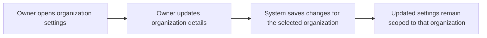

### Organization Identity and Operating Context

Each organization keeps its own name, description, logo image, currency, timezone, and fiscal start month so that business settings remain distinct from other organizations.
The organization name and description identify the organization in the platform.
The logo image represents the organization visually in the organization context.
The currency, timezone, and fiscal start month define the organization’s operating context.
These organization attributes are maintained independently for each organization.

### Multi-Tenant Organization Isolation

The system keeps organization data isolated so that each organization operates independently.
Employees, projects, tasks, timelogs, and timesheets belong only to the organization in which they were created.
A user who belongs to multiple organizations sees only the data for the currently selected organization.
Actions performed while working in one organization do not affect data in another organization.
Organization-scoped operations always use the currently selected organization context.

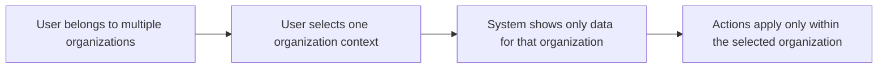

### Organization Owner Privileges

Organization owners have full access to all features within their organization.
Organization owners can manage roles and members.
Organization owners can edit organization settings.
Organization owners can delete their organization only when all pending timesheets are resolved and no active employee contracts remain.
Organization owners are the only users who can perform organization deletion.
Owner privileges apply only within the organization they own.

### Organization Deletion Rules

An organization owner can delete the organization only if all pending timesheets are resolved and there are no active employee contracts.
When an organization is deleted, all employees, projects, tasks, timelogs, and timesheets in that organization are permanently deleted.
The deleted organization’s data does not remain available for normal organization use after deletion.
The owner’s account remains after organization deletion, but it is no longer associated with any organization.
Deletion is allowed only when the required business conditions are satisfied.

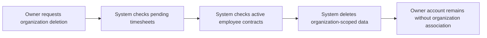

### Switching Organization Context

Users who belong to more than one organization can switch between organizations without logging out.
When a user switches organization context, subsequent actions are scoped to the newly selected organization.
The user’s access and visible data update to reflect the selected organization.
Switching context does not affect data in the previously selected organization.

## UserAccount Operations

Users sign up with email and password, and they can later log in with the same credentials. After signing in, they choose which organization to work in before performing any organization-scoped actions. A user can belong to multiple organizations, and switching between them must not require logging out. Users can change their password when they need to update account access. Users can also delete their account, but the system must prevent deletion when they are the sole owner of an organization unless ownership is transferred or the organization is deleted first. When an account is deleted, any employee records the user has in other organizations are marked as deactivated. Account access and account changes should remain separate from the user’s shared profile information. All account actions must respect the current organization context where relevant.

### Email and Password Sign-Up

Users can create an account using an email address and password.
A successful sign-up creates shared account access that can be used across organizations later.
If the same email address is already associated with an existing account, the system does not create a duplicate account.

### Email and Password Login

Users can log in using their email address and password.
If the credentials are valid, the system grants access to the account and allows the user to continue into organization selection.
If the credentials are not valid, the sign-in attempt is rejected.

### Organization Selection After Login

After logging in, users choose one organization to work in before performing organization-scoped actions.
The selected organization becomes the active context for subsequent actions until the user changes it.
If the user belongs to only one organization, that organization is still treated as the active context for the session.

### Switch Organizations Without Logging Out

Users who belong to multiple organizations can switch from one organization context to another without logging out.
When the user switches organizations, the system updates the active context and keeps the user signed in.
Actions performed after the switch apply only to the newly selected organization.

### Multi-Organization Account Membership

A single user account can belong to multiple organizations.
The account keeps shared access across all organizations it belongs to, while each organization remains independent.
Membership in one organization does not automatically grant access to any other organization unless that membership also exists there.

### Password Change

Users can change their password when they need to update account access.
A password change updates the account for future sign-ins without changing the user’s organization memberships or shared profile information.

### Account Deletion Restrictions

Users can delete their account only when doing so does not leave them as the sole owner of an organization.
If the user is the sole owner of an organization, account deletion is blocked until the ownership or the organization itself is addressed first.
Deleting the account does not remove the user’s shared profile definition from the scope of this section, and it does not change organization data outside the rules defined for account deletion.

### Sole Owner Must Transfer Ownership First

If a user is the sole owner of an organization, they must transfer ownership before deleting their account.
The system does not allow account deletion while that sole-owner condition still exists.
Once ownership is transferred, the account may be deleted if no other deletion restriction remains.

### Sole Owner Must Delete Organization First

If a user is the sole owner of an organization and does not transfer ownership, they must delete the organization before deleting the account.
The system does not allow account deletion while the organization still has that sole owner relationship.
Once the organization is deleted, the account may be deleted if no other deletion restriction remains.

### Deactivate Employee Records in Other Organizations

When a user deletes their account, their employee records in other organizations are marked as deactivated.
This deactivation happens only for the user’s employee records in organizations other than the one being removed by account deletion rules.
Deactivated employee records remain identifiable as historical membership records within those organizations.

### Shared Account Access Across Organizations

A user account provides shared access across every organization the user belongs to.
The user uses the same account identity in each organization, while organization-scoped actions remain separated by the active organization context.
Shared account access continues to work when the user moves between organizations.

### Organization-Scoped Actions After Sign-In

After sign-in, organization-scoped actions are performed only within the currently selected organization.
The system does not mix data or actions from different organizations during the same active context.
If the user changes the selected organization, subsequent organization-scoped actions apply to the new organization only.

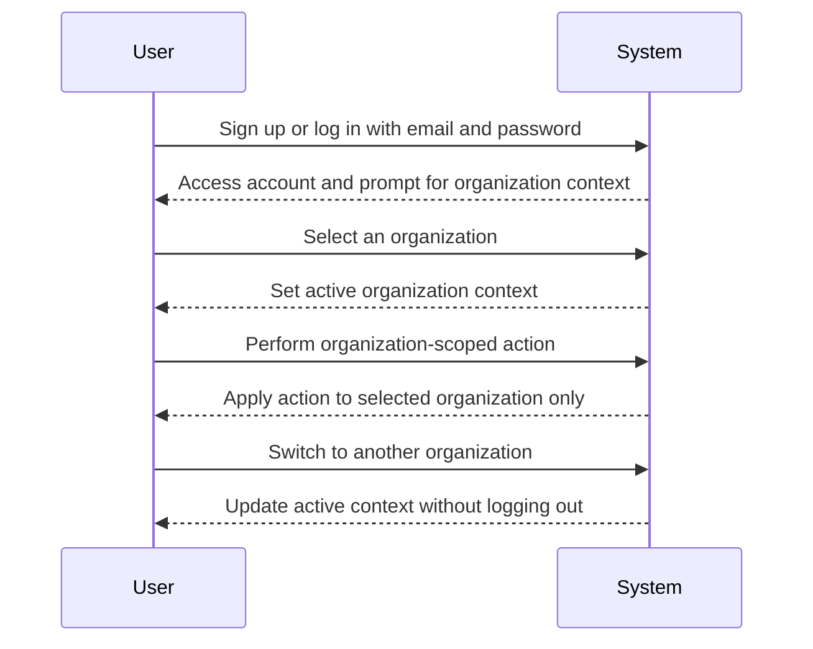

## UserProfile Operations

Each user has one global profile that is shared across all organizations they belong to. The profile includes a display name, avatar image, and phone number, and users can update these details as their personal information changes. Profile updates should be reflected everywhere the user appears, regardless of organization. Because the profile is global, changes made in one organization must be visible in all other organizations. The profile is separate from employee records, so updating personal details does not change role, department, or employment status. Users should be able to view their current profile information before making changes. The system should preserve profile consistency while allowing organizations to maintain their own employee-specific data. Profile management is centered on personal identity rather than organization membership.

### Global User Profile

A user has one global profile that is shared across every organization the user belongs to.
The system SHALL keep the user profile independent from organization membership so that the same profile is used in all organizations.
The system SHALL make changes to the global profile visible wherever the user appears in the platform.
The system SHALL allow the user to update the profile details from any organization context in which the user has access to the profile.
The system SHALL preserve the same profile information across organizations after it is updated.

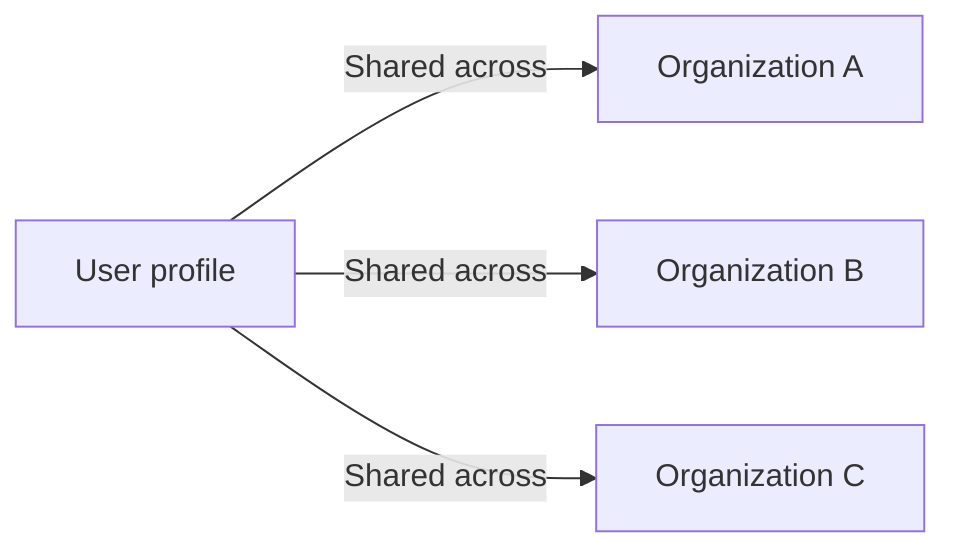

### Profile Details Update

The system SHALL allow the user to update the display name in the global profile.
The system SHALL allow the user to update the avatar image in the global profile.
The system SHALL allow the user to update the phone number in the global profile.
The system SHALL keep profile updates consistent across all organizations after the change is saved.
The system SHALL treat profile changes as personal information updates rather than organization-specific employee changes.
The system SHALL allow multiple profile details to be updated as part of the same profile update action.

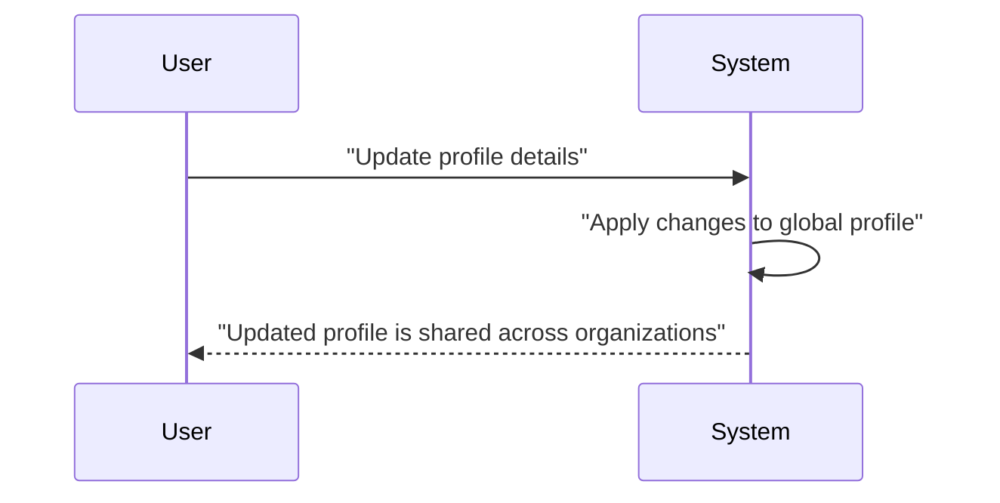

### View Current Profile Information

The system SHALL allow the user to view the current profile information before making changes.
The current profile information SHALL include the display name, avatar image, and phone number.
The system SHALL show the same current profile information regardless of which organization context the user is working in.
The system SHALL present the latest saved profile values as the source of current profile information.
The system SHALL allow the user to confirm the current profile information before starting an update.

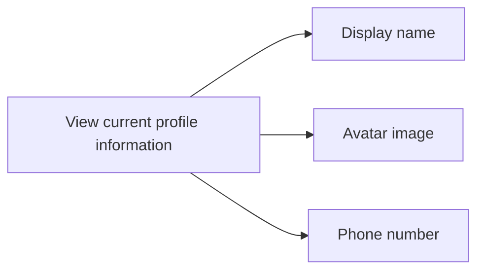

### Profile Separate from Employee Record

The system SHALL keep the global user profile separate from the employee record.
Updating the global profile SHALL NOT change role, department, or employment status in any organization.
Updating the global profile SHALL NOT modify employee-specific information.
The system SHALL reflect profile changes across organizations without altering organization-specific employee data.
The system SHALL preserve personal information consistency while allowing each organization to keep its own employee record data.

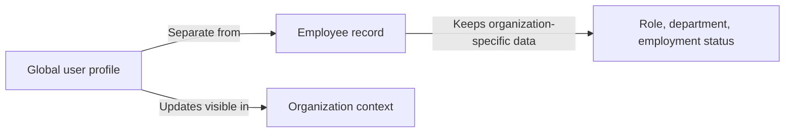

## Role Operations

Each organization manages its own role set, and the built-in Owner, Manager, and Employee roles are always available. The Owner role has full access and can manage roles and members, the Manager role can manage employees and projects and approve timesheets, and the Employee role can track time, submit timesheets, and view personal data. Organization owners can create custom roles to fit local business needs. Custom roles consist of a name and a set of permissions that control what actions employees can perform. Owners can edit custom roles when responsibilities change. Custom roles can be deleted only when no employees are assigned to them, which protects active work arrangements. Built-in roles cannot be deleted, so the core access model stays intact across organizations. Each employee in an organization must hold exactly one role at a time, and role changes are performed by users with employee management authority. The role system should clearly separate full-access, management, and employee-level capabilities.

### Organization-Specific Roles

Each organization maintains its own role set, and roles do not carry over between organizations.
The system shall allow role management to be scoped to the currently selected organization.
The system shall ensure that role names and role assignments are interpreted within the organization where they were created.
The system shall allow employees to hold different roles in different organizations, provided each organization treats the assignment independently.

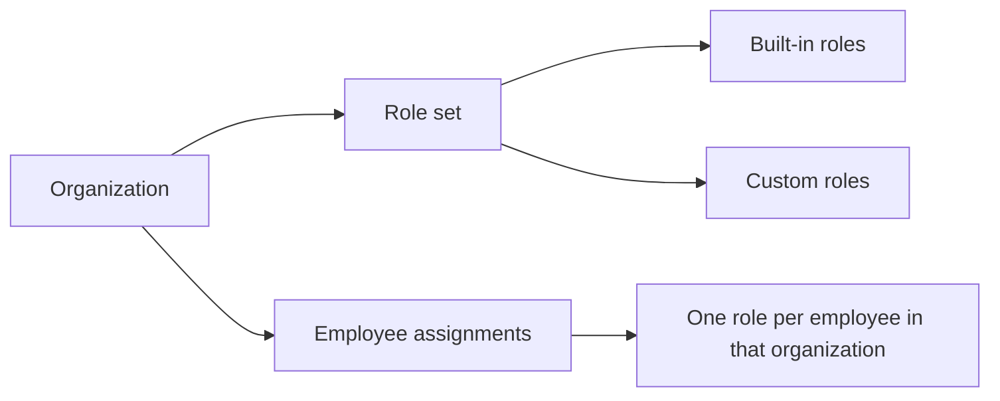

### Built-in Owner, Manager, and Employee Roles

The system shall provide the built-in Owner role in every organization.
The system shall provide the built-in Manager role in every organization.
The system shall provide the built-in Employee role in every organization.
The system shall keep these built-in roles available for the organization lifecycle.
The system shall not allow built-in roles to be deleted.
The system shall preserve the business meaning of the built-in roles so they continue to represent full access, management access, and employee-level access within the organization.

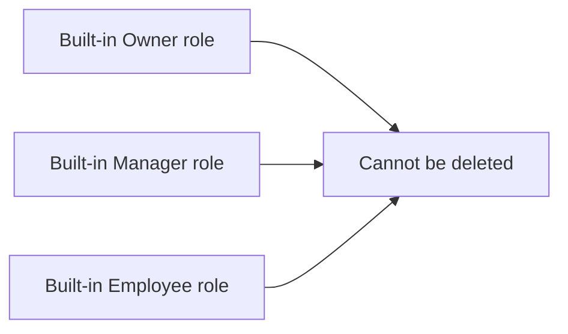

### Custom Role Creation and Naming

The system shall allow organization owners to create custom roles for their organization.
The system shall require each custom role to have a name.
The system shall store the custom role name as the label used to identify that role within the organization.
The system shall allow organization owners to define a permission set for each custom role at the time of creation.
The system shall create the custom role only within the organization of the owner who created it.

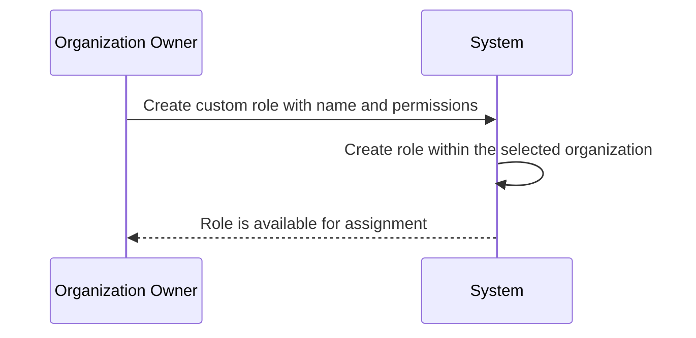

### Custom Role Permission Set

The system shall allow a custom role to be associated with a set of permissions.
The system shall use the assigned permission set to determine what actions employees with that role can perform.
The system shall allow organization owners to define the permission set when creating a custom role.
The system shall allow organization owners to change the permission set when editing a custom role.
The system shall keep the permission set tied to the role within the same organization.

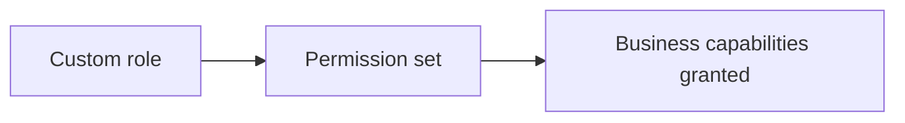

### Custom Role Editing

The system shall allow organization owners to edit custom roles in their organization.
The system shall allow organization owners to change the custom role name.
The system shall allow organization owners to change the permission set for a custom role.
The system shall keep built-in roles outside the custom role editing flow.
The system shall apply edited custom role details only within the organization where the role exists.

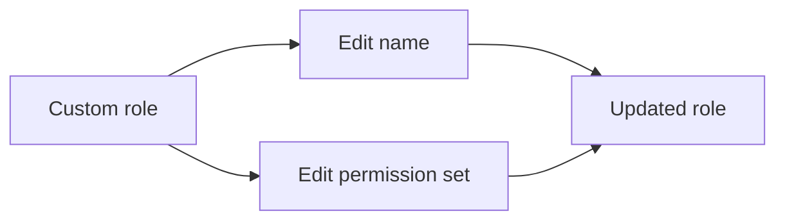

### Custom Role Deletion Restriction

The system shall allow organization owners to delete a custom role only when no employees are assigned to it.
The system shall block deletion of a custom role if at least one employee is still assigned to that role.
The system shall keep assigned employees linked to the role until the assignment is changed.
The system shall not allow built-in roles to be deleted under any condition.
The system shall treat the absence of assigned employees as a required condition for custom role deletion.

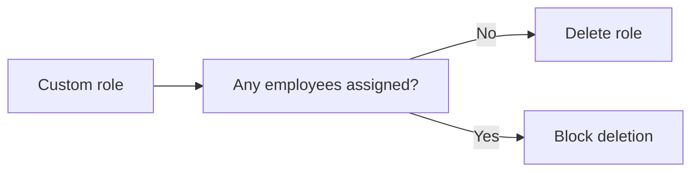

### Single Role per Employee and Role Assignment Changes

The system shall assign exactly one role to each employee within an organization.
The system shall prevent an employee from holding more than one role in the same organization at the same time.
The system shall allow users with employee management authority to change an employee’s role.
The system shall apply a role change only within the selected organization.
The system shall keep the employee assigned to a single role after the change is completed.

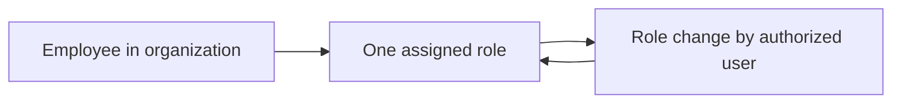

## Permission Operations

Permissions define the business capabilities that custom roles can grant within an organization. The platform provides a fixed set of available permissions for managing organization settings, employees, projects, timelogs, timesheets, and reports. Organization owners select from these permissions when creating or editing custom roles. The permission set includes the ability to manage the organization, manage or view employees, manage or view projects, manage timelogs, approve timesheets, view all timelogs and timesheets, and view reports. These permissions must be understood as business capabilities rather than technical access flags. Permission values should be consistent across the organization so role assignments remain clear and predictable. Users without a specific permission should not be able to perform the related business action. The system should present permissions in a way that helps owners understand the practical effect of each choice.

### Organization Management Permission

Users with organization management permission can edit organization settings within the currently selected organization.
Users with organization management permission can manage organization-level settings that belong to the organization context and do not affect other organizations.
Users without organization management permission cannot edit organization settings.
Organization management permission is one of the business capabilities that can be granted through role configuration.

### Employee Management Permission

Users with employee management permission can invite employees to the currently selected organization by email.
Users with employee management permission can edit employee records within the organization.
Users with employee management permission can deactivate employees within the organization.
Users with employee management permission can reactivate employees within the organization.
Users with employee management permission can change employee role assignments within the organization.
Users without employee management permission cannot perform employee management actions.
Employee management permission is one of the business capabilities that can be granted through role configuration.

### Employee View Permission

Users with employee view permission can view the employee list for the currently selected organization.
Users with employee view permission can view employee details within the organization.
Users with employee view permission can view any employee's contracts in the organization.
Users without employee view permission cannot view employee information beyond what their other permissions allow.
Employee view permission is one of the business capabilities that can be granted through role configuration.

### Project Management Permission

Users with project management permission can create projects in the currently selected organization.
Users with project management permission can edit projects in the organization.
Users with project management permission can archive projects and complete projects.
Users with project management permission can delete projects only when the project has no timelogs associated with it.
Users with project management permission can assign employees to projects and remove employees from projects.
Users with project management permission can create and edit tasks in projects.
Users without project management permission cannot perform project management actions.
Project management permission is one of the business capabilities that can be granted through role configuration.

### Project View Permission

Users with project view permission can view all projects in the currently selected organization.
Users with project view permission can view tasks in projects they are allowed to access.
Users with project view permission can view their assigned projects.
Users without project view permission cannot view project information beyond what their other permissions allow.
Project view permission is one of the business capabilities that can be granted through role configuration.

### Timelog Management Permission

Users with timelog management permission can edit any employee's timelogs in the currently selected organization.
Users with timelog management permission can delete any employee's timelogs in the currently selected organization.
Users with timelog management permission can manage timelogs regardless of who created them.
Users without timelog management permission cannot edit or delete other employees' timelogs.
Timelog management permission is one of the business capabilities that can be granted through role configuration.

### Timesheet Approval Permission

Users with timesheet approval permission can view submitted timesheets in the currently selected organization.
Users with timesheet approval permission can approve submitted timesheets.
Users with timesheet approval permission can reject submitted timesheets and provide a rejection reason.
Users without timesheet approval permission cannot approve or reject timesheets.
Timesheet approval permission is one of the business capabilities that can be granted through role configuration.

### View All Timelogs and Timesheets Permission

Users with view all timelogs and timesheets permission can view all employees' timelogs in the currently selected organization.
Users with view all timelogs and timesheets permission can view all employees' timesheets in the currently selected organization.
Users without view all timelogs and timesheets permission can only view their own timelogs and timesheets, unless another permission gives broader visibility.
View all timelogs and timesheets permission is one of the business capabilities that can be granted through role configuration.

### Report View Permission

Users with report view permission can access organization reports in the currently selected organization.
Users with report view permission can view the organization dashboard for the currently selected organization.
Users with report view permission can view time reports, project budget reports, and weekly summary reports as available to their organization.
Users without report view permission cannot access organization reports or the organization dashboard.
Report view permission is one of the business capabilities that can be granted through role configuration.

### Custom Role Permission Choices

When organization owners create or edit a custom role, they can choose only from the available permission set defined for the platform.
A custom role's permission choices must reflect the business capabilities made available by the platform.
The available permission choices include organization management, employee management, employee view, project management, project view, timelog management, timesheet approval, view all timelogs and timesheets, and report view.
Custom role permission choices must remain consistent within the organization so that the same permission has the same meaning for every employee who receives it.

### Business Capability Access

Each permission represents a business capability that determines what a user can do within the currently selected organization.
If a user does not have the permission for a business capability, the system must prevent that user from performing the related action.
Business capability access applies only within the organization context that the user has selected.
Business capability access must be understood as role-based access to organization features rather than as a personal preference.
A user's access can change when their role changes within the organization.

### Permission-Based Role Configuration

Organization owners can configure custom roles by selecting business capabilities from the available permission set.
Role configuration is organization-specific and does not carry over to other organizations.
Each custom role must be built from the available permission choices and must not introduce new capabilities.
Role configuration determines which business actions a member can perform in the organization.
When a custom role changes, the access granted by that role changes accordingly for any employee assigned to it.
Built-in roles remain separate from custom role configuration and keep their predefined business capabilities.

## Employee Operations

Employees belong to a specific organization and are linked to a user account, a role, and optionally a department and position. Authorized users can invite new employees, edit employee details, change role assignments, and deactivate or reactivate employees. Employee records also capture employment type, such as full-time, part-time, contractor, or intern. The employee list should support pagination, searching by name, and filtering by department, employment type, and status. Deactivated employees cannot log time or submit timesheets, but their past timelogs and timesheets remain available as historical records. When a user account is deleted, employee records in other organizations are marked deactivated rather than removed. Employees can be viewed by users who have employee viewing access, while management actions require employee management access. The employee lifecycle must preserve history while allowing current staffing status to change over time.

### Employee Onboarding and Account Linkage

Employees are onboarded into an organization through an invitation sent by email or through automatic addition after the invited person signs up with the matching email address.
An employee record is linked to one user account within the organization, and that linkage identifies which person the employee record belongs to.
When an invited person already has a user account, the system adds them to the organization as an employee.
When an invited person does not yet have a user account, the system keeps the membership pending until a user account is created with the invited email address.
When a user signs up with an email address that matches a pending invitation, the system automatically adds the user to the pending organization memberships.
An employee record remains within the organization context in which it was created and is not shared across organizations.

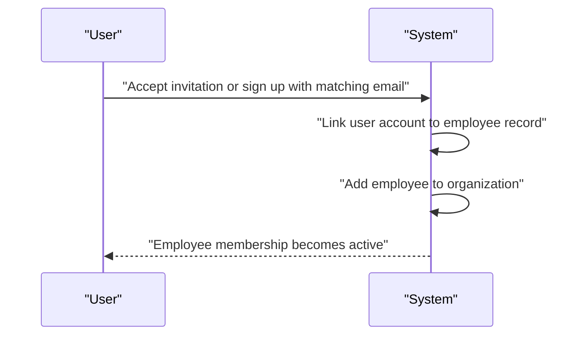

### Employee Role Assignment

Each employee in an organization is assigned exactly one role.
The assigned role determines what employee-level operations the person can perform in that organization.
Users with employee management access can change an employee's role assignment.
When a role assignment changes, the employee continues to belong to the same organization but gains the capabilities of the newly assigned role.
Role assignment is part of the employee record and is maintained separately for each organization in which the person is an employee.

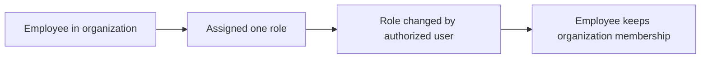

### Employee Record Details

Each employee record can include a department and a position or title.
The department is optional, so an employee may belong to no department.
The position or title is optional, so an employee record may omit it.
The employee record also includes an employment type classification, which identifies whether the employee is full-time, part-time, contractor, or intern.
These details describe the employee within the organization and can be updated by users with employee management access.

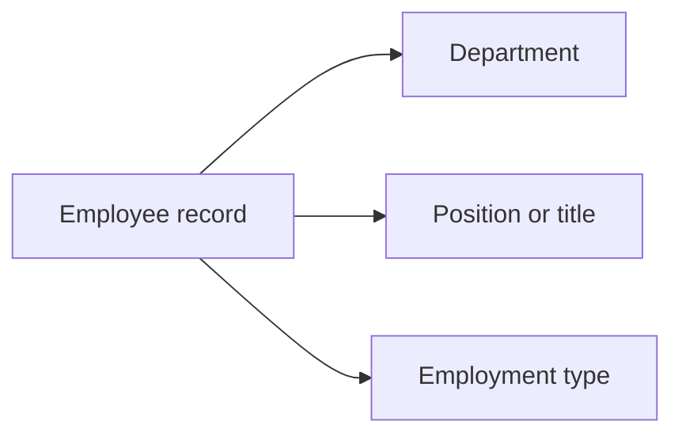

### Employee Status Management

Each employee has a current status in the organization.
An active employee can continue to log time and submit timesheets.
A deactivated employee cannot log time or submit timesheets.
Users with employee management access can deactivate employees.
Users with employee management access can reactivate employees.
Reactivating an employee returns the employee to active status so the employee can again participate in time tracking activities.
Deactivation changes the employee's current status in the organization but does not remove the employee's historical records.

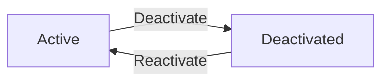

### Employee History Preservation

When an employee is deactivated, the employee's historical timelogs are preserved.
When an employee is deactivated, the employee's historical timesheets are preserved.
Historical records remain available as organization data even though the employee can no longer create new time records while deactivated.
Preserving historical timelogs and timesheets ensures the organization's reporting and historical review remain intact after staffing changes.

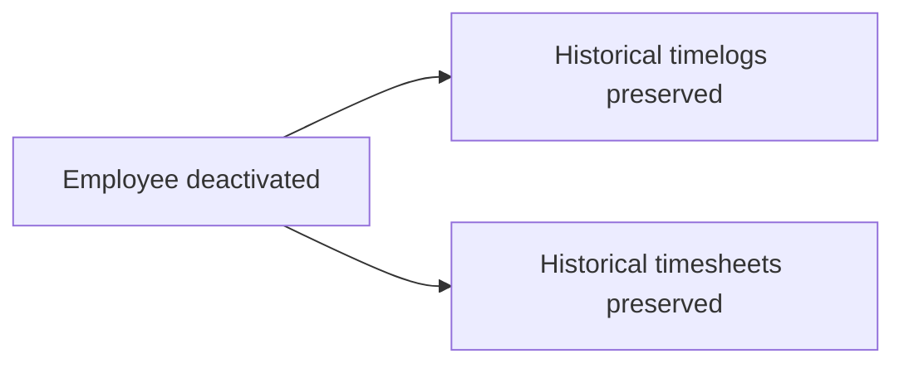

### Employee List Browsing

Users with employee viewing access can view the employee list for the selected organization.
The employee list supports pagination so users can browse employees in multiple pages.
The employee list supports search by employee name.
The employee list supports filtering by department.
The employee list supports filtering by employment type.
The employee list supports filtering by status.
The list shows employees only from the currently selected organization.

```mermaid
flowchart LR
    A["Employee list"] --> B["Paginated results"]
    A --> C["Search by name"]
    A --> D["Filter by department"]
    A --> E["Filter by employment type"]
    A --> F["Filter by status"]
```

## Invitation Operations

Users with employee management access can invite new employees to an organization by email. If the invited email already belongs to an existing account, that user is immediately added to the organization. If the email does not yet belong to an account, the system keeps a pending invitation until the person signs up. When that user later creates an account with the invited email, they are automatically added to the pending organizations. Invitations therefore bridge the gap between known users and future users without requiring a separate manual onboarding path. Invitation handling should support the organization’s need to grow its team while preserving the correct organization membership. The invitation flow is tied to employee addition rather than general account creation. Pending invitations remain relevant until they are fulfilled through sign-up.

### Invite Employees by Email

Users with employee management access can invite people to join an organization by email.
An invitation is created for the selected organization when an invitation is sent.
The invitation flow supports adding employees without requiring the person to complete account setup at the same moment.
If the invited email already belongs to an existing user account, that person is added to the organization immediately.
If the invited email does not yet belong to a user account, the invitation remains pending until the person creates an account with that email.
The invitation flow is used for employee onboarding within the organization rather than for general account creation.

```mermaid
sequenceDiagram
    participant M as "Member"
    participant S as "System"
    participant U as "User"
    M->>S: "Invite employee by email"
    S->>S: "Check whether the email belongs to an existing account"
    alt "Existing account"
        S->>S: "Add the user to the organization"
    else "No account yet"
        S->>S: "Create a pending invitation"
    end
    U->>S: "Sign up with the invited email"
    S->>S: "Fulfill any pending invitation for that email"
```

### Existing Account Added to Organization

When an invited email already belongs to a user account, the system adds that user to the organization as part of the invitation flow.
The user becomes available in the organization without requiring a separate manual approval step.
The resulting membership is tied to the organization that issued the invitation.
This behavior ensures that invitations can be used both for current users and for people who already have accounts in the platform.

### Pending Invitation for New Email

When an invited email does not yet belong to a user account, the system creates a pending invitation.
The pending invitation records the invited email and the organization association for later completion.
A pending invitation remains in place until the invited person creates an account with the same email.
Pending invitations preserve the intended organization membership even before the account exists.

```mermaid
flowchart LR
    A("Invite by email") --> B("Email belongs to existing account")
    A --> C("Email does not belong to an account")
    B --> D("Add user to organization")
    C --> E("Create pending invitation")
    E --> F("User signs up with same email")
    F --> G("Add user to pending organization association")
```

### Automatic Organization Addition After Sign-Up

When a person signs up using an email address that matches a pending invitation, the system automatically adds the new user account to the pending organization association.
This automatic addition completes the invitation without requiring the organization owner or manager to repeat the invitation process.
The user does not need a separate manual onboarding action for that organization after account creation.
If the same email has pending invitations for multiple organizations, the system fulfills the membership for each pending organization association tied to that email.

```mermaid
sequenceDiagram
    participant U as "User"
    participant S as "System"
    U->>S: "Create account with invited email"
    S->>S: "Find matching pending invitations"
    S->>S: "Add the new account to each pending organization association"
```

### Invitation-to-Membership Flow

The invitation flow is the path from sending an email invitation to creating organization membership.
If the invited email already exists, the flow ends with immediate organization membership.
If the invited email does not yet exist, the flow ends with a pending invitation that later converts into organization membership when the account is created.
The flow ensures that the organization membership outcome is preserved across both current-account and future-account cases.

```mermaid
flowchart LR
    A("Send invitation") --> B("Existing account?")
    B -->|"Yes"| C("User becomes organization member")
    B -->|"No"| D("Pending invitation created")
    D --> E("User signs up with invited email")
    E --> C
```

### Employee Management Access for Invitations

Only users with employee management access can send invitations to an organization.
Invitation handling is part of employee onboarding and membership management.
Users without employee management access cannot initiate the invitation flow for adding employees by email.
This requirement keeps invitation creation aligned with organization-controlled employee management.

### Pending Organization Association

A pending invitation keeps the intended organization association for an invited email address.
The organization association remains pending until the invited person creates an account with the same email.
When the account is created, the system uses the pending organization association to complete the membership automatically.
This association ensures that the invitation is not lost while waiting for sign-up.

### Email-Based Onboarding

The onboarding path for invitations is driven by email address matching.
The invited email is the key used to decide whether a person is added immediately or kept as a pending invitation.
When a matching account is later created, the email-based onboarding path completes the organization membership automatically.
This approach allows organizations to onboard employees before or after the person creates an account.

### Invitation Fulfillment on Account Creation

When a new account is created with an email that matches a pending invitation, the system fulfills that invitation automatically.
Fulfillment means the account is added to the organization associated with the pending invitation.
The invitation no longer needs manual follow-up after fulfillment.
If there are multiple pending invitations for the same email, each pending organization association is fulfilled according to the invitation records already in place.

## Department Operations

Each organization can create its own departments to organize employees in a way that matches its structure. Departments include a name and description, and they can optionally be nested under one parent department. Users with organization management access can create, edit, and delete departments. When a department is deleted, employees are not removed from the organization; instead, their department assignment becomes empty. This preserves employee records while allowing the department structure to change. Employees can view the department list so they understand how the organization is arranged. The one-level nesting rule keeps department hierarchy simple and easy to manage. Department operations should support organizational structure without affecting employment status or access rights.

### Department Structure

Each organization can maintain its own department structure to organize employees within that organization.

Departments are limited to a one-level parent relationship, which keeps the hierarchy simple and prevents deeper nesting.

Mermaid diagram:
```mermaid
flowchart LR
    A["Organization"] --> B["Department"]
    B --> C["Optional parent department"]
    C --> D["One-level nesting only"]
```

### Department Details

Each department includes a name and a description.

The department name identifies the department within the organization.

The department description provides additional context about the department’s purpose or scope.

These department details are managed as part of the organization’s internal structure and are visible to users who can view departments.

### Parent Department

A department may be assigned one parent department.

When a parent department is used, it can only be used for one level of nesting.

A department cannot be placed under a second-level parent, because the department structure is intentionally limited to a single nesting level.

### Department Creation and Editing

Users with organization management access can create departments for their organization.

Users with organization management access can edit a department’s name, description, and parent department assignment.

Department changes apply only within the organization where the department exists and do not affect other organizations.

### Department Deletion

Users with organization management access can delete departments.

When a department is deleted, employees are not deleted with it.

When a department is deleted, any employees assigned to that department have their department assignment cleared.

Deleting a department removes the department from the organization’s structure while preserving employee records.

Mermaid diagram:
```mermaid
flowchart LR
    A["Department deleted"] --> B["Employees remain"]
    B --> C["Department assignment cleared"]
    C --> D["Organization structure updated"]
```

### Department List Visibility

Employees can view the department list for their organization.

The department list helps employees understand how the organization is structured.

The list reflects the current department structure, including departments that have a parent department relationship defined within the one-level nesting rule.

## Contract Operations

Each employee can have multiple contracts over time, and the contract history serves as a permanent record of employment terms. A contract must include a start date, pay rate, pay period, and working hours per week, with an optional end date and notes. Users with employee management access can create contracts for employees and update only the current active contract. When a new contract is created, the previous active contract automatically ends the day before the new contract begins. Past contracts remain immutable so the organization retains an accurate historical record. Employees can view their own contracts, and users with employee viewing access can view contracts for any employee. Contract management should support changes in pay and working arrangements without losing past terms. The active contract rule ensures that only one current employment agreement exists at a time.

### Employee Contract History

Employee contracts form a historical record of employment terms for each employee within an organization.
The system shall keep multiple contracts over time for the same employee.
The system shall preserve past contracts as part of the employee’s contract history.
The system shall allow each employee to have at most one active contract at a time.
The system shall show the current contract separately from historical contracts.
The system shall associate every contract with the employee it belongs to.
The system shall keep contract history within the organization context in which the employee works.

```mermaid
flowchart LR
    A["Employee"] --> B["Current contract"]
    A --> C["Past contracts"]
    B --> D["One active contract at a time"]
    C --> E["Historical record"]
```

### Contract Details

Each contract shall include a start date.
Each contract may include an end date.
Each contract shall include a pay rate.
Each contract shall include a pay period.
Each contract shall include working hours per week.
Each contract may include notes.
The start date identifies when the contract begins.
The end date identifies when the contract stops being active, unless the contract is ongoing.
The pay rate, pay period, working hours per week, and notes define the employment terms recorded for that contract.
The system shall store these contract details as part of the employee’s historical record.

```mermaid
flowchart LR
    A["Contract details"] --> B["Start date"]
    A --> C["End date"]
    A --> D["Pay rate"]
    A --> E["Pay period"]
    A --> F["Working hours per week"]
    A --> G["Notes"]
```

### Contract Creation and Active Contract Handling

Users with employee management access shall be able to create a contract for an employee.
When a new contract is created, the system shall make that contract the employee’s active contract.
When a new contract is created and the employee already has an active contract, the system shall end the previous active contract the day before the new contract begins.
The system shall keep the previous contract as part of the historical record after it ends.
The system shall allow the new contract to establish the employee’s current employment terms without removing earlier contract history.

```mermaid
flowchart LR
    A["Create new contract"] --> B["New contract becomes active"]
    B --> C["Previous active contract ends the day before"]
    C --> D["Past contract remains in history"]
```

### Active Contract Only

The system shall allow only one active contract for an employee at any time.
The system shall treat the most recent open contract as the employee’s active contract.
The system shall prevent past contracts from being treated as active.
The system shall maintain the active contract rule so employment terms remain unambiguous for the employee.

```mermaid
flowchart LR
    A["Employee"] --> B["Active contract"]
    A --> C["Past contracts"]
    B --> D["Only one at a time"]
    C --> E["Not active"]
```

### Contract Updates and Historical Immutability

Users with employee management access shall be able to edit the current active contract.
The system shall not allow past contracts to be edited.
The system shall preserve past contracts exactly as historical records once they are no longer active.
The system shall keep inactive contract records available for reference without changing their past employment terms.
The system shall use the immutable history to retain an accurate record of earlier pay and working arrangements.

```mermaid
flowchart LR
    A["Current active contract"] --> B["Editable"]
    C["Past contract"] --> D["Immutable"]
    D --> E["Historical record preserved"]
```

### Contract Viewing Access

Employees shall be able to view their own contracts.
Users with employee viewing access shall be able to view contracts for any employee.
The system shall allow contract viewing according to the organization context of the selected employee.
The system shall present both current and historical contracts to users who have viewing access.
The system shall not require employee management access for contract viewing.

```mermaid
flowchart LR
    A["Employee"] --> B["View own contracts"]
    C["User with employee viewing access"] --> D["View any employee's contracts"]
    B --> E["Current and historical contracts"]
    D --> E
```

## Project Operations

Users with project management access can create and edit projects within their organization. Each project has a name, description, color code, status, budget hours, start date, and end date, allowing teams to organize and track work clearly. Projects may be active, archived, or completed, and archived or completed projects must not accept new timelogs. Existing timelogs on archived or completed projects remain preserved so historical reporting stays accurate. Users with project viewing access can browse all projects, and the project list supports pagination and status filtering. A project can be deleted only when it has no timelogs associated with it, which prevents loss of tracked work history. Project status changes help teams distinguish active work from closed work. Project operations should support planning, tracking, and historical retention.

### Project Creation

Users with project management access can create a project within the currently selected organization.
A project is created with a name, optional description, required color code, optional budget hours, optional start date, and optional end date.
The created project belongs only to the organization in which it was created.
The project begins in the active status unless a different status is explicitly selected during creation.
When a project is created, it becomes available for project browsing and future assignment and tracking within that organization.

### Project Editing

Users with project management access can edit an existing project within the currently selected organization.
Project editing includes changing the project name, description, color code, status, budget hours, start date, and end date.
Project updates apply only to the selected organization and do not affect projects in other organizations.
Users with project management access can change the project status between active, archived, and completed.
Project editing is available only for projects that exist in the current organization context.

### Project Name and Description

Each project has a name that identifies the project within the organization.
A project may also have an optional description that provides additional context about the work.
Users with project management access can update the project name and description when project details change.
The project name and description are shown as part of the project record used for organization-wide project management and browsing.

### Project Color Code

Each project has a required color code used to distinguish the project in organization records.
Users with project management access can set and update the project color code when creating or editing a project.
The color code is stored as part of the project’s business details and remains associated with the project for identification purposes.

### Project Status Lifecycle

Each project has one of three statuses: active, archived, or completed.
A project starts as active and can later be archived or completed by users with project management access.
An archived project remains part of the organization records but is treated as closed for new time tracking.
A completed project remains part of the organization records but is treated as closed for new time tracking.
Project status changes support the distinction between work that is ongoing, paused, or finished.

### Project Budget, Start Date, and End Date

Each project may include budget hours, a start date, and an end date.
Budget hours represent the total estimated hours planned for the project.
The start date and end date are optional planning fields that help define the project timeline.
Users with project management access can add or update these planning details during project creation or editing.
These fields remain part of the project record for planning and tracking purposes.

### Project List Browsing

Users with project viewing access can browse the list of projects in the selected organization.
The project list is paginated so that projects are shown in manageable pages.
Users can filter the project list by project status.
Browsing is limited to projects that belong to the currently selected organization.

### Archived and Completed Projects Block New Timelogs

Archived projects do not accept new timelogs.
Completed projects do not accept new timelogs.
Users with project management access can still view archived and completed projects as historical records.
Existing timelogs on archived or completed projects remain preserved and are not removed by the status change.
The restriction applies only to new timelog creation for those projects.

### Project Deletion

Users with project management access can delete a project only when the project has no timelogs associated with it.
If a project has timelogs, deletion is not allowed because tracked work history must be preserved.
Project deletion applies only to the selected organization.
When deletion is allowed, the project is removed from organization records as a project with no associated timelog history.

## ProjectMembership Operations

Project memberships connect employees to projects and determine who can participate in a project’s work. A project can have multiple members, and an employee can belong to multiple projects. Each membership assigns a project role of either member or project lead. Users with project management access can assign employees to projects and remove them later when staffing changes. Project leads gain the ability to manage tasks within their project, which gives them practical responsibility for day-to-day work coordination. Employees can view the projects they are assigned to so they understand where they contribute. Membership management should keep project participation aligned with the current team structure. The project role attached to the membership is what distinguishes a general member from a lead role.

### Project Membership Assignment

Users with project management access can assign employees to projects within the current organization.
An employee can be assigned to more than one project at the same time.
Each project membership records the employee, the project, and the project role for that membership.
The system shall treat the membership as the business link that places an employee on a project and defines how that employee participates in the project.
The system shall allow the same employee to have separate membership assignments for different projects.
If an employee is assigned to a project, the employee shall appear as a project member for that project.
If a project member assignment already exists for the same employee and project, the system shall not create a duplicate membership.

```mermaid
flowchart LR
    A["Employee"] -->|"Assigned to"| B["Project Membership"]
    B -->|"Links to"| C["Project"]
    B -->|"Identifies"| D["Project Role"]
    A -->|"May belong to"| E["Multiple Projects"]
```

### Project Member and Project Lead Roles

Each project membership shall use either the project member role or the project lead role.
The system shall use the project role on the membership to distinguish general participation from lead responsibility.
When an employee is assigned the project member role, the employee is a regular participant in that project.
When an employee is assigned the project lead role, the employee is a lead participant in that project.
The system shall keep the project role attached to the membership so that role changes affect only that project membership and not the employee’s other project memberships.
A single employee may be a project member in one project and a project lead in another project at the same time.

```mermaid
flowchart LR
    A["Project Membership"] -->|"Uses"| B["Project Member Role"]
    A -->|"Uses"| C["Project Lead Role"]
    C -->|"Enables"| D["Task Management Responsibility"]
```

### Project Lead Task Management

An employee who has the project lead role for a project can manage tasks within that project.
The project lead role shall give the employee practical responsibility for coordinating work in that project.
The system shall recognize project lead membership as distinct from general membership when determining who can manage tasks in the project.
If an employee is removed from project lead membership, the employee shall no longer have lead-based task management responsibility for that project.
If an employee remains a project member but is no longer a project lead, the employee shall continue to participate in the project without lead task-management responsibility.

```mermaid
flowchart LR
    A["Project Lead Membership"] -->|"Allows"| B["Manage Tasks in Project"]
    C["Project Member Membership"] -->|"Allows"| D["Participate in Project"]
```

### Remove Employees from Projects

Users with project management access can remove employees from projects when staffing changes.
When an employee is removed from a project, the employee’s membership for that project shall end.
Removing an employee from one project shall not affect the employee’s memberships in other projects.
The system shall support removing employees only from the specific project membership being changed.
If a removed employee is later assigned again, the system shall create a new project membership for that project rather than treating the employee as continuously assigned.

```mermaid
flowchart LR
    A["Project Membership"] -->|"Removed from"| B["Project"]
    B -->|"Does not affect"| C["Other Project Memberships"]
```

### View Assigned Projects

Employees can view the projects they are assigned to.
The project list visible to an employee shall reflect only the projects linked to that employee through project membership.
The system shall show assigned projects so employees understand where they contribute.
An employee who belongs to multiple projects shall be able to see all of those project assignments in the organization context.
If an employee is not assigned to a project, that project shall not appear as one of the employee’s assigned projects.

```mermaid
flowchart LR
    A["Employee"] -->|"Views"| B["Assigned Projects"]
    B -->|"Derived from"| C["Project Membership"]
```

## Task Operations

Tasks belong to projects and can be created by project leads or users with project management access. Each task includes a title, description, status, priority, estimated hours, due date, an optional assigned employee, and an optional parent task for one-level subtasks. A task can only be assigned to an employee who is already a member of the project. Project leads can edit tasks in their own project, while users with project management access can edit any task. Task statuses move through open, in-progress, completed, and closed, allowing teams to track progress over time. Employees can view tasks in projects they are assigned to. Tasks can also be filtered by status, priority, and assigned employee, and they can be sorted by due date, priority, and creation date. Task operations support coordination of work within projects while preserving assignment and hierarchy rules.

### Task within Project

Tasks belong to a specific project and are always created, viewed, and managed in the context of that project. A task cannot exist outside a project. Employees can only work with tasks that are part of projects they can access, and project leads can manage the tasks in their own project. Tasks may be used to coordinate work within the project and to track progress over time.

```mermaid
flowchart LR
    A["Project"] --> B["Task"]
    B --> C["Task details"]
    B --> D["Task status"]
    B --> E["Task priority"]
```

### Task Title, Description, and Scheduling Details

Each task has a title and may have a description to explain the work in more detail. A task may also include estimated hours and a due date so the team can plan and sequence the work. These details are part of the task record and are used when the task is viewed, edited, filtered, and sorted.

The title provides the primary name of the task. The description provides supporting context for the work. Estimated hours represent the expected effort for the task. The due date identifies when the task is intended to be completed.

```mermaid
flowchart LR
    A["Task title"] --> B["Task description"]
    A --> C["Estimated hours"]
    A --> D["Due date"]
```

### Task Status Lifecycle

A task uses one of four statuses: open, in-progress, completed, or closed. Open tasks represent work that has not yet started. In-progress tasks represent work that is actively underway. Completed tasks represent work that has been finished. Closed tasks represent tasks that are no longer active in the workflow.

Task status can change over time as work progresses. Status changes are part of the task's business history and support visibility into how the task moved through the project lifecycle.

```mermaid
flowchart LR
    A["open"] -->|"Start work"| B["in-progress"]
    B -->|"Finish work"| C["completed"]
    C -->|"Close task"| D["closed"]
    A -->|"Close task"| D
    B -->|"Close task"| D
```

### Task Priority Levels

Each task has a priority level that expresses how important the work is relative to other tasks in the project. The available priority levels are low, medium, high, and urgent. Priority helps teams distinguish routine work from more time-sensitive or critical work.

Priority is part of the task's business classification and can be used when reviewing and organizing tasks within a project.

```mermaid
flowchart LR
    A["low"] --> B["medium"] --> C["high"] --> D["urgent"]
```

### Task Assignment and Subtasks

A task may be assigned to an employee, but only if that employee is already a member of the same project. This keeps task ownership within the project team. A task may also have a parent task, which creates a subtask relationship. Subtasks are limited to one level of nesting, so a task can have a parent task but cannot be nested beyond that structure.

```mermaid
flowchart LR
    A["Project"] --> B["Parent task"]
    B --> C["Subtask"]
    D["Project member"] --> C
```

### Project Lead Task Editing

Project leads can edit tasks in their own project. This includes changing task details and maintaining task records within the scope of their project responsibilities. Users with project management access can edit any task, while project leads are limited to the tasks in the project they lead.

```mermaid
sequenceDiagram
    participant L as Project lead
    participant S as System
    L->>S: Request task edit within project
    S->>S: Verify project lead access for that project
    S-->>L: Task updated
```

### Task Filtering

Task lists can be filtered by status, priority, and assigned employee. Status filtering helps narrow tasks to a specific stage of work. Priority filtering helps focus on tasks by importance. Assigned employee filtering helps locate tasks owned by or assigned to a particular project member.

Filtering is intended to help users review task workloads and focus on the subset of tasks relevant to their current work.

```mermaid
flowchart LR
    A["Task list"] --> B["Filter by status"]
    A --> C["Filter by priority"]
    A --> D["Filter by assigned employee"]
```

### Task Sorting

Task lists can be sorted by due date, priority, and creation date. Sorting by due date helps users review approaching work. Sorting by priority helps surface more important tasks first. Sorting by creation date helps users review tasks in the order they were added to the project.

Sorting is used together with filtering to help users organize and review tasks in a way that matches their workflow.

```mermaid
flowchart LR
    A["Task list"] --> B["Sort by due date"]
    A --> C["Sort by priority"]
    A --> D["Sort by creation date"]
```

## TaskHistory Operations

Task history records every task status change as a permanent timeline of progress. Each history entry captures the time of the change, the previous status, the new status, and the person who made the change. This history lets teams understand how a task moved through its workflow and who was responsible for each transition. Status changes should be recorded whenever a task moves between open, in-progress, completed, and closed. The history is read-only because it serves as an audit trail rather than a working record. Users reviewing a task can use this history to understand decisions and progress over time. The history should remain available even if the task continues to change. Task history supports accountability and traceability for project work.

### Task Status Change History

Task history records every change to a task's status as a permanent record of how the task moved through its workflow.

Each status change creates a new history entry that captures the previous task status, the new task status, the time of the change, and the person who made the change.

The history shows the task workflow timeline in the order the changes occurred, so users can review how the task progressed over time.

The history is read-only and exists as an audit trail for tasks rather than as an editable working record.

The history remains available even when the task changes again later, so earlier status transition records are not replaced or removed by newer changes.

```mermaid
flowchart LR
    A["Task status changes"] --> B["Create history entry"]
    B --> C["Record previous task status"]
    B --> D["Record new task status"]
    B --> E["Record who made the change"]
    B --> F["Record history timestamp"]
    C --> G["Read-only task history"]
    D --> G
    E --> G
    F --> G
```

### Task Workflow Timeline

The task history provides a chronological timeline of status transitions for a task.

Each entry is shown in the order the change occurred, allowing users to trace the sequence of status updates from one task status to another.

The timeline supports task accountability by showing who changed the task and when the change happened.

Users reviewing a task can use the timeline to understand the history of progress, decisions, and movement across task statuses without modifying the records.

The task workflow timeline includes all recorded status transition records for the task, even after additional changes occur later.

```mermaid
flowchart LR
    A["Open"] -->|"Changed by user"| B["In-progress"]
    B -->|"Changed by user"| C["Completed"]
    C -->|"Changed by user"| D["Closed"]
    A --> E["Timeline entry"]
    B --> E
    C --> E
    D --> E
```

### Task History Audit Trail

Task history serves as an audit trail for task status changes.

For each recorded change, the system preserves the history timestamp, the old task status, the new task status, and who made the change.

The audit trail is read-only so that the record of task status changes cannot be edited or rewritten after it has been created.

This audit trail supports task accountability by allowing users to see which person changed the task status and when the change occurred.

The audit trail reflects each status transition as a separate status transition record, preserving the sequence of changes as the task moves through its workflow.

## Timelog Operations

Employees can create timelogs to record the time they spend working on projects and tasks. Each timelog includes a date, duration in minutes, project, optional task, description, and billable status. Employees can only create timelogs for themselves, and the selected project must be one they are assigned to. If a task is chosen, it must belong to the selected project. Employees can edit their own timelogs only while they are not part of an approved timesheet, and they can delete their own timelogs only before those timelogs are included in any submitted or approved timesheet. Users with timelog management access can edit or delete any employee’s timelogs. Users with view-all access can review all employees’ timelogs, while employees can see their own records. Timelogs are paginated and can be filtered by date range, project, task, and billable status. Timelog operations preserve accountability by limiting changes once time has been submitted for approval.

### Employee Time Entry

Employees can record time spent working within the currently selected organization.
A timelog belongs to the employee who created it and is used to capture work performed on a specific project, with an optional task and description.
An employee can create timelogs only for their own work.
Employees can review their own timelogs after they are created.
Timelog activity remains within the organization context selected by the user at the time the timelog is created.

```mermaid
sequenceDiagram
    participant E as "Employee"
    participant S as "System"
    E->>S: "Create timelog"
    S->>S: "Record employee time entry"
    S-->>E: "Timelog saved"
```

### Timelog Date and Duration

A timelog captures the date on which the work was performed and the duration of that work in minutes.
Employees can record a date and a duration when creating a timelog.
The date and duration define the time entry being tracked and are part of the timelog’s core record.
If a timelog is edited, its recorded date and duration remain part of the employee’s time history.

```mermaid
flowchart LR
    A["Timelog"] -->|"includes"| B["Date"]
    A -->|"includes"| C["Duration in minutes"]
```

### Timelog Project Selection

Every timelog is associated with one project.
When an employee creates a timelog, the employee must select a project for the entry.
The selected project defines which work the timelog is attributed to within the organization.
Employees can only record time against projects that are available to them in the current organization context.

```mermaid
flowchart LR
    A["Employee"] -->|"creates"| B["Timelog"]
    B -->|"assigned to"| C["Project"]
```

### Timelog Task Must Match Project

A timelog may include an optional task.
When a task is included in a timelog, the task must belong to the same project selected for that timelog.
This keeps time entries aligned with the project structure they reference.
A timelog cannot be saved with a task from a different project.

```mermaid
flowchart LR
    A["Timelog"] -->|"optional task"| B["Task"]
    B -->|"must belong to"| C["Selected project"]
```

### Timelog Description

A timelog may include a description that explains what the employee did during the recorded time.
The description is optional.
When provided, the description helps explain the purpose of the time entry without changing the project or duration recorded.

```mermaid
flowchart LR
    A["Timelog"] -->|"optional details"| B["Description"]
```

### Billable Time Flag

A timelog includes a billable time flag.
The billable time flag indicates whether the recorded time should be treated as billable or non-billable.
When a timelog is created, the billable time flag defaults to billable time unless the employee chooses otherwise.
The billable status is part of the timelog record and can be reviewed later alongside the time entry.

```mermaid
flowchart LR
    A["Timelog"] -->|"includes"| B["Billable time flag"]
    B -->|"indicates"| C["Billable or non-billable"]
```

### Create Timelog for Self Only

Employees can create timelogs only for themselves.
A user cannot create a timelog on behalf of another employee.
The timelog is always attributed to the employee who performs the creation action.
This restriction keeps personal work records tied to the correct employee.

```mermaid
flowchart LR
    A["Employee"] -->|"creates for self"| B["Timelog"]
    A -.->|"cannot create for another employee"| C["Other employee timelog"]
```

### Edit Own Timelog Before Approval

Employees can edit their own timelogs while those timelogs are still eligible for change.
An employee may update a timelog they created before that timelog becomes locked by approval-related processing.
Once a timelog is no longer eligible for employee editing because it has been approved through timesheet processing, the employee cannot continue editing it.
This preserves the integrity of reviewed time records.

```mermaid
flowchart LR
    A["Own timelog"] -->|"editable while eligible"| B["Employee edits entry"]
    B -->|"after approval"| C["Editing no longer allowed"]
```

### Delete Own Timelog Before Submission

Employees can delete their own timelogs while those timelogs are still eligible for deletion.
An employee may remove a timelog they created before that timelog becomes part of a submitted or approved timesheet.
Once a timelog has been submitted for approval through a timesheet, the employee can no longer delete it.
This ensures submitted work history remains stable during review.

```mermaid
flowchart LR
    A["Own timelog"] -->|"deletable while eligible"| B["Employee deletes entry"]
    B -->|"after submission"| C["Deletion no longer allowed"]
```

### Timelog Management Access

Users with timelog management access can edit or delete any employee’s timelogs.
This access allows broader control than the employee’s own time entry permissions.
It applies across timelogs within the organization context in which the user is working.
Timelog management access is used when organization-level intervention is needed on time records.

```mermaid
flowchart LR
    A["Timelog management access"] -->|"allows"| B["Edit any timelog"]
    A -->|"allows"| C["Delete any timelog"]
```

### View All Timelogs Access

Users with view all timelogs access can review all employees’ timelogs.
This access is broader than the employee’s personal timelog view and is intended for organization-wide visibility.
It allows a user to inspect time records across employees within the selected organization.
Users without this access can only see their own timelogs.

```mermaid
flowchart LR
    A["View all timelogs access"] -->|"allows"| B["Review all employees' timelogs"]
    C["Employee"] -->|"without access sees"| D["Own timelogs only"]
```

### Timelog Pagination

Timelog lists are paginated.
Pagination divides long timelog lists into smaller sets so users can browse records in pages.
Pagination applies to timelog browsing in the current organization context.

```mermaid
flowchart LR
    A["Timelog list"] -->|"divided into"| B["Page 1"]
    A -->|"divided into"| C["Page 2"]
    A -->|"divided into"| D["More pages"]
```

### Timelog Date Range Filter

Timelog lists can be filtered by date range.
The date range filter limits the visible timelogs to entries whose recorded dates fall within the selected range.
This filter helps users focus on time entries for a specific period.

```mermaid
flowchart LR
    A["Timelog list"] -->|"filtered by"| B["Date range"]
    B -->|"shows"| C["Matching timelogs"]
```

### Timelog Project Filter

Timelog lists can be filtered by project.
The project filter limits the visible timelogs to entries associated with the selected project.
This helps users review time recorded against one project at a time.

```mermaid
flowchart LR
    A["Timelog list"] -->|"filtered by"| B["Project"]
    B -->|"shows"| C["Project timelogs"]
```

### Timelog Task Filter

Timelog lists can be filtered by task.
The task filter limits the visible timelogs to entries associated with the selected task.
This helps users review time recorded for a particular task when work needs to be analyzed at a finer level than project.

```mermaid
flowchart LR
    A["Timelog list"] -->|"filtered by"| B["Task"]
    B -->|"shows"| C["Task timelogs"]
```

### Billable Status Filter

Timelog lists can be filtered by billable status.
The billable status filter limits the visible timelogs to entries marked billable or non-billable.
This helps users review time entries based on whether the recorded time should be treated as billable work.

```mermaid
flowchart LR
    A["Timelog list"] -->|"filtered by"| B["Billable status"]
    B -->|"shows"| C["Billable or non-billable timelogs"]
```

## Timesheet Operations

A timesheet groups an employee’s timelogs for a single week from Monday through Sunday. Employees can create a draft timesheet for a chosen week, and the system automatically includes that week’s timelogs for that employee. Employees can remove timelogs from a draft timesheet or add them back before submission. A timesheet cannot be submitted if it contains no timelogs or if another timesheet for the same week is already submitted or approved. Employees submit timesheets for approval, and users with timesheet approval access can view all submitted timesheets. Approvers can approve or reject a submitted timesheet, and they must provide a rejection reason when rejecting it. Approved timesheets lock the included timelogs so they can no longer be edited or deleted. Rejected timesheets return to draft status so the employee can revise and resubmit them. Employees can view their own timesheets, and timesheets are paginated and filterable by status and date range.

### Weekly Timesheet Scope

A timesheet represents one employee's time entries for one week, and that week runs from Monday through Sunday.
A timesheet belongs to exactly one employee and covers only one weekly period.
A timesheet is used to collect the timelogs that belong to that employee within the selected week.

### Draft Timesheet Creation

An employee can create a draft timesheet for a selected week.
When a draft timesheet is created, the system automatically includes all timelogs for that employee that fall within the selected Monday-to-Sunday week.
The employee can create a draft timesheet only for their own time entries.

### Managing Timelogs in a Draft Timesheet

An employee can add timelogs to a draft timesheet before submission.
An employee can remove timelogs from a draft timesheet before submission.
The system allows the employee to revise the draft timesheet by adding or removing timelogs until the timesheet is submitted.
A draft timesheet remains editable while it is still in draft status.

```mermaid
flowchart LR
    A["Draft timesheet"] -->|"Add timelogs"| B["Draft timesheet with more timelogs"]
    B -->|"Remove timelogs"| C["Draft timesheet with fewer timelogs"]
```

### Submitting a Timesheet for Approval

An employee can submit a draft timesheet for approval.
The system accepts submission only when the timesheet contains at least one timelog.
The system rejects submission when the timesheet contains no timelogs.
The system rejects submission when another timesheet for the same employee and same week is already submitted or approved.
A submitted timesheet becomes available for review by users with timesheet approval access.

```mermaid
sequenceDiagram
    participant E as "Employee"
    participant S as "System"
    participant A as "Approver"
    E->>S: "Submit draft timesheet"
    S->>S: "Check timelog presence and duplicate week"
    S-->>E: "Submitted or rejected"
    A->>S: "Review submitted timesheet"
```

### Reviewing Submitted Timesheets

Users with timesheet approval access can view submitted timesheets.
An approver can approve a submitted timesheet.
An approver can reject a submitted timesheet.
When rejecting a timesheet, the approver provides a rejection reason.
The rejection reason is required when the timesheet is rejected.
A timesheet can be reviewed only while it is in submitted status.

### Approved and Rejected Timesheet Outcomes

When a timesheet is approved, the included timelogs become locked and can no longer be edited or deleted through the timesheet workflow.
When a timesheet is rejected, it returns to draft status so the employee can modify it and submit it again.
An approved timesheet remains a completed review record for the employee and the approver.
A rejected timesheet remains associated with the employee's weekly timesheet history.

```mermaid
flowchart LR
    A["draft"] -->|"Submit"| B["submitted"]
    B -->|"Approve"| C["approved"]
    B -->|"Reject with reason"| D["rejected"]
    D -->|"Return to draft"| A
```

### Employee Timesheet Visibility

An employee can view their own timesheets.
The system shows the employee only timesheets that belong to that employee.
Employees do not use this operation to view other employees' timesheets.

### Timesheet List Browsing

Timesheets are shown in a paginated list.
The timesheet list can be filtered by status.
The timesheet list can be filtered by date range.
The filters are used to narrow the set of timesheets shown to the user.

## TimerSession Operations

Employees can start a live timer to track time as they work, and each employee can have at most one active timer at a time. Starting a timer requires choosing a project, and an optional task can be attached to the running timer. The timer captures a start timestamp, project, task, and description while it is running. Employees can view the timer that is currently active for them. They can update the description and the selected project or task while the timer is still running. When the employee stops the timer, the system creates a timelog using the calculated duration rounded to the nearest minute. Employees can also discard a running timer without creating a timelog. If a timer is not stopped, it continues running until the employee stops or discards it. Timer operations support real-time time capture while still connecting back to standard timelog records.

### Live Timer Start

Employees can start a live timer to begin tracking work in real time.
A timer start records the moment the employee begins tracking time and associates that timer with the employee who started it.
When an employee starts a timer, the system keeps it running as the employee's current timer for that organization.
The timer captures the selected project at the moment it starts.
The timer may also capture an optional task at the moment it starts, as long as the task belongs to the selected project.
If the employee already has a running timer, the system does not allow another timer to be started for that employee.

```mermaid
sequenceDiagram
    participant E as "Employee"
    participant S as "System"
    E->>S: "Start live timer"
    S->>S: "Record timer start timestamp"
    S->>S: "Attach selected project and optional task"
    S->>S: "Set timer as current running timer"
    S-->>E: "Timer is running"
```

### Running Timer Details

A running timer includes the start timestamp, the selected project, the optional task, and the timer description.
The timer description can be updated while the timer is still running.
The selected project can be changed while the timer is still running.
The selected task can be changed while the timer is still running.
A changed task must continue to belong to the currently selected project.
Employees can view the timer that is currently running for them.
If the employee does not stop or discard the timer, the timer continues running indefinitely.

```mermaid
flowchart LR
    A["Timer running"] -->|"Edit description"| B["Updated running timer"]
    A -->|"Change project"| C["Running timer with new project"]
    A -->|"Change task"| D["Running timer with new task"]
    A -->|"View current timer"| E["Current running timer shown"]
```

### Stop Timer

Employees can stop their running timer when they finish the work they were tracking.
When a timer is stopped, the system creates a timelog from the running timer.
The timelog uses the timer's recorded start timestamp and the stop moment to determine the tracked duration.
The duration created from stopping a timer is rounded to the nearest minute.
Stopping the timer ends the current running timer for that employee.
After the timer is stopped, it is no longer available as a running timer.

```mermaid
sequenceDiagram
    participant E as "Employee"
    participant S as "System"
    E->>S: "Stop running timer"
    S->>S: "Calculate duration"
    S->>S: "Round duration to nearest minute"
    S->>S: "Create timelog"
    S->>S: "End running timer"
    S-->>E: "Timelog created"
```

### Discard Timer

Employees can discard a running timer when the tracked time should not be saved.
Discarding a timer ends the current running timer for that employee.
When a timer is discarded, the system does not create a timelog.
A discarded timer is removed from the employee's current running timer state.
Employees can only discard a timer while it is still running.

```mermaid
flowchart LR
    A["Running timer"] -->|"Discard"| B["Timer ended"]
    B -->|"No timelog created"| C["No saved time entry"]
```

## ActivityRecord Operations

The system records important business actions as activity records so organizations can review what happened and when. Each record captures the time of the action, the user who performed it, the action type, the target entity, and supporting details. Logged actions include inviting employees, deactivating or reactivating employees, creating or editing contracts, creating or changing projects, changing task status, submitting or reviewing timesheets, and assigning or changing roles. Users with organization management access can view the full activity log for their organization. The activity log is paginated and can be filtered by action type, user, and date range. Activity records are organization-scoped so one organization cannot see another organization’s activity. The log serves as a history of significant decisions and operational changes. Activity records should remain available for review as a business audit trail.

### Activity Log Entry Structure

Each activity log entry captures a significant business action within an organization.
An activity log entry records the time of the action, the user who performed the action, the action type, the target entity, and supporting details.
Each activity log entry belongs to one organization and is interpreted only within that organization’s context.
The activity log serves as a business record of important operational changes rather than a general message feed.
Activity log entries remain available for review so that organizations can understand what happened and when.

```mermaid
sequenceDiagram
    participant U as "User"
    participant S as "System"
    participant L as "Activity Log"
    U->>S: "Perform a significant business action"
    S->>L: "Record timestamp, user, action type, target entity, and details"
    L-->>S: "Activity log entry stored for the organization"
```

### Logged Business Actions

The system creates activity log entries for significant employee and organization actions that are part of the organization’s operational history.
The logged actions include employee invited, employee deactivated, employee reactivated, contract created, contract edited, project created, project archived, project completed, project deleted, task status changed, timesheet submitted, timesheet approved, timesheet rejected, role assigned, and role changed.
Each logged action appears as a timestamped business action in the organization’s activity history.
The action type identifies which kind of business event occurred.
The target entity identifies the employee, contract, project, task, timesheet, or role affected by the action.

```mermaid
flowchart LR
    A["Business action occurs"] --> B["System identifies action type"]
    B --> C["System identifies target entity"]
    C --> D["System records activity log entry"]
```

### Organization Activity Log View

Users with organization management access can view the full activity log for their organization.
The activity log view shows only records from the currently selected organization.
A user cannot view activity log entries from a different organization while working in the current organization context.
The activity log view presents the organization’s significant actions as a reviewable history of changes.
The log is intended to support organizational review of important decisions and operational changes.

```mermaid
sequenceDiagram
    participant U as "User"
    participant S as "System"
    participant L as "Activity Log"
    U->>S: "Open organization activity log"
    S->>L: "Retrieve records for the selected organization"
    L-->>S: "Organization activity log view is shown"
```

### Activity Log Pagination

The activity log is paginated when viewed.
Pagination ensures that the activity log can be reviewed in manageable groups of entries.
The system provides navigation through multiple pages of activity log entries when the organization has more records than fit on one page.
Pagination applies to the organization’s activity log view and does not change the records themselves.

```mermaid
flowchart LR
    A["Activity log has many entries"] --> B["System groups entries into pages"]
    B --> C["User reviews one page at a time"]
    C --> D["User moves to another page"]
```

### Activity Log Filtering

The activity log can be filtered by action type, by user, and by date range.
Filtering by action type allows users to focus on a specific kind of business event.
Filtering by user allows users to review actions performed by a specific person.
Filtering by date range allows users to review activity within a chosen period.
Filters apply within the currently selected organization and work together with pagination.

```mermaid
flowchart LR
    A["Activity log view"] --> B["Filter by action type"]
    A --> C["Filter by user"]
    A --> D["Filter by date range"]
    B --> E["Filtered activity log results"]
    C --> E
    D --> E
```

# Error Scenarios and Edge Cases

Business-level error scenarios, edge case coverage, and expected system behaviors for exceptional conditions.

## Organization Error Scenarios

Organization changes must fail when the requested settings conflict with the organization’s current state or ownership rules. An owner can edit organization details, but deletion is blocked if pending timesheets still need approval or rejection. Deletion is also blocked when any active employee contract remains in place. If deletion is allowed, the organization is removed permanently and all related business data is treated as gone. The owner’s account remains available, but it no longer belongs to that organization. Users working under one organization must not be able to affect another organization’s settings or records. If multiple organizations exist for the same user, the system must keep each one separate and apply the selected organization only. Any request that does not belong to the active organization context must be rejected as out of scope for that organization.

### Organization Deletion Blocks

An organization deletion request is rejected when any pending timesheet in that organization still requires approval or rejection.
An organization deletion request is rejected when any active employee contract remains in that organization.
An organization can be deleted only after the pending timesheets are resolved and no active employee contracts remain.
If deletion is blocked, the organization remains available and its existing data is not removed.

```mermaid
flowchart LR
    A["Organization deletion requested"] --> B["Check pending timesheets"]
    B -->|"Pending timesheets exist"| C["Reject deletion"]
    B -->|"No pending timesheets"| D["Check active employee contracts"]
    D -->|"Active contracts exist"| C
    D -->|"No active contracts"| E["Allow deletion"]
```

### Organization Deletion Effects

When organization deletion is allowed, all organization-scoped employees, projects, tasks, timelogs, and timesheets are permanently removed.
When organization deletion is allowed, the owner's account remains available after the organization is removed.
When organization deletion is allowed, the owner's account is no longer associated with the deleted organization.
Deletion does not preserve the removed organization’s operational data for later recovery within the business workflow described here.

```mermaid
flowchart LR
    A["Organization deleted"] --> B["Remove employees"]
    A --> C["Remove projects"]
    A --> D["Remove tasks"]
    A --> E["Remove timelogs"]
    A --> F["Remove timesheets"]
    A --> G["Owner account remains"]
    G --> H["No longer associated with deleted organization"]
```

### Organization Settings and Conflict Handling

An organization owner can edit organization settings within the active organization context.
An organization settings change is rejected when the requested change conflicts with the organization’s current state or ownership rules.
An organization settings change is rejected when it is attempted outside the currently selected organization.
An organization settings change is rejected when the action belongs to a different organization than the one currently in context.
If a conflict is detected, the organization’s current settings remain unchanged.

```mermaid
sequenceDiagram
    participant M as "Member"
    participant S as "System"
    M->>S: "Request settings change"
    S->>S: "Verify owner and selected organization context"
    S->>S: "Check for organization state or ownership conflict"
    S-->>M: "Apply change or reject request"
```

### Selected Organization Context

Every organization-scoped action must use the currently selected organization.
All subsequent actions after organization selection are evaluated only within that organization’s scope.
A user who belongs to multiple organizations can work in only one selected organization context at a time.
Users can switch the selected organization context without leaving the account.
If no organization is selected for a request that requires one, the request is rejected as out of scope.

```mermaid
flowchart LR
    A["User signs in"] --> B["Select organization"]
    B --> C["Actions apply to selected organization"]
    C --> D["Switch organization context"]
    D --> C
```

### Cross-Organization Access Control

Employees in one organization cannot access data from another organization.
A request that targets records outside the active organization is rejected.
A user who belongs to multiple organizations does not gain access to records from all organizations at once.
The system keeps each organization’s records separate from the others during every organization-scoped operation.
Cross-organization access is denied even when the same user account belongs to both organizations.

```mermaid
flowchart LR
    A["Request from selected organization"] --> B["Check requested record scope"]
    B -->|"Same organization"| C["Allow access"]
    B -->|"Different organization"| D["Deny access"]
```

### Multi-Organization Separation

The system keeps each organization independent from every other organization.
Data created in one organization remains visible only within that organization’s scope.
A user account may belong to multiple organizations without merging their data.
A change made in one organization does not affect another organization’s records.
Organization separation applies to all organization-scoped actions, including viewing, editing, and deletion workflows.

```mermaid
flowchart LR
    A["User account"] --> B["Organization A scope"]
    A --> C["Organization B scope"]
    B --> D["Data for Organization A"]
    C --> E["Data for Organization B"]
    D --> F["Remain separate"]
    E --> F
```

## UserAccount Error Scenarios

Account access must fail when credentials are missing, incorrect, or otherwise do not match a user account. A user may belong to multiple organizations, so the system must preserve that membership and let the user choose the organization context after sign-in. Switching organizations should fail if the user is not actually part of the requested organization. Password changes must be limited to the account owner and should not affect the user’s profile or organization memberships. If a user deletes their account while being the sole owner of an organization, the system must block the action until ownership is transferred or the organization is deleted. When an account is deleted, the user’s employee records in other organizations are marked as deactivated instead of being removed. Users must not be able to keep working in an organization after their account deletion removes their access. Sign-up with an email that already has a pending organization invitation must still connect the new account to those pending organizations.

### Sign-In and Organization Context

Users can sign in only with a valid email and password combination.
If the email or password is missing, incorrect, or does not match an account, the system rejects the sign-in.
After successful sign-in, the system requires the user to choose an organization context before organization-scoped actions are available.
All actions after sign-in apply only to the selected organization context.
A user can switch from one organization context to another without signing out.
When the organization context changes, subsequent actions must use the newly selected organization only.
If the user tries to switch to an organization they do not belong to, the system rejects the request.

```mermaid
sequenceDiagram
    participant U as "User"
    participant S as "System"
    U->>S: "Sign in with email and password"
    S-->>U: "Accept or reject sign-in"
    U->>S: "Choose organization context"
    S-->>U: "Activate selected organization"
    U->>S: "Switch organization"
    S-->>U: "Update active context or reject the request"
```

### Password Change

The account owner can change their password.
If the request to change the password does not come from the account owner, the system rejects it.
Changing a password affects only the account credentials.
Changing a password does not alter the user profile.
Changing a password does not change the user’s organization memberships.
Changing a password does not remove access to organizations the user already belongs to.

```mermaid
sequenceDiagram
    participant U as "User"
    participant S as "System"
    U->>S: "Request password change"
    S->>S: "Verify account ownership"
    S-->>U: "Accept or reject the change"
```

### Account Deletion

A user can delete their own account.
If the user is the sole owner of an organization, the system blocks account deletion until ownership is transferred or the organization is deleted.
If the user still owns an organization alone, the system does not allow account deletion to proceed.
A user who wants to delete their account must first transfer ownership of any organization they solely own or delete that organization.
When an account is deleted, the user’s employee records in other organizations are marked as deactivated instead of being removed.
After account deletion, the user no longer has access to any organization they were using through that account.
A deleted account cannot continue working in an organization context.

```mermaid
flowchart LR
    A["Account deletion requested"] --> B["User is sole owner of an organization?"]
    B -->|"Yes"| C["Block deletion until ownership is transferred or organization is deleted"]
    B -->|"No"| D["Delete account"]
    D --> E["Deactivate employee records in other organizations"]
    D --> F["Remove access to organization contexts"]
```

### Pending Invitations After Sign-Up

If an email address has pending organization invitations, a newly created account with that email is connected to those pending organizations automatically.
The system preserves the pending organization associations when the user completes sign-up.
A user who signs up with an invited email becomes available in the organizations linked to that invitation flow.
This automatic association applies even when the invitation was created before the account existed.

```mermaid
sequenceDiagram
    participant U as "User"
    participant S as "System"
    U->>S: "Sign up with invited email"
    S->>S: "Check pending organization invitations"
    S-->>U: "Connect account to pending organizations"
```

## UserProfile Error Scenarios

A user profile is global, so changes to display name, avatar image, or phone number must apply across every organization the user belongs to. Profile updates should fail only when the request is not made by the profile owner or when the selected data conflicts with the shared account identity. Because the profile is shared, users must not see different profile details depending on organization. If a user belongs to no organizations at the moment, the profile should still remain available as part of the account. Editing the profile must not alter role assignments, employee records, or organization membership. Avatar or display name changes should be reflected consistently wherever the user appears in the platform. The system should preserve the same profile even when an account is deactivated in one organization but remains active in another. Missing profile information should be allowed when a field is optional and should not block other profile changes.

### Global Profile Shared Across Organizations

A user profile remains a single global profile that is shared across every organization the user belongs to.
If the same user appears in multiple organizations, the system shall show the same profile identity in each organization.
A profile update in one organization shall be reflected in every other organization without requiring separate changes.
The system shall not create separate profile versions for different organizations.
If a user belongs to more than one organization, the profile content shall remain consistent across all of them.

```mermaid
flowchart LR
    A["Shared profile"] --> B["Organization A"]
    A --> C["Organization B"]
    A --> D["Organization C"]
```

### Profile Display Details Stay Consistent Everywhere

The display name, avatar image, and phone number belong to the shared global profile and shall appear the same wherever the user is shown.
If the display name is updated, the new display name shall be visible in all organizations.
If the avatar image is updated, the new avatar image shall be visible in all organizations.
If the phone number is updated, the new phone number shall be visible in all organizations.
The system shall not allow one organization to show different profile values from another organization for the same user.

```mermaid
flowchart LR
    A["Display name"] --> B["Shown in all organizations"]
    C["Avatar image"] --> B
    D["Phone number"] --> B
```

### Profile Updates Apply Globally

When a user edits their profile, the change shall apply to the shared profile rather than to a single organization.
A successful profile edit shall update the user's information everywhere the profile is used.
A profile edit shall not be limited to the organization currently selected.
If a profile change is saved, the updated values shall be treated as the user's current profile values across the platform.
If a user has no active organization selected, the profile shall still be editable as a global account attribute, provided the user is the profile owner.

```mermaid
sequenceDiagram
    participant U as User
    participant S as System
    U->>S: Edit shared profile
    S->>S: Apply change globally
    S-->>U: Updated profile visible everywhere
```

### Only the Profile Owner Can Update the Profile

The system shall allow profile edits only from the user who owns that profile.
If a request is made on behalf of a different user, the system shall reject the update.
A user shall not be able to edit another person's display name, avatar image, or phone number.
An organization role assignment shall not grant permission to edit another user's profile.
If the requester is not the profile owner, the profile shall remain unchanged.

```mermaid
flowchart LR
    A["Request profile edit"] --> B{"Profile owner?"}
    B -->|"Yes"| C["Allow update"]
    B -->|"No"| D["Reject update"]
```

### Profile Remains Unchanged by Role Assignment

Changing a user's role in any organization shall not modify the shared profile.
Role assignment changes shall not alter the display name, avatar image, or phone number.
The system shall keep profile information separate from organization role changes.
If a user is moved to a different role, the profile values shall remain exactly as they were before the change.
A role change shall not create a new profile or reset the existing one.

```mermaid
flowchart LR
    A["Role assignment change"] --> B["Profile unchanged"]
```

### Profile Remains Available Without Organization Membership

A user profile shall continue to exist even if the user does not currently belong to any organization.
The system shall not delete the shared profile when organization membership is absent.
If a user has no organization membership, the profile shall still be preserved as part of the account.
Removing a user from all organizations shall not remove the global profile.
The system shall allow the profile to remain available for future organization membership.

```mermaid
flowchart LR
    A["No organization membership"] --> B["Profile remains available"]
    B --> C["Future organization membership possible"]
```

### Account Identity Conflicts Block Profile Updates

If a requested profile change conflicts with the shared account identity, the system shall reject the update.
The system shall treat identity conflict as a business rule failure for profile edits.
A profile update shall not be accepted when it would make the shared account identity inconsistent.
When an identity conflict occurs, the existing profile information shall remain unchanged.
The system shall not allow conflicting profile data to be stored in one organization while differing in another.

```mermaid
flowchart LR
    A["Profile edit"] --> B{"Identity conflict?"}
    B -->|"Yes"| C["Reject change"]
    B -->|"No"| D["Apply change"]
```

### Optional Profile Information Does Not Block Other Changes

Display name, avatar image, and phone number are optional profile details and may be left unset.
If optional profile information is missing, the system shall still allow other permitted profile updates.
The absence of an optional profile value shall not prevent the profile from remaining valid.
If a user does not provide a value for an optional profile field, the system shall preserve the existing value or keep it empty as appropriate to the current profile state.
Optional profile information shall not be treated as an error condition by itself.

```mermaid
flowchart LR
    A["Optional profile field missing"] --> B["Other allowed changes continue"]
    A --> C["No error by itself"]
```

## Role Error Scenarios

Role management must respect the built-in roles that cannot be deleted. Attempts to delete Owner, Manager, or Employee roles must be blocked because those roles are system-defined for every organization. Custom roles can be created and edited only within the organization that owns them. Deleting a custom role must fail if any employees are still assigned to it. Role assignment changes must be limited to users with employee management rights in that organization. Since each employee can have only one role, assigning a new role must replace the previous one rather than add another. A role change should not cross organization boundaries or affect employees in other organizations. Custom roles should remain unavailable in organizations where they were never created. If a role no longer fits the business need, the system should require reassignment before removal.

### Built-In Roles Are Protected

Built-in roles are part of the organization’s standard role set and cannot be deleted.

An attempt to delete any built-in role is rejected regardless of how many employees are assigned to it.

The built-in role set includes Owner, Manager, and Employee.

The system keeps built-in roles available in every organization that uses roles, and these roles remain distinct from custom roles created inside a specific organization.

```mermaid
flowchart LR
    A["Built-in role selected"] --> B["Delete role requested"]
    B --> C["System checks role type"]
    C --> D["Role is built-in"]
    D --> E["Delete request rejected"]
```

### Owner, Manager, and Employee Roles Remain Available in Every Organization

The Owner, Manager, and Employee roles are protected because they are the standard roles every organization relies on.

These roles cannot be removed from an organization’s role list.

These roles cannot be converted into custom roles or replaced with organization-specific alternatives.

These roles remain available for role assignment within the organization even when no employee is currently assigned to one of them.

An organization cannot operate with a missing built-in role from this set.

```mermaid
flowchart LR
    A["Owner, Manager, or Employee role"] --> B["Removal requested"]
    B --> C["System checks built-in protection"]
    C --> D["Role remains available"]
    C --> E["Removal rejected"]
```

### Custom Role Deletion Requires Reassignment First

A custom role can be deleted only when no employees are assigned to it.

If any employee is still assigned to the custom role, the deletion request is rejected.

The system requires the organization to reassign every affected employee before the custom role can be removed.

A custom role that is no longer needed must remain available until all of its assignments have been cleared.

```mermaid
flowchart LR
    A["Custom role delete requested"] --> B["System checks assignments"]
    B --> C["Employees still assigned"]
    C --> D["Deletion rejected"]
    B --> E["No employees assigned"]
    E --> F["Deletion allowed"]
```

### Each Employee Has One Role in an Organization

Each employee can hold exactly one role within a given organization.

Assigning a different role to an employee replaces the employee’s previous role assignment instead of adding a second role.

A role change must leave the employee with one active role assignment in that organization at the end of the operation.

The system does not allow an employee to accumulate multiple roles in the same organization.

```mermaid
flowchart LR
    A["Employee has one role"] --> B["Role change requested"]
    B --> C["System replaces current role"]
    C --> D["Employee keeps one role"]
```

### Role Reassignment Is Required Before Role Removal

When a role is no longer appropriate for use, the organization must reassign the employees currently using it before the role can be removed.

This applies both to custom role cleanup and to any other role removal attempt that depends on clearing employee assignments first.

The system treats reassignment as a required business step rather than an optional cleanup action.

If reassignment has not been completed, the role remains in place and cannot be removed.

```mermaid
flowchart LR
    A["Role no longer needed"] --> B["Employees reassigned"]
    B --> C["Role becomes unused"]
    C --> D["Role can be removed"]
```

### Role Sets Are Organization-Specific

Each organization maintains its own role set.

A custom role created in one organization is available only within that organization.

A custom role does not appear in organizations where it was never created.

Role changes and role deletion actions affect only the role set of the organization where the role belongs.

```mermaid
flowchart LR
    A["Organization A role set"] --> B["Custom role created in Organization A"]
    B --> C["Role available in Organization A"]
    B --> D["Role unavailable in Organization B"]
```

### Role Changes Are Limited to Employee Management Rights

Only users with employee management rights in the organization can change an employee’s role.

If a user does not have employee management rights in that organization, the role change request is rejected.

Role assignment changes must not cross organization boundaries.

A user who can manage roles in one organization does not automatically gain the ability to change roles in another organization.

```mermaid
flowchart LR
    A["Role change requested"] --> B["System checks organization permissions"]
    B --> C["Employee management rights present"]
    C --> D["Role change allowed"]
    B --> E["Employee management rights missing"]
    E --> F["Role change rejected"]
```

### Custom Roles Can Be Edited Only Within Their Own Organization

Organization owners can edit custom roles only inside the organization that owns those roles.

A custom role cannot be edited from another organization.

Edits to a custom role apply only to the organization where the role exists.

Built-in roles are not editable as custom roles.

```mermaid
flowchart LR
    A["Custom role edit requested"] --> B["System checks organization ownership"]
    B --> C["Role belongs to current organization"]
    C --> D["Edit allowed"]
    B --> E["Role belongs to another organization"]
    E --> F["Edit rejected"]
```

## Permission Error Scenarios

Permission changes must follow the capabilities already defined for the platform and must stay within the selected organization. A custom role cannot be given access beyond the available permission set. If a user lacks the needed permission, the related business action must be rejected even if the user belongs to the organization. Permission-based access should be evaluated against the current role assignment, so a role change immediately affects what the employee can do. The built-in roles must keep their expected capabilities and should not be treated like editable permission bundles. Organization owners can manage custom role permissions, but users without organization management rights cannot alter permission assignments. Permission behavior must be consistent across employees, projects, time tracking, and reports according to the business capability granted. A permission request for another organization must not grant access there, even if the same user has a similar role in a different organization.

### Organization-Scoped Permission Checks

Users can perform permission-sensitive actions only within the organization they have currently selected.
A permission check must use the employee’s role in the selected organization, not the user’s role in another organization.
If the same user belongs to multiple organizations, access in one organization must not imply access in any other organization.
If a user attempts an action in a different organization context, the action is denied unless that organization grants the required permission through the user’s role in that organization.

```mermaid
flowchart LR
    A["User selects organization"] --> B["System evaluates role in selected organization"]
    B --> C["Required permission present"]
    B --> D["Required permission missing"]
    C --> E["Action allowed"]
    D --> F["Action denied"]
```

### Custom Role Permission Set

A custom role can include only permissions from the platform’s available permission set.
The organization owner can define which of the available permissions are included in a custom role.
A custom role does not create new permissions and does not alter the meaning of existing permissions.
If a permission is removed from a custom role, employees assigned to that role lose access to the related capability in that organization.
If a permission is added to a custom role, employees assigned to that role gain access only to the capability represented by that permission.

```mermaid
flowchart LR
    A["Custom role"] --> B["Available permission set"]
    B --> C["Selected permissions"]
    C --> D["Role capability"]
```

### Available Permission Set Only

The system must limit custom role configuration to the available permission set defined for the platform.
A user cannot assign a permission that is outside the available permission set.
A user cannot extend a role with an undefined capability.
A custom role remains valid only when its permissions are selected from the available permission set.
If an invalid permission is requested for a custom role, the request is denied.


### Permission-Based Action Denied

If a user lacks the required permission for an action, the system denies the action even when the user is a member of the organization.
If a user lacks the required permission for viewing, managing, approving, or reporting behavior, the related request is denied.
If a role assignment no longer includes the required permission, the user can no longer perform the related action.
Permission denial applies to all permission-sensitive features consistently across the organization.

```mermaid
sequenceDiagram
    participant U as User
    participant S as System
    U->>S: Request permission-sensitive action
    S->>S: Check selected organization and role permissions
    alt Permission granted
        S-->>U: Action allowed
    else Permission missing
        S-->>U: Action denied
    end
```

### Role Assignment Affects Access

Access changes immediately when an employee’s role assignment changes in the organization.
If an employee is moved to a role with fewer permissions, access to previously allowed actions is reduced accordingly.
If an employee is moved to a role with additional permissions, access expands only to the capabilities included in the new role.
The system must use the current role assignment when deciding whether the employee may act.


### Built-In Role Capabilities Fixed

The built-in Owner, Manager, and Employee roles keep their expected capabilities and are not treated as editable permission bundles.
The organization owner cannot redefine the built-in role capabilities.
The system must preserve the standard access behavior of the built-in roles within each organization.
Built-in roles remain available as fixed role choices for employee assignment.


### Organization Owner Manages Permissions

Only the organization owner can create custom roles and define the permissions included in those roles.
Only the organization owner can edit custom role permissions.
Only the organization owner can delete a custom role, and only when no employees are assigned to it.
The owner’s permission management actions apply only within the owner’s organization.


### Employee Management Rights for Permission Changes

Users with employee management rights can change an employee’s role assignment when that action is permitted in the organization.
When a role assignment changes, the employee’s access is updated according to the permissions included in the new role.
A user without employee management rights cannot change another employee’s role assignment.
If a role change is blocked, the employee keeps the current role and current access.


### Project and Time Access Permissions

Project-related access must depend on the project management and project view permissions assigned in the employee’s current organization role.
Time-related access must depend on the time management, time approval, and time view all permissions assigned in the employee’s current organization role.
If the employee’s role does not include the relevant project or time permission, the related project or time action is denied.
A user may have project access without time access, or time access without project access, depending on the permissions in the assigned role.


### Cross-Organization Permission Isolation

Permissions granted in one organization do not carry over to another organization.
A role assignment in one organization does not affect the user’s access in any other organization.
If a user switches organizations, the system must reassess access using the role assigned in the newly selected organization.
The same permission label must be evaluated separately for each organization context.

```mermaid
flowchart LR
    A["Organization A role"] --> B["Access in Organization A"]
    C["Organization B role"] --> D["Access in Organization B"]
    B --> E["No carryover"]
    D --> E
```

## Employee Error Scenarios

Employee management must handle invitations, edits, deactivation, and reactivation without losing historical records. If an invited email already belongs to a user account, the person is added directly to the organization instead of remaining pending. If the email does not yet have an account, the invite stays pending until the person signs up. A user with employee management rights can edit department, position, and employment type, but cannot break the rule that each employee has exactly one role per organization. Deactivated employees must be prevented from logging time or submitting timesheets, while their prior timelogs and timesheets remain intact. Reactivation must restore access without deleting the preserved history. The employee list can be searched and filtered, so missing results should simply reflect the selected filter or search term. Employee records must remain isolated to the organization where they belong and must not bleed into other organizations.

### Invite Existing Email Directly to the Organization

If an invitation is sent to an email address that already belongs to a user account, the person is added directly to the organization instead of remaining in a pending state.

The system treats the invite as an immediate membership action for that organization.

If the invited person already has an account in the system, the organization does not keep a separate pending invitation for that email address.

### Pending Invitation for New Email

If an invitation is sent to an email address that does not yet belong to a user account, the invitation remains pending until the person signs up with that email address.

When the person later signs up with the matching email address, the system automatically adds them to the pending organization.

If the email address still has no account, the invitation remains pending and is not converted into an active employee record.

### Employee Record Editing

A person with employee management rights can edit an employee record within the organization where that employee belongs.

Employee record edits are limited to the employee details already supported for the organization context, including department, position or title, employment type, role assignment, and status changes.

An employee record remains tied to a single organization, so editing it in one organization does not affect the same user’s record in another organization.

A person with employee management rights cannot use employee record editing to assign more than one role to the same employee in the same organization.

### Deactivate Employee Access

A person with employee management rights can deactivate an employee in the organization.

Once deactivated, the employee can no longer log time or submit timesheets in that organization.

The deactivation affects access within the organization only and does not remove the employee’s historical records.

If an employee is deactivated, the system preserves the employee record and keeps the organization’s historical time records intact.

### Reactivate Employee Access

A person with employee management rights can reactivate a previously deactivated employee in the organization.

When reactivated, the employee regains access to log time and submit timesheets in that organization.

Reactivation restores access without creating a new employee record and without removing any preserved history.

### Historical Timelogs Preserved

When an employee is deactivated, the employee’s historical timelogs remain preserved.

When an employee is reactivated, the previously preserved timelogs remain available in the organization.

Historical timelogs are not deleted as part of employee deactivation or reactivation.

### Historical Timesheets Preserved

When an employee is deactivated, the employee’s historical timesheets remain preserved.

When an employee is reactivated, the previously preserved timesheets remain available in the organization.

Historical timesheets are not deleted as part of employee deactivation or reactivation.

### Employee List Search by Name

A person with permission to view employees can search the employee list by name.

Search results reflect the entered name filter within the currently selected organization.

If the search term does not match any employee names, the system returns no matching employees rather than showing employees from another organization.

### Employee List Filters by Department

A person with permission to view employees can filter the employee list by department.

The filter applies only to employees in the currently selected organization.

If no employees belong to the selected department, the system returns no matching employees for that filter.

Removing the department filter returns the list to the broader organization employee set.

### Employment Type and Status Changes

A person with employee management rights can change an employee’s employment type within the organization.

A person with employee management rights can change an employee’s status between active and deactivated within the organization.

Employment type changes and status changes apply only to the employee record in the current organization and do not alter the employee’s records in other organizations.

Changes to employment type or status do not delete historical timelogs or historical timesheets.

## Invitation Error Scenarios

Invitations must be handled as organization membership requests tied to an email address. If the invited email already belongs to a user account, the person joins the organization immediately and the invitation does not stay pending. If the invited email has no account, the invitation remains pending until sign-up occurs with that same email. A pending invitation should not be treated as a completed employee record until the user account is created. The same email may be connected to multiple organizations through separate pending invitations. Invitation handling must respect organization boundaries, so an invite for one organization must not affect another. If a user later signs up with the invited email, they are added to all pending organizations tied to that email. Invitations should not create duplicate employee records when the person is already present in the organization.

### Invite by Email

Users with invitation capability can invite a person to an organization by email.
The invitation is tied to the target organization and to the invited email address.
An invitation sent for one organization does not change membership in any other organization.
If the same person needs access to more than one organization, each organization must have its own invitation relationship to that email address.

```mermaid
sequenceDiagram
    participant U as "User"
    participant S as "System"
    U->>S: "Send invitation by email"
    S->>S: "Attach invitation to the target organization"
    S-->>U: "Invitation recorded for that organization"
```

### Existing Account Joins Organization Immediately

When the invited email already belongs to an existing user account, the system adds that person to the organization immediately.
The invitation does not remain pending in this case.
The invited email becomes associated with the organization as an active membership rather than a waiting request.
The same email can still be invited to other organizations independently, and those invitations are handled separately.

```mermaid
flowchart LR
    A["Invitation by email"] --> B["Email already has an account"]
    B --> C["Add person to the organization immediately"]
    C --> D["Do not keep a pending invitation"]
```

### Pending Invitation Before Sign-Up

When the invited email does not yet belong to a user account, the system keeps the invitation pending.
The pending invitation represents an organization membership request that is waiting for the person to create an account with that same email address.
The person is not treated as an employee in the organization until the matching account exists.
A pending invitation remains associated with the inviting organization until it is resolved through sign-up.

```mermaid
sequenceDiagram
    participant U as "User"
    participant S as "System"
    U->>S: "Send invitation to a new email"
    S->>S: "Keep the invitation pending"
    S-->>U: "Pending invitation stored for the organization"
```

### Email Match on Sign-Up

If a user later signs up with the same email address that was invited, the system resolves the pending invitation automatically.
The matching sign-up links the new user account to the organization that issued the invitation.
The user becomes a member of every pending organization associated with that email address.
The invitation is no longer pending after the matching sign-up is completed.

```mermaid
sequenceDiagram
    participant U as "User"
    participant S as "System"
    U->>S: "Sign up with invited email"
    S->>S: "Find pending invitations for that email"
    S->>S: "Add the new account to each pending organization"
    S-->>U: "Invitation resolved"
```

### Multiple Pending Organizations

The same email address may have pending invitations from multiple organizations at the same time.
Each pending invitation is tracked independently for its own organization.
When the person signs up with that email, the system adds the account to all organizations that still have pending invitations for that address.
One organization's pending invitation does not cancel or replace another organization's pending invitation.

```mermaid
flowchart LR
    A["Same invited email"] --> B["Pending invitation for Organization A"]
    A --> C["Pending invitation for Organization B"]
    B --> D["Resolved when matching sign-up occurs"]
    C --> D
```

### Organization-Specific Invitation

An invitation belongs to one organization only.
Actions taken for one invitation must not alter membership records or invitation state in another organization.
If the invited email already has access to one organization, that fact does not automatically grant access to a different organization.
Organization-specific handling must be preserved whether the invitation is pending or resolved.

```mermaid
flowchart LR
    A["Invitation for Organization A"] --> B["Handled within Organization A only"]
    C["Invitation for Organization B"] --> D["Handled within Organization B only"]
```

### No Duplicate Employee Record from Invitation

If the invited person is already present in the target organization, the system must not create a duplicate employee record.
If the invited email already belongs to an account that is already a member of the organization, the invitation flow resolves to the existing membership instead of creating another one.
If a pending invitation is resolved after sign-up, the system creates only the membership that is needed for that organization and does not create duplicate employee records.

```mermaid
flowchart LR
    A["Invitation resolved"] --> B["Check whether the person is already present in the organization"]
    B --> C["Use existing employee record"]
    B --> D["Create the missing organization membership once"]
```

### Pending Invitation Resolution

A pending invitation is resolved when the invited email becomes associated with a signed-up user account.
At that point, the organization membership is completed automatically.
The system must not leave the invitation pending after it has been resolved.
If the email never becomes associated with a user account, the invitation remains pending and does not become a membership on its own.

```mermaid
sequenceDiagram
    participant S as "System"
    participant U as "User"
    U->>S: "Create account with invited email"
    S->>S: "Resolve pending invitations for that email"
    S->>S: "Complete organization membership"
```

### Invited Email Association

The invited email is the reference used to connect the invitation to the correct person.
When the email later becomes a user account, the system uses that same email association to determine which organization invitations must be resolved.
The association remains organization-specific, so the same email can be linked to multiple organizations through separate invitations.
This email association is what allows the system to decide whether the invitation should become immediate membership or remain pending until sign-up.

```mermaid
flowchart LR
    A["Invited email address"] --> B["Organization invitation"]
    A --> C["Later sign-up with the same email"]
    C --> D["Resolve matching invitation records"]
```

## Department Error Scenarios

Department operations must stay within the organization that owns the department list. A department can have a parent department, but only one level of nesting is allowed, so deeper hierarchies must be rejected. Deleting a department must not delete employees; instead, employees assigned to it become unassigned from that department. Department edits should preserve employee records and must not alter unrelated organization data. If a department is removed, the business must keep employees active unless another rule changes their status separately. Creating or editing departments should fail if the request tries to introduce unsupported nesting or organization crossover. Employees may still view departments even when some departments are empty or have no parent. Department operations must remain consistent even when employees are filtered by department elsewhere in the platform.

### Department Hierarchy Limits

A department may have a parent department, but only one level of nesting is allowed within the same organization.
A department must not be created or edited in a way that places it under a child department.
If a request would create a deeper hierarchy than one parent and one child level, the system must reject it.
If a department is moved in a way that would break the one-level nesting rule, the system must reject the change.
A department hierarchy must remain organization-specific, and departments from another organization must not be used as a parent.

```mermaid
flowchart LR
    A["Department creation or edit"] --> B["Check parent department"]
    B --> C["Parent belongs to same organization"]
    C --> D["One-level nesting only"]
    D --> E["Accept change"]
    D --> F["Reject change"]
```

### Department Deletion Effects

Deleting a department must not delete any employees.
When a department is deleted, every employee assigned to that department must become unassigned from the department.
Employees whose department is cleared by deletion must remain active unless another business rule changes their status separately.
Department deletion must preserve the employee record and all other organization data.
If a department has no employees assigned to it, it may still be deleted, and its absence must not affect unrelated employees.

```mermaid
flowchart LR
    A["Department deleted"] --> B["Clear employee department assignment"]
    B --> C["Keep employee records"]
    C --> D["Keep employee active unless another rule applies"]
```

### Organization-Scoped Department Operations

Departments are visible and manageable only within the organization that owns them.
A department list must include only departments that belong to the currently selected organization.
Employees must not be able to use a department from another organization in any department operation.
If a department operation references a department outside the current organization, the system must reject it.
An empty department must remain visible in the department list if it still belongs to the organization.
Department editing must not delete employees and must not move employees out of the organization.

```mermaid
sequenceDiagram
    participant U as User
    participant S as System
    U->>S: Request department list or department change
    S->>S: Confirm current organization context
    S->>S: Verify department belongs to that organization
    alt Department belongs to current organization
        S-->>U: Show or apply change
    else Department belongs to another organization
        S-->>U: Reject request
    end
```

## Contract Error Scenarios

Contract management must preserve a historical record, so past contracts cannot be edited once they are no longer active. Only one contract can be active at a time for each employee. If a new contract is created, the previous active contract must end the day before the new one starts. Contract creation must fail when required business details such as start date, pay rate, or working hours are missing. A contract with an end date must still fit the rule that it represents a valid employment period for that employee. Users with employee management rights may edit only the current active contract. Employees can view their own contracts, but historical contracts should remain read-only. Contract data must remain attached to the correct organization and employee, and a contract for one employee must not appear under another.

### One Active Contract at a Time

Only one contract may be active for an employee at any given time.
If a user attempts to create or activate a contract while another active contract already exists for the same employee, the system shall treat the new contract as the only active contract by ending the previous active contract first.
If an employee has no active contract, the system shall allow a new active contract to be created for that employee.
If a contract would cause more than one active contract to exist for the same employee, the request shall be rejected.

```mermaid
flowchart LR
    A["Existing active contract"] -->|"Create new contract"| B["Previous active contract ends"]
    B --> C["New contract becomes active"]
```

### Past Contracts Are Immutable

Once a contract is no longer active, it becomes part of the employee's historical record and shall not be editable.
If a user attempts to change a past contract, the system shall reject the change.
If a user attempts to remove historical contract information by editing a past contract, the system shall reject the change.
Historical contracts shall remain available for viewing as read-only records.

```mermaid
flowchart LR
    A["Active contract"] -->|"New contract starts"| B["Past contract"]
    B -->|"Edit attempt"| C["Rejected"]
    B -->|"View"| D["Read-only history"]
```

### New Contract Ends Previous Active Contract

When a new contract is created for an employee who already has an active contract, the previous active contract shall end automatically.
The previous active contract shall end on the day before the new contract starts.
If the new contract starts on the same day as the current active contract, the system shall still ensure that only one active contract remains in effect for that employee.
If ending the previous active contract would create an invalid employment period, the request shall be rejected.

```mermaid
flowchart LR
    A["Current active contract"] -->|"Create new contract"| B["Previous contract ends day before start date"]
    B --> C["New contract starts"]
```

### Required Contract Start Date, Pay Rate, and Working Hours per Week

A contract shall not be created unless it includes a start date.
A contract shall not be created unless it includes a pay rate.
A contract shall not be created unless it includes working hours per week.
If any of these required contract details are missing, the request shall be rejected.
If the contract details do not form a valid employment period for the employee, the request shall be rejected.

```mermaid
sequenceDiagram
    participant U as User
    participant S as System
    U->>S: Submit contract details
    S->>S: Check required contract information
    S-->>U: Accept or reject request
```

### Edit Current Active Contract Only

Users with employee management rights may edit only the current active contract.
If a user attempts to edit a past contract, the system shall reject the request.
If a user attempts to edit a contract that is not the employee's current active contract, the system shall reject the request.
If a user edits the current active contract, the updated information shall remain associated with the same employee and organization.

```mermaid
flowchart LR
    A["Contract selected"] -->|"Is current active contract"| B["Edit allowed"]
    A -->|"Is past contract"| C["Edit rejected"]
```

### Employee Contract History

Each employee shall have a contract history that preserves all past contracts.
When a new contract is created, the employee's history shall continue to include the earlier contract records.
Users who can view contracts shall be able to see the employee's historical contracts as part of that history.
If a contract is no longer active, it shall remain in the employee's historical record and shall not disappear from the organization context.

```mermaid
flowchart LR
    A["Employee contract history"] --> B["Active contract"]
    A --> C["Past contracts"]
    C --> D["Read-only historical record"]
```

### Organization-Specific Contract Record

A contract shall belong to one organization and one employee within that organization.
If a user views contract information in one organization, they shall only see contracts that belong to that organization.
A contract for one employee shall not appear under another employee.
If a contract belongs to a different organization, the system shall not expose it in the current organization context.

```mermaid
flowchart LR
    A["Organization context"] --> B["Employee contract records"]
    B --> C["Only matching organization"]
    B --> D["Only matching employee"]
```

### Contract View by Employee

Employees can view their own contracts.
If an employee views contract information, the system shall show only the contracts that belong to that employee in the current organization context.
If a user attempts to view another employee's contracts without contract-view access, the request shall be rejected.
Historical contracts shall remain visible to the employee as part of their own contract record.

```mermaid
sequenceDiagram
    participant E as Employee
    participant S as System
    E->>S: Request own contracts
    S->>S: Verify organization and employee scope
    S-->>E: Show own contract history
```

## Project Error Scenarios

Project operations must respect project management rights inside the active organization. Creating or editing a project should fail if required project details are missing or if the request targets another organization. Projects can be active, archived, or completed, and archived or completed projects must not accept new timelogs. Existing timelogs on archived or completed projects remain preserved and visible for historical reporting. Deleting a project must be blocked when any timelog is already associated with it. Project lists should still work when there are no matching projects after filtering or when pagination reaches an empty page. Project status changes must not erase the project’s history or the work already recorded against it. Users without project permissions must not be able to create, edit, archive, complete, or delete projects.

### Project Creation and Organization Scope

A user with project management permission can create a project only within the currently selected organization.
A project created in one organization must not be available in any other organization.
The system must reject project creation when the user does not have project management permission in the active organization.
The system must reject project creation when the request targets a different organization than the one currently selected.
The system must reject project creation when required project information is missing.

```mermaid
sequenceDiagram
    participant U as "User"
    participant S as "System"
    U->>S: "Create project in active organization"
    S->>S: "Check project management permission"
    S->>S: "Check organization context"
    S->>S: "Create project or reject request"
    S-->>U: "Success or error"
```

### Project Editing Within the Active Organization

A user with project management permission can edit a project only while working in the organization that owns the project.
The system must reject project edits that target a project belonging to another organization.
The system must reject project edits from users who do not have project management permission in the active organization.
Project edits must preserve the project’s existing work history and recorded time.
Editing a project must not move it to a different organization.

```mermaid
flowchart LR
    A["Project in active organization"] --> B["Edit request in same organization"]
    B --> C["Project updated"]
    A --> D["Edit request from different organization"]
    D --> E["Request rejected"]
    A --> F["Edit request without project management permission"]
    F --> E
```

### Project Status Rules and Timelog Blocking

A project can have one of these statuses: active, archived, or completed.
A project in active status can continue to receive new timelogs.
A project in archived status must not accept new timelogs.
A project in completed status must not accept new timelogs.
Existing timelogs on archived or completed projects must remain preserved.
Changing a project to archived or completed must not remove work already recorded against the project.

```mermaid
flowchart LR
    A["active"] -->|"Archive"| B["archived"]
    A -->|"Complete"| C["completed"]
    B -->|"No new timelogs"| D["blocked"]
    C -->|"No new timelogs"| D
```

### Project Deletion Rules and Historical Preservation

A user with project management permission can delete a project only when no timelogs are associated with it.
The system must block project deletion when one or more timelogs already exist for that project.
Project deletion must not be allowed just because the project is archived or completed.
When a project status changes, the project’s history must remain available.
When a project status changes, timelogs already recorded against the project must remain preserved.
The system must not erase recorded work when a project is archived, completed, or otherwise changed in status.

```mermaid
flowchart LR
    A["Project with timelogs"] --> B["Delete request"]
    B --> C["Deletion rejected"]
    A --> D["Status change to archived or completed"]
    D --> E["History preserved"]
    D --> F["Existing timelogs preserved"]
```

### Project List Pagination and Empty Result Handling

The project list must support pagination.
The system must still return a valid project list when a page has no projects to show.
The system must not fail when the current page is beyond the available project results.
A filtered project list must be able to return no matches without causing an error.
Users with project view permission must be able to browse the paginated project list within the active organization.

```mermaid
flowchart LR
    A["Open project list"] --> B["Apply pagination"]
    B --> C["Show matching projects"]
    B --> D["No results on page"]
    D --> E["Return empty list state"]
```

### Project Filtering by Status

The project list can be filtered by status.
The available status filter values must match the project statuses supported by the system.
Filtering by status must show only projects that match the selected status.
Filtering by status must not include projects from another organization.
Filtering must continue to work when there are no projects in the selected status.

```mermaid
flowchart LR
    A["Project list"] --> B["Filter by status"]
    B --> C["Show active projects"]
    B --> D["Show archived projects"]
    B --> E["Show completed projects"]
    B --> F["Show no matches"]
```

## ProjectMembership Error Scenarios

Project membership operations must ensure that an employee is assigned only to projects within the same organization. An employee may belong to multiple projects, but each project assignment must clearly define whether the person is a member or a project lead. Removing a person from a project should only affect that project membership and must not change the employee’s role in the organization. If a project lead is removed, the project should no longer treat that person as a lead for task management. Assigning an employee to a project should fail if the employee does not belong to the organization or if the project is outside the active context. Employees can view the projects they are assigned to, so missing projects should reflect true membership rather than an access bug. Project membership changes must not erase existing tasks or timelogs already tied to the project. The system should prevent duplicate or conflicting memberships for the same employee and project pairing.

### Employee Assigned to Multiple Projects

Employees may be assigned to more than one project within the same organization.
When an employee belongs to multiple projects, each project membership is treated independently.
Assigning the employee to one project does not change their membership in any other project.
Removing the employee from one project does not remove the employee from other projects in the same organization.

```mermaid
flowchart LR
    A["Employee"] -->|"Assigned to"| B["Project A"]
    A -->|"Assigned to"| C["Project B"]
    B -->|"Independent membership"| D["No effect on Project B"]
    C -->|"Independent membership"| E["No effect on Project A"]
```

### Project Lead Membership

A project membership may designate the employee as a project lead for that project.
A project lead membership applies only to the specific project where the role was assigned.
Being a project lead on one project does not grant project-lead status on any other project.
A project lead membership allows the employee to be recognized as the lead for task management in that project only.

```mermaid
flowchart LR
    A["Project Membership"] -->|"Role"| B["Member"]
    A -->|"Role"| C["Project Lead"]
    C -->|"Applies to"| D["Selected Project Only"]
```

### Member Membership Role

A project membership may identify the employee as a member of the project.
The member role is limited to the project where the employee is assigned.
A member role does not grant project-lead task management rights.
Changing a project membership to the member role affects only that project membership and does not alter the employee’s organization role.

```mermaid
flowchart LR
    A["Project Membership"] -->|"Member role"| B["Project Participation"]
    B -->|"No lead authority"| C["Task management remains limited"]
```

### Remove Employee From Project Only

Removing an employee from a project affects only that project membership.
The employee remains in the organization after being removed from the project.
The employee’s role in the organization remains unchanged when the employee is removed from the project.
The employee’s memberships in other projects remain unchanged after the removal.

```mermaid
flowchart LR
    A["Employee in Project"] -->|"Remove from project"| B["Project membership ends"]
    B -->|"Organization role unchanged"| C["Employee remains in organization"]
    B -->|"Other project memberships unchanged"| D["Remaining project memberships"]
```

### Organization-Specific Project Assignment

Project assignment is valid only within the employee’s current organization.
An employee cannot be assigned to a project that belongs to a different organization.
A project membership must always reflect the organization context of both the employee and the project.
If the employee or project is outside the active organization context, the assignment is not allowed.

```mermaid
flowchart LR
    A["Active Organization Context"] -->|"Matches employee and project"| B["Project assignment allowed"]
    A -->|"Does not match"| C["Project assignment not allowed"]
```

### Project Lead Removed From Task Management

When a project lead is removed from a project, that person no longer has project-lead task management authority for that project.
The removal affects task management only for the project from which the person was removed.
If the person remains assigned to the project as a regular member, they no longer act as the project lead.
If the person is removed completely from the project, they have no task management authority for that project.

```mermaid
flowchart LR
    A["Project Lead Membership"] -->|"Remove from project"| B["No lead authority for that project"]
    A -->|"Change to member"| C["Member without lead authority"]
```

### View Assigned Projects

Employees can view the projects they are assigned to.
The list of assigned projects must reflect the employee’s current project memberships.
When an employee is removed from a project, that project no longer appears in the employee’s assigned project list.
Assigned project visibility must remain limited to the employee’s own memberships and must not expose unrelated projects.

```mermaid
flowchart LR
    A["Employee"] -->|"Views assigned projects"| B["Current memberships"]
    B -->|"Removed membership"| C["Project no longer shown"]
```

### Membership Conflict Resolution

If an assignment request would create a conflicting project membership for the same employee and project pairing, the system must not create a second membership.
If the employee already has a project membership for the same project, the existing membership must be preserved as the single active assignment for that pairing.
If the requested membership role differs from the existing one, the system must resolve the conflict by preventing a duplicate membership rather than creating parallel memberships.
Conflict handling must not change memberships for other projects.

```mermaid
flowchart LR
    A["Requested assignment"] -->|"Same employee and same project"| B["Existing membership found"]
    B -->|"Conflict"| C["Duplicate membership prevented"]
    B -->|"No conflict"| D["Single membership remains"]
```

### Duplicate Project Membership Blocked

The system must prevent duplicate project memberships for the same employee and the same project.
A second membership for the same employee and project pairing must not be created, even if the requested role differs.
The system must keep the original membership as the authoritative project assignment for that pairing.
Blocking a duplicate membership must not remove or modify the employee’s memberships in other projects.

```mermaid
flowchart LR
    A["Employee + Project"] -->|"First membership"| B["Stored as active membership"]
    A -->|"Second membership request"| C["Blocked"]
    C -->|"Original membership preserved"| B
```

### Project Membership Preserves Existing Work

Changing or removing a project membership must not erase existing work already tied to the project.
Tasks already created in the project must remain available after the membership change.
Timelogs already recorded for the project must remain available after the membership change.
If a project lead is removed or replaced, the project’s historical work records remain unchanged.

```mermaid
flowchart LR
    A["Project membership changes"] -->|"Do not remove"| B["Existing tasks"]
    A -->|"Do not remove"| C["Existing timelogs"]
    A -->|"Do not change"| D["Historical work records"]
```

## Task Error Scenarios

Task operations must respect both project management rights and the project lead rules within a project. A task cannot be created outside a project or in a project the user cannot access. The assigned employee, if present, must already be a member of the same project. Parent tasks are limited to one level of nesting, so deeper subtask structures must be rejected. Task updates should keep the task within the correct project and must not move it into another organization. Status changes must follow the allowed task lifecycle and should be visible in task history. Filtering and sorting should gracefully handle cases where no tasks match the selected criteria. Employees can view tasks only in projects they are assigned to, while users with project management rights can act more broadly within the organization.

### Task creation within a project

Users with project management permission or project leads can create a task within a project they are allowed to access.
A task must always belong to exactly one project.
When a task is created, it must remain within the selected project and must not be created as an organization-wide item.
If the user does not have access to the project, the task creation request is rejected.
If the selected project cannot accept new task work because of its current project state, the task creation request is rejected.

```mermaid
sequenceDiagram
    participant U as User
    participant S as System
    U->>S: Create task in a project
    S->>S: Verify project access
    S->>S: Keep task within selected project
    S-->>U: Task created or rejected
```

### Project lead can create tasks

A project lead can create tasks only within the project where they hold the project-lead role.
A project lead cannot create tasks in projects where they are only a member.
A project lead cannot create tasks in projects they are not assigned to.
When a project lead creates a task, the task is treated as part of that project’s work queue and is visible according to that project’s task visibility rules.
If a user is not a project lead and does not have project management permission, the task creation request is rejected.

### Assigned employee must be project member

When a task is assigned to an employee, the assigned employee must already be a member of the same project.
A task cannot be assigned to an employee who belongs to the organization but is not assigned to the project.
A task cannot be assigned to an employee from another organization.
If the assigned employee is not a project member at the time of creation or update, the request is rejected.
If the assignment changes and the selected employee is no longer a project member, the assignment is rejected and the task remains unchanged.

### One level of subtasks

A task may have one parent task for subtask grouping.
A subtask must belong to the same project as its parent task.
A task that already has a parent task cannot be used as the parent of another task.
Deeper subtask nesting is rejected.
If a task is created or updated with a parent task that would create more than one level of nesting, the request is rejected.

```mermaid
flowchart LR
    A["Parent task"] --> B["Subtask"]
    B --> C["Attempted deeper subtask"]
    C -->|"Rejected"| D["One level only"]
```

### Task status lifecycle

A task may move through the allowed task statuses defined for task management.
Status changes must be recorded as task history entries.
Each status history entry must capture the previous status, the new status, the time of the change, and the user who made the change.
If a requested status transition is not allowed, the change is rejected.
If a user attempts to edit a task without changing its status, no new task history entry is created for status change.

```mermaid
flowchart LR
    A["Open"] -->|"Change status"| B["In progress"]
    B -->|"Change status"| C["Completed"]
    C -->|"Change status"| D["Closed"]
```

### Task filter by status

The task list can be filtered by status.
When a status filter is applied, only tasks matching the selected status are shown.
If no tasks match the selected status, the task list returns no results instead of an error.
If multiple filters are used together, the status filter must still be honored.
Filtering by status must not move tasks between projects or change task data.

### Task filter by priority

The task list can be filtered by priority.
When a priority filter is applied, only tasks matching the selected priority are shown.
If no tasks match the selected priority, the task list returns no results instead of an error.
If multiple filters are used together, the priority filter must still be honored.
Filtering by priority must not change task ownership, status, or assignment.

### Task sort by due date

The task list can be sorted by due date.
When sorting by due date, tasks are ordered according to their due date values.
Tasks without a due date remain part of the list when sorting is used.
Sorting by due date must not change the task data or the current filter results.

### Task sort by creation date

The task list can be sorted by creation date.
When sorting by creation date, tasks are ordered according to when they were created.
Sorting by creation date must not change task status, project membership, or assignment.
The sorting choice must be applied only to the current task list view.

### Task visibility limited to assigned projects

Employees can view tasks only in projects they are assigned to.
A task that belongs to a project is not visible to an employee unless that employee is assigned to the same project.
Users with project management permission can view tasks according to their broader project access rules, but employee-level visibility still remains limited to assigned projects.
If a user has no access to the project, the task list for that project returns no visible tasks.
Task visibility rules do not change the project membership of the employee or the task itself.

## TaskHistory Error Scenarios

Task history must record status changes whenever a task moves from one state to another. If a status change does not actually change the task’s status, there should be no misleading history entry. Each record should reflect the time of change, the previous status, the new status, and the person who made the change. History entries must remain tied to the correct task and must not be reassigned to another task. Because task history is a record of what happened, it should not be editable or rewritten after the fact. If the user cannot access the task, they should also not be able to see its history. The history must remain consistent even when a task is filtered, sorted, or viewed after other project changes. Deleted or archived project context should not erase the recorded task status changes.

### Task Status Change History

Task status changes must be recorded as history whenever a task moves from one status to another.
A history entry must capture the previous status, the new status, the time of the change, and the person who made the change.
The history must represent the task’s status changes as an audit trail of what happened over time.
If a task changes status more than once, each change must be recorded as a separate history entry in the order it occurred.

```mermaid
flowchart LR
    A["Task status changes"] --> B["Create history entry"]
    B --> C["Record old status"]
    B --> D["Record new status"]
    B --> E["Record timestamp"]
    B --> F["Record who made the change"]
```

### No History for Non-Changes

If a task status update does not actually change the task’s status, the system must not create a misleading history entry.
A repeated status value must not be recorded as a change in the task’s history.
This prevents the audit trail from showing status changes that did not occur.

```mermaid
flowchart LR
    A["Status update requested"] --> B["Did the status change? "]
    B -->|"No"| C["Do not create history entry"]
    B -->|"Yes"| D["Create history entry"]
```

### History Tied to the Task

Each task history entry must remain tied to the specific task that generated it.
A history entry must not be reassigned to a different task.
The task history must continue to identify the correct task even when the project context changes.
Because task history is part of the task’s audit trail, it must remain attached to that task for its full lifecycle.

```mermaid
flowchart LR
    A["Task"] --> B["Task history entries"]
    B --> C["Remain tied to the same task"]
    C --> D["Cannot be reassigned to another task"]
```

### History Visibility Follows Task Access

If a user cannot access a task, the user must also not be able to see that task’s history.
If a user can view a task, the user can view that task’s history.
Task history visibility must always follow the same access rules as the task itself.
This ensures the audit trail is only visible to users who already have access to the underlying task.

```mermaid
flowchart LR
    A["User access to task"] --> B["Can view task history"]
    A -->|"No access"| C["Cannot view task history"]
```

### Immutable Task Audit Trail

Task history records must not be editable after they are created.
Task history records must not be rewritten to change what happened after the fact.
The audit trail must preserve the original record of the task status change.
This immutability applies to the stored history entry itself, not to the task’s current status.

```mermaid
flowchart LR
    A["History entry created"] --> B["Stored as permanent record"]
    B --> C["Not editable"]
    B --> D["Not rewritten"]
```

### History Preserved After Project Status Change

Task history must remain available after the project containing the task changes status.
Changing a project to archived or completed must not erase the recorded task status changes.
The task audit trail must remain consistent even after project context changes.
Archived or completed project status must not remove the task history records associated with tasks in that project.

```mermaid
flowchart LR
    A["Project status changes"] --> B["Task history remains preserved"]
    B --> C["History stays available"]
    C --> D["Audit trail remains consistent"]
```

## Timelog Error Scenarios

Timelog operations must stay within the employee’s own records unless a time management permission allows broader control. An employee can create a timelog only for themselves and only for a project they are assigned to. If a task is included, it must belong to the same selected project. Editing is blocked once the timelog becomes part of an approved timesheet, and deletion is blocked once the timelog belongs to any submitted or approved timesheet. Users with time management rights can edit or delete any employee’s timelog, but that access still stays within the organization. Timelogs on archived or completed projects should remain preserved even though no new timelogs can be added there. Filters and pagination should handle empty results cleanly without implying data loss. Billable and non-billable timelogs should both remain valid as long as they were created with the correct project context.

### Self-Created Timelog Only

An employee can create a timelog only for themselves.
A timelog created by one employee cannot be created on behalf of another employee.
A user with time management rights may edit or delete any employee’s timelog, but that permission does not change who the timelog belongs to.
A timelog always remains associated with the employee who created it or for whom it was created through time management rights.

```mermaid
sequenceDiagram
    participant E as Employee
    participant S as System
    E->>S: Create timelog for self
    S-->>E: Timelog created
    E->>S: Attempt to create timelog for another employee
    S-->>E: Request rejected
```

### Project Assignment Required for Timelog

A timelog can be created only when the employee is assigned to the selected project.
If the employee is not assigned to the project, the timelog cannot be created.
This requirement applies whether the timelog is created manually or through a running timer.
A billable or non-billable timelog is valid only when it belongs to a project the employee is allowed to use.

```mermaid
flowchart LR
    A["Employee starts timelog"] --> B["Select project"]
    B --> C{["Is employee assigned to project?"]}
    C -->|"Yes"| D["Timelog can be created"]
    C -->|"No"| E["Request rejected"]
```

### Task Must Belong to Selected Project

If a timelog includes a task, that task must belong to the same selected project as the timelog.
A task from a different project cannot be attached to the timelog.
If the task does not belong to the selected project, the timelog cannot be saved.
The project and task relationship is checked whenever a timelog is created or edited.

```mermaid
flowchart LR
    A["Timelog with task"] --> B["Selected project"]
    B --> C{["Does task belong to selected project?"]}
    C -->|"Yes"| D["Timelog can be saved"]
    C -->|"No"| E["Request rejected"]
```

### Edit Blocked by Approved Timesheet

An employee cannot edit a timelog once it is part of an approved timesheet.
An approved timesheet locks every timelog included in it.
If a timelog is locked by an approved timesheet, all edit requests for that timelog are rejected.
A user with time management rights can edit any employee’s timelog only when the timelog is not locked by an approved timesheet.

```mermaid
flowchart LR
    A["Timelog included in approved timesheet"] --> B["Timelog locked"]
    B --> C{["Edit requested?"]}
    C -->|"Yes"| D["Request rejected"]
```

### Delete Blocked by Submitted Timesheet

An employee cannot delete a timelog once it belongs to a submitted timesheet.
A submitted timesheet protects its included timelogs from deletion.
If a timelog is part of a submitted timesheet, delete requests are rejected until the timesheet is no longer in submitted state.
This rule applies even when the timelog has not yet been approved.

```mermaid
flowchart LR
    A["Timelog included in submitted timesheet"] --> B["Delete requested"]
    B --> C["Request rejected"]
```

### Delete Blocked by Approved Timesheet

An employee cannot delete a timelog once it belongs to an approved timesheet.
An approved timesheet locks every included timelog against deletion.
If a timelog is part of an approved timesheet, delete requests are rejected.
A user with time management rights cannot delete a timelog that is locked by an approved timesheet.

```mermaid
flowchart LR
    A["Timelog included in approved timesheet"] --> B["Delete requested"]
    B --> C["Request rejected"]
```

### Time Management Rights Over Any Timelog

A user with time management rights can edit or delete any employee’s timelog within the organization.
These rights apply across employee ownership boundaries but do not apply outside the organization.
Time management rights do not override the protection created by an approved timesheet.
When a timelog is not locked by an approved timesheet, time management rights allow direct correction of the record.


### Archived Project Timelogs Preserved

Timelogs already recorded for archived or completed projects remain preserved.
Archiving or completing a project does not remove existing timelogs from that project.
A project that is archived or completed cannot receive new timelogs, but its historical timelogs stay visible to users who already have access to them.
The preservation rule applies even when the project no longer accepts new time entries.

```mermaid
flowchart LR
    A["Project archived or completed"] --> B["Existing timelogs preserved"]
    A --> C["New timelogs blocked"]
```

### Timelog Filtering by Date and Project

Employees can filter timelogs by date.
Employees can filter timelogs by project.
Filtering by date and filtering by project can be used together.
When a filter returns no timelogs, the system shows an empty result rather than implying that data has been deleted.
Filtering affects only what is displayed, not the underlying timelog records.


### Billable and Non-Billable Timelog

A timelog may be marked as billable or non-billable.
The billable state is valid for both manually created timelogs and timelogs created from a timer.
A billable timelog and a non-billable timelog are both accepted as long as the timelog meets the project, task, and ownership rules defined in this unit.
Changing the billable state does not change the timelog’s ownership, project assignment, or timesheet rules.


## Timesheet Error Scenarios

Timesheet operations must follow the weekly cycle from Monday to Sunday and stay tied to one employee at a time. A draft timesheet should include the employee’s timelogs for that week, but submission must fail if there are no timelogs. Submission must also fail if another timesheet for the same week is already submitted or approved. Approved timesheets lock the included timelogs so they cannot be edited or deleted afterward. Rejected timesheets return to draft status, allowing the employee to revise and resubmit them. Rejection must include a reason, and the reviewer must be identified in the record. Employees should only see their own timesheets, while approvers can review submitted timesheets across the organization. Pagination and filters should still work when there are no matching timesheets or when a date range is narrow.

### Weekly Timesheet Cycle

A timesheet must represent one employee’s work for exactly one week from Monday through Sunday.
A timesheet’s week boundaries must remain tied to that weekly cycle and must not span outside it.
A timesheet can only be understood and reviewed within the context of the employee it belongs to.

```mermaid
flowchart LR
    A["Monday"] --> B["Draft timesheet week"]
    B --> C["Sunday"]
```

### Draft Timesheet Includes Weekly Timelogs

When a draft timesheet is created for a specific week, the system must include that employee’s timelogs for the same Monday-to-Sunday week.
The included timelogs must belong to the same employee as the timesheet.
The employee may then review the draft and adjust the included timelogs before submitting it.

### Submission Blocked Without Timelogs

A timesheet submission must be rejected if the draft contains no timelogs.
This rule applies even when the timesheet is otherwise valid for the selected week.
A blank timesheet must remain in draft status until at least one timelog is included.

### Submission Blocked by Another Submitted Timesheet

A timesheet submission must be rejected if another timesheet for the same employee and the same week is already in submitted status.
The system must not allow two submitted timesheets to exist for the same employee and week.
The employee must keep the draft available for later revision if the earlier submission is still present.

### Submission Blocked by an Approved Timesheet

A timesheet submission must be rejected if another timesheet for the same employee and the same week is already in approved status.
The system must not allow a second submission to replace or duplicate an approved weekly timesheet.
The approved timesheet remains the authoritative record for that week.

### Approved Timesheet Locks Timelogs

When a timesheet is approved, all timelogs included in that timesheet must become locked.
Locked timelogs cannot be edited or deleted while the approval remains in effect.
The lock applies to every timelog included in the approved timesheet, regardless of who created it.
Timelogs that remain within an archived project must keep the same lock and deletion behavior as other locked timelogs.

```mermaid
flowchart LR
    A["Submitted timesheet"] --> B["Approved timesheet"]
    B --> C["Included timelogs locked"]
    C --> D["No edit or delete allowed"]
```

### Rejected Timesheet Returns to Draft

When a submitted timesheet is rejected, the timesheet must return to draft status.
After rejection, the employee must be able to modify the draft and submit it again.
A rejected timesheet must remain associated with the same employee and week.

```mermaid
flowchart LR
    A["Submitted timesheet"] -->|"Reject"| B["Draft timesheet"]
    B -->|"Revise and resubmit"| A
```

### Rejection Reason Required

When a timesheet is rejected, the rejection must include a reason.
A rejection without a reason must be rejected.
The reason must be available to explain why the submitted timesheet was not approved.

### Employee Timesheet Visibility

An employee can view only their own timesheets.
An employee must not see timesheets that belong to another employee.
This visibility rule applies regardless of the timesheet’s status.

### Submitted Timesheet Review

Users with approval authority can view submitted timesheets for review.
Submitted timesheets must remain available for review until they are approved or rejected.
The review process must allow the reviewer to approve the timesheet or reject it with a reason.

## TimerSession Error Scenarios

Timer sessions must allow only one active timer per employee at a time. Starting a timer requires a project, and any optional task must belong to that same project. If a timer is already running, starting another one should be rejected until the current timer is stopped or discarded. An employee may edit the project, task, or description of a running timer, but changes must remain within valid project membership rules. Stopping the timer should create a timelog with the measured duration, while discarding it should create no timelog at all. If the timer is left running, it continues indefinitely and should not stop by itself. The running timer view must always reflect the current active session for that employee. Timer behavior must remain isolated to the employee and organization currently in use.

### One Active Timer Per Employee

An employee can have only one running timer at a time.
If an employee starts a new timer while another timer is already running, the system rejects the action.
The employee must stop or discard the existing running timer before starting another one.
The active timer limit applies within the employee's current organization context only.

### Timer Requires Project Selection

Starting a timer requires the employee to choose a project.
If no project is selected when the employee starts the timer, the system rejects the action.
The timer can only begin when the selected project is available to the employee in the current organization context.

### Optional Task Must Match Project

An employee may attach a task to a running timer only when that task belongs to the selected project.
If the selected task does not belong to the chosen project, the system rejects the action.
If the employee does not select a task, the timer may still start with the project alone.

### Stop Timer Creates Timelog

When an employee stops a running timer, the system creates a timelog for the tracked work.
The created timelog reflects the timer's recorded project, optional task, description, and measured duration.
Stopping the timer ends the running session for that employee.

### Discard Timer Creates No Timelog

When an employee discards a running timer, the system ends the timer without creating a timelog.
Discarding removes the running timer session from the employee's active tracking state.
A discarded timer does not appear as a recorded time entry.

### Running Timer Continues Indefinitely

A running timer continues until the employee stops or discards it.
If the employee does not take either action, the timer remains active and does not end automatically.
The system keeps the timer in running state for the employee's current organization context.

### Edit Running Timer Description

An employee can change the description of a running timer while it is still active.
If the timer is no longer running, the description cannot be edited through running timer behavior.
Description changes affect only the active timer session.

### Edit Running Timer Project And Task

An employee can change the project of a running timer while it is active.
When the project changes, any selected task must still belong to the newly selected project.
If the chosen task does not belong to the updated project, the system rejects the change.
An employee can also change the task of a running timer while it is active, provided the task belongs to the timer's current project.

### View Currently Running Timer

An employee can view the timer that is currently running for them.
The view shows the employee's active timer only, not timers belonging to other employees.
If the employee has no active timer, the system shows that no timer is currently running.

### Timer Isolated To Employee Context

Timer behavior is isolated to the employee who started the timer.
One employee cannot view, stop, discard, or edit another employee's running timer.
Timer actions apply only within the employee's selected organization context.
If an employee switches to a different organization, the timer state shown in that organization is separate from any timer state in the previous organization.

## ActivityRecord Error Scenarios

Activity records must capture significant business actions and remain visible only to users allowed to review organization activity. The log should include actions such as employee invitations, deactivation, reactivation, contract changes, project lifecycle changes, task status changes, timesheet decisions, and role changes. If a user lacks organization management rights, they must not be able to view the full activity log. Activity records must stay inside the organization where the event happened and must not combine actions from different organizations. Filtering by action type, user, or date range should simply narrow the visible results without changing the underlying records. Pagination should work even when there are many or very few entries. Activity records are historical facts, so they should not be edited or removed as part of normal business use. If no matching records exist for a filter, the system should show an empty result rather than inventing data.

### Significant Action History

Activity records capture significant business actions that matter for organization history and accountability.
The system keeps these records as historical facts for the organization in which the action occurred.
The system does not merge activity records from different organizations into a single history view.
Activity records remain visible as historical entries rather than being treated as editable working data.
If no activity records exist for a given view, the system shows an empty result rather than inventing entries.

```mermaid
flowchart LR
    A["Business action occurs"] --> B["Activity record is created"]
    B --> C["Record stays within the same organization"]
    C --> D["Users view historical activity"]
```

### Employee Invited Activity

When an employee invitation is created, the system records it as an activity entry for the organization.
The activity record identifies that an employee was invited and keeps that event in the organization history.
The invitation activity remains part of the historical log even if the invitation later leads to membership or remains pending.
The recorded activity does not move to another organization.

```mermaid
sequenceDiagram
    participant S as System
    participant O as Organization
    S->>S: Create activity record for employee invitation
    S->>O: Store record in the same organization history
```

### Employee Deactivated Activity

When an employee is deactivated, the system records the deactivation as an activity entry.
The activity log reflects that the employee was deactivated within the organization where the change happened.
The deactivation record remains visible as part of historical business actions.
The record is not edited or removed during normal use.

```mermaid
sequenceDiagram
    participant S as System
    participant O as Organization
    S->>S: Create activity record for employee deactivation
    S->>O: Keep the record in organization history
```

### Employee Reactivated Activity

When a deactivated employee is reactivated, the system records the reactivation as an activity entry.
The activity log shows that the employee returned to active status in the same organization context.
The reactivation record remains a permanent historical entry.
The record is not edited or removed during normal use.

```mermaid
sequenceDiagram
    participant S as System
    participant O as Organization
    S->>S: Create activity record for employee reactivation
    S->>O: Keep the record in organization history
```

### Contract Created or Edited Activity

When a contract is created for an employee, the system records the contract creation as an activity entry.
When an active contract is edited, the system records the contract edit as an activity entry.
The activity log keeps both contract creation and contract edit actions as historical facts for the organization.
The contract activity remains associated with the organization where the employee belongs.
The record is not edited or removed during normal use.

```mermaid
sequenceDiagram
    participant S as System
    participant O as Organization
    S->>S: Create activity record for contract change
    S->>O: Keep the record in organization history
```

### Project Lifecycle Activity

When a project is created, archived, completed, or deleted, the system records the project lifecycle event as an activity entry.
The activity log preserves the project action that occurred in the organization.
The record remains part of the organization history even after the project changes state or is deleted.
The record does not combine with project activity from other organizations.

```mermaid
flowchart LR
    A["Project created"] --> B["Activity record stored"]
    C["Project archived"] --> B
    D["Project completed"] --> B
    E["Project deleted"] --> B
```

### Task Status Change Activity

When a task status changes, the system records the status change as an activity entry.
The activity log captures the task status change as a historical event in the organization where the task exists.
The record remains visible even after later task updates occur.
The record is not edited or removed during normal use.

```mermaid
sequenceDiagram
    participant S as System
    participant U as User
    U->>S: Change task status
    S->>S: Create activity record for the status change
```

### Timesheet Approval Activity

When a timesheet is approved or rejected, the system records the decision as an activity entry.
The activity log preserves the approval outcome as part of the organization history.
The record stays tied to the organization where the timesheet was reviewed.
The record is not edited or removed during normal use.

```mermaid
sequenceDiagram
    participant S as System
    participant R as Reviewer
    R->>S: Approve or reject timesheet
    S->>S: Create activity record for the decision
```

### Role Assigned Activity

When a role is assigned to an employee or changed for an employee, the system records the role change as an activity entry.
The activity log keeps the role assignment change as a historical business action for the organization.
The record remains linked to the organization where the assignment changed.
The record is not edited or removed during normal use.

```mermaid
sequenceDiagram
    participant S as System
    participant O as Organization
    S->>S: Create activity record for role assignment or role change
    S->>O: Keep the record in organization history
```

### Organization Manager Sees Activity Log

Users with organization management permission can view the full activity log for their currently selected organization.
Users without organization management permission cannot view the full activity log.
The activity log view includes only records from the currently selected organization.
Filtering by action type, user, or date range narrows the visible records without changing the underlying history.
Pagination works for the activity log regardless of whether the result set is large or small.
If no records match the current filters, the system shows an empty result.

```mermaid
flowchart LR
    A["User requests activity log"] --> B["Check organization management permission"]
    B --> C["Show current organization records"]
    B --> D["Deny full log access"]
    C --> E["Apply filters and pagination"]
    E --> F["Show matching results or empty result"]
```

# End-to-End User Scenarios

Cross-domain user scenarios that span multiple concepts, describing complete user journeys.

## Cross-Domain User Scenarios

Define end-to-end user scenarios that span multiple concepts, describing complete user journeys from start to finish.

### End-to-End Organization and Team Onboarding

A new user can create an organization during sign-up and immediately begin using the platform in that organization context.

The system supports a user journey in which an organization owner starts with account creation, creates the organization, and then invites employees by email.

If the invited person already has an account, the system adds that person to the organization immediately.

If the invited person does not yet have an account, the system keeps the invitation pending until that email is later used for sign-up.

When the invited person signs up with the matching email, the system automatically adds the new account to the pending organizations tied to that email.

The system supports a multi-step onboarding flow in which the owner sets up the organization, establishes membership, and prepares the team for work in the same organization context.

A user who belongs to more than one organization can switch between organization contexts without ending the session, and all subsequent actions remain within the selected organization.

Mermaid diagram:
```mermaid
flowchart LR
    A["Sign up"] --> B["Create organization"]
    B --> C["Invite employees by email"]
    C --> D["Existing account joins immediately"]
    C --> E["Pending invitation created"]
    E --> F["Later sign-up with same email"]
    F --> G["Added to pending organizations"]
    G --> H["Select organization context"]
    H --> I["Work within selected organization"]
```

### End-to-End Employee Time Capture and Approval

An employee can follow an end-to-end time tracking journey from logging work to having the work reviewed through a weekly timesheet.

The system supports a multi-step flow in which an employee creates timelogs during the week, groups them into a draft timesheet for that week, and submits the timesheet for approval.

When a draft timesheet is created, the system includes the employee's timelogs for that week automatically.

The employee can add or remove timelogs from the draft timesheet before submission.

If the timesheet is submitted successfully, the system treats it as ready for review.

A reviewer with approval permission can approve the submitted timesheet or reject it with a reason.

If a submitted timesheet is approved, the timelogs included in it become locked from edit or deletion.

If a submitted timesheet is rejected, the timesheet returns to draft status and the employee can revise and resubmit it.

If the employee has no timelogs in the draft timesheet, the system does not allow submission.

If another timesheet already exists for the same week in submitted or approved status, the system does not allow a new submission for that week.

Mermaid diagram:
```mermaid
flowchart LR
    A["Create timelogs"] --> B["Create draft timesheet"]
    B --> C["Auto-include weekly timelogs"]
    C --> D["Add or remove timelogs"]
    D --> E["Submit for approval"]
    E --> F["Approve timesheet"]
    E --> G["Reject timesheet"]
    G --> D
    F --> H["Lock included timelogs"]
```

### End-to-End Project Work and Task Progression

A project member can follow an end-to-end user journey from being assigned to a project, to working on tasks, to recording time against those tasks.

The system supports a multi-step flow in which a project manager or project lead assigns an employee to a project, creates tasks within that project, and assigns work to a project member.

A project lead can manage tasks in the project, while a user with project management permission can manage tasks more broadly within the organization.

An employee can view the projects they are assigned to and the tasks available within those projects.

When a task is in progress or open, the assigned employee can use it as part of their daily work.

When the employee logs time, the timelog must belong to one of the projects they are assigned to, and any task on that timelog must belong to the selected project.

If a project is archived or completed, the system preserves existing timelogs but does not allow new timelogs for that project.

If a task status changes, the system records the change as part of the task's history so the work progression remains traceable.

Mermaid diagram:
```mermaid
flowchart LR
    A["Assign employee to project"] --> B["Create task in project"]
    B --> C["Assign task to project member"]
    C --> D["Employee works on task"]
    D --> E["Create timelog"]
    E --> F["Include in weekly timesheet"]
    B --> G["Update task status"]
    G --> H["Record task history"]
```

### End-to-End Organization Administration and Data Lifecycle

An organization owner can follow a complete administrative journey that starts with managing the organization and ends, when needed, with deleting the organization.

The system supports a multi-step administrative flow in which the owner edits organization settings, manages departments and roles, and oversees employee access.

Before the organization can be deleted, the system requires that pending timesheets are resolved and there are no active employee contracts remaining.

If the owner deletes the organization, the system permanently removes organization-scoped operational data such as employees, projects, tasks, timelogs, and timesheets.

After organization deletion, the owner's account remains available, but it is no longer associated with the deleted organization.

If a user deletes their own account and is the sole owner of an organization, the user must first transfer ownership or delete the organization.

If a user deletes their account while still associated with employee records in other organizations, the system marks those employee records as deactivated.

Mermaid diagram:
```mermaid
flowchart LR
    A["Edit organization settings"] --> B["Manage departments and roles"]
    B --> C["Review employees and contracts"]
    C --> D["Resolve pending timesheets"]
    D --> E["Delete organization"]
    E --> F["Remove organization-scoped data"]
    F --> G["Owner account remains"]
```

### End-to-End Reporting and Operational Oversight

A user with reporting access can follow an end-to-end oversight journey from reviewing current work activity to analyzing time and budget patterns across the organization.

The system supports a multi-step reporting flow in which the user opens organization reports, applies the relevant date or project scope, and reviews summaries of work performed.

The time report shows how hours are distributed across employees and can be reviewed by employee, project, or task.

The project budget report compares budget hours with actual logged hours and excludes projects that do not have budget hours.

The weekly summary report provides a week-by-week view of total hours, number of timelogs, and number of employees who logged time.

The organization dashboard presents a high-level operational snapshot that helps the user monitor active employees, weekly time volume, pending timesheets, high-utilization projects, and top time contributors.

The activity log provides a chronological record of significant actions so that administrative changes can be reviewed as part of the overall organizational journey.

Mermaid diagram:
```mermaid
flowchart LR
    A["Open organization dashboard"] --> B["Review activity log"]
    B --> C["Open time report"]
    C --> D["Review project budget report"]
    D --> E["Review weekly summary report"]
    E --> F["Use findings for oversight"]
```