**erpHrmTime — Business rules, validation constraints, data browsing expectations, error scenarios**

Business rules, validation constraints, data browsing expectations, error scenarios

# Domain Business Rules

Per-concept business rules, validation logic, and domain constraints.

## Organization Rules

An organization is the top-level business unit that carries its own name, description, logo image, currency, timezone, and fiscal start month. The organization name should be treated as a required identity for the business context, while the other details help shape how people work and how figures are interpreted. The logo image, currency, timezone, and fiscal start month must all belong to the same organization profile and describe one consistent operating environment. Currency should reflect the organization’s financial reporting preference, such as USD, EUR, or KRW, rather than a user’s personal preference. Timezone should reflect where the organization operates so dates and weekly work boundaries are meaningful to members. Fiscal start month should define the organization’s financial calendar and remain consistent for reports and planning. Organization owners are the only users who can maintain these settings. When organization details are incomplete or invalid, the organization profile cannot be treated as ready for operational use.

### Organization Profile

An organization profile is the business record that represents one operating organization in the platform. It is the shared context for the organization name, organization description, logo image, currency setting, timezone setting, and fiscal start month (defined in this section and the related sections below). The organization profile is what members use as the business identity and operating context for their work. 

The organization profile belongs to a single organization and is maintained by the organization owner. Changes to the profile must remain consistent with the same organization and must not mix settings from different organizations. If the organization profile is incomplete or invalid, the organization is not ready for normal business use.

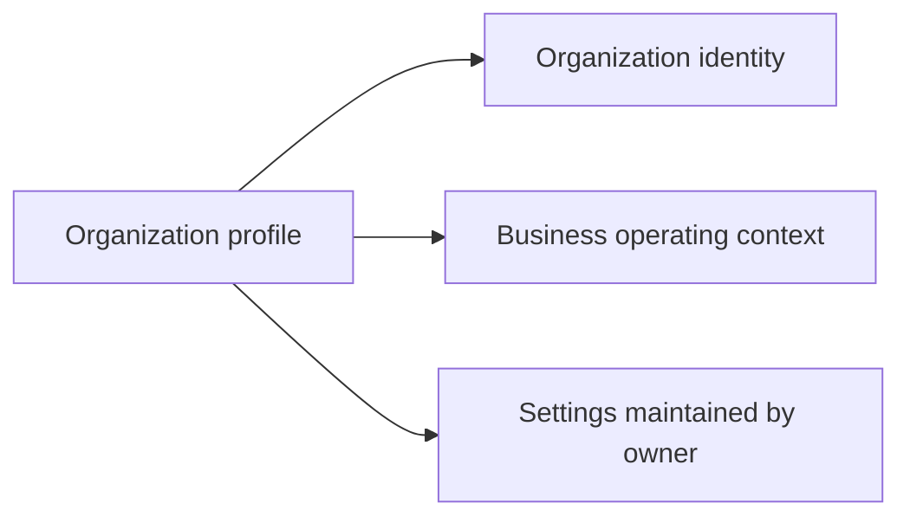

### Organization Name

The organization name is the primary identity of the organization profile. It is the business label members use to recognize the organization. The organization name must belong to exactly one organization and must be treated as the key identifying value of that organization within the platform.

The organization name is required for the organization profile to be considered complete. If the organization name is missing, the organization profile is not valid for use.

The organization name is referenced by other organization-related records as the organization’s identity, but it remains a business-facing name rather than a technical identifier.

### Organization Description

The organization description provides additional business context for the organization profile. It is used to describe the organization in plain language and helps members understand the purpose or scope of the organization.

The organization description belongs to the same organization profile as the organization name and is maintained together with the other organization settings. If present, it must describe that organization only and must not refer to another organization’s work or context.

The organization description is optional, but when it is provided it must remain consistent with the organization’s identity and business operating context.

### Logo Image

The logo image is part of the organization profile and represents the organization visually. It belongs to the same organization as the organization name and description and is used as part of the organization’s identity.

The logo image must stay associated with the correct organization profile. If a logo image is provided, it must represent that organization only and must not be shared as another organization’s visual identity.

The logo image is optional, but when present it is considered one of the core elements that make the organization profile recognizable to members.

### Currency Setting

The currency setting belongs to the organization profile and defines the organization’s financial reporting preference. It is part of the organization’s business operating context and must be interpreted as the currency used by that organization, not as a personal preference.

The currency setting must remain consistent within the organization profile so that the organization’s business figures are interpreted in the same way across the platform. It is maintained by the organization owner together with the other organization settings.

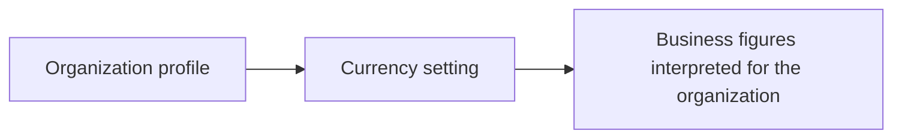

### Timezone Setting

The timezone setting belongs to the organization profile and defines the organization’s operating timezone. It is part of the organization’s business operating context and must reflect the timezone in which the organization operates.

The timezone setting is used so that dates and week-based business boundaries are meaningful to members of the same organization. It must remain consistent within the organization profile and is maintained by the organization owner.

The timezone setting is one of the settings that help the organization profile function as a single shared business context for its members.

### Fiscal Start Month

The fiscal start month belongs to the organization profile and defines the organization’s financial calendar. It is part of the organization’s business operating context and must be consistent for reporting and planning within that organization.

The fiscal start month must stay associated with the same organization profile and must be maintained by the organization owner. If the fiscal start month is missing or inconsistent with the organization profile, the organization’s financial context is not fully defined.

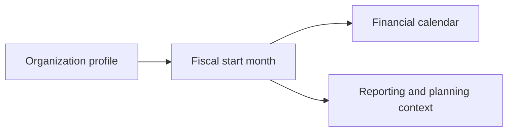

### Owner-Managed Settings

The organization owner is the only user who can maintain the organization profile settings covered in this unit. This includes the organization name, organization description, logo image, currency setting, timezone setting, and fiscal start month.

Owner-managed settings must remain tied to the correct organization and must not be modified as if they were global settings shared by all organizations. Each organization manages its own settings independently through its owner.

If the current user is not the organization owner, the organization profile settings are not owner-managed for that user.

### Organization Identity

The organization identity is the combination of the organization name, organization description, and logo image as represented in the organization profile. Together, these elements identify the organization in business terms and help members recognize which organization they are working in.

The organization identity must belong to one organization only. It must not be mixed with another organization’s identity or used to describe a different business context.

This identity is the business-facing representation of the organization and is separate from the operational settings that define how the organization works.

### Business Operating Context

The business operating context is the combination of the organization’s currency setting, timezone setting, and fiscal start month within the organization profile. These settings define how the organization’s work, dates, and financial reporting should be understood.

The business operating context must be consistent within one organization and must not be combined with settings from another organization. It is maintained by the organization owner as part of the organization profile.

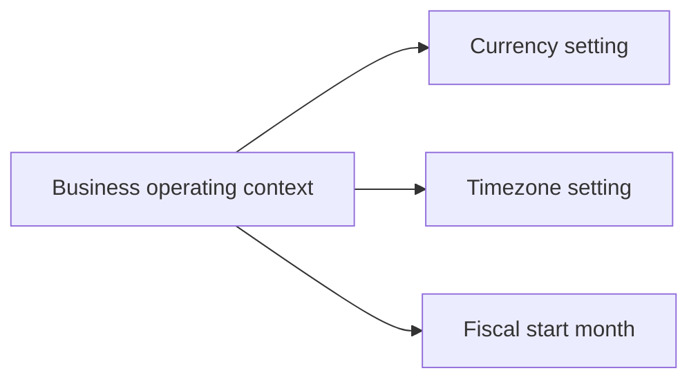

## UserAccount Rules

A user account is identified by email and password for sign-up and log-in. Email is the key account identifier and must be suitable for use across multiple organizations. Users can change their password after account creation, which means the account must support ongoing credential updates. A single user account can belong to more than one organization, so the account must remain independent from any one organization’s membership details. The same account also owns a shared profile used across all organizations. Users can delete their account, but the account cannot be removed if they are the sole owner of an organization unless ownership is transferred or the organization is deleted first. When an account is deleted, employee records tied to that person in other organizations are not erased and are instead marked as deactivated. The account must therefore support clean separation between personal access and organization-specific participation. Invalid credentials or account conflicts prevent access to the user’s working context.

### Email and Password Account

A user account is created and accessed with an email address and a password.
The email address is the account identifier used for sign-up and log-in.
The password is part of the account’s credentials and can be changed after account creation.
A user account supports ongoing credential updates so that access can continue after the password changes.

### Sign-Up Credentials

Sign-up is based on a valid email address and password for creating a user account.
If the email address is already associated with an existing account, the sign-up cannot create a duplicate account for that email.
If the email address matches a pending invitation, the new account is linked to the pending organizations associated with that invitation.
A user account created through sign-up remains usable across more than one organization.

### Log-In Credentials

Log-in is based on the same email address and password used for the user account.
When the credentials are valid, the user gains access to the account and can select an organization context.
When the credentials are invalid, access to the user’s working context is rejected.
A user who belongs to more than one organization can log in once and then choose which organization to work in.

### Password Change

A user can change the password for their own account after the account has been created.
Changing the password updates the account’s ongoing credentials without changing the user’s identity or organization memberships.
A password change does not create a new account and does not alter the user’s shared profile.

### Multiple Organization Access

A single user account can belong to multiple organizations.
The user’s access remains tied to the selected organization context for the current session.
The same user account can switch between organizations without logging out.
All actions performed after selection are scoped to the currently selected organization.

### Shared User Account

A user account is independent from any single organization.
The same account is used for the user’s identity across all organizations the person belongs to.
The account keeps one shared profile for the person rather than separate profiles per organization.
Changes to the shared account identity apply consistently across the organizations linked to that account.

### Account Deletion Rule

A user can delete their own account.
Account deletion is blocked if the user is the sole owner of an organization and has not transferred ownership or deleted that organization first.
If the deletion is allowed, the account is removed while preserving the organization rules stated elsewhere for organization-owned data.
Deleting the account does not delete the user’s shared profile by implication beyond the account removal rule stated here.

### Sole Owner Restriction

If a user is the only owner of an organization, the user must transfer ownership or delete the organization before deleting the account.
This restriction applies only to the sole owner case and prevents account deletion until the ownership condition is resolved.
If ownership is transferred or the organization is deleted, the restriction no longer blocks account deletion.

### Deactivated Employee Records

When a user deletes their account, employee records tied to that person in other organizations are marked as deactivated.
Those deactivated employee records are preserved rather than erased.
The deactivated status reflects that the person no longer has an active account relationship in those organizations.

### Personal Identity Across Organizations

The user’s display name, avatar image, and phone number are part of one shared personal profile used across all organizations.
The same personal identity is visible wherever the user participates, rather than being recreated separately per organization.
Organization participation does not change the fact that the account belongs to one person with one shared identity.

## OrganizationMembership Rules

An organization membership connects a user account to one organization and defines how that person participates there. Each membership belongs to exactly one selected organization context at a time, which keeps the person’s work tied to the organization they are currently using. A user may hold memberships in multiple organizations, but each membership remains specific to one organization and one role. Membership also carries its own status so the organization can distinguish between active participation and a membership that is no longer usable. The selected organization context must be respected when the user acts, since organization-specific membership governs what they can do. A membership cannot exist without a valid organization and a linked user account. If a membership is inactive or unavailable, that person should not be treated as an active participant in that organization. Membership changes must preserve the organization’s internal record of who belongs there and under what role.

### Organization Membership

An organization membership is the business record that connects a user account to one organization and records how that person participates in that organization. The membership is specific to one organization and one user account, and it carries the organization-specific role for that relationship. A user may have memberships in multiple organizations, but each membership remains limited to a single organization. The membership is the participation record used to determine whether the person is active in that organization and what role applies there. A membership cannot exist without a linked user account and a valid organization.

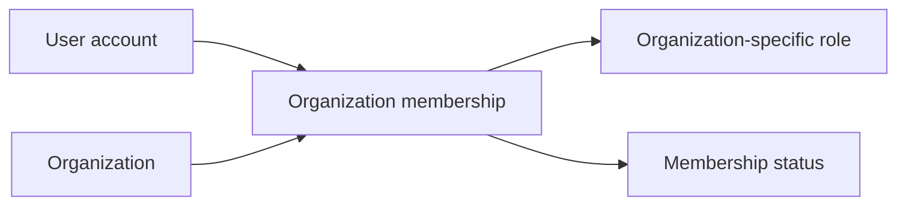

The following business constraints apply to organization membership records:

| Rule | Requirement |
|------|-------------|
| Linked user account | Each membership shall be linked to one user account. |
| One membership per organization | A user may have multiple memberships across different organizations, but only one membership per organization. |
| Organization-specific role | Each membership shall carry exactly one role for that organization. |
| Multi-organization participation | A user may participate in more than one organization through separate memberships. |
| Organization participation record | The membership shall serve as the organization’s record of that user’s participation. |
| Membership validation | A membership shall be considered valid only when it belongs to a real organization and a real user account. |

### Selected Organization Context

The selected organization context is the organization a user is currently using when working within the platform. When a user belongs to more than one organization, the selected organization context determines which membership is active for the current session of work. All organization-scoped actions are interpreted through the selected organization context. Switching to a different organization changes the active context without changing the user’s account. The selected organization context must always correspond to one of the user’s memberships.

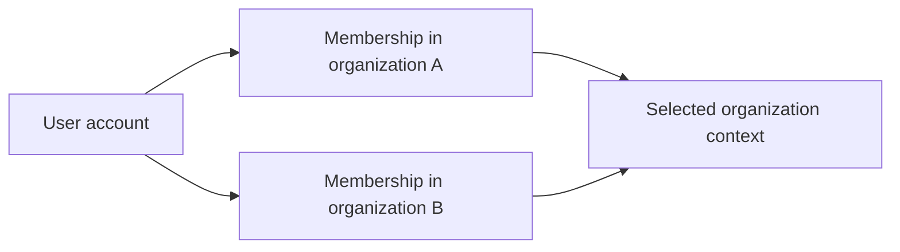

The selected organization context follows these rules:

| Rule | Requirement |
|------|-------------|
| Context selection | A user shall work under one selected organization context at a time. |
| Context source | The selected organization context shall come from one of the user’s organization memberships. |
| Multi-organization participation | A user with memberships in multiple organizations shall be able to participate in each one by selecting the relevant context. |
| Context consistency | The organization membership used for access shall match the selected organization context. |
| Context change | Changing the selected organization context shall change which membership is currently active for work. |

### Membership Status

Membership status describes whether a membership is active or no longer usable. The active membership status identifies a person as an active participant in the organization. When a membership is not active, it must not be treated as an active participation record for that organization. Status changes preserve the membership record so the organization can retain the history of who belonged there. The status is part of the organization’s participation record and is used to distinguish usable memberships from inactive ones.

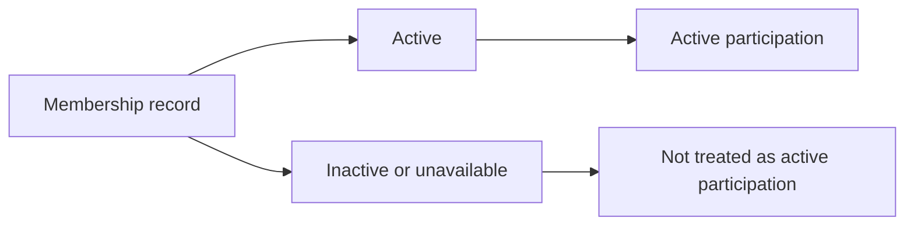

The membership status rules are:

| Rule | Requirement |
|------|-------------|
| Active membership | An active membership shall represent a usable participation record in the organization. |
| Inactive membership | A membership that is not active shall not be treated as an active participant in that organization. |
| Status meaning | Membership status shall distinguish active participation from a membership that is no longer usable. |
| Historical record | Changing membership status shall preserve the organization’s participation record. |

### Membership Validation

Membership validation ensures that organization membership records are complete and internally consistent. A membership must be connected to one real user account and one real organization. The membership must also have one organization-specific role and a defined membership status. Because each user can participate in more than one organization, validation must ensure that each participation record belongs to only one organization. Validation must also ensure that the selected organization context used for work matches an actual membership for that user.

| Validation area | Requirement |
|-----------------|-------------|
| Linked user account | The membership shall not be valid without a linked user account. |
| Organization link | The membership shall not be valid without an organization. |
| One membership per organization | The same user shall not have more than one membership for the same organization. |
| Organization-specific role | The membership shall not be valid without exactly one role for that organization. |
| Membership status | The membership shall include a status that identifies whether it is active or inactive. |
| Selected organization context | The selected organization context shall correspond to one of the user’s valid memberships. |
| Participation record integrity | The membership shall remain the authoritative participation record for that user and organization relationship. |

## Role Rules

Each organization maintains its own role structure, so a role belongs to one organization rather than being shared globally. Three built-in roles are always available: Owner, Manager, and Employee. Built-in roles cannot be deleted, which preserves the core access model for every organization. Custom roles can be created only by organization owners, and each custom role must have a name plus a defined set of permissions. The available permissions describe business abilities such as managing the organization, employees, projects, timelogs, timesheets, and reports. A custom role must reflect an intentional combination of permissions rather than an empty or unclear access profile. Organization owners can edit custom roles when business needs change. A custom role can be removed only when no employees are assigned to it, which protects active assignments from being broken unexpectedly. Role assignment is meaningful because it directly shapes what each employee can do inside the organization.

### Built-In Roles

Three built-in roles exist in every organization: Owner, Manager, and Employee. These roles are part of the organization’s core access model and are available without being created by the organization owner. Built-in roles cannot be deleted. Their names and purpose are fixed so that every organization retains the same foundational access structure. Built-in roles may be assigned to employees, and each employee must hold exactly one role within the organization.

### Owner Role

The Owner role provides full access to all features within the organization. A user assigned the Owner role can manage roles and members in addition to the organization capabilities covered by the Owner’s full access. The Owner role is a built-in role and cannot be deleted. Because the Owner role carries the highest level of responsibility, it is the role used for owner-managed role design when defining or adjusting the organization’s access structure.

### Manager Role

The Manager role allows access to employee management, project management, timesheet approval, and report viewing within the organization. The Manager role is a built-in role and cannot be deleted. Manager access is intended for users who need operational oversight without full owner-level control over role structure.

### Employee Role

The Employee role allows a user to track time, submit timesheets, and view their own data within the organization. The Employee role is a built-in role and cannot be deleted. Employee access is intended for standard day-to-day work participation rather than administration.

### Custom Roles

Organization owners can create custom roles to fit organization-specific access needs. A custom role belongs to one organization and is defined by a role name and a permission set. Organization owners can edit custom roles when business needs change. A custom role can be deleted only when no employees are assigned to it. Custom roles are owner-managed, meaning their creation, adjustment, and removal are controlled by the organization owner rather than by general members.

### Role Name and Permission Set

Every custom role must have a role name. The role name identifies the role within the organization and should clearly describe its intended business purpose. Every custom role must also have a permission set, which is the collection of permissions granted by that role. The permission set must be intentionally defined rather than left unclear or empty. Available permissions describe business abilities such as managing the organization, employees, projects, timelogs, timesheets, and reports. A role’s permission set determines what an employee can do while working in the selected organization.

### Role Assignment

Each employee in an organization is assigned exactly one role. Role assignment determines the employee’s access inside that organization. Users with employee management permission can change role assignment when a business need requires a different level of access. Changing a role assignment updates what the employee can do in the organization, while keeping the employee linked to the same organization and user account.

### Non-Deletable Built-In Role

Built-in roles cannot be deleted under any circumstance. This rule protects the organization’s core access model and ensures that the Owner, Manager, and Employee roles remain available in every organization. Only custom roles are eligible for deletion, and only when no employees are assigned to them.

### Owner-Managed Role Design

Role design is controlled by the organization owner. The owner can create custom roles, edit custom roles, and remove custom roles when they are no longer assigned to any employee. Owner-managed role design ensures that role structure remains intentional, organized, and aligned with the organization’s access needs. Built-in roles remain unchanged as the stable baseline for the organization’s permission model.

## Employee Rules

An employee record represents a user’s working identity inside one organization. Each employee belongs to exactly one organization role at a time, and that role determines the person’s operational access. Employee information can include department, position or title, and employment type, which helps the organization organize people clearly. Employment type is limited to full-time, part-time, contractor, or intern so the organization can classify workers consistently. Employee records can be marked active or deactivated, and deactivated employees are no longer treated as active workers for time tracking and timesheet submission. Historical records for a deactivated employee remain preserved so past work is still available for review. A deactivated employee can later be reactivated when the organization needs to restore access. Employee details should remain consistent with the organization’s current structure and with the role assigned to the employee. If the employee’s account or role assignment becomes inconsistent, the record no longer represents a usable staff member.

### Employee Record

An employee record represents a person’s working identity within one organization.

The employee record is the organization’s staff-facing record for that person and is separate from the shared user account profile.

The employee record is the place where the organization keeps the person’s department assignment, position or title, employment type, current status, and role assigned to the employee (defined in [Role Rules]).

A person may have an employee record in more than one organization, but each employee record belongs to only one organization.

### Department Assignment

A department assignment identifies which department an employee belongs to within the organization.

The department assignment is optional.

If a department is assigned, the employee record must point to an existing department in the same organization.

If a department is removed from the organization, the employee record’s department assignment becomes null instead of removing the employee record.

The department assignment is used for organizing employees and for filtering the employee list.

### Position or Title

An employee record may include a position or title to describe the person’s role in the organization’s structure.

The position or title is optional.

If present, it is stored as a descriptive label for the employee record and does not change the employee’s role assigned to the employee.

The position or title can be edited as part of employee record maintenance.

### Employment Type

Each employee record must have exactly one employment type.

The available employment type values are full-time employment, part-time employment, contractor employment, and intern employment.

Employment type is used to classify the working arrangement of the employee within the organization.

The employment type can be updated when the employee record is edited.

### Full-Time Employment

Full-time employment is one valid employment type for an employee record.

When an employee record is marked as full-time employment, the record is classified as a full-time worker in the organization.

This value is available for use wherever the employment type is displayed or filtered.

### Part-Time Employment

Part-time employment is one valid employment type for an employee record.

When an employee record is marked as part-time employment, the record is classified as a part-time worker in the organization.

This value is available for use wherever the employment type is displayed or filtered.

### Contractor Employment

Contractor employment is one valid employment type for an employee record.

When an employee record is marked as contractor employment, the record is classified as a contractor in the organization.

This value is available for use wherever the employment type is displayed or filtered.

### Intern Employment

Intern employment is one valid employment type for an employee record.

When an employee record is marked as intern employment, the record is classified as an intern in the organization.

This value is available for use wherever the employment type is displayed or filtered.

### Active Employee

An active employee is an employee record with active status.

An active employee is treated as an enabled worker for the organization’s day-to-day operations.

An active employee can continue to participate in time tracking and timesheet submission as allowed by the rest of the system rules.

The active status can be changed only through employee record maintenance rules.

### Deactivated Employee

A deactivated employee is an employee record with deactivated status.

A deactivated employee is no longer treated as an active worker for time tracking and timesheet submission.

A deactivated employee’s historical information remains preserved so past work can still be reviewed.

A deactivated employee record can be reactivated later if the organization restores the person’s working access.

### Role Assigned to Employee

Each employee record must have exactly one role assigned to employee in the organization.

The assigned role determines the employee’s operational access within that organization (defined in [Role Rules]).

The role assigned to employee can be changed by a person who has permission to manage employees.

An employee record must never have more than one role assigned at the same time.

### Reactivated Employee

A reactivated employee is a deactivated employee whose status has been restored to active.

When an employee is reactivated, the employee record again becomes an active employee.

Reactivation restores the employee record for continued use in the organization without creating a new employee record.

Reactivation does not remove the employee’s preserved historical records.

## EmployeeContract Rules

An employee can hold multiple contracts over time, but only one contract may be active at once. Each contract must begin with a start date and a pay rate, and it also records the pay period and working hours per week. The pay period is limited to hourly, daily, weekly, or monthly so compensation can be described in a consistent way. A contract may include notes for extra employment details, but notes are optional and do not define the contract’s core meaning. When a new contract is created, the previous active contract must be closed the day before the new one starts so the record stays continuous. Past contracts are immutable and cannot be edited, which protects the employee’s employment history. Only the current active contract may be adjusted when changes are needed. Employees can review their own contracts, and authorized users can review any employee’s contracts. A contract without a valid start date or pay rate is not a usable employment record.

### Employee Contract

An employee may have multiple contracts over time, and the collection of contracts forms that employee’s historical employment record. Each contract belongs to one employee and represents a single period of employment terms. A contract is meaningful only when it has a start date and a pay rate, because these define when the agreement begins and how compensation is described. A contract may also record an end date, pay period, working hours per week, and optional notes.

The pay period is limited to hourly, daily, weekly, or monthly so the employee’s compensation can be expressed consistently. Working hours per week are part of the contract’s employment terms and describe the expected weekly working time. Contract notes are optional and may be used for additional employment details, but they do not replace the core contract terms.

When a new contract is created for an employee, the previous active contract is automatically closed by setting its end date to the day before the new contract starts. This keeps the employment history continuous and prevents overlapping active contracts. Only one contract may be active for an employee at any time. If a contract already has an active contract for the same employee, the new contract cannot create a second active period at the same time.

Employees can review their own contracts, and users with employee viewing access can review any employee’s contracts. The contract record is part of the employee’s historical employment record and remains available even after later contracts are created.

### Active Contract Only

Only the current active contract may be changed when contract terms need to be updated. Past contracts remain part of the employee’s historical employment record and are not reopened for routine edits. If a contract is not the active contract for that employee, it must be treated as read-only historical information.

A contract with an end date is no longer active. A contract without an end date may be active if it is the employee’s current contract. Because only one active contract is allowed, a new active contract must replace the previous one rather than sit alongside it.

Any change request that targets a non-active contract must be rejected as an attempt to modify historical employment data. The system preserves historical contracts so the employee’s contract timeline can be reviewed accurately over time.

### Immutable Past Contract

Past contracts are immutable historical records. Once a contract is no longer active, its recorded start date, end date, pay rate, pay period, working hours per week, and notes must remain unchanged.

This immutability ensures the employment history stays trustworthy and auditable as contracts change over time. The only contract that may be updated is the current active contract, and even then the update must not alter already closed historical contracts.

If a user attempts to edit a past contract, the request must be rejected. If a user attempts to remove or rewrite a past contract, the request must also be rejected, because the contract history must remain intact.

## Department Rules

Departments are organizational groupings used to organize employees and describe reporting structure. Each department has a name and description, and it may optionally reference a parent department. Only one level of nesting is allowed, so a department can have a parent but no deeper hierarchy. This keeps departmental structure simple and understandable for employees and managers. Organization users with organization management permission control department creation, updates, and removal. If a department is removed, employees assigned to that department are not removed; instead, their department is cleared so their employee record remains intact. Employees can still view the list of departments to understand the organization’s structure. A department should remain a clear organizational label rather than a place for employment history or access control. Invalid or incomplete department information makes the structure harder to use for staff navigation and organization planning.

### Department Name and Description

A department is an organizational grouping used to organize employees and describe the organization’s structure.

The department name identifies the grouping within the organization and is used to distinguish it from other departments.

The department description provides additional context about the grouping and helps employees and managers understand its purpose.

A department must remain an organizational label and must not be used as a place to store employment history or access control rules.

### Parent Department and Hierarchy

A department may reference a parent department.

Only one level of nesting is allowed, so a department may have a parent department, but a child department may not have its own child department.

This rule keeps the department hierarchy simple and easy to understand.


### Department Management

Users with organization management permission can create, edit, and delete departments.

Department management is used to maintain the organization’s structure as teams and reporting lines change.

When a department is deleted, employees assigned to that department are not deleted.

Instead, the employee department is cleared, and the employee record remains intact.

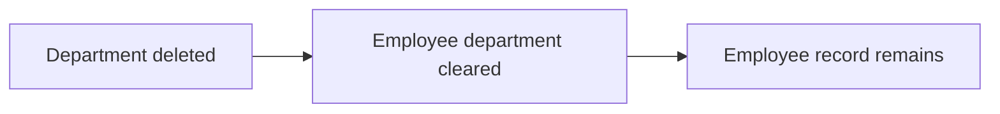

### Department List Visibility

Employees can view the list of departments.

The department list is available to help employees understand the organization’s structure.

Department visibility is read-only for employees who do not have organization management permission.

The visible list reflects the current department hierarchy and any departments that remain after deletion.

### Organizational Structure

Departments are part of the organization’s internal structure and are used to group employees in a way that supports organizational planning.

A department can have a name, a description, and an optional parent department, but it must remain within the single-level hierarchy allowed by the organization.

When a department is removed, the organization structure is updated by clearing employee department assignments rather than removing the employees themselves.

Invalid department hierarchy changes that would create deeper nesting are not allowed.

## Project Rules

A project is a named work container used to organize tasks and time tracking inside an organization. Each project requires a name and a color code, while the description, budget hours, start date, and end date are optional supporting details. The color code helps users visually distinguish projects in the interface and should be treated as part of the project’s identity. Budget hours provide an estimate for expected effort and are used when the organization wants to compare planned work with actual effort. A project belongs to one organization and is managed by users who have project management permission. The project structure should stay meaningful even when the project has no budget or no dates assigned. Archived or completed projects remain part of the project history and continue to preserve their associated time records. A project without a valid name or display color is not complete enough for day-to-day team use.

### Project Name

A project has a required name that identifies the work container within an organization. The name is a primary business label used by employees to recognize and distinguish one project from another. A project without a name is incomplete for normal project use. The name definition is the basis for project identity (defined in this section).

### Project Description

A project may include an optional description that explains the purpose or scope of the work. The description supports project planning by giving employees additional context without being required for the project to exist. A project remains valid even when no description is provided.

### Color Code

A project has a required color code used for visual project distinction. The color code helps employees tell projects apart at a glance in the interface. The color code is part of the project’s identity and is treated as a required identifying detail (defined in this section). A project without a color code is incomplete for day-to-day team use.

### Project Status

A project has a status that expresses whether it is active, archived, or completed. The status is used to show the project’s current business state. Archived and completed projects remain part of project history, and their existing time records are preserved. A project status of active indicates that the project is currently being used for ongoing work.

### Budget Hours

A project may include budget hours to represent the total estimated effort planned for the project. Budget hours support project planning by allowing an organization to compare planned work with actual effort. A project without budget hours is still valid, but no budget-based comparison is available for that project.

### Start Date

A project may include a start date to indicate when the project is intended to begin. The start date supports project planning and scheduling, but it is optional. A project remains valid when no start date is set.

### End Date

A project may include an end date to indicate when the project is intended to finish. The end date supports project planning and scheduling, but it is optional. A project remains valid when no end date is set.

### Project Identity

A project’s business identity is formed by its name and color code, which together help employees recognize the project and distinguish it from other projects in the organization. This identity supports everyday project management and visual project distinction. The identity remains meaningful even when the project has no description, budget hours, start date, or end date.

### Project Management

Project management is the organization-level control of projects by users who have project management permission. Within project rules, managed projects can be created, edited, archived, completed, or deleted according to the project’s business constraints. The project record must remain coherent as its details change so that teams can continue to use it for work organization and planning.

### Visual Project Distinction

Projects must be visually distinguishable from one another through their color code. This supports quick recognition when employees browse or work with projects. The visual distinction requirement exists so that projects can be identified quickly without relying only on the name.

### Project Planning

Projects may use description, budget hours, start date, and end date as planning details. These attributes help an organization organize work, estimate effort, and communicate intended timing. Planning details are optional, so a project can still be created and used when some or all of them are not provided.

## ProjectMembership Rules

A project membership connects an employee to a project and records the person’s role in that project. An employee can belong to multiple projects, so membership must be specific to one project at a time. Each membership is assigned either the member role or the project-lead role. The project-lead role gives the employee additional responsibility within the project, which makes the assignment more than a simple participation label. A membership should always reference a valid employee and a valid project so the assignment is meaningful. Project membership is important because it determines who can work on the project and who can help manage tasks inside it. Removing a membership should be treated as removing the employee from that project rather than changing the employee’s overall organizational standing. Inconsistent membership data would make it unclear who is authorized to act within a project.

### Project Membership

A project membership connects one employee to one project and defines that employee’s participation in that project.
A membership must always refer to a valid employee and a valid project so the assignment is meaningful.
An employee can have multiple project memberships across different projects.
A project can have multiple project memberships, forming the project team composition.
Removing a project membership means removing the employee from that project, not changing the employee’s standing in the organization.
A project membership is organization-scoped through its related employee and project, so the same employee may participate in several projects within the organization without sharing one membership record across them.

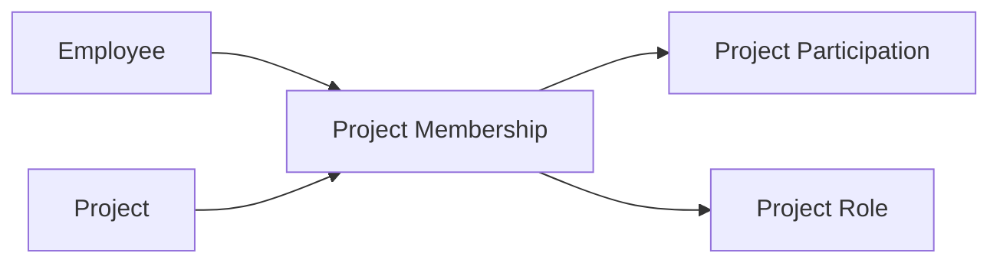


### Project Role Assignment

Each project membership must carry exactly one project role.
The only allowed project roles are member role and project-lead role.
The assigned project role determines how the employee participates in the project team.
A membership cannot exist without a project role.
If a project membership is changed, the project role assigned to that membership must remain one of the allowed project roles.
An employee’s project role applies only within that specific project membership and does not change the employee’s role in the organization.


### Member Role and Project-Lead Role

The member role represents standard participation in a project.
The project-lead role represents higher responsibility within a project than the member role.
A project membership assigned the member role counts the employee as a project participant.
A project membership assigned the project-lead role counts the employee as a project participant and as someone with project task authority within that project.
A project-lead role is still a project membership role, not a separate organizational role.
The distinction between member role and project-lead role is limited to the project in which the membership exists.

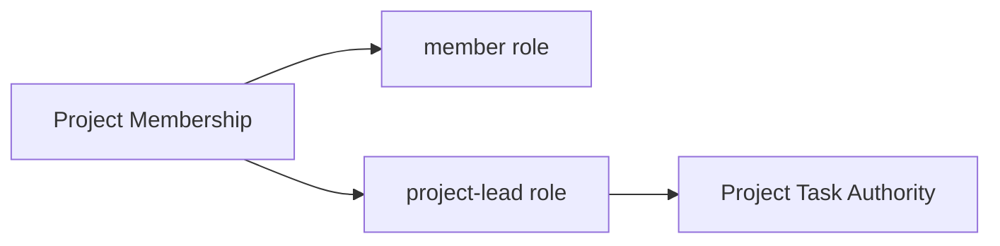


### Multiple Project Assignments

An employee can be assigned to multiple projects at the same time.
Each project assignment must be represented by a separate project membership.
A single project membership cannot link one employee to more than one project.
A project membership does not prevent the employee from joining other projects.
Project team composition is therefore built from multiple employee assignments, not from a single shared assignment record.
If an employee is removed from one project membership, any other project memberships for that employee remain unchanged.


### Project Task Authority

Project task authority belongs to the project-lead role within a project membership.
An employee with project-lead role can manage tasks within that project.
An employee with member role does not gain project task authority from the membership alone.
Project task authority applies only to the project covered by the membership that grants it.
If the project-lead role is removed from a project membership, the employee no longer has project task authority for that project through that membership.
Project task authority is derived from the project membership and does not apply across other projects unless those projects have their own project-lead membership for the same employee.


### Project Team Composition

A project team is the set of employees who have project memberships for that project.
The team may include both member role assignments and project-lead role assignments.
A project team can contain zero or more members.
The project team composition changes when project memberships are added or removed.
The assigned employee in a project membership is the employee who contributes to that project as part of the team.
Project team composition must always reflect the current memberships for the project, so it is not possible for a person to appear on the team without a project membership.


## Task Rules

A task belongs to a project and describes work that needs to be completed within that project. Each task requires a title, and it may also include a description, estimated hours, due date, priority, and an assigned employee. The allowed task statuses are open, in-progress, completed, and closed, which gives the team a clear set of work states. Priority is limited to low, medium, high, or urgent so work can be ordered consistently. An assigned employee must already be a member of the project, which keeps responsibility aligned with project participation. Tasks may also have a parent task, but only one level of nesting is allowed for subtasks. Project leads and users with project management permission are the people who can maintain task details within the project context. A task without a title or with an invalid assignment does not represent usable project work.

### Task Identity and Content

A task belongs to a project and represents work that needs to be completed within that project.

A task title is required and identifies the work item in a way users can understand.

A task description is optional and provides additional context about the work.

A task may include estimated hours to express the expected amount of effort.

A task may include a due date to indicate when the work is expected to be finished.

### Task Status

A task can have one of four statuses: open, in-progress, completed, or closed.

An open task represents work that has been created but has not yet been started.

An in-progress task represents work that is actively being worked on.

A completed task represents work that has been finished.

A closed task represents work that is no longer being actively handled.

Task status is a core task attribute used to describe the current state of the work item.

### Task Priority

A task priority is limited to low, medium, high, or urgent.

Priority is used to express how important or time-sensitive a task is relative to other tasks in the same project.

Each task may have only one priority value at a time.

### Task Assignment

A task may be assigned to an employee.

An assigned employee must already be a member of the project that owns the task.

If a task has an assigned employee, responsibility for the task is tied to that project member.

If no employee is assigned, the task remains unassigned.

### Parent Task and Subtask Nesting

A task may have a parent task when it is being used as a subtask.

Subtask nesting is limited to one level only.

A task that already serves as a subtask cannot be used as the parent of another task.

This rule keeps task hierarchy shallow and prevents nested chains of subtasks beyond one level.

### Task Validity Rules

A task without a title is not valid.

A task cannot be assigned to an employee who is not a member of the task's project.

A task cannot use a parent task structure beyond one level of nesting.

A task's title, description, status, priority, estimated hours, due date, assigned employee, and parent task together define the task record described by this unit.

## TaskHistoryEntry Rules

A task history entry preserves the story of how a task changed over time. Each entry records when the change happened, what the previous status was, what the new status became, and who made the change. This makes task progress traceable for project members and managers. History entries exist so the organization can understand why a task moved through different work states. The record should remain tied to a specific task change and should not be treated as a standalone work item. Because the history is meant to be reliable, it should reflect the actual sequence of task status changes. Users reviewing a task need this entry to explain how the task reached its current status. If a status change is missing from history, the task’s progress history is incomplete.

### Task History Entry

A task history entry is a permanent record of one task status change. It exists to show how a task progressed over time and to provide a task progress trace that can be reviewed later.

Each task history entry is tied to exactly one task and is not a standalone work item.

A task history entry records:
- the timestamp of the change
- the old status before the change
- the new status after the change
- who made the change

A task history entry serves as the task’s status audit trail and task change history. It provides a task lifecycle record that explains how the task moved from one status to another.

A task history entry must reflect the actual sequence of task status changes. If a status change is missing, the task’s progress history is incomplete.

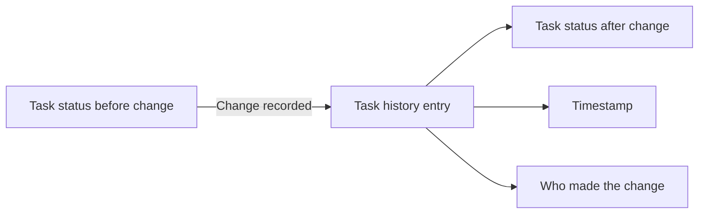


### Status Change Record Integrity

A task history entry is valid only when it describes a real status transition for the task.

Each entry must capture the previous status and the resulting status for the same change event.

The recorded old status must represent the task status immediately before the change.

The recorded new status must represent the task status immediately after the change.

The recorded who made the change value must identify the user responsible for the status change.

The recorded timestamp must identify when the status change occurred.

A history entry must not be reused to describe more than one status change.

A history entry must not describe a task state change that did not actually occur.

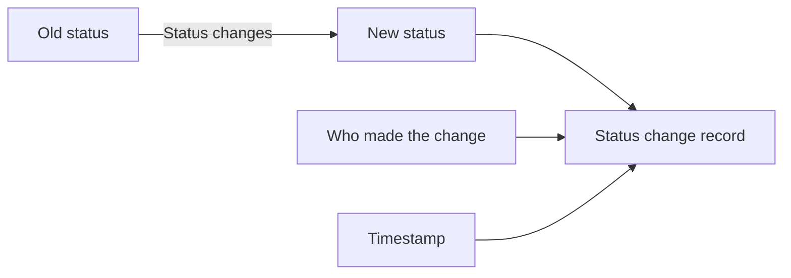


## Timelog Rules

A timelog captures a single time entry for work performed by an employee. Each timelog requires a date, a duration in minutes, and a project, while the task and description remain optional. The project must be one the employee is assigned to, so the time entry always matches an actual working relationship. If a task is included, it must belong to the selected project to keep the entry coherent. A billable flag identifies whether the time should count as billable work, and it defaults to true when the employee does not specify otherwise. Employees can only create timelogs for themselves, which keeps ownership of time records personal and accurate. Once a timelog becomes part of an approved timesheet, it is locked from employee edits. Once it is part of any submitted or approved timesheet, it cannot be deleted by the employee. Authorized managers can still maintain timelogs when business oversight is needed.

### Timelog Entry

A timelog entry records a single span of work performed by an employee. It belongs to one employee, one organization context, and one project. A timelog entry may also be linked to a task when the task belongs to the same project. A timelog entry may include a description of work and a billable time indicator. A timelog entry may later be included in a timesheet for the same employee and week. The system treats each timelog entry as an individual record rather than a summary of multiple work sessions.

### Date of Work

The date of work is required for every timelog entry and identifies the day the work was performed. The date of work must belong to the organization context currently selected by the employee when the timelog is created or edited. The system uses the date of work to place the entry in the correct weekly timesheet. A timelog entry without a date of work is invalid.

### Duration in Minutes

The duration in minutes is required for every timelog entry. It represents the amount of work time recorded for the entry. The duration is stored as a minute-based value rather than a broader time period. A timelog entry without a duration in minutes is invalid.

### Project Assignment

Every timelog entry must be tied to a project that the employee is assigned to. This requirement ensures that time is recorded only against work the employee is authorized to perform for that project. If the selected project is not one of the employee's assigned projects, the timelog entry is rejected. A timelog entry cannot be created without a project assignment.

### Task Linked to Project

A timelog entry may reference a task only when that task belongs to the same project selected for the entry. This rule keeps the task and project relationship consistent. If a task is provided and it does not belong to the selected project, the timelog entry is rejected. When no task is provided, the timelog entry remains valid as long as the project assignment rule is satisfied.

### Description of Work

A timelog entry may include a description of work to explain what was done during the recorded time. The description is optional and does not affect whether the timelog entry is valid. When present, it remains part of the timelog record for later reference.

### Billable Time

A timelog entry may be marked as billable time to indicate that the recorded work should count as billable work. When the employee does not specify a billable status, the timelog entry is treated as billable time by default. Billable time is a property of the timelog entry and can be used when reviewing or reporting work.

### Non-Billable Time

A timelog entry may be marked as non-billable time to indicate that the recorded work should not count as billable work. Non-billable time is represented by the billable time indicator being turned off. The system must preserve this distinction so that work can be separated into billable and non-billable categories later.

### Self-Owned Timelog

Employees can create timelog entries only for themselves. A timelog entry is always owned by the employee who recorded it, and another employee cannot create or claim that entry on their behalf. This ownership rule applies regardless of the project or task selected for the entry.

### Approved Timesheet Lock

When a timelog entry becomes part of an approved timesheet, the employee can no longer edit that timelog entry. An approved timesheet locks all included timelog entries from employee edits. This preserves the approved record as finalized work history.

### Submitted Timesheet Restriction

When a timelog entry becomes part of any submitted or approved timesheet, the employee can no longer delete that timelog entry. This restriction applies even if the timesheet has not yet been approved. The purpose of this rule is to prevent removal of time entries that are already under timesheet review or have been finalized.

## Timesheet Rules

A timesheet groups an employee’s timelogs for a specific week from Monday to Sunday. Each timesheet belongs to one employee and one week, so the weekly boundary must be consistent. The status can be draft, submitted, approved, or rejected, which reflects the review stage of the employee’s recorded time. A timesheet’s total hours are derived from the timelogs it contains, so the timesheet depends on the underlying entries being correct. A draft timesheet must contain timelogs before it can be submitted. A timesheet cannot be submitted if another timesheet for the same week is already submitted or approved, which prevents duplicate weekly reporting. When a timesheet is rejected, a rejection reason is required so the employee knows what needs to be corrected. Approved timesheets create a locked record of that week’s time, while rejected timesheets return to draft status for revision. Employees can review their own timesheets, and approvers can review submitted timesheets.

### Weekly Timesheet

A timesheet belongs to one employee and covers exactly one week.
A weekly timesheet is the employee-owned record used to group that employee’s timelogs for review.
A timesheet’s week is defined by a Monday start date and a Sunday end date.
The week boundaries must stay consistent for the entire timesheet, and the start and end dates must represent the same week.
A timesheet belongs to the employee who created it and is not shared between employees.


### Monday to Sunday Week

The week covered by a timesheet starts on Monday and ends on Sunday.
A timesheet cannot represent a partial week or a week with different boundary days.
The week definition applies consistently to draft, submitted, approved, and rejected timesheets.
When a timesheet is created for a specific week, that week must be the employee’s Monday-to-Sunday reporting period.


### Timesheet Status

A timesheet can be in one of four statuses: draft, submitted, approved, or rejected.
The status shows the review stage of the employee’s weekly time record.
A draft timesheet is editable by the employee.
A submitted timesheet is awaiting review.
An approved timesheet is finalized and locked.
A rejected timesheet is returned for correction and resubmission.
The timesheet status must always match the current review stage.

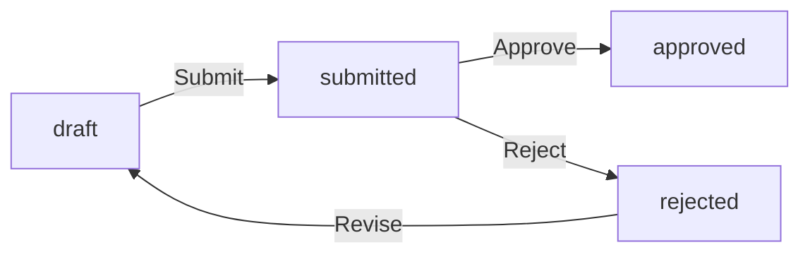

### Draft Timesheet

A draft timesheet is the editable version of a weekly timesheet.
When a draft timesheet is created, it automatically includes the employee’s timelogs for that week.
The employee can add or remove timelogs from a draft timesheet.
A draft timesheet can be submitted only if it contains at least one timelog.
A draft timesheet cannot be submitted if another timesheet for the same week is already submitted or approved.
A draft timesheet belongs to one employee only.


### Submitted Timesheet

A submitted timesheet is a weekly timesheet that has been sent for approval.
A submitted timesheet is no longer in draft status.
A submitted timesheet can be viewed by approvers.
A submitted timesheet cannot be submitted again.
A submitted timesheet remains associated with the same employee and week as the original draft.


### Approved Timesheet

An approved timesheet is a submitted timesheet that has been accepted by an approver.
An approved timesheet is locked, and the timelogs included in it cannot be edited or deleted.
An approved timesheet preserves the record of that employee’s weekly time.
An approved timesheet prevents another timesheet for the same employee and week from being submitted.


### Rejected Timesheet

A rejected timesheet is a submitted timesheet that has been declined for correction.
When a timesheet is rejected, a rejection reason is required.
The rejection reason explains why the timesheet needs correction.
A rejected timesheet returns to draft status so the employee can modify it and submit it again.
A rejected timesheet remains tied to the same employee and week.


### Total Hours

A timesheet’s total hours are derived from the timelogs included in that timesheet.
The total hours value reflects the combined duration of the included timelogs.
When timelogs are added to or removed from a draft timesheet, the total hours must reflect the current contents of the timesheet.
Approved timesheets preserve the total hours recorded for the approved set of timelogs.


### Single Timesheet Per Week

An employee can have only one timesheet for a given week.
If a timesheet for the same employee and week is already submitted or approved, another timesheet for that week cannot be submitted.
This rule prevents duplicate weekly reporting for the same employee.
The uniqueness rule applies to the employee-owned weekly timesheet rather than to the organization as a whole.


### Employee-Owned Timesheet

Each timesheet belongs to exactly one employee.
Employees can view their own timesheets.
A timesheet is created and managed in the context of the owning employee’s weekly time record.
The owner of the timesheet is the only employee whose weekly timelogs are grouped into that timesheet.


## Timer Rules

A timer represents live time tracking for an employee who is currently working on a project. Each employee can have at most one active timer at a time, which prevents overlapping live tracking. Starting a timer requires a project, and the task is optional, so the timer always has a clear work context. The timer stores the start moment, selected project, optional task, and a description of the work being performed. While the timer is running, the employee can adjust the description and can change the project or task if needed. Stopping the timer turns the running session into a timelog with a duration rounded to the nearest minute. Discarding the timer removes the running session without creating a timelog. If the employee forgets to stop it, the timer continues running until the person stops or discards it manually. The timer must remain simple enough for quick start-and-stop work tracking without losing the work context.

### Live Time Tracking

Employees can use live time tracking to record work while it is happening.

The timer represents a running work session for a single employee.

While the timer is running, it preserves the work context that was selected when it started so the employee can later turn that session into a timelog.

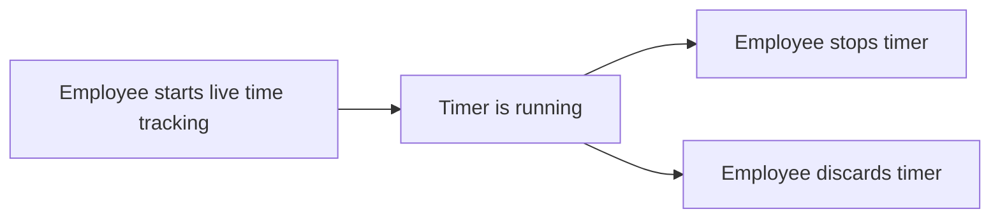

### Active Timer

An active timer is a timer that is currently running.

An employee can have at most one active timer at a time.

If an employee already has an active timer, the system must not allow another running timer to be started for that employee.

An active timer remains active until the employee stops it or discards it.

### Timer Start Context

Starting a timer requires a project.

A task is optional when starting a timer.

The timer stores the start timestamp, the selected project, the optional task, and the description of the work being performed.

The start timestamp identifies when the running work session began.

### Running Timer Description

An employee can enter a description for a running timer.

The description may be edited while the timer is running.

The description should reflect what the employee is working on during the live session.

If the timer is discarded, the running description is removed together with the timer session.

### Edit Running Timer

An employee can edit a running timer while it is active.

The employee can change the description of the running timer.

The employee can also change the project or task of the running timer while it remains active.

The timer must continue to represent one live work session after the edit.

### Stop Timer and Create Timelog

Stopping a timer converts the running session into a timelog.

When a timer is stopped, the system creates a timelog using the timer’s work context and the measured duration.

The created timelog uses the timer’s recorded start timestamp as the beginning of the work session.

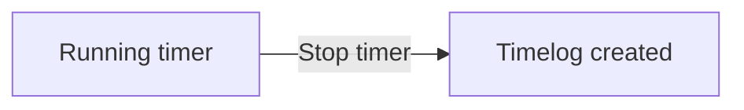

### Discard Timer

An employee can discard a running timer.

Discarding a timer removes the running session without creating a timelog.

A discarded timer no longer counts as an active timer.

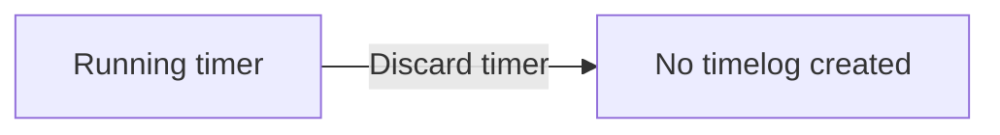

### Rounded Duration

When a timer is stopped, the resulting timelog duration is rounded to the nearest minute.

The rounded duration is the stored work duration for the created timelog.

If the employee forgets to stop the timer, the timer continues running until the employee stops or discards it manually.

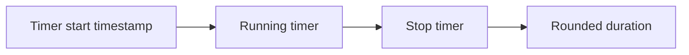

## ActivityLogEntry Rules

An activity log entry records a significant business action so the organization can review important changes later. Each entry stores when the action happened, who performed it, what kind of action occurred, which target entity was affected, and supporting details. The log focuses on meaningful events such as employee invitation, employee deactivation or reactivation, contract changes, project changes, task status changes, timesheet review decisions, and role assignment changes. The entry should capture enough context for an organizer to understand what changed without reconstructing the event from other records. Because activity logs are for organizational oversight, they should remain read-friendly and descriptive. Users with organization management permission can review the full activity log as a record of notable work actions. Entries should not be treated as editable work objects; they exist to preserve a trustworthy trail of business activity. Missing timestamps, action types, or target references would weaken the value of the log as an organizational record.

### Activity Log Entry

An activity log entry is a read-friendly record of a significant business action within an organization. It exists to preserve a trustworthy trail of important work events so that organizational changes can be reviewed later without reconstructing them from other records.

The entry records the timestamp of the action, the user who performed the action, the action type, the target entity, and descriptive log details.

The log details should explain what changed in business terms and provide enough context for an organizer to understand the event.

Activity log entries are intended to document meaningful events rather than routine activity, and they should remain descriptive rather than editable work objects.

Mermaid diagram:
```mermaid
flowchart LR
    A["Business action occurs"] --> B["Activity log entry is recorded"]
    B --> C["Timestamp"]
    B --> D["User who performed action"]
    B --> E["Action type"]
    B --> F["Target entity"]
    B --> G["Log details"]
```

### Logged Event Coverage

The activity log records employee invitation, employee deactivation, contract change, project change, task status change, timesheet review, and role assignment change as significant organizational actions.

Each logged event must be recorded using an action type that clearly identifies which kind of business change occurred.

Employee invited entries capture the event when a user is added to an organization or when a pending invitation is created for a person who does not yet have an account.

Employee deactivated entries capture the event when an employee is made inactive in an organization.

Contract change entries capture the event when an employee contract is created or edited.

Project change entries capture the event when a project is created, archived, completed, or deleted.

Task status change entries capture the event when a task moves from one status to another.

Timesheet review entries capture the event when a submitted timesheet is approved or rejected.

Role assignment change entries capture the event when an employee is assigned a role or when that role is changed.

### Entry Completeness and Readability Rules

Every activity log entry must include a timestamp, the user who performed the action, the action type, the target entity, and log details.

The timestamp identifies when the business action happened.

The user who performed the action identifies who caused the event.

The target entity identifies which business object was affected by the event.

The log details should remain understandable to people reviewing the record later and should describe the event in organizational language.

If any of the required entry elements are missing, the record is incomplete and cannot be treated as a valid activity log entry.

Activity log entries are reviewed as part of organizational oversight and are expected to stay descriptive over time.

Mermaid diagram:
```mermaid
flowchart LR
    A["Activity log entry"] --> B["Timestamp"]
    A --> C["User who performed action"]
    A --> D["Action type"]
    A --> E["Target entity"]
    A --> F["Log details"]
```

# Data Browsing Expectations

Business expectations for how users browse, find, and navigate through lists of data.

## List Browsing Expectations

Define business expectations for how users find, filter, and browse lists.

### Filtering

Users can filter browseable lists only by the criteria defined for each list.

Filtered lists must return items that match the selected criteria.

For employee lists, users can filter by department, employment type, and status.

For project lists, users can filter by status.

For task lists, users can filter by status, priority, and assigned employee.

For timelog lists, users can filter by date range, project, task, and billable status.

For timesheet lists, users can filter by status and date range.

For the activity log, users can filter by action type, user, and date range.

For reports, users can filter by the criteria defined for each report type, including date range and the other report-specific filters stated elsewhere in the specification.

If a filter value does not match any available item, the list returns no matching items rather than items outside the requested criteria.

If a user does not have permission to view the underlying data set, the request to browse that list is rejected.

### Sorting

Lists that support sorting must present items in the order defined for that list.

Task lists can be sorted by due date, priority, and creation date.

When multiple tasks have the same sort value, their relative order is determined consistently within the same browsing context.

If a list does not define sorting options, the system does not allow arbitrary sorting choices for that list.

Sorting must not change which items are visible; it only changes the order in which the matching items are displayed.

### Pagination

Browseable lists that are paginated must return a limited subset of items per view.

The employee list, project list, task list, timelog list, timesheet list, and activity log are paginated.

Users can browse through pages of the same list without changing the selected organization context.

Pagination must preserve the current filtering and sorting choices while moving between pages.

If a requested page has no items, the list is shown as empty for that page.

Pagination must not expose data from other organizations.

# Error Conditions

Business error scenarios and how the system should respond.

## Error Scenarios

Describe error conditions and expected system responses in natural language.

### Error Scenarios

### Missing or Invalid Organization Context
If a user has not selected an organization context, the system rejects any action that depends on organization-scoped data.
If a user attempts to work in an organization they do not belong to, the system rejects the action.
If an organization context is no longer valid because the organization was deleted, the system rejects the action and does not expose organization-scoped data.

```mermaid
sequenceDiagram
    participant U as "User"
    participant S as "System"
    U->>S: "Use organization-scoped data"
    S->>S: "Validate selected organization context"
    S-->>U: "Reject if context is missing, invalid, or inaccessible"
```

### Access Rejection for Restricted Records
If a user tries to access employee, project, task, timelog, timesheet, report, or activity log data outside the currently selected organization, the system rejects the request.
If a user tries to access data for an organization they do not belong to, the system rejects the request.
If a user tries to view employee data, contracts, timelogs, or timesheets without the required access for that record, the system rejects the request.

### Deletion Rejection for Protected Organization Data
If pending timesheets are not all resolved, the system rejects organization deletion.
If active employee contracts still exist, the system rejects organization deletion.
If a user is the sole owner of an organization and has not transferred ownership or deleted the organization, the system rejects account deletion.
If a custom role still has employees assigned to it, the system rejects deletion of that role.
If a project still has timelogs associated with it, the system rejects project deletion.

### Employee Record Exceptions
If a deactivated employee attempts to log time or submit a timesheet, the system rejects the action.
If a deleted department is referenced by employees, the system clears the department assignment instead of failing the employee record.
If an invited email address already has an account, the system adds the user to the organization instead of leaving the invitation pending.
If an invited email address has no account yet, the system creates a pending invitation instead of adding the user immediately.

### Contract Validation Failures
If a new contract is created for an employee, the system ends the previous active contract automatically.
If a user attempts to edit a past contract, the system rejects the change because past contracts are immutable.
If a contract is created without a required start date, pay rate, or working hours per week, the system rejects the contract.
If a contract has an invalid date relationship, the system rejects the contract.

### Project and Task Exceptions
If a user tries to assign an employee to a project without the required project access, the system rejects the assignment.
If a task is assigned to an employee who is not a project member, the system rejects the assignment.
If a user tries to create or edit a task outside a project they can manage, the system rejects the action.
If a user tries to create a timelog for a project the employee is not assigned to, the system rejects the timelog.
If a user tries to create a timelog with a task that does not belong to the selected project, the system rejects the timelog.
If a user tries to create or edit a timelog on an archived or completed project, the system rejects the action.

### Timelog Locking Exceptions
If a timelog is part of an approved timesheet, the system rejects edits and deletion of that timelog.
If a timelog is part of a submitted timesheet, the system rejects deletion of that timelog.
If a user other than the owner or a user with time management access tries to edit or delete a timelog, the system rejects the action.

### Timesheet Submission Rejections
If a draft timesheet has no timelogs, the system rejects submission.
If another timesheet for the same week is already submitted or approved, the system rejects submission of a duplicate timesheet for that week.
If a rejected timesheet is resubmitted, the system allows modification before resubmission.
If a user tries to approve or reject a timesheet without approval access, the system rejects the action.
If a rejection is recorded, the system requires a rejection reason.

### Timer Exceptions
If an employee already has an active timer, the system rejects starting another timer.
If an employee tries to start a timer without selecting a project, the system rejects the timer start.
If a running timer is stopped, the system creates a timelog instead of discarding the work session.
If a running timer is discarded, the system does not create a timelog.
If an employee tries to view or edit a timer they do not own without management access, the system rejects the action.

### Browsing and Reporting Failures
If a requested page of employee, project, timelog, timesheet, or activity log data cannot be returned within the current organization context, the system rejects the request rather than exposing cross-organization data.
If a report is requested without report access, the system rejects the request.
If a project budget report is requested for projects without budget hours, those projects are excluded from the report instead of producing invalid results.
If a time report or weekly summary report is requested with filters that do not match any records, the system returns an empty result set.

### Activity Log Exceptions
If a user without organization management access tries to view the full activity log, the system rejects the request.
If the system records a significant action, it creates an activity log entry instead of silently ignoring the action.
If a logged action cannot be associated with a target entity, the system still records the action details that are available.

### Data Isolation Exceptions
If a user belongs to multiple organizations, the system shows only the currently selected organization’s data.
If a user switches organizations, the system immediately scopes subsequent actions to the new organization context.
If data from another organization is requested, the system rejects the request and does not mix records across organizations.

```mermaid
flowchart LR
    A["Request"] --> B["Validate organization context"]
    B --> C["Validate access and business rules"]
    C --> D["Allow action"]
    C --> E["Reject action"]
    C --> F["Apply special business behavior"]
    F --> D
```