**hrmTimeTracking — Business rules, validation constraints, data browsing expectations, error scenarios**

Business rules, validation constraints, data browsing expectations, error scenarios

# Domain Business Rules

Per-concept business rules, validation logic, and domain constraints.

## Organization Rules

An organization must have a name, and it may also carry a description, logo image, currency, timezone, and fiscal start month as part of its business settings. These settings are intended to support how the organization presents itself and how financial and calendar-related values are interpreted. Organization owners are the only users who can keep these settings aligned with business needs. The organization’s currency should match the way payroll, reporting, and monetary values are understood inside that organization. The timezone should reflect the organization’s local working time so time-based records are consistent for members. The fiscal start month defines how the organization frames its fiscal year for reporting purposes. Organization information should remain coherent over time, so edits must preserve a valid and complete organization profile. If required organization details are missing or invalid, the organization cannot be treated as ready for use.

### Organization Settings

An organization profile consists of the organization name, description, logo image, currency, timezone, and fiscal start month.
The organization name is required and must be present for the organization profile to be considered complete.
The organization description is optional and is part of the organization profile when provided.
The organization logo image is optional and is part of the organization profile when provided.
The organization currency is required because it defines how monetary values are interpreted within the organization.
The organization timezone is required because it defines how time-based records are interpreted within the organization.
The fiscal start month is required because it defines how the organization frames its fiscal year for reporting purposes.
Only the organization owner can keep these business settings aligned with the organization’s needs.
If a user without ownership attempts to maintain the organization settings, the change is rejected.
If any required organization setting is missing, the organization profile is not complete.
If any required organization setting is invalid, the organization profile is not complete.
If the organization profile is not complete, it cannot be treated as ready for use.

Mermaid diagram:
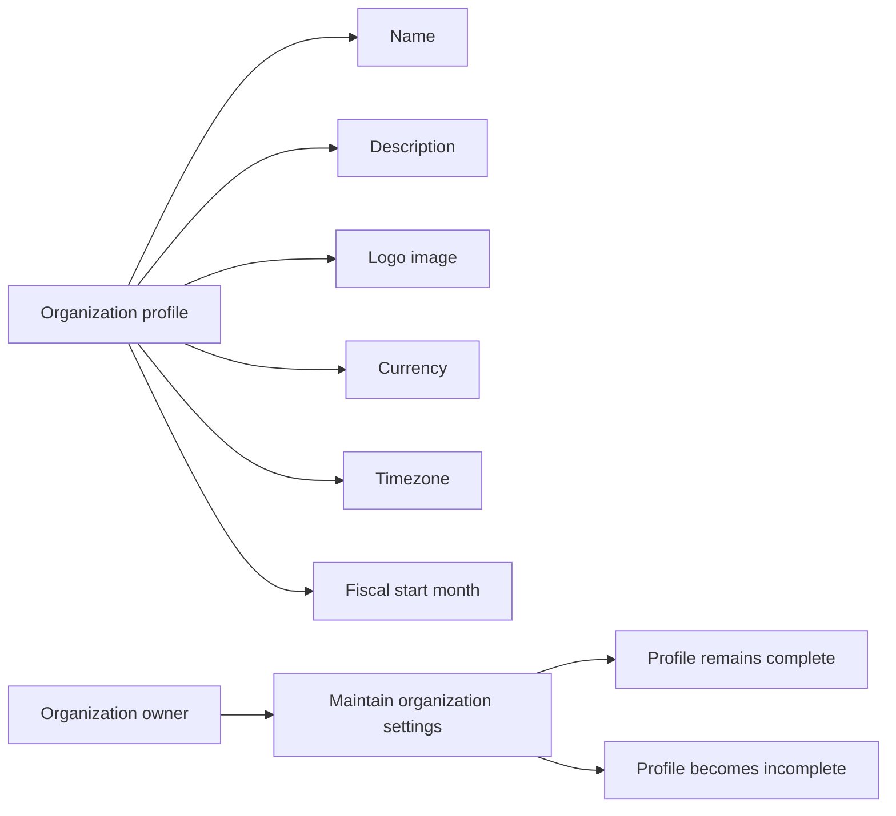


## UserAccount Rules

A user account is identified by email and secured by a password. Email is the primary account identity and must be suitable for sign-in and invitation matching. Password changes must preserve account ownership and continue to support future authentication. A person can belong to multiple organizations under the same account, so the account must support shared access across different workspaces. Account deletion has business consequences for that person’s participation in organizations, especially when they are the sole owner of an organization. If an account is removed, any remaining organizational ties must no longer leave the person in a partially owned or inconsistent state. The account itself remains the basis for sign-in and organization access unless it is intentionally deleted. Password-related changes must not interfere with the user’s shared profile or membership history.

### Account Email Identity

The user account email address is the primary identity used to recognize a person’s account across sign-in and invitation matching.
The system shall treat the email address as the business identifier for account lookup when a person signs in or is matched to a pending invitation.
The system shall not create a separate account identity for the same person when the same email address is used again.
If an email address does not match an existing account, the system shall treat it as a new account identity for sign-up purposes.
If an email address matches an existing account, the system shall treat the person as the same account holder and preserve the shared account history.
If an email address is not suitable for sign-in or matching, the request shall be rejected.

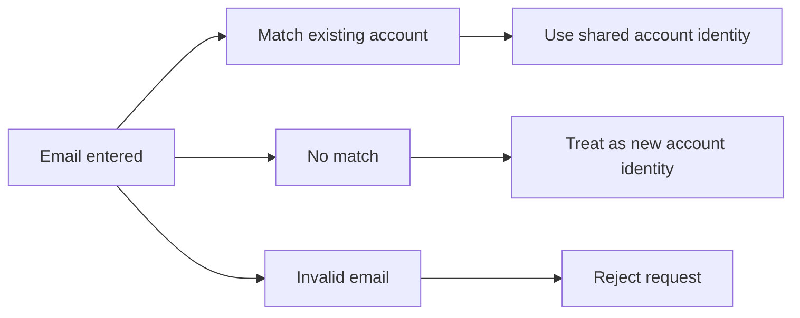

### Password-Based Sign-In and Password Change

The system shall use the account password as the required secret for sign-in.
The system shall allow a user to change the password for their existing account while preserving the same account identity.
The system shall continue to recognize the same user account after a password change.
The system shall not replace or duplicate the account identity when the password is changed.
If the password provided during sign-in does not match the account’s current password, the request shall be rejected.
If a password change request does not meet the account’s current sign-in expectations, the request shall be rejected.
If a password change is completed, the account shall continue to support future sign-in with the updated password.

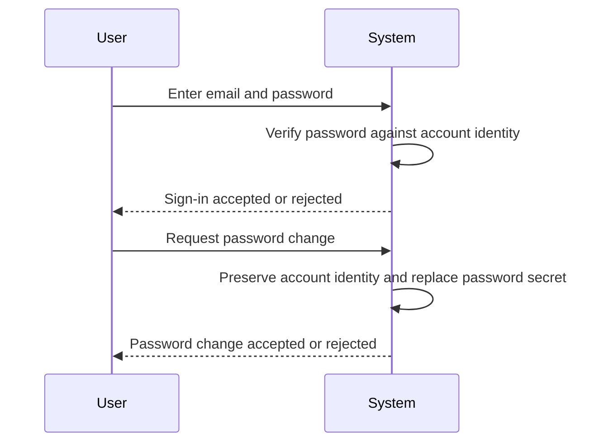

### Multiple Organization Membership

A single user account may belong to multiple organizations at the same time.
The system shall preserve one shared account identity while allowing the account to participate in more than one organization.
The system shall keep organization membership separate so that joining one organization does not remove access to another organization.
The system shall allow the same account holder to be associated with additional organizations without creating a new account.
If a person already has an account, adding them to another organization shall extend that shared account into the new organization rather than creating a duplicate identity.
If a person does not yet have an account, pending organization association is handled through the invitation rules defined elsewhere.

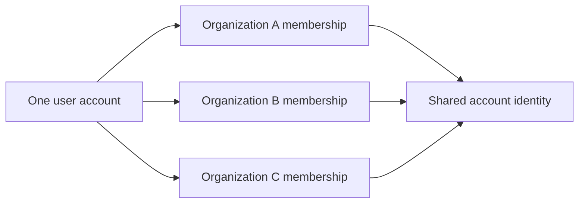

### Shared User Account

The user account is shared across all organizations that the same person belongs to.
The system shall keep account identity consistent even when the account is used in different organizations.
The system shall not create separate copies of the account for each organization.
The system shall allow changes to the account to remain tied to the same shared identity rather than to a single organization.
The system shall preserve the account as the basis for sign-in and organization access unless the account is intentionally deleted.
If a person belongs to more than one organization, the same account shall remain available to support each membership.
If an action would cause the account to become inconsistent across organizations, the request shall be rejected.

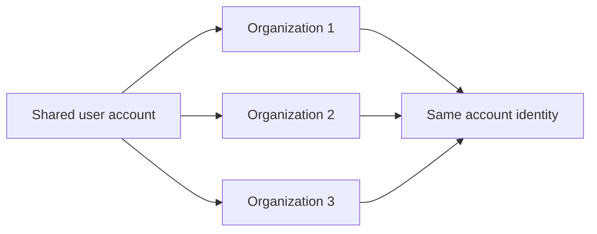

### Account Deletion Constraints

The system shall allow a user to delete their own account only when the deletion does not leave ownership or membership in an inconsistent state.
If the user is the sole owner of an organization, the system shall require the user to transfer ownership or delete the organization before account deletion can proceed.
If the user deletes their account and still has employee records in other organizations, those employee records shall be marked as deactivated.
The system shall preserve the account’s organizational history only as long as needed to keep remaining organization data consistent.
If account deletion would leave the user as the sole owner of an organization, the request shall be rejected.
If account deletion would create an inconsistent ownership state, the request shall be rejected.

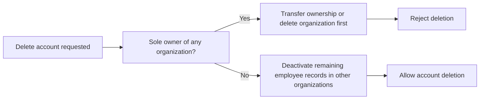

### Sole Owner Restriction and Organization Ownership Transfer

An organization must always have a valid ownership arrangement before a user account can be deleted.
If a user is the sole owner of an organization, the system shall require that ownership be transferred or the organization be deleted before the account deletion is allowed.
The system shall not allow account deletion to proceed while the user remains the only owner of an organization.
When ownership is transferred, the system shall preserve the organization’s ability to continue operating under a different owner.
If ownership transfer has not been completed for every organization where the user is the sole owner, the account deletion request shall be rejected.
If the organization is deleted instead of transferred, the account deletion constraint shall be considered satisfied for that organization.

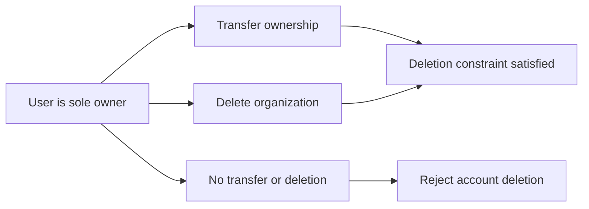

### Account Identity Consistency and User Account Access

The system shall preserve one consistent account identity for the same person across sign-in, password changes, and membership in multiple organizations.
The system shall continue to recognize the same person after password changes and organization membership changes.
The system shall not split one user account into separate identities based on organization membership.
The system shall allow access to remain tied to the same account unless the account is intentionally deleted.
If the requested account action would break identity consistency, the request shall be rejected.
If the account has been deleted, the system shall no longer treat it as an active basis for sign-in or organization access.
If the account remains active, it shall continue to serve as the person’s access basis across all organizations they belong to.

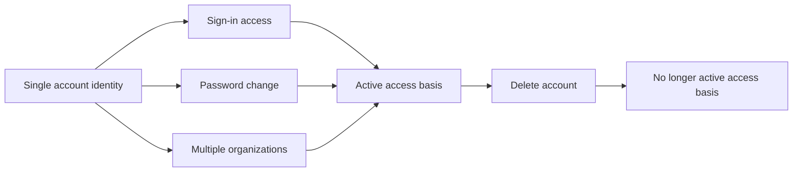

## UserProfile Rules

A user profile represents the person behind the account and is shared across all organizations they belong to. The profile contains a display name, avatar image, and phone number. These details should be usable everywhere the person appears so their identity stays consistent across organizations. Editing the profile updates the shared personal information rather than creating organization-specific copies. The display name should clearly identify the person in team lists and work records. The avatar image supports visual recognition, while the phone number provides an additional contact detail. Profile data should remain personal and reusable, not tied to one organization’s settings. If profile information is incomplete, the person may still exist as an account holder, but their profile remains less useful for collaboration.

### Shared User Profile

A user profile represents the person behind the account and is shared across every organization the user belongs to. The profile is the same personal identity everywhere the user appears, so the user is recognized consistently across organizations and work records. Changes to the profile update the shared personal details for all organizations at once rather than creating separate copies for each organization.

The profile includes the display name, avatar image, and phone number. These details are personal to the user account and are not tied to any single organization’s settings. The display name is used to identify the person clearly in shared work context. The avatar image supports visual recognition of the person. The phone number provides an additional contact detail that belongs to the shared profile.

The system allows the user to edit the shared profile. When the user edits profile information, the updated values apply wherever the profile is shown. Profile editing does not change organization membership or create organization-specific profile data.

A profile is considered more complete when the display name, avatar image, and phone number are present. If one or more of these details are missing, the user still has a valid account, but the profile is less complete for collaboration and recognition. The system preserves profile consistency so the same personal details remain visible across all organizations.

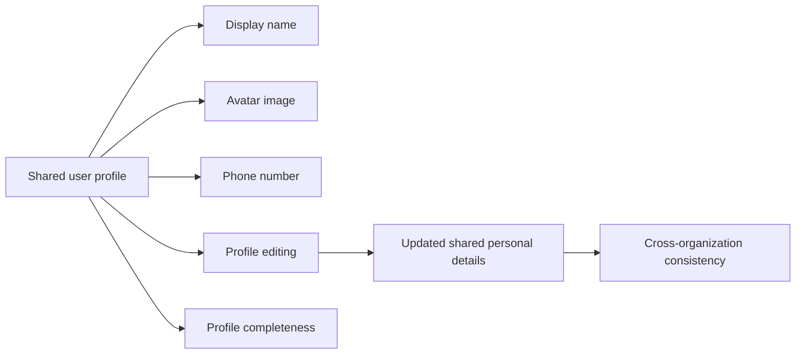


## Role Rules

Each organization defines its own role structure, so roles are part of that organization’s internal staffing model. The built-in Owner, Manager, and Employee roles are mandatory role options and cannot be removed. The Owner role represents full access and organizational control, while the Manager and Employee roles reflect narrower business responsibilities. Custom roles may be created to match local organizational needs, but they must remain compatible with the permission model. A custom role requires a clear name and a deliberate set of permissions. Every employee in an organization must hold exactly one role so their level of access is always unambiguous. Roles are meant to describe business responsibility, not personal identity. A role should only be deleted when it is no longer assigned to any employee, which protects existing access assignments.

### Built-in Roles

Built-in roles are the organization’s fixed role options and are always available in every organization.

Built-in roles cannot be deleted.

The built-in roles are the Owner role, the Manager role, and the Employee role.

Built-in roles provide the standard staffing structure for the organization and serve as the baseline against which custom roles are defined.

Built-in roles remain valid role choices even when an organization also has custom roles.

### Owner Role

The Owner role represents full access to the organization’s features and administrative control within that organization.

The Owner role can manage roles and members.

The Owner role is a built-in role and therefore cannot be deleted.

An organization may have one or more owners among its members.

The Owner role is used for users who are responsible for the highest level of organizational control.

### Manager Role

The Manager role represents a built-in role with broad operational responsibility inside the organization.

The Manager role can manage employees, projects, approve timesheets, and view reports.

The Manager role is a built-in role and therefore cannot be deleted.

The Manager role is intended for users who oversee day-to-day operational work without needing the full control of an owner.

### Employee Role

The Employee role represents the standard operational role for individual contributors in the organization.

The Employee role can track time, submit timesheets, and view own data.

The Employee role is a built-in role and therefore cannot be deleted.

The Employee role is intended for users whose access is limited to their own work and time-related activity.

### Custom Role

Organization owners may create custom roles to match the organization’s internal staffing needs.

A custom role must have a name.

A custom role must include a deliberate set of permissions.

A custom role belongs to one organization and is only meaningful within that organization’s role structure.

A custom role may be edited by organization owners.

A custom role may be deleted only when no employees are assigned to it.

Custom roles provide flexibility for organizations that need role definitions beyond the built-in Owner, Manager, and Employee roles.

### Role Name and Permission Set

Each role has a role name that identifies the role within its organization.

The role name must clearly distinguish the role from other roles in the same organization.

Each custom role has a permission set that defines what business capabilities the role grants.

The permission set is the basis for access control inside the organization and must remain aligned with the organization’s available permissions.

The role name and permission set together define the business meaning of a role.

Built-in roles already have fixed business meaning, so their names and available capabilities are determined by the system rather than by custom configuration.

### Exactly One Role per Employee

Each employee in an organization must be assigned exactly one role.

A single employee cannot hold more than one role at the same time within the same organization.

A role assignment must always identify one clear role for the employee so the employee’s access level is unambiguous.

Role assignment is organization-specific, so the same user may have different role assignments in different organizations.

The system must prevent an employee record from existing without a role assignment.

### Role Assignment Integrity

Role assignment must remain consistent with the organization’s role structure.

When a role is changed for an employee, the employee must immediately be associated with the new role and no longer with the previous role.

Role assignment changes are only valid when the target role exists in the same organization.

A role that is no longer assigned to any employee remains available unless it is a built-in role or is otherwise restricted by deletion rules.

Role assignment integrity ensures that employees always have a current and valid role for their organization.

### Role Deletion Restrictions

Built-in roles cannot be deleted.

A custom role cannot be deleted while any employee is still assigned to it.

A role deletion attempt must be rejected when deletion would leave an employee without a valid role assignment.

Role deletion is only allowed when the role is no longer needed and can be removed without breaking employee role assignment integrity.

These deletion restrictions protect the organization’s staffing structure and preserve valid access assignments.

## Permission Rules

Permissions define the specific business capabilities attached to a role. Each permission code represents a distinct area of control such as managing the organization, employees, projects, time, or reports. Permission sets must stay aligned with the approved capability list so roles do not gain undefined powers. A permission should describe a meaningful business action rather than a broad or vague access idea. Some permissions affect administrative settings, while others govern visibility, approval, or management responsibilities. The system relies on permissions to distinguish between viewing, editing, approving, and administering work records. A role’s permission set should be internally consistent so employees receive a coherent scope of responsibility. Permissions are not personal attributes; they are organizational controls assigned through roles.

### Permission Codes

The system shall recognize only the approved permission codes defined for organization management, employee management, project management, time management, timesheet approval, report viewing, and employee visibility.
A permission code shall represent one distinct business capability and shall not combine multiple unrelated capabilities.
A permission code shall be assignable only through a role’s permission set.
A permission code shall be interpreted consistently across the organization in which the role exists.
A permission code shall not grant capabilities outside its approved business scope.

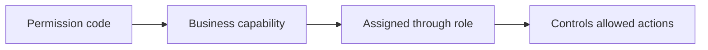

### Organization Management Permission

THE system SHALL use the organization management permission to control whether a user can edit organization settings.
THE system SHALL use the organization management permission to control whether a user can view the full activity log.
THE system SHALL use the organization management permission to control whether a user can create, edit, and delete departments.
THE system SHALL use the organization management permission to control whether a user can manage roles and membership-related organization administration responsibilities.
IF a role does not include the organization management permission, THEN THE system SHALL not treat that role as having organization-wide management authority.
WHILE a user is operating in a selected organization context, THE system SHALL evaluate organization management capability only within that organization.

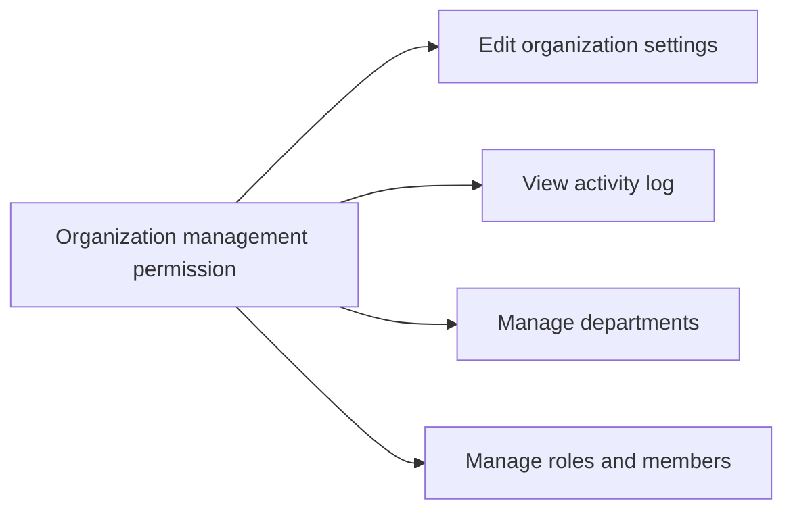

### Employee Management Permission

THE system SHALL use the employee management permission to control whether a user can invite employees to an organization.
THE system SHALL use the employee management permission to control whether a user can edit employee records.
THE system SHALL use the employee management permission to control whether a user can deactivate or reactivate employees.
THE system SHALL use the employee management permission to control whether a user can assign or change an employee’s role within the organization.
THE system SHALL use the employee management permission to control whether a user can create employee contracts.
THE system SHALL use the employee management permission to control whether a user can edit the current active contract of an employee.
IF a role does not include the employee management permission, THEN THE system SHALL not allow that role to perform employee administration actions.

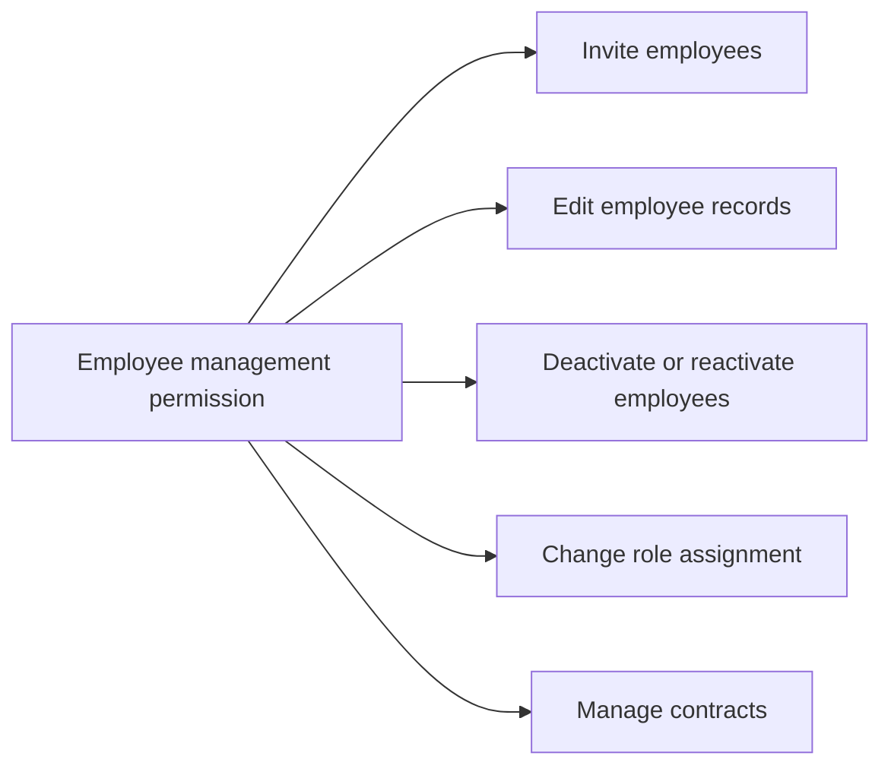

### Project Management Permission

THE system SHALL use the project management permission to control whether a user can create, edit, archive, complete, and delete projects.
THE system SHALL use the project management permission to control whether a user can assign employees to projects or remove employees from projects.
THE system SHALL use the project management permission to control whether a user can create tasks within a project.
THE system SHALL use the project management permission to control whether a user can edit any task within the organization context they are working in.
THE system SHALL use the project management permission to control whether a user can manage project work regardless of whether they are a project lead.
IF a role does not include the project management permission, THEN THE system SHALL not allow that role to perform project administration actions.

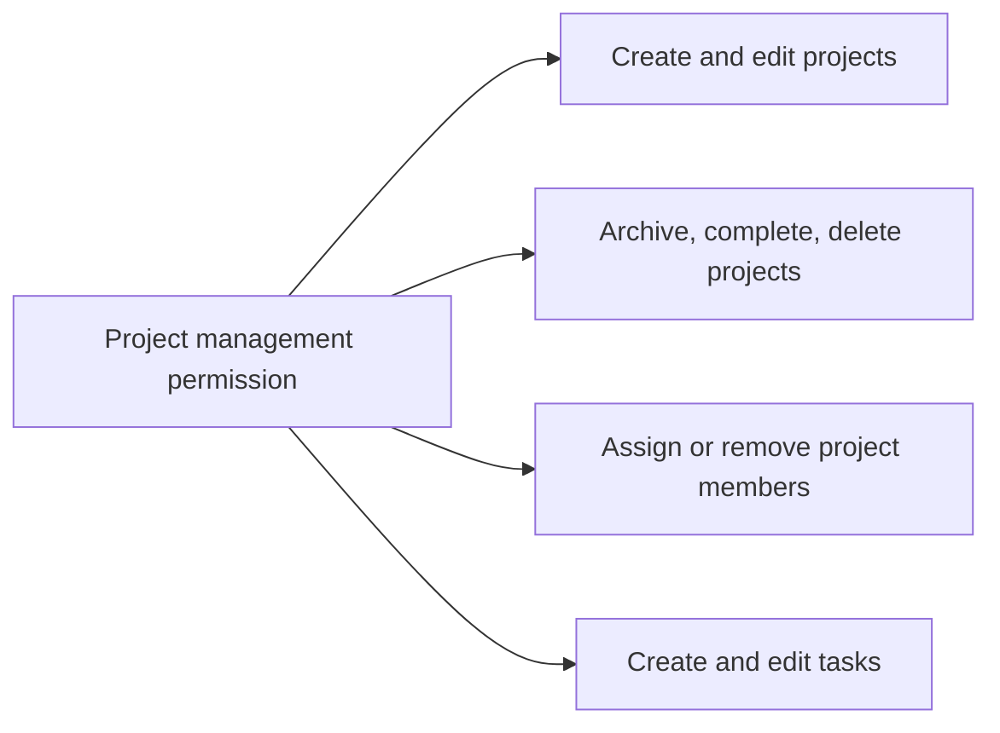

### Time Management Permission

THE system SHALL use the time management permission to control whether a user can edit any employee’s timelogs.
THE system SHALL use the time management permission to control whether a user can delete any employee’s timelogs.
THE system SHALL use the time management permission to control whether a user can view all employees’ timelogs.
THE system SHALL use the time management permission to control whether a user can access organization-wide time tracking records beyond their own records.
IF a role does not include the time management permission, THEN THE system SHALL limit that role to the time tracking actions otherwise available through its other permissions.

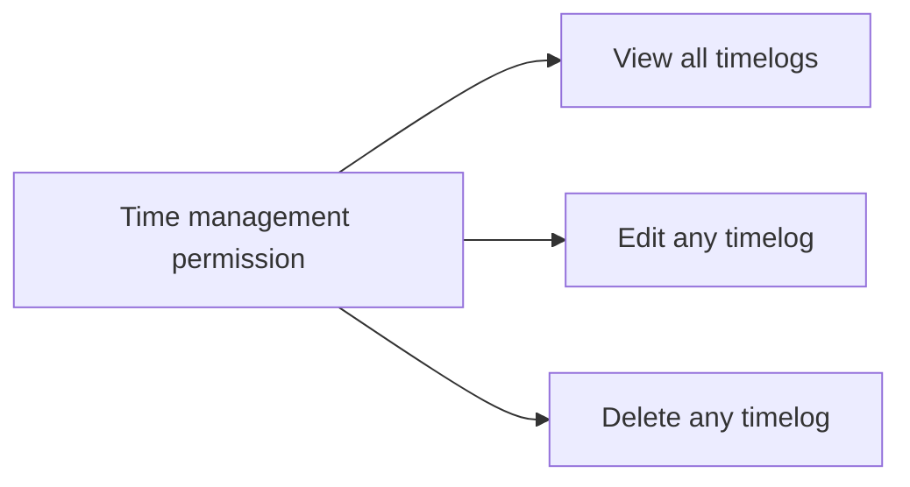

### Timesheet Approval Permission

THE system SHALL use the timesheet approval permission to control whether a user can view all submitted timesheets.
THE system SHALL use the timesheet approval permission to control whether a user can approve submitted timesheets.
THE system SHALL use the timesheet approval permission to control whether a user can reject submitted timesheets.
THE system SHALL require the reviewer to provide a rejection reason when rejecting a timesheet.
IF a role does not include the timesheet approval permission, THEN THE system SHALL not allow that role to review submitted timesheets as an approver.

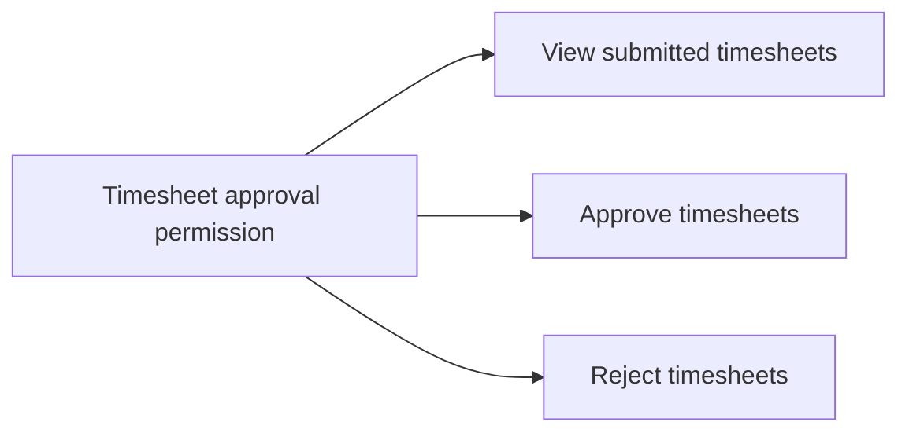

### Report Viewing Permission

THE system SHALL use the report viewing permission to control whether a user can access organization reports.
THE system SHALL use the report viewing permission to control whether a user can view the organization dashboard.
THE system SHALL use the report viewing permission to control whether a user can view time reports, project budget reports, and weekly summary reports.
THE system SHALL use the report viewing permission to control whether a user can see organization-wide reporting information instead of only their own data.
IF a role does not include the report viewing permission, THEN THE system SHALL not allow that role to access organization reporting views.

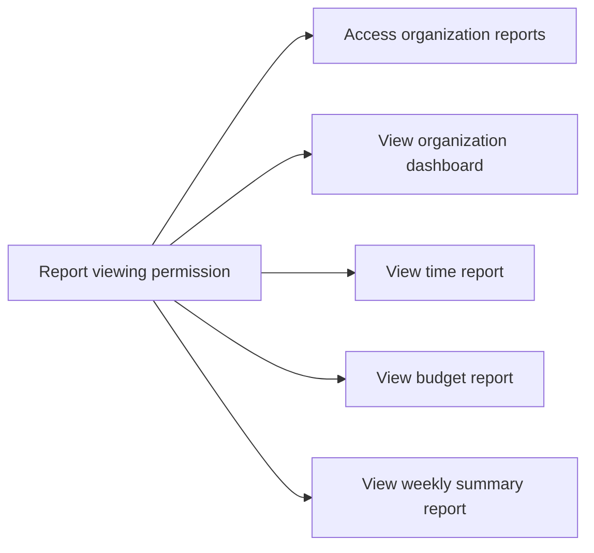

### Employee Visibility Permission

THE system SHALL use the employee visibility permission to control whether a user can view the employee list and employee details.
THE system SHALL use the employee visibility permission to control whether a user can view any employee’s contracts.
THE system SHALL use the employee visibility permission to distinguish visibility of other employees from access limited to the user’s own employee information.
IF a role does not include the employee visibility permission, THEN THE system SHALL not allow that role to browse employee records beyond its own permitted scope.
WHILE a user is acting within an organization context, THE system SHALL apply employee visibility only to employees in that organization.

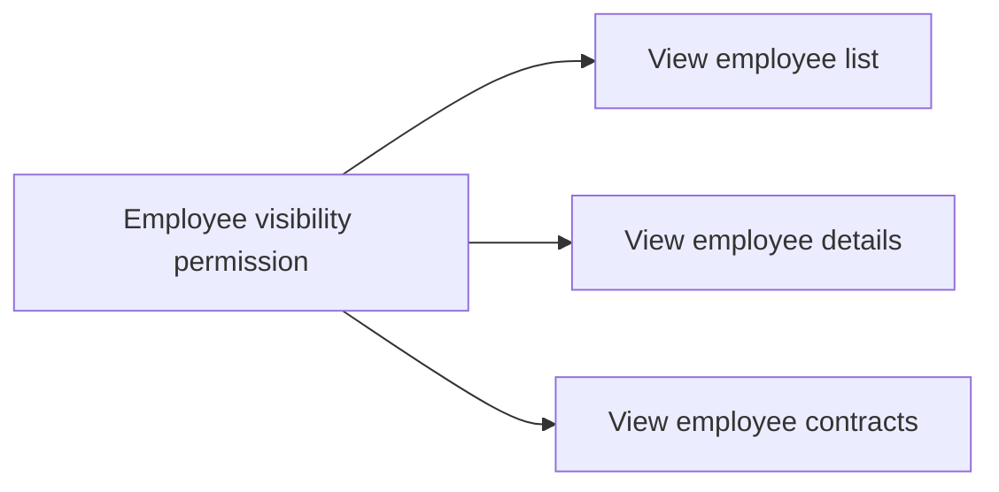

### Role Capability Scope

THE system SHALL derive a role’s capability scope from the permission set assigned to that role.
THE system SHALL treat built-in roles and custom roles as capability containers with permission sets that define what the role can do.
THE system SHALL ensure that a role can only exercise capabilities that are explicitly represented by its permissions.
THE system SHALL not infer additional capabilities from a role’s name alone.
THE system SHALL apply a role’s capability scope only within the organization where the role exists.
IF a user changes organization context, THEN THE system SHALL evaluate the user’s capabilities again using the role assigned in the newly selected organization.

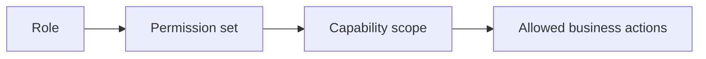

### Permission Set Consistency

THE system SHALL require each role’s permission set to contain only approved permission codes.
THE system SHALL require a role’s permission set to remain internally consistent with the business scope that role is intended to represent.
THE system SHALL not allow a permission set to include undefined or unsupported permission codes.
THE system SHALL not allow a role’s permission set to grant contradictory business scope within the same role.
THE system SHALL treat permission set consistency as a validation rule applied when roles are created or edited.
IF a permission set is inconsistent with the approved capability list, THEN THE system SHALL reject the role change.

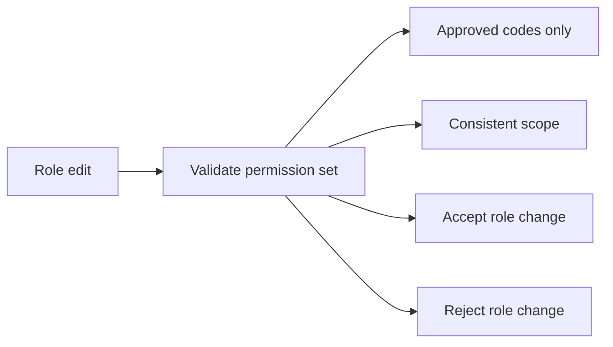

## Employee Rules

An employee links a user account to an organization and gives that person an internal business identity there. Each employee record must be tied to exactly one role so the person’s authority inside the organization is clear. Department and position are optional details that help describe where the employee fits in the organization. Employment type must reflect one of the supported workforce categories: full-time, part-time, contractor, or intern. Employee status distinguishes whether the employee is currently active or deactivated. A deactivated employee remains part of the historical record and retains past work history, but their active participation is no longer expected. Employee information should remain coherent even when the person belongs to multiple organizations, because each organization maintains its own employee record. Business edits to employee details should preserve the connection between the person, their role, and their organizational assignment.

### Employee Record

An employee record shall represent the business identity of one user account within one organization.
An employee record shall remain tied to exactly one organization and exactly one user account.
An employee record shall keep the person’s organization-specific details separate from the shared user profile.
An employee record shall retain historical work information even when the employee is deactivated.
An employee record shall remain distinct from employee records that the same user account may have in other organizations.
If an employee record is removed through organization deletion, the organization-scoped employee record shall no longer exist.

### Role Assignment

An employee record shall have exactly one assigned role within its organization.
A role assignment shall determine the employee’s authority inside that organization.
A role assignment shall be changeable only by users who have employee management permission.
A role assignment shall continue to belong to the same employee record even when other employee details are changed.
If a role assignment changes, the employee record shall still remain valid within the organization.
If a role assignment cannot be maintained because the role is no longer available, the change shall be rejected.

### Department Detail

A department detail shall be optional on an employee record.
An employee record may reference one department within the same organization.
If an employee record has no department detail, the employee shall be treated as unassigned to any department.
If a department referenced by an employee record is removed, the employee record shall no longer point to that department.
A department detail shall describe the employee’s organizational grouping without changing the employee’s role assignment or employment type.

### Position Title

A position title shall be an optional descriptive detail on an employee record.
A position title shall help identify the employee’s role in everyday business terms, without replacing the assigned role.
An employee record may have a position title independently of department detail.
Changing a position title shall not change the employee’s authority, employment type, or status.
If a position title is left blank, the employee record shall still be valid.

### Employment Type

An employee record shall classify the worker using exactly one employment type.
The supported employment type values shall be full-time, part-time, contractor, and intern.
Employment type shall be a workforce classification only and shall not determine the employee’s assigned role.
Employment type shall remain part of the employee record for organizational reporting and identification.
If an unsupported employment type is provided, the employee record change shall be rejected.

### Active Status

An active employee record shall be treated as eligible for normal participation in the organization.
An active status shall indicate that the employee can continue to use the organization as permitted by their role.
An active employee record shall remain visible as an active employee within the organization.
Active status shall be preserved independently from department detail, position title, and employment type.
If an employee record is active, the record shall not be treated as deactivated.

### Deactivated Status

A deactivated employee record shall remain part of the organization’s historical business record.
A deactivated status shall indicate that the employee is no longer expected to participate as an active employee.
A deactivated employee record shall preserve historical work history and shall not erase past organizational records.
A deactivated employee record shall be allowed to return to active status later.
If an employee record is deactivated, the record shall be treated as inactive until reactivated.

### Organization Employee Identity

An organization employee identity shall be the organization-specific identity created by combining a user account with an employee record.
The same user account may have separate organization employee identities in multiple organizations.
An organization employee identity shall apply only inside the organization where the employee record exists.
A change in one organization employee identity shall not alter the person’s identity in another organization.
The organization employee identity shall be the basis for role assignment, employment type, department detail, position title, and status within that organization.

### Employee Record Consistency

An employee record shall remain internally consistent across role assignment, department detail, position title, employment type, and status.
A change to one employee detail shall not silently remove unrelated employee details.
An employee record shall continue to point to the same user account unless the record itself is removed through the organization context.
An employee record shall continue to represent the same person within the organization even when status changes from active to deactivated or back again.
If an employee record is updated, the resulting record shall still describe one coherent employee identity within the organization.

### Workforce Classification

Workforce classification shall be represented by the employment type on the employee record.
The workforce classification values shall be limited to full-time, part-time, contractor, and intern.
Workforce classification shall be used to describe how the organization categorizes the employee for business purposes.
Workforce classification shall be stored separately from role assignment so that authority and workforce category are not confused.
If workforce classification is missing or invalid, the employee record shall be rejected.

## Invitation Rules

An invitation represents a request to bring a person into an organization using an email address. The invited email is the key business identifier for matching the person to an existing account or preparing a future membership. If the email already belongs to an account, the invitation results in an immediate organizational association. If no account exists yet, the invitation remains pending until that person creates an account with the same email. The invitation must therefore be tied to a clear email target and a specific pending organization association when applicable. Invitations should support reliable onboarding without creating duplicate identities for the same person. The business meaning of an invitation is to reserve a place for a future employee or confirm an existing one. Pending invitations must remain understandable so the organization can trust who is expected to join.

### Email Invitation and Account Matching

THE system SHALL treat the invited email address as the business identity for an invitation.

WHEN a user invites a person by email, THE system SHALL create an invitation for the specified organization using that invited email address.

WHEN the invited email address already belongs to an existing account, THE system SHALL match the invitation to that account and add the person to the organization.

WHEN the invited email address does not belong to an existing account, THE system SHALL keep the invitation pending until an account is created with that same email address.

WHILE an invitation remains pending, THE system SHALL keep the pending organization association available for future account association.

WHEN a person later creates an account with the invited email address, THE system SHALL associate that account with every pending organization invitation that matches the email address.

THE system SHALL use the invited email address as the employee invitation identity for matching the invitation to the correct person.

THE system SHALL support organization onboarding by allowing an invitation to reserve membership for a future account when no account exists yet.

THE system SHALL support invitational membership by allowing an invitation to represent either an immediate organizational association or a future account association based on the email address match.

WHEN an invitation is tied to an existing account, THE system SHALL complete the organization onboarding without requiring a second invitation.

WHEN an invitation is tied to a future account association, THE system SHALL keep the invitation understandable as a pending request to join the organization.

### Pending Invitation Behavior

WHILE an invitation is pending, THE system SHALL preserve the invited email address and the pending organization association as the basis for later matching.

WHEN a pending invitation is created, THE system SHALL indicate that the person is expected to join the organization in the future.

WHEN the invited person has not yet created an account, THE system SHALL keep the invitation in pending state instead of creating duplicate membership records.

WHEN the invited person later signs up with the matching email address, THE system SHALL convert the pending invitation into organizational membership for that account.

IF the email address used for sign-up does not match a pending invitation, THEN THE system SHALL not associate that sign-up with the pending invitation.

THE system SHALL keep pending invitations distinct from invitations that already matched an existing account.

## Department Rules

A department is an organizational grouping used to organize employees and clarify structure. Each department has a name and may also include a description to explain its purpose. A department may have an optional parent department, but only one level of nesting is allowed. This keeps the hierarchy understandable and prevents deeper structures that are hard to manage. Department names should be distinct enough to avoid confusion within the same organization. The parent-child relationship should represent a simple reporting or grouping structure rather than a complex hierarchy. Employees can be linked to a department when the organization wants to reflect team placement. Department information should stay simple, readable, and suitable for organizational planning.

### Department Name and Description

A department serves as an organizational grouping within an organization. The department name is the primary label used to identify the department in the department structure.

The department name shall be clear enough to distinguish the department from other departments in the same organization.
The department description shall provide additional context about the department’s purpose, scope, or responsibility.
The department description may be left empty when no additional explanation is needed.
The department name and description shall support a simple and readable department hierarchy without requiring detailed organizational terminology.
The department naming style shall favor clarity over abbreviation so employees can understand the structure easily.

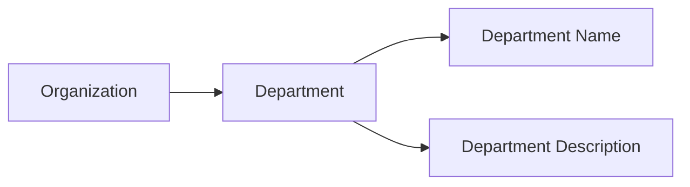

### Parent Department and One-Level Nesting

A department may have a parent department to represent a simple reporting structure.
The parent department shall be used only when the organization wants to show that one department sits under another in the department hierarchy.
The department structure shall allow only one level of nesting.
A department may therefore be a top-level department or a child department, but it shall not have a parent department of its own if it is already a child department.
The system shall treat this limit as part of the department structure so that the hierarchy remains easy to understand and manage.
The parent department relationship shall support a simple reporting structure rather than a deep hierarchy.

```mermaid
flowchart LR
    A["Top-Level Department"] --> B["Child Department"]
```

### Employee Department Assignment

Employees may be assigned to a department when the organization wants to reflect team placement.
An employee’s department assignment shall point to one department or no department.
A department may be used as an organizational grouping for multiple employees.
If a department no longer represents the employee’s placement, the employee may be left without a department assignment.
The department structure shall remain independent of employee records while still providing a clear way to group employees for reporting and organization.
The system shall preserve the simple reporting structure by keeping department assignment limited to a single department per employee.

```mermaid
flowchart LR
    A["Employee"] --> B["Department"]
    B --> C["Organizational Grouping"]
```

## Contract Rules

A contract records the working terms for an employee over time and is kept as a historical business record. Each contract requires a start date, a pay rate, and a working-hours-per-week value. The pay period must describe how compensation is interpreted, such as hourly, daily, weekly, or monthly. An end date may be present when the contract is no longer ongoing. Only one contract can be active for an employee at a time, so new contract terms must not create overlapping active arrangements. When a new contract begins, the previous active contract must be closed in a way that preserves the history. Past contracts are immutable so the organization can trust the record of prior employment terms. Notes may be added to capture context, but they do not replace the core contract terms. Contract data should always support a clear picture of the employee’s current or historical employment arrangement.

### Contract Terms

A contract must record the employee’s employment terms for a specific period.

- The contract start date is required.
- The contract end date is optional.
- A contract must include a pay rate.
- A contract must include a pay period that expresses how the pay rate is applied.
- A contract must include working hours per week.
- Notes may be included, but they do not replace the required employment terms.
- The contract record must always be sufficient to describe the employee’s current or historical employment arrangement.

The contract’s employment terms are defined by the start date, end date, pay rate, pay period, and working hours per week.

### Active and Historical Contract Rules

An employee can have only one active contract at a time.

- While a contract is active, it represents the employee’s current employment terms.
- When a new contract begins, the previous active contract must be closed so the employee does not have overlapping active contract terms.
- Past contracts remain as historical contract records.
- A historical contract record must not be changed after it is no longer active.
- Contract immutability applies to past contracts so the organization can rely on prior employment terms as an accurate record.
- The organization’s contract history must preserve the sequence of employment terms over time.

```mermaid
flowchart LR
    A["active contract"] -->|"new contract begins"| B["previous contract closed"]
    B -->|"preserved as history"| C["historical contract record"]
    C -->|"cannot be changed"| D["immutable record"]
```

## Project Rules

A project defines a managed body of work inside an organization. Each project requires a name and a color code so it can be recognized consistently in business use. Description, budget hours, start date, and end date are optional planning details that help describe the project’s scope and timeline. Project status must reflect one of the supported business states: active, archived, or completed. The project’s status affects how it is treated as a work target, especially for new time entry expectations. Project information should remain coherent enough to support planning, reporting, and task organization. A project should be identifiable by its name and visual color choice so teams can distinguish it quickly. The project record is meant to serve as a stable work container for related assignments and task management.

### Project Identity and Planning Details

A project shall have a name that identifies it within the organization.
A project shall have a color code that is used to recognize it consistently.
A project may have a description that explains the purpose or scope of the work.
A project may have budget hours to express the estimated amount of work planned for the project.
A project may have a start date to indicate when planned work begins.
A project may have an end date to indicate when planned work is expected to finish.
A project record shall remain coherent enough for planning, reporting, and task organization.
A project shall be identifiable by its name and color code so that teams can distinguish it quickly.
A project description, budget hours, start date, and end date are planning details and do not replace the project’s identity.

```mermaid
flowchart LR
    A["Project"] --> B["Name"]
    A --> C["Color code"]
    A --> D["Description"]
    A --> E["Budget hours"]
    A --> F["Start date"]
    A --> G["End date"]
```

### Project Status Rules

A project shall have a status that reflects one of the supported business states.
A project shall use only the supported statuses of active, archived, or completed.
An active project shall represent work that is currently available for ongoing use.
An archived project shall represent work that is no longer active but remains preserved for reference.
A completed project shall represent work that has been finished and preserved for reference.
The project status shall be consistent with how the project is treated as a work target.
The project status shall be one of the defining attributes of the project record.

```mermaid
flowchart LR
    A["active project"] --> B["archived project"]
    A --> C["completed project"]
```

### Project Planning Coherence

A project’s planning details shall support clear organization of work without changing the project’s identity.
A project’s budget hours, when present, shall serve as an estimated planning value for the project.
A project’s start date, when present, shall describe the planned beginning of the project.
A project’s end date, when present, shall describe the planned finish of the project.
A project’s description, when present, shall provide supporting context for the work.
A project’s name and color code shall remain the primary business identifiers for day-to-day recognition.
A project shall remain usable as a stable work container for related assignments and task management.
A project shall support planning and reporting even when optional planning details are not provided.

```mermaid
flowchart LR
    A["Project record"] --> B["Identity"]
    A --> C["Planning details"]
    B --> D["Name"]
    B --> E["Color code"]
    C --> F["Description"]
    C --> G["Budget hours"]
    C --> H["Start date"]
    C --> I["End date"]
```

## ProjectMembership Rules

A project membership connects an employee to a project and defines how that person participates in the work. An employee can be assigned to multiple projects, so membership must support repeated participation across different project records. Each membership includes a project role that identifies whether the employee is a regular member or a project lead. The membership role is important because it determines the person’s responsibility within the project team. Membership records should remain clear and unambiguous so the organization knows who belongs to which project. Project membership is not the same as organizational employment, because it only describes participation in a specific project. The assignment should stay consistent with the employee’s role in the project team and with the project’s business needs. A membership is only meaningful when both the employee and the project are valid organizational entities.

### Project Membership as the Employee-Project Link

A project membership is the business record that connects one employee to one project within the organization.
A separate project membership is created for each employee-project pair, so the same employee can participate in multiple projects through multiple membership records.
A project membership represents participation in a project team only; it does not change the employee’s organization-wide employment relationship.
A project membership must always clearly identify both the employee and the project it connects.
A project membership exists to show which project team the employee belongs to and how that person participates in that project.

```mermaid
flowchart LR
    A["Employee"] -->|"assigned to"| B["Project Membership"]
    B -->|"links to"| C["Project"]
    A -->|"can have multiple"| D["Project Membership"]
    D -->|"links to"| E["Another Project"]
```

### Employee Project Assignment and Multiple Project Participation

An employee may be assigned to more than one project at the same time.
Each project assignment is recorded as its own project membership so that participation in one project does not overwrite participation in another.
A project assignment must remain specific to the employee and the project it belongs to.
A project membership must make it possible to tell whether the employee is participating in one project, several projects, or all of the projects they are assigned to.
The system must preserve clear membership records when an employee participates in multiple projects.
A project membership must not be treated as a global assignment outside the project where it was created.

### Project Lead and Member Roles Within a Project Team

Each project membership must classify the employee’s role in the project team as either project lead or member.
The project lead role identifies an employee who has leadership responsibility within that project team.
The member role identifies an employee who participates in the project team without project lead responsibility.
The role in a project membership must describe the employee’s responsibility in that specific project only.
The same employee may be a project lead in one project and a member in another project, depending on the project membership record.
The role assigned in a project membership must always make the employee’s participation status within the project team understandable.

### Project Membership Responsibility and Assignment Clarity

A project membership must clearly communicate who the employee is, which project the employee is assigned to, and what role the employee has in that project.
The membership record must be unambiguous so that the organization can distinguish one project team assignment from another.
The responsibility described by the membership is limited to the employee’s role in the project team and does not replace organizational role or employment information.
A project membership must remain consistent with the idea that project participation is recorded separately from general employee information.
The system must be able to use the membership record to answer whether an employee belongs to a given project team and what role they hold there.

## Task Rules

A task represents a piece of work inside a project and must always belong to a valid project. Each task requires a title so the work item can be clearly identified. Description, estimated hours, due date, assigned employee, and parent task are optional details that help organize the work. A task status must be one of the supported business states: open, in-progress, completed, or closed. Priority must be one of the supported business levels: low, medium, high, or urgent. If a task is assigned to an employee, that employee must already be a project member so the assignment makes business sense. Parent-task usage is limited to one level of nesting, which keeps subtasks manageable. Task data should remain suitable for project planning and progress tracking without becoming overly complex.

### Task Title

A task shall have a title so the work item can be clearly identified.
The title shall be required for every task.
The title shall be the primary business label used to distinguish one task from another within a project.
If a task does not have a title, the system shall reject it.

```mermaid
flowchart LR
    A["Task"] --> B["Title"]
    B --> C["Required identification"]
    C --> D["Reject if missing"]
```

### Task Status

A task shall have a status that reflects its current work state.
The supported task statuses are open, in-progress, completed, and closed.
An open task shall represent work that has been created but not yet started.
An in-progress task shall represent work that has been started and is currently underway.
A task status shall be recorded as one of the supported business states only.
If a task is given a status outside the supported set, the system shall reject it.

```mermaid
flowchart LR
    A["Task"] --> B["Status"]
    B --> C["open"]
    B --> D["in-progress"]
    B --> E["completed"]
    B --> F["closed"]
```

### Task Priority

A task shall have a priority that expresses its relative urgency within the project.
The supported task priorities are low, medium, high, and urgent.
A task priority shall be one of the supported business levels only.
If a task priority is not one of the supported values, the system shall reject it.
Priority shall be treated as a required classification for each task.

```mermaid
flowchart LR
    A["Task"] --> B["Priority"]
    B --> C["low"]
    B --> D["medium"]
    B --> E["high"]
    B --> F["urgent"]
```

### Estimated Hours

A task may include estimated hours to describe the expected amount of work.
Estimated hours shall be optional.
When provided, estimated hours shall represent a planning value for the task.
The system shall accept estimated hours only as a business estimate for planning and progress tracking.
If estimated hours are omitted, the task shall still remain valid.

```mermaid
flowchart LR
    A["Task"] --> B["Estimated hours"]
    B --> C["Optional planning value"]
```

### Due Date

A task may include a due date to indicate when the work is expected to be finished.
Due date shall be optional.
When provided, due date shall help users plan and prioritize work within the project.
If a due date is present, it shall be treated as part of the task's scheduling information.
If a task has no due date, the task shall still remain valid.

```mermaid
flowchart LR
    A["Task"] --> B["Due date"]
    B --> C["Optional scheduling detail"]
```

### Assigned Employee

A task may be assigned to an employee.
An assigned employee shall be optional.
If a task is assigned to an employee, that employee shall already be a project member.
A task shall not be assigned to someone who is not part of the project.
If the selected employee is not a project member, the system shall reject the assignment.
An unassigned task shall remain valid.

```mermaid
flowchart LR
    A["Task"] --> B["Assigned employee"]
    B --> C["Must be project member if present"]
    C --> D["Reject if not a member"]
```

### Project Task

A task shall belong to a project task context and must always be associated with a valid project.
A task shall not exist outside a project.
This rule ensures that task work remains organized within the project it supports.
A task's project association is required for the task to be considered valid.
If the task is not associated with a valid project, the system shall reject it.

```mermaid
flowchart LR
    A["Project"] --> B["Task"]
    B --> C["Must belong to a valid project"]
    C --> D["Reject if missing project"]
```

### Subtask One Level

A task may have a parent task to represent a subtask.
Subtask usage shall be limited to one level of nesting only.
A task may have at most one parent task.
A child task shall not itself be used as a parent for another nested task.
This rule keeps task hierarchies simple and manageable.
If a second level of nesting is attempted, the system shall reject it.

```mermaid
flowchart LR
    A["Parent task"] --> B["Child task"]
    B --> C["No further nesting allowed"]
```

### Open Task

An open task shall represent a task that is available for work but not yet started.
Open is one of the supported task statuses.
A task in open status shall remain visible as an unfinished work item within its project.
Open tasks shall continue to be eligible for assignment and planning within the project.

```mermaid
flowchart LR
    A["Task"] --> B["open"]
    B --> C["Not yet started"]
    B --> D["Available for planning"]
```

### In-progress Task

An in-progress task shall represent a task that has been started and is actively being worked on.
In-progress is one of the supported task statuses.
A task in in-progress status shall indicate active work within its project.
In-progress tasks shall remain visible as ongoing work until they are completed or closed.

```mermaid
flowchart LR
    A["Task"] --> B["in-progress"]
    B --> C["Work has started"]
    B --> D["Active work continues"]
```

## TaskHistory Rules

Task history preserves the record of how a task’s status has changed over time. Each history entry captures the moment of change, the previous status, the new status, and who made the change. This creates a reliable audit trail for project work and accountability. History entries should reflect actual task status transitions rather than informal notes. The record helps teams understand how the task progressed through its lifecycle. Historical entries are not meant to be edited casually, because they exist to explain what happened and when. The history of a task should remain readable even after the task itself has changed many times. Every status change must leave behind a trace that is meaningful to the organization.

### Task Status History

Task status history is the organization’s historical record of how a task has changed over time.
It exists to show the sequence of status changes for a task in a readable form.
Each historical status entry belongs to one task and reflects one actual change from one status to another.
The history is used as a task progression record, so it must preserve the order in which changes occurred.
The history must remain available for accountability after the task has changed many times.
Historical status entries are not a place for general comments or informal notes; they are reserved for status change records only.

```mermaid
flowchart LR
    A["Task status changes"] --> B["Historical status entry is recorded"]
    B --> C["Task status history grows in order"]
    C --> D["Task progression can be reviewed later"]
```

### Status Transition Record

Each historical status entry is a status transition record for one task.
The record must identify the old status and the new status so the change is understandable without additional context.
The record must represent a real transition between task statuses, not a repeated copy of the same state.
A status transition record must be stored as part of the task’s audit trail so the movement of the task through its lifecycle can be traced.
If a task changes status multiple times, each change must create its own separate status transition record.

```mermaid
flowchart LR
    A["Old status"] --> B["Status transition record"]
    B --> C["New status"]
```

### Change Timestamp and Actor of Change

Each historical status entry must include the change timestamp showing when the status change happened.
The change timestamp is the reference point for ordering status history entries.
Each historical status entry must also identify the actor of change, meaning the person who made the status change.
The actor of change is part of the accountability record and must be preserved with the history entry.
A historical status entry is incomplete if it does not show both when the change occurred and who made it.

```mermaid
sequenceDiagram
    participant U as "Actor of change"
    participant S as "System"
    U->>S: "Change task status"
    S->>S: "Record change timestamp and actor of change"
    S-->>U: "Historical status entry is saved"
```

### Task Audit Trail and Accountability

Task history serves as the task audit trail for status changes.
The audit trail must allow the organization to review how a task progressed and who changed it at each step.
The record must support task accountability by preserving evidence of each status change over time.
The history must show enough information to explain why the current task status is not the only relevant state.
Each historical status entry contributes to the broader record of task progression and must remain readable as part of that trail.
The audit trail must not lose earlier status changes when new ones are added; older entries remain part of the task’s history.

```mermaid
flowchart LR
    A["Historical status entry"] --> B["Task audit trail"]
    B --> C["Task accountability"]
    B --> D["Task progression record"]
```

## Timelog Rules

A timelog records the time an employee spent on work for a specific date. Each timelog requires a date, a duration in minutes, and a project. A timelog may also include a task so the work can be connected to a more specific item. When a task is present, it must belong to the selected project so the time entry remains consistent. The description field can explain what was done during the logged time. The billable flag identifies whether the time should count as billable work or not. An employee’s timelog should represent only that employee’s own work, not shared labor from another person. Timelog data should remain precise enough to support approval, reporting, and weekly work summaries.

### Timelog Date and Duration

A timelog records one employee’s work for one calendar date. The date identifies when the work was performed and makes the entry suitable for daily time tracking and weekly summaries.

A timelog must include a duration measured in minutes. The duration represents the amount of time spent on the work recorded in that entry.

A timelog must always represent a single employee work log. It must not combine time from multiple employees into one entry.

A timelog should be precise enough to support approval, reporting, and weekly work summaries without ambiguity about when the work occurred or how long it took.

```mermaid
flowchart LR
    A["Daily work performed"] --> B["Timelog date"]
    A --> C["Timelog duration"]
    B --> D["Employee work log"]
    C --> D
    D --> E["Approval and reporting"]
```

### Timelog Project and Task Link

A timelog must be linked to one project. The selected project identifies where the work was performed.

A timelog may also include one task. When a task is included, the task-linked timelog must remain consistent with the selected project.

If a task is present, it must belong to the same project as the timelog. A timelog must not point to a task outside its project.

A task-linked timelog is a more specific form of work log that connects recorded time to a particular item of work within the project.

A timelog without a task is still valid when the work belongs to the project as a whole rather than to one task.

```mermaid
flowchart LR
    A["Timelog"] --> B["Project"]
    A --> C["Task"]
    C --> D["Task-linked timelog"]
    B --> D
    D --> E["Consistent project context"]
```

### Timelog Description and Billable Time

A timelog may include a description that explains what was done during the logged time.

The description is used to clarify the employee’s work and provide context for review, approval, and reporting.

A timelog also includes a billable flag that identifies whether the time is billable time or non-billable time.

When the billable flag is set, the timelog represents billable time. When it is not set, the timelog represents non-billable time.

Billable and non-billable time are both valid parts of an employee’s work log, and each must remain distinguishable so reporting can separate them correctly.

```mermaid
flowchart LR
    A["Timelog"] --> B["Description"]
    A --> C["Billable time"]
    A --> D["Non-billable time"]
    B --> E["Work context"]
    C --> F["Billing-aware reporting"]
    D --> F
```

### Timelog Validity Expectations

A timelog is valid only when it represents one employee’s own work, for one date, with one duration, and with one project.

If a timelog includes a task, the task must belong to the selected project.

A timelog should remain suitable for daily time entry use, meaning the recorded date, duration, project, optional task, description, and billable state together describe a complete work log.

A timelog must not lose its meaning if the description is omitted, because the required date, duration, and project still define the entry as a daily work record.

```mermaid
sequenceDiagram
    participant E as Employee
    participant T as Timelog
    E->>T: Record daily work
    T->>T: Store date, duration, project, optional task, description, billable state
    T-->>E: Complete employee work log
```

## Timesheet Rules

A timesheet groups an employee’s timelogs for a single week from Monday to Sunday. It is a weekly business record that summarizes submitted work time for review. Each timesheet belongs to one employee and one specific week, so the date range must stay fixed and understandable. Total hours are derived from the included timelogs and should reflect the work captured in that week. Submitted at, reviewed at, and reviewed by are important recordkeeping details for the timesheet’s approval history. A rejection reason is required when a timesheet is rejected so the employee understands what needs attention. Timesheet data should remain internally consistent with the timelogs it contains. The timesheet is meant to be a reliable weekly statement of recorded work.

### Weekly Timesheet Period

A timesheet is a weekly timesheet that belongs to one employee and covers exactly one Monday to Sunday week. The week start date identifies the Monday for the employee timesheet, and the week end date identifies the Sunday for the same week. The date range must remain fixed for the life of the timesheet so the timesheet work summary always refers to one unambiguous weekly period. A timesheet must not represent a partial week or a week that crosses into another weekly period. The week start date and week end date together define the timesheet as a single weekly approval record.

```mermaid
flowchart LR
    A["Weekly Timesheet"] --> B["Monday to Sunday Week"]
    B --> C["Employee Timesheet"]
    C --> D["Timesheet Work Summary"]
    D --> E["Weekly Approval Record"]
```

### Timesheet Summary and Recordkeeping Fields

A timesheet includes a total hours summary that is derived from the timelogs included in that timesheet. The total hours summary must reflect the work captured for the same weekly period and must stay consistent with the included timelogs. The submitted at value records when the employee timesheet was submitted for review. The reviewed at value records when the weekly approval record was completed through approval or rejection. The reviewed by value identifies the user who performed that review. These recordkeeping fields together provide the history for the timesheet work summary and the approval record.

```mermaid
sequenceDiagram
    participant E as Employee
    participant T as Timesheet
    participant R as Reviewer
    E->>T: Submit weekly timesheet
    T->>T: Record submitted at
    R->>T: Review timesheet
    T->>T: Record reviewed at and reviewed by
```

### Rejection Reason and Approval Consistency

A rejection reason is required when a timesheet is rejected so the employee can understand why the weekly approval record was not accepted. The rejection reason must be stored as part of the timesheet’s review record and must be available with the timesheet’s review history. A rejected timesheet’s review information must still identify the reviewed at time and the reviewed by user, together with the rejection reason. The rejection reason applies only when the timesheet is rejected and is not required for other review outcomes. A timesheet’s recordkeeping details must remain internally consistent so the submitted at, reviewed at, reviewed by, and rejection reason values always describe the same employee timesheet and the same weekly period.

## TimerSession Rules

A timer session captures live time tracking for an employee while work is in progress. It begins with a start timestamp and is associated with a project, and optionally a task, so the running work can be identified clearly. The session may also carry a description to explain what the employee is doing. Each employee can have at most one active timer at a time, which keeps the live tracking state unambiguous. A timer session should remain tied to the selected project context so the recorded work has a clear business destination. The timer session is intended to be editable while it is still running, especially for the project, task, and description details. It should preserve the continuity of the live work record until the employee stops or discards it. Timer data should be simple enough to convert into a timelog when the work session ends.

### Live Timer Session

A live timer session is the running work record used for real-time time tracking while an employee is actively working.
The timer session belongs to one employee and represents one running work session at a time.
A live timer session shall remain associated with the selected project for the full time it is running unless the employee changes the project while the timer is still active.
A live timer session may include an optional task only when that task belongs to the selected project.
A live timer session may include an optional description that explains the work being tracked.
A live timer session shall preserve the details needed to convert the running work session into a timelog when it is stopped.
If the selected task does not belong to the selected project, the timer work record is rejected.
If the employee tries to begin a new live timer session while another active timer already exists for that employee, the request is rejected.

```mermaid
flowchart LR
    A["Timer not running"] -->|"Start timer"| B["Active timer"]
    B -->|"Stop timer"| C["Timer work record converted to timelog"]
    B -->|"Discard timer"| D["No timelog created"]
```


### Start Timestamp and Active Timer

Each live timer session shall record a start timestamp when the timer begins.
The start timestamp shall identify when the running work session started and shall remain part of the timer work record until the session ends or is discarded.
An active timer is a live timer session that has started and has not yet been stopped or discarded.
Each employee shall have at most one active timer at a time.
If an employee already has an active timer, the system shall not allow that employee to start another one until the existing active timer is no longer running.
If an active timer is edited while it is running, the start timestamp shall not be changed.
If a timer session is no longer active, it is no longer treated as the employee’s active timer.


### Timer Project, Task, and Description

A timer session shall store the project selected at the time the timer is started.
A timer session may optionally store a task, and that task shall belong to the selected project.
A timer session may store a description so the employee can explain the work being tracked.
If the employee changes the project of a running timer, the selected task shall remain valid for the updated project or the change is rejected.
If the employee changes the task of a running timer, the new task shall belong to the currently selected project or the change is rejected.
If the employee changes the project of a running timer and the current task no longer belongs to that project, the task must be cleared or replaced with a valid task before the timer can remain valid.
If the description is updated while the timer is running, the timer session shall keep the latest description as part of the running work session.


### Timer Work Record Completion

A running work session shall remain open until the employee stops or discards it.
When the employee stops the active timer, the timer work record shall be converted into a timelog with the calculated duration.
The duration recorded from the timer session shall be based on the start timestamp and the stop moment.
When the employee discards the active timer, no timelog shall be created from that timer work record.
A discarded timer session shall no longer be treated as the employee’s active timer.
A stopped timer session shall no longer be treated as the employee’s active timer.
If the timer is stopped, the timer work record must still preserve the project, optional task, optional description, and start timestamp that were used during the running work session.


## ActivityRecord Rules

An activity record captures a significant business action so the organization can review what happened over time. Each record includes a timestamp, the user who performed the action, an action type, a target entity, and supporting details. The action type should clearly describe the kind of business event being recorded, such as employee changes, contract changes, project changes, task status changes, timesheet decisions, or role changes. The target entity identifies what part of the business was affected, while the details explain the context. Activity records are meant to be descriptive and trustworthy rather than editable business content. They provide a shared memory of important organizational actions. The record should be specific enough to support later review without relying on outside interpretation. Activity logging exists to preserve the story of meaningful work and administrative changes inside the organization.

### Activity Record

An activity record shall capture a significant business action within the organization so it can be reviewed later as part of the organization’s history.
An activity record shall be descriptive and trustworthy rather than treated as editable business content.
An activity record shall describe what happened in enough detail for later review without relying on outside interpretation.
An activity record shall belong to the organization in which the action occurred.

```mermaid
flowchart LR
    A["Business action occurs"] --> B["Activity record is created"]
    B --> C["Organization can review the record later"]
```

### Action Timestamp, Actor User, Action Type, Target Entity, and Activity Details

An activity record shall include the time the action occurred.
An activity record shall include the user who performed the action.
An activity record shall include an action type that identifies the kind of business event being recorded.
An activity record shall include the target entity that identifies what part of the business was affected.
An activity record shall include activity details that provide the context of the action.
The action timestamp shall support later review of when the business event happened.
The actor user shall identify who caused the change or event.
The action type shall be specific enough to distinguish one kind of business event from another.
The target entity shall identify the affected employee, contract, project, task, timesheet, or role when applicable.
The activity details shall explain the relevant context for the recorded action.

```mermaid
flowchart LR
    A["Action timestamp"] --> B["Actor user"] --> C["Action type"] --> D["Target entity"] --> E["Activity details"]
```

### Employee Invite Activity

An employee invite activity shall be recorded when a person is invited to join an organization by email.
An employee invite activity shall identify the invited person as the target entity.
An employee invite activity shall show that the organization attempted to add the person as an employee through an invitation.
An employee invite activity shall include enough details to distinguish the invitation event from other employee-related actions.

```mermaid
sequenceDiagram
    participant U as "Actor user"
    participant S as "Activity record"
    U->>S: "Invite employee"
    S->>S: "Record invitation details"
```

### Contract Change Activity

A contract change activity shall be recorded when a contract is created or edited.
A contract change activity shall identify the contract as the target entity.
A contract change activity shall show the context of the contract change so the organization can review how employment terms changed over time.
A contract change activity shall include enough details to distinguish a contract creation from a contract edit.

```mermaid
sequenceDiagram
    participant U as "Actor user"
    participant S as "Activity record"
    U->>S: "Create or edit contract"
    S->>S: "Record contract change details"
```

### Project Change Activity

A project change activity shall be recorded when a project is created, archived, completed, or deleted.
A project change activity shall identify the project as the target entity.
A project change activity shall show which project event occurred so the organization can review the project’s lifecycle history.
A project change activity shall include enough details to distinguish one project change from another.

```mermaid
flowchart LR
    A["Project created"] --> B["Project archived"] --> C["Project completed"] --> D["Project deleted"]
```

### Timesheet Decision Activity

A timesheet decision activity shall be recorded when a timesheet is submitted, approved, or rejected.
A timesheet decision activity shall identify the timesheet as the target entity.
A timesheet decision activity shall show the decision made on the timesheet so the organization can review approval history.
A timesheet rejection activity shall include the rejection reason as part of the activity details.
A timesheet decision activity shall include enough details to distinguish submission, approval, and rejection events.

```mermaid
flowchart LR
    A["Timesheet submitted"] --> B["Timesheet approved"]
    A --> C["Timesheet rejected"]
```

# Data Browsing Expectations

Business expectations for how users browse, find, and navigate through lists of data.

## List Browsing Expectations

Define business expectations for how users find, filter, and browse lists.

### Filtering Expectations

Users can narrow a list by applying only the filters that are available for that list.
If a filter value is provided, the system shows only records that match that value.
If multiple filters are applied at the same time, the system shows only records that satisfy all selected filters.
If no filter is selected, the system shows the full list for the current organization context.
If a filter value does not match any records, the system shows an empty result set rather than an error.
Filters are applied only within the current organization context and do not include records from other organizations.

```mermaid
flowchart LR
    A["List"] --> B["Apply filter"]
    B --> C["Match current organization context"]
    C --> D["Show matching records"]
    D --> E["Show empty result set if none match"]
```

### Sorting Expectations

Users can change the order of a list only by the sort options available for that list.
When a list is sorted, the system orders the visible records according to the selected sort option.
If no sort option is selected, the system keeps the default order defined for that list.
When a list supports sorting by more than one field, the system uses the selected sort field as the primary order.
Sorting affects only the records visible in the current organization context.

```mermaid
flowchart LR
    A["Visible list"] --> B["Select sort option"]
    B --> C["Apply ordering"]
    C --> D["Display sorted records"]
```

### Pagination Expectations

Long lists are divided into pages when the number of records exceeds what is shown on one screen.
The system shows one page of records at a time.
Users can move to the next page or the previous page when additional pages are available.
Users can jump to a different page when that page exists.
If a requested page has no records, the system shows an empty page state instead of unrelated records.
Pagination is applied within the current organization context and does not cross into data from another organization.

```mermaid
flowchart LR
    A["Full list"] --> B["Split into pages"]
    B --> C["Show current page"]
    C --> D["Move to next or previous page"]
    C --> E["Jump to another valid page"]
```

# Error Conditions

Business error scenarios and how the system should respond.

## Error Scenarios

Describe error conditions and expected system responses in natural language.

### Error Scenarios

If a requested action requires an organization context and no organization is currently selected, the system rejects the action.
If a user attempts to access data from an organization they do not belong to, the system rejects the request.
If a user attempts to access any organization-scoped record after their membership in that organization has been removed, the system rejects the request.

If a user attempts to sign up or log in without valid email and password credentials, the system rejects the request.
If a user attempts to change a password without meeting the account’s current authentication requirements, the system rejects the request.
If a user account has been deleted, the system treats organization-scoped actions linked to that account as unavailable.

If an organization owner tries to delete the organization while pending timesheets remain unresolved, the system rejects the deletion.
If an organization owner tries to delete the organization while active employee contracts still exist, the system rejects the deletion.
If an organization is deleted, the system permanently removes the organization’s employees, projects, tasks, timelogs, and timesheets, and the owner’s account remains without organization association.

If a user attempts to delete their account while they are the sole owner of an organization, the system rejects the deletion unless ownership is transferred or the organization is deleted first.
If account deletion affects employee records in other organizations, those employee records are marked as deactivated.

If a user attempts to edit a role that is built in, the system rejects the change.
If a user attempts to delete a built-in role, the system rejects the deletion.
If a user attempts to delete a custom role that is still assigned to employees, the system rejects the deletion.
If a user without the required permission attempts to manage roles or assign roles, the system rejects the request.

If a user invites a person by email and the email does not yet belong to an account, the system creates a pending invitation instead of adding an employee immediately.
If a user invites a person by email and an account already exists for that email, the system adds the person to the organization instead of creating a pending invitation.
If an invited email later signs up, the system automatically adds the new account to the pending organizations tied to that invitation.

If a user attempts to delete a department, the system clears employees’ department assignment instead of deleting employees.
If a user attempts to delete a project that still has timelogs associated with it, the system rejects the deletion.
If a user attempts to create timelogs for an archived or completed project, the system rejects the creation.
If a user attempts to assign a task to an employee who is not a project member, the system rejects the assignment.
If a user attempts to create a subtask deeper than one level of nesting, the system rejects the request.

If a user attempts to edit or delete a timelog that is part of an approved timesheet, the system rejects the change.
If a user attempts to delete a timelog that is part of a submitted timesheet, the system rejects the deletion.
If a deactivated employee attempts to log time or submit timesheets, the system rejects the request.
If a user attempts to create a timelog for a project the employee is not assigned to, the system rejects the request.
If a user attempts to attach a task to a timelog and the task does not belong to the selected project, the system rejects the request.

If a user attempts to submit a timesheet that has no timelogs, the system rejects the submission.
If a user attempts to submit a timesheet for a week that already has a submitted or approved timesheet, the system rejects the submission.
If a user attempts to edit timelogs that are locked by an approved timesheet, the system rejects the change.
If a user rejects a timesheet without providing a rejection reason, the system rejects the rejection.

If an employee starts a timer while another timer is already running for that employee, the system rejects the new timer.
If an employee starts a timer without selecting a project, the system rejects the timer start.
If a user attempts to edit a running timer beyond its allowed project, task, or description details, the system rejects the change.
If a timer is stopped, the system creates a timelog using the calculated duration; if the timer is discarded, the system creates no timelog.
If an employee forgets to stop a timer, the system leaves it running and does not stop it automatically.

If a user without report access attempts to view organization reports, the system rejects the request.
If a report is requested for projects without budget hours, those projects are excluded from the project budget report instead of producing an error.
If a browsing request uses filters that are not available for that record type, the system rejects the request.
If a browsing request uses pagination, filtering, or sorting parameters that cannot be applied to the selected dataset, the system rejects the request.

If an activity log is requested by a user without organization management permission, the system rejects the request.
If a user attempts to view employee contracts beyond their allowed access, the system rejects the request.
If a user attempts to view tasks in a project they are not assigned to and do not manage, the system rejects the request.
If a user attempts to perform any action against a record that does not exist in the selected organization, the system rejects the request as a failure case.