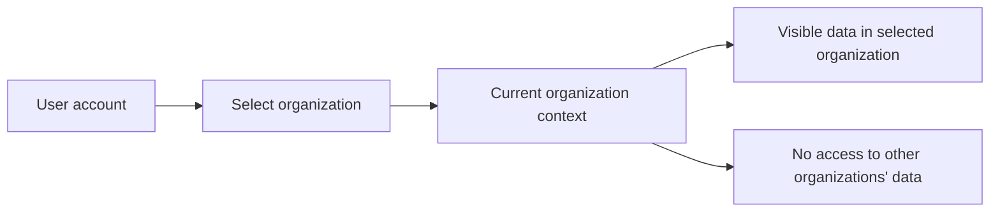
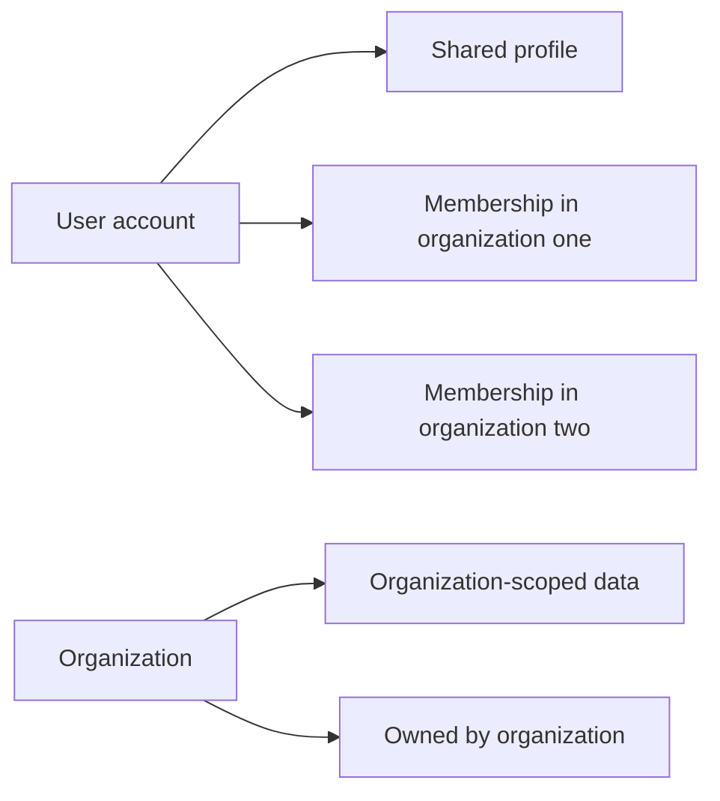
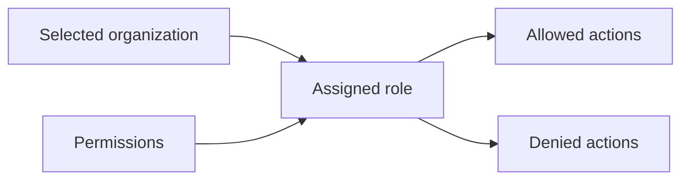
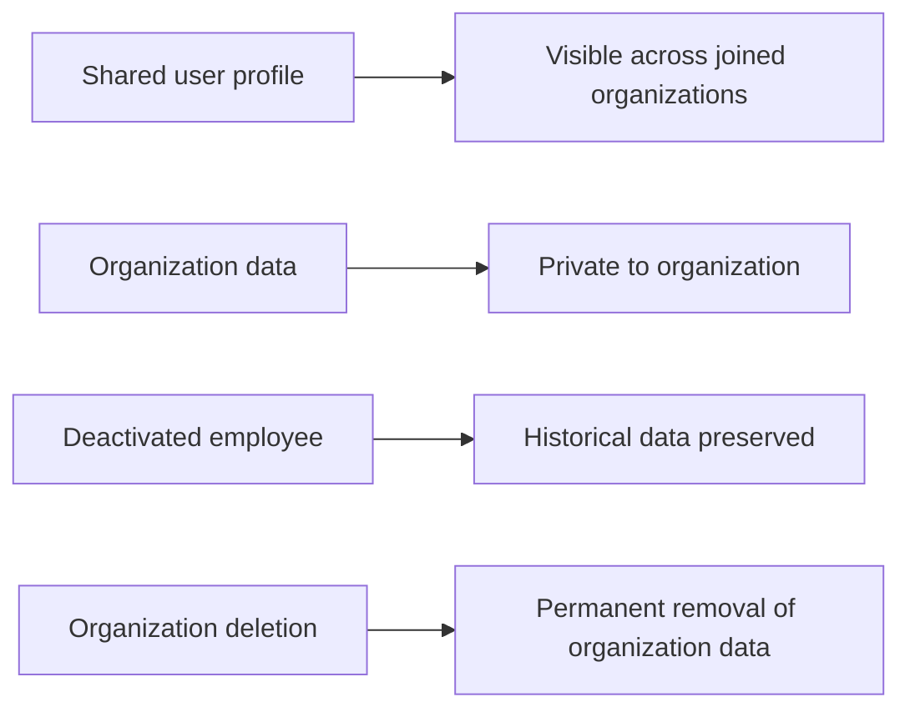
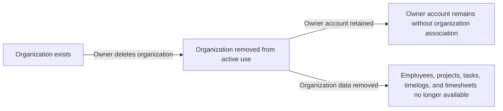
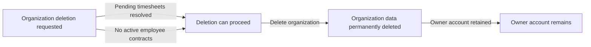
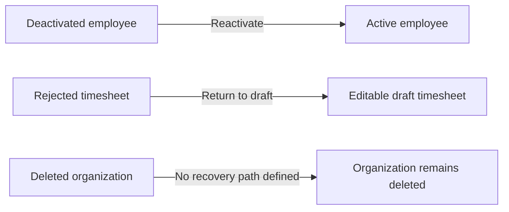
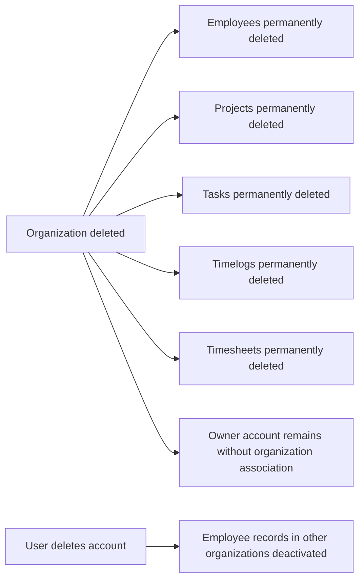

**erpHrmTime — Data ownership, privacy, retention, and recovery policies**

Data ownership, privacy, retention, and recovery policies

# Data Policies

Data ownership, privacy, retention, and recovery policies from a business perspective.

## Data Ownership and Privacy

Define who owns what data, who can access it, and privacy boundaries between users.

### Data Isolation

All data is isolated by organization. A user can only access data that belongs to the organization they have currently selected.

The system treats the selected organization as the boundary for every action the user performs. When a user belongs to multiple organizations, their view and actions remain limited to the organization they selected.

Employees in one organization cannot see data from another organization. Organization-scoped data includes employees, projects, tasks, timelogs, timesheets, departments, roles, contracts, activity logs, and reports.

If a user switches to a different organization, the system uses that organization as the only context for subsequent access and visibility.

Mermaid diagram:

### Ownership

A user account is owned by the person who created it and is shared across the organizations that person belongs to.

An organization owns its organization-scoped data and settings. That ownership includes the organization’s employees, projects, tasks, timelogs, timesheets, departments, roles, and activity log entries.

An organization owner can edit organization settings and can delete the organization only when all pending timesheets are resolved and there are no active employee contracts.

When an organization is deleted, all employees, projects, tasks, timelogs, and timesheets in that organization are permanently deleted. The owner’s account remains, but it is no longer associated with any organization.

A user can belong to multiple organizations at the same time. A user’s global profile belongs to the user account and is shared across all organizations the user belongs to.

When a user deletes their account, their employee records in other organizations are marked as deactivated. If the user is the sole owner of an organization, they must transfer ownership or delete the organization first.

Mermaid diagram:

### Access Control

Access is determined by the user’s role in the currently selected organization.

Each employee in an organization is assigned exactly one role. Built-in roles cannot be deleted, and custom roles are managed by organization owners.

The Owner role has full access to all features and can manage roles and members. The Manager role can manage employees and projects, approve timesheets, and view reports. The Employee role can track time, submit timesheets, and view own data.

Custom roles are defined by a name and a set of permissions. A custom role can be deleted only when no employees are assigned to it.

Role assignment can be changed by users with employee management permission. Users can only perform actions that are allowed by their assigned role or permissions in the selected organization.

Access to employee lists, contracts, departments, projects, tasks, timelogs, timesheets, activity logs, and reports follows the permissions defined for the organization role.

Mermaid diagram:

### Privacy

A user’s profile information is shared across all organizations the user belongs to, while organization data remains private to that organization.

The shared profile includes display name, avatar image, and phone number. Users can edit their profile, and the same profile is visible wherever the user belongs.

An employee’s historical data is preserved when the employee is deactivated. Deactivated employees cannot log time or submit timesheets, but their prior timelogs and timesheets remain available according to the organization’s access rules.

When an employee record is deleted as part of organization deletion, the organization’s employees, projects, tasks, timelogs, and timesheets are permanently removed.

Activity logs are visible in full only to users with organization management permission. Other users only see data available within their own organization context and role-based access.

Mermaid diagram:

## Data Retention and Recovery

Define what happens to deleted data, how long it is retained, and how users can recover it.

### Soft Delete

Soft delete applies to the organization deletion flow only when the organization owner chooses to delete the organization.

When an organization is deleted, the organization is treated as removed from active use, but the owner's account remains.
The owner's account is no longer associated with any organization after the deletion is completed.
All employees, projects, tasks, timelogs, and timesheets in that organization are no longer available after the organization is deleted.
Soft delete is not used for employees, projects, tasks, timelogs, or timesheets as standalone recoverable records; those records are removed as part of organization deletion.

### Retention

Deleted organization data is retained only as long as needed to complete the organization deletion outcome defined by the business rules.

When an organization is deleted, all employees, projects, tasks, timelogs, and timesheets are permanently deleted.
The system preserves the owner's account after organization deletion, but it does not preserve the deleted organization or its operational data.
Historical employee data is preserved only in the cases explicitly defined elsewhere in the requirements, such as deactivated employees whose historical timelogs and timesheets remain available while the employee record still exists.
Pending timesheets must be resolved before an organization can be deleted, which means the system does not retain unresolved timesheets through organization deletion.

### Recovery

Recovery is available only for data states that remain part of the platform after a change.

An employee who has been deactivated can be reactivated, and their historical data remains preserved.
A rejected timesheet returns to draft status and can be modified and resubmitted by the employee.
The owner's account remains after organization deletion, but the deleted organization itself is not recovered through the requirements defined for this file.
If a custom role is deleted, it can only be deleted when no employees are assigned to it; this requirement prevents deletion of an in-use role, but it does not define any restoration path.

### Permanent Deletion

Permanent deletion applies to the organization deletion outcome.

When an organization is deleted, all employees, projects, tasks, timelogs, and timesheets are permanently deleted.
The deleted organization is not retained as an active organization, and its operational data is not recoverable through the requirements in this specification.
The owner's account remains after organization deletion, but the account is disassociated from the deleted organization.
If the owner is the sole owner of an organization, the owner must transfer ownership or delete the organization before deleting the account.
When a user deletes their account, employee records in other organizations are marked as deactivated, and their historical data remains preserved.

