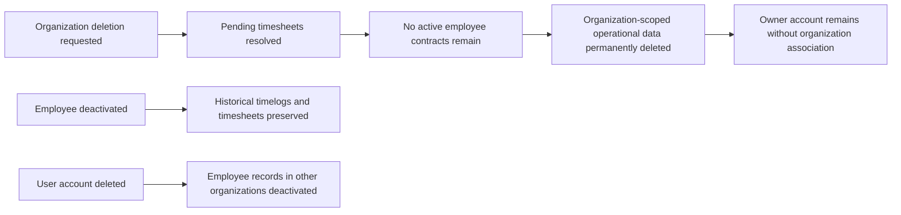
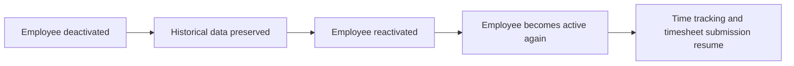

**hrmTimeTracking — Data ownership, privacy, retention, and recovery policies**

Data ownership, privacy, retention, and recovery policies

# Data Policies

Data ownership, privacy, retention, and recovery policies from a business perspective.

## Data Ownership and Privacy

Define who owns what data, who can access it, and privacy boundaries between users.

### Data Ownership Boundaries

The organization owns all organization-scoped operational data created or maintained within its context, including employees, departments, projects, tasks, timelogs, timesheets, contracts, roles, and activity records.

User profile information is owned at the user level and is shared across every organization the user belongs to. Changes to a user profile apply everywhere the profile is used.

An employee record belongs to exactly one organization. If the same person belongs to multiple organizations, each organization maintains its own employee record and role assignment for that person.

A user account may belong to multiple organizations, but organizational ownership and access are always evaluated within the selected organization context.

When an organization is deleted, the organization’s operational data is removed from that organization’s context, while the owner’s user account remains available as a user account.

### Organization Data Isolation

Data from one organization must remain isolated from all other organizations.

A user who belongs to multiple organizations can access only the data for the currently selected organization.

Employees in one organization must not be able to see employees, departments, projects, tasks, timelogs, timesheets, contracts, roles, or activity records from another organization.

An employee’s data must be visible only within the organization where that employee record exists.

A user’s actions must always be interpreted in the context of one organization at a time, and the system must keep that context separate from all other organizations the user belongs to.

Organization isolation applies to all organization-scoped information, including records created by owners, managers, and employees.

### Access Control and Privacy

Access to organization-scoped data must be limited by the user’s role and permissions in the selected organization.

A user may view only the organization data that their role allows them to view.

A user may edit only the organization data that their role allows them to edit.

A user may manage only the organization data that their role allows them to manage.

Users may view their own profile across all organizations they belong to, but they must not automatically gain access to other users’ profile information outside the permissions granted in the selected organization.

Private organization data must not be exposed outside the organization context.

The system must preserve privacy boundaries between organizations so that membership in one organization does not reveal data from another organization.

If a user account is removed from an organization, the account must no longer have access to that organization’s scoped data.

## Data Retention and Recovery

Define what happens to deleted data, how long it is retained, and how users can recover it.

### Soft-Delete and Deactivation Handling

This platform does not use soft-delete as the retention model for organization-scoped operational data. When an organization is deleted, employees, projects, tasks, timelogs, and timesheets are permanently deleted rather than retained in a recoverable deleted state.

Employees who are deactivated within an organization are not permanently deleted. Their historical timelogs and timesheets remain preserved so that past records stay available within that organization context.

When a user deletes their account, any employee records they hold in other organizations are marked as deactivated instead of being removed as historical records.

### Retention of Historical Records

Historical employee records are retained when they are needed to preserve business history. In particular, deactivated employees keep their historical timelogs and timesheets, and past contracts remain immutable historical records once they are no longer active.

Retention in this area applies only to preserving historical business data. It does not extend to deleted organization-scoped operational data, which is permanently removed when an organization is deleted.

Records that are retained for history must continue to reflect the organization in which they were created and must remain associated with that organization’s business context until that organization itself is deleted.

### Recovery of Deactivated Records

Deactivated employees can be reactivated within the organization in which they were deactivated.

Reactivation restores the employee to an active state without changing preserved historical data such as timelogs, timesheets, or past contracts.

Reactivated employees may resume time logging and timesheet submission in accordance with the rules of their organization and assigned role.

### Permanent Deletion and Recovery Limits

Organization deletion is permanent for all organization-scoped operational data. Once the organization is deleted, employees, projects, tasks, timelogs, and timesheets are removed and are not recoverable through the business process described in this specification.

Before organization deletion is allowed, all pending timesheets must be resolved and no active employee contracts may remain. These conditions ensure that deletion only occurs when the organization no longer has unresolved time or contract records.

The owner’s user account remains after the organization is deleted, but it is no longer associated with any organization. This retained account is not treated as recovered organization data.