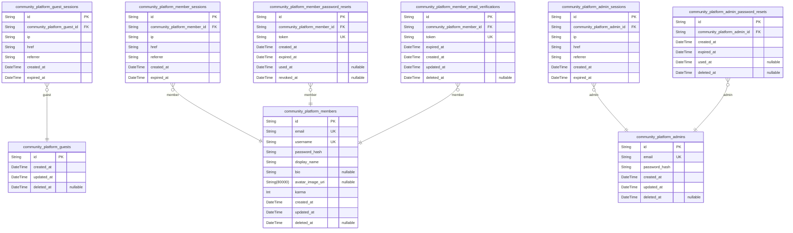
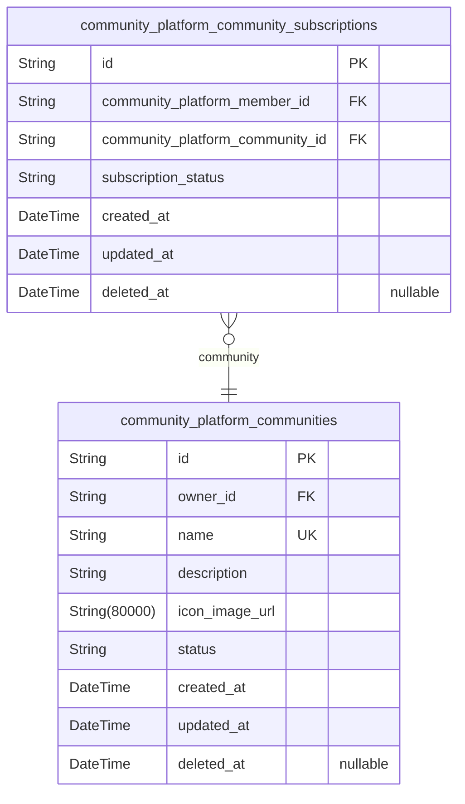
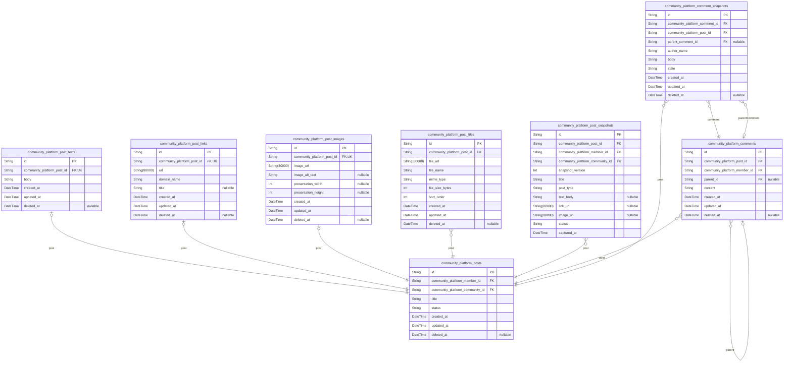
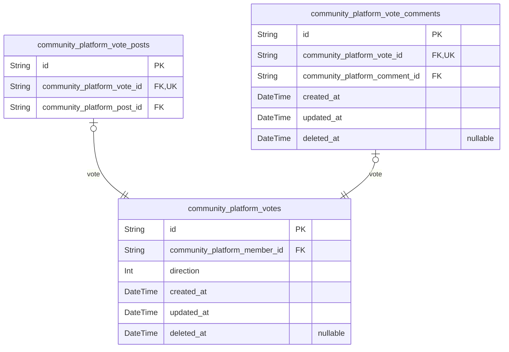
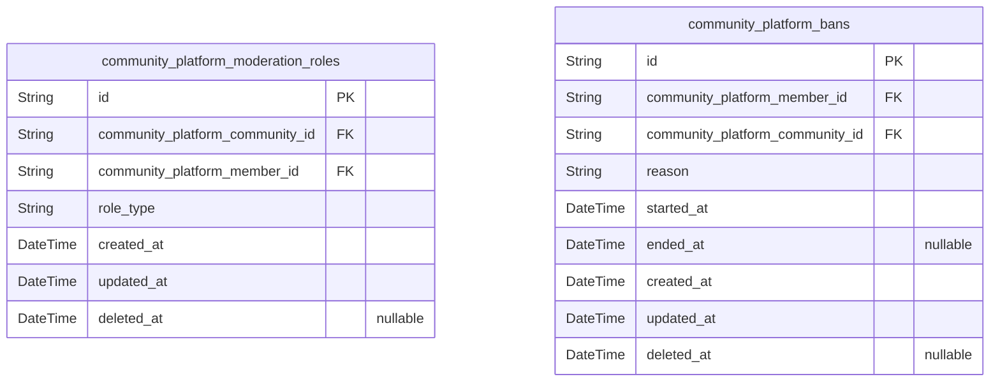
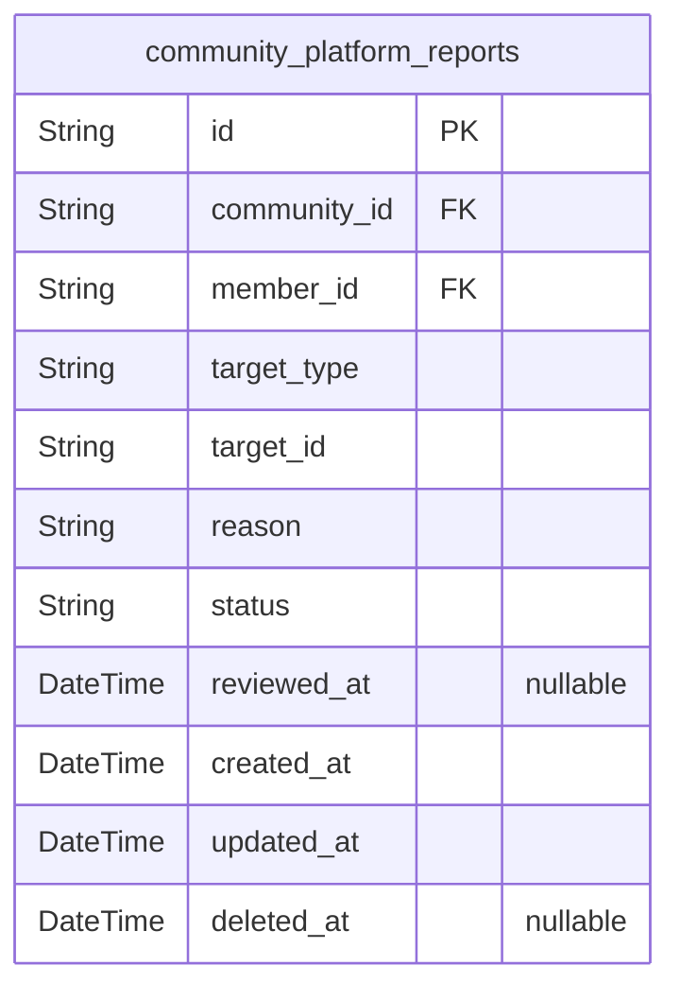

# Prisma Markdown

> Generated by [`prisma-markdown`](https://github.com/samchon/prisma-markdown)

- [Actors](#actors)
- [Communities](#communities)
- [Content](#content)
- [Votes](#votes)
- [Moderation](#moderation)
- [Reports](#reports)

## Actors

### `community_platform_guests`

Temporary guest identities used for anonymous browsing and lightweight
tracking without passwords.

This table stores the minimal persistent identity for an unauthenticated
visitor so the platform can support anonymous access patterns, continuity
across visits, and lightweight tracking without converting the visitor
into a registered member. Guest session history and connection metadata
are maintained in [community_platform_guest_sessions](#community_platform_guest_sessions), which is
modeled separately and must not be duplicated here.

Properties as follows:

- `id`: Primary Key.
- `created_at`: Timestamp when the guest identity was created.
- `updated_at`: Timestamp when the guest identity was last updated.
- `deleted_at`: Timestamp when the guest identity was soft deleted, if applicable.

### `community_platform_guest_sessions`

Temporary session records for anonymous guest access and continuity. This
table stores the minimal connection context needed to recognize a guest
session over time and enforce session expiry, while remaining separate
from all business content entities.

Each record belongs to exactly one [community_platform_guests.id](#community_platform_guests)
and is used for session tracking, security auditing, and anonymous
browsing continuity only. The table is append-oriented and should not
contain profile, content, or business-domain information.

Properties as follows:

- `id`: Primary Key.
- `community_platform_guest_id`
  > Guest actor's [community_platform_guests.id](#community_platform_guests) for this anonymous
  > session.
- `ip`: IP address observed for the guest session.
- `href`: Current page URL or route associated with the guest session context.
- `referrer`: Referrer URL or source page associated with the guest session context.
- `created_at`: Timestamp when the guest session was created.
- `expired_at`: Timestamp when the guest session expires; required for security.

### `community_platform_members`

Registered member accounts that serve as the authenticated identity
record for the platform.

This table stores the login credentials, unique username, and
profile-ready identity data needed to render and manage member accounts.
It is the parent record for member sessions, password recovery, and email
verification lifecycle tables, which are managed separately. The record
also keeps the member's karma score as a directly stored account
attribute, while the platform's social and content relationships are
handled in other domain tables such as [community_platform_posts](#community_platform_posts),
[community_platform_comments](#community_platform_comments), and {@link
community_platform_community_subscriptions}.

Properties as follows:

- `id`: Primary Key.
- `email`: Email address used for login and account communication.
- `username`
  > Unique public username chosen by the member for identity and profile
  > lookup.
- `password_hash`: Hashed password used to authenticate the member account securely.
- `display_name`: Public display name shown on the member profile and across the platform.
- `bio`: Profile biography text written by the member.
- `avatar_image_uri`: URI of the member's avatar image used on profile and content listings.
- `karma`
  > Member karma score accumulated from votes on posts and comments. This
  > value may be negative.
- `created_at`: Timestamp when the member account was created.
- `updated_at`: Timestamp when the member account was last updated.
- `deleted_at`: Timestamp when the member account was soft-deleted, if applicable.

### `community_platform_member_sessions`

JWT-backed session records for registered members. Each row represents
one authenticated member session, including connection metadata, session
creation time, and expiration time for revocation and security checks.

This table belongs to [community_platform_members](#community_platform_members) and is used to
track login activity, token lifecycle, and session invalidation without
storing any business content data.

Properties as follows:

- `id`: Primary Key.
- `community_platform_member_id`: Owning member's [community_platform_members.id](#community_platform_members).
- `ip`: IP address used when the session was created or last refreshed.
- `href`: Current request URL or entry point associated with the session activity.
- `referrer`: Referrer URL associated with the session creation context.
- `created_at`: Timestamp when the session was created.
- `expired_at`: Timestamp when the session expires and should no longer be accepted.

### `community_platform_member_password_resets`

Secure password reset tokens for [community_platform_members](#community_platform_members) that
allow authenticated account recovery when a member forgets credentials.
Each record stores a single reset request, its token, and its expiration
window for secure verification and revocation tracking.

Properties as follows:

- `id`: Primary Key.
- `community_platform_member_id`
  > Member account that requested or received the password reset token.
  > [community_platform_members.id](#community_platform_members).
- `token`
  > Cryptographically secure password reset token used to validate the
  > recovery request.
- `created_at`: Time when the password reset token record was created.
- `expired_at`
  > Time when the password reset token becomes invalid and can no longer be
  > used.
- `used_at`
  > Time when the password reset token was successfully consumed, if it has
  > been used.
- `revoked_at`
  > Time when the password reset token was invalidated before use, if
  > applicable.

### `community_platform_member_email_verifications`

Stores email verification tokens issued to {@link
community_platform_members} so the system can confirm email ownership
during registration and other email-change verification flows.

Each record represents one verification attempt with a single token, its
expiry, and lifecycle timestamps. The table is intentionally separate
from member identity data to preserve normalization and to keep
verification events auditable and short-lived.

Properties as follows:

- `id`: Primary Key.
- `community_platform_member_id`
  > Member account that owns this email verification token. {@link
  > community_platform_members.id}.
- `token`
  > Secure email verification token used to confirm the member's email
  > ownership.
- `expired_at`
  > Timestamp when this verification token becomes invalid and can no longer
  > be used.
- `created_at`: Timestamp when this verification record was created.
- `updated_at`: Timestamp when this verification record was last updated.
- `deleted_at`: Timestamp when this verification record was soft deleted, if applicable.

### `community_platform_admins`

Administrator accounts with secure authentication credentials and
elevated access identity data.

This table stores the canonical identity record for administrators who
authenticate into the platform and exercise elevated permissions. It
contains the login identifier, password hash, and actor lifecycle fields
needed for account management while keeping session and recovery records
in separate child tables such as {@link
community_platform_admin_sessions} and {@link
community_platform_admin_password_resets}.

Properties as follows:

- `id`: Primary Key.
- `email`
  > Unique email address used by the administrator to sign in and receive
  > account-related notifications.
- `password_hash`: Hashed password used to verify administrator authentication credentials.
- `created_at`: Timestamp when the administrator account was created.
- `updated_at`: Timestamp when the administrator account was last updated.
- `deleted_at`
  > Timestamp when the administrator account was soft deleted, if it has been
  > removed from active use.

### `community_platform_admin_sessions`

JWT-backed session records for administrator logins, refresh token
tracking, and session revocation auditing.

Each record belongs to exactly one administrator and stores connection
context for a single login session. The table is used to manage
authenticated access lifecycle, including session creation, expiration,
and revocation, while keeping session history separate from the
administrator account itself. Related administrator identity lives in
[community_platform_admins](#community_platform_admins).

Properties as follows:

- `id`: Primary Key.
- `community_platform_admin_id`: Belonged administrator's [community_platform_admins.id](#community_platform_admins).
- `ip`: IP address observed when the administrator session was created.
- `href`: Current request URL or application entry URL associated with the session.
- `referrer`: Referrer URL recorded when the session was created.
- `created_at`: Time when the session record was created.
- `expired_at`: Time when the session expires and should no longer be accepted.

### `community_platform_admin_password_resets`

Stores administrator password reset tokens used to recover admin access
securely under elevated security controls. Each record belongs to exactly
one administrator account and exists only for the recovery lifecycle of a
reset request.

This table is a security-oriented child entity of {@link
community_platform_admins}, allowing the system to issue, track, and
expire reset tokens without storing any authentication credentials in the
reset record itself.

Properties as follows:

- `id`: Primary Key.
- `community_platform_admin_id`
  > Administrator account that owns this password reset token. {@link
  > community_platform_admins.id}.
- `created_at`: Time when this password reset token was issued.
- `expired_at`: Time when this password reset token expires and can no longer be used.
- `used_at`
  > Time when this password reset token was consumed, if it has already been
  > used.
- `deleted_at`
  > Soft deletion timestamp for administrative cleanup or security retention
  > workflows.

## Communities

### `community_platform_communities`

Stores each community's identity, public metadata, ownership, and
lifecycle status for browsing and discovery.

A community is the top-level container for user discussions and
membership. It captures the community's public identity, its owner, and
lifecycle state so the platform can support creation, browsing, search,
moderation, and soft deletion without duplicating data into related
tables.

Subscriber counts, posts, moderation roles, bans, and reports are managed
by separate normalized tables and should be referenced through
relationships rather than stored here. Community search is driven by the
community name, while public presentation uses the name, description,
icon, and lifecycle status.

Related records include {@link
community_platform_community_subscriptions}, {@link
community_platform_posts}, [community_platform_moderation_roles](#community_platform_moderation_roles),
[community_platform_bans](#community_platform_bans), and [community_platform_reports](#community_platform_reports).

Properties as follows:

- `id`: Primary Key.
- `owner_id`: Owning member's [community_platform_members.id](#community_platform_members).
- `name`
  > Unique public community name used for browsing, discovery, and community
  > URLs.
- `description`
  > Public description text that explains the community's purpose and content
  > focus.
- `icon_image_url`
  > Public icon image URL used to represent the community in lists and detail
  > pages.
- `status`
  > Lifecycle state of the community such as active or deleted, used to
  > control visibility and retention behavior.
- `created_at`: Record creation timestamp.
- `updated_at`: Record last update timestamp.
- `deleted_at`: Soft deletion timestamp; null when the community is active.

### `community_platform_community_subscriptions`

Stores each member's membership link to a community. This record powers
community subscription state, subscriber count calculations,
subscribed-community views, and home-feed eligibility for {@link
community_platform_members} and [community_platform_communities](#community_platform_communities).

The table preserves subscription history so a member can unsubscribe
without losing the relationship record, which supports auditing and
lifecycle tracking. It is the canonical source for whether a member is
currently subscribed to a community and whether that member is eligible
to post within that community.

Properties as follows:

- `id`: Primary Key.
- `community_platform_member_id`: Subscribed member's [community_platform_members.id](#community_platform_members).
- `community_platform_community_id`: Subscribed community's [community_platform_communities.id](#community_platform_communities).
- `subscription_status`
  > Current membership state for the member-community relationship, such as
  > active or inactive.
- `created_at`: Time when the subscription record was created.
- `updated_at`: Time when the subscription record was last updated.
- `deleted_at`: Time when the subscription record was soft-deleted, if applicable.

## Content

### `community_platform_posts`

Top-level community posts created by members within communities.

This table stores only the shared post metadata that is common to all
post types, including the post title, author, community, and lifecycle
state. Type-specific payloads such as text body, destination URL, or
image reference are stored in separate child tables to keep the design
normalized and to support independent handling of post variants, edits,
and snapshots. The record also serves as the central parent for voting,
moderation, reporting, and content history relationships. {@link
community_platform_members} [community_platform_communities](#community_platform_communities)

Properties as follows:

- `id`: Primary Key.
- `community_platform_member_id`: Authoring member's [community_platform_members.id](#community_platform_members).
- `community_platform_community_id`: Owning community's [community_platform_communities.id](#community_platform_communities).
- `title`: Post title shown in feeds and detail pages.
- `status`: Lifecycle state of the post for moderation and deletion handling.
- `created_at`: Timestamp when the post was created.
- `updated_at`: Timestamp when the post was last updated.
- `deleted_at`: Timestamp when the post was soft deleted.

### `community_platform_post_texts`

Stores the text-specific payload for a community post when the post is
authored as a text post.

This table holds the full written body for the post and exists as a
normalized 1:1 subtype of [community_platform_posts](#community_platform_posts). The parent
post defines the shared post identity and lifecycle, while this table
stores only the text variant payload without duplicating post metadata.

Properties as follows:

- `id`: Primary Key.
- `community_platform_post_id`
  > Owning post's [community_platform_posts.id](#community_platform_posts). This identifies the
  > post whose content variant is a text body and enforces the 1:1 subtype
  > relationship.
- `body`: Full written content of the text post.
- `created_at`: Time when this text payload record was created.
- `updated_at`: Time when this text payload record was last updated.
- `deleted_at`: Time when this text payload record was soft deleted, if applicable.

### `community_platform_post_links`

Stores the link-specific payload for a community post that is published
as a link post. It contains the destination URL and the minimal metadata
needed to render and identify the external link without duplicating the
parent post record.

This table belongs to [community_platform_posts](#community_platform_posts) as a one-to-one
dependent record for the link post variant. It does not store score,
author, community, or other shared post metadata, because those values
belong to the parent post table.

Properties as follows:

- `id`: Primary Key.
- `community_platform_post_id`: Link post parent [community_platform_posts.id](#community_platform_posts).
- `url`: Destination URL of the link post.
- `domain_name`
  > Extracted domain name used for display and link identification, such as
  > youtube.com.
- `title`
  > Optional display title associated with the link destination when
  > available from the source or user input.
- `created_at`: Timestamp when this link payload record was created.
- `updated_at`: Timestamp when this link payload record was last updated.
- `deleted_at`: Timestamp when this link payload record was soft deleted, if applicable.

### `community_platform_post_images`

Stores the image-specific payload for a post, including the uploaded
image reference and any atomic presentation metadata.

This table is the image-post subtype of [community_platform_posts](#community_platform_posts).
Each record belongs to exactly one post and exists only when that post is
an image post. The table keeps the media reference separate from the
shared post record so the content layer remains normalized and the image
variant can be loaded, edited, or audited independently.

Properties as follows:

- `id`: Primary Key.
- `community_platform_post_id`
  > Owning post's [community_platform_posts.id](#community_platform_posts). This record stores the
  > image-specific payload for that post.
- `image_url`: URI of the uploaded image asset used by the image post.
- `image_alt_text`
  > Alternative text for the image, used for accessibility and fallback
  > presentation.
- `presentation_width`: Optional display width used by clients to render the image consistently.
- `presentation_height`: Optional display height used by clients to render the image consistently.
- `created_at`: Time when the image payload record was created.
- `updated_at`: Time when the image payload record was last updated.
- `deleted_at`: Time when the image payload record was soft deleted, if applicable.

### `community_platform_post_files`

Stores individual file attachments associated with posts. Each row
represents one atomic media or file reference linked to a single post,
supporting post images and future attachment types without embedding
arrays or JSON payloads.

This table is a dependent content-support table for {@link
community_platform_posts}. It keeps attachment data normalized so posts
can reference one or more files through separate rows, while preserving
lifecycle tracking, moderation support, and efficient retrieval of the
files attached to a given post.

Properties as follows:

- `id`: Primary Key.
- `community_platform_post_id`: Attached post's [community_platform_posts.id](#community_platform_posts).
- `file_url`: Direct URI for the stored attachment asset.
- `file_name`: Original or display file name for the attachment.
- `mime_type`: MIME type of the attached file.
- `file_size_bytes`: Size of the attachment in bytes.
- `sort_order`: Ordering value when a post has multiple attachments.
- `created_at`: Record creation timestamp.
- `updated_at`: Record update timestamp.
- `deleted_at`: Soft deletion timestamp.

### `community_platform_post_snapshots`

Immutable point-in-time snapshots of [community_platform_posts](#community_platform_posts)
used to preserve post history for edit auditing, moderation review, and
restoration support.

Each record captures the post state exactly as it existed when the
snapshot was taken, including the post's identity context, author and
community references, title, content variant details, and lifecycle
state. Snapshot rows are append-only historical records and should be
treated as immutable audit data rather than editable business entities.

Properties as follows:

- `id`: Primary Key.
- `community_platform_post_id`: Snapshot source post's [community_platform_posts.id](#community_platform_posts).
- `community_platform_member_id`
  > Post author's [community_platform_members.id](#community_platform_members) at the time the
  > snapshot was captured.
- `community_platform_community_id`
  > Community's [community_platform_communities.id](#community_platform_communities) that contained the
  > post at the time the snapshot was captured.
- `snapshot_version`
  > Monotonic snapshot version for the source post, used to order historical
  > revisions.
- `title`: Post title captured in this historical revision.
- `post_type`: Post content type captured in the snapshot, such as text, link, or image.
- `text_body`
  > Text content captured for text posts. Empty only when the post type is
  > not text.
- `link_url`
  > Destination URL captured for link posts. Empty only when the post type is
  > not link.
- `image_url`
  > Image asset URL captured for image posts. Empty only when the post type
  > is not image.
- `status`
  > Lifecycle state of the post when the snapshot was taken, such as active
  > or deleted.
- `captured_at`: Timestamp when this snapshot record was created and captured.

### `community_platform_comments`

Discussion comments and replies for community posts. Each row stores one
comment authored by a member, attached to exactly one post, with optional
recursive parent linkage for unlimited-depth replies.

This table contains only the live comment record and its direct
relationships. Content history, restoration support, and audit snapshots
are handled by [community_platform_comment_snapshots](#community_platform_comment_snapshots), while
scoring is handled separately by the voting domain. The structure
supports independent moderation, editing, deletion, and threaded
discussion browsing across the platform.

Properties as follows:

- `id`: Primary Key.
- `community_platform_post_id`
  > Target post's [community_platform_posts.id](#community_platform_posts). Each comment belongs
  > to exactly one post.
- `community_platform_member_id`
  > Author's [community_platform_members.id](#community_platform_members). Each comment is written
  > by exactly one member.
- `parent_id`
  > Parent comment's [community_platform_comments.id](#community_platform_comments). Used to model
  > nested replies with no depth limit.
- `content`: The comment body written by the author.
- `created_at`: Timestamp when the comment was created.
- `updated_at`: Timestamp when the comment was last updated.
- `deleted_at`: Timestamp when the comment was soft deleted, if applicable.

### `community_platform_comment_snapshots`

Immutable historical snapshots of [community_platform_comments](#community_platform_comments)
used to preserve comment state for edit history, moderation review, and
restoration support.

Each row captures the comment exactly as it existed at a point in time,
including its parent post and optional parent comment relationship, so
that later edits, deletions, or moderation actions do not destroy the
audit trail. This table is append-only from the application perspective
and is intended for historical inspection rather than direct user
editing.

Properties as follows:

- `id`: Primary Key.
- `community_platform_comment_id`
  > Source comment whose state was captured in this snapshot. References
  > [community_platform_comments.id](#community_platform_comments).
- `community_platform_post_id`
  > Post that contained the comment when this snapshot was captured.
  > References [community_platform_posts.id](#community_platform_posts).
- `parent_comment_id`
  > Parent comment that this comment replied to at the time of snapshot
  > capture, when the comment was nested. References {@link
  > community_platform_comments.id}.
- `author_name`
  > Captured display name or public author label of the comment at snapshot
  > time for historical readability.
- `body`
  > Captured comment content text exactly as it existed when the snapshot was
  > created.
- `state`
  > Lifecycle state of the comment at snapshot time, such as active, edited,
  > or deleted, used for audit and restoration context.
- `created_at`: Timestamp when this snapshot record was created.
- `updated_at`
  > Timestamp when this snapshot record was last updated, if any maintenance
  > or backfill occurs.
- `deleted_at`
  > Soft-delete timestamp for the snapshot record itself, if historical
  > cleanup is ever required.

## Votes

### `community_platform_votes`

Records each member's active vote on a single piece of community content,
storing the vote direction and creation time so the platform can enforce
one-vote-per-user-per-target and calculate post or comment scores
externally.

Each row represents one current vote record that is associated with
exactly one target subtype through dedicated child tables. The vote does
not store derived score totals because those are calculated from vote
records. It supports vote changes and vote removals by updating or
deleting the existing row for the same member-target pair.

Properties as follows:

- `id`: Primary Key.
- `community_platform_member_id`: Voting member's [community_platform_members.id](#community_platform_members).
- `direction`
  > Vote direction. Positive values represent upvotes and negative values
  > represent downvotes.
- `created_at`: Time when the vote was created.
- `updated_at`: Time when the vote was last updated.
- `deleted_at`: Time when the vote was soft deleted, if applicable.

### `community_platform_vote_posts`

Stores the post-target assignment for a vote so each vote on a post
remains unambiguous and separately constrained. This table links a single
vote record to a single post record, allowing the core {@link
community_platform_votes} table to manage vote direction, author
identity, and lifecycle while this table isolates the post-specific
target relationship. It exists as a supporting entity for post voting and
is not managed independently by users.

Properties as follows:

- `id`: Primary Key.
- `community_platform_vote_id`
  > Vote assignment record for [community_platform_votes.id](#community_platform_votes) that
  > identifies this vote as targeting a post.
- `community_platform_post_id`
  > Target post reference to [community_platform_posts.id](#community_platform_posts) that this
  > vote applies to.

### `community_platform_vote_comments`

Stores the comment-target assignment for a vote so each vote on a comment
remains unambiguous and separately constrained.

This table is a normalized support record in the voting domain. It links
exactly one vote to exactly one comment target, allowing the system to
enforce target-specific uniqueness while keeping the main vote record
free from polymorphic ambiguity. The relationship direction is
child-to-parent only and references [community_platform_votes.id](#community_platform_votes)
and [community_platform_comments.id](#community_platform_comments).

Properties as follows:

- `id`: Primary Key.
- `community_platform_vote_id`
  > Vote record associated with this comment target assignment. {@link
  > community_platform_votes.id}.
- `community_platform_comment_id`
  > Comment being targeted by the vote. {@link
  > community_platform_comments.id}.
- `created_at`: Timestamp when this vote-to-comment assignment was created.
- `updated_at`: Timestamp when this vote-to-comment assignment was last updated.
- `deleted_at`
  > Timestamp when this vote-to-comment assignment was soft deleted, if
  > applicable.

## Moderation

### `community_platform_moderation_roles`

Community-scoped moderation assignments that grant owner or moderator
authority to a member within a specific community.

This table stores the authorization relationship between a community and
the members who can manage moderation actions there. It supports the
owner-and-moderator hierarchy used to enforce moderation permissions,
including who can add or remove moderators and who can perform
community-level enforcement tasks. Historical removals are preserved
through soft deletion so moderation changes can be audited over time.

Properties as follows:

- `id`: Primary Key.
- `community_platform_community_id`
  > Community that this moderation assignment belongs to. {@link
  > community_platform_communities.id}.
- `community_platform_member_id`
  > Member who receives moderation authority in the community. {@link
  > community_platform_members.id}.
- `role_type`
  > Moderation authority level assigned to the member within the community,
  > such as owner or moderator.
- `created_at`: Time when this moderation role assignment was created.
- `updated_at`: Time when this moderation role assignment was last updated.
- `deleted_at`
  > Time when this moderation role assignment was soft-deleted, if it was
  > removed while preserving history.

### `community_platform_bans`

Community-scoped ban records that restrict a member from posting or
commenting in a specific community while preserving read-only access to
content.

Each record stores the enforcement target, the affected community, the
moderation reason, and the ban lifecycle timestamps so the platform can
audit active, expired, and lifted bans. The record is intentionally kept
normalized and does not duplicate community or member profile data. It
relates to [community_platform_members](#community_platform_members) and {@link
community_platform_communities}.

Properties as follows:

- `id`: Primary Key.
- `community_platform_member_id`
  > Affected member's [community_platform_members.id](#community_platform_members) who is restricted
  > by this ban.
- `community_platform_community_id`
  > Target community's [community_platform_communities.id](#community_platform_communities) where the
  > ban is enforced.
- `reason`: Moderation reason explaining why the member was banned from the community.
- `started_at`: Timestamp when the ban became effective.
- `ended_at`: Timestamp when the ban ends naturally, if the ban is temporary.
- `created_at`: Timestamp when the ban record was created.
- `updated_at`: Timestamp when the ban record was last updated.
- `deleted_at`
  > Timestamp when the ban record was soft deleted, if it was revoked or
  > removed from active enforcement.

## Reports

### `community_platform_reports`

Stores each user-submitted moderation report against a single post or
comment within a community, including the reporting user, the reported
content reference, the reason text, and the moderation review state.

This table is the authoritative record for the report submission and
review lifecycle. It connects the report to the reporting member and the
owning community, while preserving the moderation decision for downstream
review and enforcement workflows. The reported content itself remains in
the content domain, and this table only stores the moderation case record
and its status.

Properties as follows:

- `id`: Primary Key.
- `community_id`
  > Owning community's [community_platform_communities.id](#community_platform_communities) for
  > moderator review and scope control.
- `member_id`
  > Reporting member's [community_platform_members.id](#community_platform_members) who submitted
  > this report.
- `target_type`
  > Type of reported content, such as post or comment, to indicate which
  > content table the report applies to.
- `target_id`: Identifier of the reported post or comment record in the content domain.
- `reason`: User-provided explanation describing why the content was reported.
- `status`
  > Current moderation review state of the report, such as pending, approved,
  > or dismissed.
- `reviewed_at`
  > Timestamp when the report was reviewed by moderation staff, if a review
  > decision has been made.
- `created_at`: Timestamp when the report was created.
- `updated_at`: Timestamp when the report was last updated.
- `deleted_at`: Timestamp when the report was soft deleted, if applicable.
