**communityPlatform — Actor definitions, permission matrix, authentication, session, account lifecycle**

Actor definitions, permission matrix, authentication, session, account lifecycle

# Actor Definitions

Define all user actor types with their identity, permissions, and access boundaries.

## guest Actor

A guest is a visitor who has not signed in to the platform. This actor can browse public content and explore the platform without an account. Guests do not have access to member-only actions that require a logged-in session. They can view public community information and public post feeds, but they cannot create content or interact as an authenticated user. Any action that depends on an owned account, such as subscribing or voting, is outside the guest's access boundary. If a guest tries to use a protected area, the platform should treat the request as unauthenticated and keep the guest in read-only mode. Guest access is limited to what the platform exposes publicly.

### Unauthenticated Visitor

A guest is an unauthenticated visitor who has not signed in to the platform.
A guest may access content that the platform exposes publicly.
A guest may browse the public community list.
A guest may browse public post feeds.
A guest may view public community information and public posts without creating an account.
A guest remains outside the signed-in user experience until they complete authentication.
A guest does not gain any member-only access by navigating through public pages.

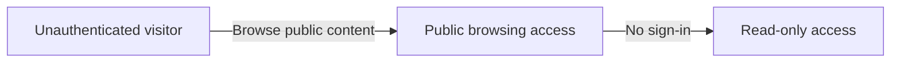

### Public Browsing Access

Public browsing access means the guest can look at information that is available without signing in.
Public browsing includes the public community list and public post feeds.
Public browsing allows the guest to view content, but not to perform member-only actions.
Public browsing does not grant access to actions that depend on a signed-in account.
Public browsing ends at the point where the platform requires a logged-in user.
A guest can continue browsing while remaining unauthenticated.

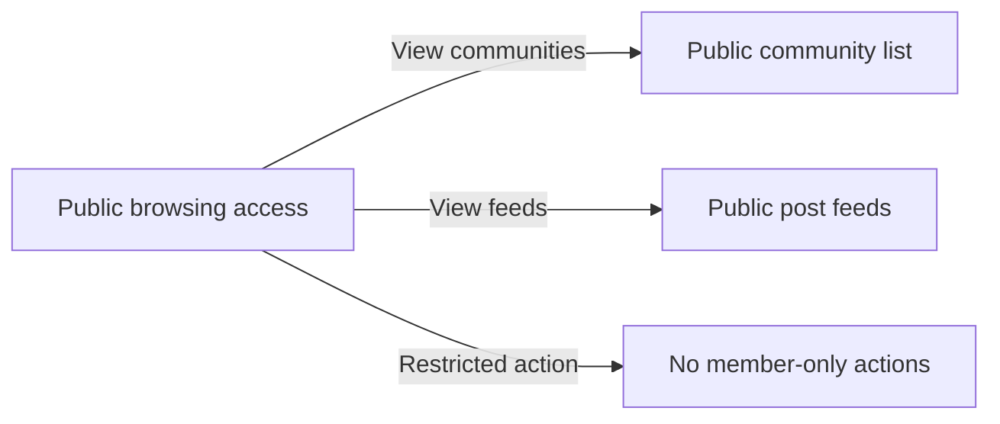

### Read-Only Access Boundary

A guest has read-only access across the areas that are available to unauthenticated visitors.
Read-only access means the guest can view public content but cannot perform actions reserved for logged-in users.
Read-only access includes the logged-out access boundary for the platform.
The platform must treat a guest as outside member-only areas until the guest signs in.
If a guest reaches a protected area, the guest does not gain access to the protected action.
If a guest attempts a member-only action, the platform must treat the request as unauthenticated.

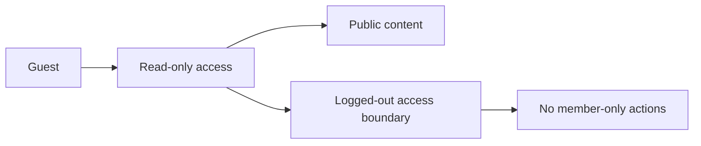

### Unauthenticated Request Handling

When the platform receives a request from a guest for a protected action, it must handle the request as unauthenticated.
When a request is unauthenticated, the platform must keep the guest outside member-only actions.
When a guest requests an action that requires a signed-in account, the platform must not treat the guest as a member.
When a guest attempts to use a protected area, the platform must preserve read-only access.
When the platform handles an unauthenticated request, it must continue to allow public browsing access where applicable.
Unauthenticated request handling must not change the guest into a signed-in user.

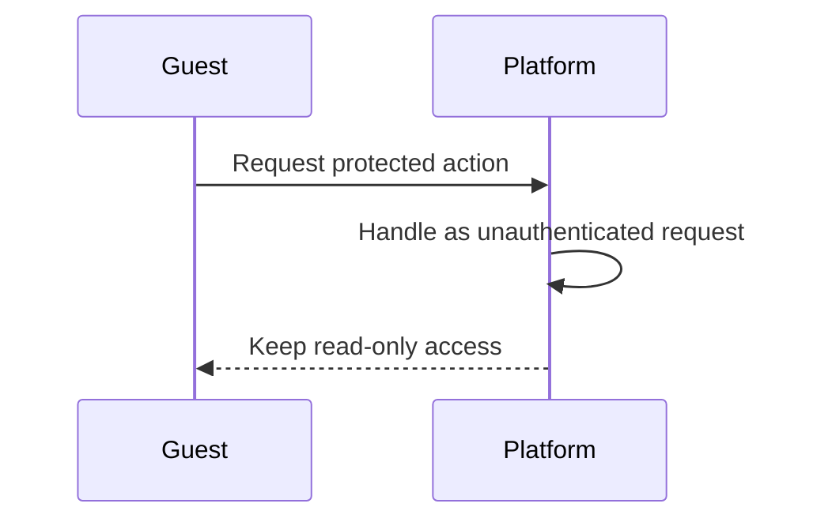

## member Actor

A member is a user who has signed in with an account. This actor represents an authenticated person with access to the platform's member-only areas. Members can use the platform as logged-in users rather than as visitors, so they have broader access than guests. Their access includes actions that depend on an active account and authenticated session. Members are still limited to the permissions granted to ordinary users and do not automatically have moderation authority. The platform should recognize a member as the owner of their own activity and personal account state. When a member is not signed in, they should no longer be treated as a member actor and should fall back to guest access.

### Member Actor

A member is a signed-in user who is currently operating through an authenticated session. This actor represents a logged-in person with access to member-only areas of the platform.

A member can use the platform with ordinary user permissions, which are the standard permissions available to non-moderator users. A member is treated as the owner of their own personal account access and personal activity while signed in.

A member is not a moderator by default. Membership alone does not grant community moderation authority or any elevated community role.

When the authenticated session is no longer active, the person is no longer treated as a member and is handled as a guest instead.

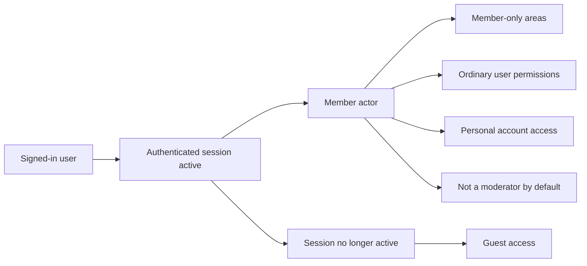

## admin Actor

An admin is a user who has been granted elevated authority within a community. This actor goes beyond ordinary member access and can manage the community according to moderation rules. Admin status is not implied for every signed-in user; it must be assigned separately. The admin actor has broader permissions than a regular member and can carry out moderation-level actions within the community scope. Even with elevated authority, an admin is still bound to the community where the role applies and does not gain universal control across the entire platform. The platform should distinguish admin access from the creator's highest authority and from ordinary moderator access when evaluating permissions. If an admin is no longer assigned that role, they should lose the elevated access tied to it.

### Admin Actor

An admin is a community-scoped actor with elevated community authority that is granted through an assigned moderator role. This actor has broader access than a regular member and is recognized as part of the community’s moderation structure rather than as an ordinary participant.

The admin’s authority is role-based. The system treats admin access as active only while the assigned role remains in effect for that community. If the role is removed, the elevated community authority tied to that role is no longer available.

The admin role applies only within the community where it is assigned. The actor has moderation access for that community, but that access does not extend to unrelated communities and does not become universal platform control.

The admin actor is distinct from a regular member because the role grants access needed for community-level management within its scope. At the same time, the role remains bounded by the community context and does not make the actor a platform-wide authority.

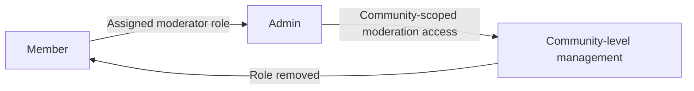

#### Elevated community authority
The system recognizes an admin as having elevated authority within the specific community where the role is assigned. This authority is greater than member access and is used for moderation-level community management.

#### Assigned moderator role
The admin status depends on an assigned moderator role. The system treats the role assignment as the basis for the actor’s elevated access, and the access no longer applies when the role is no longer assigned.

#### Scoped authority
The admin’s authority is limited to the community where the role applies. The system must not treat the admin as having authority outside that community.

#### Broader than member access
The admin actor has permissions that exceed ordinary member access within the assigned community. The system must distinguish this elevated access from standard member permissions when evaluating community actions.

#### Moderation access
The admin actor has moderation access for the assigned community. This access supports community-level management and is available only while the role remains assigned.

#### Not universal platform control
The system must not interpret admin status as control over the entire platform. The admin actor’s authority remains community-specific and does not override permissions outside the assigned community.

# Authentication Flows

Registration, login, logout, and session management from a user perspective.

## Registration and Login

Define user registration and login flows including validation and error handling.

### Registration

Users can register a new account by providing an email address, a password, and a unique username.
The system shall treat registration as the starting point for creating a new member identity in the platform.
The system shall require the username to be unique across the platform.
The system shall associate the new account with the provided email address and username.
The system shall create the account only when the registration information is valid.
If the email address is already associated with an existing account, the registration is rejected.
If the username is already in use, the registration is rejected.
If required registration information is missing, the registration is rejected.

Mermaid diagram:
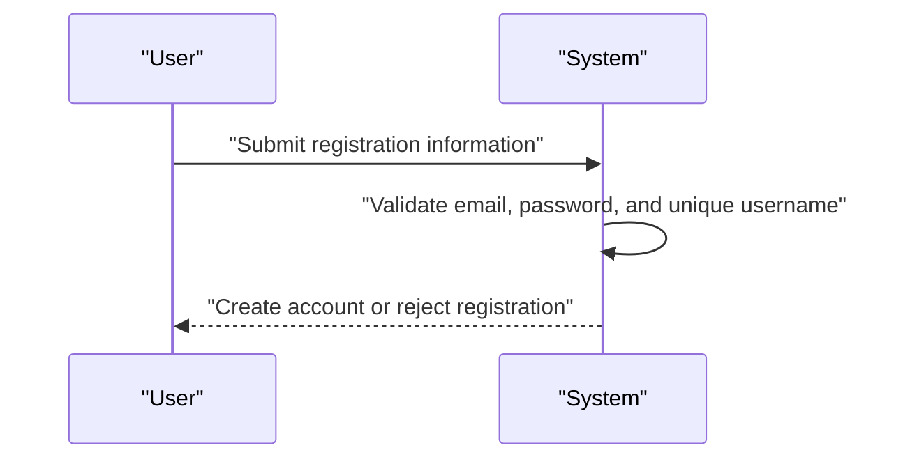

### Login

Users can log in by providing their email address and password.
The system shall authenticate the user by checking that the submitted credentials match an existing account.
A successful login shall identify the user as an authenticated member.
If the email address does not match any account, the login is rejected.
If the password does not match the account, the login is rejected.
If the login information is missing or incomplete, the login is rejected.

Mermaid diagram:
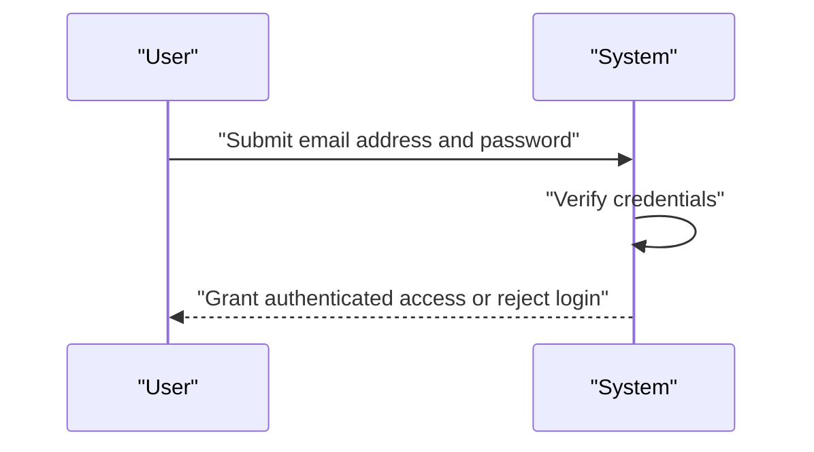

### Authentication

Authentication is the platform's proof that a person has successfully identified themselves as the owner of an account.
The system shall recognize authenticated members as eligible for member-only access.
The system shall treat logged-out visitors as unauthenticated.
The system shall require authentication for areas and actions that are available only to logged-in users.
The system shall not treat registration information alone as authentication.
If a user is not authenticated, access to member-only areas is rejected.

Mermaid diagram:
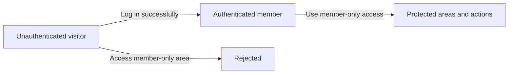

## Session and Logout

Define session behavior and logout from a user perspective.

### Session

Members have an authenticated session after signing in with their email and password.
A logged-in session allows the member to use features that are available only to signed-in users.
A member remains logged in until the session is ended by logging out.
A logged-in member can use the platform only within the access level granted by their current authenticated session.

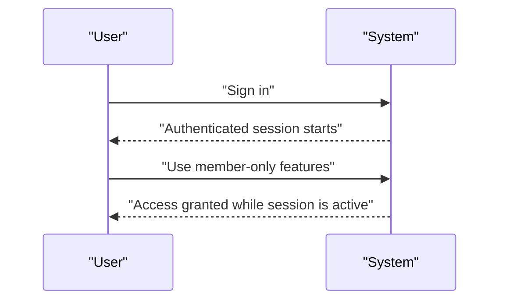

### Logout

A signed-in member can end their current session by logging out.
When a member logs out, the authenticated session is ended.
After logout, the former member is treated as a logged-out visitor until they sign in again.
After logout, member-only access is no longer available through the ended session.
Logging out affects only the current session and does not remove the account.

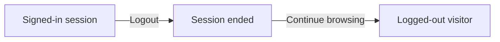

### Account Security

A user account is identified by email, password, and unique username.
A member can change their password while keeping the same account.
A member can delete their account.
When an account is deleted, the user's posts and comments are also deleted.
A deleted account can no longer be used to sign in.
Account security behavior in this section is limited to session access, password change, and account deletion as described in the user requirements.

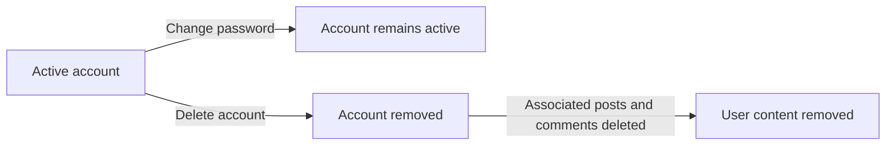

# Account Lifecycle

Account creation, deletion, and password management.

## Account Management

Define how users create accounts, delete accounts, and change passwords.

### Account Creation

Users can create an account by providing an email address, a password, and a unique username.
The system treats account creation as the entry point for becoming a registered user.
If the email address is already associated with an existing account, the account creation request is rejected.
If the chosen username is already in use, the account creation request is rejected.
A successfully created account becomes available for signed-in access after registration is completed.

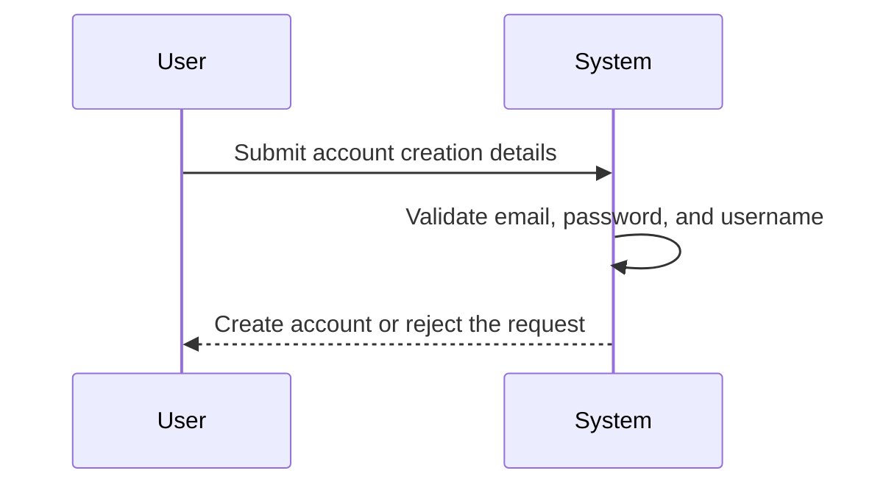

### Account Deletion

Users can delete their own account.
When an account is deleted, the system also deletes all posts and comments created by that user.
Account deletion removes the user from the platform as an active user account.
If the request is made for an account that does not belong to the requesting user, the request is rejected.
After account deletion, the deleted account is no longer available for sign-in or profile access.

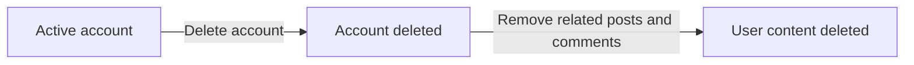

### Password Change

Users can change the password for their own account.
Password change is available only to the account owner.
After a password change is completed, the updated password is the one used for future sign-in.
If the requested account does not belong to the user making the request, the request is rejected.
If the user submits an invalid password change request, the password remains unchanged.

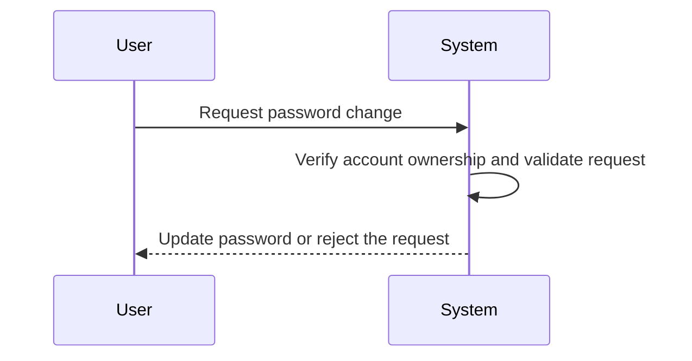