**communityPlatform — Business concepts, relationships, and states from user perspective**

Business concepts, relationships, and states from user perspective

# Domain Concepts

Describe what each concept means in the business domain and its key attributes.

## User Concept

A user represents a person who participates in the community platform with a unique identity. The user concept centers on sign-in identity, profile identity, and participation across communities. A user is identified in the business domain by email, username, and password, which together define access and account ownership. The username is a public-facing identity and must be unique within the platform. The user also carries profile information that can be shown to others, including display name, bio text, and avatar image. A user can have a karma score that reflects the community’s response to that user’s posts and comments. The user concept also serves as the owner of content such as posts, comments, community memberships, moderation roles, and reports they create. When a user account is removed, the business rules treat the user as the source of their related content and participation history. The concept is broader than login credentials alone because it includes public presence, reputation, and ownership across the platform.

### User Concept

A user is the central participant in the community platform. The concept represents a person’s business identity across sign-in, public presence, reputation, and participation. A user is distinct from the content they create and is treated as the source of their profile, activity, and ownership relationships within the platform.

A user’s domain identity is based on their account credentials and public identity. The account credentials consist of email and password, and the username is a unique public identifier for the user across the platform. The username identifies the user in a way that is separate from the email address and is part of the user’s lasting identity on the platform.

A user’s profile identity is the public-facing presentation of that user. It includes a display name, bio text, and avatar image. The display name is the name shown to other users in profile and content contexts. The bio text is a short self-description. The avatar image is the user’s visual profile representation.

A user has a karma score that represents the community’s response to that user’s posts and comments. Karma is a single score associated with the user and can be positive, zero, or negative. It reflects accumulated vote outcomes across the user’s content.

A user is the owner or creator of content and participation records associated with that user. This includes the posts and comments the user creates, the communities the user participates in through subscription, and other related participation history defined elsewhere in the domain model. The user concept therefore covers both identity and ownership across the platform.

#### Domain Identity
The user’s domain identity combines the information that establishes who the person is within the platform. Email and password form the account credentials used for access, while the username provides the unique public identity used to distinguish one user from another. Together, these attributes make the user identifiable both privately for access and publicly for community interaction.

#### Profile Identity
The user’s profile identity is the public description of the user shown to others. Display name, bio text, and avatar image define how the user appears across the platform. The profile identity exists separately from the sign-in identity so that the user can have a public persona that is not limited to account credentials.

#### Karma Score
Karma score is the user’s platform reputation score. It is a single number associated with the user and is used to reflect the response to the user’s contributions. The score can move upward or downward as the user’s posts and comments receive community voting outcomes, and it is allowed to be negative.

#### Content Ownership
The user concept includes ownership of the content and participation records that originate from that user. A user is the source of their created posts and comments, and the user is also associated with their profile and participation history. When the platform refers to content ownership, the user is the business entity that establishes who created or controls the user-generated record.

#### Community Participation
The user participates in communities as an active member of the platform. Participation includes joining communities through subscription, contributing posts and comments within those communities, and engaging with other users’ content. The user concept therefore connects personal identity to ongoing involvement in one or more communities.

## Community Concept

A community represents a named discussion space where users gather around a shared topic. It is a core organizing concept for posts, subscriptions, moderation, and browsing across the platform. Each community has a unique name that distinguishes it from all other communities. A community also includes descriptive text that explains its purpose and an icon image that helps identify it visually. The creator of a community becomes its owner in the business domain. Communities maintain a subscriber count that reflects how many users have joined that space. A community can also have moderators who help manage activity inside it. The concept is important because many other business objects are tied to a specific community, including posts, bans, and reports. Community identity is therefore both public-facing and operationally central to platform participation.

### Community Concept

A community is the platform’s primary discussion space for people who gather around a shared topic or interest. It serves as the public organizing unit for posts, subscriptions, moderation, and browsing, and it gives each discussion space a clear identity within the platform.

A community has a distinct business identity made up of its unique name, description text, and icon image. The unique name is the community’s public identifier and distinguishes it from every other community on the platform. The description text explains what the community is about, and the icon image helps visually identify it.

A community is owned by the user who created it. Creator ownership means the creator becomes the community owner immediately when the community is established, and that ownership defines the community’s highest authority within the community domain.

A community maintains a subscriber count that reflects how many users have joined that community. The subscriber count is part of the community’s public identity and is used to show the size of the community audience.

A community can have moderators in addition to its owner. Moderator presence is part of the community’s domain identity because it indicates that the community may be managed by multiple authorized users, with the owner remaining the highest authority.

A community is included in the platform’s public community listing so that users can browse available discussion spaces. This listing presents communities as discoverable public spaces rather than private containers, and it is one of the ways the community concept is surfaced across the platform.

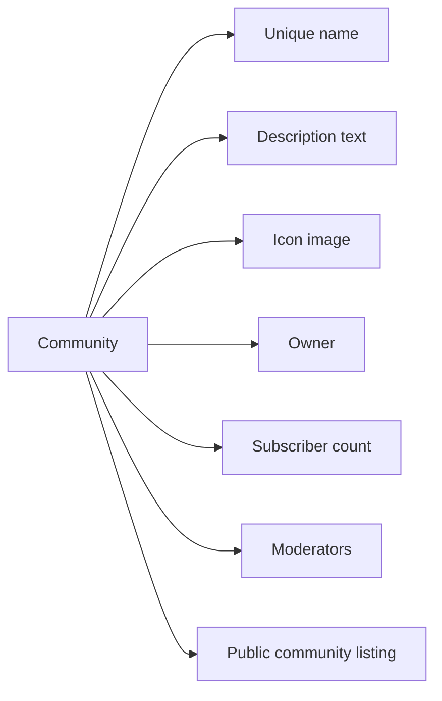

## Post Concept

A post represents a piece of content shared inside a community. It is the main content unit that users create and consume across feeds and community pages. Every post has a title, which gives the post a visible topic or headline. A post also belongs to one of three content styles: text, link, or image. Text posts carry written content, link posts point to a URL, and image posts present an uploaded image as the main body of the post. The post concept includes the author who created it, the community where it appears, and its score-related signals such as vote score and comment count. A post also has a creation moment that supports time-based display and sorting. In the business domain, a post can be viewed as a standalone content item and as a parent object for comments and voting activity. Its type and content style define how the post is displayed to other users. The concept captures both the subject matter and the form of user-generated content within a community.

### Post Concept

A post is the primary content item shared within a community. It represents a piece of user-generated content that other users can discover in feeds, view on a community page, and interact with through comments and voting.

A post carries the core meaning of the contribution itself, including the subject matter, the form of the content, and the context of where it belongs. In the business domain, the post is the main unit of published content rather than a supporting detail of another record.

A post is defined by a title, which serves as its visible headline and helps identify the subject of the content. The title is part of how the post is recognized when shown in lists, feeds, and single-post views.

A post belongs to one of three content styles: text post, link post, or image post. A text post uses written content as its main body. A link post uses URL content as its main body. An image post uses an uploaded image as its main body.

The post concept includes author association, meaning every post is tied to the user who created it. It also includes community placement, meaning every post belongs to one specific community and is presented in the context of that community.

A post also carries vote score, comment count, and created time as important business-facing signals. Vote score expresses how the community has rated the post overall. Comment count expresses how much discussion the post has generated. Created time identifies when the post was first published and supports time-based display and ordering.

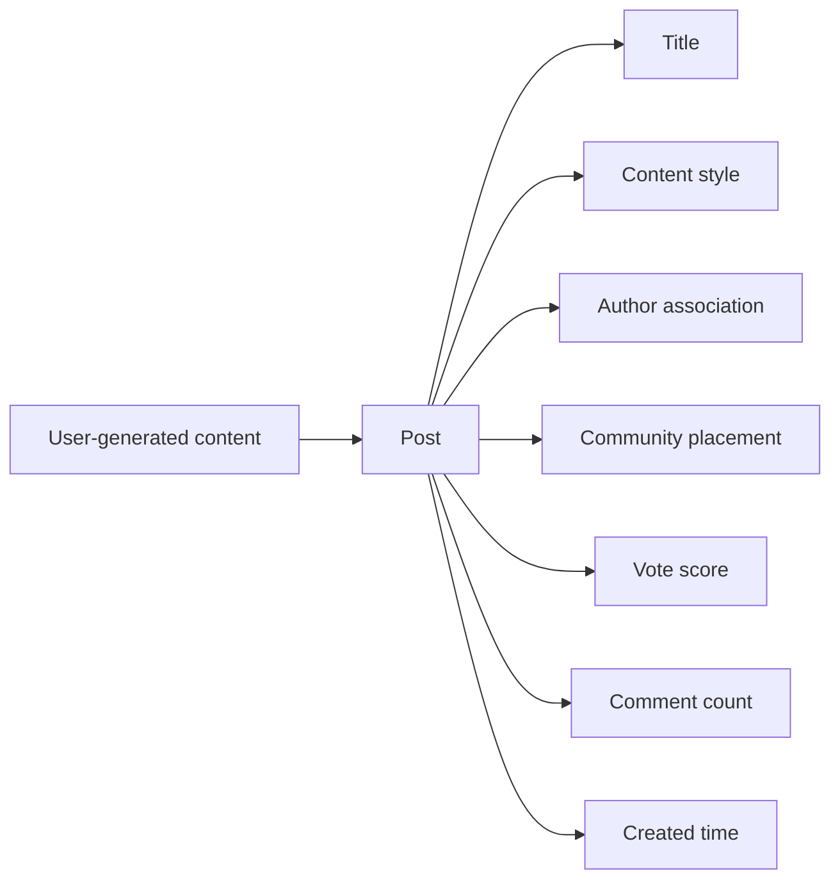

### Post Content Styles

A text post is a post whose main body is written content. The written content is the substance of the post and is what readers consume when the post is presented as text.

A link post is a post whose main body is URL content. The URL is the substance of the post and indicates that the post is representing an external destination.

An image post is a post whose main body is an uploaded image. The uploaded image is the substance of the post and is what readers see as the main content of the post.

These three post styles describe the business meaning of how a post is presented, while still remaining part of the same post concept. A post always belongs to exactly one of these styles.

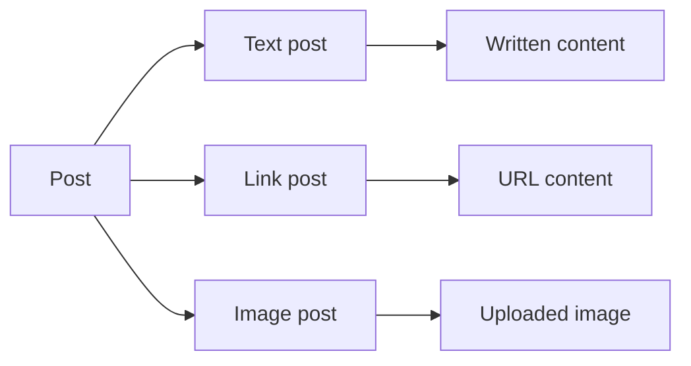

### Post Engagement Signals

Vote score is the overall rating signal for a post. It reflects the combined effect of positive and negative user votes and can move up or down as users react to the post.

Comment count is the total number of comments associated with a post. It represents the amount of discussion attached to the post rather than the number of people who viewed it.

Created time is the moment the post entered the community as published content. It provides a business reference point for showing recency and for placing the post in time-based views.

These engagement signals describe the post as an active content item in the platform rather than only as static text, a link, or an image.

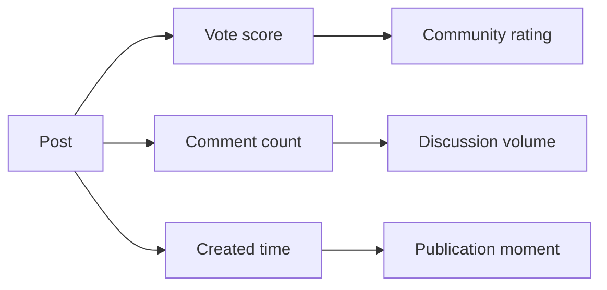

## Comment Concept

A comment represents a user’s response attached to a post or another comment. It is the platform’s primary discussion unit for conversation and nested replies. A comment has written content that expresses the user’s message. Each comment belongs to an author and carries a vote score that reflects community feedback. A comment also includes a creation time so it can be ordered and shown with time context. Comments can appear as top-level responses or as replies inside a nested thread structure. The business concept includes both direct replies and deeper reply chains, with no fixed depth limit. A comment is distinct from a post because it is always part of a discussion thread rather than a standalone feed item. It also functions as a content target for moderation, reporting, and voting. The concept emphasizes conversation, authorship, and threaded participation within a post.

### Comment as a Discussion Unit

A comment is the platform’s business discussion unit for conversation around a post. It represents a discussion response that lets users take part in a post conversation without creating a standalone content item. A comment exists to carry written participation in a thread and to make discussion within a post easier to follow. It is distinct from a post because it belongs inside a conversation rather than serving as the main item of that conversation. The business meaning of a comment is therefore tied to threaded discussion, where users exchange responses in context around the original post.

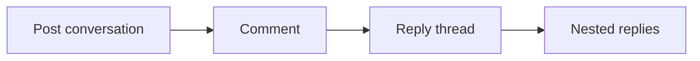

### Comment Content and Author Identity

A comment includes written content that contains the user’s message in the discussion. The comment content is the text that other users read as the response within the thread. Each comment is associated with an author identity so the conversation can show who wrote the comment. The author identity defines the user responsible for the comment and links the comment to its creator within the discussion context. This association is part of the comment’s business meaning and supports understanding of authorship in a post conversation.

### Comment Voting and Created Time

A comment has a vote score that reflects community feedback on the discussion response. The vote score is a single numeric value for the comment and may be negative when more negative feedback is received than positive feedback. A comment also has a created time so the platform can show when the discussion response was written and can place it in time-based order within a thread. The vote score and created time are core descriptive properties of the comment concept and help users understand both its reception and its position in the conversation.

### Nested Reply Structure

A comment can appear as a top-level response or as a reply to another comment. When a comment is a reply, it becomes part of a reply thread under the comment it answers. Reply threads can continue into nested replies, which means a conversation can branch into deeper layers of discussion without a fixed depth limit. This nested structure defines threaded discussion in the platform and allows a post conversation to contain multiple levels of discussion response while still keeping each comment tied to the same broader conversation.

## CommunitySubscription Concept

A community subscription represents the relationship between a user and a community that the user has joined. It is the business concept that marks a user as part of a community’s audience and eligible participant group. The subscription carries a subscribed time that indicates when the relationship began. It also includes a status that reflects the current state of the membership relationship. This concept matters because a user’s subscribed communities shape what they can see and where they can participate. Subscription is separate from ownership and moderation, since a user can be a subscriber without being a community owner or moderator. The subscriber count shown for a community is tied to these subscription relationships. A subscription is therefore both a membership record and a visibility signal within the platform. It helps define the user’s active community connections across the system.

### Community Subscription

A community subscription is the business concept that represents a joined community relationship between a user and a community. It describes the user-community connection that places the user in the community’s audience and active participation group. The subscription is what marks a user as part of a community’s membership relationship, even when the user is not the community owner or a moderator. It exists so the platform can recognize which communities the user has joined and which communities count the user as an active member for community participation and access purposes.

The subscription is distinct from ownership and moderation. A user may be subscribed to a community without having any authority over it. A community may therefore have subscribers, an owner, and moderators as separate business roles.

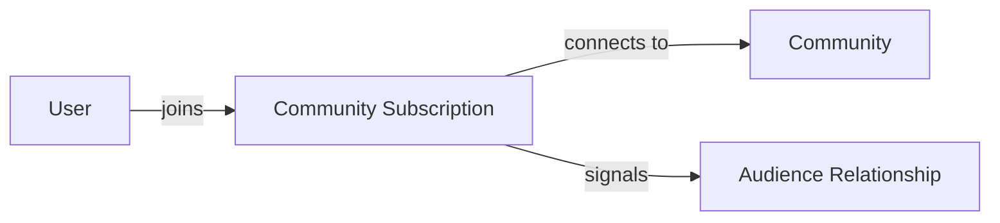

### Subscription Time and Status

A community subscription includes the subscribed time, which records when the user-community connection began. The subscribed time is part of the membership relationship and identifies when the user joined the community.

A community subscription also includes a subscription status that reflects the current state of the relationship. The status shows whether the user’s membership relationship is currently active or in another current state defined for subscriptions. The status is what the platform uses to describe the present condition of the joined community relationship, separate from the original joined time.

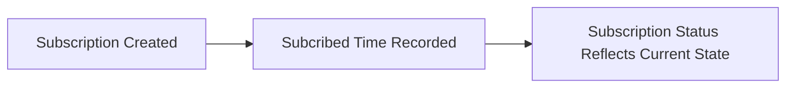

### Subscriber Count Meaning

A community’s subscriber count is the number of community subscription relationships associated with that community. It is a community-level measure that reflects how many users have joined the community.

The subscriber count is part of the community’s public membership picture and is tied to the community membership relationship rather than to ownership, moderation, or content creation. It summarizes the size of the community’s audience relationship at a point in time.

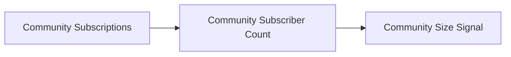

## Vote Concept

A vote represents a user’s rating signal on a post or comment. It is a core reputation concept that influences visible scores across the platform. A vote has a type that expresses whether the user supports or opposes the content. The vote also includes a creation time so the system can understand when the rating relationship was established. Votes are always connected to a single user and a single piece of content, making them a one-to-one expression of opinion on that item. The business meaning of a vote is not just approval or disapproval, but also contribution to the item’s overall score. Votes can affect how content is perceived in feeds, discussion threads, and user reputation. The concept applies consistently to both posts and comments, even though the content type differs. It is also important that vote outcomes can produce negative or positive score movement in the domain. The vote concept captures the user’s expressed stance on content within the community platform.

### Vote Concept

The vote concept represents a user’s rating signal on content within the community platform. A vote expresses a user’s opinion about a specific post or comment and records whether that opinion supports the content or opposes it.

A vote has a vote type that identifies it as a positive vote or a negative vote. A positive vote represents support for the content, and a negative vote represents opposition to the content. The vote type is the domain’s way of capturing user opinion in a consistent form across posts and comments.

A vote includes a creation time that shows when the opinion was recorded in the system. This creation time is part of the vote’s identity in the business sense because it marks when the user’s rating signal became active.

Each vote is tied to one user and one item of content. The platform allows one vote per item per user, so a user’s opinion on a specific post or comment is represented by a single vote at a time.

The business meaning of a vote is that it contributes to the content score of the item being rated. The content score reflects the combined effect of positive votes and negative votes on that post or comment. Positive votes increase the score, and negative votes decrease the score. Because the score can move above or below zero, a vote can contribute to either a positive or negative content score.

The vote concept applies equally to post voting and comment voting. In both cases, the vote is the same business object: a user’s rating signal that records opinion, affects content score, and is associated with a single content item.

## ModerationRole Concept

A moderation role represents a user’s authority level within a specific community. It defines who can help manage community content and membership behavior. The role is tied to a community and to a user, so moderation authority is always contextual rather than platform-wide. The role includes a role type that distinguishes the level of authority, such as owner or moderator. It also includes an assigned time that shows when the role was given. The community creator starts as the owner, which is the highest authority in that community. Other moderators can exist alongside the owner, creating a hierarchy of responsibility inside the community. The concept is important because moderation power affects how community rules are enforced and how reports and harmful content are handled. A moderation role is therefore a formal business indicator of trusted authority in a community.

### Moderation Role Concept

A moderation role is the business concept that represents trusted authority for a user within a specific community. It exists to identify who has been formally recognized to help manage the community and apply community governance within that community only.

A moderation role is always tied to one user and one community. It does not represent platform-wide authority, and it does not apply outside the community where it was assigned.

The moderation role concept includes the role type, which distinguishes the level of authority granted to the user. The role type is used to tell whether the role represents the owner role or the moderator role.

The moderation role also includes the assigned time, which shows when the authority was given. This time is part of the business meaning of the role because it records when the community formally recognized the user’s authority.

The moderation role is a trusted authority indicator. It shows that the community accepts the user as someone who can help maintain order, support community management, and exercise community authority within the community.

A moderation role is therefore not just a label. It is the formal business record that a user has recognized responsibility in a community and that the user’s authority is specific to that community context.

### Owner Role

The owner role is the highest moderation role in a community. It belongs to the user who created the community and represents the strongest form of community authority.

The owner role is the top level in the community authority hierarchy. Other moderation roles may exist alongside it, but they remain below the owner role in authority.

The owner role is a trusted authority for all community management responsibilities that belong to the highest community authority. It establishes who has ultimate authority within the community’s moderation structure.

### Moderator Role

The moderator role is a lower moderation role than the owner role, but it still represents trusted authority within the community. A user with this role is recognized as part of the community management structure.

The moderator role exists within the community authority hierarchy as a role below the owner role. It supports shared moderation responsibility without replacing the owner’s highest authority.

The moderator role is also a formal indicator that the user has been trusted with moderation responsibility in that specific community.

### Community Authority Hierarchy

Community authority follows a clear hierarchy within each community. The owner role is at the top, and moderator roles exist below it.

This hierarchy defines how trusted authority is organized inside the community. It ensures that moderation power is contextual, structured, and limited to the roles recognized in that community.

The hierarchy is part of the business meaning of moderation role because it explains why some roles carry greater community authority than others and how community management responsibility is ordered.

### Role Assignment

Role assignment is the business act of formally giving a moderation role to a user within a community. The assigned role becomes part of the community’s moderation structure and identifies the user as trusted authority for that community.

The assigned time is part of the role assignment record and shows when the role was established. This makes the role traceable as a business relationship between the user, the community, and the authority granted to that user.

A role assignment always belongs to one community and one user, and it reflects the community’s internal authority structure rather than a global system-wide permission.

## Ban Concept

A ban represents a restriction placed on a user within a specific community. It is a community-level business concept that limits participation without removing general visibility into the community. The ban is associated with the user who is restricted and the community where the restriction applies. It includes a banned time that shows when the restriction took effect. It also includes a reason that explains why the ban exists from a moderation perspective. The concept matters because a banned user is treated differently from other subscribers or visitors in that community. A ban is not a platform-wide account removal and does not affect the user’s presence in other communities. It exists as part of community moderation and enforcement history. The ban concept captures the state of exclusion within one community while preserving the rest of the platform relationship.

### Ban Concept

A ban is a community-specific restriction placed on a user by a community's moderation authority. It represents a moderation enforcement action rather than a platform-wide account removal, and it applies only within the community where it was created.

A ban identifies the restricted user and the community where the restriction exists. It captures the business meaning of exclusion within that community while preserving the user's presence on the rest of the platform.

A ban includes the time when the restriction took effect. This banned time is part of the ban record and helps show when the community-level exclusion began.

A ban also includes a reason that explains why the restriction was applied from a moderation perspective. The reason is part of the ban history and provides context for the enforcement decision.

A banned user remains a user of the platform, but their participation is limited within the affected community. The ban concept therefore describes participation limitation inside one community, not a general removal from all communities.

The ban concept is important because it preserves moderation enforcement history for a community. It records that a specific user was restricted in a specific community for a stated reason at a specific time.

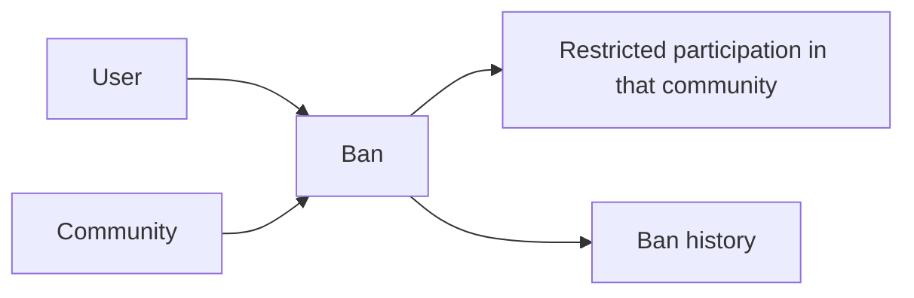

## Report Concept

A report represents a user’s complaint or flag raised against a post or comment. It is a moderation-related concept that allows community members to surface content they believe needs review. A report includes a reason written by the reporting user, which explains why the content was flagged. It also carries a status that shows where the report stands in the moderation process. The report has a creation time so it can be understood in chronological context. Each report is tied to one reported piece of content and one reporting user, making it a record of both the issue and who raised it. Reports are visible to moderators as part of community oversight and content management. The concept is distinct from a vote because it is about safety, rule enforcement, or content review rather than popularity. A report may end with content being removed or left in place, so its status is an important business signal. It serves as the official moderation record for flagged post or comment content.

### Report Concept

A report is the business record created when a user flags a post or comment for moderation review. It represents flagged content within a community and exists to support community oversight of content that may need attention. A report is distinct from a vote because it is about review and enforcement rather than popularity.

A report is tied to one reporting user and one reported item. The reported item may be either a post or a comment, but not both at the same time. This makes the report a single record of both what was flagged and who raised the concern.

A report is part of the community moderation domain and is visible to the moderators responsible for the related community. It serves as the official moderation record for the flagged content.

### Report Details

A report includes a reason text written by the reporting user. The reason text explains why the content was flagged and captures the reporter’s concern in their own words.

A report also includes a report status, which indicates where the report stands in moderation review. The status is a business signal for whether the report is still awaiting review, has been approved, or has been dismissed.

A report includes a creation time so it can be understood in chronological order alongside other moderation activity.

### Reported Content

The reported content may be a post or a comment. A reported post is a post that has been flagged for moderation review. A reported comment is a comment that has been flagged for moderation review.

The content being reported remains the primary subject of the report, while the report itself stores the moderation context around that flagged item. The reported content is associated with the community in which the concern arose, so the report belongs to that community’s oversight process.

### Reporting User

The reporting user is the user who created the report. This relationship identifies who raised the concern and provides accountability for the moderation record.

A report stores the reporting user as part of the business meaning of the record, so moderators can see which community member flagged the content. The reporting user is separate from the author of the reported post or comment.

### Moderation Review

A report exists to support moderation review within a community. Moderators use reports as part of their oversight of flagged content and community standards.

The report status reflects the moderation outcome of the review process. A report may remain under review, be approved as valid, or be dismissed if the content is left in place.

When a report is dismissed, it no longer remains in the active report list for moderation attention.

# Domain Relationships

Describe how concepts relate to each other from a business perspective.

## Conceptual Relationships

Describe how concepts relate to each other in business terms.

### User Relationships

A user is the central owner of several domain activities in the platform. A user can own communities as the creator or owner, create posts, create comments, subscribe to communities, vote on posts and comments, and report posts and comments. A user can also have a profile that describes them to other users.

A user belongs to the platform as an account identity and may be linked to multiple communities through subscriptions, votes, moderation roles, bans, and reports. The user relationship to these concepts is one-to-many where the user is the acting person and the related records represent actions or authority within communities.

Mermaid diagram:
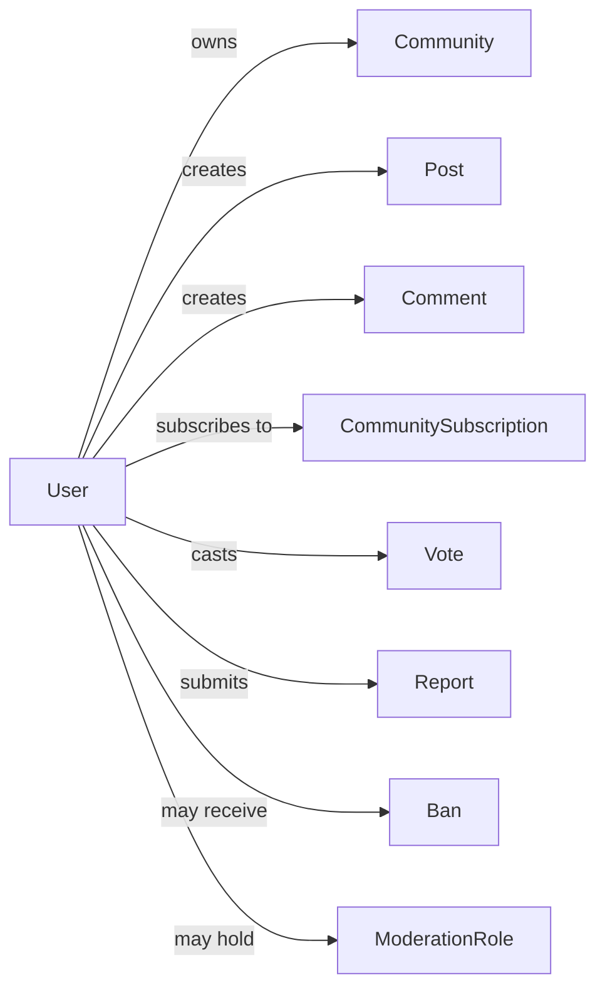

### Community Ownership and Membership

A community has one owning user, and that ownership begins with the user who creates the community. A community may have many subscribers, many posts, many moderators, many banned users, and many reports associated with it.

The community is the shared container for discussion content and moderation activity. Posts, bans, moderation roles, and reports all belong to a specific community, while subscriptions associate users with communities for participation and feed access.

Mermaid diagram:
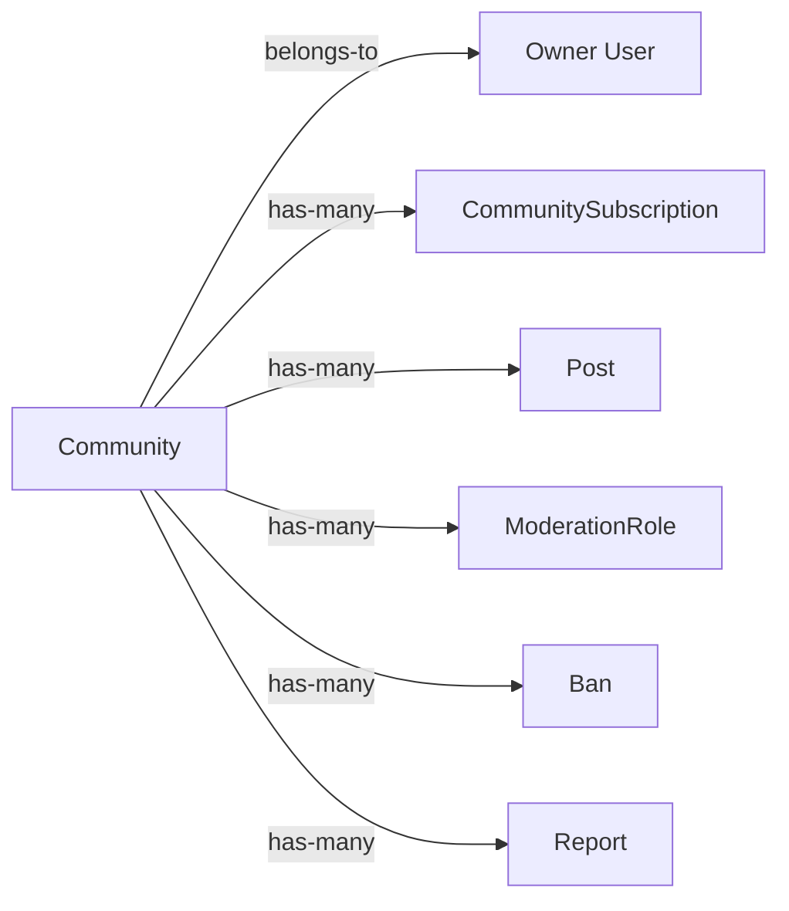

### Post and Comment Hierarchy

A post belongs to one community and one authoring user. A comment belongs to one post when it is a top-level comment, or it belongs to another comment when it is a reply. This creates a nested discussion structure with no depth limit for replies.

A post has many comments, and a comment can have many reply comments. Posts and comments each act as content items that can be voted on and reported, but their relationship structure is different: posts anchor discussion, while comments form the reply tree beneath them.

Mermaid diagram:
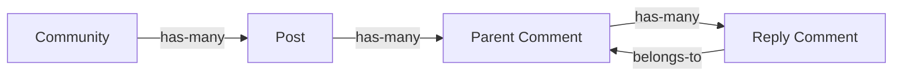

### Community Participation Records

A community subscription is the association between a user and a community. It records that the user is subscribed to the community and therefore belongs to that community's participating audience.

A vote is the association between a user and a single post or comment. Each vote belongs to one user and one target content item, and the vote record captures whether the user upvoted or downvoted that target.

A report is the association between a user and a reported post or comment. Each report belongs to one reporting user and one reported content item, and it is reviewed within the community that owns the reported content.

Mermaid diagram:
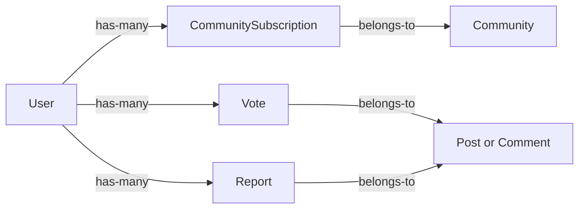

### Moderation Authority and Restriction

A moderation role is the association between a user and a community authority position. The role belongs to both the user and the community, and it identifies whether the user acts as owner or moderator within that community.

A ban is the association between a user and a community restriction. The ban belongs to both the user and the community, and it records that the user is restricted within that community while still remaining a user of the platform.

Moderation roles and bans are community-scoped relationships rather than platform-wide identities. They describe how a user relates to a specific community's authority structure and participation limits.

Mermaid diagram:
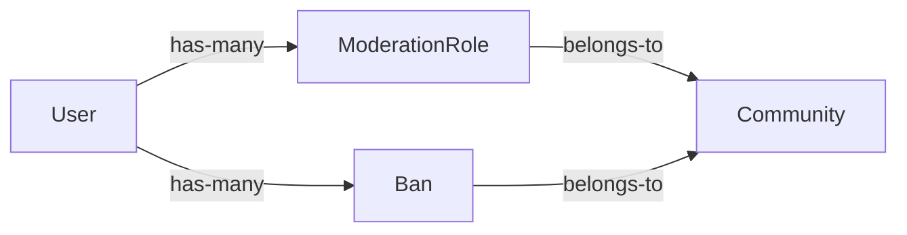

## Lifecycle and Retention

Describe concept lifecycle states and transitions only. Detailed retention/recovery policies belong in 05-non-functional. Operation details belong in 03-functional-requirements.

### Lifecycle

The platform treats content and account-related concepts as business records that may move through defined lifecycle states over time.

A user account is the canonical user concept in the platform. It may become active, deleted, or recovered depending on the applicable lifecycle outcome.
A community remains active while it continues to exist as a community in the platform.
A post remains active while it is available in its community and visible in feeds or post views.
A comment remains active while it is available within its post thread and visible in comment views.
A report remains active while it is pending review or has not yet been resolved.
A ban remains active while the restriction is in effect.
A moderation role remains active while the authority assignment is in effect.

When a concept leaves its active lifecycle, its later state depends on the concept type and the platform's deletion policy or archival handling rules defined in the related sections.

### Retention

Retention describes how long business records remain available after their active lifecycle ends.

The retention handling for deleted accounts, posts, and comments is governed by the platform's deletion policy.
The retention handling for resolved reports is governed by the report lifecycle and the community's moderation process.
The retention handling for communities, subscriptions, votes, moderation roles, and bans follows the business meaning of each concept and the related deletion or resolution outcome.

Retention in this document is limited to the business meaning of continued availability, removal, or preserved historical presence. Detailed storage and recovery policies belong in the non-functional requirements.

### Archival

Archival is the preserved, non-active state used for content that should no longer behave like live content but may still remain available for reference.

A post or comment may move from active to archived when it is no longer treated as live content but is still retained for historical viewing.
Archived content is no longer part of normal active discussion, but its business identity remains tied to its original author and community or post context.

Archival applies to content only when the platform requires the item to remain available in a preserved form rather than being fully removed. Whether a specific item is archived or deleted is determined by the deletion policy for that concept.

### Deletion Policy

The deletion policy defines what happens when a concept is removed from active use.

When a user account is deleted, the user's posts and comments are also deleted.
When a post is deleted, its associated comments are removed as part of the deleted discussion content.
When a comment is deleted, it no longer appears as part of the discussion thread.
When a report is approved, the reported content is deleted.
When a report is dismissed, the report is removed from the report list while the reported content remains.
When a ban ends through removal, the user is no longer restricted in that community.

The deletion policy distinguishes between full removal, preserved historical presence, and removal from active lists. This section defines the business outcome only and does not describe implementation details.

### Recovery

Recovery describes restoring access to a concept after it has been removed, restricted, or resolved.

A user account may be restored only if the platform supports restoring deleted accounts in the broader recovery policy.
A banned user may recover normal participation in a community when the ban is removed.
A report may be recovered into active review only if it has not been dismissed and the moderation process allows continued handling.

Recovery does not change the original identity of the concept. If a concept is recovered, it returns to the business state that makes it usable again within the platform.

### Lifecycle State Summary

The lifecycle of the main concepts can be understood as follows:

- A user account can be active, deleted, or recovered if the recovery policy allows it.
- A community can be active, and its related moderation assignments and bans can be active or removed.
- A post can be active, archived, or deleted.
- A comment can be active, archived, or deleted.
- A report can be active, resolved, dismissed, or removed from the report list.
- A ban can be active or removed.
- A moderation role can be active or removed.

These states describe business lifecycle outcomes from the user perspective and are intentionally limited to the concepts introduced in the domain model.

# Business Categories and State Flows

Business category classifications and state flow definitions.

## Business Category Definitions

Define all business category classifications with their allowed values and descriptions.

### Business Category Classification

The platform classifies its core domain concepts into business categories to distinguish people, community spaces, content items, interaction records, community governance, and moderation actions.

The business categories are:
- User: a person who uses the platform through an account.
- Community: a named community space that contains posts and subscribers.
- Post: a content item created within a community.
- Comment: a discussion item attached to a post or another comment.
- Community subscription: the membership relationship between a user and a community.
- Vote: the rating record for a post or comment.
- Moderation role: the authority relationship that grants community-level moderation power.
- Ban: the restriction relationship that limits posting and commenting in a community.
- Report: the moderation review record for a post or comment.

Each business category represents a distinct type of domain meaning and should be treated separately from the others when describing relationships, states, and business rules.

### Allowed Values for Content Classification

Posts use allowed values to classify the kind of content a post represents.

The allowed post content classifications are:
- Text post: a post whose content is written text.
- Link post: a post whose content is a web address.
- Image post: a post whose content is an uploaded image.

A post must belong to one and only one of these content classifications. The selected classification determines the kind of content the post carries and how it is presented in a feed or single-post view. The classification is part of the post's business meaning and remains distinct from voting, commenting, and moderation.

### Allowed Values for Community Role Type

Moderation roles use allowed values to describe the kind of authority a user has within a community.

The allowed role types are:
- Owner: the highest authority in the community, held by the community creator.
- Moderator: a community authority role that supports moderation of posts, comments, reports, and bans.

A community has exactly one owner role and may have additional moderator roles. The role type identifies the scope of authority within the community and distinguishes the creator's position from added moderation positions.

### Allowed Values for Subscription, Vote, Ban, and Report Status Type

Several relationship records use status type values to show their current business state.

The allowed values are:
- Subscription status: the current state of a community subscription.
- Vote type: the direction of a vote on a post or comment.
- Ban status: the current state of a community ban.
- Report status: the current state of a content report.

These status types describe how each relationship is currently treated in the domain model. Subscription status identifies whether a user-community membership is active or otherwise inactive. Vote type identifies whether the vote supports or opposes the content. Ban status identifies whether a restriction is currently in force. Report status identifies whether a moderation review is still open or has been resolved.

## State Transitions

Define valid state transition paths for stateful concepts.

### Subscription Status Change

A community subscription changes status when a user subscribes or unsubscribes from a community. While a subscription is active, it shows that the user is subscribed to that community and can use that membership for feed access and posting eligibility. When the user unsubscribes, the subscription changes to the inactive state and no longer grants those community-based permissions.

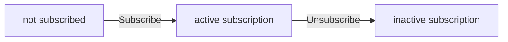

### Community Role Workflow

A moderation role changes as a result of role assignment and role removal within a community. The community creator begins in the owner state for that community. Additional moderation roles can be assigned so that a user becomes a moderator in that community. A moderation role changes back to no role in the community when the role is removed. The owner state is the highest authority state and remains distinct from moderator state.

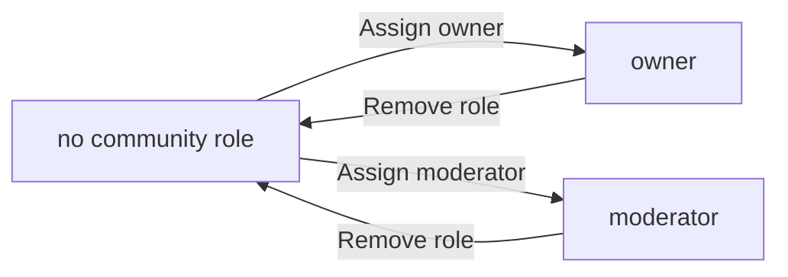

### Ban Lifecycle

A ban changes a user’s community access state for a specific community. When a user is banned, the ban state records that the user is restricted from creating posts or comments in that community. When the ban is lifted, the user returns to the unbanned state for that community. A ban is specific to one community and does not affect the user’s ability to participate in other communities.

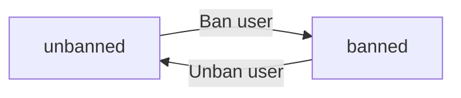

### Report Review Status

A report changes status as it moves through moderation review. A newly submitted report is in the pending review state. When a moderator approves the report, the report reaches the approved state and the reported content is deleted. When a moderator dismisses the report, the report reaches the dismissed state and is removed from the report list. A dismissed report does not remain available for ongoing review.

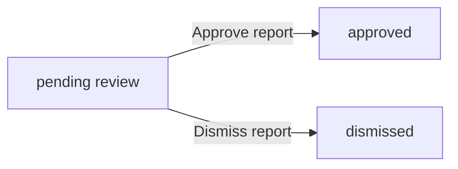

### Content Deletion Through Moderation Review

Some content items change state as a result of moderation review. A reported post or comment remains available while the report is pending review. If the report is approved, the content changes to the deleted state. Deleted content is no longer part of the normal community discussion flow. If the report is dismissed, the content remains in its existing state.

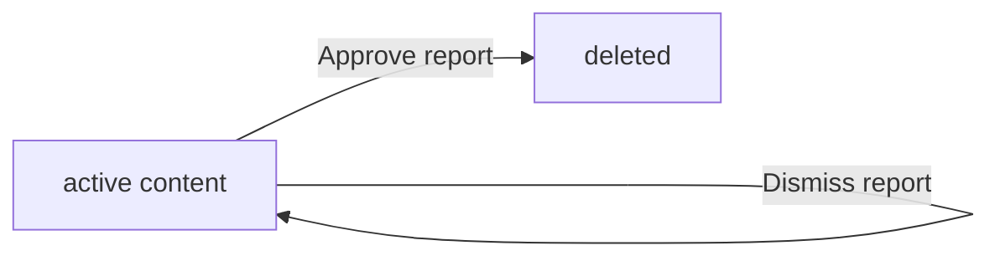