**communityPlatform — What operations users can perform, use cases, business workflows**

What operations users can perform, use cases, business workflows

# Core Business Operations

What the system must do for each business concept.

## User Operations

Users can sign up with an email, password, and a unique username. After registration, a user can log in with their email and password to access member-only actions such as subscribing, posting in communities, voting, and using the home feed. A user can change their password while keeping the same account identity. A user can also delete their own account, and when that happens, all of their posts and comments are deleted as part of the account removal process. Each user has a public profile that other people can view. The profile shows the user's display name, bio text, avatar image, total karma score, and lists of posts and comments they have created. Users can edit their own display name, bio, and avatar, but they cannot edit another user's profile. The platform must preserve the user's unique identity through their username while allowing profile presentation details to change over time. Operations involving a deleted account must no longer present that user as an active member. If a user is not logged in, actions that require membership should not be available.

### User Sign-Up and Login

Users can create an account by signing up with an email address, a password, and a unique username. The platform must treat the email address and password as the credentials used for login. A user can log in only after the account has been created. A username must belong to one user only, so the system must not allow two users to register with the same username. After a successful sign-up, the account becomes an active member identity for that user and can be used for member-only actions on the platform. Logged-in member access is required for actions that are restricted to members, including the user operations that depend on an authenticated account.

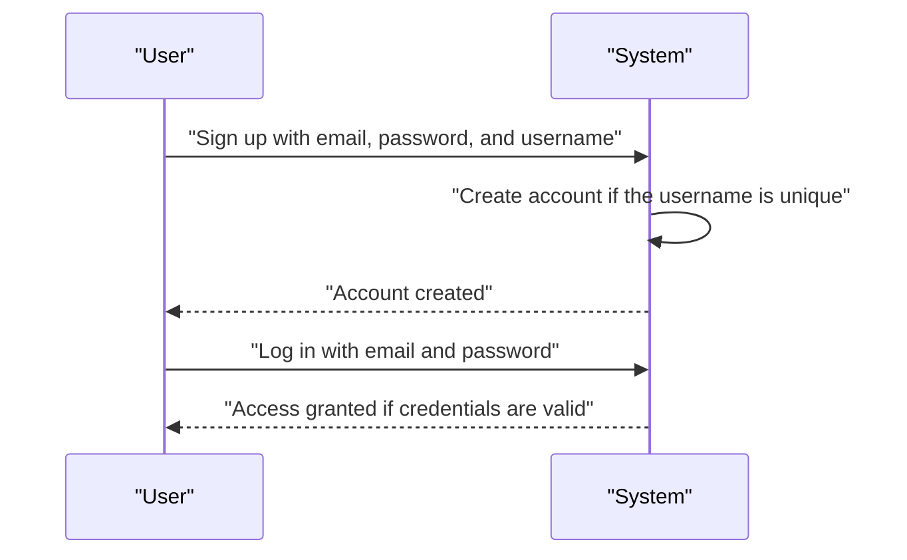

### Password Management

A user can change their own password while keeping the same account identity. The password change action applies only to the signed-in account that requests it. Changing the password does not create a new user profile and does not change the user's username or public profile details. The platform must continue to treat the user as the same active member after the password change, provided the account has not been deleted.

### Account Deletion

A user can delete their own account. When an account is deleted, the user's posts and comments are also deleted as part of the same account removal process. After deletion, the user must no longer be presented as an active member of the platform. Any access or profile visibility that depended on the deleted account must end with the account removal. Account deletion applies only to the user's own account and not to another user's account.

### Public Profile Viewing

Any person can view a user's public profile. A profile page shows the user's display name, bio text, avatar image, total karma score, authored posts, and authored comments. The profile content is public-facing and can be viewed for any existing user account. If the account has been deleted, the profile must no longer appear as an active user profile.

### Profile Editing

A user can edit only their own profile presentation details: display name, bio text, and avatar image. These changes update how the user is presented on the platform without changing the user's core account identity. A user cannot edit another user's profile. The profile presentation should remain tied to the same username while allowing the display name, bio, and avatar to change over time.

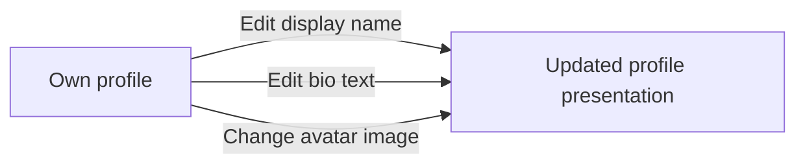

## Community Operations

Any user can create a community, and the creator becomes the owner of that community. A community must have a unique name, a description, and an icon image so users can identify it in lists and feeds. Users can browse all communities in a list and search for communities by name to find places they want to join. Each community presents its subscriber count so people can see how active or popular it is. Community ownership matters because the owner has the highest moderation authority. A community can be viewed by anyone, including users who are not logged in. Users who discover a community can then choose to subscribe before participating in posting. Community information should reflect the current name, description, icon, owner, and subscriber count whenever it is displayed. If a community is removed or no longer available, it should not appear in browse or search results. Community operations must support both discovery and ongoing participation in that shared space.

### Community Creation and Ownership

Any user can create a community.
When a community is created, the creating user becomes the community owner.
The community owner is the highest authority for that community.
A community’s ownership status must be reflected whenever the community is shown to users.

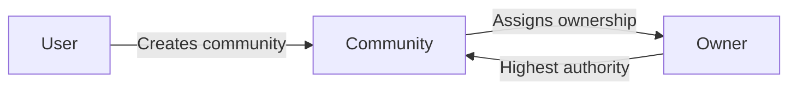

### Community Identity

A community must have a unique name so it can be distinguished from other communities.
A community must have description text so users can understand what the community is about.
A community must have an icon image so users can identify it in lists and other discovery surfaces.
The community name, description text, and icon image are displayed as the community’s identifying information wherever the community appears.
If a community’s identifying information is not available, the community cannot be presented as a complete community entry.

### Community Discovery List

Users can browse all communities in a discovery list.
The discovery list is available for community browsing and is intended to help users find communities they may want to view or join.
Users can search communities by name from the community discovery experience.
Search results are limited to communities whose names match the user’s search.
A community can be discovered whether or not the user is logged in.
If a community is removed or no longer available, it must not appear in the discovery list or in name-based search results.

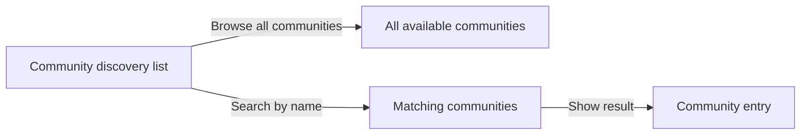

### Community Visibility and Participation Space

A community can be viewed by anyone, including users who are not logged in.
A community serves as a shared participation space where users discover content and decide whether to take part in it.
Community information must remain visible so users can evaluate the community before participating.
A community’s current identifying information and ownership status are shown when the community is viewed.
A community’s subscriber count is shown when the community is viewed so users can understand how many people belong to it.
The community view must support discovery and ongoing participation in the shared community space.

### Subscriber Count Display

Each community shows its subscriber count.
The subscriber count is displayed as part of the community’s public information.
The subscriber count should represent the current number of users subscribed to the community whenever the community is shown.
If the subscriber count is shown in a list or community view, it must be presented as the community’s current subscriber total.
The subscriber count exists to help users gauge community activity or popularity.

### Community Moderation Authority

The community owner has the highest moderation authority within the community.
The owner role is associated with the user who created the community.
Community moderation authority must reflect the owner’s priority over all other community moderators.
Any community-level moderation action that depends on authority must recognize the owner as the highest authority.
The owner’s authority applies only within the community that the user created.

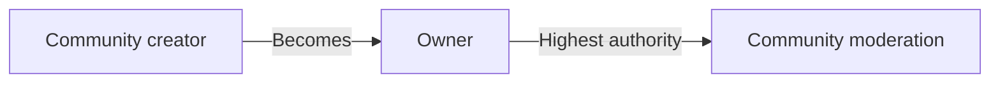

## Post Operations

Users can create posts only in communities they are subscribed to, so subscription is a required condition for posting. A post must always have a title, and it must be created as one of three post types: text, link, or image. Text posts carry written content, link posts carry a URL, and image posts carry an uploaded image. Users can edit their own posts and delete their own posts, but they cannot manage posts created by someone else unless they have moderation authority in that community. When a single post is viewed, it should show the title, full content, author, community, vote score, comment count, and the time it was posted. Feed views should also present posts in a list with the title, author username, community name, vote score, comment count, and time since posted. Text posts should show an excerpt in feed lists, image posts should show a thumbnail, and link posts should show the destination domain. Posts must be available through the home feed, popular feed, and community feed according to the viewing rules for each feed. Post operations also need to support sorting and pagination when posts are listed. Deleted posts should no longer appear as available content in feeds or single-post views.

### Post Creation in a Subscribed Community

Users can create a post only in a community they are subscribed to.
A post must belong to exactly one community at creation time.
A post must have a title.
A post must be created as one of three post types: text post, link post, or image post.
A text post includes written content.
A link post includes a URL.
An image post includes an uploaded image.
If a user is not subscribed to the community, the post is not created.
If the required title is missing, the post is not created.
If the chosen post type does not include the content required for that type, the post is not created.

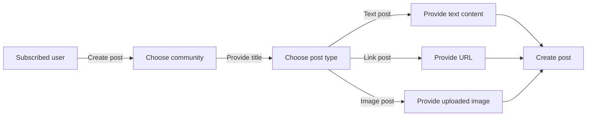

### Edit Own Post

Users can edit their own posts.
When a user edits a post, the post remains in the same community.
When a user edits a post, the post remains the same post type.
A user can update the title of their own post.
A user can update the content associated with the post type they originally created.
A user cannot edit a post created by another user unless they have moderation authority in that community; that permission is defined in [01-actors-and-auth.md].
If the user is not the author and does not have the required authority, the post is not updated.

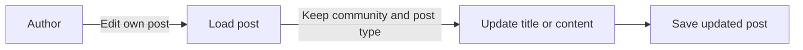

### Delete Own Post

Users can delete their own posts.
When a post is deleted by its author, it is no longer available in single-post views or feeds.
A user cannot delete a post created by another user unless they have moderation authority in that community; that permission is defined in [01-actors-and-auth.md].
If the user is not the author and does not have the required authority, the post is not deleted.
If a deleted post is requested through a listing or single-post view, it is treated as unavailable content.

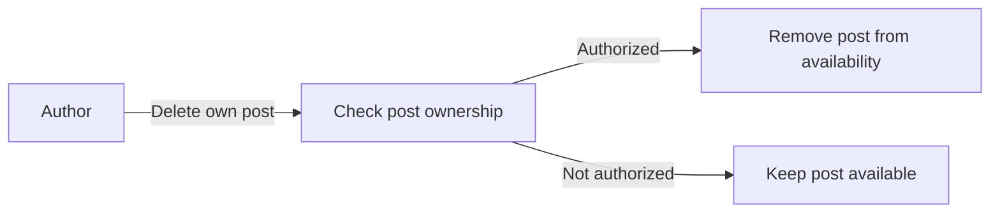

### Single Post Details

When a user views a single post, the system shows the post title.
When a user views a single post, the system shows the full content for that post type.
When a user views a single post, the system shows the author.
When a user views a single post, the system shows the community.
When a user views a single post, the system shows the vote score.
When a user views a single post, the system shows the comment count.
When a user views a single post, the system shows when it was posted.
If the post is a text post, the single-post view shows the full text content.
If the post is a link post, the single-post view shows the link content.
If the post is an image post, the single-post view shows the image content.
If the requested post is not available, it is not shown as a single-post view.

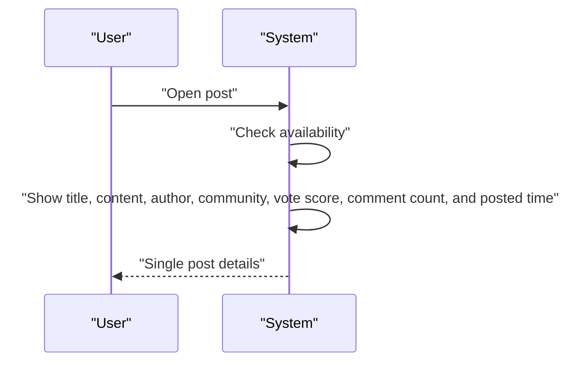

### Post List Display in Feeds

When posts are shown in any feed, each post in the list shows the title.
When posts are shown in any feed, each post in the list shows the author username.
When posts are shown in any feed, each post in the list shows the community name.
When posts are shown in any feed, each post in the list shows the vote score.
When posts are shown in any feed, each post in the list shows the comment count.
When posts are shown in any feed, each post in the list shows the time since posted.
For text posts, the list shows an excerpt of the content.
For image posts, the list shows a thumbnail of the image.
For link posts, the list shows the destination domain.
If a post is not available, it does not appear in the feed list.

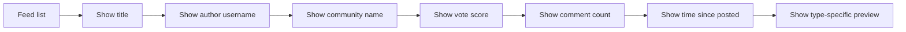

### Sorting and Pagination for Posts

Post lists support sorting by Hot, New, Top, and Controversial.
Hot sorting shows recent posts with many upvotes first.
New sorting shows the most recently created posts first.
Top sorting shows the highest vote score first.
Controversial sorting shows posts with many votes but a score close to zero first.
Top sorting includes time filters for today, this week, this month, this year, and all time.
All post lists are paginated.
Pagination applies to the home feed, popular feed, and community feed.
If a user changes the sorting option, the list is shown using the selected sort order.
If a user changes the page, the list is shown for the selected page only.

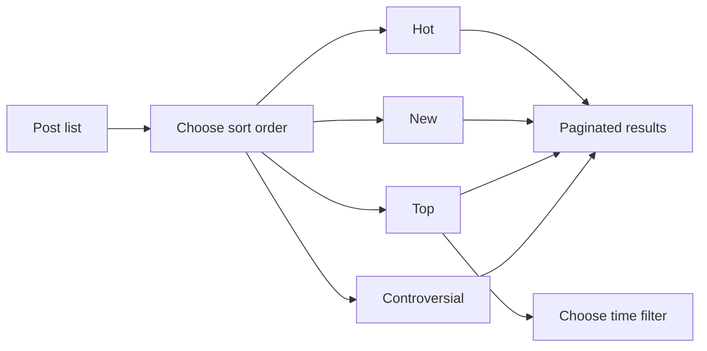

## Comment Operations

Users can write comments on any post, and they can reply to any comment so discussions can continue as nested threads. Replies can themselves receive replies with no depth limit, which means comment threads may grow as long as needed. Users can edit their own comments and delete their own comments, but they cannot change other people's comments unless moderation rules apply. Each comment shows the author, content, vote score, time since posted, and its nested replies when it is displayed. Comments are part of the post experience, so they must remain visible in the context of the post they belong to. Comment operations should support viewing the discussion structure in a readable way and keep replies associated with the correct parent comment. Users can add comments whether they are contributing a new opinion or responding directly to another comment. Deleted comments should no longer appear as active discussion content, though their effect on the thread structure should remain understandable to readers. Comment listings on a post must support sorting so people can review the discussion in different orders. The business behavior should keep comment participation open while preserving authorship and thread context.

### Writing Comments on a Post

Users can write a comment directly on any post.
A comment is associated with the post it is written on, so it appears in the post’s discussion area.
A user can add a comment either as a new contribution to the discussion or as a reply to an existing comment.
A comment becomes part of the visible discussion thread as soon as it is created.
If a user is not allowed to participate in a post because of community restrictions, the comment is not accepted.

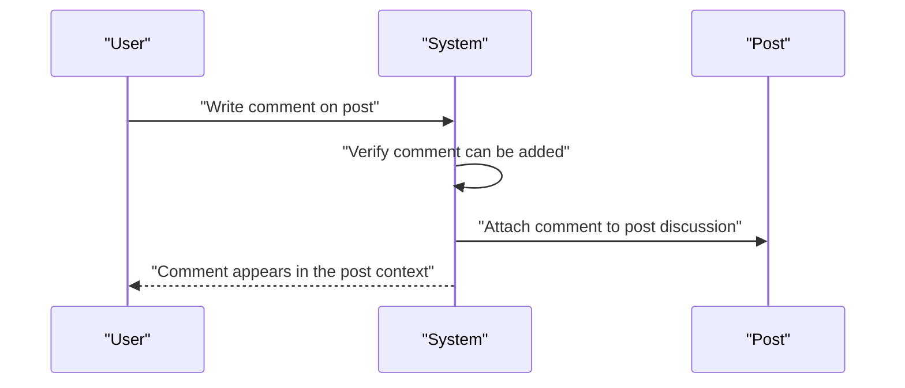

### Replying to Comments with Nested Threads

Users can reply to any comment.
Each reply is itself a comment and is associated with the comment it responds to.
Replies can receive further replies, and there is no depth limit on how far the thread can continue.
The system keeps replies linked to the correct parent comment so the discussion structure remains intact.
Nested replies are displayed as a threaded conversation rather than as separate disconnected comments.

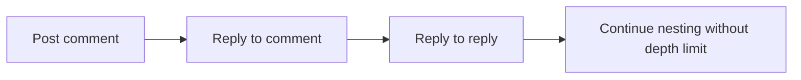

### Editing and Deleting Own Comments

A user can edit only their own comments.
A user can delete only their own comments.
When a comment is edited, the updated content is shown in the discussion thread.
When a comment is deleted, it no longer appears as active discussion content.
The system preserves the comment’s position in the thread context so readers can still understand the discussion structure.
The system does not allow a user to change or remove another user’s comment through these comment operations.

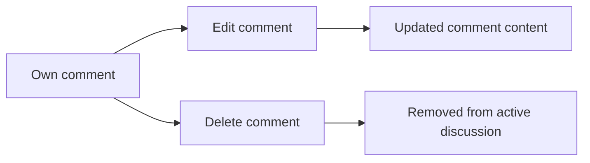

### Comment Display in the Post Context

When a comment is shown, it displays the author, the content, the vote score, the time since it was posted, and any nested replies.
Comments remain visible in the context of the post they belong to, so readers can follow the full discussion around the post.
The post’s discussion area presents comments together with the post so the relationship between the main content and the conversation is clear.
Each displayed comment supports understanding of who wrote it, what was said, how it was received, and where it sits in the thread.

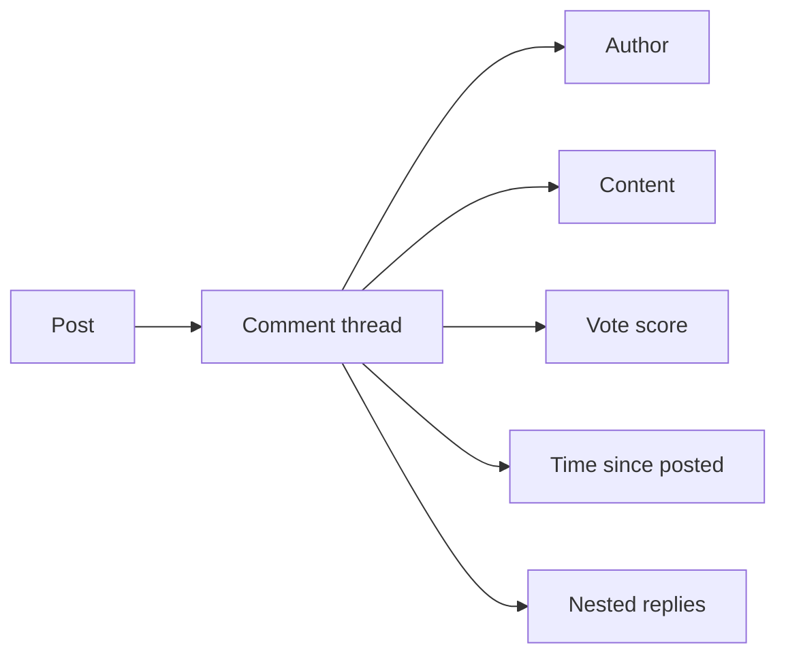

### Comment Sorting and Discussion Readability

Comments on a post can be sorted so users can review the discussion in different orders.
The available sorting options for comments are Best, New, and Controversial.
Best shows comments with the highest vote score first.
New shows the most recent comments first.
Controversial shows comments with many votes but a score close to zero first.
The system presents comment threads in a readable way so nested discussion remains understandable even when replies continue deeply.
Readability includes keeping parent comments and their replies visually and logically grouped as part of the same discussion thread.


## CommunitySubscription Operations

Users can subscribe to any community and unsubscribe from any community whenever they choose. Subscribing is what connects a user to a community for participation in that community's member-only posting flow. A user can view a list of all communities they are subscribed to, which helps them navigate back to their active communities. Subscription status should reflect whether the user is currently subscribed or not. A subscription also determines whether the user can create posts in that community, so the subscription state affects posting permissions. Communities should show subscriber count so users understand the size of the subscribed audience. Subscription operations must respect the current relationship between the user and the community, with a user able to join once and later leave. If a user is not subscribed, they should not be treated as eligible to post in that community. The subscribed community list should provide a concise view of the communities a user follows. This business area focuses on managing the user-to-community membership relationship.

### Subscribe to a Community

Users can subscribe to any community they choose.
A successful subscription establishes the current user-community relationship for that community.
If the user is already subscribed to the community, the system keeps the existing subscription state unchanged.
Subscribing makes the community part of the user's followed communities.
Subscribing is required before the user can create posts in that community.

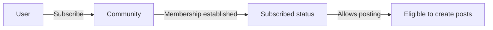

### Unsubscribe from a Community

Users can unsubscribe from any community they are currently subscribed to.
A successful unsubscribe removes the community from the user's followed communities.
A successful unsubscribe changes the subscription status so the user is no longer treated as subscribed.
If the user is not subscribed to the community, the unsubscribe request does not create a subscription relationship.
After unsubscribing, the user is no longer eligible to create posts in that community.
Users can join a community again later by subscribing again.

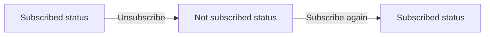

### View Subscribed Communities List

Users can view a list of all communities they are currently subscribed to.
The list shows the communities that the user follows for membership navigation.
The list reflects the user's current community relationship and excludes communities the user has unsubscribed from.
The list supports finding the communities a user belongs to for quick return to active communities.
If the user has no subscriptions, the list shows no subscribed communities.

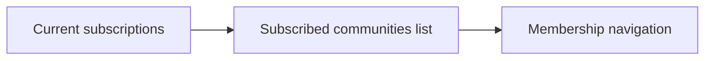

### Subscription Status and Posting Eligibility

Each community subscription has a status that indicates whether the user is currently subscribed.
The subscription status determines whether the user is eligible to create posts in that community.
Only communities with an active subscription count toward member-only posting access for that user.
If the subscription is not active, the user is not eligible to create posts in that community.
This relationship is used to decide whether the user may participate in the community's posting flow.

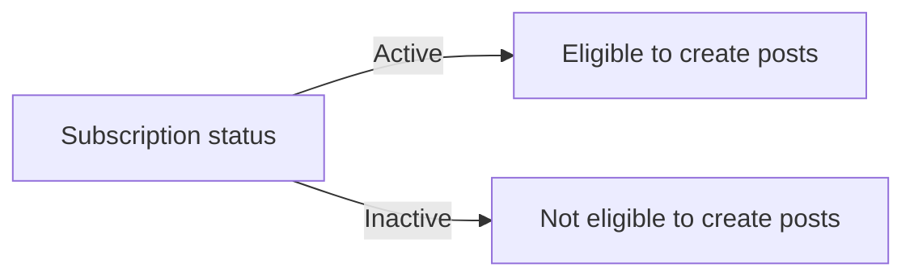

### Subscriber Count Relationship

Each community shows a subscriber count that reflects how many users are currently subscribed.
When a user subscribes to a community, that community's subscriber count increases.
When a user unsubscribes from a community, that community's subscriber count decreases.
The subscriber count represents the size of the subscribed audience for the community.
The count is tied to the current subscription relationship, not to past subscriptions.

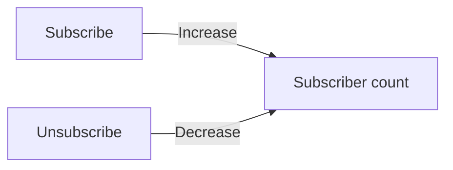

## Vote Operations

Users can vote on posts and comments using either an upvote or a downvote. Each user can cast only one vote per post or comment at a time, and the vote can later be changed to the opposite direction. A user can also remove their vote entirely, which restores the item's score accordingly. Votes affect karma when they are cast on another user's post or comment, increasing or decreasing the author's karma by one as appropriate. Vote score on posts and comments is calculated as upvotes minus downvotes, so the score can be positive, zero, or negative. Users should see consistent voting behavior on both posts and comments because the same business rules apply to each. Voting operations must prevent duplicate active votes from the same user on the same content. When a vote is removed or changed, the visible score should update to reflect the current state. The system should present the current voting outcome rather than historical vote actions. Voting is part of content ranking and user reputation within the community platform.

### Vote on Posts

Users can upvote or downvote a post.
A user can cast only one active vote on a post at a time.
If a user votes on a post they have not voted on before, the post records that vote as the current voting outcome.
If a user changes their vote from upvote to downvote, the post replaces the earlier vote with the new vote direction.
If a user changes their vote from downvote to upvote, the post replaces the earlier vote with the new vote direction.
If a user removes their vote from a post, the post no longer counts that user’s vote.
Duplicate active votes from the same user on the same post are not allowed.
The post’s vote score is the total number of upvotes minus the total number of downvotes.
A post’s vote score can be positive, zero, or negative.
When a post receives an upvote from another user, the author’s karma increases by one.
When a post receives a downvote from another user, the author’s karma decreases by one.
When a user removes their vote from a post, the author’s karma is adjusted to match the removed vote.
When a user changes their vote direction on a post, the author’s karma is adjusted to reflect the change from the previous vote to the new vote.
Voting behavior for posts contributes to content ranking and user reputation within the platform.

```mermaid
flowchart LR
    A["User selects post"] --> B["System records upvote or downvote"]
    B --> C["System updates vote score"]
    C --> D["System adjusts author karma"]
    D --> E["System shows current voting outcome"]
    E --> F["User may change or remove vote"]
```

### Vote on Comments

Users can upvote or downvote a comment.
A user can cast only one active vote on a comment at a time.
If a user votes on a comment they have not voted on before, the comment records that vote as the current voting outcome.
If a user changes their vote from upvote to downvote, the comment replaces the earlier vote with the new vote direction.
If a user changes their vote from downvote to upvote, the comment replaces the earlier vote with the new vote direction.
If a user removes their vote from a comment, the comment no longer counts that user’s vote.
Duplicate active votes from the same user on the same comment are not allowed.
The comment’s vote score is the total number of upvotes minus the total number of downvotes.
A comment’s vote score can be positive, zero, or negative.
When a comment receives an upvote from another user, the author’s karma increases by one.
When a comment receives a downvote from another user, the author’s karma decreases by one.
When a user removes their vote from a comment, the author’s karma is adjusted to match the removed vote.
When a user changes their vote direction on a comment, the author’s karma is adjusted to reflect the change from the previous vote to the new vote.
Voting behavior for comments contributes to content ranking and user reputation within the platform.

```mermaid
flowchart LR
    A["User selects comment"] --> B["System records upvote or downvote"]
    B --> C["System updates vote score"]
    C --> D["System adjusts author karma"]
    D --> E["System shows current voting outcome"]
    E --> F["User may change or remove vote"]
```

### Voting Rules and Outcome

The system shows the current voting outcome for each post and comment rather than the full history of a user’s voting actions.
The current voting outcome reflects whether the user has upvoted, downvoted, or not voted on the item.
The system prevents a user from having more than one active vote on the same post or comment.
The system treats vote removal as returning the item to a state with no active vote from that user.
The system treats vote changes as replacing the previous direction rather than adding a second vote.
Vote effects on score and karma are applied consistently across posts and comments.
Voting contributes to both content ranking and user reputation across the community platform.

```mermaid
flowchart LR
    A["Active vote exists"] --> B["User changes vote"]
    A --> C["User removes vote"]
    B --> D["Current voting outcome updates"]
    C --> D
    D --> E["Score and karma remain consistent with current vote"]
```

## ModerationRole Operations

The creator of a community becomes its owner and holds the highest authority in that community. The owner can add moderators to help manage the community and can remove moderators when necessary. Moderators can also add other moderators, which supports delegation of moderation work. The owner cannot be removed by moderators, so ownership remains protected. Moderators cannot remove each other; only the owner can remove moderators from the role. Moderation roles determine who can carry out community enforcement actions such as deleting content, banning users, unbanning users, and reviewing reports. A community may have multiple moderators, but their authority is limited below the owner. The role assignment should be clear enough that members understand who is responsible for community oversight. Moderation role operations should maintain the hierarchy between owner and moderators without allowing role changes that break that structure. This area focuses on who has the authority to moderate a community, not on the specific enforcement actions themselves.

### Community Owner Highest Authority

The community creator is the owner and has the highest authority within that community.
The owner is the top decision-maker for moderation role changes in the community.
The owner’s authority takes precedence over moderator authority whenever a role change could conflict with the community hierarchy.
The owner role is the reference point for all other moderation authority levels in the community.

```mermaid
flowchart LR
    A["Community Creator"] -->|"Becomes"| B["Owner"]
    B -->|"Highest authority"| C["Community Oversight"]
    C -->|"Below owner"| D["Moderator"]
```

### Add Moderators

The owner can add moderators to the community.
When the owner adds a moderator, the selected user gains moderation authority in that community.
Adding moderators is a community role assignment action that extends oversight responsibility beyond the owner.
A community may have multiple moderators at the same time.

```mermaid
sequenceDiagram
    participant O as Owner
    participant S as System
    participant U as User
    O->>S: Add moderator
    S->>S: Assign moderator role in the community
    S-->>O: Role added
```

### Remove Moderators

The owner can remove moderators from the community.
Removing a moderator withdraws that user’s moderation authority in that community.
Only the owner can remove moderators from the role.
Removing a moderator is part of maintaining the community role hierarchy and preserving clear authority levels.

```mermaid
flowchart LR
    A["Owner"] -->|"Can remove"| B["Moderator"]
    B -->|"Loses"| C["Moderation authority"]
```

### Moderators Add Other Moderators

Moderators can add other moderators in the same community.
This delegated moderation work allows moderators to share community oversight responsibility.
A moderator who adds another moderator extends moderation authority without changing the owner’s highest authority.
Moderator-to-moderator delegation is allowed as part of the community’s moderation structure.

```mermaid
flowchart LR
    A["Moderator"] -->|"Adds"| B["Other Moderator"]
    B -->|"Shares"| C["Community Oversight Responsibility"]
```

### Owner Cannot Be Removed

Moderators cannot remove the owner from the moderation role.
The owner is protected from removal to preserve the community’s authority structure.
Any attempt by a moderator to remove the owner must not succeed.
The owner remains the highest authority in the community even when moderators are added or removed.

```mermaid
flowchart LR
    A["Moderator"] -->|"Cannot remove"| B["Owner"]
    B -->|"Protected from removal"| C["Role hierarchy preserved"]
```

### Moderators Cannot Remove Each Other

Moderators cannot remove other moderators.
Only the owner can remove moderators from the community moderation role.
This restriction prevents peers from changing each other’s authority level.
The rule keeps moderation authority levels consistent and avoids conflicts within delegated moderation work.

```mermaid
flowchart LR
    A["Moderator"] -->|"Cannot remove"| B["Another Moderator"]
    C["Owner"] -->|"Can remove"| B
```

### Role Hierarchy in a Community

The community moderation structure must maintain a clear hierarchy.
The owner is above all moderators in authority.
Moderators have authority only within the scope granted to them by the community role assignment.
Role changes must preserve the distinction between owner authority and moderator authority.
The hierarchy exists so that community oversight responsibility remains organized and unambiguous.

```mermaid
flowchart LR
    A["Owner"] -->|"Above"| B["Moderator"]
    B -->|"Above"| C["No lower moderation authority"]
```

### Community Role Assignment

Moderation role assignment defines who is responsible for community oversight.
The owner assigns moderators to support moderation work in the community.
A user who is assigned as a moderator becomes part of the community’s moderation structure.
Role assignment must preserve the owner’s highest authority and the moderator’s limited authority.
This operation exists to make community oversight responsibility explicit and manageable.

```mermaid
flowchart LR
    A["Owner"] -->|"Assigns"| B["Moderator Role" ]
    B -->|"Supports"| C["Community Oversight Responsibility"]
```

### Delegated Moderation Work

Moderators may delegate moderation work by adding other moderators.
Delegation allows moderation responsibilities to be shared without removing the owner’s authority.
Delegated moderation work must remain within the community’s existing role hierarchy.
The delegation model supports continuity of community oversight when more than one moderator is needed.

```mermaid
sequenceDiagram
    participant M as Moderator
    participant S as System
    participant N as New Moderator
    M->>S: Add another moderator
    S->>S: Preserve hierarchy and assign moderation authority
    S-->>M: Delegation completed
```

### Community Oversight Responsibility

Moderation roles exist to support community oversight responsibility.
The owner is ultimately responsible for the moderation structure of the community.
Moderators share in community oversight when they are assigned or when they delegate moderation work to others.
The community must keep oversight responsibility tied to the moderation role hierarchy.


## Ban Operations

Moderators can ban users from their community when community rules or moderation decisions require it. A ban prevents the affected user from creating posts or comments in that community, but the user can still view the community's content. Moderators can also unban users when the restriction should end. The list of banned users must be available to moderators so they can review who is currently restricted. Ban records should reflect who was banned, when the ban was applied, and the reason for the restriction. The ban state applies only within the affected community and does not remove the user's access to the rest of the platform. Users who are banned should be treated as unable to contribute to the community discussion until the ban is lifted. The ban list helps moderators make consistent decisions and avoid duplicate actions. Ban operations should keep the current restriction status clear to moderators and community members with appropriate authority. This business area covers community-specific access restrictions and their reversal.

### Ban a User from a Community

Moderators can ban a user from their community when an enforcement action is needed.
The ban applies only within the community where it was created and does not affect the user's access to other communities or the rest of the platform.
When a ban is applied, the system records the banned user, the community, the moderation action, the time the ban was applied, and the reason for the ban.
The ban record is the source of the current ban status for that user in that community.
A banned user is prevented from creating new posts in the affected community.
A banned user is prevented from creating new comments in the affected community.
A banned user can still view the community's content while the ban remains active.
The community owner and moderators can review the current ban status for any user in their community.

Mermaid flowchart:
```mermaid
flowchart LR
    A["Moderator reviews user behavior"] --> B["Moderator applies ban"]
    B --> C["System records community-specific restriction"]
    C --> D["User cannot post in that community"]
    C --> E["User cannot comment in that community"]
    C --> F["User can still view content"]
```


### Unban a User

Moderators can remove an active ban from a user in their community when the restriction should end.
Unbanning reverses the community-specific restriction for that user in that community only.
When a ban is removed, the system updates the user's current ban status so that the user is no longer treated as banned in that community.
After unbanning, the user regains the ability to create posts and comments in that community, subject to any other applicable community rules.
The ban record remains available as part of the moderation history for the community.
The unban action must be traceable as the reversal of a prior ban.

Mermaid flowchart:
```mermaid
flowchart LR
    A["Moderator reviews active ban"] --> B["Moderator removes ban"]
    B --> C["System updates current ban status"]
    C --> D["User can post again in that community"]
    C --> E["User can comment again in that community"]
```


### View the List of Banned Users

Moderators can view a list of users who are currently banned in their community.
The list helps moderators see the current ban status of restricted users at a glance.
Each entry in the list identifies the banned user and the community-specific restriction that applies to them.
The list shows the ban reason so moderators can understand why the restriction exists.
The list supports moderation decisions by making the active restrictions visible and easy to review.
Only users with moderation authority in that community can access the banned users list.

Mermaid flowchart:
```mermaid
flowchart LR
    A["Moderator opens banned users list"] --> B["System shows current ban status entries"]
    B --> C["Moderator reviews banned user"]
    B --> D["Moderator reviews ban reason"]
```


## Report Operations

Users can report any post or comment when they believe moderation review is needed. A report requires a reason, so the reporter must explain why the content should be reviewed. Moderators can view all reports for their community and see which content was reported, who reported it, and the reason given. Reports are part of the community moderation workflow and help moderators decide whether action is needed. A moderator can approve a report, which deletes the reported content, or dismiss it, which keeps the content in place. Dismissed reports are removed from the report list so the queue reflects only items still awaiting action. Reports should remain tied to the relevant community so moderators see only the reports they are responsible for handling. The report flow must support both post reports and comment reports with the same basic review process. Reporting should be straightforward for users while giving moderators enough context to make a decision. This business area closes the loop between community members raising concerns and moderators resolving them.

### Report a Post or Comment

Users can report any post or comment when they believe it needs moderation review.
A report applies to one piece of content at a time and may target either a post or a comment.
The reporting flow is available for both post reporting and comment reporting using the same basic process.
When a user submits a report, the user must provide a reason in text.
A report is tied to the community where the reported content exists so that only the relevant community's moderators can review it.

Moderators can view the reports for their community in a queue of pending reports.
Each report in the queue shows the reported content, the user who submitted the report, and the reason provided.
Moderators use the report details to decide whether action is needed.

A moderator can approve a report.
When a report is approved, the reported content is deleted.
A moderator can dismiss a report.
When a report is dismissed, the reported content remains in place.
Dismissed reports are removed from the report list so that the queue contains only reports still awaiting action.

Mermaid flowchart:
```mermaid
flowchart LR
    A["User reports post or comment"] --> B["User provides report reason"]
    B --> C["Report is added to community queue"]
    C --> D["Moderator reviews report details"]
    D --> E["Approve report"]
    D --> F["Dismiss report"]
    E --> G["Reported content is deleted"]
    F --> H["Reported content remains"]
    F --> I["Report is removed from queue"]
```

# Error Scenarios and Edge Cases

Business-level error scenarios, edge case coverage, and expected system behaviors for exceptional conditions.

## User Error Scenarios

Users must provide both email and password when signing up or logging in, and sign-up also requires a unique username. If the username is already taken, the account creation attempt should fail and the user must choose a different one. Users can change their password only for their own account, so attempts to modify another user's account are not allowed. When a user deletes their account, the system removes that user and all of their posts and comments together so no orphaned content remains. A deleted account should no longer be available for login or profile viewing as an active user. If a user tries to act without being logged in, the system should treat the action as unavailable. Profile edits must apply only to the account owner, and other users may view the profile but cannot change display name, bio, or avatar. If profile information is missing or not provided by the user, the system should keep the existing profile details unchanged. Any failure during account deletion should leave the account data in a consistent state rather than partially removed. These rules ensure account identity, privacy, and ownership are preserved across user-related actions.

### User Sign-Up, Login, and Username Conflicts

Users can create an account with an email address, a password, and a unique username.
If the chosen username is already in use, the sign-up attempt is rejected and the user must choose a different username.
Users can log in with their email address and password.
If sign-up is attempted with a username that matches an existing user, the system does not create a second account with that username.
If login credentials do not match an existing account, the login attempt is rejected.
If a user attempts to sign up without an email address, password, or username, the sign-up attempt is rejected.

```mermaid
sequenceDiagram
    participant U as "User"
    participant S as "System"
    U->>S: "Submit sign-up details"
    S->>S: "Check email, password, and username"
    S->>S: "Check whether username is already in use"
    S-->>U: "Create account or reject sign-up"
    U->>S: "Submit login details"
    S->>S: "Check email and password"
    S-->>U: "Log in or reject login"
```

### Account Ownership and Unauthorized Access

Users can change the password for their own account only.
A user cannot change another user's password.
Users can delete their own account only.
A user cannot delete another user's account.
If a user tries to perform an account action without being logged in, the system treats the action as unavailable.
If a user tries to access account-related actions for an account they do not own, the request is rejected.
These rules apply to all account changes in this unit and preserve account ownership boundaries.

### Account Deletion and Content Removal

When a user deletes their account, the system also deletes all posts and comments created by that user.
The account deletion process removes the user and their content together so that no orphaned posts or comments remain.
If account deletion cannot be completed, the account and associated content remain in a consistent state and are not left partially removed.
After deletion, the account is no longer available for login or profile viewing as an active user.
If a deleted account is requested in an account context, the system treats it as unavailable.

```mermaid
flowchart LR
    A["Account deletion requested"] --> B["Verify account ownership"]
    B --> C["Delete user account"]
    C --> D["Delete user's posts"]
    D --> E["Delete user's comments"]
    E --> F["Account no longer available"]
```

### Profile Viewing and Editing

Users can view their own profile and other users' profiles.
A profile view shows the user's display name, bio, avatar, total karma score, posts created by that user, and comments written by that user.
Users can edit their own display name, bio, and avatar.
A user cannot edit another user's profile.
If profile information is missing from an edit attempt, the existing profile information remains unchanged.
If a user views a deleted account, the deleted account is not available as an active profile.
These rules ensure that profile viewing is open to users while profile editing remains limited to the profile owner.

## Community Error Scenarios

Any user may create a community, but each community name must be unique, so duplicate names should be rejected. A community must include a name, description text, and an icon image, and missing required details should prevent creation. The user who creates the community becomes the owner, and that ownership should remain with the creator unless moderation rules later change it through explicit role management. Users can browse all communities even if they are not subscribed, so communities should still appear in the list when they have no subscribers. Search should only return communities that match the requested name, and an empty or unmatched search should simply produce no results. The subscriber count shown on a community should stay accurate when users subscribe or unsubscribe. If a community cannot be found, users should not be able to view it as an active community page. Community creation and search should not expose hidden moderation-only actions. An invalid or incomplete community icon should prevent a complete community setup until the user provides a proper image. These rules keep community discovery and ownership behavior predictable for all users.

### Community Creation Uniqueness and Required Details

Any user can create a community.
A community name must be unique across the platform, so if a requested name already belongs to an existing community, the creation request is rejected.
A community must include a name, description text, and an icon image, and the system must reject creation when any of these required details are missing.
The user who creates the community becomes the community owner when creation succeeds.
If community creation is rejected because the name is already in use, the existing community remains unchanged.
If community creation is rejected because required details are missing, no community is created.

```mermaid
flowchart LR
    A["User starts community creation"] --> B["User provides name, description text, and icon image"]
    B --> C["System checks whether the name is unique"]
    C -->|"Name already exists"| D["Creation is rejected"]
    C -->|"Name is unique"| E["System checks required details"]
    E -->|"Any required detail is missing"| D
    E -->|"All required details are present"| F["Community is created and creator becomes owner"]
```

### Browse All Communities and Subscriber Count

Any user, including a logged-out user, can browse the full community list.
The community list includes communities even when they have no subscribers.
Each community shown in the list displays its subscriber count.
The subscriber count shown for a community must reflect the current number of subscribers.
If the subscriber count changes because users subscribe or unsubscribe, the displayed count must change accordingly.
Browsing the community list does not require the user to be subscribed to any community.

```mermaid
flowchart LR
    A["User opens community list"] --> B["System loads all communities"]
    B --> C["System displays each community"]
    C --> D["Each community shows subscriber count"]
    D --> E["User browses communities with or without subscriptions"]
```

### Search Communities by Name

Any user, including a logged-out user, can search for communities by name.
Search results include only communities whose names match the requested search name.
If the search term is empty, the system returns no search results.
If no community matches the requested name, the system returns no search results.
Search results do not include unrelated communities.

```mermaid
flowchart LR
    A["User enters community search name"] --> B["System evaluates the search term"]
    B -->|"Search term is empty"| C["No results are returned"]
    B -->|"Search term is not empty"| D["System finds matching community names"]
    D -->|"Matches exist"| E["Matching communities are returned"]
    D -->|"No matches exist"| C
```

### Community Not Found and Invalid Access State

If a user tries to view a community that does not exist, the system treats it as a not found state and does not show it as an active community page.
A community that cannot be found must not appear as if it is available for viewing.
The not found state applies whether the user is logged in or logged out.
The system does not create a placeholder community view for a missing community.

```mermaid
flowchart LR
    A["User requests a community"] --> B["System checks whether the community exists"]
    B -->|"Community exists"| C["Community page is shown"]
    B -->|"Community does not exist"| D["Not found state is shown"]
    D --> E["No active community page is displayed"]
```

### Missing Icon Image During Community Setup

A community cannot be created without an icon image.
If the icon image is missing during community setup, the creation request is rejected.
The missing icon image rule applies even when the name and description text are present.
The community is only created after the required icon image has been provided along with the other required details.


## Post Error Scenarios

Users can create posts only in communities they are subscribed to, so attempts to post in an unsubscribed community should be rejected. Every post must have a title, and a post must be exactly one of the three supported types: text, link, or image. If a user does not provide the content needed for the chosen type, the post should not be created. Text posts should present written content, link posts should present a URL, and image posts should present an uploaded image; mixing these requirements should not be accepted. Users can edit and delete only their own posts, so attempts to change another user's post should fail. When a single post is viewed, the system should still show the author, community, vote score, comment count, and posted time even if the post has no comments yet. Deleted posts should no longer appear in feeds or single-post views. If a post belongs to a community where the viewer is banned from creating content, the post may still be visible but new creation should remain blocked. Feed displays should handle posts with no title or incomplete content by excluding them from normal publishing. These rules protect post ownership, type consistency, and community posting requirements.

### Subscribe Before Creating a Post

Users can create a post only in a community they are subscribed to.
If a user attempts to create a post in a community they are not subscribed to, the system rejects the request.
If a user is banned from creating posts in a community, the system rejects the request even when the user is subscribed.
A post creation attempt must be evaluated against both subscription status and community ban status before the post is accepted.

```mermaid
flowchart LR
    A["User chooses community"] --> B["System checks subscription status"]
    B --> C["System checks ban status"]
    C --> D["Post is created"]
    C --> E["Request is rejected"]
```

### Post Title Is Required

A post must include a title.
If a user attempts to create a post without a title, the system rejects the request.
If a user attempts to create a post with a title but without the content required by the selected post type, the system rejects the request.
A post is not considered valid for publication until the required title is provided.


### Text Post Content Must Be Provided

A text post must include written text content.
If a user selects the text post type but does not provide text content, the system rejects the request.
If a user provides content intended for another post type instead of text content, the system rejects the request.
A text post is not accepted unless it contains the text content expected for that post type.


### Link Post Must Include a URL

A link post must include a URL.
If a user selects the link post type but does not provide a URL, the system rejects the request.
If a user provides text content or an uploaded image instead of a URL for a link post, the system rejects the request.
A link post is not accepted unless it includes the URL expected for that post type.


### Image Post Must Include an Uploaded Image

An image post must include an uploaded image.
If a user selects the image post type but does not provide an uploaded image, the system rejects the request.
If a user provides text content or a URL instead of an uploaded image for an image post, the system rejects the request.
An image post is not accepted unless it includes the uploaded image expected for that post type.


### Only One Post Type May Be Chosen

A post must be exactly one of the supported post types: text, link, or image.
If a user attempts to create a post with content for more than one post type, the system rejects the request.
If a user attempts to create a post without selecting any post type, the system rejects the request.
The system does not accept mixed post-type content for a single post.

```mermaid
flowchart LR
    A["Post creation request"] --> B["Selected post type"]
    B --> C["Text content"]
    B --> D["URL"]
    B --> E["Uploaded image"]
    C --> F["Accept only when text is the only selected type"]
    D --> F
    E --> F
    F --> G["Request accepted"]
    B --> H["Mixed content types"]
    H --> I["Request rejected"]
```

### Users Can Edit Only Their Own Posts

A user can edit only a post that the user created.
If a user attempts to edit another user's post, the system rejects the request.
If a user attempts to edit a post that has been deleted, the system rejects the request.
Edit permissions are determined by post ownership.


### Users Can Delete Only Their Own Posts

A user can delete only a post that the user created.
If a user attempts to delete another user's post, the system rejects the request.
If a user attempts to delete a post that has already been deleted, the system rejects the request.
Delete permissions are determined by post ownership.


### Single Post Details Remain Available for Viewing

When a user views a single post, the system shows the post title, full content, author, community, vote score, comment count, and the time the post was created.
If a post has no comments, the system still shows the comment count as part of the single post view.
If a post has no available full content because it is deleted, the system does not present it as a viewable post.
The single post view is used to display the complete post information already stored for that post.


### Banned Users Cannot Create Posts in the Community

If a user is banned from a community, the system rejects any attempt to create a post in that community.
This restriction applies even when the user is otherwise subscribed to the community.
A banned user may still view the community's content, but cannot create new posts there.
If a banned user attempts to create a post, the system treats the request as not permitted for that community.

```mermaid
flowchart LR
    A["User attempts post creation"] --> B["System checks ban status"]
    B --> C["User is banned"]
    C --> D["Request rejected"]
    B --> E["User is not banned"]
    E --> F["System checks subscription status"]
```

## Comment Error Scenarios

Users can write comments on any post and reply to any comment, but each comment must still belong to a valid post or parent comment. Replies may continue without a depth limit, so the system should allow long nested reply chains without breaking the conversation. Users can edit and delete only their own comments, and attempts to change another user's comment should fail. Deleted comments should no longer appear as active content, while nested replies should remain connected to the conversation where applicable. Each comment must show the author, content, vote score, time since posted, and nested replies, so incomplete comment data should not be published. If a post is unavailable, new comments should not be created on it. Comment sorting should still work when a post has only one comment or no comments at all. If a reply is attempted without a valid parent comment, the system should reject it rather than create a disconnected message. Banned users in a community can still view content, but they should not be able to add new comments in that community. These rules keep comment threads coherent, owned by their authors, and tied to valid post discussions.

### Comment on a Post

Users can write a comment on any available post.
If the target post is not valid or is no longer available, the system does not create the comment.
A comment must be attached to a real post conversation and cannot exist on its own.
When a user comments on a post, the comment appears in the post’s discussion thread as part of that conversation.

```mermaid
sequenceDiagram
    participant U as "User"
    participant S as "System"
    U->>S: "Write comment on post"
    S->>S: "Check that the post is valid and available"
    S->>S: "Create the comment under the post"
    S-->>U: "Comment appears in the discussion thread"
```

### Reply to Any Comment

Users can reply to any existing comment.
A reply must be attached to a valid parent comment.
If the parent comment is missing or invalid, the system does not create the reply.
Replies remain part of the same conversation thread as the parent comment.

```mermaid
sequenceDiagram
    participant U as "User"
    participant S as "System"
    U->>S: "Reply to comment"
    S->>S: "Check that the parent comment is valid"
    S->>S: "Create the reply as part of the same thread"
    S-->>U: "Reply appears beneath the parent conversation"
```

### Nested Replies Without Depth Limit

Replies can themselves receive replies, and this chaining can continue without a depth limit.
The system keeps each reply connected to its parent so that the conversation remains structured as a nested thread.
Long reply chains must remain valid conversation history and must not break the thread simply because the nesting becomes deep.

```mermaid
flowchart LR
    A["Comment"] --> B["Reply"]
    B --> C["Reply to reply"]
    C --> D["Further reply"]
    D --> E["And so on without depth limit"]
```

### Edit Own Comment Only

Users can edit only comments they wrote themselves.
If a user tries to edit another user’s comment, the system does not apply the change.
Editing a comment keeps the comment tied to the original author while updating the comment’s content.

```mermaid
sequenceDiagram
    participant U as "User"
    participant S as "System"
    U->>S: "Edit a comment"
    S->>S: "Check comment ownership"
    S->>S: "Allow update only for the original author"
    S-->>U: "Comment updated or rejected"
```

### Delete Own Comment Only

Users can delete only comments they wrote themselves.
If a user tries to delete another user’s comment, the system does not remove it.
When a comment is deleted, it is no longer treated as active content in the discussion.
Nested replies remain part of the conversation structure where applicable, so the thread stays connected.

```mermaid
sequenceDiagram
    participant U as "User"
    participant S as "System"
    U->>S: "Delete a comment"
    S->>S: "Check comment ownership"
    S->>S: "Remove only the user's own comment"
    S-->>U: "Comment is no longer active"
```

### Comment Availability and Posting Eligibility

Users can add comments only when the target post is available for discussion.
If the post cannot be discussed because it is unavailable, the system rejects the comment.
Users who are banned from a community can still view content, but they cannot add new comments in that community.
This restriction applies to both new comments on posts and replies within that community.

```mermaid
flowchart LR
    A["User wants to comment"] --> B["Post available?"]
    B -->|"No"| C["Reject comment"]
    B -->|"Yes"| D["User banned in community?"]
    D -->|"Yes"| C
    D -->|"No"| E["Create comment"]
```

### Comment Display and Sorting Edge Cases

Each comment shown to users includes the author, the content, the vote score, the time since posted, and any nested replies.
If a post has no comments, comment sorting still works and the system simply shows an empty comment list.
If a post has only one comment, sorting still works without changing the comment’s visibility or structure.
Incomplete comment information is not published as a valid comment display.

```mermaid
flowchart LR
    A["View comments on post"] --> B["Any comments present?"]
    B -->|"No"| C["Show empty comment list"]
    B -->|"Yes"| D["Show comments with author, content, vote score, time since posted, and nested replies"]
    D --> E["Apply selected sorting"]
```

## CommunitySubscription Error Scenarios

Users can subscribe to any community and unsubscribe from any community, but the subscription state should remain consistent across repeated actions. If a user is already subscribed, subscribing again should not create a duplicate membership state. If a user is not subscribed, unsubscribing should not produce an active subscription. The list of subscribed communities should show only communities the user currently follows. A user must be subscribed to a community before creating posts there, so posting attempts without an active subscription should be blocked. If a community is unavailable or cannot be found, subscription actions should not succeed. Subscription changes should immediately affect the communities shown in the user's subscribed list. Users should not lose their ability to browse communities simply because they are not subscribed. When a user has no subscriptions, the subscribed communities list should be empty rather than showing unrelated communities. These rules ensure subscription membership is clear, current, and required for posting.

### Subscribe to Community

Users can subscribe to a community when the community is available.
If the user is not already subscribed, the system creates an active membership for that user in that community.
If the user is already subscribed, the system keeps the subscription state unchanged and does not create a second membership.
The community subscription state remains current after the subscribe action is completed.

```mermaid
sequenceDiagram
    participant U as "User"
    participant S as "System"
    U->>S: "Subscribe to community"
    S->>S: "Check current subscription state"
    S->>S: "Create active membership if none exists"
    S-->>U: "Subscription state remains active"
```

### Unsubscribe from Community

Users can unsubscribe from a community when they are currently subscribed.
If the user is subscribed, the system removes the active membership for that community and the user is no longer treated as subscribed.
If the user is not subscribed, the system does not create a new subscription state and does not leave an active membership behind.
The community subscription state remains consistent after repeated unsubscribe actions.

```mermaid
sequenceDiagram
    participant U as "User"
    participant S as "System"
    U->>S: "Unsubscribe from community"
    S->>S: "Check current subscription state"
    S->>S: "Remove active membership if one exists"
    S-->>U: "Subscription state remains inactive"
```

### Duplicate Subscription Prevention

If a user tries to subscribe to a community they already follow, the system keeps the user in a single active membership state for that community.
The system does not show duplicate subscription entries in the subscribed communities list.
The user’s subscribed communities list contains each community only once.
The community subscriber count reflects a single subscriber relationship for that user.

```mermaid
flowchart LR
    A["Existing active membership"] --> B["Subscribe again"]
    B --> C["Keep single active membership"]
    C --> D["No duplicate list entry"]
```

### Unsubscribe When Not Subscribed

If a user attempts to unsubscribe from a community they are not subscribed to, the system leaves the community subscription state inactive.
The system does not create or restore an active membership as a result of the unsubscribe action.
The subscribed communities list is unchanged by the request.
The user can continue browsing the community even when no active membership exists.

```mermaid
flowchart LR
    A["No active membership"] --> B["Unsubscribe action"]
    B --> C["Keep state inactive"]
    C --> D["No change to subscribed list"]
```

### Subscribed Communities List

The system shows a list of communities that the user currently follows.
Only communities with an active membership appear in the list.
Communities that the user has unsubscribed from do not appear in the list.
The list updates after subscription changes so it always reflects the active membership state.
A user can view the list whether they follow one community or many communities.

```mermaid
flowchart LR
    A["Active memberships"] --> B["Subscribed communities list"]
    C["Inactive memberships"] --> B
```

### Empty Subscribed List

When a user has no active community memberships, the subscribed communities list is empty.
The system does not replace an empty list with unrelated communities or placeholder subscription entries.
An empty subscribed list is a valid result when the user follows no communities.
The empty state remains until the user subscribes to at least one community.

```mermaid
flowchart LR
    A["No active memberships"] --> B["Empty subscribed communities list"]
```

### Subscription Required for Posting

A user must have an active membership in a community before creating a post there.
If the user does not have an active membership, the system does not allow the post creation action to complete.
If the user becomes subscribed, the community becomes available for posting as long as the membership remains active.
If the user unsubscribes, the posting eligibility for that community ends immediately.

```mermaid
flowchart LR
    A["Active membership"] --> B["Posting allowed"]
    C["No active membership"] --> D["Posting blocked"]
```

### Active Membership Only

Only active memberships count for subscription-based access.
A community is treated as subscribed for the user only while the membership remains active.
Inactive or removed memberships do not grant posting eligibility.
The subscribed communities list and posting access use the same active membership rule.

```mermaid
flowchart LR
    A["Active membership"] --> B["Counts as subscribed"]
    C["Inactive membership"] --> D["Does not count as subscribed"]
```

### Community Not Found for Subscription

If a user tries to subscribe to a community that cannot be found or is unavailable, the subscription action does not succeed.
The system does not create an active membership for a community that is not available to the user.
The subscribed communities list remains unchanged after the failed action.
The user stays unsubscribed when the target community cannot be found.

```mermaid
sequenceDiagram
    participant U as "User"
    participant S as "System"
    U->>S: "Subscribe to community"
    S->>S: "Check whether the community is available"
    S-->>U: "Subscription does not succeed"
```

## Vote Error Scenarios

Users can vote on posts and comments, but each user can vote only once on the same item. If a user votes again, the system should treat it as a vote change or a vote removal only when that action is explicitly chosen. Upvotes increase the score by 1 and downvotes decrease it by 1, so the vote score should always reflect the current active votes. Removing a vote should reverse the user's previous contribution so the score returns to the correct value. Users cannot vote on behalf of another user. A vote on a deleted post or deleted comment should not remain as an active voting target. Negative karma and negative vote scores are allowed, so a low score is not itself an error. Voting actions should be available only where the content still exists and can be seen. If a user has not voted yet, removing a vote should have no effect. These rules keep vote totals accurate and prevent duplicate or conflicting vote states.

### One Vote per User per Item

A user can have only one active vote on a given post or comment at a time.
If a user attempts to vote again on the same post or comment without first changing or removing the existing vote, the system treats the new action as a duplicate vote attempt and does not create a second active vote.
The vote rules apply equally to posts and comments.
The system keeps the active vote state limited to one vote per user per item so that vote totals remain unambiguous.

```mermaid
flowchart LR
    A["User has no active vote"] -->|"Upvote or downvote"| B["One active vote exists"]
    B -->|"Attempt same vote again"| C["Duplicate vote attempt"]
    B -->|"Change vote"| D["Existing vote is replaced"]
    B -->|"Remove vote"| E["No active vote"]
```

### Vote Direction and Score Updates

When a user upvotes a post or comment, the vote score increases by one.
When a user downvotes a post or comment, the vote score decreases by one.
When a user changes an existing vote from upvote to downvote, the system removes the previous positive contribution and applies the negative contribution so the score reflects the current active vote.
When a user changes an existing vote from downvote to upvote, the system removes the previous negative contribution and applies the positive contribution so the score reflects the current active vote.
When a user removes an active vote, the system reverses that user's previous contribution to the score.
The vote score must always reflect the set of currently active votes, not historical votes.

```mermaid
flowchart LR
    A["Upvote"] --> B["Score increases by one"]
    C["Downvote"] --> D["Score decreases by one"]
    E["Change vote"] --> F["Previous contribution is replaced"]
    G["Remove vote"] --> H["Previous contribution is reversed"]
```

### Deleted Content and Voting Availability

A post or comment that has been deleted is not a valid target for a new vote.
If a user tries to vote on deleted content, the system does not accept the vote as an active vote on that content.
If a previously voted post or comment is later deleted, the deleted content no longer remains an active voting target.
Voting actions are available only while the post or comment still exists and can be seen.

```mermaid
flowchart LR
    A["Visible post or comment"] -->|"Vote"| B["Active vote allowed"]
    A -->|"Deleted content"| C["Voting not allowed"]
    B -->|"Content deleted"| D["No active voting target"]
```

### Negative Vote Scores

A post or comment score may be negative.
A negative score is not treated as an error condition.
The system continues to calculate vote score correctly even when repeated downvotes result in a score below zero.
The presence of a negative score does not change the rules for one vote per user per item, vote changes, or vote removal.


## ModerationRole Error Scenarios

The community creator is the owner and has the highest authority, so moderation assignments must respect that hierarchy. The owner can add moderators and remove moderators, and moderators can add other moderators as well. A moderator cannot remove the owner under any circumstances. Moderators also cannot remove each other, because only the owner has that authority. If a user is not already part of the moderation structure, attempts to remove them as a moderator should fail gracefully. When a moderator role is added, it should apply only within that community and not change the user's role elsewhere. If the same user is already a moderator, adding them again should not create a conflicting role state. Moderator actions should continue to work even when the community has multiple moderators. Role changes should preserve the owner's status as highest authority. These rules protect the moderation hierarchy and prevent unauthorized role changes within a community.

### Community Owner Highest Authority

The community owner has the highest moderation authority within that community.

When a moderation action is evaluated, the system shall treat the owner as the top authority for that community.

If another moderation role conflicts with the owner’s authority, the system shall preserve the owner’s authority above all other moderation roles.

If a user attempts a moderation action that would place another role above the owner, the system shall reject that change.

```mermaid
flowchart LR
    A["Community"] --> B["Owner"]
    B --> C["Highest authority"]
    C --> D["All other moderation roles are below the owner"]
```

### Owner Adds and Removes Moderators

The community owner can add moderators to their community.

When the owner assigns moderator authority, the system shall apply that role only within the same community.

If the owner removes a moderator, the system shall remove that moderation role from that community.

If the owner attempts to remove a user who is not a moderator in that community, the system shall reject the request.

If the owner assigns the same moderator role to the same user again, the system shall not create a conflicting role state.

```mermaid
sequenceDiagram
    participant O as Owner
    participant S as System
    O->>S: Add moderator for community
    S->>S: Validate community-specific authority
    S-->>O: Moderator assigned or request rejected
    O->>S: Remove moderator for community
    S->>S: Validate moderator exists in community
    S-->>O: Moderator removed or request rejected
```

### Moderators Add Other Moderators

A moderator can add another moderator in the same community.

When a moderator assigns moderator authority, the system shall keep that role limited to the current community.

If a moderator assigns moderator authority to a user who already has that role in the same community, the system shall not create a duplicate moderation state.

If a moderator attempts to add a moderator outside the community where they hold authority, the system shall reject the request.

```mermaid
flowchart LR
    A["Moderator"] --> B["Add another moderator"]
    B --> C["Same community only"]
    C --> D["Role assigned"]
    C --> E["Duplicate role rejected"]
```

### Cannot Remove Owner

The owner cannot be removed from the moderation structure of their community.

If any user attempts to remove the owner’s moderation authority, the system shall reject the request.

If the owner is the target of a moderator removal action, the system shall keep the owner’s status unchanged.

```mermaid
flowchart LR
    A["Removal request"] --> B["Target is owner"]
    B --> C["Reject request"]
    B --> D["Owner remains in place"]
```

### Moderators Cannot Remove Each Other

Moderators cannot remove other moderators from the community.

If one moderator attempts to remove another moderator, the system shall reject the request.

If the owner removes a moderator, the system shall allow that action because the owner has higher authority.

If a moderator attempts to remove a user who is not a moderator, the system shall reject the request because the target is not part of the moderation structure.

```mermaid
flowchart LR
    A["Moderator removal request"] --> B["Target is another moderator"]
    B --> C["Reject request"]
    A --> D["Target is non-moderator"]
    D --> E["Reject request"]
    A --> F["Target is moderator and requester is owner"]
    F --> G["Allow request"]
```

### Community-Specific Moderation Role

A moderation role applies only within the community where it was assigned.

If a user is a moderator in one community, the system shall not treat that role as valid in a different community.

If the same user holds moderation authority in more than one community, the system shall treat each community role independently.

If a role change is requested in one community, the system shall not alter moderation authority in any other community.

```mermaid
flowchart LR
    A["User"] --> B["Community A moderator role"]
    A --> C["Community B no moderator role"]
    B --> D["Applies only in Community A"]
    C --> E["No authority in Community B"]
```

### Duplicate Moderator Assignment

If a user already has moderator authority in a community, assigning moderator authority again shall not create a second or conflicting moderator state.

When a duplicate moderator assignment is attempted, the system shall keep the existing moderation role unchanged.

If the same user is assigned as moderator by both the owner and another moderator in the same community, the system shall treat the result as one moderator role, not multiple roles.

```mermaid
flowchart LR
    A["Existing moderator role"] --> B["Duplicate assignment request"]
    B --> C["Keep one role"]
    B --> D["Do not create conflict"]
```

### Remove Non-Moderator Fails

If a removal request targets a user who is not a moderator in that community, the system shall reject the request.

If the target user has no moderation authority in the community, the system shall not change any moderation roles.

If the removal request names a user who was never assigned a moderation role in that community, the system shall fail gracefully without altering the moderation hierarchy.

```mermaid
flowchart LR
    A["Removal request"] --> B["Target has no moderator role"]
    B --> C["Reject request"]
    B --> D["No role changes"]
```

### Moderation Hierarchy

The moderation structure in a community shall follow a strict hierarchy with the owner above all moderators.

If a moderation action would violate that hierarchy, the system shall reject the action.

If multiple moderators exist, the system shall still preserve the owner as the highest authority.

If a role change would cause a lower authority to override a higher authority, the system shall not apply the change.

```mermaid
flowchart LR
    A["Owner"] --> B["Highest authority"]
    B --> C["Moderators"]
    C --> D["Role changes must respect hierarchy"]
    D --> E["Invalid changes rejected"]
```

## Ban Error Scenarios

Moderators can ban users from their community and later unban them, but the ban should apply only within that community. A banned user cannot create posts or comments in that community, although they can still view content there. If a user is already banned, banning them again should not create a duplicate ban state. If a user is not banned, unbanning them should not change their access. Moderators should be able to view the list of banned users so they can confirm who is currently restricted. A ban should remain in effect until it is explicitly removed. When a banned user tries to post or comment, the system should block the action rather than partially allow it. Removing the ban should restore posting and commenting permissions for that community. Ban actions should be tied to moderator authority, not to regular community membership. These rules keep community restrictions clear and enforceable without affecting general viewing access.

### Ban User From Community

Moderators can ban a user from their community.
A ban applies only within the community where it is created.
When a ban is applied, the banned user is restricted from creating posts in that community.
When a ban is applied, the banned user is restricted from writing comments in that community.
The user remains able to view content in that community while banned.
A ban remains in effect until it is explicitly removed.

```mermaid
flowchart LR
    A["Moderator decides to ban user"] --> B["Ban applies to one community"]
    B --> C["User can still view content"]
    B --> D["User cannot create posts"]
    B --> E["User cannot write comments"]
```

### Unban User

Moderators can remove a ban from a user in their community.
When a ban is removed, the user regains the ability to create posts in that community.
When a ban is removed, the user regains the ability to write comments in that community.
Unbanning affects only the community where the ban was removed.
If a user is unbanned, the system restores the user's posting and commenting access for that community.

```mermaid
flowchart LR
    A["User is banned in a community"] --> B["Moderator removes the ban"]
    B --> C["Posting access is restored"]
    B --> D["Commenting access is restored"]
```

### View Banned Users List

Moderators can view the list of users banned from their community.
The list is limited to bans that belong to the same community.
The list supports moderator confirmation of which users are currently restricted.
A user appears in the banned users list only while the ban is active.
When a ban is removed, the user no longer appears in the banned users list for that community.

```mermaid
flowchart LR
    A["Moderator opens banned users list"] --> B["System shows users banned in that community"]
    B --> C["Active bans remain listed"]
    B --> D["Removed bans no longer appear"]
```

### Ban Duplicate Prevention

If a user is already banned in a community, the system does not create a second ban for the same user in that community.
Repeated ban attempts for the same user and community keep the ban state unchanged.
A duplicate ban attempt does not alter the user's current restriction status.
The community's ban list remains singular for that user while the ban is active.

```mermaid
flowchart LR
    A["User is already banned"] --> B["Moderator attempts another ban"]
    B --> C["System keeps the existing ban"]
    C --> D["No duplicate ban state is created"]
```

### Unban When Not Banned

If a user is not currently banned in a community, removing a ban does not change the user's access.
An unban action against a user who is not banned has no effect on that community's ban state.
The system treats the request as a no-op for that user in that community.
The user remains able to view, post, and comment according to their existing community status.

```mermaid
flowchart LR
    A["User is not banned"] --> B["Moderator attempts to unban"]
    B --> C["No ban state changes"]
    C --> D["User access remains unchanged"]
```

### Community-Specific Ban Scope

A ban affects only the community where it is created.
A user banned in one community may still interact with other communities according to their status there.
A ban in one community does not automatically restrict the user in any other community.
Ban status is evaluated separately for each community.

```mermaid
flowchart LR
    A["Ban created in Community A"] --> B["Restriction applies to Community A only"]
    B --> C["Community B remains unaffected"]
```

### Restore Access After Unban

When a ban is removed, the user's access is restored for that community.
Restored access includes the ability to create posts in that community.
Restored access includes the ability to write comments in that community.
The user may continue to view the community both before and after the ban is removed.
The system does not keep posting or commenting restrictions in effect after the ban is removed.

```mermaid
flowchart LR
    A["Ban is active"] --> B["Moderator removes ban"]
    B --> C["Posting access restored"]
    B --> D["Commenting access restored"]
    B --> E["Viewing access remains available"]
```

## Report Error Scenarios

Users can report any post or comment, but each report must include a reason written by the reporting user. Reports without a reason should not be submitted. Moderators can view all reports for their community, and each report should clearly identify the reported content, the reporter, and the reason. When a moderator approves a report, the reported content is deleted, so the content should no longer remain available. When a moderator dismisses a report, the content stays in place and the dismissed report is removed from the report list. If the reported content has already been deleted, the report should not remain actionable as if the content still exists. Users should not be able to report content that is outside the community being moderated. A report should keep its status consistent until a moderator takes action. Multiple reports can exist for the same content, and moderators should still review each one separately. These rules ensure reporting is accountable, reviewable, and tied to clear moderator decisions.

### Report a Post or Comment

Users can report any post or comment within the community in which the content exists.
A report must be associated with exactly one piece of content, either a post or a comment.
The reporting action is only valid when the target content is available for reporting in the community.
If the target content is outside the relevant community, the report is rejected.

```mermaid
sequenceDiagram
    participant U as User
    participant S as System
    U->>S: Submit report for a post or comment
    S->>S: Verify the target content is reportable in the community
    S-->>U: Accept the report or reject it
```

### Reason Required for Report

A report must include a reason written by the reporting user.
The system rejects a report when the reason is missing.
The report reason is stored as part of the report so moderators can review the user's explanation.
If the reason is provided, the report can be submitted for review.
If the reason is empty or omitted, the report is rejected.

```mermaid
flowchart LR
    A["Start report submission"] --> B["Reason provided"]
    B --> C["Report submitted"]
    A --> D["Reason missing"]
    D --> E["Report rejected"]
```

### Moderator Views Reports

Moderators can view all reports for their community.
The report list is limited to reports related to the community the moderator manages.
Reports remain available for review until a moderator takes action on them.
A moderator can review each report separately when multiple reports exist for the same content.

```mermaid
sequenceDiagram
    participant M as Moderator
    participant S as System
    M->>S: Open community reports
    S->>S: Show reports for that community
    S-->>M: Display the report list
```

### Reported Content and Reporter Identity Shown in the Report

Each report shows the reported content, who reported it, and the reason provided.
The reported content must be identifiable in the report view so moderators can understand what is being reviewed.
The reporter identity must be visible in the report view so moderators can see who submitted the report.
The report reason must be visible in the report view so moderators can understand the concern raised by the user.

```mermaid
flowchart LR
    A["Report"] --> B["Reported content"]
    A --> C["Reporter identity"]
    A --> D["Reason"]
```

### Approve Report Deletes Content

When a moderator approves a report, the reported post or comment is deleted.
After approval, the reported content should no longer remain available.
An approved report represents a moderator decision to remove the reported content from the community.
If multiple reports exist for the same content, approving one report deletes the content for that item.

```mermaid
flowchart LR
    A["Report under review"] -->|"Approve"| B["Content deleted"]
    B --> C["Content no longer available"]
```

### Dismiss Report Keeps Content and Removes the Report from the List

When a moderator dismisses a report, the reported content remains in place.
A dismissed report is removed from the report list.
Dismissal means the reported post or comment is not deleted as a result of that report.
If multiple reports exist for the same content, dismissing one report removes only that report from the list and does not affect the content.

```mermaid
sequenceDiagram
    participant M as Moderator
    participant S as System
    M->>S: Dismiss report
    S->>S: Keep reported content in place
    S->>S: Remove dismissed report from the list
    S-->>M: Dismissal completed
```

### Report Status Consistency

A report keeps the same status until a moderator takes action on it.
The status does not change automatically while the report remains under review.
The report status changes only when a moderator approves or dismisses the report.
The system must not present a report as dismissed or approved before the moderator has taken that action.

```mermaid
flowchart LR
    A["Report pending review"] -->|"Moderator approves"| B["Approved"]
    A -->|"Moderator dismisses"| C["Dismissed"]
    A -->|"No moderator action"| A
```

### Multiple Reports on the Same Content

Multiple reports can exist for the same post or comment.
Each report remains a separate item for moderator review.
A moderator must be able to review each report independently, even when the reports refer to the same content.
The presence of multiple reports on the same content does not prevent any individual report from being approved or dismissed.

```mermaid
flowchart LR
    A["Same content"] --> B["Report 1"]
    A --> C["Report 2"]
    A --> D["Report 3"]
    B --> E["Review separately"]
    C --> E
    D --> E
```

# End-to-End User Scenarios

Cross-domain user scenarios that span multiple concepts, describing complete user journeys.

## Cross-Domain User Scenarios

Define end-to-end user scenarios that span multiple concepts, describing complete user journeys from start to finish.

### End-to-End User Scenario

A complete user journey begins when a visitor creates an account, logs in, and sets up a profile with display name, bio, and avatar. After joining the platform, the user browses communities, searches for a community by name, and subscribes to a community they want to follow. Once subscribed, the user can create a post in that community, choosing the appropriate post type for the content they want to share.

Other users can discover the post through the available feeds, open the post, and respond with comments or replies. The original author and other participants can interact with the post and its comments through voting, which changes the visible vote score and contributes to user karma. If needed, the user can edit or delete their own post or comment while keeping the rest of the discussion intact according to the applicable rules.

When a user encounters content that violates community expectations, they can submit a report with a reason. Moderators in that community can review the report, see who reported the content, and decide whether to approve it or dismiss it. Approving a report removes the reported post or comment, while dismissing it keeps the content and clears the report from the review list.

A community owner can also manage the community by adding moderators, removing moderators where allowed, and banning or unbanning users. If a user is banned from a community, that user can still view content in the community but cannot create new posts or comments there until the ban is removed.

```mermaid
sequenceDiagram
    participant V as "Visitor"
    participant M as "Member"
    participant S as "System"
    participant C as "Community"
    participant O as "Moderator"

    V->>S: "Create account and log in"
    S-->>V: "Account access granted"
    V->>S: "View communities and subscribe"
    S-->>V: "Subscription confirmed"
    V->>S: "Create a post in the community"
    S-->>V: "Post published"
    M->>S: "Vote on the post or comment on it"
    S-->>M: "Vote score and discussion updated"
    M->>S: "Submit a report with a reason"
    O->>S: "Review reports in the community"
    O->>S: "Approve or dismiss the report"
    S-->>O: "Reported content handled"
    O->>S: "Ban or unban a user when needed"
    S-->>O: "Community access updated"
```