**communityPlatform — Business rules, validation constraints, data browsing expectations, error scenarios**

Business rules, validation constraints, data browsing expectations, error scenarios

# Domain Business Rules

Per-concept business rules, validation logic, and domain constraints.

## User Rules

A user must sign up with an email, a password, and a unique username. The username must be distinct from every other user in the platform. Users can later change their password and update their own profile information, but they cannot directly change another user's account details. Each user has one profile identity that is used across posts, comments, and community participation. The account also carries a single karma score that can go up or down based on community voting. Karma is allowed to become negative, so the system must not treat low karma as invalid. When an account is deleted, the user's posts and comments are also removed as part of the account's domain rules. User profile information is limited to display name, bio text, and avatar image, and these values belong to the user who owns the profile. Viewing another user's profile is allowed because profile content is public within the platform. The account rules center on identity, uniqueness, editable personal details, and the relationship between the user and their public profile.

### User Account Identity

A user account represents one person’s identity across the platform.

A user signs up with an email address, a password, and a username.
The username must be unique across the platform.
A user uses the same account identity when creating posts, writing comments, subscribing to communities, voting, and reporting content.
A user can change their password after the account has been created.
A user cannot directly change another user’s account identity or account details.

If the username is already used by another user, the sign-up request is rejected.
If the email address and password do not match an existing account during login, the login request is rejected.
If a user tries to change another user’s account details, the request is rejected.

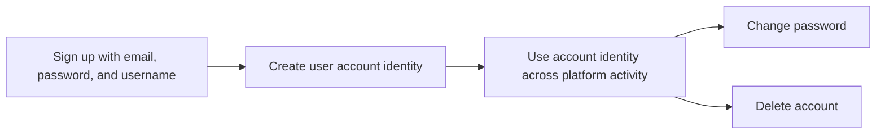

### User Profile Details

Each user has one public profile.
The profile contains a display name, bio text, and avatar image.
A user can edit only their own display name, bio text, and avatar image.
A user can view any other user’s profile.
The profile page shows the display name, bio text, avatar image, total karma score, the posts the user has created, and the comments the user has written.

If a user tries to edit another user’s profile details, the request is rejected.

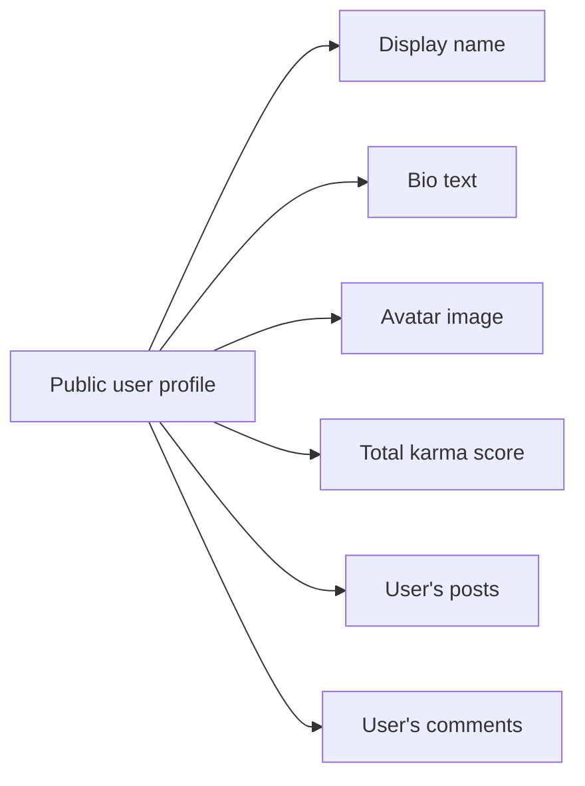

### Karma Score

Each user has a single karma score.
The karma score changes when other users vote on the user’s posts or comments.
An upvote increases the user’s karma by 1.
A downvote decreases the user’s karma by 1.
Removing a vote adjusts the user’s karma accordingly.
Karma may be negative.
The system must not treat a negative karma score as invalid.

If a vote is added, changed, or removed, the user’s karma is updated to reflect that vote action.

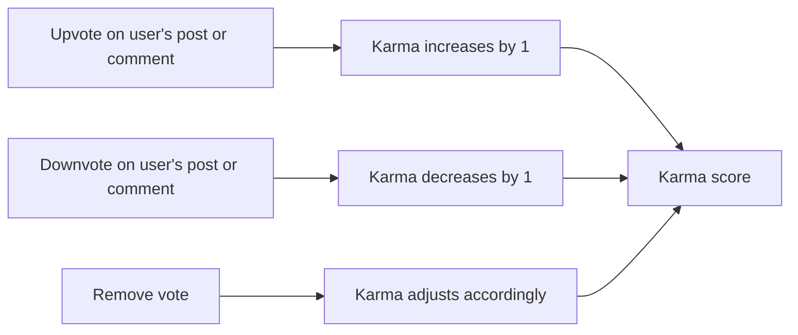

### Account Deletion and Content Removal

A user can delete their own account.
When an account is deleted, all posts created by that user are deleted.
When an account is deleted, all comments written by that user are deleted.
Account deletion removes the user’s presence from the platform as part of the user account rules.

If a user tries to delete an account that does not belong to them, the request is rejected.

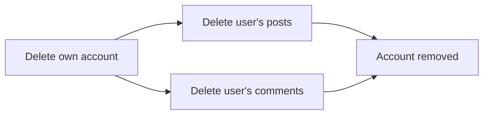

## Community Rules

A community must have a unique name, a description, and an icon image. The name must identify the community clearly and must not duplicate another community's name. Any user can create a community, and the creator automatically becomes the owner. The owner is the highest authority for that community and is part of the community's core domain identity. Communities are designed to be discoverable as shared public spaces, so their name and descriptive details must remain meaningful and recognizable. Each community tracks how many users subscribe to it, and that subscriber count is a visible community property. Users can search communities by name, so the naming rule matters for recognition and consistency. Community content should support browsing and participation without requiring hidden or private naming conventions. The community rules define the structure of the community itself, who starts it, and which visible attributes belong to it.

### Unique Community Name

A community must have a unique name that does not duplicate any other community's name.
The name must clearly identify the community and support recognition across the platform.
The community naming rule is defined once here and is the authoritative rule for uniqueness and distinct identity.

### Community Description Text

A community must include description text.
The description text is part of the community's visible identity and helps explain what the community is about.

### Community Icon Image

A community must include an icon image.
The icon image is part of the community's visible identity and helps users recognize the community in lists and on community pages.

### Community Owner

Every community must have one owner.
The owner is the highest authority for the community.
The owner role is part of the community's core identity and remains attached to the community as an enduring ownership relationship.

### Creator Becomes Owner

The user who creates a community becomes its owner.
Community ownership starts with the creator and is assigned automatically at creation time.

### Subscriber Count

Each community tracks a subscriber count as a visible community property.
The subscriber count reflects how many users are subscribed to the community.

### Browse All Communities

Users can browse all communities in a shared list.
The community list is intended to present communities as public spaces that can be discovered and explored by users.

### Search Communities by Name

Users can search for communities by name.
Search behavior is based on the community name as the primary browsing identifier for discovery and recognition.

### Public Community Identity

A community is a public identity within the platform rather than a hidden or private naming construct.
Its name, description text, and icon image must work together as recognizable public-facing identity elements.

## Post Rules

A post must belong to a community and must be created under the rules of that community. Users can only create posts in communities they are subscribed to, so membership is a prerequisite for posting. Every post must have a title, and the title is required regardless of post type. A post must be exactly one of three kinds: text, link, or image. Text posts carry written content, link posts carry a URL, and image posts carry an uploaded image. The post type determines which content is appropriate, and only one post type should apply at a time. Users can edit or delete only their own posts, which preserves ownership of the content. When a post is viewed, the platform expects to show its title, full content, author, community, vote score, comment count, and posted time as the standard post identity. Post rules also support the public feed experience by keeping the post's title and type-specific content consistent and recognizable.

### Post Ownership and Community Association

A post shall belong to one community.
A post shall be created within the community where the author is allowed to post.
A post shall remain associated with its community after creation.
A post shall identify its author as the user who created it.
A post shall reflect that the author owns the post for the purpose of editing and deleting it.
A post shall not be treated as independent of its community when displayed or reviewed.

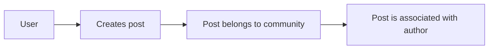

### Posting Eligibility and Subscription Requirement

A user shall be allowed to create a post only in a community to which the user is subscribed.
If a user is not subscribed to the community, the platform shall reject the post creation request.
A subscribed community shall qualify the user for posting in that community.
The subscription requirement shall apply before a post is created, not after creation.
A post shall not bypass the community subscription requirement through its type or content.

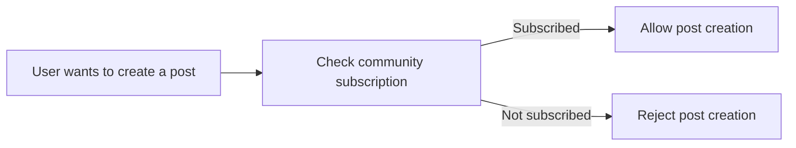

### Post Title Requirement

Every post shall have a title.
The title shall be required regardless of whether the post is a text post, link post, or image post.
A post shall not be considered complete without a title.
If a title is missing, the platform shall reject the post.
The title shall be the standard identifying text shown for the post in lists and post views.

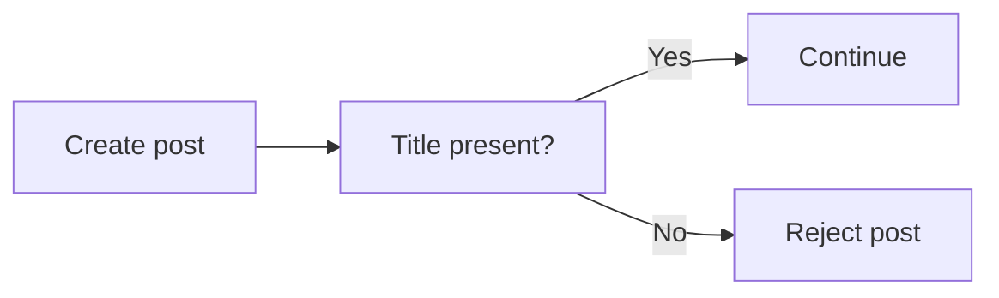

### Text Post Content

A text post shall contain written content.
The written content shall be the content type used only for text posts.
A text post shall not be treated as valid unless the text content is present.
The text content shall be the body of the post when the post is viewed in full.
A text post shall remain recognizable as a text post when displayed in lists and in the single-post view.

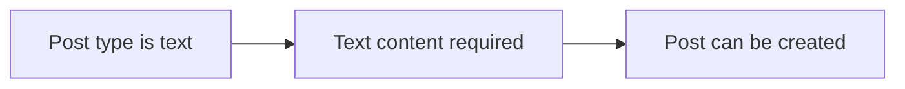

### Link Post URL

A link post shall contain a URL.
The URL shall be the content type used only for link posts.
A link post shall not be treated as valid unless the URL is present.
The URL shall be shown as the source content of the post when the post is viewed in full.
A link post shall remain recognizable as a link post when displayed in lists and in the single-post view.

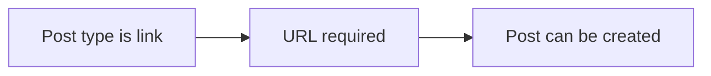

### Image Post Upload

An image post shall contain an uploaded image.
The uploaded image shall be the content type used only for image posts.
An image post shall not be treated as valid unless the image is present.
The uploaded image shall be the content shown for the post when the post is viewed in full.
An image post shall remain recognizable as an image post when displayed in lists and in the single-post view.

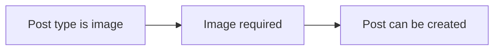

### Single Post Type Rule

A post shall be exactly one of three types: text, link, or image.
A post shall not combine more than one of these types at the same time.
The chosen type shall determine which content is required for the post.
If the post type is text, the platform shall expect text content.
If the post type is link, the platform shall expect a URL.
If the post type is image, the platform shall expect an uploaded image.
A post shall be rejected if its type is unclear or mixed.

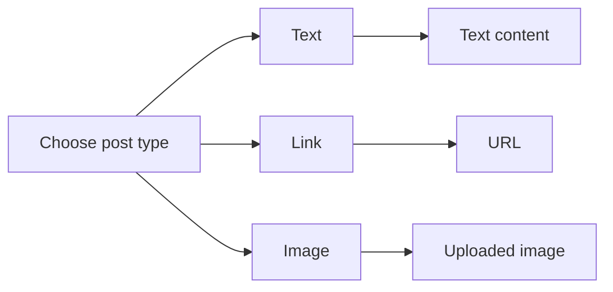

### Edit Own Post

A user shall be able to edit only their own post.
A user shall not be allowed to edit a post created by another user.
When a user edits their own post, the post shall keep its ownership and community association.
A user shall be able to update the post content in a way that remains consistent with the post type.
If the user is not the post author, the platform shall reject the edit.

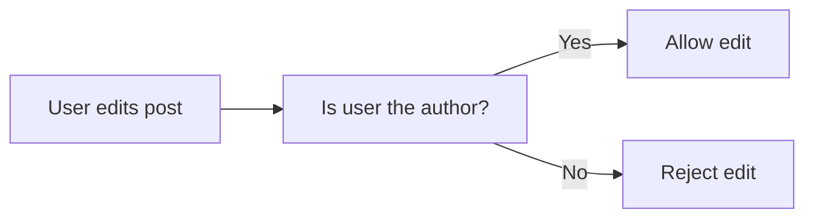

### Delete Own Post

A user shall be able to delete only their own post.
A user shall not be allowed to delete a post created by another user.
When a user deletes their own post, the post shall no longer be available as an active post.
The deletion rule shall preserve the requirement that only the author controls deletion of the post.
If the user is not the post author, the platform shall reject the delete request.

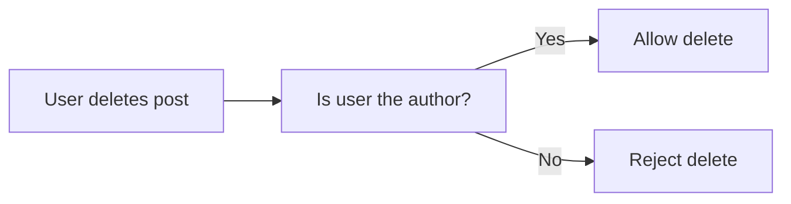

### Post View Details and Full Content Display

When a single post is viewed, the platform shall show the post title.
When a single post is viewed, the platform shall show the post's full content.
When a single post is viewed, the platform shall show the author.
When a single post is viewed, the platform shall show the community.
When a single post is viewed, the platform shall show the vote score.
When a single post is viewed, the platform shall show the comment count.
When a single post is viewed, the platform shall show when the post was posted.
The full content display shall present the entire post content for the post type, not only a preview.
The standard single-post view shall make the post's identity and content clear to readers.

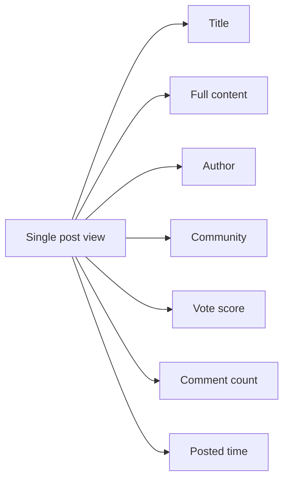

## Comment Rules

A comment can be written on any post, and replies can be written on any comment. Replies can continue without a depth limit, so the comment structure must support open-ended nesting. Each comment belongs to the content it responds to and carries its own authored text. Users can edit their own comments and delete their own comments, but they cannot change comments written by other users. A comment displays its author, content, vote score, time since posted, and any nested replies. Comment content is expected to remain readable in a threaded discussion and should represent a single contribution from one author. The unlimited reply structure means that a comment can function both as a direct response and as a parent to further discussion. Comment rules focus on ownership, nesting, and the shared display properties that make a discussion thread usable. These rules apply equally whether the comment appears directly on a post or deeper in a reply chain.

### Commenting on Posts and Replies

Users can write a comment directly on a post.
Users can reply to any comment, including replies to other replies.
Replies can continue without a depth limit, so a comment thread can grow to any level of nesting.
Each comment belongs to the content it responds to, whether that content is a post or another comment.
A comment represents one authored contribution within the discussion thread.

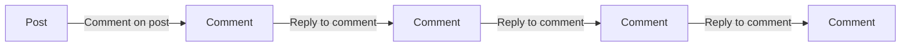

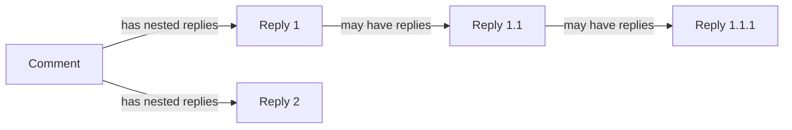

### Editing and Deleting Own Comments

A user can edit only their own comment.
A user cannot edit a comment written by another user.
A user can delete only their own comment.
A user cannot delete a comment written by another user.
When a comment is edited, it remains the same comment in the discussion thread and continues to participate in nesting as before.
When a comment is deleted, the system applies the deletion behavior defined for comments without changing the ownership rule for other comments in the thread.

### Comment Display Properties

Each comment displays its author.
Each comment displays its content.
Each comment displays its vote score.
Each comment displays the time since it was posted.
Each comment displays its nested replies.
The displayed content of a comment should support threaded discussion by making the parent-child reply relationship understandable to users.
The displayed vote score reflects the current total for that comment.
The displayed time since posted reflects how long ago the comment was created.

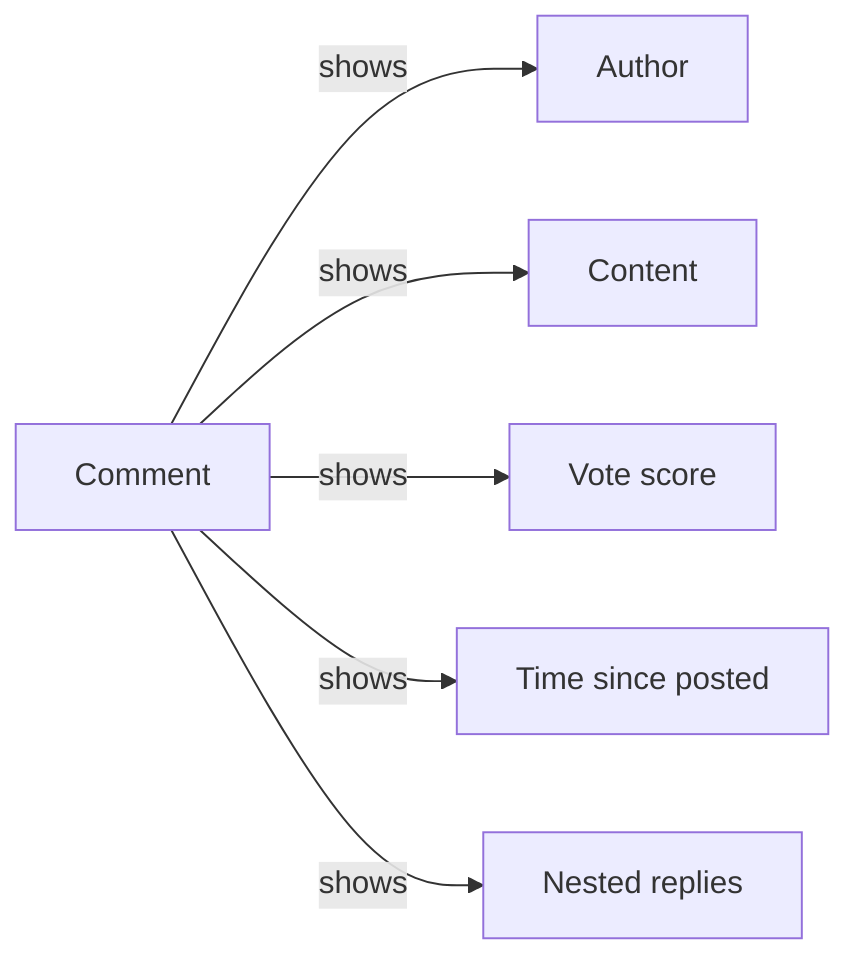

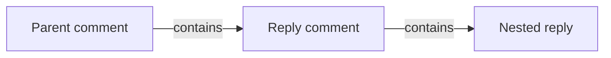

## CommunitySubscription Rules

A subscription connects a user to a community and represents the user's membership in that community. Any user can subscribe to any community, so the subscription rule is intentionally open to the broader platform audience. A user can also unsubscribe, which means the relationship is not permanent. Subscriptions are important because they control whether a user is allowed to create posts in that community. A user may have a list of all communities they are subscribed to, so the subscription relationship should remain clear and consistent. The community subscription also contributes to the community's subscriber count, which is part of the community's visible identity. Subscriptions should be treated as a direct link between the user and the community rather than as a general profile setting. The subscription rules define who is considered part of a community and what that membership means for participation.

### Community Membership Link

A community subscription is the business link that connects a user to a community and represents the user's membership in that community.
A subscription must exist only between one user and one community.
A user may have subscriptions to multiple communities, and a community may have subscriptions from multiple users.
The subscription link is the source of truth for whether a user is considered subscribed to a community.

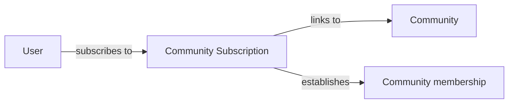

### Open Subscription Access

Any user may subscribe to any community.
The system must not restrict subscription based on community ownership or previous membership in another community.
A user may subscribe to a community that they can already view.
A community remains open for subscription unless it is already subscribed to by that same user.
If a user is already subscribed to a community, the system must treat that relationship as existing rather than creating a second membership link.

### Subscribe to Community

When a user subscribes to a community, the system records the user as a member of that community.
When a subscription is created, the community's subscriber count increases by one.
When a subscription is created, the community appears in the user's subscribed communities list.
When a user subscribes to a community, that subscription becomes the basis for participation eligibility in that community.
If the user is already subscribed, the system must not increase the subscriber count again.

### Unsubscribe from Community

When a user unsubscribes from a community, the system removes the user from that community's membership list.
When a subscription is removed, the community's subscriber count decreases by one.
When a user unsubscribes from a community, that community is removed from the user's subscribed communities list.
When a user unsubscribes, the membership link no longer supports posting eligibility in that community.
If the user is not subscribed, the system must not change the subscriber count.

### Subscription Required for Posting

A user must be subscribed to a community in order to create a post in that community.
Community participation eligibility for posting depends on an active community subscription.
If a user is not subscribed to a community, the system must reject post creation in that community.
If a user unsubscribes from a community, the user no longer has posting eligibility in that community.
This rule applies to every post type supported in the community.

### Subscribed Communities List

The system must provide each user with a list of the communities they are subscribed to.
The list must include every community for which the user has an active subscription.
The list must exclude communities the user has unsubscribed from.
The list is based on the user's membership links and not on communities the user merely views or searches.
The subscribed communities list is the user-facing reflection of community membership.

### Subscriber Count

Each community has a subscriber count that reflects the number of active subscriptions to that community.
The subscriber count increases when a new subscription is created.
The subscriber count decreases when an existing subscription is removed.
The subscriber count must not count the same user more than once for the same community.
The subscriber count is part of the community's visible identity and must remain consistent with the active membership list.

## Vote Rules

A vote belongs to either a post or a comment and represents one user's stance on that content. The vote can be an upvote or a downvote, and each user can vote only once on the same piece of content. A user may change a vote from upvote to downvote or from downvote to upvote, but only one active vote should remain in effect at a time. A user may also remove a vote entirely, which restores the content score by undoing that user's contribution. Vote score is calculated as total upvotes minus total downvotes, so the result can be positive, zero, or negative. When a vote changes, the user's karma is also affected according to the same one-point rule for posts and comments. The voting rules are shared between posts and comments, keeping the interaction model consistent across content types. Votes are part of content evaluation rather than content ownership, so they follow the identity of the voter rather than the author. These rules ensure that a vote always reflects a single user's current opinion on a single target.

### Single Vote and Active Vote Rule

A user can have only one active vote on a specific piece of content at a time.
A vote applies to either a post or a comment, but not both.
If a user has already voted on the same content, the system treats that vote as the only active vote for that user on that content.
The active vote represents the user's current opinion on that content and is the only vote counted for that user on that content.
The system does not allow a second independent vote from the same user on the same post or comment.
The voting rules are the same for post voting and comment voting.

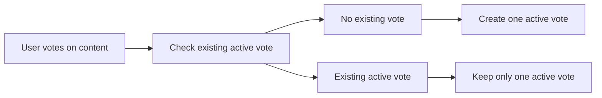

### Upvote and Downvote Rules

A user may upvote a post or comment to express a positive vote.
A user may downvote a post or comment to express a negative vote.
An upvote adds 1 to the content's vote score.
A downvote subtracts 1 from the content's vote score.
The same upvote and downvote rules apply to both posts and comments.
The vote score reflects the total effect of all active votes on the content.

```mermaid
flowchart LR
    A["User selects upvote"] --> B["Content score increases by 1"]
    C["User selects downvote"] --> D["Content score decreases by 1"]
```

### Change Vote Direction and Remove Vote

A user may change a vote from upvote to downvote.
A user may change a vote from downvote to upvote.
When the vote direction changes, the previous vote effect is removed and the new vote effect is applied.
A user may remove a vote entirely from a post or comment.
When a vote is removed, the content no longer counts that user's vote in its score.
Removing a vote restores the score by undoing that user's contribution.
Only one active vote remains in effect after a direction change.

```mermaid
flowchart LR
    A["Active upvote"] -->|"Change direction"| B["Active downvote"]
    B -->|"Change direction"| A
    A -->|"Remove vote"| C["No active vote"]
    B -->|"Remove vote"| C
```

### Vote Score Calculation

Vote score is calculated as total upvotes minus total downvotes.
The calculation applies to both posts and comments.
A content item can have a positive vote score, a zero vote score, or a negative vote score.
The score changes whenever an active vote is added, removed, or changed in direction.
The score shown for content always reflects the current active votes only.
Voting is a form of content evaluation, so the score measures community response to the content rather than ownership or authorship.

```mermaid
flowchart LR
    A["Total upvotes"] --> C["Vote score"]
    B["Total downvotes"] --> C
    C["Upvotes minus downvotes"]
```

### Karma Changes From Votes

When someone upvotes a user's post or comment, that user's karma increases by 1.
When someone downvotes a user's post or comment, that user's karma decreases by 1.
When someone removes a vote, the user's karma adjusts accordingly to undo the removed vote's effect.
When someone changes a vote direction, the user's karma adjusts according to the removal of the previous vote and the application of the new vote.
Karma is a single score per user and may be negative.
Karma changes from votes apply to both posts and comments.

```mermaid
flowchart LR
    A["Upvote post or comment"] --> B["Author karma +1"]
    C["Downvote post or comment"] --> D["Author karma -1"]
    E["Remove vote"] --> F["Undo vote effect on karma"]
    G["Change vote direction"] --> H["Adjust karma to reflect new vote"]
```

### Content Evaluation Across Posts and Comments

Voting is used to evaluate content across both posts and comments.
The same voting behavior, score calculation, and karma impact rules apply consistently to both content types.
A post and a comment are each evaluated by their own vote score based on votes placed directly on that item.
A vote on one item does not evaluate a different item.
The voting result reflects the community's current evaluation of the specific post or comment being voted on.


## ModerationRole Rules

The creator of a community becomes the owner, and the owner has the highest moderation authority. The owner can assign moderator roles to other users, and moderators can also assign moderator roles to additional users. A moderator role gives a user authority inside that specific community rather than across the whole platform. The owner cannot be removed by moderators, which protects the highest role in the community hierarchy. Moderators cannot remove one another unless the owner performs the removal, so peer removal is restricted. The moderation role is therefore hierarchical and must preserve the distinction between owner and moderator. Only users with the correct role should be considered moderators for that community, and role authority should be understood as community-specific. These rules define who holds moderation power and how that power is inherited or limited within the community. The moderation role is a governance concept, not a general user account property.

### Community Owner and Highest Moderation Authority

THE system SHALL treat the creator of a community as that community's owner.
THE system SHALL treat the owner as the highest moderation authority within that community.
THE system SHALL distinguish the owner's moderation authority from the authority of all other moderators in the same community.
WHILE a user is the owner of a community, THE system SHALL consider that user to hold the highest moderation authority for that community.
THE system SHALL treat moderation authority as specific to the community in which the role exists, rather than as a platform-wide authority.

```mermaid
flowchart LR
    A["Community creator"] -->|"Becomes"| B["Community owner"]
    B -->|"Has highest authority"| C["Highest moderation authority"]
    C -->|"Applies within"| D["Specific community"]
```

### Adding Moderators

THE system SHALL allow the owner of a community to add moderators to that community.
THE system SHALL allow a moderator to add other moderators to the same community.
WHERE a user is added as a moderator for a community, THE system SHALL treat that role as applying only to that community.
THE system SHALL preserve the owner's higher authority when moderators are added to the community.
THE system SHALL record moderator authority as part of the community's role hierarchy.

```mermaid
sequenceDiagram
    participant O as Owner
    participant S as System
    participant M as Moderator
    O->>S: Add moderator
    S->>S: Assign community-specific moderation authority
    S-->>M: Moderator role granted
```

### Removing Moderators

THE system SHALL allow the owner of a community to remove moderators from that community.
THE system SHALL prevent a moderator from removing the owner of that community.
THE system SHALL prevent a moderator from removing another moderator in the same community.
THE system SHALL allow removal of a moderator only when the removal is performed by the owner of that community.
IF the target user is the owner of the community, THEN THE system SHALL reject the removal attempt.
IF the actor is a moderator and the target user is another moderator, THEN THE system SHALL reject the removal attempt.

```mermaid
flowchart LR
    A["Removal attempt"] --> B{"Target is owner?"}
    B -->|"Yes"| C["Reject"]
    B -->|"No"| D{"Actor is owner?"}
    D -->|"Yes"| E["Allow moderator removal"]
    D -->|"No"| F{"Target is moderator?"}
    F -->|"Yes"| C
    F -->|"No"| C
```

### Role Hierarchy and Community-Specific Scope

THE system SHALL treat moderation roles as hierarchical within a community.
THE system SHALL maintain the owner above all moderators in the community role hierarchy.
THE system SHALL treat moderator authority as lower than owner authority and higher than no moderation role.
THE system SHALL treat a moderation role as valid only in the community where it was assigned.
THE system SHALL not treat a moderation role in one community as authority in any other community.
THE system SHALL recognize a user as a moderator only for the community in which the role exists.

```mermaid
flowchart LR
    A["No moderation role"] -->|"Assigned"| B["Moderator"]
    B -->|"Promoted to creator-owned position"| C["Owner"]
    C -->|"Highest authority in community"| D["Community role hierarchy"]
```

## Ban Rules

A ban applies to a user within a specific community and limits that user's participation there. Moderators can ban users from their community, and they can also unban them later. A banned user is blocked from creating posts or comments in that community, but the ban does not remove the ability to view content. Ban information includes who was banned and why, so the reason is an important part of the moderation record. A ban is community-specific, meaning the same user may still participate elsewhere on the platform. The ban rules support moderation control without turning the community into a closed private space. Because banned users can still view content, the ban focuses on participation restrictions rather than access removal. The ban concept is tied to community safety and enforcement, and it must remain distinct from account deletion or role assignment. These rules define the consequences and scope of a moderation ban.

### Community Ban

A community ban is a restriction applied to a specific user within a specific community. It limits that user's participation only in the community where the ban was applied and does not affect the user's ability to participate in other communities.

A community ban shall be treated as a moderation enforcement action rather than an account-level punishment.

When a user is banned from a community, the system shall prevent that user from creating new posts in that community.

When a user is banned from a community, the system shall prevent that user from creating new comments in that community.

When a user is banned from a community, the system shall still allow that user to view content in that community.

A ban shall be specific to one community and one user, and the same user may have a different participation status in other communities.

A ban shall not remove the user from the platform or delete the user's account.

A ban shall function as a participation limitation, not as a content visibility restriction.

```mermaid
flowchart LR
    A["User in community"] --> B["Ban applied"]
    B --> C["Posting blocked"]
    B --> D["Commenting blocked"]
    B --> E["Content still viewable"]
```

### Ban Record and Ban Reason

A ban record shall identify the user who was banned and the community in which the ban applies.

A ban record shall include the ban reason provided at the time of the moderation action.

The ban reason shall be stored as part of the moderation record so that moderators can understand why the action was taken.

A ban reason shall be required whenever a user is banned from a community.

The ban record shall support later review of the moderation enforcement decision.

The ban record shall remain tied to the specific community moderation context in which it was created.

The ban record shall represent the user's current banned state in that community until the ban is removed.

If a ban is applied without a reason, the action shall be rejected.

```mermaid
flowchart LR
    A["Ban action"] --> B["Ban reason provided"]
    B --> C["Ban record created"]
    C --> D["User restricted in community"]
```

### Unban User

A community ban may be removed when the user is unbanned from that community.

When a user is unbanned from a community, the system shall remove the participation restriction for that community.

When a user is unbanned from a community, the system shall allow that user to create posts in that community again if no other restriction applies.

When a user is unbanned from a community, the system shall allow that user to create comments in that community again if no other restriction applies.

An unban shall apply only to the specific community from which the user was banned.

An unban shall not affect the user's relationship with other communities.

If a user is not currently banned in a community, an unban request for that community shall be rejected.

```mermaid
flowchart LR
    A["User banned"] --> B["Unban user"]
    B --> C["Participation restored"]
    C --> D["Posting allowed"]
    C --> E["Commenting allowed"]
```

### Participation Limitation Enforcement

The ban rules shall enforce participation limitations only within the affected community.

The ban rules shall block posting attempts by banned users in the affected community.

The ban rules shall block commenting attempts by banned users in the affected community.

The ban rules shall allow browsing and reading content by banned users in the affected community.

The ban rules shall keep the restriction aligned with the moderation record so that the user's banned state is consistently recognized.

The ban rules shall ensure that banning a user does not convert the community into a private space.

The ban rules shall preserve the distinction between a ban and other community moderation actions.

If a banned user attempts to interact in a way that the ban restricts, the action shall be rejected.

```mermaid
flowchart LR
    A["Banned user"] --> B["Attempts to post"] --> C["Rejected"]
    A --> D["Attempts to comment"] --> E["Rejected"]
    A --> F["Views content"] --> G["Allowed"]
```

## Report Rules

Any user can report a post or comment when they believe it should be reviewed. A report must include a reason, and that reason is a required part of the report itself. A report is attached to the content being reported and identifies who submitted it. Moderators can review reports for their community and see the reported content, the reporter, and the reason together. A report may be approved, which means the reported content is removed, or dismissed, which means the content stays. Once a report is dismissed, it no longer remains in the active report list. Reports are community-scoped so that moderators only manage reports for their own community. The reporting rules support community moderation by creating a clear signal for review and resolution. A report is therefore a moderation record centered on concern, reviewer visibility, and final handling outcome.

### Reporting a Post or Comment

A user may report a post or a comment when they want that content to be reviewed by moderators in the related community.
A report applies to one reported item at a time and must clearly identify whether the reported item is a post or a comment.
A report is specific to the community that contains the reported content, and it is handled within that community’s moderation scope.
A report functions as a moderation record for the reported item and the concern raised about it.

```mermaid
flowchart LR
    A["User sees post or comment"] --> B["User submits report"]
    B --> C["Report becomes a moderation record"]
    C --> D["Moderators review report in the related community"]
```

### Required Report Reason

Every report must include a reason written by the reporting user.
The reason is part of the report itself and cannot be omitted.
If a report is missing its reason, the report is rejected.
The reason is used by moderators when reviewing the reported content.

```mermaid
flowchart LR
    A["Report submission"] --> B["Reason provided"]
    B --> C["Report accepted"]
    A --> D["Reason missing"]
    D --> E["Report rejected"]
```

### Reported Content and Reporter Identity

A report must store a reference to the reported content so moderators can see exactly what is being reviewed.
A report must also identify the user who submitted it.
Moderators reviewing the report can see the reported content, the reporter, and the reason together.
A report without a clear reported content reference or reporter identity is not a complete moderation record.

```mermaid
sequenceDiagram
    participant U as User
    participant S as System
    participant M as Moderator
    U->>S: Submit report with reason
    S->>S: Record reported content and reporter identity
    M->>S: Open report for review
    S-->>M: Show reported content, reporter, and reason
```

### Moderator Review of Reports

Moderators can view reports for their community.
A moderator review always concerns reports attached to content within that community.
During review, moderators can inspect the reported content, the reporter, and the reason before choosing a result.
The moderation record remains available for review until it is approved or dismissed.

```mermaid
flowchart LR
    A["Community report list"] --> B["Moderator opens report"]
    B --> C["Moderator reviews content, reporter, and reason"]
    C --> D["Approve report"]
    C --> E["Dismiss report"]
```

### Approve Report and Remove Content

When a moderator approves a report, the reported post or comment is removed.
Approval is the moderation outcome used when the report is upheld.
Once the reported content is removed through approval, the report is no longer handled as an active report.
The approved report remains a moderation record of the decision that was made.

```mermaid
flowchart LR
    A["Report under review"] --> B["Approve report"]
    B --> C["Reported content removed"]
    C --> D["Moderation record preserved"]
```

### Dismiss Report and Keep Content

When a moderator dismisses a report, the reported post or comment stays in place.
Dismissal is the moderation outcome used when the report is not upheld.
A dismissed report is removed from the active report list.
The dismissal outcome remains part of the moderation record even though the report is no longer active.

```mermaid
flowchart LR
    A["Report under review"] --> B["Dismiss report"]
    B --> C["Reported content kept"]
    B --> D["Removed from active report list"]
```

### Community Report List

Each community has its own report list for moderation review.
The report list contains reports for content in that community only.
Moderators use the community report list to find reports waiting for review.
Reports that have been dismissed do not remain in the active community report list.

```mermaid
flowchart LR
    A["Community report list"] --> B["Active reports"]
    B --> C["Report approved"]
    B --> D["Report dismissed"]
    D --> E["Removed from active list"]
```

# Data Browsing Expectations

Business expectations for how users browse, find, and navigate through lists of data.

## List Browsing Expectations

Define business expectations for how users find, filter, and browse lists.

### Filtering

Users can narrow browseable lists by the criteria explicitly supported for that list.

For community browsing, the system lets users filter the list by community name so they can find a specific community more easily.

For post browsing, the system shows the appropriate set of posts for the selected feed: the home feed is limited to communities the user is subscribed to, the popular feed includes posts from all communities, and the community feed includes posts from one specific community.

For comment browsing, the system shows comments for a post in the selected comment order and keeps replies grouped beneath their parent comment.

When a browseable list has no matching items after filtering, the system shows an empty result rather than unrelated items.

```mermaid
flowchart LR
    A["Browseable list"] --> B["Apply supported filter"]
    B --> C["Matching items"]
    B --> D["No matching items"]
    C --> E["Show filtered list"]
    D --> F["Show empty result"]
```

### Sorting

Users can sort browseable post and comment lists only by the order options supported for that list.

Post lists support the following sorting options: hot, new, top, and controversial.

Hot order shows recent posts with many upvotes before other posts.

New order shows the most recently created posts before older posts.

Top order shows posts with the highest vote score first, and the top view can be limited to today, this week, this month, this year, or all time.

Controversial order shows posts with many votes and a vote score close to zero before other posts.

Comment lists support the following sorting options: best, new, and controversial.

Best order shows comments with the highest vote score first.

New order shows the most recent comments first.

Controversial order shows comments with many votes and a vote score close to zero first.

If two items are otherwise equivalent under the selected sort order, the system keeps their relative order consistent within that view.

```mermaid
flowchart LR
    A["Post or comment list"] --> B["Select sort option"]
    B --> C["Apply selected order"]
    C --> D["Show sorted results"]
```

### Pagination

All browseable lists are paginated so users receive items in manageable groups.

The system shows only one page of results at a time for feeds, community lists, community subscription lists, post lists, and comment lists when those lists are presented in browseable form.

Users can move between pages to continue browsing the full list.

Each page contains a subset of the available items, and items already shown on one page are not duplicated on another page of the same list view.

When a requested page has no items, the system shows an empty page state instead of repeating items from another page.

```mermaid
sequenceDiagram
    participant U as User
    participant S as System
    U->>S: Request next page of a list
    S->>S: Select the next subset of items
    S-->>U: Show the next page of results
```

# Error Conditions

Business error scenarios and how the system should respond.

## Error Scenarios

Describe error conditions and expected system responses in natural language.

### Invalid account and community creation

A sign-up request is rejected if the email address is missing.
A sign-up request is rejected if the password is missing.
A sign-up request is rejected if the username is missing.
A sign-up request is rejected if the username is not unique.
A community creation request is rejected if the community name is missing.
A community creation request is rejected if the community name is not unique.
A community creation request is rejected if the description text is missing.
A community creation request is rejected if the icon image is missing.
If account creation or community creation is rejected for a missing or duplicate required value, the system does not create the account or community.

```mermaid
flowchart LR
    A["Create account or community"] --> B["Validate required values"]
    B -->|"Missing or duplicate value"| C["Reject request"]
    B -->|"All values valid"| D["Create record"]
```

### Invalid post and comment submissions

A post creation request is rejected if the user is not subscribed to the target community.
A post creation request is rejected if the title is missing.
A post creation request is rejected if the post type does not match the required content for that type.
A text post creation request is rejected if the text content is missing.
A link post creation request is rejected if the URL is missing.
An image post creation request is rejected if the uploaded image is missing.
A comment creation request is rejected if the target post does not exist.
A reply creation request is rejected if the target comment does not exist.
A comment or reply creation request is rejected if the user is banned from the community where the content belongs.
If post or comment submission is rejected, no post or comment is created.

```mermaid
flowchart LR
    A["Submit post or comment"] --> B["Check target and access"]
    B -->|"Target missing or access denied"| C["Reject request"]
    B -->|"Target valid and access allowed"| D["Validate required content"]
    D -->|"Invalid content type or missing content"| C
    D -->|"Valid content"| E["Create content"]
```

### Voting failures and duplicate vote cases

A vote action is rejected if the target post does not exist.
A vote action is rejected if the target comment does not exist.
A vote action is rejected if the user attempts to cast more than one active vote on the same post or comment.
A vote change request is rejected if the user has not already voted on the same post or comment.
A vote removal request is rejected if the user has not already voted on the same post or comment.
If a vote action is rejected, the vote score does not change.
If a vote is removed, the user's earlier vote is no longer counted.

```mermaid
flowchart LR
    A["Vote action"] --> B["Check target exists"]
    B -->|"Target missing"| C["Reject request"]
    B -->|"Target exists"| D["Check existing vote"]
    D -->|"Duplicate active vote or no vote to change/remove"| C
    D -->|"Allowed"| E["Apply vote outcome"]
```

### Moderation, reporting, and browsing exceptions

A moderation action to delete a post or comment is rejected if the target content does not belong to the moderator's community.
A ban action is rejected if the target user is the community owner.
A moderator removal action is rejected if the target moderator is the community owner.
A moderator removal action is rejected if the target moderator is another moderator and the actor is not the owner.
A report submission is rejected if the reason text is missing.
A report review action is rejected if the report does not belong to the moderator's community.
A report approval action is rejected if the reported content no longer exists.
A home feed request is rejected for logged-out users.
If a reporting or moderation request is rejected, the report status and reported content do not change.
If browsing a community or popular feed includes deleted content, the deleted content is not shown in the list.

```mermaid
flowchart LR
    A["Moderation or report action"] --> B["Check community scope"]
    B -->|"Out of scope"| C["Reject request"]
    B -->|"Within scope"| D["Check action-specific rule"]
    D -->|"Rule failed"| C
    D -->|"Rule passed"| E["Apply change"]
```