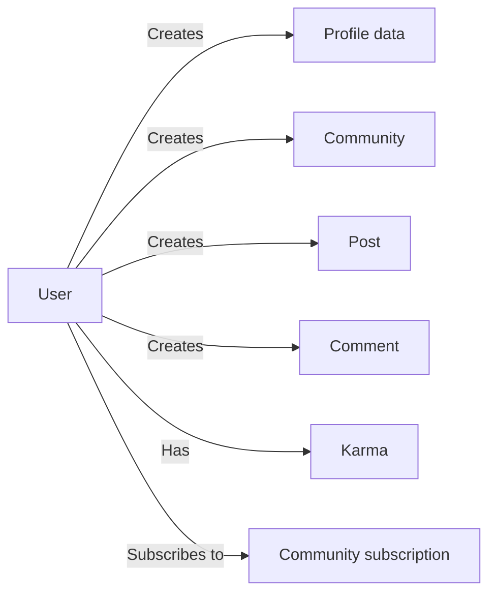
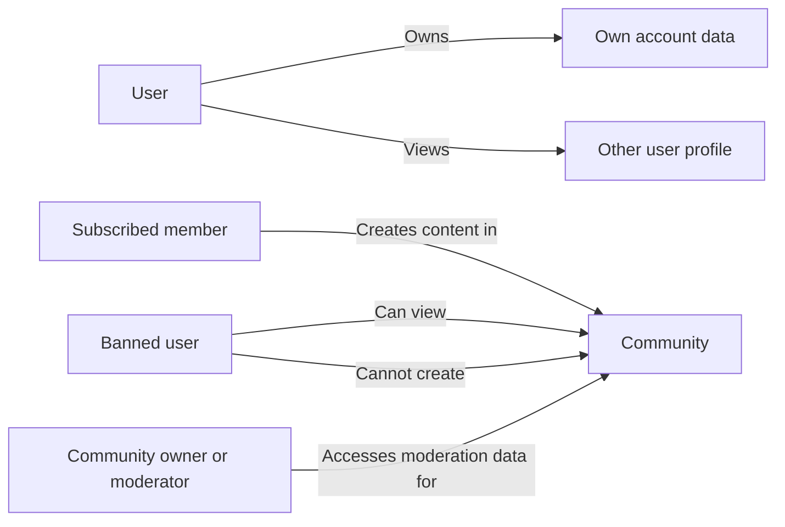
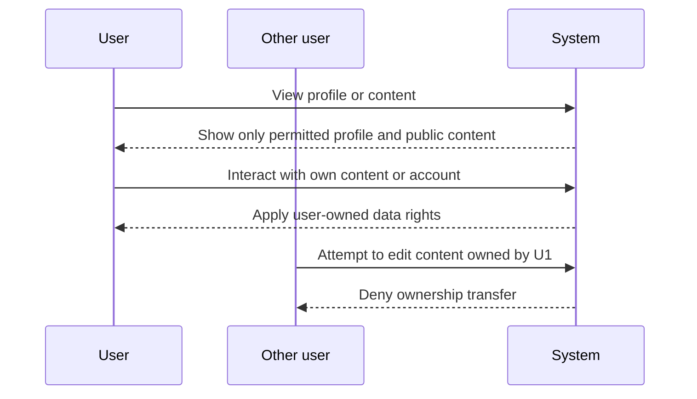
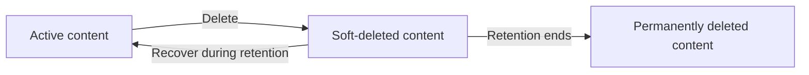
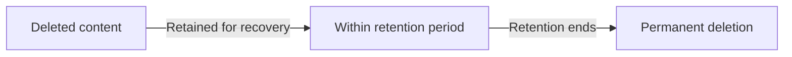
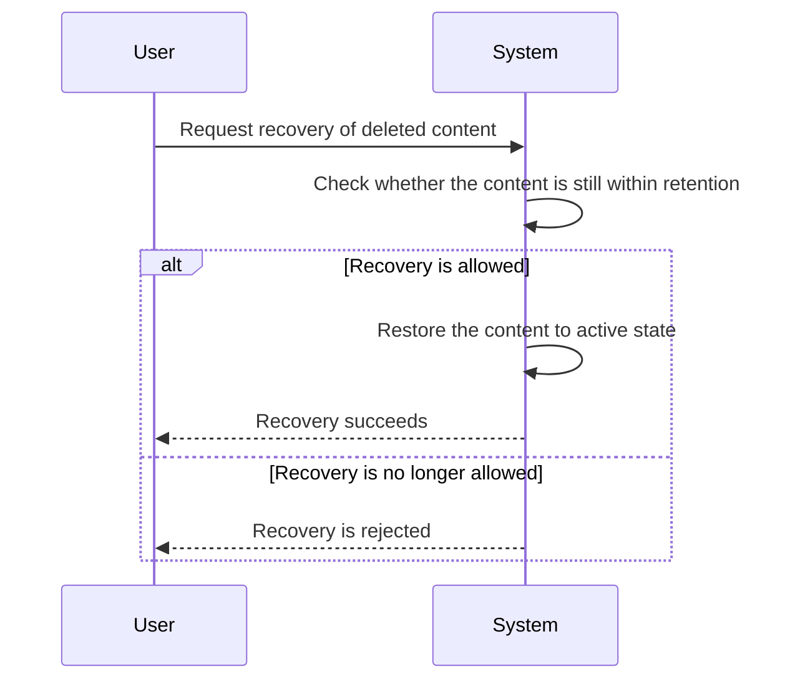
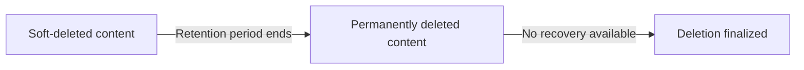

**communityPlatform — Data ownership, privacy, retention, and recovery policies**

Data ownership, privacy, retention, and recovery policies

# Data Policies

Data ownership, privacy, retention, and recovery policies from a business perspective.

## Data Ownership and Privacy

Define who owns what data, who can access it, and privacy boundaries between users.

### Data Ownership

Users own their account profile data, including their display name, bio text, and avatar image. A user controls updates to their own profile data and may change it at any time through the profile editing capabilities defined elsewhere.

A user owns the communities they create as the community owner. Ownership of a community is tied to the creating user unless the business rules for moderator authority state otherwise.

Users own the posts and comments they create. The ownership of a post or comment remains with its author even when the content appears in public feeds or within a community context.

Karma is associated with the user it belongs to and is part of that user’s account-level data. Karma is not owned by other users who contribute votes to it.

Community subscription membership, votes, moderation roles, bans, and reports are system-managed relationships or records rather than user-owned profile content. They exist to support access, moderation, and community operation and are handled according to the rules defined in the other SRS sections.

### Access Control and Data Isolation

A user can access their own account data and the content they create.

A user can view another user’s profile when that profile is available for viewing, but viewing another profile does not transfer ownership or grant editing rights.

Community content is isolated by community membership and moderation status. A user may create posts in a community only when subscribed, and a banned user remains unable to create posts or comments in that community while still being able to view its content.

Community moderators and owners can access the moderation information for their own community, including reports and banned-user information, because that access is part of their community authority. This access does not extend to unrelated communities.

Users can browse public community lists and community feeds according to the visibility and access rules defined in the other files, but those browsing capabilities do not grant access to private ownership actions on content they do not own.

### Privacy Boundaries

A user’s profile data is visible to other users through profile viewing, but only the profile information defined for display is shared.

A user’s posts and comments may be visible wherever the platform surfaces that content, but the platform does not treat another user’s content as privately editable by anyone except its author or, where applicable, the community moderation authorities defined elsewhere.

A user’s subscription choices are private membership relationships used to determine feed access and posting eligibility. Other users are not given ownership over those relationships.

Voting activity, reports, and moderation actions are treated as interaction records tied to the relevant user and community context. They are used for platform operation and do not change the underlying ownership of the content being voted on, reported, or moderated.

When a user deletes their account, the user’s posts and comments are also deleted, reflecting the privacy boundary that a user controls removal of their own account-linked content as defined in the account lifecycle requirements.

## Data Retention and Recovery

Define what happens to deleted data, how long it is retained, and how users can recover it.

### Soft-Delete

Content that a user deletes is not removed immediately when the platform supports recovery. Instead, the system keeps the deleted item in a deleted state during the retention period so that it can be restored if recovery is allowed.

The deleted state applies to user-deleted content that is covered by this recovery policy, including posts and comments affected by account deletion. While content remains in the deleted state, it is treated as unavailable to normal users.

### Retention

The system retains soft-deleted content for a defined retention period before it becomes permanently deleted.

The retention period is the time window during which deleted content may still be recovered. During this period, the content remains associated with the original account or content item for recovery purposes, unless the retention policy for that content has already ended.

When a user deletes an account, the system applies the same retention concept to the user’s posts and comments so that their deletion is governed by the recovery policy described in this unit.

### Recovery

The system allows recovery of soft-deleted content while it is still within the retention period.

Recovered content returns to an active state and becomes available again according to the normal platform behavior for that type of content.

Recovery applies only before permanent deletion has occurred. Once content has been permanently deleted, it can no longer be recovered through this policy.

### Permanent-Deletion

When the retention period ends, the system permanently deletes the content that was previously soft-deleted.

Permanently deleted content is no longer recoverable through the platform’s recovery process.

Account deletion also results in the user’s posts and comments being permanently deleted after the applicable retention period ends. After permanent deletion, the content is treated as removed from the platform for recovery purposes.

